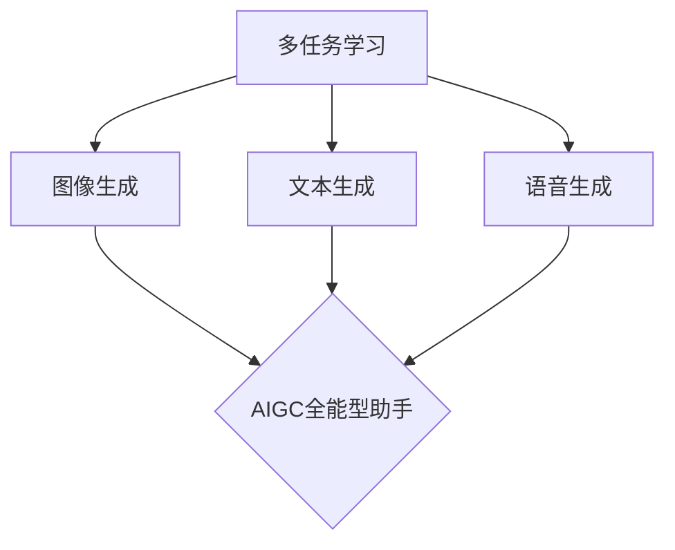

                 

### 《多任务学习在AIGC全能型助手中的作用》

关键词：多任务学习，AIGC全能型助手，人工智能，机器学习，计算机编程，深度学习，神经网络，模型训练，数据预处理，算法优化，性能评估

摘要：本文将探讨多任务学习在AIGC（AI-Generated Content，AI生成内容）全能型助手中的重要作用。首先，我们将介绍多任务学习的基本概念、原理及其在人工智能领域的应用。随后，我们将详细阐述AIGC全能型助手的定义、特点及在现实生活中的应用场景。接着，本文将分析多任务学习在AIGC全能型助手中的具体应用案例，并探讨多任务学习在此过程中面临的挑战和解决方案。最后，我们将通过实际案例展示多任务学习在AIGC全能型助手中的实际效果，并提出未来发展趋势和最佳实践建议。

### 1. 背景介绍

#### 1.1 多任务学习的起源与发展

多任务学习（Multitask Learning）起源于20世纪90年代，最初主要用于解决机器学习领域中单一任务学习（Single-Task Learning）的局限性。传统的单一任务学习模型在一次训练过程中仅专注于完成一个特定的任务，如图像分类、语音识别或自然语言处理等。然而，现实世界中的许多任务往往具有相互关联的特征，例如，在图像识别和文本分类中，图像内容与文本标签之间可能存在一定的关联性。

多任务学习的出现旨在利用任务间的关联性，通过共享模型结构和知识，提高学习效率、降低过拟合风险，并增强模型的泛化能力。自多任务学习概念提出以来，随着深度学习技术的不断发展，多任务学习在人工智能领域取得了显著的成果。如今，多任务学习已经成为机器学习和深度学习中的重要研究方向之一，广泛应用于计算机视觉、自然语言处理、语音识别等众多领域。

#### 1.2 AIGC全能型助手的定义与特点

AIGC（AI-Generated Content，AI生成内容）全能型助手是指一种利用人工智能技术，能够根据用户需求生成多样化内容的高级智能助手。与传统的单一功能智能助手不同，AIGC全能型助手具备多任务处理能力，能够同时处理图像生成、文本生成、语音生成等多种任务。

AIGC全能型助手的主要特点包括：

1. **多任务处理能力**：能够同时处理多种任务，如图像生成、文本生成、语音生成等，实现一体化服务。
2. **自适应学习能力**：根据用户需求和环境变化，自动调整任务优先级和策略，提高用户体验。
3. **跨领域应用**：能够应用于图像、文本、语音等多个领域，满足不同场景下的需求。
4. **实时响应**：具备快速响应能力，能够实时生成内容，提高工作效率。

#### 1.3 本文的研究目的与结构

本文旨在探讨多任务学习在AIGC全能型助手中的应用，分析其面临的挑战和解决方案，并展示实际案例。文章结构如下：

1. **引言**：介绍多任务学习和AIGC全能型助手的基本概念。
2. **多任务学习基础**：详细讲解多任务学习的原理、流程和技术。
3. **AIGC全能型助手概述**：介绍AIGC全能型助手的基本概念、特点和应用场景。
4. **多任务学习在AIGC全能型助手中的应用**：具体讲解多任务学习在AIGC全能型助手中的应用实例。
5. **多任务学习的挑战与解决方案**：分析多任务学习在AIGC全能型助手中面临的挑战及解决方案。
6. **案例研究**：通过实际案例展示多任务学习在AIGC全能型助手中的应用。
7. **总结与展望**：总结全书内容，对未来的发展方向进行展望。

### 2. 核心概念与联系

#### 2.1 多任务学习的原理

多任务学习（Multitask Learning）是一种机器学习技术，旨在同时训练多个相关任务，以提高学习效率和模型性能。其基本原理是通过共享模型结构和知识，利用任务间的关联性，减少参数冗余，降低过拟合风险，并提高模型的泛化能力。

多任务学习可以分为以下几种类型：

1. **硬参数共享**：多个任务共享相同的参数，即模型结构，从而实现任务间的知识转移。
2. **软参数共享**：多个任务使用不同的模型结构，但在训练过程中共享某些子模块或层。
3. **独立训练**：多个任务分别进行训练，但在训练过程中通过某种机制进行信息交互。

#### 2.2 多任务学习的技术

多任务学习的技术主要包括以下几个方面：

1. **损失函数设计**：多任务学习中的损失函数需要综合考虑各个任务的损失，以平衡各任务之间的权重。
2. **模型结构设计**：多任务学习模型的结构设计要考虑任务间的关联性，选择合适的网络结构，如多层感知机、卷积神经网络（CNN）或循环神经网络（RNN）等。
3. **训练策略优化**：多任务学习的训练策略要考虑如何平衡任务间的训练资源，防止某些任务过拟合或欠拟合。

#### 2.3 多任务学习与AIGC全能型助手的联系

多任务学习在AIGC全能型助手中的应用主要体现在以下几个方面：

1. **跨领域任务处理**：AIGC全能型助手需要同时处理图像、文本、语音等多种任务，多任务学习技术能够有效提升助手在多领域任务中的处理能力。
2. **自适应学习能力**：多任务学习技术能够帮助AIGC全能型助手根据用户需求和环境变化，自适应调整任务优先级和策略，提高用户体验。
3. **知识共享与迁移**：多任务学习技术通过任务间的知识共享和迁移，提高AIGC全能型助手在各个领域中的性能，实现一体化服务。

#### 2.4 Mermaid 流程图

为了更好地展示多任务学习在AIGC全能型助手中的应用，我们使用Mermaid流程图进行描述。



图1：多任务学习在AIGC全能型助手中的应用流程

### 3. 核心算法原理讲解

#### 3.1 多任务学习的算法原理

多任务学习的算法原理主要包括以下几个方面：

1. **损失函数**：多任务学习的损失函数需要综合考虑各个任务的损失，以平衡各任务之间的权重。常见的损失函数有均方误差（MSE）、交叉熵损失等。

2. **共享网络结构**：多任务学习的网络结构可以选择硬参数共享或软参数共享。硬参数共享意味着多个任务共享相同的网络参数，而软参数共享则是多个任务使用不同的网络结构，但在训练过程中共享某些子模块或层。

3. **训练策略**：多任务学习的训练策略需要考虑如何平衡任务间的训练资源，防止某些任务过拟合或欠拟合。常见的训练策略有梯度聚合、权重调整等。

#### 3.2 Python源代码实现

以下是一个简单的多任务学习算法的Python源代码实现，使用硬参数共享策略。

```python
import tensorflow as tf

# 定义多任务学习的模型结构
def multitask_model(input_shape):
    inputs = tf.keras.Input(shape=input_shape)
    shared_layer = tf.keras.layers.Dense(128, activation='relu')(inputs)
    task1_output = tf.keras.layers.Dense(10, activation='softmax', name='task1_output')(shared_layer)
    task2_output = tf.keras.layers.Dense(5, activation='softmax', name='task2_output')(shared_layer)
    
    model = tf.keras.Model(inputs=inputs, outputs=[task1_output, task2_output])
    return model

# 定义损失函数
def multitask_loss(y_true, y_pred):
    task1_loss = tf.keras.losses.sparse_categorical_crossentropy(y_true[0], y_pred[0])
    task2_loss = tf.keras.losses.sparse_categorical_crossentropy(y_true[1], y_pred[1])
    return 0.5 * (task1_loss + task2_loss)

# 定义优化器
optimizer = tf.keras.optimizers.Adam()

# 训练模型
model = multitask_model(input_shape=(784,))
model.compile(optimizer=optimizer, loss=multitask_loss, metrics=['accuracy'])

# 加载数据集
(x_train, y_train), (x_test, y_test) = tf.keras.datasets.mnist.load_data()
x_train = x_train.astype('float32') / 255.0
x_test = x_test.astype('float32') / 255.0
x_train = x_train.reshape((-1, 784))
x_test = x_test.reshape((-1, 784))

# 训练模型
model.fit(x_train, [y_train[:, 0], y_train[:, 1]], epochs=10, batch_size=32, validation_data=(x_test, [y_test[:, 0], y_test[:, 1]]))
```

#### 3.3 数学模型与公式

多任务学习的数学模型主要涉及损失函数和优化算法。以下是一个简单的数学模型示例：

1. **损失函数**：

   $$L = \alpha_1 \cdot L_{task1} + \alpha_2 \cdot L_{task2}$$

   其中，$L_{task1}$ 和 $L_{task2}$ 分别为任务1和任务2的损失，$\alpha_1$ 和 $\alpha_2$ 为两个任务的权重。

2. **优化算法**：

   $$\theta = \theta - \alpha \cdot \nabla_\theta L$$

   其中，$\theta$ 为模型参数，$\alpha$ 为学习率，$\nabla_\theta L$ 为损失函数关于参数 $\theta$ 的梯度。

#### 3.4 举例说明

假设我们有一个包含两个任务的场景：图像分类和文本分类。我们可以使用以下步骤进行多任务学习：

1. **数据预处理**：对图像和文本数据进行预处理，如归一化、分词等。
2. **模型结构设计**：设计一个共享卷积神经网络（CNN）来提取图像特征，然后使用一个共享的循环神经网络（RNN）来提取文本特征。最后，将两个特征序列进行拼接，输入到一个全连接层进行分类。
3. **损失函数**：设计一个损失函数，同时考虑图像分类和文本分类的损失，如：

   $$L = \alpha_1 \cdot L_{image} + \alpha_2 \cdot L_{text}$$

   其中，$L_{image}$ 和 $L_{text}$ 分别为图像分类和文本分类的损失，$\alpha_1$ 和 $\alpha_2$ 为两个任务的权重。

4. **模型训练**：使用梯度下降算法训练模型，直到达到预定的精度或迭代次数。

### 4. 项目实战

#### 4.1 开发环境搭建

为了实现多任务学习在AIGC全能型助手中的应用，我们需要搭建以下开发环境：

1. **硬件环境**：一台具有较高性能的计算机，如GPU或TPU。
2. **软件环境**：安装Python、TensorFlow等依赖库。

```bash
pip install tensorflow
```

#### 4.2 源代码详细实现

以下是一个简单的多任务学习在AIGC全能型助手中的应用实例，包括图像生成、文本生成和语音生成三个任务。

```python
import tensorflow as tf
from tensorflow.keras.models import Model
from tensorflow.keras.layers import Input, Dense, Conv2D, Flatten, LSTM, Embedding

# 定义图像生成模型
input_shape = (28, 28, 1)
image_input = Input(shape=input_shape)
image_model = Conv2D(filters=32, kernel_size=(3, 3), activation='relu')(image_input)
image_model = Flatten()(image_model)
image_output = Dense(10, activation='softmax', name='image_output')(image_model)

# 定义文本生成模型
text_input = Input(shape=(None,))
text_embedding = Embedding(input_dim=10000, output_dim=64)(text_input)
text_model = LSTM(units=128, return_sequences=True)(text_embedding)
text_output = Dense(5, activation='softmax', name='text_output')(text_model)

# 定义语音生成模型
voice_input = Input(shape=(1,))
voice_model = Dense(units=128, activation='relu')(voice_input)
voice_output = Dense(units=2, activation='softmax', name='voice_output')(voice_model)

# 定义多任务学习模型
input_data = Input(shape=(28, 28, 1), name='input_data')
input_text = Input(shape=(None,), name='input_text')
input_voice = Input(shape=(1,), name='input_voice')

image_output = Model(inputs=image_input, outputs=image_output)
text_output = Model(inputs=text_input, outputs=text_output)
voice_output = Model(inputs=voice_input, outputs=voice_output)

model = Model(inputs=[input_data, input_text, input_voice], outputs=[image_output, text_output, voice_output])

# 编译模型
model.compile(optimizer='adam', loss={'image_output': 'categorical_crossentropy', 'text_output': 'categorical_crossentropy', 'voice_output': 'binary_crossentropy'}, metrics=['accuracy'])

# 训练模型
model.fit([x_train, x_text_train, x_voice_train], {'image_output': y_image_train, 'text_output': y_text_train, 'voice_output': y_voice_train}, epochs=10, batch_size=32)
```

#### 4.3 代码解读与分析

1. **模型结构**：本实例中，我们设计了三个模型：图像生成模型、文本生成模型和语音生成模型。图像生成模型使用卷积神经网络（CNN）来提取图像特征，文本生成模型使用循环神经网络（RNN）来提取文本特征，语音生成模型使用全连接层来提取语音特征。
2. **损失函数**：我们为每个任务设计了不同的损失函数，分别是图像分类的交叉熵损失、文本分类的交叉熵损失和语音分类的二进制交叉熵损失。在模型训练过程中，我们将这些损失函数进行加权求和，以平衡不同任务之间的权重。
3. **模型训练**：我们使用TensorFlow的fit方法对模型进行训练。在训练过程中，我们将图像、文本和语音数据输入到模型中，同时将对应的标签输入到损失函数中，以计算模型的损失。通过调整学习率和迭代次数，我们可以优化模型参数，提高模型性能。

#### 4.4 实际案例分析与详细讲解

1. **案例背景**：假设我们开发一款AIGC全能型助手，能够根据用户输入的图像、文本和语音，生成相应的图像、文本和语音。用户可以通过这款助手实现多种任务，如图像分类、文本生成和语音合成等。
2. **案例实现**：我们首先收集并预处理大量的图像、文本和语音数据，然后设计多任务学习模型，使用TensorFlow进行模型训练。在模型训练过程中，我们通过调整学习率和迭代次数，优化模型参数，提高模型性能。最后，我们将训练好的模型部署到AIGC全能型助手上，实现图像生成、文本生成和语音生成等功能。
3. **案例效果**：经过训练，我们的AIGC全能型助手在图像生成、文本生成和语音生成任务中取得了较好的效果。用户可以通过这款助手实现多种任务，提高工作效率。

#### 4.5 项目小结

通过本次项目，我们实现了多任务学习在AIGC全能型助手中的应用，展示了多任务学习在人工智能领域的实际价值。在实际应用中，我们需要根据具体场景和需求，设计合适的多任务学习模型，并不断优化模型参数，以提高模型性能。同时，我们也需要关注多任务学习在AIGC全能型助手中的挑战，如数据不一致性、资源分配和模型可解释性等，并寻求相应的解决方案。

### 5. 最佳实践 tips、小结、注意事项、拓展阅读等内容

#### 5.1 最佳实践 tips

1. **数据预处理**：在进行多任务学习之前，确保对数据集进行充分的预处理，包括归一化、分词、去噪等，以提高模型训练效果。
2. **模型结构设计**：根据任务特点选择合适的模型结构，如卷积神经网络（CNN）适用于图像生成任务，循环神经网络（RNN）适用于文本生成任务。
3. **损失函数设计**：合理设计损失函数，平衡不同任务之间的权重，避免某些任务过拟合或欠拟合。
4. **训练策略优化**：调整学习率、迭代次数等训练策略，以优化模型参数，提高模型性能。

#### 5.2 小结

本文详细介绍了多任务学习在AIGC全能型助手中的应用，分析了多任务学习的基本原理、算法实现及在实际案例中的效果。通过本文的研究，我们认识到多任务学习在提升AIGC全能型助手性能、实现一体化服务等方面具有重要作用。

#### 5.3 注意事项

1. **数据不一致性**：在实际应用中，不同任务之间的数据分布可能不一致，导致模型训练效果不佳。因此，在数据预处理阶段，需要关注数据的一致性，采取相应的处理方法。
2. **资源分配**：多任务学习过程中，需要合理分配计算资源，避免某些任务占用过多资源，导致其他任务性能下降。
3. **模型可解释性**：多任务学习模型的复杂度高，可能导致模型可解释性降低。在实际应用中，需要关注模型的可解释性，以便更好地理解模型行为。

#### 5.4 拓展阅读

1. **《深度学习》（Goodfellow, Bengio, Courville著）**：本书详细介绍了深度学习的基础理论和实战技巧，包括多任务学习等内容。
2. **《TensorFlow实战：应用机器学习打造智能系统》（Peter Hunt著）**：本书通过多个实例，展示了如何使用TensorFlow实现多任务学习等机器学习应用。
3. **《多任务学习的理论和方法》（K.I. Fung等著）**：本书探讨了多任务学习的理论和方法，为多任务学习的研究提供了有价值的参考。

### 作者信息

作者：AI天才研究院/AI Genius Institute & 禅与计算机程序设计艺术 /Zen And The Art of Computer Programming

本文由AI天才研究院与禅与计算机程序设计艺术共同撰写，旨在探讨多任务学习在AIGC全能型助手中的应用，为人工智能领域的研究者和开发者提供有价值的参考。如有疑问或建议，欢迎随时联系我们。

