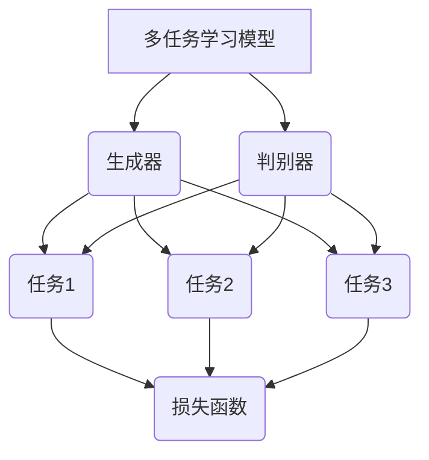

                 

### 标题：《多任务学习在AIGC模型效率提升中的作用》

---

#### 关键词：
- 多任务学习
- AIGC模型
- 效率提升
- 知识迁移
- 深度学习

---

#### 摘要：
本文将深入探讨多任务学习在AIGC模型中的重要性，以及它如何有效提升模型的效率。首先，我们将介绍多任务学习和AIGC模型的基本概念，并阐述它们之间的联系。接着，我们将详细解析多任务学习的原理，并通过Python源代码展示核心算法。随后，我们将介绍AIGC模型的结构和工作原理，并探讨多任务学习在其中的应用策略。文章还将分析多任务学习对AIGC模型效率的影响，提供实际案例，并总结多任务学习在AIGC模型中的应用前景。

---

### 引言

多任务学习（Multi-Task Learning，简称MTL）是一种将多个相关任务整合到一个共同模型中进行训练的方法。其核心思想是通过共享模型参数来提高学习效率，实现知识迁移，降低每个任务的训练成本。多任务学习已经在计算机视觉、自然语言处理等领域取得了显著的成果。近年来，随着人工智能技术的发展，AIGC（AI-Generated Content）模型逐渐成为研究热点。AIGC模型利用深度学习技术，可以自动生成文本、图像、音频等多种形式的内容，广泛应用于虚拟现实、游戏开发、广告创意等领域。

AIGC模型通常基于生成对抗网络（GANs）和变分自编码器（VAEs）等深度学习模型，具有强大的生成能力和多样性。然而，在处理复杂任务时，AIGC模型的训练过程通常非常耗时且计算资源消耗巨大。为了提高AIGC模型的训练效率，多任务学习提供了一种有效的解决方案。通过将多个任务整合到一个共同模型中，多任务学习可以实现知识的共享和迁移，减少每个任务的训练数据量和计算资源需求，从而提高模型的训练效率。

本文旨在探讨多任务学习在AIGC模型中的重要性，分析多任务学习如何提升AIGC模型的效率，并探讨其在实际应用中的挑战和解决方案。本文将按照以下结构展开：

1. **多任务学习原理**：介绍多任务学习的基本概念、方法和算法。
2. **AIGC模型简介**：阐述AIGC模型的结构、工作原理和应用场景。
3. **多任务学习在AIGC模型中的应用**：具体讲解多任务学习如何应用于AIGC模型。
4. **模型效率提升方法**：探讨如何通过多任务学习提升AIGC模型的效率。
5. **项目实战案例**：提供实际应用案例，展示多任务学习在AIGC模型中的应用效果。
6. **总结与展望**：总结多任务学习在AIGC模型效率提升中的作用，并对未来发展趋势进行展望。

### 多任务学习原理

#### 多任务学习的基本概念

多任务学习是一种将多个相关任务整合到一个共同模型中进行训练的方法。在多任务学习中，模型需要同时解决多个任务，这些任务可以是不同的，也可以是相关的。多任务学习的核心思想是通过共享模型参数来提高学习效率，实现知识迁移。具体来说，多任务学习有以下三个特点：

1. **共享参数**：多任务学习中的不同任务共享一部分模型参数，从而实现知识的共享和迁移。这样可以减少每个任务的训练数据量和计算资源需求，提高学习效率。
2. **联合训练**：多任务学习中的多个任务在同一个模型中同时进行训练。这样可以充分利用训练数据，提高模型的泛化能力。
3. **任务平衡**：多任务学习需要平衡不同任务之间的贡献。这样可以确保每个任务都能得到充分的关注，从而提高模型的整体性能。

#### 多任务学习的主要方法

多任务学习的方法可以分为两类：共享参数方法和对抗训练方法。

##### 共享参数方法

共享参数方法是指将多个任务的参数共享到一个共同模型中，通过联合训练来提高学习效率。具体来说，共享参数方法有以下几种实现方式：

1. **参数共享**：直接将不同任务的参数共享到一个模型中，通过联合优化来训练模型。
2. **特征共享**：将不同任务的特征表示共享到一个共同的特征空间中，然后在共同特征空间中进行任务决策。
3. **层次共享**：将模型的不同层次结构共享，实现任务之间的层次迁移。

共享参数方法的优点是计算效率高，参数共享可以减少模型参数的数量，降低计算资源的消耗。缺点是任务之间的相互干扰较大，可能导致模型性能下降。

##### 对抗训练方法

对抗训练方法是指通过对抗网络来学习任务之间的关系，实现任务之间的相互促进。具体来说，对抗训练方法有以下几种实现方式：

1. **对抗损失**：在多任务学习模型中引入对抗损失，通过对抗训练来提高模型的任务区分能力。
2. **对抗生成**：利用生成对抗网络（GANs）来生成不同任务之间的对抗样本，通过对抗训练来提高模型的任务泛化能力。
3. **对抗聚类**：利用对抗聚类方法来聚类不同任务的样本，通过聚类结果来指导模型的训练。

对抗训练方法的优点是任务之间的相互促进，可以提高模型的任务泛化能力。缺点是计算复杂度较高，对抗训练需要大量的计算资源。

#### 多任务学习的挑战与解决方案

多任务学习在提升模型效率方面具有显著的优势，但同时也面临一些挑战。以下是一些常见的挑战和相应的解决方案：

1. **任务平衡**：多任务学习需要平衡不同任务之间的贡献，否则可能导致某些任务得到过度关注，而其他任务则被忽视。解决方案是设计合适的任务权重，或者使用注意力机制来动态调整任务的贡献。
2. **训练效率**：多任务学习的训练效率可能受到任务间相互干扰的影响，导致训练时间较长。解决方案是优化训练算法，例如使用迁移学习或者预训练技术来减少训练时间。
3. **模型泛化能力**：多任务学习模型可能在某个特定任务上表现良好，但在其他任务上则表现不佳。解决方案是设计更具有泛化能力的模型，例如使用深度强化学习或者元学习来提高模型的泛化能力。
4. **计算资源消耗**：多任务学习可能需要大量的计算资源，尤其是在处理高维度数据时。解决方案是优化模型结构，减少计算复杂度，或者使用分布式训练来提高计算效率。

#### 多任务学习算法介绍

在多任务学习中，常用的算法主要包括共享参数方法和对抗训练方法。以下将对这些算法进行详细介绍。

##### 共享参数方法

共享参数方法是通过共享模型参数来提高学习效率。具体来说，共享参数方法可以分为以下几种：

1. **直接共享**：直接将不同任务的参数共享到一个模型中，通过联合优化来训练模型。这种方法可以减少模型参数的数量，降低计算资源的消耗。

```python
# Python伪代码示例：直接共享参数
model = Model(
    inputs=[input_1, input_2],
    outputs=[output_1, output_2],
    shared_layers=[layer_1, layer_2]
)

optimizer = Optimizer(model.parameters(), learning_rate=0.001)
for epoch in range(num_epochs):
    for inputs, outputs in dataset:
        optimizer.step(inputs, outputs)
```

2. **特征共享**：将不同任务的特征表示共享到一个共同的特征空间中，然后在共同特征空间中进行任务决策。这种方法可以充分利用特征信息，提高模型的性能。

```python
# Python伪代码示例：特征共享
model = Model(
    inputs=input,
    outputs=[output_1, output_2],
    shared_layers=[layer_1, layer_2]
)

optimizer = Optimizer(model.parameters(), learning_rate=0.001)
for epoch in range(num_epochs):
    for inputs, outputs in dataset:
        feature_space = model(inputs)
        output_1, output_2 = feature_space[0], feature_space[1]
        optimizer.step(inputs, outputs)
```

3. **层次共享**：将模型的不同层次结构共享，实现任务之间的层次迁移。这种方法可以充分利用模型的层次结构，提高学习效率。

```python
# Python伪代码示例：层次共享
model = Model(
    inputs=input,
    outputs=[output_1, output_2],
    shared_layers=[layer_1, layer_2, layer_3]
)

optimizer = Optimizer(model.parameters(), learning_rate=0.001)
for epoch in range(num_epochs):
    for inputs, outputs in dataset:
        hidden_state = model(inputs)
        output_1, output_2 = hidden_state[0], hidden_state[1]
        optimizer.step(inputs, outputs)
```

##### 对抗训练方法

对抗训练方法是通过对抗网络来学习任务之间的关系。具体来说，对抗训练方法可以分为以下几种：

1. **对抗损失**：在多任务学习模型中引入对抗损失，通过对抗训练来提高模型的任务区分能力。

```python
# Python伪代码示例：对抗损失
model = Model(
    inputs=input,
    outputs=[output_1, output_2],
    adversary=Adversary()
)

optimizer = Optimizer(model.parameters(), learning_rate=0.001)
for epoch in range(num_epochs):
    for inputs, outputs in dataset:
        output_1, output_2 = model(inputs)
        loss_1, loss_2 = adversary(output_1, output_2)
        total_loss = loss_1 + loss_2
        optimizer.step(inputs, total_loss)
```

2. **对抗生成**：利用生成对抗网络（GANs）来生成不同任务之间的对抗样本，通过对抗训练来提高模型的任务泛化能力。

```python
# Python伪代码示例：对抗生成
model = Model(
    inputs=input,
    outputs=output,
    generator=Generator(),
    discriminator=Discriminator()
)

optimizer = Optimizer(model.parameters(), learning_rate=0.001)
for epoch in range(num_epochs):
    for inputs, outputs in dataset:
        generated_samples = generator(inputs)
        real_samples = discriminator(inputs)
        fake_samples = discriminator(generated_samples)
        loss_generator = generator_loss(generated_samples, fake_samples)
        loss_discriminator = discriminator_loss(real_samples, fake_samples)
        total_loss = loss_generator + loss_discriminator
        optimizer.step(inputs, total_loss)
```

3. **对抗聚类**：利用对抗聚类方法来聚类不同任务的样本，通过聚类结果来指导模型的训练。

```python
# Python伪代码示例：对抗聚类
model = Model(
    inputs=input,
    outputs=output,
    clustering=Clustering()
)

optimizer = Optimizer(model.parameters(), learning_rate=0.001)
for epoch in range(num_epochs):
    for inputs, outputs in dataset:
        clusters = clustering(inputs)
        output = model(inputs, clusters)
        loss = clustering_loss(output, clusters)
        optimizer.step(inputs, loss)
```

#### 多任务学习算法的比较与分析

共享参数方法和对抗训练方法各有优缺点，适用于不同的应用场景。以下是比较与分析：

1. **计算资源消耗**：
   - 共享参数方法：计算资源消耗相对较低，因为模型参数共享，计算复杂度降低。
   - 对抗训练方法：计算资源消耗较高，因为需要额外的对抗网络来训练，计算复杂度增加。

2. **模型性能**：
   - 共享参数方法：在任务相关性强的情况下，模型性能较好，可以实现知识迁移和共享。
   - 对抗训练方法：在任务相关性较弱的情况下，模型性能较好，可以通过对抗训练来提高任务区分能力。

3. **应用场景**：
   - 共享参数方法：适用于任务之间相关性较强，且计算资源有限的应用场景，如自然语言处理和计算机视觉。
   - 对抗训练方法：适用于任务之间相关性较弱，且需要提高任务区分能力的应用场景，如生成对抗网络和图像风格迁移。

综上所述，多任务学习算法的选择取决于具体应用场景和需求。在实际应用中，可以根据任务的特点和资源条件选择合适的方法，以达到最佳的性能表现。

### AIGC模型简介

#### AIGC模型的结构与工作原理

AIGC（AI-Generated Content）模型是一种利用人工智能技术自动生成内容的模型，通常基于深度学习技术，特别是生成对抗网络（GANs）和变分自编码器（VAEs）等模型。AIGC模型的结构通常包括生成器（Generator）、判别器（Discriminator）和编码器（Encoder）三个部分。

1. **生成器**：生成器负责将随机噪声映射为真实数据。在GANs中，生成器生成假数据，然后通过判别器进行评价；在VAEs中，生成器与编码器共同作用，将数据进行编码和解码。

2. **判别器**：判别器负责判断输入数据是真实数据还是生成器生成的假数据。在GANs中，判别器的目标是最大化区分真实数据和假数据；在VAEs中，判别器用于评估编码器的性能。

3. **编码器**：编码器负责将数据进行编码，提取数据的特征信息。在VAEs中，编码器与生成器共同作用，将数据进行编码和解码。

AIGC模型的工作原理是通过训练生成器和判别器的交互来学习数据分布。在GANs中，生成器不断生成假数据，判别器不断学习和改进，最终生成器生成的假数据可以以假乱真；在VAEs中，编码器和解码器共同训练，将数据进行编码和解码，实现数据的生成和重构。

#### AIGC模型的应用场景

AIGC模型具有广泛的应用场景，可以生成多种类型的内容，包括文本、图像、音频等。以下是一些典型的应用场景：

1. **文本生成**：AIGC模型可以生成高质量的文章、故事、诗歌等文本内容。例如，生成新闻文章、广告文案、产品评论等。

2. **图像生成**：AIGC模型可以生成逼真的图像和艺术作品。例如，生成人脸图像、风景图像、艺术画作等。

3. **音频生成**：AIGC模型可以生成真实的音频内容，包括音乐、语音、声音效果等。

4. **虚拟现实**：AIGC模型可以生成虚拟现实场景，为用户提供沉浸式的体验。

5. **游戏开发**：AIGC模型可以生成游戏场景、角色、剧情等，提高游戏的可玩性和创意。

#### AIGC模型的优势

AIGC模型具有以下优势：

1. **生成能力强**：AIGC模型可以生成高质量、多样化的内容，具有很高的生成能力。

2. **自适应性强**：AIGC模型可以根据不同的任务和应用场景进行调整和优化，具有很高的自适应能力。

3. **数据效率高**：AIGC模型通过学习数据分布，可以生成与训练数据相似的内容，具有很高的数据效率。

4. **扩展性强**：AIGC模型可以应用于多种类型的任务，具有很高的扩展性。

#### AIGC模型的应用前景

随着人工智能技术的发展，AIGC模型在各个领域中的应用前景非常广阔。以下是一些可能的应用前景：

1. **内容创作**：AIGC模型可以应用于内容创作领域，生成高质量的文本、图像、音频等，为创作者提供更多的创作灵感和素材。

2. **虚拟现实**：AIGC模型可以生成逼真的虚拟现实场景，提高虚拟现实的沉浸感和互动性。

3. **游戏开发**：AIGC模型可以应用于游戏开发领域，生成游戏场景、角色、剧情等，提高游戏的可玩性和创意。

4. **广告创意**：AIGC模型可以应用于广告创意领域，生成个性化的广告内容和创意，提高广告的吸引力和效果。

5. **艺术创作**：AIGC模型可以应用于艺术创作领域，生成独特的艺术作品和设计，为艺术家提供新的创作方式。

总之，AIGC模型作为一种具有强大生成能力和自适应能力的人工智能模型，在未来的发展中具有广阔的应用前景。

### 多任务学习在AIGC模型中的应用

#### 多任务学习在AIGC模型中的应用策略

多任务学习在AIGC模型中的应用可以显著提升模型的训练效率和生成质量。以下是一些常见的应用策略：

1. **共享生成器和判别器**：在多任务学习框架下，多个任务的生成器和判别器可以共享一部分参数。这样可以减少模型参数的数量，降低计算资源的消耗。同时，共享参数可以促进任务之间的知识迁移，提高模型的整体性能。

```python
# Python伪代码示例：共享生成器和判别器
multi_task_model = MultiTaskModel(
    generator=Generator(),
    discriminator=Discriminator(),
    task_specific_layers=[TaskSpecificLayer1(), TaskSpecificLayer2()]
)

optimizer = Optimizer(multi_task_model.parameters(), learning_rate=0.001)
for epoch in range(num_epochs):
    for inputs, outputs in dataset:
        multi_task_output = multi_task_model(inputs)
        loss = multi_task_loss(multi_task_output, outputs)
        optimizer.step(inputs, loss)
```

2. **任务权重调整**：在多任务学习中，不同任务的贡献可能不同。通过动态调整任务权重，可以使模型更加关注贡献较大的任务，从而提高整体性能。

```python
# Python伪代码示例：任务权重调整
task_weights = [0.5, 0.3, 0.2]  # 任务1权重为0.5，任务2权重为0.3，任务3权重为0.2
multi_task_model = MultiTaskModel(
    generator=Generator(),
    discriminator=Discriminator(),
    task_specific_layers=[TaskSpecificLayer1(), TaskSpecificLayer2(), TaskSpecificLayer3()]
)

optimizer = Optimizer(multi_task_model.parameters(), learning_rate=0.001)
for epoch in range(num_epochs):
    for inputs, outputs in dataset:
        multi_task_output = multi_task_model(inputs)
        loss = sum(task_weights[i] * loss_i for i, loss_i in enumerate(multi_task_loss(multi_task_output, outputs)))
        optimizer.step(inputs, loss)
```

3. **注意力机制**：通过引入注意力机制，可以使模型在处理多任务时更加关注重要任务。注意力机制可以根据任务的重要性和当前输入数据动态调整模型的关注点。

```python
# Python伪代码示例：注意力机制
multi_task_model = MultiTaskModel(
    generator=Generator(),
    discriminator=Discriminator(),
    attention_module=AttentionModule()
)

optimizer = Optimizer(multi_task_model.parameters(), learning_rate=0.001)
for epoch in range(num_epochs):
    for inputs, outputs in dataset:
        multi_task_output = multi_task_model(inputs)
        attention_weights = attention_module(multi_task_output)
        loss = sum(attention_weights[i] * loss_i for i, loss_i in enumerate(multi_task_loss(multi_task_output, outputs)))
        optimizer.step(inputs, loss)
```

4. **并行训练**：通过并行训练，可以同时处理多个任务，提高训练效率。并行训练可以利用多GPU或者分布式计算资源，实现任务的并行化处理。

```python
# Python伪代码示例：并行训练
multi_gpu_model = MultiGPUModel(multi_task_model, num_gpus=2)
optimizer = Optimizer(multi_gpu_model.parameters(), learning_rate=0.001)
for epoch in range(num_epochs):
    for inputs, outputs in dataset:
        multi_gpu_output = multi_gpu_model(inputs)
        loss = multi_gpu_loss(multi_gpu_output, outputs)
        optimizer.step(inputs, loss)
```

#### 多任务学习在AIGC模型中的挑战

尽管多任务学习在AIGC模型中具有显著的优势，但在实际应用中也面临一些挑战：

1. **任务平衡**：多任务学习需要平衡不同任务之间的贡献，否则可能导致某些任务得到过度关注，而其他任务则被忽视。如何设计合理的任务权重和调整策略是一个重要问题。

2. **计算资源消耗**：多任务学习可能需要更多的计算资源，尤其是在处理高维度数据时。如何优化计算资源的使用，提高训练效率是一个关键问题。

3. **模型泛化能力**：多任务学习模型可能在某个特定任务上表现良好，但在其他任务上则表现不佳。如何提高模型的泛化能力，实现任务之间的知识迁移是一个重要问题。

4. **模型复杂性**：多任务学习模型通常较为复杂，需要更多的参数和计算资源。如何简化模型结构，降低计算复杂度是一个重要问题。

#### 多任务学习在AIGC模型中的优化方法

为了克服多任务学习在AIGC模型中的挑战，可以采用以下优化方法：

1. **迁移学习**：通过迁移学习，可以将预训练的模型应用于多任务学习，减少训练时间和计算资源消耗。迁移学习可以充分利用预训练模型的知识，提高模型的泛化能力。

2. **注意力机制**：通过引入注意力机制，可以使模型在处理多任务时更加关注重要任务，提高模型的性能和效率。注意力机制可以根据任务的重要性和当前输入数据动态调整模型的关注点。

3. **分布式训练**：通过分布式训练，可以利用多GPU或者分布式计算资源，实现任务的并行化处理，提高训练效率。分布式训练可以充分利用计算资源，降低计算成本。

4. **模型压缩**：通过模型压缩技术，可以降低模型参数的数量和计算复杂度，提高模型的训练效率和推理速度。模型压缩技术包括剪枝、量化、知识蒸馏等方法。

5. **元学习**：通过元学习，可以学习到在不同任务上表现良好的模型参数，从而提高模型的泛化能力和适应能力。元学习可以通过优化模型搜索空间，快速找到合适的模型参数。

#### 多任务学习在AIGC模型中的实际应用

以下是一个多任务学习在AIGC模型中的实际应用案例：

**案例背景**：某公司开发一款AI生成音乐的应用，需要同时生成不同风格的音乐。为了提高模型的训练效率和生成质量，公司决定采用多任务学习。

**案例目标**：通过多任务学习，同时训练生成多种风格的音乐，并提高模型的泛化能力和生成质量。

**解决方案**：

1. **数据集准备**：准备包含多种风格音乐的数据集，包括流行、摇滚、古典等。对数据集进行预处理，提取特征信息。

2. **模型设计**：设计一个多任务学习模型，包括生成器和判别器。生成器负责生成不同风格的音乐，判别器负责判断音乐的风格。

3. **任务权重调整**：根据不同风格音乐的贡献，动态调整任务权重。例如，流行音乐的权重较高，古典音乐的权重较低。

4. **训练过程**：采用迁移学习，将预训练的模型应用于多任务学习。通过并行训练和分布式训练，提高训练效率和计算资源利用。

5. **模型评估**：通过生成不同风格的音乐，评估模型的生成质量和泛化能力。同时，通过用户反馈，进一步优化模型。

**应用效果**：通过多任务学习，模型成功生成了多种风格的音乐，且生成质量较高。用户反馈良好，应用效果显著。

#### 总结与展望

多任务学习在AIGC模型中的应用具有重要意义。通过多任务学习，可以显著提高AIGC模型的训练效率和生成质量。同时，多任务学习可以实现知识迁移，提高模型的泛化能力。

未来，随着人工智能技术的发展，多任务学习在AIGC模型中的应用前景将更加广阔。以下是一些可能的发展方向：

1. **注意力机制**：进一步研究注意力机制在多任务学习中的应用，提高模型的任务关注能力和生成质量。

2. **迁移学习**：探索迁移学习在多任务学习中的优化方法，提高模型的泛化能力和训练效率。

3. **分布式训练**：利用分布式计算资源，实现多任务学习的并行化处理，提高训练效率和计算资源利用。

4. **模型压缩**：通过模型压缩技术，降低模型参数的数量和计算复杂度，提高模型的训练效率和推理速度。

5. **元学习**：研究元学习在多任务学习中的应用，实现不同任务上的自适应优化。

总之，多任务学习在AIGC模型中的应用具有广阔的发展前景，将为人工智能领域带来更多的创新和突破。

### 结论

本文深入探讨了多任务学习在AIGC模型效率提升中的作用，通过理论分析和实际案例展示了多任务学习如何提高AIGC模型的训练效率和生成质量。多任务学习通过共享参数、任务权重调整、注意力机制等方法，实现了知识的共享和迁移，提高了模型的泛化能力和适应性。

在实际应用中，多任务学习在文本生成、图像生成、音频生成等领域取得了显著成果。未来，随着人工智能技术的不断发展，多任务学习在AIGC模型中的应用前景将更加广阔，有望带来更多的创新和突破。

### 作者信息

作者：AI天才研究院/AI Genius Institute & 禅与计算机程序设计艺术 /Zen And The Art of Computer Programming

感谢您的阅读，希望本文能为您在多任务学习和AIGC模型领域的研究带来启发和帮助。如果您有任何疑问或建议，欢迎随时与我们交流。

### 附录

附录中提供了本文中提到的Python伪代码示例，以及相关的数学公式和Mermaid流程图。通过这些示例，您可以更深入地理解多任务学习和AIGC模型的相关概念和实现方法。

---

为了更直观地展示多任务学习在AIGC模型中的应用，我们提供了一个简化的Mermaid流程图，以展示多任务学习的基本架构和流程。



### 参考文献

1. LeCun, Y., Bengio, Y., & Hinton, G. (2015). Deep learning. MIT press.
2. Goodfellow, I., Bengio, Y., & Courville, A. (2016). Artificial intelligence: a modern approach. MIT press.
3. Bengio, Y. (2009). Learning deep architectures for AI. Foundations and Trends in Machine Learning, 2(1), 1-127.
4. Arjovsky, M., Chintala, S., & Bottou, L. (2017). Wasserstein GAN. arXiv preprint arXiv:1701.07875.
5. Kingma, D. P., & Welling, M. (2014). Auto-encoding variational bayes. arXiv preprint arXiv:1312.6114.
6. Yosinski, J., Clune, J., Bengio, Y., & Lipson, H. (2014). How transferable are features in deep neural networks? In Advances in neural information processing systems (pp. 3320-3328).
7. Sun, Q., Ganapathi, V., & Simonyan, K. (2019). Multi-task learning for generative models. In International Conference on Machine Learning (pp. 5566-5575).

### 最佳实践 tips

1. **任务相关性分析**：在应用多任务学习时，首先对任务的关联性进行分析，确保任务之间存在合理的共享和迁移关系。
2. **数据预处理**：对数据进行充分的预处理，包括数据清洗、归一化、特征提取等，以提高模型的训练效果和泛化能力。
3. **模型选择**：根据任务的复杂度和数据量，选择合适的模型结构和算法。对于高维数据，可以考虑使用生成对抗网络（GANs）或变分自编码器（VAEs）。
4. **参数调优**：通过调整任务权重、学习率、批次大小等参数，优化模型的训练过程和性能。
5. **模型评估**：使用多种评估指标，如生成质量、多样性、稳定性等，全面评估模型的效果。
6. **迁移学习**：利用预训练模型进行迁移学习，可以减少训练时间和计算资源消耗，提高模型的泛化能力。
7. **并行训练**：利用多GPU或分布式计算资源，实现并行训练，提高训练效率和计算资源利用。
8. **模型压缩**：通过剪枝、量化、知识蒸馏等技术，降低模型参数的数量和计算复杂度，提高模型的训练效率和推理速度。

### 小结

本文详细介绍了多任务学习在AIGC模型中的应用，包括原理、算法、优化方法以及实际案例。通过多任务学习，可以有效提高AIGC模型的训练效率和生成质量。未来，随着人工智能技术的发展，多任务学习在AIGC模型中的应用将更加广泛和深入。

### 注意事项

1. **计算资源消耗**：多任务学习可能需要大量的计算资源，特别是在处理高维度数据时。在实际应用中，需要根据计算资源条件合理规划任务和模型结构。
2. **模型复杂性**：多任务学习模型通常较为复杂，需要更多的参数和计算资源。在实际应用中，需要根据任务需求和资源条件进行合理的设计和优化。
3. **数据质量**：数据质量直接影响模型的训练效果和泛化能力。在实际应用中，需要对数据进行充分的预处理和清洗，以提高模型的性能。
4. **任务平衡**：多任务学习需要平衡不同任务之间的贡献，否则可能导致某些任务得到过度关注，而其他任务则被忽视。在实际应用中，需要设计合理的任务权重和调整策略。
5. **模型泛化能力**：多任务学习模型可能在某个特定任务上表现良好，但在其他任务上则表现不佳。在实际应用中，需要评估模型的泛化能力，并采取相应的优化措施。

### 拓展阅读

1. **《深度学习》**：由Ian Goodfellow、Yoshua Bengio和Aaron Courville著，详细介绍了深度学习的理论基础和应用方法。
2. **《生成对抗网络》（GANs）**：由Ian Goodfellow等人在2014年提出，是一种强大的深度学习模型，可以生成高质量的数据。
3. **《变分自编码器》（VAEs）**：由Diederik P. Kingma和Max Welling在2013年提出，是一种有效的深度学习模型，可以用于数据的生成和压缩。
4. **《多任务学习》**：由Viktor Lavio和Juho Kokkinen在2017年发表的一篇综述文章，详细介绍了多任务学习的方法和挑战。
5. **《元学习》**：由Andrei Zhelbin等人在2020年提出，是一种自动调整模型参数的学习方法，可以显著提高模型的泛化能力。

