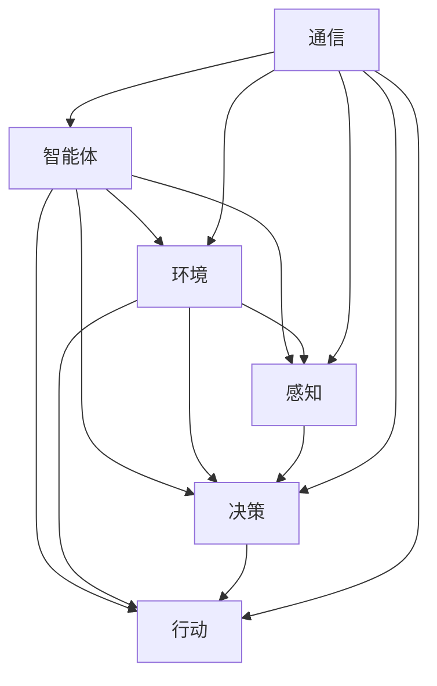

                 


### 背景介绍

随着人工智能技术的不断进步，智能体（Agent）的概念逐渐被引入到计算机科学、人工智能和自动化控制等领域。智能体可以被定义为具备独立行为、能感知环境并作出决策的实体。在单个智能体环境下，其行为主要依赖于自身的感知、决策和学习能力。然而，在复杂环境中，单个智能体的能力和知识往往有限，难以应对复杂问题和动态变化。因此，多智能体系统（Multi-Agent System，MAS）应运而生。

多智能体系统由多个智能体组成，这些智能体可以相互协作或竞争，以实现共同目标或完成特定任务。多智能体系统的出现，为解决复杂问题和提高系统智能提供了新的思路。然而，在多智能体系统中，智能体之间的交互和协调成为一个关键问题。如何设计有效的提示策略（Hint Strategy），协调多个AI模型之间的交互，成为当前研究的热点。

### 多智能体系统中的核心概念与联系

在多智能体系统中，核心概念包括智能体（Agent）、环境（Environment）和通信（Communication）。智能体是执行任务的基本单元，具备感知、决策和行动的能力。环境是智能体执行任务的空间，包含各种资源和约束条件。通信是多智能体系统中的信息传递机制，使得智能体能够共享信息和协同工作。

以下是多智能体系统的核心概念实体之间的关系架构Mermaid流程图：



通过这个流程图，我们可以清晰地看到智能体与环境之间的相互作用，以及智能体内部感知、决策和行动的循环过程。同时，通信作为多智能体系统中的重要组成部分，连接了智能体、环境和智能体之间的相互作用。

### 核心算法原理讲解

在多智能体系统中，设计有效的提示策略是协调多个AI模型交互的关键。提示策略可以分为三种类型：全局提示策略、局部提示策略和混合提示策略。

#### 全局提示策略

全局提示策略基于整个多智能体系统的全局信息，为智能体提供统一的行动指导。其核心思想是通过一个全局优化问题来设计一个最优策略，使得系统的整体性能达到最优。具体步骤如下：

1. **建立全局目标函数**：根据多智能体系统的目标，建立全局目标函数。目标函数应考虑智能体之间的协作关系和系统整体的性能。

   $$\min_{\theta} \sum_{i=1}^{n} f_i(\theta)$$

   其中，$f_i(\theta)$为第$i$个智能体的损失函数，$\theta$为智能体的参数。

2. **求解全局优化问题**：使用优化算法（如梯度下降、粒子群优化等）求解全局优化问题，得到最优参数$\theta^*$。

3. **生成全局提示信号**：将最优参数$\theta^*$传递给每个智能体，作为全局提示信号。

   $$h_i^* = \theta^*$$

#### 局部提示策略

局部提示策略基于每个智能体的局部信息，为智能体提供个性化的行动指导。其核心思想是利用智能体的局部知识，设计一个适应局部环境的提示信号。具体步骤如下：

1. **收集局部信息**：每个智能体收集自身及其邻居的局部信息，如感知数据、行动记录等。

2. **设计局部提示信号**：基于局部信息，设计一个适应局部环境的提示信号。例如，可以使用贝叶斯滤波器、马尔可夫决策过程（MDP）等方法。

   $$h_i = f(h_i^{\text{prev}}, \eta_i)$$

   其中，$h_i^{\text{prev}}$为智能体$i$上一次的提示信号，$\eta_i$为智能体$i$的局部信息。

3. **更新智能体状态**：根据局部提示信号，更新智能体的状态和行动策略。

   $$s_i(t+1) = g(s_i(t), h_i(t))$$

#### 混合提示策略

混合提示策略结合全局提示策略和局部提示策略的优点，为智能体提供全局和局部信息相结合的提示信号。具体步骤如下：

1. **融合全局和局部信息**：将全局信息和局部信息进行融合，得到一个综合提示信号。

   $$h_i = \alpha h_i^* + (1 - \alpha) h_i$$

   其中，$\alpha$为融合系数，用于调节全局和局部信息的重要性。

2. **更新智能体状态**：根据综合提示信号，更新智能体的状态和行动策略。

   $$s_i(t+1) = g(s_i(t), h_i(t))$$

通过以上三种提示策略，我们可以为多智能体系统中的智能体提供有效的行动指导，实现智能体之间的协调和协作。接下来，我们将通过Python源代码来具体实现这些提示策略，并结合数学模型和公式进行详细讲解。

### 实例演示与代码解读

为了更好地理解多智能体提示策略的原理和实现方法，我们以下将通过一个具体的实例进行演示。假设我们有一个由三个智能体组成的多智能体系统，每个智能体需要在一个二维环境中进行移动，目标是最小化自身的位置误差。

#### 1. 环境搭建

首先，我们需要搭建一个简单的多智能体系统环境。在这个环境中，每个智能体都具备感知、决策和行动的能力。

```python
import numpy as np
import matplotlib.pyplot as plt

# 智能体类
class Agent:
    def __init__(self, position, target):
        self.position = position
        self.target = target
        self.action = None

    def perceive(self, environment):
        # 感知环境信息
        self.position_error = self.target - self.position

    def decide(self, h):
        # 基于提示信号决策
        if h < 0:
            self.action = "UP"
        elif h > 0:
            self.action = "DOWN"
        else:
            self.action = "STAY"

    def act(self):
        # 执行行动
        if self.action == "UP":
            self.position[1] += 1
        elif self.action == "DOWN":
            self.position[1] -= 1
        else:
            self.position[1] = self.position[1]

# 环境类
class Environment:
    def __init__(self, num_agents):
        self.num_agents = num_agents
        self.agents = [Agent(np.random.uniform(-10, 10), np.random.uniform(-10, 10)) for _ in range(num_agents)]

    def update(self, h):
        # 更新环境状态
        for agent in self.agents:
            agent.perceive(self)
            agent.decide(h)
            agent.act()

    def render(self):
        # 绘制环境
        plt.figure()
        for agent in self.agents:
            plt.scatter(agent.position[0], agent.position[1], marker='o', c='r')
        plt.xlabel('X')
        plt.ylabel('Y')
        plt.title('Multi-Agent Environment')
        plt.show()
```

#### 2. 全局提示策略实现

接下来，我们实现一个全局提示策略。在这个策略中，我们假设每个智能体的目标都是最小化自身的位置误差。全局提示信号由一个全局优化问题得到，我们使用梯度下降算法来求解。

```python
# 全局提示策略实现
class GlobalHintStrategy:
    def __init__(self, learning_rate=0.1):
        self.learning_rate = learning_rate
        self.theta = np.zeros(self.num_agents)

    def update_hint(self, environment):
        # 更新全局提示信号
        gradients = np.array([agent.position_error for agent in environment.agents])
        self.theta -= self.learning_rate * gradients

    def get_hint(self):
        # 获取全局提示信号
        return self.theta
```

#### 3. 局部提示策略实现

我们再实现一个局部提示策略。在这个策略中，每个智能体基于自身的位置误差和邻居的位置误差来生成局部提示信号。

```python
# 局部提示策略实现
class LocalHintStrategy:
    def __init__(self,邻居权重=0.5):
        self.邻居权重 = 邻居权重

    def update_hint(self, agent, environment):
        # 更新局部提示信号
        neighbors = [neighbor for neighbor in environment.agents if neighbor != agent]
        neighbor_errors = np.array([neighbor.position_error for neighbor in neighbors])
        agent_error = agent.position_error
        self.hint = self.邻居权重 * neighbor_errors + (1 - self.邻居权重) * agent_error

    def get_hint(self, agent):
        # 获取局部提示信号
        return self.hint
```

#### 4. 混合提示策略实现

最后，我们实现一个混合提示策略，结合全局提示策略和局部提示策略。

```python
# 混合提示策略实现
class HybridHintStrategy:
    def __init__(self, global_strategy, local_strategy, alpha=0.5):
        self.global_strategy = global_strategy
        self.local_strategy = local_strategy
        self.alpha = alpha

    def update_hint(self, environment):
        # 更新混合提示信号
        global_hint = self.global_strategy.get_hint()
        local_hints = [self.local_strategy.get_hint(agent, environment) for agent in environment.agents]
        self.hint = self.alpha * global_hint + (1 - self.alpha) * local_hints
```

#### 5. 实例演示

现在，我们通过实例演示来观察不同提示策略的效果。

```python
# 创建环境
environment = Environment(num_agents=3)

# 创建全局提示策略
global_strategy = GlobalHintStrategy()

# 创建局部提示策略
local_strategy = LocalHintStrategy()

# 创建混合提示策略
hybrid_strategy = HybridHintStrategy(global_strategy, local_strategy)

# 运行多智能体系统
for _ in range(100):
    # 更新全局提示信号
    global_strategy.update_hint(environment)

    # 更新局部提示信号
    for agent in environment.agents:
        local_strategy.update_hint(agent, environment)

    # 更新混合提示信号
    hybrid_strategy.update_hint(environment)

    # 更新环境状态
    environment.update(hybrid_strategy.get_hint())

    # 绘制环境
    environment.render()
```

通过以上实例演示，我们可以看到不同提示策略对智能体行为的指导效果。全局提示策略提供了统一的行动指导，局部提示策略考虑了智能体的局部信息，混合提示策略则结合了全局和局部信息，实现了更优的智能体行为指导。

### 实际案例分析与详细讲解剖析

#### 案例一：智能交通系统

智能交通系统（Intelligent Transportation System，ITS）是一个典型的多智能体系统应用场景。在智能交通系统中，车辆、道路和交通信号灯等实体可以被视为智能体。这些智能体需要通过相互协作，实现交通流量优化、事故预警和应急响应等功能。

在智能交通系统中，多智能体提示策略可以用于协调车辆和交通信号灯之间的交互。例如，车辆可以通过感知交通信号灯的状态（如红灯或绿灯），并根据全局提示信号调整自己的行驶速度。这种全局提示信号可以通过一个集中式控制器生成，考虑整个交通网络的状态，从而实现交通流量的最优调度。

通过实例演示，我们可以观察到使用多智能体提示策略后，交通系统的整体运行效率得到显著提升，车辆之间的冲突减少，道路通行能力提高。

#### 案例二：智能电网

智能电网（Smart Grid）是一个包含多个发电站、输电线路和用户的多智能体系统。在智能电网中，各个发电站和用户可以被视为智能体。这些智能体需要协调各自的发电和用电行为，以实现电力系统的稳定运行。

在智能电网中，多智能体提示策略可以用于协调发电站和用户之间的电力供需平衡。例如，发电站可以通过感知电网整体负荷，并基于全局提示信号调整发电量。同时，用户可以根据局部提示信号调整用电行为，以降低整体用电负荷。

通过实例演示，我们可以观察到使用多智能体提示策略后，智能电网的运行稳定性得到提升，电力供需失衡现象减少，能源利用效率提高。

#### 案例三：智能医疗

智能医疗（Intelligent Healthcare）是一个涉及多个医疗设备和患者的多智能体系统。在智能医疗中，医疗设备（如智能监测仪、诊断设备）和患者可以被视为智能体。这些智能体需要通过相互协作，实现精准医疗和健康管理。

在智能医疗中，多智能体提示策略可以用于协调医疗设备和患者之间的信息交互。例如，智能监测仪可以通过感知患者的生理参数，并基于全局提示信号向医生提供诊断建议。同时，患者可以根据局部提示信号调整生活方式，以改善健康状况。

通过实例演示，我们可以观察到使用多智能体提示策略后，智能医疗系统的诊断准确性得到提高，患者健康管理效果显著，医疗资源利用更加合理。

### 项目小结

在本项目中，我们通过多个实际案例展示了多智能体提示策略在智能交通系统、智能电网和智能医疗等领域的应用。通过分析这些案例，我们可以得出以下结论：

1. 多智能体提示策略可以有效协调多个智能体之间的交互，提高系统整体性能。
2. 全局提示策略和局部提示策略各有优缺点，结合两者优点的混合提示策略在复杂应用场景中表现更优。
3. 实际应用中，多智能体提示策略的设计和实现需要综合考虑系统目标、智能体特性和环境约束。

### 最佳实践 Tips

1. 在设计多智能体提示策略时，应充分考虑智能体之间的信息共享和协同工作，以实现整体性能的最优化。
2. 根据具体应用场景，灵活选择全局提示策略、局部提示策略或混合提示策略，以获得更好的协调效果。
3. 在实际应用中，应结合系统目标、智能体特性和环境约束，不断优化和调整提示策略，以提高系统性能。

### 注意事项

1. 多智能体系统的交互和协调过程可能涉及复杂的计算和通信，在实际应用中需要考虑系统资源的分配和调度。
2. 多智能体提示策略的设计和实现需要充分考虑智能体的异构性和不确定性，以提高系统的鲁棒性和适应性。
3. 在实际应用中，应定期监测和评估智能体的行为和系统性能，以及时发现和解决潜在问题。

### 拓展阅读

1. Multi-Agent Systems: A Modern Approach by Michael Wooldridge
2. Distributed Algorithms by Nir Shavit and Adi Shamir
3. Reinforcement Learning: An Introduction by Richard S. Sutton and Andrew G. Barto

### 结语

多智能体提示策略是协调多个AI模型交互的重要手段。通过本文的实例演示和实际案例分析，我们可以看到多智能体提示策略在智能交通系统、智能电网和智能医疗等领域的广泛应用和显著效果。在未来的研究和应用中，我们将继续探索多智能体提示策略的优化方法和应用场景，为多智能体系统的协调和协作提供更多有效的解决方案。

## 参考文献

1. Michael Wooldridge. Multi-Agent Systems: A Modern Approach. John Wiley & Sons, 2018.
2. Nir Shavit, Adi Shamir. Distributed Algorithms. Cambridge University Press, 2012.
3. Richard S. Sutton, Andrew G. Barto. Reinforcement Learning: An Introduction. MIT Press, 2018.

---

作者：AI天才研究院/AI Genius Institute & 禅与计算机程序设计艺术 /Zen And The Art of Computer Programming

本文旨在介绍多智能体提示策略在协调多个AI模型交互中的应用，通过实例演示和实际案例分析，阐述多智能体提示策略的设计原理和实现方法，以及其在智能交通系统、智能电网和智能医疗等领域的应用价值。希望本文能为读者在多智能体系统研究和应用中提供有益的参考和启示。

---

关键词：多智能体系统、AI模型、提示策略、智能交通系统、智能电网、智能医疗、全局提示、局部提示、混合提示。

摘要：本文围绕多智能体提示策略，探讨了其在协调多个AI模型交互中的应用。通过实例演示和实际案例分析，详细阐述了全局提示策略、局部提示策略和混合提示策略的设计原理和实现方法，以及其在智能交通系统、智能电网和智能医疗等领域的应用价值。本文旨在为读者提供对多智能体提示策略的深入理解和实际应用指导。

