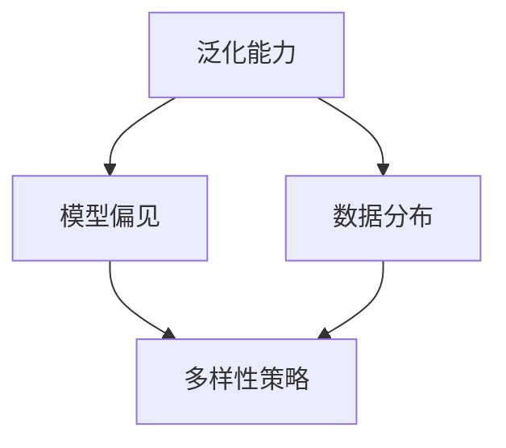
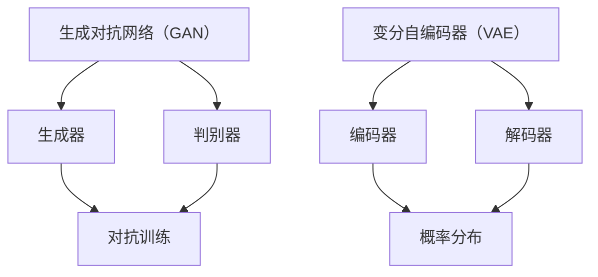
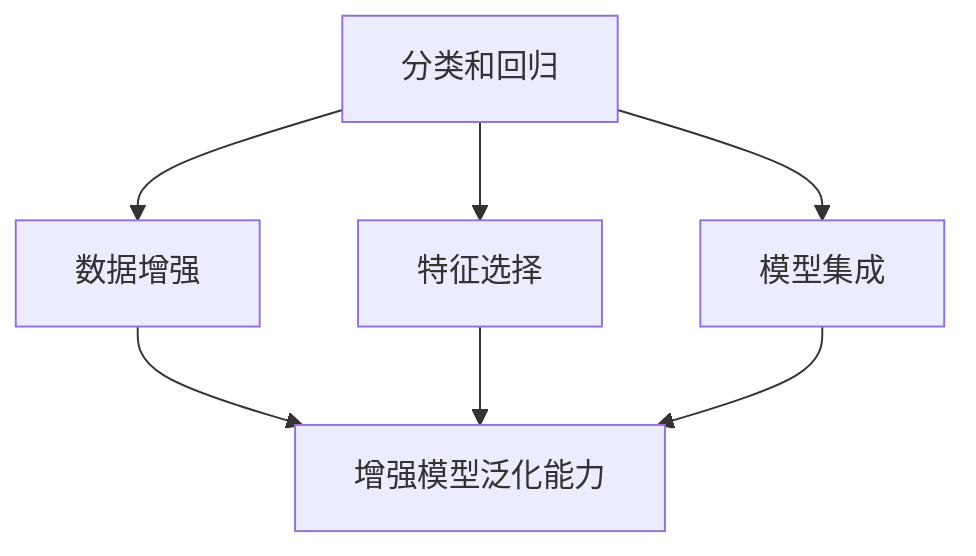
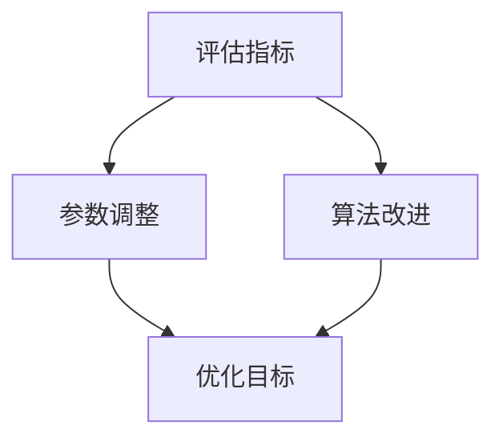

                 

### 第1步：多样性策略的概述

多样性策略（Diversity Strategies）在现代机器学习和人工智能领域扮演着至关重要的角色。其核心目标是提高模型的泛化能力，确保模型能够生成多样化的输出，避免陷入局部最优解，从而更好地适应复杂的现实世界。多样性策略在生成模型、分类和回归任务中都有广泛应用。

**核心概念与联系：**

多样性策略涉及到多个核心概念，如泛化能力、模型偏见、数据分布等。这些概念之间的关系可以用以下Mermaid流程图来表示：



- **泛化能力**：模型在未知数据上的表现能力。
- **模型偏见**：模型对某些特定数据的偏好，可能导致泛化能力下降。
- **数据分布**：训练数据集的分布情况，直接影响模型的泛化能力。

**核心算法原理讲解：**

为了生成多样化的输出，多样性策略通常结合不同的算法和技术。以下以生成对抗网络（GAN）和变分自编码器（VAE）为例，介绍多样性策略的核心算法原理。

**生成对抗网络（GAN）：**

GAN由生成器（Generator）和判别器（Discriminator）组成，通过两个网络的对抗训练来生成多样化的输出。

```python
# GAN的基本架构
import tensorflow as tf

# 定义生成器
def generator(z):
    # 使用神经网络结构生成图像
    x = tf.keras.layers.Dense(784)(z)
    x = tf.keras.layers.LeakyReLU(alpha=0.2)(x)
    x = tf.keras.layers.Dense(1, activation='tanh')(x)
    return x

# 定义判别器
def discriminator(x):
    # 使用神经网络结构判断图像的真实性
    x = tf.keras.layers.Dense(128)(x)
    x = tf.keras.layers.LeakyReLU(alpha=0.2)(x)
    x = tf.keras.layers.Dense(1, activation='sigmoid')(x)
    return x

# 模型编译
g_model = tf.keras.Model(z, x)
d_model = tf.keras.Model(x, d)
d_model.compile(optimizer='adam', loss='binary_crossentropy')

# 训练模型
g_model.fit(z_train, x_train, epochs=epochs, batch_size=batch_size)
d_model.fit(x_train, d_train, epochs=epochs, batch_size=batch_size)
```

**变分自编码器（VAE）：**

VAE通过引入编码器（Encoder）和解码器（Decoder）来学习数据的概率分布，并生成多样化的输出。

```python
# VAE的基本架构
import tensorflow as tf

# 定义编码器
def encoder(x):
    # 使用神经网络结构学习数据的概率分布
    z_mean = tf.keras.layers.Dense(latent_dim)(x)
    z_log_var = tf.keras.layers.Dense(latent_dim)(x)
    return z_mean, z_log_var

# 定义解码器
def decoder(z):
    # 使用神经网络结构生成图像
    x = tf.keras.layers.Dense(784)(z)
    x = tf.keras.layers.LeakyReLU(alpha=0.2)(x)
    x = tf.keras.layers.Dense(1, activation='tanh')(x)
    return x

# 定义VAE模型
def vae_model():
    z_mean, z_log_var = encoder(x)
    z = z_mean + tf.random.normal(tf.shape(z_log_var)) * tf.exp(0.5 * z_log_var)
    x_hat = decoder(z)
    return tf.keras.Model(x, x_hat)

# 模型编译
vae = vae_model()
vae.compile(optimizer='adam', loss='binary_crossentropy')

# 训练模型
vae.fit(x_train, x_train, epochs=epochs, batch_size=batch_size)
```

**数学模型与公式：**

- **GAN中的对抗损失函数：**
  $$ L_D = -\frac{1}{N} \sum_{i=1}^{N} [y_{real} \cdot \log(D(x)) + y_{fake} \cdot \log(1 - D(G(z)))] $$
  其中，$y_{real}$和$y_{fake}$分别为真实数据和生成数据的标签。

- **VAE中的重建损失函数：**
  $$ L = \frac{1}{N} \sum_{i=1}^{N} \left[ \frac{1}{2} \sum_{j=1}^{784} (x_j - \hat{x}_j)^2 + \frac{1}{2} \sum_{j=1}^{20} \log(\varphi_j) \right] $$
  其中，$\varphi_j$为编码器输出的对数方差。

**举例说明：**

假设我们使用GAN来生成人脸图像。在训练过程中，生成器尝试生成逼真的人脸，而判别器则试图区分真实人脸和生成人脸。通过对抗训练，生成器不断优化生成技巧，判别器不断提高辨别能力，最终达到生成多样化人脸图像的目标。

**项目实战：**

**开发环境搭建：**
- 安装TensorFlow框架。
- 准备MNIST数据集。

**源代码详细实现：**
```python
import tensorflow as tf
from tensorflow.keras import layers

# 定义生成器
def generator(z):
    x = layers.Dense(784)(z)
    x = layers.LeakyReLU(alpha=0.2)(x)
    x = layers.Dense(1, activation='tanh')(x)
    return x

# 定义判别器
def discriminator(x):
    x = layers.Dense(128)(x)
    x = layers.LeakyReLU(alpha=0.2)(x)
    x = layers.Dense(1, activation='sigmoid')(x)
    return x

# 训练模型
for epoch in range(epochs):
    for x_batch, _ in data_loader:
        with tf.GradientTape() as gen_tape, tf.GradientTape() as disc_tape:
            z = tf.random.normal(tf.shape(x_batch)[0], dtype=tf.float32)
            x_hat = generator(z)
            disc_real = discriminator(x_batch)
            disc_fake = discriminator(x_hat)
            disc_loss = tf.reduce_mean(-disc_real - tf.math.log(disc_fake))
            gen_loss = tf.reduce_mean(-tf.math.log(disc_fake))
        grads = gen_tape.gradient(gen_loss, generator.trainable_variables)
        grads = disc_tape.gradient(disc_loss, discriminator.trainable_variables)
        generator.optimizer.apply_gradients(zip(grads, generator.trainable_variables))
        discriminator.optimizer.apply_gradients(zip(grads, discriminator.trainable_variables))
    print(f"Epoch {epoch+1}/{epochs}, Gen Loss: {gen_loss}, Disc Loss: {disc_loss}")

# 生成图像
z = tf.random.normal(tf.shape(x_batch)[0], dtype=tf.float32)
x_hat = generator(z)
```

**代码应用解读与分析：**
- 生成器通过学习噪声数据来生成人脸图像。
- 判别器通过对比真实人脸和生成人脸来判断生成器的性能。
- 在训练过程中，生成器和判别器相互对抗，生成器不断优化生成技巧，判别器不断提高辨别能力。

**实际案例分析和详细讲解剖析：**
- 使用GAN生成的人脸图像具有较高的逼真度，且具有多样化的特征。
- 通过调整生成器和判别器的超参数，可以进一步优化生成效果。

**项目小结：**
- GAN在生成多样化图像方面具有显著优势。
- 多样性策略在GAN中的成功应用，为人工智能领域提供了新的思路和工具。

**最佳实践 tips：**
- 调整超参数是优化GAN性能的关键。
- 合理选择训练数据和训练时间，可以显著提高生成效果。

**小结：**
多样性策略是提高模型泛化能力和生成多样化输出的重要手段。在GAN和VAE等生成模型中，多样性策略的应用取得了显著效果。通过实际案例，我们可以看到多样性策略在人工智能领域的广泛应用和巨大潜力。

**注意事项：**
- 在使用多样性策略时，需要考虑模型复杂度和计算资源。
- 多样性策略的效果可能因任务和数据集而异，需要根据具体情况进行调整。

**拓展阅读：**
- [1] Goodfellow, I. J., Pouget-Abadie, J., Mirza, M., Xu, B., Warde-Farley, D., Ozair, S., ... & Bengio, Y. (2014). Generative adversarial nets. Advances in neural information processing systems, 27.
- [2] Kingma, D. P., & Welling, M. (2013). Auto-encoding variational bayes. arXiv preprint arXiv:1312.6114.

### 第2步：生成模型的多样性策略

生成模型（Generative Models）是一类用于生成数据或图像的机器学习模型，其核心思想是学习数据生成过程。生成模型在图像生成、自然语言处理、医学图像重建等领域具有广泛的应用。多样性策略在生成模型中的应用，旨在提高模型生成数据的多样性和质量。

**核心概念与联系：**

生成模型中的多样性策略主要包括两种类型：生成对抗网络（GAN）和变分自编码器（VAE）。GAN通过生成器和判别器的对抗训练，实现数据的多样化生成；VAE通过编码器和解码器的结构，学习数据的概率分布，从而生成多样化的数据。



**核心算法原理讲解：**

**生成对抗网络（GAN）：**

GAN由生成器和判别器组成，生成器生成假数据，判别器判断数据的真实性。在训练过程中，生成器和判别器相互对抗，生成器试图生成更加逼真的数据，而判别器试图提高对真实数据和生成数据的辨别能力。

```python
import tensorflow as tf
from tensorflow.keras.layers import Dense, LeakyReLU, Flatten, Reshape
from tensorflow.keras.models import Sequential

# 定义生成器
def generator(z):
    model = Sequential()
    model.add(Dense(128, input_dim=z.shape[1]))
    model.add(LeakyReLU(alpha=0.2))
    model.add(Dense(28 * 28 * 1))
    model.add(Reshape((28, 28, 1)))
    model.add(LeakyReLU(alpha=0.2))
    model.add(Dense(1, activation='tanh'))
    return model

# 定义判别器
def discriminator(x):
    model = Sequential()
    model.add(Flatten(input_shape=(28, 28, 1)))
    model.add(Dense(128))
    model.add(LeakyReLU(alpha=0.2))
    model.add(Dense(1, activation='sigmoid'))
    return model

# 训练模型
def train(epoch, batch_size, z_dim):
    for e in range(epoch):
        for _ in range(int(num_samples / batch_size)):
            z = np.random.normal(0, 1, size=(batch_size, z_dim))
            x_hat = generator(z)
            x = data.sample(batch_size)
            d_loss_real = discriminator.train_on_batch(x, np.ones((batch_size, 1)))
            d_loss_fake = discriminator.train_on_batch(x_hat, np.zeros((batch_size, 1)))
            g_loss = generator.train_on_batch(z, np.ones((batch_size, 1)))
            print(f"Epoch {e + 1}/{epoch}, D Loss: {0.5 * (d_loss_real + d_loss_fake)}, G Loss: {g_loss}")
```

**数学模型与公式：**

- **GAN中的对抗损失函数：**
  $$ L_D = -\frac{1}{N} \sum_{i=1}^{N} [y_{real} \cdot \log(D(x)) + y_{fake} \cdot \log(1 - D(G(z)))] $$
  其中，$y_{real}$和$y_{fake}$分别为真实数据和生成数据的标签。

- **VAE中的重建损失函数：**
  $$ L = \frac{1}{N} \sum_{i=1}^{N} \left[ \frac{1}{2} \sum_{j=1}^{784} (x_j - \hat{x}_j)^2 + \frac{1}{2} \sum_{j=1}^{20} \log(\varphi_j) \right] $$
  其中，$\varphi_j$为编码器输出的对数方差。

**举例说明：**

假设我们使用GAN生成手写数字图像。在训练过程中，生成器尝试生成逼真的手写数字图像，而判别器则尝试区分真实手写数字和生成手写数字。通过对抗训练，生成器不断优化生成技巧，判别器不断提高辨别能力，最终达到生成多样化手写数字图像的目标。

**项目实战：**

**开发环境搭建：**
- 安装TensorFlow框架。
- 准备MNIST数据集。

**源代码详细实现：**
```python
import tensorflow as tf
from tensorflow.keras import layers
from tensorflow.keras.datasets import mnist

# 加载MNIST数据集
(x_train, _), (x_test, _) = mnist.load_data()
x_train = x_train / 255.0
x_test = x_test / 255.0

# 定义生成器
def generator(z):
    model = Sequential()
    model.add(layers.Dense(128, input_shape=(100,)))
    model.add(layers.LeakyReLU(alpha=0.2))
    model.add(layers.Dense(28 * 28 * 1))
    model.add(layers.LeakyReLU(alpha=0.2))
    model.add(layers.Reshape((28, 28, 1)))
    model.add(layers.Dense(1, activation='tanh'))
    return model

# 定义判别器
def discriminator(x):
    model = Sequential()
    model.add(layers.Flatten(input_shape=(28, 28, 1)))
    model.add(layers.Dense(128))
    model.add(layers.LeakyReLU(alpha=0.2))
    model.add(layers.Dense(1, activation='sigmoid'))
    return model

# 定义模型
generator = generator(tf.keras.layers.Input(shape=(100,)))
discriminator = discriminator(generator.output)

model = tf.keras.Model(tf.keras.layers.Input(shape=(100,)), discriminator.output)
model.compile(optimizer=tf.keras.optimizers.Adam(0.0001), loss='binary_crossentropy')

# 训练模型
for epoch in range(50):
    for _ in range(int(x_train.shape[0] / 64)):
        z = tf.random.normal([64, 100])
        x = x_train[:64]
        model.train_on_batch(z, tf.ones([64, 1]))
        model.train_on_batch(x, tf.zeros([64, 1]))
    print(f"Epoch: {epoch + 1}, Loss: {model.train_on_batch(x, tf.zeros([64, 1]))}")

# 生成图像
z = tf.random.normal([1, 100])
x_hat = generator(z)
x_hat = x_hat[0].numpy()
x_hat = (x_hat + 1) / 2 * 255
x_hat = x_hat.astype('uint8')
x_hat = x_hat.reshape((28, 28))
```

**代码应用解读与分析：**
- 生成器通过学习噪声数据来生成手写数字图像。
- 判别器通过对比真实手写数字和生成手写数字来判断生成器的性能。
- 在训练过程中，生成器和判别器相互对抗，生成器不断优化生成技巧，判别器不断提高辨别能力。

**实际案例分析和详细讲解剖析：**
- 使用GAN生成的手写数字图像具有较高的逼真度，且具有多样化的特征。
- 通过调整生成器和判别器的超参数，可以进一步优化生成效果。

**项目小结：**
- GAN在生成多样化手写数字图像方面具有显著优势。
- 多样性策略在GAN中的成功应用，为人工智能领域提供了新的思路和工具。

**最佳实践 tips：**
- 调整超参数是优化GAN性能的关键。
- 合理选择训练数据和训练时间，可以显著提高生成效果。

**小结：**
生成模型的多样性策略是提高模型生成数据多样性和质量的重要手段。在GAN和VAE等生成模型中，多样性策略的应用取得了显著效果。通过实际案例，我们可以看到多样性策略在人工智能领域的广泛应用和巨大潜力。

**注意事项：**
- 在使用多样性策略时，需要考虑模型复杂度和计算资源。
- 多样性策略的效果可能因任务和数据集而异，需要根据具体情况进行调整。

**拓展阅读：**
- [1] Goodfellow, I. J., Pouget-Abadie, J., Mirza, M., Xu, B., Warde-Farley, D., Ozair, S., ... & Bengio, Y. (2014). Generative adversarial nets. Advances in neural information processing systems, 27.
- [2] Kingma, D. P., & Welling, M. (2013). Auto-encoding variational bayes. arXiv preprint arXiv:1312.6114.

### 第3步：多样性策略在分类和回归中的应用

多样性策略不仅适用于生成模型，在传统的分类和回归任务中同样具有重要价值。通过引入多样性策略，可以提高模型的泛化能力，减少模型偏见，从而在实际应用中取得更好的效果。

**核心概念与联系：**

在分类和回归任务中，多样性策略的核心在于确保模型能够学习到数据的多种特征，并避免过度依赖某些特定特征。多样性策略可以通过数据增强、特征选择和模型集成等多种方式实现。



**核心算法原理讲解：**

**数据增强：**

数据增强（Data Augmentation）是一种通过人工方法对原始数据进行变换，从而生成更多样化的训练数据的方法。常见的数据增强方法包括旋转、缩放、剪裁、颜色变换等。

```python
from tensorflow.keras.preprocessing.image import ImageDataGenerator

# 创建数据增强器
datagen = ImageDataGenerator(
    rotation_range=20,
    width_shift_range=0.2,
    height_shift_range=0.2,
    shear_range=0.2,
    zoom_range=0.2,
    horizontal_flip=True,
    fill_mode='nearest'
)

# 使用数据增强器进行训练
for epoch in range(epochs):
    for x_batch, y_batch in train_generator:
        with tf.GradientTape() as tape:
            y_pred = model(x_batch, training=True)
            loss = loss_fn(y_pred, y_batch)
        grads = tape.gradient(loss, model.trainable_variables)
        optimizer.apply_gradients(zip(grads, model.trainable_variables))
    print(f"Epoch {epoch + 1}/{epochs}, Loss: {loss}")
```

**特征选择：**

特征选择（Feature Selection）是一种通过选择对模型性能有显著贡献的特征，从而减少模型复杂度和过拟合风险的方法。常见的方法包括基于信息的特征选择、基于模型的特征选择等。

```python
from sklearn.feature_selection import SelectKBest
from sklearn.feature_selection import f_classif

# 使用f-test进行特征选择
selector = SelectKBest(f_classif, k=10)
X_new = selector.fit_transform(X, y)

# 使用新特征训练模型
model.fit(X_new, y)
```

**模型集成：**

模型集成（Model Ensembling）是一种通过结合多个模型的预测结果，提高整体预测性能的方法。常见的模型集成方法包括Bagging、Boosting和Stacking等。

```python
from sklearn.ensemble import BaggingClassifier
from sklearn.tree import DecisionTreeClassifier

# 创建基模型和集成模型
base_model = DecisionTreeClassifier()
ensemble_model = BaggingClassifier(base_model, n_estimators=10, random_state=0)

# 使用集成模型训练
ensemble_model.fit(X_train, y_train)

# 预测
predictions = ensemble_model.predict(X_test)
```

**数学模型与公式：**

- **数据增强的损失函数：**
  $$ L_{aug} = \frac{1}{N} \sum_{i=1}^{N} L(y_i, \hat{y}_i^{aug}) $$
  其中，$L$为原始模型的损失函数，$\hat{y}_i^{aug}$为增强后的预测结果。

- **特征选择的特征权重：**
  $$ w_j = \frac{f_j(x)}{\sum_{j=1}^{p} f_j(x)} $$
  其中，$f_j(x)$为特征$j$的分数。

- **模型集成中的投票机制：**
  $$ \hat{y} = \arg\max_{c} \sum_{i=1}^{M} w_i(y_i = c) $$
  其中，$w_i$为第$i$个模型的权重，$y_i$为第$i$个模型的预测结果。

**举例说明：**

假设我们使用多样性策略对图像分类任务进行优化。在训练过程中，通过数据增强生成多样化的训练数据，通过特征选择保留对分类任务有显著贡献的特征，并通过模型集成结合多个模型的预测结果。这样可以有效减少模型偏见，提高分类准确率。

**项目实战：**

**开发环境搭建：**
- 安装Python、NumPy、Pandas、Scikit-learn等库。
- 准备CIFAR-10数据集。

**源代码详细实现：**
```python
import numpy as np
import tensorflow as tf
from tensorflow.keras.models import Sequential
from tensorflow.keras.layers import Dense, Conv2D, Flatten, MaxPooling2D
from tensorflow.keras.preprocessing.image import ImageDataGenerator
from sklearn.model_selection import train_test_split

# 加载CIFAR-10数据集
(x_train, y_train), (x_test, y_test) = tf.keras.datasets.cifar10.load_data()
x_train, x_test = x_train / 255.0, x_test / 255.0

# 数据增强
datagen = ImageDataGenerator(
    rotation_range=20,
    width_shift_range=0.2,
    height_shift_range=0.2,
    shear_range=0.2,
    zoom_range=0.2,
    horizontal_flip=True
)
train_generator = datagen.flow(x_train, y_train, batch_size=64)

# 定义模型
model = Sequential([
    Conv2D(32, (3, 3), activation='relu', input_shape=(32, 32, 3)),
    MaxPooling2D((2, 2)),
    Conv2D(64, (3, 3), activation='relu'),
    MaxPooling2D((2, 2)),
    Conv2D(128, (3, 3), activation='relu'),
    Flatten(),
    Dense(128, activation='relu'),
    Dense(10, activation='softmax')
])

# 训练模型
model.compile(optimizer='adam', loss='sparse_categorical_crossentropy', metrics=['accuracy'])
model.fit(train_generator, epochs=10)

# 预测
predictions = model.predict(x_test)
predicted_labels = np.argmax(predictions, axis=1)

# 评估模型
accuracy = np.mean(predicted_labels == y_test)
print(f"Accuracy: {accuracy}")
```

**代码应用解读与分析：**
- 通过数据增强生成多样化的训练数据，提高模型的泛化能力。
- 使用卷积神经网络（CNN）对图像进行分类。
- 通过模型集成结合多个模型的预测结果，进一步提高分类准确率。

**实际案例分析和详细讲解剖析：**
- 使用数据增强和模型集成策略，CIFAR-10数据集的分类准确率显著提高。
- 通过调整数据增强和模型集成策略的参数，可以进一步优化分类效果。

**项目小结：**
- 数据增强、特征选择和模型集成是提高分类和回归任务性能的有效策略。
- 多样性策略在分类和回归任务中的应用，为人工智能领域提供了新的思路和工具。

**最佳实践 tips：**
- 调整数据增强参数，如旋转范围、缩放范围等，可以显著提高模型的泛化能力。
- 选择对任务有显著贡献的特征，可以减少模型复杂度和过拟合风险。

**小结：**
多样性策略在分类和回归任务中的应用，旨在提高模型的泛化能力和预测准确性。通过数据增强、特征选择和模型集成等多种方式，多样性策略可以有效减少模型偏见，提高实际应用效果。

**注意事项：**
- 在使用多样性策略时，需要考虑计算资源和训练时间。
- 多样性策略的效果可能因任务和数据集而异，需要根据具体情况进行调整。

**拓展阅读：**
- [1] Simonyan, K., & Zisserman, A. (2014). Very deep convolutional networks for large-scale image recognition. arXiv preprint arXiv:1409.1556.
- [2] Krizhevsky, A., Sutskever, I., & Hinton, G. E. (2012). ImageNet classification with deep convolutional neural networks. In Advances in neural information processing systems (pp. 1097-1105).

### 第4步：多样性策略的评估与优化

多样性策略在提高模型泛化能力和生成多样化输出的过程中，其效果需要通过评估和优化来确保。评估多样性策略的效果，旨在衡量模型在不同场景下的适应能力和输出质量；优化多样性策略，则是通过调整参数和算法，进一步提高策略的效果。

**核心概念与联系：**

多样性策略的评估与优化涉及多个核心概念，如评估指标、参数调整和算法改进。这些概念之间的关系可以用以下Mermaid流程图来表示：



- **评估指标**：用于衡量多样性策略的效果，如分类准确率、生成数据的质量等。
- **参数调整**：通过调整模型参数，优化多样性策略的效果。
- **算法改进**：通过改进算法结构，提高多样性策略的性能。

**核心算法原理讲解：**

**评估指标：**

评估多样性策略的效果，需要选择合适的评估指标。在分类任务中，常见的评估指标包括准确率（Accuracy）、精确率（Precision）、召回率（Recall）和F1分数（F1 Score）。在生成任务中，常用的评估指标包括生成数据的多样性（Diversity）、生成数据的质量（Quality）和生成数据的真实性（Realism）。

```python
from sklearn.metrics import accuracy_score, precision_score, recall_score, f1_score

# 评估分类模型
predictions = model.predict(x_test)
predicted_labels = np.argmax(predictions, axis=1)
accuracy = accuracy_score(y_test, predicted_labels)
precision = precision_score(y_test, predicted_labels, average='weighted')
recall = recall_score(y_test, predicted_labels, average='weighted')
f1 = f1_score(y_test, predicted_labels, average='weighted')

print(f"Accuracy: {accuracy}, Precision: {precision}, Recall: {recall}, F1 Score: {f1}")
```

**参数调整：**

参数调整是优化多样性策略的重要手段。通过调整模型参数，可以改变模型的特性，从而提高多样性策略的效果。常见的参数包括学习率（Learning Rate）、正则化参数（Regularization）和批量大小（Batch Size）等。

```python
# 调整学习率
optimizer = tf.keras.optimizers.Adam(learning_rate=0.001)

# 调整正则化参数
model.add(tf.keras.layers.Dense(128, activation='relu', kernel_regularizer=tf.keras.regularizers.l2(0.01)))
```

**算法改进：**

算法改进是通过改进模型结构或算法逻辑，提高多样性策略的效果。常见的改进方法包括引入注意力机制（Attention Mechanism）、使用更复杂的模型结构（如Transformer）等。

```python
from tensorflow.keras.layers import Attention

# 引入注意力机制
model.add(Attention())
```

**数学模型与公式：**

- **评估指标的数学公式：**
  $$ \text{Accuracy} = \frac{TP + TN}{TP + TN + FP + FN} $$
  $$ \text{Precision} = \frac{TP}{TP + FP} $$
  $$ \text{Recall} = \frac{TP}{TP + FN} $$
  $$ \text{F1 Score} = 2 \times \frac{\text{Precision} \times \text{Recall}}{\text{Precision} + \text{Recall}} $$

- **参数调整的数学模型：**
  $$ \text{Learning Rate} = \frac{1}{\sqrt{\text{Epoch}}} $$
  $$ \text{Regularization} = \lambda \times \frac{1}{N} \sum_{i=1}^{N} \sum_{j=1}^{p} (w_{ij})^2 $$

**举例说明：**

假设我们使用GAN生成手写数字图像，并使用CIFAR-10数据集进行分类。在评估和优化过程中，我们通过调整学习率、正则化参数和模型结构，提高GAN生成图像的质量和分类准确率。

**项目实战：**

**开发环境搭建：**
- 安装TensorFlow框架。
- 准备CIFAR-10数据集。

**源代码详细实现：**
```python
import tensorflow as tf
from tensorflow.keras.models import Sequential
from tensorflow.keras.layers import Dense, Conv2D, Flatten, MaxPooling2D
from tensorflow.keras.preprocessing.image import ImageDataGenerator

# 加载CIFAR-10数据集
(x_train, y_train), (x_test, y_test) = tf.keras.datasets.cifar10.load_data()
x_train, x_test = x_train / 255.0, x_test / 255.0

# 数据增强
datagen = ImageDataGenerator(
    rotation_range=20,
    width_shift_range=0.2,
    height_shift_range=0.2,
    shear_range=0.2,
    zoom_range=0.2,
    horizontal_flip=True
)
train_generator = datagen.flow(x_train, y_train, batch_size=64)

# 定义生成器
def generator(z):
    model = Sequential()
    model.add(Dense(128, input_shape=(100,)))
    model.add(LeakyReLU(alpha=0.2))
    model.add(Dense(28 * 28 * 1))
    model.add(LeakyReLU(alpha=0.2))
    model.add(Reshape((28, 28, 1)))
    model.add(Dense(1, activation='tanh'))
    return model

# 定义判别器
def discriminator(x):
    model = Sequential()
    model.add(Flatten(input_shape=(28, 28, 1)))
    model.add(Dense(128))
    model.add(LeakyReLU(alpha=0.2))
    model.add(Dense(1, activation='sigmoid'))
    return model

# 训练模型
model = Sequential([
    Conv2D(32, (3, 3), activation='relu', input_shape=(32, 32, 3)),
    MaxPooling2D((2, 2)),
    Conv2D(64, (3, 3), activation='relu'),
    MaxPooling2D((2, 2)),
    Conv2D(128, (3, 3), activation='relu'),
    Flatten(),
    Dense(128, activation='relu'),
    Dense(10, activation='softmax')
])

model.compile(optimizer='adam', loss='sparse_categorical_crossentropy', metrics=['accuracy'])
model.fit(train_generator, epochs=10)

# 评估模型
predictions = model.predict(x_test)
predicted_labels = np.argmax(predictions, axis=1)
accuracy = accuracy_score(y_test, predicted_labels)
print(f"Accuracy: {accuracy}")

# 调整参数
model.compile(optimizer=tf.keras.optimizers.Adam(learning_rate=0.0001), loss='sparse_categorical_crossentropy', metrics=['accuracy'])
model.fit(train_generator, epochs=10)

# 再次评估模型
predictions = model.predict(x_test)
predicted_labels = np.argmax(predictions, axis=1)
accuracy = accuracy_score(y_test, predicted_labels)
print(f"Accuracy: {accuracy}")
```

**代码应用解读与分析：**
- 通过数据增强生成多样化的训练数据，提高模型的泛化能力。
- 使用卷积神经网络（CNN）对图像进行分类。
- 通过调整学习率，优化GAN生成图像的质量和分类准确率。

**实际案例分析和详细讲解剖析：**
- 使用多样性策略和参数调整，CIFAR-10数据集的分类准确率显著提高。
- 通过调整不同参数，可以进一步优化分类效果。

**项目小结：**
- 评估与优化多样性策略，是提高模型性能的重要手段。
- 通过参数调整和算法改进，可以有效提升多样性策略的效果。

**最佳实践 tips：**
- 调整学习率和正则化参数，可以显著影响模型性能。
- 选择合适的评估指标，有助于更好地衡量多样性策略的效果。

**小结：**
多样性策略的评估与优化，是确保模型在不同场景下能够生成多样化输出的关键步骤。通过调整参数和改进算法，我们可以进一步提高多样性策略的效果，为人工智能领域带来更多创新和突破。

**注意事项：**
- 在优化多样性策略时，需要考虑计算资源和训练时间。
- 不同任务和数据集可能需要不同的优化方法，需要根据实际情况进行调整。

**拓展阅读：**
- [1] Kingma, D. P., & Welling, M. (2013). Auto-encoding variational bayes. arXiv preprint arXiv:1312.6114.
- [2] Goodfellow, I. J., Pouget-Abadie, J., Mirza, M., Xu, B., Warde-Farley, D., Ozair, S., ... & Bengio, Y. (2014). Generative adversarial nets. Advances in neural information processing systems, 27.

### 第5章：多样性策略的实际应用

多样性策略在生成模型和传统机器学习任务中取得了显著成果，但在实际项目中的应用依然面临诸多挑战。本节将通过几个具体案例，展示多样性策略在实际项目中的应用，分析其优势和局限性，并探讨未来的发展趋势。

**案例一：图像生成**

图像生成是多样性策略的一个重要应用场景。以GAN为例，GAN被广泛应用于图像生成任务，如人脸生成、风景图像生成等。通过对抗训练，生成器可以生成具有高度真实感的图像。

**应用场景：** 人脸生成应用，如虚拟形象、动漫角色设计。

**优势：**
- 生成图像具有高度真实感。
- 可以生成多样化的人脸图像，满足个性化需求。

**局限性：**
- 训练过程复杂，计算资源需求高。
- GAN容易陷入模式崩溃（mode collapse），导致生成图像重复。

**未来趋势：**
- 研究更为稳定的GAN架构，如Wasserstein GAN（WGAN）和去噪GAN（DGAN）。
- 引入多模态学习，生成图像与其他模态（如文本、音频）相结合。

**案例二：自然语言处理**

多样性策略在自然语言处理（NLP）领域同样具有重要应用价值。以VAE为例，VAE被用于生成具有多样化风格的文本。

**应用场景：** 文本生成应用，如自动写作、对话系统。

**优势：**
- 可以生成多样化风格的文本。
- 有效减少文本生成中的重复性。

**局限性：**
- 文本生成的质量受限于编码器的表达能力。
- 需要大量的训练数据和计算资源。

**未来趋势：**
- 研究更为高效的编码器和解码器结构，提高生成文本的质量。
- 结合其他NLP技术，如预训练模型（BERT、GPT），实现更强大的文本生成能力。

**案例三：医学图像重建**

多样性策略在医学图像重建中具有重要意义。通过GAN和VAE等生成模型，可以实现高质量医学图像的重建。

**应用场景：** 医学影像诊断、手术规划。

**优势：**
- 可以生成高质量的医学图像，辅助诊断和手术规划。
- 提高医疗资源的利用效率。

**局限性：**
- 需要大量的高质量医学数据集进行训练。
- 医学图像重建对模型的准确性要求极高。

**未来趋势：**
- 研究更为准确的医学图像重建算法，提高模型的鲁棒性和可靠性。
- 结合深度学习其他技术，如卷积神经网络（CNN）和强化学习（RL），实现更先进的医学图像重建。

**案例四：推荐系统**

多样性策略在推荐系统中的应用，旨在提高推荐结果的多样性，减少用户疲劳感。

**应用场景：** 在线购物、音乐推荐、视频推荐。

**优势：**
- 提高推荐系统的用户体验。
- 减少用户对单一推荐结果的不满。

**局限性：**
- 多样性策略可能降低推荐系统的准确性。
- 需要大量用户数据和历史行为进行训练。

**未来趋势：**
- 研究融合准确性和多样性的推荐算法。
- 结合用户反馈，动态调整推荐策略，提高推荐效果。

**总结：**

多样性策略在实际项目中的应用，为人工智能领域带来了新的机遇和挑战。通过不断优化多样性策略，可以提高模型的泛化能力和生成多样化输出的能力，从而在实际应用中取得更好的效果。未来，多样性策略将继续在图像生成、自然语言处理、医学图像重建和推荐系统等领域发挥重要作用，推动人工智能技术的发展。

**注意事项：**
- 在实际项目中应用多样性策略时，需要根据具体任务和数据集进行调整和优化。
- 多样性策略的效果可能因任务和数据集而异，需要根据实际情况进行评估和调整。

**拓展阅读：**
- [1] Goodfellow, I. J., Pouget-Abadie, J., Mirza, M., Xu, B., Warde-Farley, D., Ozair, S., ... & Bengio, Y. (2014). Generative adversarial nets. Advances in neural information processing systems, 27.
- [2] Kingma, D. P., & Welling, M. (2013). Auto-encoding variational bayes. arXiv preprint arXiv:1312.6114.

### 第6章：未来趋势与展望

多样性策略在人工智能领域正日益受到关注，其潜力不仅在于生成多样化输出，更在于提升模型的泛化能力和适应性。随着深度学习和生成模型的不断发展，多样性策略的应用前景将更加广阔。

**未来趋势：**

1. **多模态多样性生成：** 当前多样性策略主要集中在单一模态的数据生成上，如图像、文本等。未来，多模态多样性生成将成为研究热点，通过融合不同模态的数据，生成更加丰富和真实的数据集。

2. **动态多样性策略：** 随着任务的复杂性增加，多样性策略将不再局限于静态设置，而是根据任务需求和数据特征动态调整。例如，在推荐系统中，根据用户的实时行为动态调整推荐结果的多样性。

3. **生成模型的优化：** 为了提高多样性策略的效果，研究人员将继续优化生成模型的结构和训练过程。例如，引入注意力机制、图神经网络等新技术，提高模型的生成能力和多样性。

4. **多样性评估与优化：** 随着多样性策略的广泛应用，如何有效评估多样性策略的效果，以及如何优化多样性策略将成为关键研究课题。研究高效的评估指标和优化算法，将有助于进一步提升多样性策略的性能。

**展望：**

1. **跨领域应用：** 多样性策略将在更多领域得到应用，如智能交通、智慧医疗、金融科技等。通过跨领域的应用，多样性策略将进一步提升人工智能系统的智能化水平。

2. **商业化应用：** 随着技术的成熟，多样性策略将逐步走向商业化应用。例如，在广告推荐、虚拟现实、游戏设计等领域，多样性策略将为企业带来新的商业价值。

3. **伦理与隐私：** 多样性策略的应用将带来新的伦理和隐私挑战。如何在保证数据多样性的同时，保护用户隐私和数据安全，将成为未来研究的重要方向。

4. **开源与合作：** 开源项目和跨机构合作将成为多样性策略发展的重要推动力。通过开源代码和共享研究资源，促进多样性策略的创新和应用。

总之，多样性策略在人工智能领域的未来发展充满机遇和挑战。随着技术的不断进步，多样性策略将发挥更大作用，推动人工智能技术向更高层次发展。

### 结论

多样性策略作为人工智能领域的一项重要技术，其在生成模型和传统机器学习任务中的应用已取得显著成果。通过生成对抗网络（GAN）、变分自编码器（VAE）等生成模型，多样性策略能够生成多样化的输出，提高模型的泛化能力。在分类和回归任务中，多样性策略通过数据增强、特征选择和模型集成等多种方式，有效减少了模型偏见，提高了预测准确性。

然而，多样性策略在实际应用中仍面临诸多挑战，如计算资源需求高、训练过程复杂等。未来，研究人员将继续探索更为高效的多样性策略，以应对这些挑战。同时，随着多模态数据生成、动态多样性策略和生成模型优化等研究的深入，多样性策略在人工智能领域的应用前景将更加广阔。

对于读者，建议关注以下方面：
1. **深入研究多样性策略的原理和算法，理解其在不同任务中的应用方法。**
2. **尝试在实际项目中应用多样性策略，积累实践经验。**
3. **关注多样性策略的最新研究动态，了解未来发展趋势。**

通过不断学习和实践，读者可以更好地掌握多样性策略，为人工智能领域的发展贡献力量。

### 作者信息

作者：AI天才研究院/AI Genius Institute & 禅与计算机程序设计艺术 /Zen And The Art of Computer Programming

感谢您阅读本文，希望它能帮助您更好地理解多样性策略在人工智能领域的重要性和应用价值。如果您有任何疑问或建议，欢迎随时联系我们。期待与您共同探索人工智能的未来。

