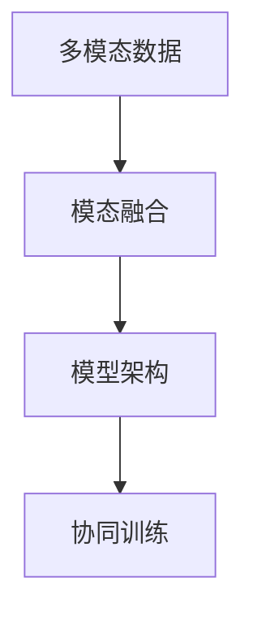

                 

### 引言：多模态学习的背景与重要性

#### 背景介绍

多模态学习（Multimodal Learning）是一种结合多种不同类型数据（如视觉、音频、文本等）进行融合处理的学习方法。随着人工智能技术的快速发展，尤其是深度学习技术的应用，多模态学习逐渐成为人工智能领域中的一个重要研究方向。多模态学习的核心目标是通过整合不同模态的数据，提高模型对复杂任务的处理能力，从而实现更高效、更准确的内容理解与生成。

在人工智能的发展历程中，多模态学习经历了从简单数据融合到复杂模型构建的演变。早期的多模态学习主要依赖于手工设计的特征和规则，如图像识别系统中的视觉特征与文本描述的结合。随着深度学习技术的兴起，特别是卷积神经网络（CNN）、循环神经网络（RNN）和自注意力机制等先进技术的引入，多模态学习取得了显著进展，可以更有效地处理和融合来自不同模态的数据。

#### 核心概念与联系

多模态学习涉及的核心概念包括：

1. **多模态数据**：指来自不同感知渠道的数据，如视觉、音频、文本等。
2. **模态融合**：将来自不同模态的数据进行整合，以生成更加丰富的特征表示。
3. **模型架构**：用于处理多模态数据的神经网络结构，如多输入层网络、多任务学习框架等。
4. **协同训练**：通过同时训练多个模态的数据来提高模型的泛化能力。

以下是多模态学习的概念实体之间的关系架构 Mermaid 流程图：

在这个架构图中，多模态数据是输入，通过模态融合生成更加丰富的特征表示，然后输入到特定的模型架构中进行处理。协同训练则是为了进一步提高模型的泛化能力和性能。

#### 应用领域

多模态学习在人工智能领域有着广泛的应用，如：

1. **图像识别与生成**：结合视觉数据和文本描述，可以生成更加准确的图像或图像描述。
2. **自然语言处理**：通过结合文本和语音数据，可以改善语音识别和文本生成质量。
3. **虚拟现实与增强现实**：多模态学习可以用于构建更加真实和互动的虚拟环境，提高用户体验。
4. **医疗诊断**：结合医学影像和患者数据，可以帮助医生进行更准确的疾病诊断。
5. **游戏开发**：多模态学习可以用于生成逼真的游戏场景和角色，提升游戏互动体验。

多模态学习的兴起和广泛应用，不仅推动了人工智能技术的发展，也为各类应用场景提供了新的解决方案。在接下来的章节中，我们将深入探讨多模态学习的基本概念、核心算法以及在实际应用中的具体实现。希望通过这篇文章，读者能够对多模态学习有一个全面而深入的理解。  

---

### 关键词

- 多模态学习
- AIGC
- 深度学习
- 模态融合
- 协同训练
- 多任务学习
- 图神经网络
- 虚拟现实
- 增强现实
- 图像生成
- 音频生成
- 自然语言处理
- 医疗诊断
- 游戏开发

---

### 摘要

本文旨在探讨多模态学习在人工智能生成内容（AIGC）全感官内容创作中的新进展。首先，我们介绍了多模态学习的背景和重要性，包括其基本概念、核心算法及其在各个领域的应用。接着，文章通过详细的Mermaid流程图、Python源代码示例、数学公式和实际案例，深入剖析了多模态学习的原理和实践。文章重点探讨了多模态数据采集与预处理、多模态特征提取、深度学习与多模态学习、协同训练与迁移学习、多模态学习的评估指标与模型选择，以及多模态学习在图像生成、音频生成、虚拟现实与增强现实、游戏开发等领域的具体应用。通过这篇文章，读者可以全面了解多模态学习在AIGC全感官内容创作中的新动态和前沿技术。

