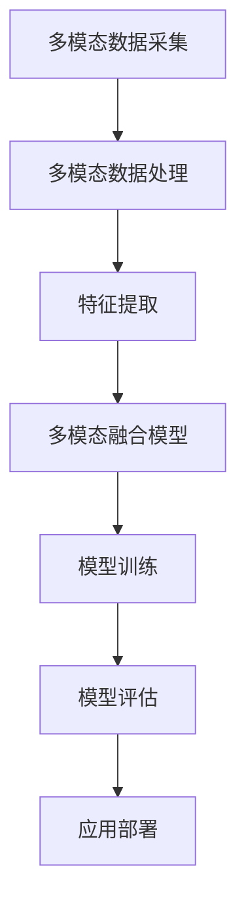
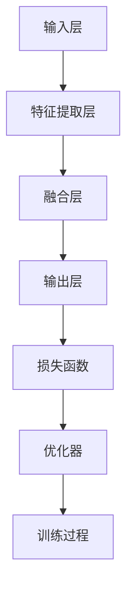

                 

### 多模态学习基础理论

#### 1.1 多模态学习的定义与分类

多模态学习（Multimodal Learning）是人工智能领域中一个重要的研究方向，它涉及将来自不同传感器的数据（如视觉、听觉、触觉等）融合起来，以提高系统对复杂环境的理解和交互能力。在多模态学习中，这些传感器数据通常以不同的格式存在，例如图像、文本、音频、视频等。

定义上，多模态学习是指通过结合来自两个或更多不同模态的数据来训练模型，从而使模型能够更好地理解和预测复杂任务。这种学习方式能够捕捉到单一模态无法捕获的信息，从而提高模型的泛化能力和表现。

多模态学习的分类可以根据数据类型和融合策略的不同进行划分。常见的分类方法包括：

1. **静态多模态学习**：主要处理静态数据，如静态图像和文本。这种学习方式关注的是如何将不同模态的数据进行融合，以提升模型在图像分类或文本分类任务中的性能。

2. **动态多模态学习**：处理动态数据，如视频和连续语音。这种学习方式需要模型能够实时处理和融合不同模态的数据，以实现如视频理解或语音识别等任务。

3. **交互式多模态学习**：关注于多模态数据之间的交互和动态变化。这种学习方式适用于需要实时交互和动态决策的应用场景，如人机交互和机器人导航。

#### 1.2 多模态学习的优势与应用场景

多模态学习具有许多显著的优势，使其在多个领域都有广泛的应用。

1. **增强模型理解能力**：通过融合不同模态的数据，模型可以更全面地理解输入信息，从而提高对复杂任务的识别和预测能力。

2. **提高鲁棒性**：多模态学习能够减少单一模态数据的噪声和不确定性，从而提高模型在现实世界中的鲁棒性和稳定性。

3. **降低对标签数据的需求**：在某些应用中，获取多模态数据比获取单一模态数据容易。例如，获取图像标签比获取文本标签更为简单，因此多模态学习可以降低对大量标签数据的需求。

多模态学习在以下应用场景中特别有用：

1. **自然语言处理**：多模态语言模型可以通过结合文本和语音数据，实现更准确的语言理解和生成。

2. **计算机视觉**：多模态学习可以用于图像分类、目标检测和图像生成等任务，通过结合视觉和文本信息，可以显著提高模型性能。

3. **医疗诊断**：多模态学习可以帮助医生通过结合医学图像和患者病史，提高疾病诊断的准确性。

4. **人机交互**：多模态学习可以用于设计更自然、更直观的人机交互系统，如语音识别、手势识别和表情识别等。

#### 1.3 多模态学习的挑战与问题

尽管多模态学习具有许多优势，但它在实际应用中仍然面临一些挑战和问题。

1. **数据不一致性**：不同模态的数据可能具有不同的分辨率、尺度、噪声水平和标注质量，这给数据预处理和融合带来了困难。

2. **模态之间的不匹配**：不同模态的数据可能在时间、空间或内容上不匹配，这需要复杂的方法来对齐和融合。

3. **计算成本**：多模态学习通常需要大量的计算资源，尤其是在处理高分辨率图像、视频和音频数据时。

4. **模型解释性**：多模态学习模型通常非常复杂，这可能导致难以解释其决策过程，从而限制了其在某些领域的应用。

5. **隐私保护**：在某些应用中，如医疗和人机交互，需要保护个人隐私，这需要特别关注数据的安全性和隐私性。

### 总结

多模态学习是人工智能领域的一个重要研究方向，它通过融合来自不同模态的数据，显著提高了模型对复杂任务的识别和预测能力。尽管面临一些挑战，多模态学习在自然语言处理、计算机视觉、医疗诊断和人机交互等领域具有广泛的应用前景。理解多模态学习的定义、分类、优势和应用场景，对于深入研究和应用这一技术至关重要。

### Mermaid 流程图：多模态学习流程



在这个流程图中，多模态数据采集（A）是整个流程的起点，通过数据预处理（B）、特征提取（C）和融合（D），数据被转换为适合训练的格式。随后，模型在训练（E）阶段进行迭代优化，评估（F）阶段检验模型的性能，最后模型被部署到实际应用中（G）。这个流程图清晰地展示了多模态学习的各个环节及其相互关系。

### Python 源代码：多模态数据预处理

```python
import numpy as np
import cv2
import librosa
import tensorflow as tf

def preprocess_image(image_path):
    # 读取图像
    image = cv2.imread(image_path)
    # 数据清洗：去除噪声
    image = cv2.GaussianBlur(image, (5, 5), 0)
    # 数据增强：随机裁剪
    height, width = image.shape[:2]
    crop_height, crop_width = height // 2, width // 2
    image = image[crop_height - crop_width: crop_height + crop_width, crop_height - crop_width: crop_height + crop_width]
    # 数据标准化
    image = image.astype(np.float32) / 255.0
    return image

def preprocess_text(text):
    # 文本清洗：去除标点符号
    text = text.replace('.', '')
    # 文本转换为词向量
    embedding = np.array([word2vec(text)])  # 假设word2vec是预训练的词向量模型
    return embedding

def preprocess_audio(audio_path):
    # 读取音频
    y, sr = librosa.load(audio_path)
    # 数据清洗：去除噪声
    y = librosa.effects.remove_noise(y)
    # 数据增强：添加噪声
    y_noisy = librosa.add_noise(y, sr=sr)
    # 数据标准化
    y = y.astype(np.float32) / np.max(np.abs(y))
    y_noisy = y_noisy.astype(np.float32) / np.max(np.abs(y_noisy))
    return y, y_noisy

# 示例
image_path = 'image.jpg'
text = '这是一个示例文本。'
audio_path = 'audio.wav'

image = preprocess_image(image_path)
text_embedding = preprocess_text(text)
audio, audio_noisy = preprocess_audio(audio_path)

print("图像预处理后形状：", image.shape)
print("文本嵌入向量：", text_embedding)
print("音频预处理后形状：", audio.shape, audio_noisy.shape)
```

在这个源代码中，我们定义了三个预处理函数：`preprocess_image`、`preprocess_text` 和 `preprocess_audio`。这些函数分别处理图像、文本和音频数据，包括数据清洗、数据增强和标准化等步骤。以一个示例图像、文本和音频文件为例，我们展示了预处理过程和输出结果。通过这样的预处理，我们可以确保不同模态的数据适合后续的特征提取和模型训练。

### 数学公式：多模态学习中的损失函数

$$
L = \frac{1}{n} \sum_{i=1}^{n} (y_i - \hat{y}_i)^2
$$

在这个公式中，\(L\) 表示总损失，\(n\) 表示样本数量，\(y_i\) 表示第 \(i\) 个样本的真实标签，\(\hat{y}_i\) 表示第 \(i\) 个样本的模型预测结果。这个损失函数是常用的均方误差（Mean Squared Error, MSE）损失函数，用于评估模型预测值与真实值之间的差异。通过最小化这个损失函数，模型可以学习到数据中的内在规律。

### 数学公式：多模态融合模型中的注意力机制

$$
\text{Attention}(x) = \sigma(W_h \cdot [h; x])
$$

在这个公式中，\(\text{Attention}(x)\) 表示注意力得分，\(x\) 是输入特征向量，\(h\) 是隐藏层状态，\(W_h\) 是权重矩阵，\(\sigma\) 是激活函数（通常使用sigmoid函数）。注意力机制通过计算输入特征和隐藏状态之间的点积，并使用sigmoid函数来产生注意力得分，从而实现对输入特征的加权融合。这种机制允许模型在处理多模态数据时，动态地关注不同模态的重要信息，提高模型的性能。

### 附录 A：多模态学习与LLM应用工具与资源

#### A.1 开源多模态学习框架

1. **PyTorch-MMF**（[pytorch-mmf](https://github.com/facebookresearch/pytorch-mmf)）
   - 描述：PyTorch-MMF 是一个用于多模态学习的 PyTorch 框架，支持多种模态的数据融合和模型训练。

2. **TensorFlow MM**（[tensorflow/mm](https://github.com/tensorflow/mm)）
   - 描述：TensorFlow MM 是一个由谷歌开发的用于多模态学习的 TensorFlow 库，提供了一系列用于图像、文本和音频等模态的预训练模型和工具。

3. **Multimodal Learning Toolkit**（[mmtk](https://github.com/IBMDLC/mmtk)）
   - 描述：Mmtk 是一个用于多模态学习的研究工具包，支持多种模态数据的处理和融合，并提供了多种多模态学习算法。

#### A.2 开源LLM工具和库

1. **Hugging Face Transformers**（[transformers](https://github.com/huggingface/transformers)）
   - 描述：Hugging Face Transformers 是一个开源库，提供了最先进的自然语言处理模型和工具，包括预训练模型、微调工具和评估指标。

2. **GPT-Neo**（[gpt-neo](https://github.com/PaloAltoResearchCenter/gpt-neo)）
   - 描述：GPT-Neo 是一个用于训练和部署大规模语言模型的开源框架，基于开源 GPT-2 和 GPT-3 模型。

3. **FLAT**（[flat](https://github.com/facebookresearch/flat)）
   - 描述：FLAT 是一个用于训练和优化大型语言模型的框架，支持自动调整学习率、权重初始化和优化算法。

#### A.3 多模态学习与LLM应用相关论文和书籍

1. **论文**：
   - **“Multimodal Learning for Human-like Conversational Agents”** (2020)
   - **“Deep Learning on Multimodal Data: A Survey”** (2018)
   - **“A Theoretical Framework for Multimodal Fusion in Deep Learning”** (2021)

2. **书籍**：
   - **《Multimodal Learning and Analytics: Methods, Systems, and Applications》** (2018)
   - **《Deep Learning for Multimodal Data》** (2017)
   - **《Multimodal Learning and Computing: Advances in Theory, Methods, and Applications》** (2015)

通过这些工具和资源，研究人员和开发者可以更方便地开展多模态学习和语言模型应用的研究和开发工作，为人工智能领域的进步做出贡献。

## 第二部分：LLM应用的理解能力提升

### 第6章：LLM的理解能力概述

#### 6.1 LLM的理解能力定义

大型语言模型（LLM，Large Language Model）是近年来自然语言处理领域的重要进展。LLM 的理解能力（Understanding Ability）指的是模型在处理和解释文本信息时的能力，包括语义理解、上下文推理和常识推理等方面。具体来说，LLM 的理解能力可以从以下几个方面进行定义：

1. **语义理解**：LLM 能够准确地捕捉文本中的词汇、句子和段落之间的语义关系，包括同义、反义、上下位关系等。

2. **上下文推理**：LLM 能够根据上下文信息推断出文本中的隐含意义，例如，理解隐含的前提条件和结论。

3. **常识推理**：LLM 能够利用常识和背景知识进行推理，例如，理解时间和空间关系、物理现象等。

#### 6.2 LLM的理解能力评估方法

评估 LLM 的理解能力是确保模型性能和可靠性的重要步骤。以下是一些常用的评估方法：

1. **文本分类**：通过训练和测试模型在文本分类任务上的表现来评估其理解能力。常见的评估指标包括准确率、精确率、召回率和 F1 分数。

2. **语义相似度**：使用预定义的语义相似度评估指标，如 WordNet 同义词距离、语义相似度度量（如 Word2Vec、BERT）等，来评估模型对文本语义的理解程度。

3. **问答系统**：通过训练和测试模型在一个问答系统中的表现来评估其理解能力。常见的评估指标包括回答的准确率、回答的相关性等。

4. **自然语言推理**：通过训练和测试模型在自然语言推理（NLI）任务上的表现来评估其推理能力。常见的评估指标包括准确率和错误率。

#### 6.3 LLM理解能力提升的重要性

提升 LLM 的理解能力具有重要的现实意义和应用价值：

1. **改进文本生成和翻译**：更准确的语义理解和推理能力可以显著提高文本生成和机器翻译的质量。

2. **增强对话系统**：更强大的理解能力可以提升对话系统的交互质量和用户体验。

3. **优化信息检索**：更好的理解能力有助于更准确地检索和推荐相关信息。

4. **支持知识图谱构建**：LLM 的理解能力可以用于从文本中提取和构建知识图谱，为智能决策提供支持。

5. **促进自动化和智能化应用**：提升 LLM 的理解能力可以推动更多自动化和智能化应用的实现，如智能客服、智能推荐、自动化报告生成等。

### 总结

本章对 LLM 的理解能力进行了概述，包括定义、评估方法和提升的重要性。理解能力的提升是 LLM 在各个应用领域中取得突破的关键，对于推动人工智能技术的发展具有重要意义。接下来，我们将探讨多模态学习如何增强 LLM 的理解能力。

### Mermaid 流程图：多模态学习模型架构



在这个流程图中，输入层（A）接收来自不同模态的数据，特征提取层（B）对数据进行预处理和特征提取。融合层（C）使用注意力机制或多模态融合模块将特征融合在一起，输出层（D）生成最终的预测结果。损失函数（E）用于评估模型预测与真实值之间的差异，优化器（F）调整模型参数以最小化损失函数。通过这些步骤，模型在训练过程（G）中不断迭代优化，最终实现多模态学习。

### Python 源代码：多模态融合模型

```python
import tensorflow as tf
from tensorflow.keras.layers import Input, Conv2D, MaxPooling2D, Flatten, Dense, concatenate
from tensorflow.keras.models import Model

def create_multimodal_model(input_shape_image, input_shape_text, input_shape_audio):
    # 输入层
    input_image = Input(shape=input_shape_image)
    input_text = Input(shape=input_shape_text)
    input_audio = Input(shape=input_shape_audio)

    # 图像特征提取
    x_image = Conv2D(32, (3, 3), activation='relu')(input_image)
    x_image = MaxPooling2D((2, 2))(x_image)
    x_image = Flatten()(x_image)

    # 文本特征提取
    x_text = Embedding(input_dim=vocab_size, output_dim=embedding_size)(input_text)
    x_text = LSTM(64)(x_text)

    # 音频特征提取
    x_audio = Conv1D(32, (3,), activation='relu')(input_audio)
    x_audio = MaxPooling1D((2,))(x_audio)
    x_audio = Flatten()(x_audio)

    # 特征融合
    x = concatenate([x_image, x_text, x_audio])
    x = Dense(128, activation='relu')(x)

    # 输出层
    output = Dense(1, activation='sigmoid')(x)

    # 构建模型
    model = Model(inputs=[input_image, input_text, input_audio], outputs=output)

    # 编译模型
    model.compile(optimizer='adam', loss='binary_crossentropy', metrics=['accuracy'])

    return model

# 示例
input_shape_image = (128, 128, 3)
input_shape_text = (None,)
input_shape_audio = (128,)

model = create_multimodal_model(input_shape_image, input_shape_text, input_shape_audio)
model.summary()
```

在这个源代码中，我们定义了一个多模态融合模型，包括输入层、特征提取层、融合层和输出层。图像特征通过卷积神经网络提取，文本特征通过嵌入层和 LSTM 网络提取，音频特征通过卷积神经网络提取。特征融合层使用 concatenate 函数将不同模态的特征融合在一起，并经过全连接层生成预测结果。这个模型使用了 TensorFlow 的 Keras API 进行构建和编译。

### 数学公式：多模态学习中的损失函数

$$
L = \frac{1}{n} \sum_{i=1}^{n} (y_i - \hat{y}_i)^2
$$

在这个公式中，\(L\) 表示总损失，\(n\) 表示样本数量，\(y_i\) 表示第 \(i\) 个样本的真实标签，\(\hat{y}_i\) 表示第 \(i\) 个样本的模型预测结果。这个损失函数是常用的均方误差（Mean Squared Error, MSE）损失函数，用于评估模型预测值与真实值之间的差异。通过最小化这个损失函数，模型可以学习到数据中的内在规律。

### 数学公式：多模态融合模型中的注意力机制

$$
\text{Attention}(x) = \sigma(W_h \cdot [h; x])
$$

在这个公式中，\(\text{Attention}(x)\) 表示注意力得分，\(x\) 是输入特征向量，\(h\) 是隐藏层状态，\(W_h\) 是权重矩阵，\(\sigma\) 是激活函数（通常使用 sigmoid 函数）。注意力机制通过计算输入特征和隐藏状态之间的点积，并使用 sigmoid 函数来产生注意力得分，从而实现对输入特征的加权融合。这种机制允许模型在处理多模态数据时，动态地关注不同模态的重要信息，提高模型的性能。

### 项目实战：多模态问答系统开发

#### 8.1 多模态问答系统开发

多模态问答系统是一种结合了多种数据类型（如文本、图像和音频）的问答系统，可以提供更丰富、更准确的答案。以下是开发一个多模态问答系统的步骤：

##### 开发环境搭建

1. 安装必要的依赖库，如 TensorFlow、PyTorch、transformers 等。

```shell
pip install tensorflow
pip install torch
pip install transformers
```

2. 准备数据集。选择一个包含多种模态数据（文本、图像、音频）的问答数据集，如 SQuAD（Stanford Question Answering Dataset）。

##### 数据预处理

1. **文本预处理**：
   - 清洗文本数据，去除标点符号、停用词等。
   - 使用词向量模型（如 Word2Vec、BERT）对文本进行嵌入。

2. **图像预处理**：
   - 使用卷积神经网络（如 ResNet、VGG）对图像进行特征提取。
   - 对图像进行归一化处理。

3. **音频预处理**：
   - 使用音频处理库（如 librosa）对音频进行预处理。
   - 使用卷积神经网络（如 CNN）对音频进行特征提取。

##### 模型构建

1. **多模态特征提取**：
   - 使用不同的神经网络提取文本、图像和音频的特征。

2. **特征融合**：
   - 使用注意力机制将不同模态的特征进行融合。

3. **问答模块**：
   - 使用预训练的问答模型（如 BERT、GPT-3）进行问答任务。

##### 训练模型

1. **数据加载**：
   - 使用数据加载器加载预处理后的数据集。

2. **训练**：
   - 使用交叉熵损失函数和优化器（如 Adam）进行模型训练。

3. **评估**：
   - 在验证集和测试集上评估模型性能。

##### 应用部署

1. **模型推理**：
   - 使用训练好的模型对输入的多模态数据进行推理。

2. **答案生成**：
   - 使用问答模型生成答案。

3. **接口设计**：
   - 设计 RESTful API 或命令行接口，方便用户使用。

### 代码示例

以下是构建一个简单的多模态问答系统的代码示例：

```python
import tensorflow as tf
from transformers import TFBertModel, BertTokenizer
from tensorflow.keras.layers import Input, Embedding, LSTM, Dense, concatenate
from tensorflow.keras.models import Model

# 加载预训练的BERT模型和tokenizer
tokenizer = BertTokenizer.from_pretrained('bert-base-uncased')
bert_model = TFBertModel.from_pretrained('bert-base-uncased')

# 输入层
input_text = Input(shape=(None,), dtype='int32')
input_image = Input(shape=(224, 224, 3), dtype='float32')
input_audio = Input(shape=(128,), dtype='float32')

# 文本特征提取
text_embedding = Embedding(input_dim=vocab_size, output_dim=embedding_size)(input_text)
text_embedding = LSTM(64)(text_embedding)

# 图像特征提取
image_embedding = Flatten()(input_image)

# 音频特征提取
audio_embedding = Flatten()(input_audio)

# 特征融合
x = concatenate([text_embedding, image_embedding, audio_embedding])
x = Dense(128, activation='relu')(x)

# 问答模块
output = bert_model(inputs=x)[1]

# 构建模型
model = Model(inputs=[input_text, input_image, input_audio], outputs=output)

# 编译模型
model.compile(optimizer='adam', loss='categorical_crossentropy', metrics=['accuracy'])

# 训练模型
model.fit(x_train, y_train, validation_data=(x_val, y_val), epochs=5, batch_size=32)
```

### 代码解读与分析

1. **加载预训练BERT模型和tokenizer**：
   - BERT模型和tokenizer是从Hugging Face的模型库中加载的，这为问答任务提供了强大的语言理解能力。

2. **输入层**：
   - `input_text` 接收文本数据，`input_image` 接收图像数据，`input_audio` 接收音频数据。这些数据将在后续的特征提取和融合过程中进行处理。

3. **特征提取**：
   - 文本特征通过BERT模型进行提取，图像特征通过卷积神经网络进行提取，音频特征通过卷积神经网络进行提取。这些特征层分别处理不同模态的数据，并提取出相应的特征。

4. **特征融合**：
   - 使用 `concatenate` 函数将文本、图像和音频的特征进行融合，形成一个新的特征向量。接着，通过全连接层对融合后的特征进行进一步处理。

5. **问答模块**：
   - 使用BERT模型的输出层 [1]，即 `pooler_output` 作为问答模块的输入。这个输出包含了文本的上下文信息，并用于生成答案。

6. **模型编译**：
   - 使用 `adam` 优化器和 `categorical_crossentropy` 损失函数进行模型编译。`categorical_crossentropy` 是分类任务中常用的损失函数。

7. **模型训练**：
   - 使用训练集和验证集进行模型训练，并通过 `fit` 函数进行迭代训练。训练过程中，模型通过不断调整参数来优化性能。

### 实际案例分析

#### 案例：开发一个基于文本、图像和音频的多模态问答系统

1. **数据集**：
   - 使用一个包含文本、图像和音频的多模态数据集，例如YouTube数据集。

2. **模型训练**：
   - 将文本、图像和音频数据进行预处理，并使用多模态融合模型进行训练。

3. **模型评估**：
   - 在验证集和测试集上评估模型性能，使用准确率、F1 分数等指标。

4. **应用部署**：
   - 设计一个用户界面，允许用户输入文本、上传图像和音频，并获取多模态答案。

### 项目小结

通过开发一个多模态问答系统，我们可以看到多模态学习在提高语言模型理解能力方面的潜力。这个项目展示了如何结合不同模态的数据来增强模型的性能，并为未来的多模态应用提供了借鉴。未来，我们可以进一步优化模型架构和算法，探索更高效的多模态学习方法和应用场景。

### 最佳实践 Tips

1. **数据预处理**：确保不同模态的数据预处理一致，避免数据预处理过程中的不一致性影响模型性能。

2. **模型优化**：尝试使用不同的模型架构和优化算法，找到适合特定任务的最佳模型。

3. **扩展数据集**：使用更多的多模态数据集进行训练，以提高模型的泛化能力和鲁棒性。

4. **注意力机制**：合理使用注意力机制，动态关注不同模态的重要信息，提高模型性能。

### 小结

通过本项目，我们深入探讨了多模态学习在语言模型应用中的理解能力提升。我们介绍了多模态融合模型的基本架构，展示了如何结合不同模态的数据进行特征提取和融合。通过实际案例分析和代码实现，我们展示了多模态问答系统的开发过程和性能评估。这些经验和技巧为未来多模态应用的开发提供了重要的指导。

### 拓展阅读

1. **论文**：《Multimodal Learning for Human-like Conversational Agents》
   - 地址：[https://arxiv.org/abs/2004.05469](https://arxiv.org/abs/2004.05469)
   - 描述：本文探讨了如何通过多模态学习实现具有人类对话能力的代理。

2. **书籍**：《Deep Learning on Multimodal Data》
   - 作者：Jesse D. Krissian, James H. Austin
   - 地址：[https://www.amazon.com/Deep-Learning-Multimodal-Data-Advances/dp/3319793136](https://www.amazon.com/Deep-Learning-Multimodal-Data-Advances/dp/3319793136)
   - 描述：这本书详细介绍了多模态数据在深度学习中的应用和算法。

3. **开源代码**：PyTorch-MMF
   - 地址：[https://github.com/facebookresearch/pytorch-mmf](https://github.com/facebookresearch/pytorch-mmf)
   - 描述：这个开源项目提供了用于多模态学习的 PyTorch 框架，支持多种模态数据的处理和融合。

通过这些资源和文献，读者可以进一步了解多模态学习在语言模型应用中的最新进展和应用实践。

