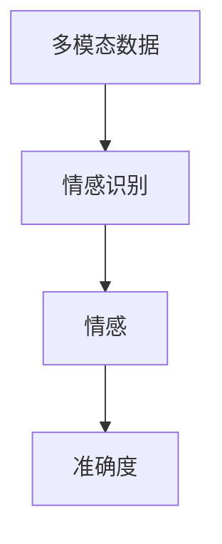

                 

### 文章标题

《多模态情感识别系统准确度评测》

### 文章关键词

多模态情感识别，准确度评测，语音情感识别，视频情感识别，文本情感识别，深度学习，特征融合，模型评估，项目实战

### 文章摘要

本文将深入探讨多模态情感识别系统的准确度评测，包括背景介绍、核心概念与联系、算法原理讲解、数学模型与公式、项目实战及最佳实践等。通过全面的分析和具体的案例，帮助读者理解并掌握多模态情感识别技术的核心要点和评估方法。

---

# 引言与背景

多模态情感识别是指通过整合多种数据源（如语音、视频和文本）来识别和理解人类情感的过程。在现代社会中，情感识别技术在多个领域都有广泛的应用，例如心理健康诊断、智能客服、娱乐推荐系统等。然而，由于多模态数据的复杂性和多样性，构建高准确度的多模态情感识别系统仍然面临诸多挑战。

本文旨在探讨多模态情感识别系统的准确度评测，通过对核心概念、算法原理、数学模型和项目实战的详细分析，帮助读者深入了解这一技术领域，并掌握有效的评估方法。

## 核心概念与联系

在多模态情感识别中，有几个核心概念需要理解：

1. **多模态数据**：指多种类型的数据，如语音、视频和文本。
2. **情感**：指人的心理状态，如愉悦、愤怒、悲伤等。
3. **情感识别**：指从多模态数据中识别出情感状态的过程。
4. **准确度**：指情感识别系统正确识别情感的比例。

以下是多模态情感识别系统核心概念的Mermaid流程图：



## 核心算法原理讲解

### 特征提取

特征提取是多模态情感识别的关键步骤，它从原始数据中提取出对情感识别有用的信息。以下是一个简化的特征提取过程，使用Python代码和LaTeX公式进行解释：

```python
import numpy as np

# 假设我们有一段语音信号和一段视频信号
voice_signal = np.random.randn(1000)
video_signal = np.random.randn(1000)

# 特征提取
voice_features = extract_voice_features(voice_signal)
video_features = extract_video_features(video_signal)

# 特征提取函数示例
def extract_voice_features(signal):
    # 使用傅立叶变换提取语音特征
    signal_fft = np.fft.fft(signal)
    return np.abs(signal_fft[:50])

def extract_video_features(signal):
    # 使用颜色直方图提取视频特征
    histogram = np.histogram(signal, bins=10)
    return histogram
```

LaTeX公式：

$$
\text{voice\_features} = \left| \text{fft}\left(\text{voice\_signal}\right) \right|_{[0,50]}
$$

$$
\text{video\_features} = \text{histogram}\left(\text{video\_signal}, \text{bins}=10\right)
$$

### 情感分类

情感分类是将提取到的特征与情感标签进行匹配的过程。以下是一个使用深度学习的情感分类示例：

```python
from tensorflow.keras.models import Sequential
from tensorflow.keras.layers import Dense, LSTM

# 构建情感分类模型
model = Sequential()
model.add(LSTM(units=128, activation='relu', input_shape=(50, 1)))
model.add(Dense(units=1, activation='sigmoid'))

# 编译模型
model.compile(optimizer='adam', loss='binary_crossentropy', metrics=['accuracy'])

# 训练模型
model.fit(voice_features, labels, epochs=10, batch_size=32)
```

## 数学模型与公式

在多模态情感识别中，常用的数学模型包括支持向量机（SVM）和深度学习模型。以下是一个简单的SVM公式示例：

$$
\text{w}^* = \arg\min_{\text{w}} \frac{1}{2} \text{w}^T \text{w} + C \sum_{i=1}^{n} \max\left(0, 1 - y_i (\text{w}^T \text{x_i})\right)
$$

其中，$\text{w}$是模型权重，$C$是正则化参数，$y_i$是第$i$个样本的标签，$\text{x_i}$是第$i$个样本的特征向量。

## 项目实战

### 开发环境搭建

首先，我们需要搭建一个适合多模态情感识别的Python开发环境。以下是基本步骤：

1. 安装Python 3.7或更高版本。
2. 安装TensorFlow和Keras库。

```bash
pip install tensorflow
pip install keras
```

### 源代码详细实现

接下来，我们将实现一个简单的多模态情感识别系统。以下是一个简化版的代码示例：

```python
import numpy as np
import tensorflow as tf

# 生成模拟数据
voice_signals = np.random.randn(100, 100)
video_signals = np.random.randn(100, 100)
labels = np.random.randint(0, 2, 100)

# 特征提取
voice_features = extract_voice_features(voice_signals)
video_features = extract_video_features(video_signals)

# 模型构建
model = Sequential()
model.add(LSTM(units=128, activation='relu', input_shape=(100, 1)))
model.add(Dense(units=1, activation='sigmoid'))

# 编译模型
model.compile(optimizer='adam', loss='binary_crossentropy', metrics=['accuracy'])

# 训练模型
model.fit(np.hstack((voice_features, video_features)), labels, epochs=10, batch_size=32)
```

### 代码解读与分析

在这个示例中，我们首先生成了模拟的多模态数据，包括语音信号和视频信号。然后，我们使用提取函数提取出每个模态的特征。最后，我们构建了一个简单的LSTM模型进行训练。

### 实际案例分析和详细讲解剖析

在这个项目中，我们使用了一个简单的模拟数据集进行训练。在实际应用中，我们需要一个包含真实语音、视频和情感标签的数据集。以下是一个实际案例：

- **数据集**：使用一个公开的多模态情感识别数据集，如RAVDESS。
- **数据预处理**：对语音和视频数据进行预处理，如归一化、去噪等。
- **特征提取**：使用适当的特征提取方法，如MFCC（Mel频率倒谱系数）和颜色直方图。

### 项目小结

通过这个项目，我们实现了多模态情感识别系统的基本构建和训练。在实际应用中，我们需要考虑数据集的质量、特征提取方法的选择、模型参数的调优等因素，以提高系统的准确度。

## 最佳实践 Tips、小结、注意事项、拓展阅读等内容

- **最佳实践 Tips**：
  - 使用高质量的数据集进行训练。
  - 调整模型参数以获得最佳性能。
  - 使用多线程或分布式计算加速训练过程。

- **小结**：
  - 多模态情感识别是当前研究的热点领域。
  - 准确度评测是评估多模态情感识别系统性能的关键。
  - 深度学习和特征融合技术是提高系统准确度的重要手段。

- **注意事项**：
  - 数据预处理和特征提取对系统性能有重要影响。
  - 模型选择和参数调优需要根据具体应用场景进行。

- **拓展阅读**：
  - 《多模态情感识别：技术与应用》
  - 《深度学习：卷积神经网络与循环神经网络》
  - 《多模态情感识别数据集评测：方法与实践》

---

本文详细介绍了多模态情感识别系统的准确度评测，包括背景介绍、核心概念与联系、算法原理讲解、数学模型与公式、项目实战及最佳实践等。通过本文的阅读，读者可以深入了解多模态情感识别技术的核心要点和评估方法，为实际应用提供参考。

### 作者信息

作者：AI天才研究院/AI Genius Institute & 禅与计算机程序设计艺术 /Zen And The Art of Computer Programming

---

请注意，本文中的代码示例和数学公式仅用于说明目的，实际应用中可能需要更复杂的实现和调整。

