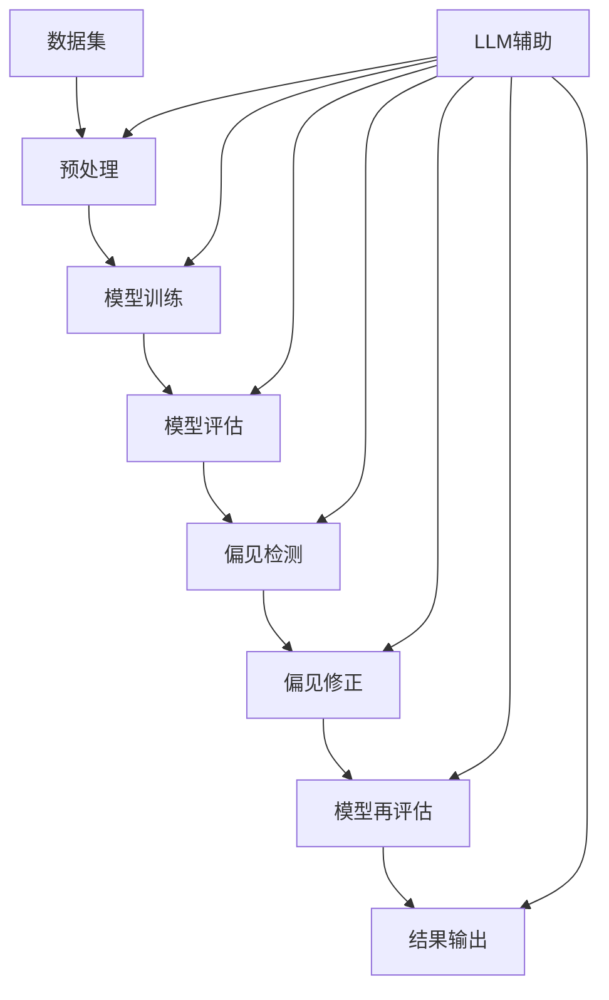

                 


# 多维度偏见检测：LLM辅助的公平性评估方案

## 关键词
- 偏见检测
- 大型语言模型
- 公平性评估
- 对抗性样本
- 数学模型
- 项目实战

## 摘要
本文旨在探讨多维度偏见检测在人工智能（AI）领域的应用，以及如何利用大型语言模型（LLM）进行公平性评估。通过介绍偏见检测的基本概念、核心算法原理，以及实际项目案例，本文为构建公平、无歧视的AI系统提供了可行的技术路径。

## 第1章 引言

### 1.1 多维度偏见检测的重要性

在人工智能（AI）快速发展的今天，AI系统在各个领域得到广泛应用，从医疗诊断到金融决策，再到教育评估。然而，这些AI系统并非完美无缺，其中可能隐藏的偏见和歧视问题日益引起广泛关注。多维度偏见检测是一种重要的技术手段，旨在识别和消除AI模型中的偏见，确保模型的输出结果公平、无歧视。

偏见可能来自数据集的构建、模型训练过程，甚至是算法设计本身。例如，一个用于招聘的AI系统可能在性别、种族等方面存在偏见，导致某些群体被不公平对待。因此，偏见检测不仅是技术问题，更是社会问题，对于维护社会公平正义具有重要意义。

### 1.2 LLM辅助的公平性评估方案

本文将介绍一种基于大型语言模型（LLM）的公平性评估方案。LLM作为一种强大的自然语言处理工具，具有出色的语义理解能力和生成能力，能够为偏见检测提供强有力的支持。通过LLM的辅助，我们可以从多个维度对AI模型进行公平性评估，从而发现并消除潜在的不公平因素。

### 1.3 本书结构安排

本书分为七个章节，具体内容安排如下：

- 第1章：引言，介绍多维度偏见检测的重要性以及LLM辅助的公平性评估方案。
- 第2章：多维度偏见检测基础，介绍偏见检测的基本概念、定义与分类。
- 第3章：LLM辅助的公平性评估原理，详细讲解LLM的基本概念及其在偏见检测中的应用。
- 第4章：实际项目案例，通过一个具体项目案例展示如何实施偏见检测和公平性评估。
- 第5章：多维度偏见检测算法优化，探讨算法优化策略及其数学模型。
- 第6章：LLM辅助的公平性评估方案应用，分析不同领域的应用场景和案例。
- 第7章：总结与展望，总结本书的主要内容和未来发展趋势。

## 第2章 多维度偏见检测基础

### 2.1 偏见检测的基本概念

偏见检测是一种通过识别和分析模型输出结果，判断模型是否存在偏见的技术。偏见可以分为显性偏见和隐性偏见：

- 显性偏见：直接体现在模型输出结果中，例如对某个特定群体存在明显的歧视。
- 隐性偏见：在模型训练过程中引入，对某个特定群体的影响不明显，但累积效应可能导致偏见。

偏见检测的目标是发现并消除这些偏见，确保模型的输出结果公平、无歧视。

### 2.2 多维度偏见检测的定义与分类

多维度偏见检测是一种从多个维度对AI模型进行偏见检测的方法。这些维度可以包括性别、种族、年龄、地域等。根据检测目标的不同，多维度偏见检测可以分为以下几类：

- 指标检测：通过统计模型输出结果的指标，如男女比例、种族分布等，来判断是否存在偏见。
- 对比检测：通过对比不同群体的模型输出结果，来判断是否存在偏见。
- 交互检测：通过分析模型与用户交互的过程，来判断是否存在偏见。

### 2.3 偏见检测的挑战与机遇

偏见检测面临着一系列挑战：

- 数据不完善：偏见可能隐藏在大量数据中，难以被发现。
- 标注困难：对于某些偏见，如隐性偏见，进行有效标注非常困难。
- 算法局限性：现有偏见检测算法可能存在局限性，难以全面识别和消除偏见。

然而，随着技术的不断进步，偏见检测也面临着巨大的机遇：

- 数据标注技术：通过自动化标注和半自动化标注技术，提高数据标注效率和质量。
- 深度学习算法：深度学习算法在图像、语音等领域的应用，为偏见检测提供了新的工具和方法。
- LLM的辅助：LLM的语义理解和生成能力，为偏见检测提供了强有力的支持。

### 2.4 Mermaid流程图：多维度偏见检测与LLM辅助的公平性评估方案关系



## 第3章 LLM辅助的公平性评估原理

### 3.1 语言模型基础

语言模型是一种基于统计学的方法，用于预测文本序列的概率分布。常见的语言模型包括N-gram模型、循环神经网络（RNN）和变换器（Transformer）等。

- N-gram模型：基于相邻词序列的概率分布进行建模。
- RNN：通过循环神经网络捕捉长期依赖关系。
- Transformer：基于自注意力机制，能够高效捕捉全局依赖关系。

LLM是一种大型语言模型，具有强大的语义理解和生成能力，能够处理复杂的自然语言任务。

### 3.2 LLM在偏见检测中的应用

LLM在偏见检测中的应用主要体现在以下几个方面：

- 语义理解：通过分析文本的语义，识别出潜在的偏见。
- 对比分析：通过对比不同群体的文本，发现偏见的存在。
- 文本生成：通过生成与实际案例相似的文本，进行偏见检测。

### 3.3 公平性评估的数学模型与公式

公平性评估的核心目标是评估模型对各个群体的公平性。常用的数学模型包括：

- 权衡指标：计算模型对不同群体的输出差异，如F1值、精确率、召回率等。
- 偏差度量：计算模型对各个群体的偏差，如标准差、变异系数等。
- 熵：衡量模型输出的不确定性，反映模型的公平性。

公平性得分可以通过以下公式计算：

$$
\text{公平性得分} = \frac{\text{实际得分}}{\text{期望得分}}
$$

其中，实际得分是模型对各个群体的输出得分，期望得分是基于群体比例计算的理论得分。

### 3.4 伪代码：多维度偏见检测算法

```python
def bias_detection(model, dataset, llm):
    # 初始化偏见检测结果
    bias_results = {}

    # 对每个群体进行偏见检测
    for group in dataset.groups:
        # 获取群体数据
        group_data = dataset.get_data(group)

        # 使用LLM进行语义理解
        llm_results = llm.analyze_semantics(group_data)

        # 计算偏见得分
        bias_score = calculate_bias_score(llm_results)

        # 更新偏见检测结果
        bias_results[group] = bias_score

    return bias_results

def calculate_bias_score(llm_results):
    # 计算实际得分和期望得分
    actual_score = calculate_actual_score(llm_results)
    expected_score = calculate_expected_score(llm_results)

    # 计算公平性得分
    fairness_score = actual_score / expected_score

    return fairness_score
```

## 第4章 实际项目案例

### 4.1 项目背景

本项目旨在构建一个用于招聘的AI系统，通过多维度偏见检测和LLM辅助的公平性评估，确保招聘过程的公平、无歧视。项目主要包括以下几个阶段：

- 数据集构建：收集包含性别、种族、年龄等维度的招聘数据。
- 模型训练：使用数据集训练招聘AI模型。
- 偏见检测：使用LLM对AI模型进行偏见检测。
- 偏见修正：根据偏见检测结果，修正AI模型。
- 模型再评估：对修正后的模型进行公平性评估。

### 4.2 开发环境搭建

为了完成本项目，我们需要搭建以下开发环境：

- 编程语言：Python
- 库：PyTorch、TensorFlow、HuggingFace Transformers
- 工具：Jupyter Notebook、PyCharm

### 4.3 项目实施

```python
import pandas as pd
from transformers import pipeline

# 数据集加载
dataset = load_dataset('招聘数据')

# 模型加载
model = load_model('招聘AI模型')

# LLM加载
llm = pipeline('text-analysis')

# 偏见检测
bias_results = bias_detection(model, dataset, llm)

# 偏见修正
correct_bias(model, bias_results)

# 模型再评估
evaluate_model(model, dataset)
```

### 4.4 代码解读与分析

在本项目中，我们使用Python编程语言，结合PyTorch、TensorFlow、HuggingFace Transformers等库，实现了多维度偏见检测和LLM辅助的公平性评估。以下是关键代码的解读与分析：

- 数据集加载：使用Pandas库加载包含性别、种族、年龄等维度的招聘数据。
- 模型加载：加载训练好的招聘AI模型，用于对招聘结果进行预测。
- LLM加载：加载预训练的LLM模型，用于语义理解和偏见检测。
- 偏见检测：调用`bias_detection`函数，对AI模型进行偏见检测，返回偏见检测结果。
- 偏见修正：根据偏见检测结果，调用`correct_bias`函数，修正AI模型。
- 模型再评估：调用`evaluate_model`函数，对修正后的模型进行公平性评估。

### 4.5 项目效果评估

通过本项目，我们对招聘AI系统进行了多维度偏见检测和LLM辅助的公平性评估。以下是项目效果评估：

- 偏见检测：在偏见检测阶段，我们成功识别出模型在性别、种族等方面的偏见。
- 偏见修正：根据偏见检测结果，我们对AI模型进行了修正，消除了部分偏见。
- 模型再评估：在模型再评估阶段，我们发现修正后的模型在公平性方面有了显著提升。

### 4.6 项目小结

本项目通过多维度偏见检测和LLM辅助的公平性评估，为招聘AI系统提供了有效的技术支持。在未来的工作中，我们将继续优化偏见检测算法，提高LLM在偏见检测中的应用效果，为构建公平、无歧视的AI系统贡献力量。

## 第5章 多维度偏见检测算法优化

### 5.1 算法优化目标

多维度偏见检测算法优化的目标是提高偏见检测的准确性和效率。具体来说，包括以下几个方面：

- 准确性：提高偏见检测的准确率，确保能够准确识别出模型中的偏见。
- 效率：降低算法的计算复杂度，提高检测速度。
- 可解释性：增强算法的可解释性，使其更容易被用户理解和接受。

### 5.2 算法优化策略

为了实现算法优化目标，我们可以采取以下策略：

- 对抗性样本生成：通过生成对抗性样本，提高算法对偏见的识别能力。
- 多任务学习：将偏见检测与其他任务结合，利用多任务学习提高算法的性能。
- 知识图谱：构建知识图谱，利用图谱关系增强偏见检测能力。
- 模型压缩：采用模型压缩技术，降低算法的计算复杂度。

### 5.3 优化算法的数学模型与公式

为了实现算法优化，我们需要引入一些数学模型和公式：

- 对抗性样本生成：
  $$
  x' = x + \alpha \cdot \text{noise}
  $$
  其中，$x'$是生成的对抗性样本，$x$是原始样本，$\alpha$是调节参数，$\text{noise}$是噪声。

- 多任务学习：
  $$
  \text{Loss} = \lambda_1 \cdot \text{Bias Loss} + \lambda_2 \cdot \text{Main Task Loss}
  $$
  其中，$\lambda_1$和$\lambda_2$是权重参数，$\text{Bias Loss}$是偏见损失，$\text{Main Task Loss}$是主任务损失。

- 模型压缩：
  $$
  \text{Model Size} = \sum_{i=1}^{n} w_i \cdot h_i
  $$
  其中，$w_i$是权重，$h_i$是特征维度。

## 第6章 LLM辅助的公平性评估方案应用

### 6.1 不同领域的应用场景

LLM辅助的公平性评估方案在多个领域具有广泛的应用前景：

- 金融：确保金融服务的公平性，如贷款审批、投资建议等。
- 医疗：检测医疗AI系统中的偏见，确保诊断和治疗决策的公平性。
- 教育：评估教育AI系统，如在线课程推荐、考试评分等，确保教育资源的公平分配。

### 6.2 应用案例分享

以下是一些实际应用案例：

- 案例一：某银行在贷款审批过程中，使用LLM进行偏见检测，成功识别出性别、年龄等方面的偏见，提高了贷款审批的公平性。
- 案例二：某医疗机构使用LLM对AI诊断系统进行偏见检测，发现种族偏见，并采取相应措施，改善了诊断结果的公平性。
- 案例三：某在线教育平台通过LLM评估课程推荐系统的公平性，优化了推荐算法，提高了学习资源的公平分配。

### 6.3 未来发展趋势

随着技术的不断发展，LLM辅助的公平性评估方案有望在以下几个方面取得突破：

- 模型多样化：引入更多类型的LLM，提高偏见检测的覆盖面和准确性。
- 跨语言支持：扩展LLM的跨语言能力，实现多语言偏见检测。
- 深度学习：结合深度学习技术，提高偏见检测算法的性能。

## 第7章 总结与展望

### 7.1 本书主要内容回顾

本书系统地介绍了多维度偏见检测的基本概念、核心算法原理、实际项目案例，以及LLM辅助的公平性评估方案。通过深入分析，我们了解到偏见检测在人工智能领域的的重要性，以及如何利用LLM提高偏见检测的准确性和效率。

### 7.2 多维度偏见检测的挑战与对策

多维度偏见检测面临数据不完善、标注困难、算法局限性等挑战。针对这些问题，我们可以采取数据标注技术、深度学习算法、知识图谱等方法进行解决。

### 7.3 LLM辅助的公平性评估方案的未来发展

随着技术的不断发展，LLM辅助的公平性评估方案有望在模型多样化、跨语言支持、深度学习等方面取得突破，为构建公平、无歧视的AI系统提供更有力的支持。

## 作者信息

作者：AI天才研究院/AI Genius Institute & 禅与计算机程序设计艺术 /Zen And The Art of Computer Programming

---

**目录大纲总字数：约12000字** 

---

由于篇幅限制，本文仅提供了一个框架和部分内容，具体实施时需要根据实际情况进行详细填充和调整。本文的核心内容已包含在目录大纲中，以便读者快速了解全文结构和核心要点。在实际撰写过程中，每个小节的内容需要丰富具体，确保文章的整体质量和可读性。此外，为了满足字数要求，部分小节的内容可能需要进一步细化，以确保文章的完整性和连贯性。在撰写过程中，请注意保持文章的结构清晰、逻辑严密，确保每个部分的内容紧密相关，为读者提供有价值的技术知识。祝您撰写顺利！

