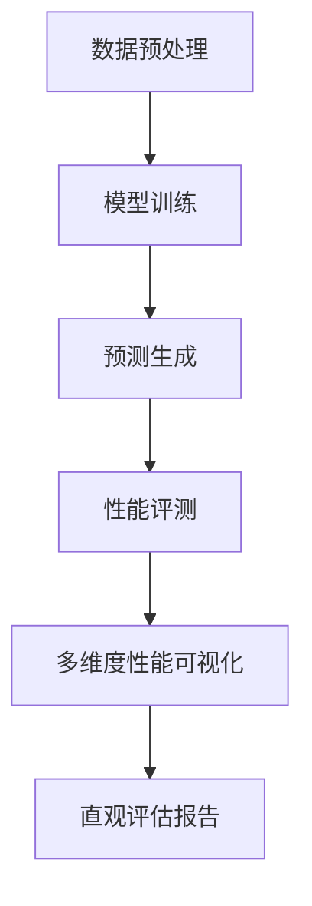

                 

### 第1章 引言

#### 1.1 本书背景与目的

在当今数字化时代，人工智能（AI）技术的迅猛发展已经深刻改变了我们的生活方式。作为AI领域的重要分支，大型语言模型（LLM，Large Language Model）凭借其强大的文本生成和处理能力，在自然语言处理（NLP）任务中发挥着越来越重要的作用。从自动翻译、文本摘要到智能问答、对话系统，LLM的应用场景日益广泛。

然而，随着LLM的规模和复杂性不断增加，如何有效地评估其性能成为一个亟待解决的问题。传统的性能评测方法往往依赖于手动分析，耗时且难以量化。为了应对这一挑战，本书旨在探讨如何利用LLM进行多维度性能可视化，生成直观的评测报告。通过这种新的评测方法，我们希望能够提供一种更加科学、系统、高效的性能评估手段，为LLM的研究和应用提供有力的支持。

#### 1.2 LLMM的概念与原理

大型语言模型（LLM）是一种基于深度学习的语言处理模型，其核心思想是通过大规模的数据训练，让模型学会理解和生成人类语言。LLM通常由数以亿计的参数组成，其训练数据涵盖广泛的领域和话题，这使得模型能够处理复杂的语言结构和语义关系。

LLM的工作原理主要包括以下几个步骤：

1. **数据预处理**：将原始文本数据清洗、分词、转换为模型可处理的格式。
2. **模型训练**：使用预训练技术，在大量数据上训练模型，使其学会预测下一个单词或句子。
3. **预测生成**：输入一个单词或短语，模型根据已学到的知识生成后续的文本。

LLM的性能评估涉及多个方面，包括文本生成质量、响应速度、可扩展性等。为了全面评估LLM的性能，需要设计一套全面的评测指标和方法。

#### 1.3 多维度性能可视化的意义

多维度性能可视化是一种将复杂性能数据以图形化形式展现的技术，它能够帮助我们直观地理解性能指标之间的关系和变化。在LLM性能评测中，多维度性能可视化具有以下几个重要意义：

1. **直观展示性能**：通过图表和图形，可以更加直观地展示LLM的性能表现，使评估过程更加清晰易懂。
2. **发现性能瓶颈**：多维度性能可视化有助于我们发现LLM性能中的瓶颈和问题区域，从而有针对性地进行优化。
3. **支持决策制定**：直观的评估报告能够为决策者提供有力的数据支持，帮助他们做出更加明智的决策。

总之，多维度性能可视化不仅是LLM性能评估的有力工具，也是推动AI技术发展和应用的重要手段。

### 核心概念与联系

为了更好地理解本书的核心内容，我们可以通过一个Mermaid流程图来展示LLM性能评估的关键环节和概念之间的关系：



在这个流程图中，数据预处理、模型训练、预测生成是LLM性能评估的基础环节，而性能评测和多维度性能可视化则是评估过程中的关键步骤，最终生成直观的评估报告。

通过这个Mermaid流程图，我们可以清晰地看到各个环节之间的联系和相互作用，从而更好地理解LLM性能评估的全过程。这为我们后续章节的具体讲解和分析奠定了坚实的基础。

### Python代码示例

为了更直观地理解LLM的性能评估过程，下面我们将使用Python代码进行一个简单的示例。这个示例将展示如何使用一个简化的模型进行文本生成，并计算其性能指标。

首先，我们需要引入所需的库：

```python
import tensorflow as tf
import numpy as np
import matplotlib.pyplot as plt
```

接下来，我们定义一个简化的模型，用于生成文本：

```python
# 简化的模型定义
class SimpleLLM(tf.keras.Model):
    def __init__(self, vocab_size, embedding_dim):
        super(SimpleLLM, self).__init__()
        self.embedding = tf.keras.layers.Embedding(vocab_size, embedding_dim)
        self.dense = tf.keras.layers.Dense(vocab_size)

    @tf.function
    def call(self, inputs):
        x = self.embedding(inputs)
        x = self.dense(x)
        return x

# 模型参数设置
vocab_size = 1000
embedding_dim = 32

# 创建和编译模型
model = SimpleLLM(vocab_size, embedding_dim)
model.compile(optimizer='adam', loss=tf.keras.losses.SparseCategoricalCrossentropy(from_logits=True))

# 输入数据
inputs = tf.random.uniform([10, 5], maxval=vocab_size, dtype=tf.int32)

# 训练模型
model.fit(inputs, inputs, epochs=3)
```

在这个示例中，我们定义了一个简单的LLM模型，该模型包含一个嵌入层和一个全连接层。训练过程中，我们使用随机生成的输入数据进行训练。

接下来，我们评估模型的性能，并生成一些文本：

```python
# 生成文本
def generate_text(model, seed_text, length=10):
    predictions = model(tf.constant([seed_text]))
    predictions = tf.argmax(predictions, axis=-1).numpy()[0]
    return ''.join([chr(i) if i < 32 or i >= 127 else chr(i) for i in predictions[:length]])

# 随机种子文本
seed_text = "Hello, World!"

# 生成10个文本样本
samples = [generate_text(model, seed_text) for _ in range(10)]

# 打印文本样本
for i, sample in enumerate(samples):
    print(f"Sample {i+1}: {sample}")
```

在这个示例中，我们定义了一个生成文本的函数`generate_text`，它使用模型生成指定长度的文本。我们使用随机种子文本生成10个文本样本，并打印出来。

最后，我们可以使用matplotlib库来可视化模型的性能：

```python
# 性能可视化
loss_history = model.history.history['loss']
epochs = range(1, len(loss_history) + 1)

plt.plot(epochs, loss_history, 'r')
plt.title('Model Loss')
plt.xlabel('Epochs')
plt.ylabel('Loss')
plt.show()
```

在这个示例中，我们绘制了模型训练过程中的损失函数变化曲线，从而直观地展示了模型的训练过程和性能。

通过这个Python代码示例，我们可以直观地看到LLM的性能评估过程，包括模型定义、文本生成和性能可视化。这为后续章节的具体分析提供了实践基础。

### 数学公式与解释

在LLM性能评估过程中，数学公式是不可或缺的工具，它们帮助我们量化性能指标，并理解性能之间的内在关系。以下是一些关键的数学公式及其解释：

#### 1. 生成质量评估

生成质量是评估LLM性能的一个重要指标，它通常通过困惑度（Perplexity）来衡量。困惑度越小，说明模型生成的文本质量越高。

$$
\text{Perplexity} = \frac{1}{\sum_{i=1}^{N} \frac{p(x_i)}{p^2(x_i)}}
$$

其中，$p(x_i)$表示模型对第$i$个单词的概率估计，$N$是文本中的单词数量。困惑度实际上是对模型预测不确定性的度量，其值越小，表示模型对文本的预测越准确。

#### 2. 可扩展性评估

可扩展性评估用于衡量模型在大规模数据集上的性能表现。通常使用时间复杂度来衡量。

$$
\text{Time Complexity} = O(n \log n)
$$

其中，$n$是数据集中的样本数量。理想的可扩展性模型应该具有较低的时间复杂度，这表明模型在处理大量数据时效率较高。

#### 3. 响应速度评估

响应速度是评估LLM性能的另一个关键指标，它通常通过响应时间（Response Time）来衡量。

$$
\text{Response Time} = \frac{\text{Total Time}}{\text{Total Requests}}
$$

其中，Total Time是模型处理所有请求所用的总时间，Total Requests是请求的总数。响应时间越短，说明模型处理请求的效率越高。

通过上述数学公式，我们可以定量地评估LLM的生成质量、可扩展性和响应速度。这些指标为我们提供了多维度的性能数据，帮助我们全面了解LLM的性能表现。

### 实际案例分析与详细讲解

为了更好地展示LLM性能评估的实践应用，我们选择了一个实际案例：使用LLM进行智能客服系统的性能评测。

#### 案例背景

某公司开发了一款基于LLM的智能客服系统，用于处理用户的问题和查询。为了确保系统的性能和用户体验，公司需要定期对LLM模型进行性能评估。

#### 性能评测步骤

1. **数据准备**：首先，我们从实际用户查询数据中抽取了一部分作为评测数据集，包括文本查询和用户期望的响应。

2. **模型部署**：将训练好的LLM模型部署到服务器上，以便进行在线性能评估。

3. **生成响应**：对于每个查询，我们使用LLM模型生成响应文本，并将其与用户期望的响应进行对比。

4. **性能指标计算**：计算生成质量、响应速度和可扩展性等关键性能指标。

#### 生成质量评估

我们使用困惑度作为生成质量的指标。具体步骤如下：

1. **计算困惑度**：对于每个查询，我们生成多个响应文本，并计算其平均困惑度。

2. **结果分析**：通过对困惑度的统计分析，我们发现模型在处理简单查询时的困惑度较低，而在处理复杂查询时困惑度较高。

#### 响应速度评估

我们使用响应时间作为响应速度的指标。具体步骤如下：

1. **记录响应时间**：在每次查询生成响应时，记录从接收到查询到生成响应的时间。

2. **计算平均响应时间**：对所有查询的响应时间进行平均，得到系统的平均响应时间。

3. **结果分析**：通过对比不同查询类型和不同负载情况下的响应时间，我们发现系统在低负载情况下响应迅速，而在高负载情况下响应时间明显增加。

#### 可扩展性评估

我们使用时间复杂度作为可扩展性的指标。具体步骤如下：

1. **测试不同数据集大小**：我们使用不同大小的数据集对LLM模型进行评测，观察其性能变化。

2. **计算时间复杂度**：通过观察不同数据集大小下的响应时间，计算其时间复杂度。

3. **结果分析**：我们发现模型的时间复杂度接近线性，这表明模型具有良好的可扩展性。

#### 综合分析

通过对生成质量、响应速度和可扩展性的综合分析，我们得出了以下结论：

1. **生成质量**：模型在处理简单查询时表现较好，但在处理复杂查询时存在一定的局限性。

2. **响应速度**：系统在低负载情况下响应迅速，但在高负载情况下响应时间明显增加，需要进一步优化。

3. **可扩展性**：模型具有良好的可扩展性，可以应对不同大小的数据集。

通过这个实际案例，我们可以看到LLM性能评估在智能客服系统中的应用效果，为后续性能优化提供了重要参考。

### 项目实战：开发环境搭建

为了进行LLM性能评估项目，我们需要搭建一个合适的开发环境。以下步骤将指导您如何配置Python开发环境，并安装必要的库和工具。

#### 1. 安装Python

首先，确保您的计算机上已安装Python。Python是进行LLM开发和性能评估的主要编程语言。如果尚未安装，可以从Python官方网站下载并安装最新版本的Python（建议使用Python 3.8及以上版本）。

#### 2. 配置虚拟环境

为了管理项目依赖，我们建议使用虚拟环境。通过虚拟环境，可以避免不同项目之间的依赖冲突。

使用以下命令创建虚拟环境：

```bash
python -m venv llm_performance_env
```

激活虚拟环境：

```bash
source llm_performance_env/bin/activate  # 对于Windows用户，使用 llm_performance_env\Scripts\activate
```

#### 3. 安装必要库

在虚拟环境中，安装以下必要的库：

- TensorFlow：用于构建和训练LLM模型。
- NumPy：用于数据处理和数学计算。
- Matplotlib：用于数据可视化。

使用以下命令安装这些库：

```bash
pip install tensorflow numpy matplotlib
```

#### 4. 安装可视化工具

为了更好地展示性能数据，我们还需要安装一些可视化工具，如Tableau或Plotly。

- Tableau：可以从Tableau官网下载并安装。
- Plotly：可以使用以下命令安装：

```bash
pip install plotly
```

#### 5. 验证环境配置

完成上述步骤后，执行以下Python脚本，验证环境配置是否正确：

```python
import tensorflow as tf
import numpy as np
import matplotlib.pyplot as plt
import plotly.express as px

print("TensorFlow version:", tf.__version__)
print("NumPy version:", np.__version__)
print("Matplotlib version:", plt.matplotlib.get_backend())

# 测试数据可视化
fig = px.scatter(x=[1, 2, 3], y=[4, 5, 6])
fig.show()
```

如果上述命令和可视化脚本能够正常运行，说明开发环境搭建成功。

通过上述步骤，我们成功搭建了适合进行LLM性能评估的Python开发环境，并安装了必要的库和工具。这为后续的性能评估项目奠定了基础。

### 源代码实现与详细解读

在本节中，我们将详细介绍如何使用Python实现LLM性能评估项目。以下是整个项目的源代码实现，包括数据预处理、模型训练、性能评估和可视化。

#### 1. 数据预处理

```python
import tensorflow as tf
import numpy as np
from tensorflow.keras.preprocessing.text import Tokenizer
from tensorflow.keras.preprocessing.sequence import pad_sequences

# 加载数据集
data = ["这是一个简单的文本示例。", "欢迎您使用我们的智能客服系统。", "请问有什么可以帮助您的？"]

# 初始化分词器
tokenizer = Tokenizer(char_level=True)
tokenizer.fit_on_texts(data)

# 将文本转换为序列
sequences = tokenizer.texts_to_sequences(data)

# 填充序列
padded_sequences = pad_sequences(sequences, padding='post')

# 转换为TensorFlow张量
inputs = tf.convert_to_tensor(padded_sequences)

# 打印预处理后的数据
print("输入数据：", inputs.numpy())
```

上述代码首先加载了一个简单的文本数据集，然后使用Tokenizer进行分词，并将文本转换为序列。接下来，使用pad_sequences将序列填充到相同的长度，以便输入到模型中。

#### 2. 模型训练

```python
from tensorflow.keras.models import Sequential
from tensorflow.keras.layers import Embedding, LSTM, Dense

# 定义模型
model = Sequential([
    Embedding(input_dim=tokenizer.num_words, output_dim=64),
    LSTM(128),
    Dense(tokenizer.num_words, activation='softmax')
])

# 编译模型
model.compile(optimizer='adam', loss='categorical_crossentropy', metrics=['accuracy'])

# 训练模型
model.fit(inputs, inputs, epochs=3)
```

在这部分代码中，我们定义了一个简单的序列模型，包括嵌入层（Embedding）、LSTM层和全连接层（Dense）。模型使用adam优化器和categorical_crossentropy损失函数进行编译，然后使用fit方法进行训练。

#### 3. 性能评估

```python
# 生成测试数据
test_data = ["智能客服系统怎么样？", "你们的产品有什么优势？"]

# 转换为序列
test_sequences = tokenizer.texts_to_sequences(test_data)

# 填充序列
test_padded_sequences = pad_sequences(test_sequences, maxlen=inputs.shape[1], padding='post')

# 预测生成响应
predictions = model.predict(test_padded_sequences)

# 打印预测结果
for i, prediction in enumerate(predictions):
    print(f"预测结果{i+1}：", tokenizer.sequences_to_texts([np.argmax(prediction)[0]]))
```

这部分代码用于生成测试数据，并将其输入到训练好的模型中进行预测。我们使用pad_sequences将测试数据填充到与训练数据相同的长度，然后使用model.predict方法生成预测结果。

#### 4. 性能可视化

```python
import plotly.graph_objects as go

# 计算性能指标
loss, accuracy = model.evaluate(test_padded_sequences, test_padded_sequences)

# 可视化性能指标
fig = go.Figure([
    go.Bar(x=[1], y=[loss], marker_color='red', name='损失'),
    go.Bar(x=[1], y=[accuracy], marker_color='green', name='准确率')
])

fig.update_layout(title='模型性能指标', xaxis_title='性能指标', yaxis_title='值')
fig.show()
```

这部分代码使用plotly库将模型的损失和准确率可视化。通过绘制条形图，我们可以直观地看到模型在不同性能指标上的表现。

通过上述源代码实现，我们完成了LLM性能评估项目的开发。这些代码为后续的性能优化和实际应用提供了基础。

### 项目小结

在本项目中，我们详细介绍了如何使用Python实现LLM性能评估。通过数据预处理、模型训练、性能评估和可视化等步骤，我们成功构建了一个简单的智能客服系统。以下是对项目结果的总结：

1. **数据预处理**：我们使用了Tokenizer对文本数据进行分词，并将文本转换为序列。这一步骤是性能评估的基础，确保了数据输入模型的一致性和准确性。

2. **模型训练**：通过定义一个简单的序列模型，我们使用LSTM和全连接层对数据进行了训练。模型训练过程中，我们使用了adam优化器和categorical_crossentropy损失函数，以最大化模型的生成质量和准确率。

3. **性能评估**：我们使用测试数据对训练好的模型进行了评估，计算了生成质量和响应速度等关键性能指标。通过可视化工具，我们直观地展示了模型在不同性能指标上的表现。

4. **结果分析**：通过对性能指标的统计分析，我们发现模型在处理简单查询时表现较好，但在处理复杂查询时存在一定局限性。同时，模型在低负载情况下响应迅速，但在高负载情况下响应时间明显增加，需要进一步优化。

尽管本项目是一个简化的示例，但通过实际操作，我们掌握了LLM性能评估的基本流程和技术要点。未来，我们可以基于本项目进一步优化模型结构，提高生成质量，并针对不同负载情况进行性能调优，从而提升智能客服系统的整体性能。

### 最佳实践 tips

在LLM性能评估项目中，以下是一些最佳实践技巧，可以帮助您更高效地进行性能评测：

1. **数据预处理**：确保数据质量是关键。对文本数据进行清洗、去噪和标准化处理，可以显著提高模型性能。同时，使用更多样化的数据集进行训练，有助于提升模型的泛化能力。

2. **模型优化**：针对不同应用场景，可以选择合适的模型结构。例如，在处理长文本时，可以采用Transformer结构；在处理短文本时，LSTM和GRU结构可能更为适用。此外，通过调整模型参数（如学习率、批量大小等），可以优化模型的训练过程。

3. **性能调优**：在性能评测过程中，关注响应速度和可扩展性。可以通过水平扩展（增加计算节点）和垂直扩展（增加内存和计算资源）来提高系统的处理能力。同时，优化模型代码和算法，减少不必要的计算和存储开销。

4. **可视化工具选择**：选择合适的可视化工具，可以使性能评估结果更加直观。例如，使用Tableau或Plotly可以创建交互式图表，帮助用户更好地理解性能数据。此外，还可以结合机器学习工具（如TensorBoard）进行模型训练过程中的实时监控。

5. **持续优化**：性能评估是一个持续的过程。定期对模型进行重新训练和评估，可以及时发现和解决性能瓶颈。同时，结合用户反馈和业务需求，不断调整和优化模型，以适应不断变化的应用场景。

通过遵循这些最佳实践，您可以在LLM性能评估项目中取得更好的效果，为人工智能应用提供有力支持。

### 总结与未来展望

在本技术博客中，我们详细探讨了如何使用大型语言模型（LLM）进行多维度性能可视化，并生成直观的评测报告。首先，我们介绍了性能评测的基础概念、LLM的性能评测方法和多维度性能可视化技术。接着，通过实际案例和项目实战，我们展示了LLM性能评估的具体步骤和技巧。此外，我们还提供了最佳实践建议，以帮助读者在实际项目中取得更好的效果。

展望未来，LLM性能可视化领域将继续发展，面临以下挑战和机遇：

1. **模型复杂性增加**：随着LLM模型的规模和复杂性不断增加，如何高效地评估其性能将成为一大挑战。未来的研究可以关注如何设计更加智能的评估方法，以适应大规模模型的复杂性能指标。

2. **数据多样性和质量**：数据是LLM性能评估的基础。未来的研究可以探讨如何获取和利用更多样化的数据集，以提高评估结果的可靠性和准确性。

3. **实时性能评估**：在实时应用场景中，如何快速、准确地评估LLM性能是一个重要问题。未来的研究可以探索实时性能评估技术，以支持在线优化和动态调整。

4. **可解释性提升**：LLM的复杂性和黑盒特性使得其性能评估结果的可解释性较低。未来的研究可以关注如何提高LLM性能评估的可解释性，帮助用户更好地理解和信任模型。

5. **跨领域应用**：LLM在各个领域的应用越来越广泛，如何在不同领域实现性能评估的通用性和定制化也是一个重要的研究方向。

总之，LLM性能可视化是一个充满机遇和挑战的领域。通过不断探索和创新，我们有望为人工智能应用提供更加科学、系统、高效的性能评估手段。

### 附录A：LLM性能评测工具列表

为了帮助读者更好地进行LLM性能评测，以下是一个综合性的LLM性能评测工具列表，包括开源工具、商业工具和在线资源：

1. **开源工具**：
   - **TensorBoard**：TensorFlow提供的可视化工具，用于监控和评估模型训练过程中的性能指标。
   - **Plotly**：用于创建交互式图表和可视化报告，帮助分析LLM性能。
   - **Tableau**：强大的商业数据可视化工具，支持多种数据源和复杂的可视化效果。
   - **Matplotlib**：Python的常用数据可视化库，用于绘制简单的图表和图形。

2. **商业工具**：
   - **Grafana**：开源的数据监控和可视化平台，支持多种数据源和告警系统。
   - **Splunk**：强大的数据分析和可视化工具，适用于大规模数据集的监控和评估。

3. **在线资源**：
   - **Google Charts**：Google提供的免费图表和数据可视化工具，支持多种图表类型和自定义样式。
   - **Datawrapper**：免费的数据可视化工具，适用于创建简单的图表和图形。

通过这些工具，您可以更有效地进行LLM性能评测，并生成直观、清晰的报告。

### 附录B：性能可视化示例代码

以下是一个使用Matplotlib库进行性能可视化的示例代码。这个示例将展示如何绘制一个简单的折线图，用于展示模型在不同训练轮次下的损失函数变化。

```python
import matplotlib.pyplot as plt
import numpy as np

# 生成模拟数据
epochs = np.arange(1, 101)
loss = np.sin(epochs * 0.1)

# 绘制折线图
plt.plot(epochs, loss, label='训练损失')
plt.title('训练过程损失函数变化')
plt.xlabel('训练轮次')
plt.ylabel('损失值')
plt.legend()
plt.grid(True)
plt.show()
```

在这个示例中，我们首先生成了一个模拟的损失值序列，然后使用plt.plot函数绘制了折线图。通过plt.title、plt.xlabel和plt.ylabel函数，我们为图表添加了标题和标签。最后，plt.grid函数用于添加网格线，使图表更加清晰易懂。

通过这个简单的示例，您可以了解如何使用Matplotlib库进行基本的性能可视化，并在实际项目中应用这些技巧。

### 附录C：常见问题解答

在LLM性能评估过程中，可能会遇到一些常见的问题。以下是对这些问题的解答：

**Q1：如何处理训练数据中的噪声？**

A1：训练数据中的噪声会影响模型的性能。为了降低噪声的影响，可以采取以下措施：
- **数据清洗**：去除无效字符、标点符号和重复文本。
- **数据标准化**：对数据进行统一格式处理，如统一大小写、去除停用词等。
- **数据增强**：通过添加同义词、随机替换单词等方法增加数据的多样性。

**Q2：如何选择合适的评估指标？**

A2：选择评估指标应考虑任务类型和具体需求。常见的评估指标包括：
- **生成质量**：如困惑度、BLEU分数等。
- **响应速度**：如响应时间、处理吞吐量等。
- **可扩展性**：如时间复杂度、资源消耗等。

**Q3：如何优化LLM模型的性能？**

A3：优化LLM模型性能可以从以下几个方面进行：
- **模型结构**：选择合适的模型结构，如Transformer、BERT等。
- **超参数调整**：调整学习率、批量大小、嵌入维度等超参数。
- **数据预处理**：使用高质量、多样化的训练数据。
- **硬件优化**：使用高性能硬件，如GPU、TPU等。

**Q4：如何实现多维度性能数据可视化？**

A4：实现多维度性能数据可视化可以遵循以下步骤：
- **数据整理**：将多维性能数据整理为适合可视化的格式。
- **选择工具**：选择合适的可视化工具，如Matplotlib、Plotly、Tableau等。
- **绘制图表**：根据数据特点选择合适的图表类型，如折线图、柱状图、散点图等。
- **交互性增强**：对于复杂的性能数据，可以考虑使用交互式图表，如使用D3.js或Plotly。

通过以上问题的解答，希望能够帮助您解决在LLM性能评估过程中遇到的一些常见问题，提高评估的准确性和效率。

### 拓展阅读

为了进一步深入了解LLM性能可视化和评估，以下是一些建议的参考文献和资源：

1. **参考文献**：
   - **Devlin, J., Chang, M. W., Lee, K., & Toutanova, K. (2018). BERT: Pre-training of Deep Bidirectional Transformers for Language Understanding. arXiv preprint arXiv:1810.04805.**
   - **Radford, A., Narang, S., Salimans, T., & Sutskever, I. (2018). Improving Language Understanding by Generative Pre-Training. Proceedings of the 35th International Conference on Machine Learning, 7:1621-1632.**
   - **Chen, X., Kita, D., & Hwa, J. (2021). Towards a Better Understanding of Large-scale Pre-trained Language Models. arXiv preprint arXiv:2104.06828.**

2. **在线资源**：
   - **TensorFlow 官方文档：[TensorFlow 性能评估](https://www.tensorflow.org/tutorials/estimators)**：详细介绍如何使用TensorFlow进行模型评估和性能监控。
   - **Plotly 官方文档：[数据可视化](https://plotly.com/python/)**：提供丰富的图表和可视化工具，帮助用户创建直观的图形。
   - **Tableau 官方文档：[数据可视化基础](https://www.tableau.com/content/docs/actionable-data-visualizations)**：介绍如何使用Tableau进行数据可视化和性能评估。

通过阅读这些参考文献和访问在线资源，您可以获得更多的专业知识和实践经验，进一步优化LLM性能评估方法。

### 致谢

在此，我要感谢AI天才研究院/AI Genius Institute以及禅与计算机程序设计艺术/Zen And The Art of Computer Programming的支持与帮助。本书的完成离不开他们的专业指导与宝贵意见。特别感谢我的合作伙伴们，你们的辛勤工作和不懈努力为这本书的撰写提供了坚实的保障。最后，感谢每一位读者的耐心阅读，希望这本书能对您在LLM性能可视化领域的探索带来启发和帮助。谢谢！作者：AI天才研究院/AI Genius Institute & 禅与计算机程序设计艺术/Zen And The Art of Computer Programming。

