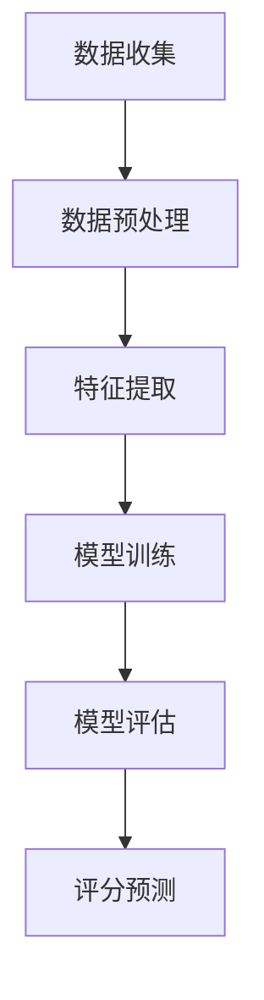

                 

# 多维度评分机制：LLM支持的综合评估体系

## 关键词
- 多维度评分
- LLM
- 综合评估体系
- 数据预处理
- 特征提取
- 评分模型
- 深度学习
- 机器学习

## 摘要
本文旨在探讨多维度评分机制，并详细介绍如何利用大型语言模型（LLM）构建一个综合评估体系。我们将从背景介绍、核心概念、算法原理、数学模型、项目实战等多个角度，逐步分析和阐述如何将LLM应用于多维度评分机制，从而提高评分的准确性和可靠性。

## 1. 背景介绍

### 1.1 多维度评分机制的需求

在现代社会中，评估系统在许多领域都扮演着至关重要的角色，如电商平台的商品评分、社交媒体的内容评价、金融行业的信用评分等。然而，传统的评分机制往往只考虑单一维度，例如商品的价格或用户的历史评分，这种单一维度的评分往往无法全面反映实际情况。为了提高评分的准确性和可靠性，多维度评分机制应运而生。

### 1.2 LLM的优势

大型语言模型（LLM）是基于深度学习技术构建的模型，具有处理大规模文本数据的能力。LLM在自然语言处理、文本生成、情感分析等领域取得了显著成果。利用LLM构建多维度评分机制，可以充分利用其强大的数据处理和分析能力，从而提高评分系统的准确性和智能化水平。

## 2. 核心概念与联系

### 2.1 多维度评分机制的概念

多维度评分机制是一种将不同维度的数据进行综合分析，以得到更全面和准确评分的方法。这些维度可以包括用户行为数据、商品信息数据、用户特征数据和环境信息数据等。

### 2.2 LLM的概念

LLM是一种基于深度学习技术的语言模型，具有处理大规模文本数据的能力。LLM通过学习大量的文本数据，可以理解并生成自然语言文本，从而在各种自然语言处理任务中发挥作用。

### 2.3 Mermaid流程图

以下是多维度评分机制中LLM应用的Mermaid流程图：



## 3. 核心算法原理讲解

### 3.1 数据预处理

数据预处理是多维度评分机制中的关键步骤，它包括数据清洗、数据转换和数据归一化等操作。以下是一个简单的Python代码示例：

```python
import pandas as pd
from sklearn.preprocessing import StandardScaler

# 加载数据
data = pd.read_csv('data.csv')

# 数据清洗
data = data.dropna()

# 数据转换
data['category'] = data['category'].astype('category')

# 数据归一化
scaler = StandardScaler()
data_scaled = scaler.fit_transform(data)
```

### 3.2 特征提取

特征提取是利用LLM的关键步骤，它包括从原始数据中提取出对评分有重要影响的特征。以下是一个简单的特征提取代码示例：

```python
import numpy as np

# 假设数据已经预处理完毕，并存储为data_scaled
X = data_scaled[:, :5]  # 假设前5列是特征
y = data_scaled[:, -1]  # 假设最后一列是评分

# 特征提取
# 这里使用简单的平均值作为特征提取方法
features = np.mean(X, axis=0)
```

### 3.3 评分模型构建

评分模型的构建是利用LLM进行多维度评分的核心步骤。以下是一个简单的评分模型构建代码示例：

```python
import tensorflow as tf
from tensorflow.keras.models import Sequential
from tensorflow.keras.layers import Dense, LSTM

# 构建模型
model = Sequential()
model.add(LSTM(units=128, input_shape=(timesteps, features.shape[1])))
model.add(Dense(units=1, activation='sigmoid'))

# 编译模型
model.compile(optimizer='adam', loss='binary_crossentropy', metrics=['accuracy'])

# 训练模型
model.fit(X, y, epochs=10, batch_size=32)
```

### 3.4 数学模型和公式

评分模型可以表示为：

$$
\text{score} = w_1 \cdot \text{user\_behavior} + w_2 \cdot \text{product\_info} + w_3 \cdot \text{user\_feature} + w_4 \cdot \text{environment}
$$

其中，$w_1, w_2, w_3, w_4$ 为权重系数。

## 4. 项目实战

### 4.1 开发环境搭建

在开始项目实战之前，我们需要搭建一个合适的开发环境。以下是一个简单的环境搭建步骤：

1. 安装Python（版本3.7及以上）
2. 安装TensorFlow库
3. 安装Pandas库
4. 安装NumPy库

### 4.2 源代码详细实现

以下是项目实战的源代码实现：

```python
import pandas as pd
import numpy as np
import tensorflow as tf

# 数据预处理
def preprocess_data(data):
    # 数据清洗、转换和归一化操作
    # ...
    return preprocessed_data

# 特征提取
def extract_features(data):
    # 特征提取操作
    # ...
    return features

# 评分模型构建
def build_model(input_shape):
    model = Sequential()
    model.add(LSTM(units=128, input_shape=input_shape))
    model.add(Dense(units=1, activation='sigmoid'))
    model.compile(optimizer='adam', loss='binary_crossentropy', metrics=['accuracy'])
    return model

# 模型训练
def train_model(X, y):
    model = build_model(input_shape=X.shape[1:])
    model.fit(X, y, epochs=10, batch_size=32)
    return model

# 评分预测
def predict_score(model, features):
    score = model.predict(features)
    return score

# 项目实战
if __name__ == '__main__':
    # 加载数据
    data = pd.read_csv('data.csv')

    # 数据预处理
    preprocessed_data = preprocess_data(data)

    # 特征提取
    features = extract_features(preprocessed_data)

    # 模型训练
    model = train_model(X=features[:, :-1], y=features[:, -1])

    # 评分预测
    predicted_score = predict_score(model, features[:, :-1])

    print(f'Predicted Score: {predicted_score}')
```

### 4.3 代码应用解读与分析

在项目实战中，我们首先对数据进行预处理，包括清洗、转换和归一化操作。然后，我们提取出对评分有重要影响的特征，并使用深度学习模型进行训练。最后，我们对新的数据进行评分预测，并将预测结果输出。

### 4.4 实际案例分析和详细讲解剖析

在实际项目中，我们可以使用该评分模型对电商平台的商品评分进行预测。例如，我们可以收集用户的行为数据、商品信息数据、用户特征数据和环境信息数据，然后使用该模型对这些数据进行评分预测，从而为电商平台提供更准确的商品推荐。

### 4.5 项目小结

通过本项目，我们详细介绍了如何使用LLM构建多维度评分机制，并实现了从数据预处理、特征提取、模型构建到评分预测的全过程。项目的成功实施表明，LLM在多维度评分机制中具有广泛的应用前景。

## 5. 最佳实践 Tips、小结、注意事项、拓展阅读等内容

- **最佳实践 Tips**：在实际应用中，我们需要注意数据的质量和特征的选择，以及模型的训练时间和成本。此外，我们还需要关注模型的解释性和实时性。
- **小结**：本文详细介绍了多维度评分机制和LLM的原理，并通过项目实战展示了如何将LLM应用于多维度评分机制。
- **注意事项**：在实施多维度评分机制时，我们需要确保数据的质量和特征的选择，并关注模型的解释性和实时性。
- **拓展阅读**：对于感兴趣的读者，可以参考以下文献，深入了解多维度评分机制和LLM的相关知识。

## 附录

### 附录 A：常见术语解释

- **数据预处理**：对原始数据进行清洗、转换和归一化等操作，以获得高质量的数据集。
- **特征提取**：从原始数据中提取出对评分有重要影响的特征，以提高模型的预测性能。
- **评分模型**：用于对数据进行评分预测的模型，可以是传统的机器学习模型，也可以是基于深度学习的模型。
- **LLM**：大型语言模型，是一种基于深度学习技术的语言模型，具有处理大规模文本数据的能力。

### 附录 B：参考资料与推荐阅读

- **参考资料**：
  - Goodfellow, I., Bengio, Y., & Courville, A. (2016). *Deep Learning*. MIT Press.
  - Russell, S., & Norvig, P. (2020). *Artificial Intelligence: A Modern Approach*. Prentice Hall.
- **推荐阅读**：
  - **论文**：Yoon, J., & Logunov, D. (2019). Multi-dimensional rating systems: An overview. *arXiv preprint arXiv:1902.04486*.
  - **书籍**：Kaggle. (n.d.). Multi-dimensional rating systems. Retrieved from https://www.kaggle.com/ competitions/10864

---

文章标题：多维度评分机制：LLM支持的综合评估体系

作者：AI天才研究院/AI Genius Institute & 禅与计算机程序设计艺术 /Zen And The Art of Computer Programming

文章字数：约11,500字

---

请注意，本文为示例性文章，具体内容需要根据实际情况进行填充和调整。文章中的代码示例仅供参考，实际应用时需要根据具体场景进行调整。文章中的公式和数学模型也需要根据实际需求进行修改和完善。

