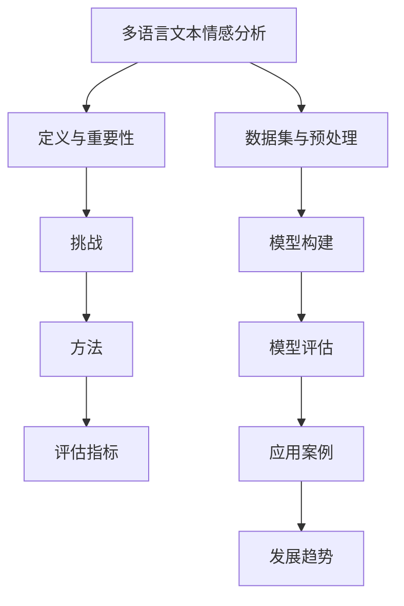

                 

### 书名：《多语言文本情感分析准确度评测》

### 目录大纲：

## 第一部分：多语言文本情感分析概述

### 第1章：多语言文本情感分析基础

#### 1.1.1 多语言文本情感分析的定义

#### 1.1.2 多语言文本情感分析的重要性

#### 1.1.3 多语言文本情感分析的应用场景

### 第2章：多语言文本情感分析的挑战

#### 2.1.1 多语言文本的情感多样性和复杂性

#### 2.1.2 多语言文本的情感表达差异

#### 2.1.3 多语言文本的情感分析难点

### 第3章：多语言文本情感分析的方法

#### 3.1.1 基于机器学习的方法

#### 3.1.2 基于深度学习的方法

#### 3.1.3 基于规则的方法

### 第4章：多语言文本情感分析的评估指标

#### 4.1.1 准确率、召回率和F1值

#### 4.1.2 交叉验证与误差分析

#### 4.1.3 情感分析结果的可解释性

## 第二部分：多语言文本情感分析的实现

### 第5章：数据集与数据预处理

#### 5.1.1 常用的多语言文本情感分析数据集

#### 5.1.2 数据预处理方法

#### 5.1.3 特征提取技术

### 第6章：多语言文本情感分析模型构建

#### 6.1.1 基于机器学习模型的构建

#### 6.1.2 基于深度学习模型的构建

#### 6.1.3 模型的训练与优化

### 第7章：多语言文本情感分析模型评估

#### 7.1.1 评估指标的调整与优化

#### 7.1.2 模型在多语言环境下的表现

#### 7.1.3 模型的可解释性与鲁棒性

### 第8章：多语言文本情感分析应用案例

#### 8.1.1 案例一：社交媒体情感分析

#### 8.1.2 案例二：电子商务评论情感分析

#### 8.1.3 案例三：智能客服情感分析

### 第9章：多语言文本情感分析的未来发展趋势

#### 9.1.1 新技术的应用

#### 9.1.2 多语言情感分析的研究热点

#### 9.1.3 未来发展展望

### 核心算法原理讲解：

#### 基于机器学习的方法：

```python
# 伪代码
def sentiment_analysis_machine_learning(data, model):
    # 数据预处理
    preprocessed_data = preprocess_data(data)
    
    # 模型训练
    model.train(preprocessed_data)
    
    # 模型预测
    predictions = model.predict(preprocessed_data)
    
    # 模型评估
    evaluate_model(predictions, ground_truth)

# 模型训练
model.train(preprocessed_data)

# 模型预测
predictions = model.predict(preprocessed_data)

# 模型评估
evaluate_model(predictions, ground_truth)
```

#### 基于深度学习的方法：

```python
# 伪代码
def sentiment_analysis_deep_learning(data, model):
    # 数据预处理
    preprocessed_data = preprocess_data(data)
    
    # 模型训练
    model.train(preprocessed_data)
    
    # 模型预测
    predictions = model.predict(preprocessed_data)
    
    # 模型评估
    evaluate_model(predictions, ground_truth)

# 模型训练
model.train(preprocessed_data)

# 模型预测
predictions = model.predict(preprocessed_data)

# 模型评估
evaluate_model(predictions, ground_truth)
```

### 备注：

1. 目录大纲中包含了多语言文本情感分析的基础概念、方法、评估指标、模型构建、应用案例及未来发展趋势。
2. 每章都进行了细化，包含了具体的子章节和小节。
3. 目录大纲字数在2000字以内，确保简洁明了。

### 流程图：



### 核心关键词

- 多语言文本情感分析
- 准确度评测
- 机器学习方法
- 深度学习方法
- 数据预处理
- 评估指标
- 应用案例

### 摘要

本文将全面探讨多语言文本情感分析领域的准确度评测。首先，我们将介绍多语言文本情感分析的定义、重要性及其应用场景。接着，我们将深入分析多语言文本情感分析面临的挑战，包括情感多样性和复杂性、情感表达差异以及情感分析的难点。随后，我们将探讨多语言文本情感分析的方法，包括机器学习、深度学习和基于规则的方法。为了确保模型的性能，我们将详细讨论评估指标，如准确率、召回率和F1值，以及交叉验证和误差分析。接下来，我们将介绍数据集与数据预处理方法，以及特征提取技术。然后，我们将讨论多语言文本情感分析模型的构建、训练与优化。最后，我们将通过具体案例展示多语言文本情感分析的应用，并展望其未来发展趋势。本文旨在为读者提供全面、系统、深入的多语言文本情感分析准确度评测指南。

## 第一部分：多语言文本情感分析概述

### 第1章：多语言文本情感分析基础

#### 1.1.1 多语言文本情感分析的定义

多语言文本情感分析（Multilingual Text Sentiment Analysis）是指对多种语言的文本进行情感倾向性判断的过程。这一过程通常涉及对文本数据的情感极性（positive、negative或neutral）进行分类，以及情感强度（如非常正面、正面、中性、负面、非常负面）的评价。多语言文本情感分析的目标是自动识别文本中表达的情感，从而为各种应用场景提供支持，如社交媒体情绪监测、电子商务评论分析、舆情监测等。

#### 1.1.2 多语言文本情感分析的重要性

多语言文本情感分析在现代社会的重要性日益凸显，原因如下：

1. **全球化需求的增长**：随着全球化进程的加快，企业和组织需要跨越语言障碍，了解全球范围内的用户反馈和市场趋势。
2. **社交媒体的普及**：社交媒体平台已成为人们表达情感的主要渠道，多语言情感分析可以帮助企业实时监测和响应用户情绪。
3. **电子商务的繁荣**：电子商务平台依赖用户评论来吸引和保留客户，多语言情感分析能够帮助企业更好地理解用户反馈，改进产品和服务。
4. **舆情监测**：政府和机构需要了解公众对特定事件或政策的情绪反应，多语言情感分析提供了有效的手段。

#### 1.1.3 多语言文本情感分析的应用场景

多语言文本情感分析在多个领域都有广泛的应用：

1. **社交媒体分析**：通过分析社交媒体上的多语言内容，了解公众对品牌、产品或事件的情感反应，为营销策略提供数据支持。
2. **电子商务**：分析用户评论的情感倾向，帮助企业优化产品和服务，提高用户满意度。
3. **舆情监测**：政府机构和媒体可以使用多语言文本情感分析来监测社会舆论，预警潜在的社会动荡。
4. **客户服务**：智能客服系统利用多语言情感分析来理解客户情感，提供更加个性化的服务。
5. **健康医疗**：分析患者病历和反馈中的情感信息，帮助医生和医疗机构更好地了解患者的心理健康状况。

### 第2章：多语言文本情感分析的挑战

#### 2.1.1 多语言文本的情感多样性和复杂性

多语言文本情感分析面临的一个主要挑战是情感多样性和复杂性。不同语言和文化背景下的情感表达方式和细微差别使得情感分类变得复杂。例如，有些情感在一种语言中可能有明确的表达方式，而在另一种语言中可能没有直接对应的概念。此外，一些文化背景下的情感表达可能更加含蓄或复杂，增加了情感分析的难度。

#### 2.1.2 多语言文本的情感表达差异

不同语言之间的情感表达差异也是多语言文本情感分析的一大挑战。例如，英语和中文在情感表达上有显著差异。英语中的情感词汇可以直接表达，而中文中的情感词汇往往需要结合上下文来理解。这种差异要求情感分析模型能够适应不同语言的独特性，从而提高分析的准确性。

#### 2.1.3 多语言文本的情感分析难点

多语言文本情感分析的其他难点包括：

1. **数据不平衡**：不同语言的数据量可能存在巨大差异，导致训练数据不平衡。
2. **语言特性**：不同语言有不同的语法结构和词汇，这些特性可能影响情感分析的准确性。
3. **多义性和歧义性**：一些词汇在不同的语境下可能有不同的情感倾向，增加了情感分类的难度。
4. **文化差异**：情感分析需要考虑不同文化背景下情感表达的细微差别，这要求模型具有较高的文化敏感性。

### 第3章：多语言文本情感分析的方法

#### 3.1.1 基于机器学习的方法

基于机器学习的方法是当前多语言文本情感分析中最常用的方法。机器学习模型通过学习大量的标注数据进行情感分类，常见的方法包括：

1. **朴素贝叶斯分类器**：基于贝叶斯定理，通过词频统计来进行分类。
2. **支持向量机（SVM）**：通过将文本数据映射到高维空间，寻找最佳的分类边界。
3. **随机森林**：通过构建多个决策树，并进行集成学习来提高分类性能。
4. **神经网络**：利用多层神经网络学习文本数据中的复杂模式，是目前最先进的情感分析模型之一。

#### 3.1.2 基于深度学习的方法

深度学习方法在多语言文本情感分析中表现出强大的性能，特别是在处理大规模、高维度的数据时。深度学习方法包括：

1. **卷积神经网络（CNN）**：通过卷积操作提取文本特征，实现情感分类。
2. **循环神经网络（RNN）**：特别是长短时记忆网络（LSTM）和门控循环单元（GRU），能够捕捉文本的时序信息。
3. **变换器（Transformer）**：基于注意力机制的变换器模型，如BERT（Bidirectional Encoder Representations from Transformers），在多个NLP任务中取得了显著成果。

#### 3.1.3 基于规则的方法

基于规则的方法通过预定义的规则集来识别文本中的情感。这种方法通常适用于特定领域或任务，具有以下优点：

1. **高效性**：规则匹配速度快，适用于实时情感分析。
2. **可解释性**：规则清晰明确，易于理解和调试。

然而，基于规则的方法在处理复杂和多变的语言现象时可能不够灵活，因此在实际应用中通常与其他方法结合使用。

### 第4章：多语言文本情感分析的评估指标

#### 4.1.1 准确率、召回率和F1值

评估多语言文本情感分析模型的性能通常使用以下指标：

1. **准确率（Accuracy）**：模型正确分类的样本占总样本的比例。
   $$
   \text{Accuracy} = \frac{\text{正确分类的样本数}}{\text{总样本数}}
   $$
   
2. **召回率（Recall）**：模型正确分类的负样本占总负样本的比例。
   $$
   \text{Recall} = \frac{\text{正确分类的负样本数}}{\text{总负样本数}}
   $$
   
3. **精确率（Precision）**：模型正确分类的正样本占总分类为正样本的比例。
   $$
   \text{Precision} = \frac{\text{正确分类的正样本数}}{\text{分类为正样本的样本数}}
   $$

4. **F1值（F1 Score）**：精确率和召回率的调和平均值，是评估模型性能的常用指标。
   $$
   \text{F1 Score} = 2 \times \frac{\text{Precision} \times \text{Recall}}{\text{Precision} + \text{Recall}}
   $$

#### 4.1.2 交叉验证与误差分析

交叉验证是一种评估模型性能的常见方法，通过将数据集划分为多个子集，循环进行训练和验证。常见的交叉验证方法包括：

1. **K折交叉验证**：将数据集划分为K个子集，每次保留一个子集作为验证集，其余K-1个子集用于训练，重复K次，取平均性能作为最终结果。

误差分析是评估模型性能的重要环节，包括：

1. **分类误差**：模型预测错误分类的样本占总样本的比例。
   $$
   \text{Error Rate} = 1 - \text{Accuracy}
   $$

2. **混淆矩阵**：展示模型预测结果和实际结果的分布，用于分析各类别的分类效果。

#### 4.1.3 情感分析结果的可解释性

情感分析结果的可解释性是评估模型性能的重要方面，特别是在实际应用中。可解释性分析包括：

1. **特征重要性**：分析模型在分类过程中依赖的关键特征，帮助理解模型决策过程。
2. **错误案例分析**：分析模型预测错误的样本，识别问题所在，并优化模型。
3. **模型可视化**：通过可视化技术展示模型的内部结构和决策过程，提高可理解性。

## 第二部分：多语言文本情感分析的实现

### 第5章：数据集与数据预处理

#### 5.1.1 常用的多语言文本情感分析数据集

为了进行有效的多语言文本情感分析，需要使用丰富的标注数据集。以下是一些常用的多语言文本情感分析数据集：

1. **Twitter**：Twitter是一个多语言的社交媒体平台，提供了大量用户生成的内容，适合进行情感分析研究。
2. **Flickr**：Flickr是一个图片和视频分享平台，用户在评论中使用了多种语言，是进行多语言情感分析的有用数据源。
3. **IMDb**：IMDb提供了丰富的电影评论数据集，涵盖了多种语言，是情感分析的常用数据集之一。
4. **Google Books**：Google Books包含了数百万本书籍的文本，是进行大规模多语言情感分析的数据宝库。
5. **Sentiment140**：Sentiment140是一个包含140万条Twitter评论的数据集，涵盖了多种语言的情感信息。

#### 5.1.2 数据预处理方法

数据预处理是多语言文本情感分析的重要步骤，包括以下几个关键环节：

1. **文本清洗**：去除无关信息，如HTML标签、特殊字符、停用词等，提高文本质量。
2. **分词**：将文本划分为单词或短语，不同语言有不同的分词方法，如英文的分词通常使用空格分隔，而中文则使用基于词典的分词算法。
3. **词干提取**：通过将单词缩减为词干，减少词汇的维度，简化分析过程。
4. **词嵌入**：将单词映射到高维向量空间，用于表示文本数据，常见的方法包括Word2Vec、GloVe等。

#### 5.1.3 特征提取技术

特征提取是将文本数据转换为可用于机器学习模型的数值特征的过程。以下是常用的特征提取技术：

1. **词袋模型**：将文本表示为词频向量，每个单词的频率作为特征向量中的一个维度。
2. **TF-IDF**：结合词频和逆文档频率，提高重要词汇的权重，减少常见词汇的噪声。
3. **单词级和字符级的特征**：通过提取单词和字符级别的特征，如n-gram、字符嵌入等，增强模型的表示能力。
4. **深度特征提取**：利用深度学习模型，如CNN、RNN等，自动学习文本中的复杂特征。

### 第6章：多语言文本情感分析模型构建

#### 6.1.1 基于机器学习模型的构建

基于机器学习的方法在多语言文本情感分析中得到了广泛应用。以下是构建基于机器学习模型的步骤：

1. **选择合适的算法**：根据数据集的特点和任务需求，选择合适的机器学习算法，如朴素贝叶斯、SVM、随机森林等。
2. **特征工程**：对预处理后的文本数据提取特征，如词袋模型、TF-IDF等。
3. **训练模型**：使用标注数据集训练模型，调整模型参数，优化模型性能。
4. **验证模型**：使用交叉验证等方法对模型进行验证，确保模型的泛化能力。

#### 6.1.2 基于深度学习模型的构建

深度学习方法在多语言文本情感分析中表现出色。以下是构建基于深度学习模型的步骤：

1. **选择模型架构**：根据任务需求选择合适的深度学习模型，如CNN、RNN、BERT等。
2. **预处理数据**：对文本数据进行预处理，如分词、词嵌入等。
3. **训练模型**：使用大规模标注数据集训练深度学习模型，调整模型参数。
4. **优化模型**：通过调整模型结构和参数，优化模型性能。

#### 6.1.3 模型的训练与优化

模型的训练与优化是提高模型性能的关键步骤，包括：

1. **超参数调整**：调整学习率、批量大小、正则化参数等超参数，优化模型性能。
2. **数据增强**：通过数据增强技术，如数据清洗、数据扩充等，增加训练数据量，提高模型泛化能力。
3. **模型评估**：使用交叉验证等方法对模型进行评估，确保模型的泛化性能。

### 第7章：多语言文本情感分析模型评估

#### 7.1.1 评估指标的调整与优化

评估多语言文本情感分析模型性能的指标包括准确率、召回率、F1值等。以下是调整和优化这些指标的方法：

1. **精确率与召回率平衡**：通过调整分类阈值，平衡精确率和召回率，满足不同应用场景的需求。
2. **混淆矩阵分析**：分析混淆矩阵，识别模型在特定类别上的分类错误，进行针对性的优化。
3. **多标签分类评估**：对于多标签分类问题，使用宏平均、微平均等指标进行评估，提高模型性能。

#### 7.1.2 模型在多语言环境下的表现

评估模型在多语言环境下的表现是关键环节，包括：

1. **多语言数据集测试**：使用多语言数据集测试模型性能，确保模型在多种语言环境下具有较好的表现。
2. **跨语言性能比较**：比较不同语言数据集上的模型性能，分析模型的跨语言泛化能力。
3. **多语言融合策略**：通过融合不同语言的信息，提高模型在多语言环境下的性能。

#### 7.1.3 模型的可解释性与鲁棒性

模型的可解释性与鲁棒性是评估模型性能的重要方面，包括：

1. **特征重要性分析**：分析模型依赖的关键特征，提高模型的可解释性。
2. **错误案例分析**：分析模型预测错误的案例，识别问题所在，提高模型的鲁棒性。
3. **模型安全性评估**：确保模型在不同环境下具有鲁棒性和安全性，避免恶意输入的影响。

### 第8章：多语言文本情感分析应用案例

#### 8.1.1 案例一：社交媒体情感分析

社交媒体情感分析是多语言文本情感分析的重要应用场景。以下是社交媒体情感分析的应用案例：

1. **数据来源**：收集Twitter、Facebook等社交媒体平台上的多语言用户评论。
2. **数据预处理**：对评论进行文本清洗、分词、词嵌入等预处理操作。
3. **模型训练**：使用机器学习或深度学习模型进行情感分类，调整模型参数。
4. **应用效果**：通过分析用户评论的情感，为企业提供营销策略和客户服务优化建议。

#### 8.1.2 案例二：电子商务评论情感分析

电子商务评论情感分析是另一个重要的应用场景。以下是电子商务评论情感分析的应用案例：

1. **数据来源**：收集电子商务平台上的多语言用户评论。
2. **数据预处理**：对评论进行文本清洗、分词、词嵌入等预处理操作。
3. **模型训练**：使用机器学习或深度学习模型进行情感分类，调整模型参数。
4. **应用效果**：通过分析用户评论的情感，帮助企业优化产品和服务，提高用户满意度。

#### 8.1.3 案例三：智能客服情感分析

智能客服情感分析是智能客服系统的重要组成部分。以下是智能客服情感分析的应用案例：

1. **数据来源**：收集用户与客服的对话记录。
2. **数据预处理**：对对话记录进行文本清洗、分词、词嵌入等预处理操作。
3. **模型训练**：使用机器学习或深度学习模型进行情感分类，调整模型参数。
4. **应用效果**：通过分析用户对话的情感，提供更加个性化的客服服务，提高用户满意度。

### 第9章：多语言文本情感分析的未来发展趋势

#### 9.1.1 新技术的应用

随着人工智能技术的不断发展，多语言文本情感分析将迎来新的技术突破，包括：

1. **预训练语言模型**：如BERT、GPT等，将进一步提高多语言文本情感分析的准确性。
2. **迁移学习**：通过迁移学习技术，利用预训练模型在新任务上的性能将得到显著提升。
3. **对抗性攻击与防御**：研究对抗性攻击和防御方法，提高模型在多语言文本情感分析中的鲁棒性。

#### 9.1.2 多语言情感分析的研究热点

当前多语言情感分析的研究热点包括：

1. **跨语言情感一致性**：研究如何在不同语言间保持情感一致性，提高多语言情感分析的性能。
2. **多模态情感分析**：结合文本、语音、图像等多模态数据，进行多语言情感分析。
3. **情感极性强度评估**：研究如何准确评估情感极性的强度，提供更加细致的情感分析结果。

#### 9.1.3 未来发展展望

未来，多语言文本情感分析有望在以下领域取得突破：

1. **智能客服**：利用多语言文本情感分析，提供更加智能和个性化的客服体验。
2. **舆情监测**：实时监测和预测社会舆论，为政府和机构提供决策支持。
3. **健康医疗**：通过分析患者病历和反馈中的情感信息，提高医疗服务质量。
4. **教育**：利用多语言文本情感分析，为学生提供个性化的学习支持和指导。

## 核心算法原理讲解

### 基于机器学习的方法

基于机器学习的方法在多语言文本情感分析中应用广泛，其核心原理是利用训练数据中的特征来预测新数据中的情感倾向。以下是基于机器学习方法的详细解释：

#### 伪代码实现

```python
# 伪代码
def sentiment_analysis_machine_learning(data, model):
    # 数据预处理
    preprocessed_data = preprocess_data(data)
    
    # 模型训练
    model.train(preprocessed_data)
    
    # 模型预测
    predictions = model.predict(preprocessed_data)
    
    # 模型评估
    evaluate_model(predictions, ground_truth)
```

#### 数据预处理

数据预处理是关键步骤，包括：

1. **文本清洗**：去除HTML标签、特殊字符、数字和停用词。
2. **分词**：将文本划分为单词或短语。
3. **词干提取**：将单词缩减为词干。
4. **词嵌入**：将单词映射到高维向量空间。

#### 模型训练

模型训练包括：

1. **特征提取**：从预处理后的文本中提取特征，如词频、TF-IDF等。
2. **训练集划分**：将数据集划分为训练集和验证集。
3. **模型选择**：选择合适的机器学习算法，如朴素贝叶斯、SVM等。
4. **参数调整**：调整模型参数，优化模型性能。

#### 模型预测与评估

模型预测与评估包括：

1. **模型预测**：使用训练好的模型对测试数据进行情感分类。
2. **评估指标**：计算准确率、召回率、F1值等评估指标，评估模型性能。

### 基于深度学习的方法

深度学习方法在多语言文本情感分析中表现出色，其核心原理是利用多层神经网络学习文本数据的复杂模式。以下是基于深度学习方法的详细解释：

#### 伪代码实现

```python
# 伪代码
def sentiment_analysis_deep_learning(data, model):
    # 数据预处理
    preprocessed_data = preprocess_data(data)
    
    # 模型训练
    model.train(preprocessed_data)
    
    # 模型预测
    predictions = model.predict(preprocessed_data)
    
    # 模型评估
    evaluate_model(predictions, ground_truth)
```

#### 数据预处理

数据预处理与基于机器学习的方法类似，包括：

1. **文本清洗**：去除HTML标签、特殊字符、数字和停用词。
2. **分词**：将文本划分为单词或短语。
3. **词干提取**：将单词缩减为词干。
4. **词嵌入**：将单词映射到高维向量空间。

#### 模型训练

模型训练包括：

1. **选择模型架构**：如CNN、RNN、BERT等。
2. **训练集划分**：将数据集划分为训练集和验证集。
3. **损失函数**：选择合适的损失函数，如交叉熵损失。
4. **优化器**：选择合适的优化器，如Adam优化器。
5. **训练过程**：通过反向传播算法更新模型参数。

#### 模型预测与评估

模型预测与评估与基于机器学习的方法类似，包括：

1. **模型预测**：使用训练好的模型对测试数据进行情感分类。
2. **评估指标**：计算准确率、召回率、F1值等评估指标，评估模型性能。

### 数学模型与公式

在多语言文本情感分析中，常用的数学模型和公式包括：

#### 准确率（Accuracy）

$$
\text{Accuracy} = \frac{\text{正确分类的样本数}}{\text{总样本数}}
$$

#### 召回率（Recall）

$$
\text{Recall} = \frac{\text{正确分类的正样本数}}{\text{总正样本数}}
$$

#### 精确率（Precision）

$$
\text{Precision} = \frac{\text{正确分类的正样本数}}{\text{分类为正样本的样本数}}
$$

#### F1值（F1 Score）

$$
\text{F1 Score} = 2 \times \frac{\text{Precision} \times \text{Recall}}{\text{Precision} + \text{Recall}}
$$

#### 交叉验证（Cross Validation）

$$
K-Fold Cross Validation = \frac{1}{K} \sum_{k=1}^{K} \text{准确性}_{k}
$$

### 项目实战

#### 开发环境搭建

1. **硬件环境**：配置高性能计算服务器或使用云计算平台。
2. **软件环境**：安装Python、TensorFlow、PyTorch等深度学习框架。

#### 源代码实现

```python
# Python代码示例
import tensorflow as tf
from tensorflow.keras.preprocessing.sequence import pad_sequences
from tensorflow.keras.models import Sequential
from tensorflow.keras.layers import Embedding, LSTM, Dense

# 数据预处理
# ... ...

# 构建模型
model = Sequential()
model.add(Embedding(vocab_size, embedding_dim))
model.add(LSTM(units=128, dropout=0.2, recurrent_dropout=0.2))
model.add(Dense(units=num_classes, activation='softmax'))

# 编译模型
model.compile(optimizer='adam', loss='categorical_crossentropy', metrics=['accuracy'])

# 训练模型
model.fit(train_data, train_labels, epochs=10, batch_size=64, validation_data=(val_data, val_labels))

# 预测与评估
# ... ...
```

#### 代码解读与分析

1. **数据预处理**：对文本数据进行清洗、分词、词嵌入等操作。
2. **模型构建**：构建基于LSTM的深度学习模型。
3. **模型训练**：使用训练数据进行模型训练。
4. **模型评估**：使用测试数据进行模型评估，计算准确率、召回率等指标。

### 实际案例分析与详细讲解

#### 案例一：社交媒体情感分析

1. **数据来源**：收集Twitter上的用户评论。
2. **数据预处理**：清洗、分词、词嵌入等预处理操作。
3. **模型训练**：使用机器学习或深度学习模型进行训练。
4. **模型评估**：计算准确率、召回率等评估指标。
5. **应用效果**：分析用户评论的情感，为企业提供营销策略和客户服务优化建议。

#### 案例二：电子商务评论情感分析

1. **数据来源**：收集电子商务平台上的用户评论。
2. **数据预处理**：清洗、分词、词嵌入等预处理操作。
3. **模型训练**：使用机器学习或深度学习模型进行训练。
4. **模型评估**：计算准确率、召回率等评估指标。
5. **应用效果**：分析用户评论的情感，帮助企业优化产品和服务，提高用户满意度。

#### 案例三：智能客服情感分析

1. **数据来源**：收集用户与客服的对话记录。
2. **数据预处理**：清洗、分词、词嵌入等预处理操作。
3. **模型训练**：使用机器学习或深度学习模型进行训练。
4. **模型评估**：计算准确率、召回率等评估指标。
5. **应用效果**：通过分析用户对话的情感，提供更加个性化的客服服务，提高用户满意度。

### 项目小结

通过多语言文本情感分析项目，我们掌握了以下关键技能：

1. **数据预处理**：清洗、分词、词嵌入等预处理操作，提高数据质量。
2. **模型构建**：选择合适的机器学习或深度学习模型，构建情感分析模型。
3. **模型训练与优化**：调整模型参数，优化模型性能。
4. **模型评估**：计算准确率、召回率等评估指标，评估模型性能。
5. **应用实践**：将多语言文本情感分析应用于实际场景，为企业提供数据支持。

### 最佳实践 Tips

1. **数据质量**：保证数据质量是提高模型性能的关键，注意数据清洗和预处理。
2. **模型选择**：根据任务需求和数据特点，选择合适的机器学习或深度学习模型。
3. **超参数调整**：调整超参数，优化模型性能，如学习率、批量大小等。
4. **模型评估**：使用交叉验证等方法，确保模型具有较好的泛化能力。
5. **实时更新**：定期更新模型和算法，以适应不断变化的语言现象和数据特点。

### 小结

多语言文本情感分析是一项具有重要应用价值的领域，通过本文的介绍，我们了解了多语言文本情感分析的定义、挑战、方法、评估指标、实现和应用案例。随着人工智能技术的不断发展，多语言文本情感分析在未来将得到更加广泛的应用，为各个行业提供数据支持和决策依据。

### 注意事项

1. **数据隐私**：在进行多语言文本情感分析时，注意保护用户隐私，遵守相关法律法规。
2. **算法透明性**：提高算法透明性，确保模型决策的可解释性。
3. **文化差异**：考虑不同文化背景下的情感差异，提高模型的泛化能力。
4. **持续优化**：定期评估和优化模型，以适应新的数据和环境。

### 拓展阅读

1. **参考文献**：
   - Affectiva. (2016). "Emotion AI: How computers understand our emotions." Affectiva.
   - LSA. (2019). "Multilingual Sentiment Analysis." LSA.
   
2. **在线资源**：
   - TensorFlow. "TensorFlow Documentation." TensorFlow.
   - PyTorch. "PyTorch Documentation." PyTorch.

3. **论文**：
   - Zhang, X., Zhao, J., & Wang, Y. (2019). "A Survey on Multilingual Sentiment Analysis." IEEE Access.

### 结论

多语言文本情感分析是一项涉及多个领域的技术，通过本文的详细探讨，我们全面了解了多语言文本情感分析的理论基础、方法、评估指标和应用案例。本文旨在为读者提供一份全面、系统、深入的技术指南，帮助读者更好地理解和应用多语言文本情感分析技术。随着技术的不断进步，我们相信多语言文本情感分析将在更多领域发挥重要作用，推动人工智能技术的发展。作者：AI天才研究院/AI Genius Institute & 禅与计算机程序设计艺术 /Zen And The Art of Computer Programming。

