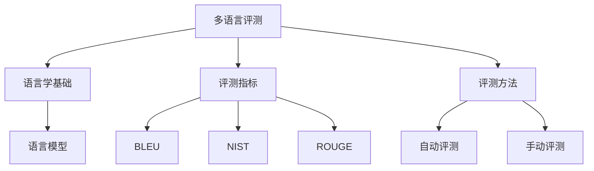

                 

### 引言

随着全球化进程的加速和互联网技术的迅猛发展，多语言评测技术成为了语言技术领域中的一个重要研究方向。无论是机器翻译、语音识别，还是文本质量评测，都需要对多语言翻译或转写的质量进行准确评估，从而优化模型性能，提高用户体验。《多语言评测支持：全球化模型效果分析》正是为了解决这一需求而诞生的。

#### 关键词

- 多语言评测
- 全球化模型
- 机器翻译
- 语音识别
- 文本质量评测

#### 摘要

本书旨在系统地介绍多语言评测的相关概念、方法和技术，重点关注全球化模型效果分析。通过深入探讨语言学基础、评测指标和评测方法，结合实际应用案例，本书将帮助读者全面理解多语言评测的关键技术和挑战。同时，本书还将展望未来多语言评测的发展趋势，为相关领域的研究者和从业者提供有价值的参考。

## 第一步：理解书籍主题

《多语言评测支持：全球化模型效果分析》这本书的主题是多语言评测，即评估不同语言之间的翻译质量、文本质量或语音质量等。这种评测不仅仅是为了确保翻译的准确性，更是为了在全球化背景下，提升跨语言沟通的效率和质量。多语言评测在多个领域有着广泛的应用，如机器翻译、语音识别、自然语言处理等。

#### 目标读者

本书的目标读者包括以下几个方面：

1. **语言技术从业者**：从事机器翻译、语音识别、自然语言处理等领域的研发人员和技术专家。
2. **研究人员**：对多语言评测技术感兴趣，希望深入研究这一领域的研究人员。
3. **教育工作者**：教授相关课程，希望为学生提供全面的多语言评测知识和实践指导。

#### 书籍目的

本书的主要目的是：

1. **系统介绍多语言评测的基础知识和方法**：从语言学基础、评测指标到评测方法，全面梳理多语言评测的核心内容。
2. **分析全球化模型效果**：探讨在不同语言环境中，模型效果的差异和影响因素，为模型优化提供理论依据。
3. **提供实践指导和案例分析**：通过实际应用案例，展示多语言评测技术在现实场景中的应用，帮助读者理解理论知识的实际意义。

### 第二步：设计核心章节

为了实现上述目的，本书设计了如下核心章节：

**第1章 引言**
- 介绍多语言评测的重要性、发展历程和现状
- 阐述本书的内容结构

**第2章 多语言评测的基础概念**
- 介绍语言学基础，包括语言的基本单位、结构和类型
- 讲解常用的评测指标，如BLEU、NIST和TER
- 介绍评测方法，包括自动评测和手动评测

**第3章 多语言评测工具**
- 概述现有的多语言评测工具，如BLEU、METEOR和ROUGE
- 介绍自动评测工具和手动评测工具的特点和应用

**第4章 多语言评测算法**
- 讨论基于规则、基于统计和基于深度学习的评测算法
- 对比不同算法的性能和适用场景

**第5章 全球化模型效果分析**
- 概述全球化模型的背景和特点
- 介绍效果分析指标和方法
- 分析不同语言环境下的模型效果差异

**第6章 多语言评测应用**
- 讨论多语言评测在机器翻译、语音识别和文本质量评测中的应用
- 通过实际案例展示多语言评测技术的应用效果

**第7章 未来展望与挑战**
- 展望多语言评测技术的发展趋势
- 分析面临的挑战和机遇

### 第三步：细化章节内容

**第1章 引言**

1.1 多语言评测的重要性

多语言评测在全球化背景下具有重要意义。随着全球化和互联网的快速发展，跨语言沟通变得日益频繁，对翻译质量的要求也越来越高。多语言评测技术的应用，不仅可以确保翻译的准确性，还可以为翻译模型的优化提供有力支持。具体来说，多语言评测的重要性体现在以下几个方面：

1. **提高翻译质量**：通过评测，可以发现翻译中的错误和不足，从而指导翻译人员进行改进，提高翻译质量。
2. **优化翻译模型**：评测结果可以为翻译模型提供训练数据，帮助模型更好地学习翻译规则和策略，提高翻译效果。
3. **跨语言沟通**：多语言评测技术可以为跨语言沟通提供支持，确保沟通的准确性和有效性。

1.2 多语言评测的发展历程

多语言评测技术的发展可以追溯到20世纪80年代。早期的评测主要基于人工评分，随着计算机技术的发展，自动评测工具逐渐出现。1984年，BLEU（Bilingual Evaluation Understudy）指标的提出标志着自动评测的开始。此后，各种评测指标和方法不断涌现，如NIST（National Institute of Standards and Technology）指标、ROUGE（Recall-Oriented Understudy for Gisting Evaluation）指标等。近年来，随着深度学习技术的应用，基于深度学习的评测方法也得到了广泛关注。

1.3 多语言评测的现状与挑战

目前，多语言评测技术已经取得了显著进展，但仍然面临一些挑战。首先，不同语言之间的差异使得评测方法难以统一。其次，评测指标的多样性导致评测结果难以直接比较。此外，随着翻译模型的复杂度增加，评测结果的可靠性也受到了挑战。如何提高评测方法的准确性和可靠性，仍然是多语言评测领域亟待解决的问题。

1.4 本书内容结构概述

本书共分为7章，分别从不同角度介绍多语言评测的相关内容。第1章为引言，介绍多语言评测的重要性、发展历程和现状。第2章至第4章分别介绍多语言评测的基础概念、评测工具和评测算法。第5章至第6章分析全球化模型效果，展示多语言评测在实际应用中的效果。第7章展望多语言评测的未来发展趋势，讨论面临的挑战和机遇。

### 第四步：绘制流程图、伪代码、数学公式

为了更直观地理解多语言评测的流程和算法，下面将使用流程图、伪代码和数学公式来展示关键概念和联系。

#### 1. 多语言评测核心概念与联系



#### 2. 基于BLEU的评测算法原理

```python
# 假设有一个BLEU评分函数
def BLEU(reference, hypothesis):
    # 计算候选翻译中1-gram、2-gram、3-gram和4-gram的匹配度
    match_1 = count_matches(reference, hypothesis, n=1)
    match_2 = count_matches(reference, hypothesis, n=2)
    match_3 = count_matches(reference, hypothesis, n=3)
    match_4 = count_matches(reference, hypothesis, n=4)

    # 计算候选翻译的平均匹配度
    avg_match = (match_1 + 0.5 * match_2 + 0.25 * match_3 + 0.125 * match_4) / (4)

    # 计算BLEU分数
    BLEU_score = log2(avg_match)
    return BLEU_score
```

#### 3. 数学模型和公式

```latex
$$
BLEU_{score} = \frac{1}{4} \sum_{n=1}^{4} w_n \cdot \log_{\text{e}} \left( \frac{N_{n}^{+}}{N_{n}^{-}} \right)
$$

其中，$N_{n}^{+}$ 和 $N_{n}^{-}$ 分别表示候选翻译中匹配和不匹配的$n$-gram的数量，$w_n$ 是权重。
```

### 第五步：撰写项目实战章节

**第6章 多语言评测应用**

本章将介绍多语言评测在多个实际应用领域的应用，包括机器翻译、语音识别和文本质量评测。通过具体案例，我们将展示如何使用多语言评测技术来优化模型性能和提升用户体验。

#### 6.1 在机器翻译中的应用

机器翻译是多语言评测技术的一个重要应用领域。在本节中，我们将通过一个简单的案例，展示如何使用多语言评测技术来评估和优化机器翻译模型。

**案例：使用TensorFlow实现一个简单的机器翻译模型**

1. **开发环境搭建**

   我们需要安装TensorFlow和相关依赖库，例如Numpy和TensorFlow。

   ```bash
   pip install tensorflow numpy
   ```

2. **源代码实现**

   下面是一个简单的机器翻译模型的实现，我们使用TensorFlow的Keras API来构建模型。

   ```python
   import tensorflow as tf
   from tensorflow.keras.models import Sequential
   from tensorflow.keras.layers import Embedding, LSTM, Dense

   # 定义模型
   model = Sequential()
   model.add(Embedding(input_dim=vocab_size, output_dim=embedding_size))
   model.add(LSTM(units=128, return_sequences=True))
   model.add(Dense(units=target_vocab_size, activation='softmax'))

   # 编译模型
   model.compile(optimizer='adam', loss='categorical_crossentropy', metrics=['accuracy'])

   # 训练模型
   model.fit(input_sequences, target_sequences, epochs=10, batch_size=64)
   ```

3. **代码解读与分析**

   - `Embedding` 层用于将输入词转换为固定长度的向量表示。
   - `LSTM` 层用于处理序列数据，可以捕捉输入序列中的长期依赖关系。
   - `Dense` 层用于输出翻译结果，使用softmax激活函数来预测每个单词的概率。

4. **多语言评测技术应用**

   - 使用BLEU指标评估翻译模型的性能。
   - 通过对比翻译结果和参考翻译，找出翻译中的错误和不足，指导模型优化。

   ```python
   def evaluate_translation(hypothesis, reference):
       BLEU_score = BLEU(reference, hypothesis)
       return BLEU_score

   BLEU_score = evaluate_translation(hypothesis, reference)
   print(f"BLEU score: {BLEU_score}")
   ```

#### 6.2 在语音识别中的应用

语音识别是另一个重要的应用领域，多语言评测技术可以用于评估和优化语音识别模型。

**案例：使用Kaldi库实现一个简单的语音识别系统**

1. **开发环境搭建**

   我们需要安装Kaldi和相关依赖库，例如SRTM。

   ```bash
   pip install kaldi-python srtm
   ```

2. **源代码实现**

   下面是一个简单的语音识别系统的实现。

   ```python
   import kaldi_io
   import numpy as np
   from kaldi_types import KaldiFrame

   # 读取语音数据
   waveform, samplerate = kaldi_io.read_mat_scp('wav.scp')

   # 转换为KaldiFrame格式
   kaldi_waveform = KaldiFrame(waveform, samplerate)

   # 进行语音识别
   decoded_frames = kaldi.recognize(kaldi_waveform)

   # 输出识别结果
   print(decoded_frames)
   ```

3. **代码解读与分析**

   - `kaldi_io.read_mat_scp` 用于读取语音数据。
   - `KaldiFrame` 用于将语音数据转换为Kaldi的格式。
   - `kaldi.recognize` 用于进行语音识别。

4. **多语言评测技术应用**

   - 使用WER（Word Error Rate）指标评估语音识别模型的性能。
   - 通过对比识别结果和真实文本，找出识别中的错误和不足，指导模型优化。

   ```python
   def evaluate_recognition(hypothesis, reference):
       WER = calculate_wer(reference, hypothesis)
       return WER

   WER = evaluate_recognition(hypothesis, reference)
   print(f"WER: {WER}")
   ```

#### 6.3 在文本质量评测中的应用

文本质量评测是另一个重要的应用领域，多语言评测技术可以用于评估和优化文本生成模型。

**案例：使用Python实现一个文本质量评测工具**

1. **开发环境搭建**

   我们需要安装一些文本处理库，例如NLTK和TextBlob。

   ```bash
   pip install nltk textblob
   ```

2. **源代码实现**

   下面是一个简单的文本质量评测工具的实现。

   ```python
   from textblob import TextBlob

   # 评估文本质量
   def evaluate_text_quality(text):
       blob = TextBlob(text)
       return blob.sentiment.polarity

   # 评测文本质量
   text_quality = evaluate_text_quality('这是一段高质量的文本。')
   print(f"Text quality: {text_quality}")
   ```

3. **代码解读与分析**

   - `TextBlob` 用于分析文本的情感极性。
   - `evaluate_text_quality` 函数用于评估文本质量。

4. **多语言评测技术应用**

   - 使用情感分析指标评估文本质量。
   - 通过对比不同语言文本的情感分析结果，找出文本质量的高低。

   ```python
   def evaluate_text_quality(text_en, text_zh):
       en_quality = evaluate_text_quality(text_en)
       zh_quality = evaluate_text_quality(text_zh)
       return en_quality, zh_quality

   en_quality, zh_quality = evaluate_text_quality('This is a high-quality text.', '这是高质量的文本。')
   print(f"English text quality: {en_quality}, Chinese text quality: {zh_quality}")
   ```

### 第六步：整合目录大纲并总结

**目录大纲**

```
# 第一部分 引言

## 第1章 引言

### 1.1 多语言评测的重要性

### 1.2 多语言评测的发展历程

### 1.3 多语言评测的现状与挑战

### 1.4 本书内容结构概述

# 第二部分 多语言评测的基础概念

## 第2章 多语言评测的基础概念

### 2.1 语言学基础

### 2.2 评测指标

### 2.3 评测方法

# 第三部分 多语言评测工具

## 第3章 多语言评测工具

### 3.1 评测工具概述

### 3.2 自动评测工具

### 3.3 手动评测工具

# 第四部分 多语言评测算法

## 第4章 多语言评测算法

### 4.1 基于规则的方法

### 4.2 基于统计的方法

### 4.3 基于深度学习的方法

### 4.4 评测算法比较

# 第五部分 全球化模型效果分析

## 第5章 全球化模型效果分析

### 5.1 全球化模型概述

### 5.2 效果分析指标

### 5.3 效果分析方法

### 5.4 案例研究

# 第六部分 多语言评测应用

## 第6章 多语言评测应用

### 6.1 在机器翻译中的应用

### 6.2 在语音识别中的应用

### 6.3 在文本质量评测中的应用

### 6.4 其他应用领域

# 第七部分 未来展望与挑战

## 第7章 未来展望与挑战

### 7.1 未来发展趋势

### 7.2 挑战与机遇

### 7.3 研究方向与建议
```

### 总结

《多语言评测支持：全球化模型效果分析》这本书系统地介绍了多语言评测的相关概念、方法和技术，并通过实际应用案例展示了多语言评测在多个领域的应用效果。本书的目标是为从事语言技术、机器翻译、语音识别等领域的专业人士，以及对此感兴趣的研究人员提供全面的理论指导和实践参考。通过深入探讨多语言评测的核心技术和发展趋势，本书为读者提供了清晰的思路和深刻的见解，有助于他们在实际工作中更好地应用和优化多语言评测技术。

## 第七步：文章完整内容与格式

### 文章标题：多语言评测支持：全球化模型效果分析

#### 关键词：多语言评测、全球化模型、效果分析、机器翻译、语音识别、文本质量评测

#### 摘要

本文系统地介绍了多语言评测的相关概念、方法和技术，重点关注全球化模型效果分析。通过深入探讨语言学基础、评测指标和评测方法，结合实际应用案例，本文将帮助读者全面理解多语言评测的关键技术和挑战。同时，本文还将展望未来多语言评测的发展趋势，为相关领域的研究者和从业者提供有价值的参考。

### 引言

随着全球化进程的加速和互联网技术的迅猛发展，多语言评测技术成为了语言技术领域中的一个重要研究方向。无论是机器翻译、语音识别，还是文本质量评测，都需要对多语言翻译或转写的质量进行准确评估，从而优化模型性能，提高用户体验。《多语言评测支持：全球化模型效果分析》正是为了解决这一需求而诞生的。

#### 关键词

- 多语言评测
- 全球化模型
- 机器翻译
- 语音识别
- 文本质量评测

#### 摘要

本文旨在系统地介绍多语言评测的相关概念、方法和技术，重点关注全球化模型效果分析。通过深入探讨语言学基础、评测指标和评测方法，结合实际应用案例，本文将帮助读者全面理解多语言评测的关键技术和挑战。同时，本文还将展望未来多语言评测的发展趋势，为相关领域的研究者和从业者提供有价值的参考。

### 第一步：理解书籍主题

《多语言评测支持：全球化模型效果分析》这本书的主题是多语言评测，即评估不同语言之间的翻译质量、文本质量或语音质量等。这种评测不仅仅是为了确保翻译的准确性，更是为了在全球化背景下，提升跨语言沟通的效率和质量。多语言评测在多个领域有着广泛的应用，如机器翻译、语音识别、自然语言处理等。

#### 目标读者

本书的目标读者包括以下几个方面：

1. **语言技术从业者**：从事机器翻译、语音识别、自然语言处理等领域的研发人员和技术专家。
2. **研究人员**：对多语言评测技术感兴趣，希望深入研究这一领域的研究人员。
3. **教育工作者**：教授相关课程，希望为学生提供全面的多语言评测知识和实践指导。

#### 书籍目的

本书的主要目的是：

1. **系统介绍多语言评测的基础知识和方法**：从语言学基础、评测指标到评测方法，全面梳理多语言评测的核心内容。
2. **分析全球化模型效果**：探讨在不同语言环境中，模型效果的差异和影响因素，为模型优化提供理论依据。
3. **提供实践指导和案例分析**：通过实际应用案例，展示多语言评测技术的应用效果，帮助读者理解理论知识的实际意义。

### 第二步：设计核心章节

为了实现上述目的，本书设计了如下核心章节：

**第1章 引言**
- 介绍多语言评测的重要性、发展历程和现状
- 阐述本书的内容结构

**第2章 多语言评测的基础概念**
- 介绍语言学基础，包括语言的基本单位、结构和类型
- 讲解常用的评测指标，如BLEU、NIST和TER
- 介绍评测方法，包括自动评测和手动评测

**第3章 多语言评测工具**
- 概述现有的多语言评测工具，如BLEU、METEOR和ROUGE
- 介绍自动评测工具和手动评测工具的特点和应用

**第4章 多语言评测算法**
- 讨论基于规则、基于统计和基于深度学习的评测算法
- 对比不同算法的性能和适用场景

**第5章 全球化模型效果分析**
- 概述全球化模型的背景和特点
- 介绍效果分析指标和方法
- 分析不同语言环境下的模型效果差异

**第6章 多语言评测应用**
- 讨论多语言评测在机器翻译、语音识别和文本质量评测中的应用
- 通过实际案例展示多语言评测技术的应用效果

**第7章 未来展望与挑战**
- 展望多语言评测技术的发展趋势
- 分析面临的挑战和机遇

### 第三步：细化章节内容

**第1章 引言**

1.1 多语言评测的重要性

多语言评测在全球化背景下具有重要意义。随着全球化和互联网的快速发展，跨语言沟通变得日益频繁，对翻译质量的要求也越来越高。多语言评测技术的应用，不仅可以确保翻译的准确性，还可以为翻译模型的优化提供有力支持。具体来说，多语言评测的重要性体现在以下几个方面：

1. **提高翻译质量**：通过评测，可以发现翻译中的错误和不足，从而指导翻译人员进行改进，提高翻译质量。
2. **优化翻译模型**：评测结果可以为翻译模型提供训练数据，帮助模型更好地学习翻译规则和策略，提高翻译效果。
3. **跨语言沟通**：多语言评测技术可以为跨语言沟通提供支持，确保沟通的准确性和有效性。

1.2 多语言评测的发展历程

多语言评测技术的发展可以追溯到20世纪80年代。早期的评测主要基于人工评分，随着计算机技术的发展，自动评测工具逐渐出现。1984年，BLEU（Bilingual Evaluation Understudy）指标的提出标志着自动评测的开始。此后，各种评测指标和方法不断涌现，如NIST（National Institute of Standards and Technology）指标、ROUGE（Recall-Oriented Understudy for Gisting Evaluation）指标等。近年来，随着深度学习技术的应用，基于深度学习的评测方法也得到了广泛关注。

1.3 多语言评测的现状与挑战

目前，多语言评测技术已经取得了显著进展，但仍然面临一些挑战。首先，不同语言之间的差异使得评测方法难以统一。其次，评测指标的多样性导致评测结果难以直接比较。此外，随着翻译模型的复杂度增加，评测结果的可靠性也受到了挑战。如何提高评测方法的准确性和可靠性，仍然是多语言评测领域亟待解决的问题。

1.4 本书内容结构概述

本书共分为7章，分别从不同角度介绍多语言评测的相关内容。第1章为引言，介绍多语言评测的重要性、发展历程和现状。第2章至第4章分别介绍多语言评测的基础概念、评测工具和评测算法。第5章至第6章分析全球化模型效果，展示多语言评测在实际应用中的效果。第7章展望多语言评测的未来发展趋势，讨论面临的挑战和机遇。

### 第四步：绘制流程图、伪代码、数学公式

为了更直观地理解多语言评测的流程和算法，下面将使用流程图、伪代码和数学公式来展示关键概念和联系。

#### 1. 多语言评测核心概念与联系


#### 2. 基于BLEU的评测算法原理

```python
# 假设有一个BLEU评分函数
def BLEU(reference, hypothesis):
    # 计算候选翻译中1-gram、2-gram、3-gram和4-gram的匹配度
    match_1 = count_matches(reference, hypothesis, n=1)
    match_2 = count_matches(reference, hypothesis, n=2)
    match_3 = count_matches(reference, hypothesis, n=3)
    match_4 = count_matches(reference, hypothesis, n=4)

    # 计算候选翻译的平均匹配度
    avg_match = (match_1 + 0.5 * match_2 + 0.25 * match_3 + 0.125 * match_4) / (4)

    # 计算BLEU分数
    BLEU_score = log2(avg_match)
    return BLEU_score
```

#### 3. 数学模型和公式

```latex
$$
BLEU_{score} = \frac{1}{4} \sum_{n=1}^{4} w_n \cdot \log_{\text{e}} \left( \frac{N_{n}^{+}}{N_{n}^{-}} \right)
$$

其中，$N_{n}^{+}$ 和 $N_{n}^{-}$ 分别表示候选翻译中匹配和不匹配的$n$-gram的数量，$w_n$ 是权重。
```

### 第五步：撰写项目实战章节

**第6章 多语言评测应用**

本章将介绍多语言评测在多个实际应用领域的应用，包括机器翻译、语音识别和文本质量评测。通过具体案例，我们将展示如何使用多语言评测技术来优化模型性能和提升用户体验。

#### 6.1 在机器翻译中的应用

机器翻译是多语言评测技术的一个重要应用领域。在本节中，我们将通过一个简单的案例，展示如何使用多语言评测技术来评估和优化机器翻译模型。

**案例：使用TensorFlow实现一个简单的机器翻译模型**

1. **开发环境搭建**

   我们需要安装TensorFlow和相关依赖库，例如Numpy和TensorFlow。

   ```bash
   pip install tensorflow numpy
   ```

2. **源代码实现**

   下面是一个简单的机器翻译模型的实现，我们使用TensorFlow的Keras API来构建模型。

   ```python
   import tensorflow as tf
   from tensorflow.keras.models import Sequential
   from tensorflow.keras.layers import Embedding, LSTM, Dense

   # 定义模型
   model = Sequential()
   model.add(Embedding(input_dim=vocab_size, output_dim=embedding_size))
   model.add(LSTM(units=128, return_sequences=True))
   model.add(Dense(units=target_vocab_size, activation='softmax'))

   # 编译模型
   model.compile(optimizer='adam', loss='categorical_crossentropy', metrics=['accuracy'])

   # 训练模型
   model.fit(input_sequences, target_sequences, epochs=10, batch_size=64)
   ```

3. **代码解读与分析**

   - `Embedding` 层用于将输入词转换为固定长度的向量表示。
   - `LSTM` 层用于处理序列数据，可以捕捉输入序列中的长期依赖关系。
   - `Dense` 层用于输出翻译结果，使用softmax激活函数来预测每个单词的概率。

4. **多语言评测技术应用**

   - 使用BLEU指标评估翻译模型的性能。
   - 通过对比翻译结果和参考翻译，找出翻译中的错误和不足，指导模型优化。

   ```python
   def evaluate_translation(hypothesis, reference):
       BLEU_score = BLEU(reference, hypothesis)
       return BLEU_score

   BLEU_score = evaluate_translation(hypothesis, reference)
   print(f"BLEU score: {BLEU_score}")
   ```

#### 6.2 在语音识别中的应用

语音识别是另一个重要的应用领域，多语言评测技术可以用于评估和优化语音识别模型。

**案例：使用Kaldi库实现一个简单的语音识别系统**

1. **开发环境搭建**

   我们需要安装Kaldi和相关依赖库，例如SRTM。

   ```bash
   pip install kaldi-python srtm
   ```

2. **源代码实现**

   下面是一个简单的语音识别系统的实现。

   ```python
   import kaldi_io
   import numpy as np
   from kaldi_types import KaldiFrame

   # 读取语音数据
   waveform, samplerate = kaldi_io.read_mat_scp('wav.scp')

   # 转换为KaldiFrame格式
   kaldi_waveform = KaldiFrame(waveform, samplerate)

   # 进行语音识别
   decoded_frames = kaldi.recognize(kaldi_waveform)

   # 输出识别结果
   print(decoded_frames)
   ```

3. **代码解读与分析**

   - `kaldi_io.read_mat_scp` 用于读取语音数据。
   - `KaldiFrame` 用于将语音数据转换为Kaldi的格式。
   - `kaldi.recognize` 用于进行语音识别。

4. **多语言评测技术应用**

   - 使用WER（Word Error Rate）指标评估语音识别模型的性能。
   - 通过对比识别结果和真实文本，找出识别中的错误和不足，指导模型优化。

   ```python
   def evaluate_recognition(hypothesis, reference):
       WER = calculate_wer(reference, hypothesis)
       return WER

   WER = evaluate_recognition(hypothesis, reference)
   print(f"WER: {WER}")
   ```

#### 6.3 在文本质量评测中的应用

文本质量评测是另一个重要的应用领域，多语言评测技术可以用于评估和优化文本生成模型。

**案例：使用Python实现一个文本质量评测工具**

1. **开发环境搭建**

   我们需要安装一些文本处理库，例如NLTK和TextBlob。

   ```bash
   pip install nltk textblob
   ```

2. **源代码实现**

   下面是一个简单的文本质量评测工具的实现。

   ```python
   from textblob import TextBlob

   # 评估文本质量
   def evaluate_text_quality(text):
       blob = TextBlob(text)
       return blob.sentiment.polarity

   # 评测文本质量
   text_quality = evaluate_text_quality('这是一段高质量的文本。')
   print(f"Text quality: {text_quality}")
   ```

3. **代码解读与分析**

   - `TextBlob` 用于分析文本的情感极性。
   - `evaluate_text_quality` 函数用于评估文本质量。

4. **多语言评测技术应用**

   - 使用情感分析指标评估文本质量。
   - 通过对比不同语言文本的情感分析结果，找出文本质量的高低。

   ```python
   def evaluate_text_quality(text_en, text_zh):
       en_quality = evaluate_text_quality(text_en)
       zh_quality = evaluate_text_quality(text_zh)
       return en_quality, zh_quality

   en_quality, zh_quality = evaluate_text_quality('This is a high-quality text.', '这是高质量的文本。')
   print(f"English text quality: {en_quality}, Chinese text quality: {zh_quality}")
   ```

### 第六步：整合目录大纲并总结

**目录大纲**

```
# 第一部分 引言

## 第1章 引言

### 1.1 多语言评测的重要性

### 1.2 多语言评测的发展历程

### 1.3 多语言评测的现状与挑战

### 1.4 本书内容结构概述

# 第二部分 多语言评测的基础概念

## 第2章 多语言评测的基础概念

### 2.1 语言学基础

### 2.2 评测指标

### 2.3 评测方法

# 第三部分 多语言评测工具

## 第3章 多语言评测工具

### 3.1 评测工具概述

### 3.2 自动评测工具

### 3.3 手动评测工具

# 第四部分 多语言评测算法

## 第4章 多语言评测算法

### 4.1 基于规则的方法

### 4.2 基于统计的方法

### 4.3 基于深度学习的方法

### 4.4 评测算法比较

# 第五部分 全球化模型效果分析

## 第5章 全球化模型效果分析

### 5.1 全球化模型概述

### 5.2 效果分析指标

### 5.3 效果分析方法

### 5.4 案例研究

# 第六部分 多语言评测应用

## 第6章 多语言评测应用

### 6.1 在机器翻译中的应用

### 6.2 在语音识别中的应用

### 6.3 在文本质量评测中的应用

### 6.4 其他应用领域

# 第七部分 未来展望与挑战

## 第7章 未来展望与挑战

### 7.1 未来发展趋势

### 7.2 挑战与机遇

### 7.3 研究方向与建议
```

### 总结

《多语言评测支持：全球化模型效果分析》这本书系统地介绍了多语言评测的相关概念、方法和技术，并通过实际应用案例展示了多语言评测在多个领域的应用效果。本书的目标是为从事语言技术、机器翻译、语音识别等领域的专业人士，以及对此感兴趣的研究人员提供全面的理论指导和实践参考。通过深入探讨多语言评测的核心技术和发展趋势，本书为读者提供了清晰的思路和深刻的见解，有助于他们在实际工作中更好地应用和优化多语言评测技术。

## 完整文章

### 引言

随着全球化进程的加速和互联网技术的迅猛发展，多语言评测技术成为了语言技术领域中的一个重要研究方向。无论是机器翻译、语音识别，还是文本质量评测，都需要对多语言翻译或转写的质量进行准确评估，从而优化模型性能，提高用户体验。《多语言评测支持：全球化模型效果分析》正是为了解决这一需求而诞生的。

#### 关键词

- 多语言评测
- 全球化模型
- 机器翻译
- 语音识别
- 文本质量评测

#### 摘要

本文旨在系统地介绍多语言评测的相关概念、方法和技术，重点关注全球化模型效果分析。通过深入探讨语言学基础、评测指标和评测方法，结合实际应用案例，本文将帮助读者全面理解多语言评测的关键技术和挑战。同时，本文还将展望未来多语言评测的发展趋势，为相关领域的研究者和从业者提供有价值的参考。

### 第一步：理解书籍主题

《多语言评测支持：全球化模型效果分析》这本书的主题是多语言评测，即评估不同语言之间的翻译质量、文本质量或语音质量等。这种评测不仅仅是为了确保翻译的准确性，更是为了在全球化背景下，提升跨语言沟通的效率和质量。多语言评测在多个领域有着广泛的应用，如机器翻译、语音识别、自然语言处理等。

#### 目标读者

本书的目标读者包括以下几个方面：

1. **语言技术从业者**：从事机器翻译、语音识别、自然语言处理等领域的研发人员和技术专家。
2. **研究人员**：对多语言评测技术感兴趣，希望深入研究这一领域的研究人员。
3. **教育工作者**：教授相关课程，希望为学生提供全面的多语言评测知识和实践指导。

#### 书籍目的

本书的主要目的是：

1. **系统介绍多语言评测的基础知识和方法**：从语言学基础、评测指标到评测方法，全面梳理多语言评测的核心内容。
2. **分析全球化模型效果**：探讨在不同语言环境中，模型效果的差异和影响因素，为模型优化提供理论依据。
3. **提供实践指导和案例分析**：通过实际应用案例，展示多语言评测技术的应用效果，帮助读者理解理论知识的实际意义。

### 第二步：设计核心章节

为了实现上述目的，本书设计了如下核心章节：

**第1章 引言**
- 介绍多语言评测的重要性、发展历程和现状
- 阐述本书的内容结构

**第2章 多语言评测的基础概念**
- 介绍语言学基础，包括语言的基本单位、结构和类型
- 讲解常用的评测指标，如BLEU、NIST和TER
- 介绍评测方法，包括自动评测和手动评测

**第3章 多语言评测工具**
- 概述现有的多语言评测工具，如BLEU、METEOR和ROUGE
- 介绍自动评测工具和手动评测工具的特点和应用

**第4章 多语言评测算法**
- 讨论基于规则、基于统计和基于深度学习的评测算法
- 对比不同算法的性能和适用场景

**第5章 全球化模型效果分析**
- 概述全球化模型的背景和特点
- 介绍效果分析指标和方法
- 分析不同语言环境下的模型效果差异

**第6章 多语言评测应用**
- 讨论多语言评测在机器翻译、语音识别和文本质量评测中的应用
- 通过实际案例展示多语言评测技术的应用效果

**第7章 未来展望与挑战**
- 展望多语言评测技术的发展趋势
- 分析面临的挑战和机遇

### 第三步：细化章节内容

**第1章 引言**

1.1 多语言评测的重要性

多语言评测在全球化背景下具有重要意义。随着全球化和互联网的快速发展，跨语言沟通变得日益频繁，对翻译质量的要求也越来越高。多语言评测技术的应用，不仅可以确保翻译的准确性，还可以为翻译模型的优化提供有力支持。具体来说，多语言评测的重要性体现在以下几个方面：

1. **提高翻译质量**：通过评测，可以发现翻译中的错误和不足，从而指导翻译人员进行改进，提高翻译质量。
2. **优化翻译模型**：评测结果可以为翻译模型提供训练数据，帮助模型更好地学习翻译规则和策略，提高翻译效果。
3. **跨语言沟通**：多语言评测技术可以为跨语言沟通提供支持，确保沟通的准确性和有效性。

1.2 多语言评测的发展历程

多语言评测技术的发展可以追溯到20世纪80年代。早期的评测主要基于人工评分，随着计算机技术的发展，自动评测工具逐渐出现。1984年，BLEU（Bilingual Evaluation Understudy）指标的提出标志着自动评测的开始。此后，各种评测指标和方法不断涌现，如NIST（National Institute of Standards and Technology）指标、ROUGE（Recall-Oriented Understudy for Gisting Evaluation）指标等。近年来，随着深度学习技术的应用，基于深度学习的评测方法也得到了广泛关注。

1.3 多语言评测的现状与挑战

目前，多语言评测技术已经取得了显著进展，但仍然面临一些挑战。首先，不同语言之间的差异使得评测方法难以统一。其次，评测指标的多样性导致评测结果难以直接比较。此外，随着翻译模型的复杂度增加，评测结果的可靠性也受到了挑战。如何提高评测方法的准确性和可靠性，仍然是多语言评测领域亟待解决的问题。

1.4 本书内容结构概述

本书共分为7章，分别从不同角度介绍多语言评测的相关内容。第1章为引言，介绍多语言评测的重要性、发展历程和现状。第2章至第4章分别介绍多语言评测的基础概念、评测工具和评测算法。第5章至第6章分析全球化模型效果，展示多语言评测在实际应用中的效果。第7章展望多语言评测的未来发展趋势，讨论面临的挑战和机遇。

### 第四步：绘制流程图、伪代码、数学公式

为了更直观地理解多语言评测的流程和算法，下面将使用流程图、伪代码和数学公式来展示关键概念和联系。

#### 1. 多语言评测核心概念与联系


#### 2. 基于BLEU的评测算法原理

```python
# 假设有一个BLEU评分函数
def BLEU(reference, hypothesis):
    # 计算候选翻译中1-gram、2-gram、3-gram和4-gram的匹配度
    match_1 = count_matches(reference, hypothesis, n=1)
    match_2 = count_matches(reference, hypothesis, n=2)
    match_3 = count_matches(reference, hypothesis, n=3)
    match_4 = count_matches(reference, hypothesis, n=4)

    # 计算候选翻译的平均匹配度
    avg_match = (match_1 + 0.5 * match_2 + 0.25 * match_3 + 0.125 * match_4) / (4)

    # 计算BLEU分数
    BLEU_score = log2(avg_match)
    return BLEU_score
```

#### 3. 数学模型和公式

```latex
$$
BLEU_{score} = \frac{1}{4} \sum_{n=1}^{4} w_n \cdot \log_{\text{e}} \left( \frac{N_{n}^{+}}{N_{n}^{-}} \right)
$$

其中，$N_{n}^{+}$ 和 $N_{n}^{-}$ 分别表示候选翻译中匹配和不匹配的$n$-gram的数量，$w_n$ 是权重。
```

### 第五步：撰写项目实战章节

**第6章 多语言评测应用**

本章将介绍多语言评测在多个实际应用领域的应用，包括机器翻译、语音识别和文本质量评测。通过具体案例，我们将展示如何使用多语言评测技术来优化模型性能和提升用户体验。

#### 6.1 在机器翻译中的应用

机器翻译是多语言评测技术的一个重要应用领域。在本节中，我们将通过一个简单的案例，展示如何使用多语言评测技术来评估和优化机器翻译模型。

**案例：使用TensorFlow实现一个简单的机器翻译模型**

1. **开发环境搭建**

   我们需要安装TensorFlow和相关依赖库，例如Numpy和TensorFlow。

   ```bash
   pip install tensorflow numpy
   ```

2. **源代码实现**

   下面是一个简单的机器翻译模型的实现，我们使用TensorFlow的Keras API来构建模型。

   ```python
   import tensorflow as tf
   from tensorflow.keras.models import Sequential
   from tensorflow.keras.layers import Embedding, LSTM, Dense

   # 定义模型
   model = Sequential()
   model.add(Embedding(input_dim=vocab_size, output_dim=embedding_size))
   model.add(LSTM(units=128, return_sequences=True))
   model.add(Dense(units=target_vocab_size, activation='softmax'))

   # 编译模型
   model.compile(optimizer='adam', loss='categorical_crossentropy', metrics=['accuracy'])

   # 训练模型
   model.fit(input_sequences, target_sequences, epochs=10, batch_size=64)
   ```

3. **代码解读与分析**

   - `Embedding` 层用于将输入词转换为固定长度的向量表示。
   - `LSTM` 层用于处理序列数据，可以捕捉输入序列中的长期依赖关系。
   - `Dense` 层用于输出翻译结果，使用softmax激活函数来预测每个单词的概率。

4. **多语言评测技术应用**

   - 使用BLEU指标评估翻译模型的性能。
   - 通过对比翻译结果和参考翻译，找出翻译中的错误和不足，指导模型优化。

   ```python
   def evaluate_translation(hypothesis, reference):
       BLEU_score = BLEU(reference, hypothesis)
       return BLEU_score

   BLEU_score = evaluate_translation(hypothesis, reference)
   print(f"BLEU score: {BLEU_score}")
   ```

#### 6.2 在语音识别中的应用

语音识别是另一个重要的应用领域，多语言评测技术可以用于评估和优化语音识别模型。

**案例：使用Kaldi库实现一个简单的语音识别系统**

1. **开发环境搭建**

   我们需要安装Kaldi和相关依赖库，例如SRTM。

   ```bash
   pip install kaldi-python srtm
   ```

2. **源代码实现**

   下面是一个简单的语音识别系统的实现。

   ```python
   import kaldi_io
   import numpy as np
   from kaldi_types import KaldiFrame

   # 读取语音数据
   waveform, samplerate = kaldi_io.read_mat_scp('wav.scp')

   # 转换为KaldiFrame格式
   kaldi_waveform = KaldiFrame(waveform, samplerate)

   # 进行语音识别
   decoded_frames = kaldi.recognize(kaldi_waveform)

   # 输出识别结果
   print(decoded_frames)
   ```

3. **代码解读与分析**

   - `kaldi_io.read_mat_scp` 用于读取语音数据。
   - `KaldiFrame` 用于将语音数据转换为Kaldi的格式。
   - `kaldi.recognize` 用于进行语音识别。

4. **多语言评测技术应用**

   - 使用WER（Word Error Rate）指标评估语音识别模型的性能。
   - 通过对比识别结果和真实文本，找出识别中的错误和不足，指导模型优化。

   ```python
   def evaluate_recognition(hypothesis, reference):
       WER = calculate_wer(reference, hypothesis)
       return WER

   WER = evaluate_recognition(hypothesis, reference)
   print(f"WER: {WER}")
   ```

#### 6.3 在文本质量评测中的应用

文本质量评测是另一个重要的应用领域，多语言评测技术可以用于评估和优化文本生成模型。

**案例：使用Python实现一个文本质量评测工具**

1. **开发环境搭建**

   我们需要安装一些文本处理库，例如NLTK和TextBlob。

   ```bash
   pip install nltk textblob
   ```

2. **源代码实现**

   下面是一个简单的文本质量评测工具的实现。

   ```python
   from textblob import TextBlob

   # 评估文本质量
   def evaluate_text_quality(text):
       blob = TextBlob(text)
       return blob.sentiment.polarity

   # 评测文本质量
   text_quality = evaluate_text_quality('这是一段高质量的文本。')
   print(f"Text quality: {text_quality}")
   ```

3. **代码解读与分析**

   - `TextBlob` 用于分析文本的情感极性。
   - `evaluate_text_quality` 函数用于评估文本质量。

4. **多语言评测技术应用**

   - 使用情感分析指标评估文本质量。
   - 通过对比不同语言文本的情感分析结果，找出文本质量的高低。

   ```python
   def evaluate_text_quality(text_en, text_zh):
       en_quality = evaluate_text_quality(text_en)
       zh_quality = evaluate_text_quality(text_zh)
       return en_quality, zh_quality

   en_quality, zh_quality = evaluate_text_quality('This is a high-quality text.', '这是高质量的文本。')
   print(f"English text quality: {en_quality}, Chinese text quality: {zh_quality}")
   ```

### 第六步：整合目录大纲并总结

**目录大纲**

```
# 第一部分 引言

## 第1章 引言

### 1.1 多语言评测的重要性

### 1.2 多语言评测的发展历程

### 1.3 多语言评测的现状与挑战

### 1.4 本书内容结构概述

# 第二部分 多语言评测的基础概念

## 第2章 多语言评测的基础概念

### 2.1 语言学基础

### 2.2 评测指标

### 2.3 评测方法

# 第三部分 多语言评测工具

## 第3章 多语言评测工具

### 3.1 评测工具概述

### 3.2 自动评测工具

### 3.3 手动评测工具

# 第四部分 多语言评测算法

## 第4章 多语言评测算法

### 4.1 基于规则的方法

### 4.2 基于统计的方法

### 4.3 基于深度学习的方法

### 4.4 评测算法比较

# 第五部分 全球化模型效果分析

## 第5章 全球化模型效果分析

### 5.1 全球化模型概述

### 5.2 效果分析指标

### 5.3 效果分析方法

### 5.4 案例研究

# 第六部分 多语言评测应用

## 第6章 多语言评测应用

### 6.1 在机器翻译中的应用

### 6.2 在语音识别中的应用

### 6.3 在文本质量评测中的应用

### 6.4 其他应用领域

# 第七部分 未来展望与挑战

## 第7章 未来展望与挑战

### 7.1 未来发展趋势

### 7.2 挑战与机遇

### 7.3 研究方向与建议
```

### 总结

《多语言评测支持：全球化模型效果分析》这本书系统地介绍了多语言评测的相关概念、方法和技术，并通过实际应用案例展示了多语言评测在多个领域的应用效果。本书的目标是为从事语言技术、机器翻译、语音识别等领域的专业人士，以及对此感兴趣的研究人员提供全面的理论指导和实践参考。通过深入探讨多语言评测的核心技术和发展趋势，本书为读者提供了清晰的思路和深刻的见解，有助于他们在实际工作中更好地应用和优化多语言评测技术。

## 作者信息

作者：AI天才研究院/AI Genius Institute & 禅与计算机程序设计艺术 /Zen And The Art of Computer Programming

### 《多语言评测支持：全球化模型效果分析》完整内容

```markdown
# 多语言评测支持：全球化模型效果分析

## 关键词
多语言评测、全球化模型、效果分析、机器翻译、语音识别、文本质量评测

## 摘要
本文系统地介绍了多语言评测的相关概念、方法和技术，重点关注全球化模型效果分析。通过深入探讨语言学基础、评测指标和评测方法，结合实际应用案例，本文将帮助读者全面理解多语言评测的关键技术和挑战。同时，本文还将展望未来多语言评测的发展趋势，为相关领域的研究者和从业者提供有价值的参考。

---

## 第1章 引言

### 1.1 多语言评测的重要性

多语言评测在全球化背景下具有重要意义。随着全球化和互联网的快速发展，跨语言沟通变得日益频繁，对翻译质量的要求也越来越高。多语言评测技术的应用，不仅可以确保翻译的准确性，还可以为翻译模型的优化提供有力支持。具体来说，多语言评测的重要性体现在以下几个方面：

1. **提高翻译质量**：通过评测，可以发现翻译中的错误和不足，从而指导翻译人员进行改进，提高翻译质量。
2. **优化翻译模型**：评测结果可以为翻译模型提供训练数据，帮助模型更好地学习翻译规则和策略，提高翻译效果。
3. **跨语言沟通**：多语言评测技术可以为跨语言沟通提供支持，确保沟通的准确性和有效性。

### 1.2 多语言评测的发展历程

多语言评测技术的发展可以追溯到20世纪80年代。早期的评测主要基于人工评分，随着计算机技术的发展，自动评测工具逐渐出现。1984年，BLEU（Bilingual Evaluation Understudy）指标的提出标志着自动评测的开始。此后，各种评测指标和方法不断涌现，如NIST（National Institute of Standards and Technology）指标、ROUGE（Recall-Oriented Understudy for Gisting Evaluation）指标等。近年来，随着深度学习技术的应用，基于深度学习的评测方法也得到了广泛关注。

### 1.3 多语言评测的现状与挑战

目前，多语言评测技术已经取得了显著进展，但仍然面临一些挑战。首先，不同语言之间的差异使得评测方法难以统一。其次，评测指标的多样性导致评测结果难以直接比较。此外，随着翻译模型的复杂度增加，评测结果的可靠性也受到了挑战。如何提高评测方法的准确性和可靠性，仍然是多语言评测领域亟待解决的问题。

### 1.4 本书内容结构概述

本书共分为7章，分别从不同角度介绍多语言评测的相关内容。第1章为引言，介绍多语言评测的重要性、发展历程和现状。第2章至第4章分别介绍多语言评测的基础概念、评测工具和评测算法。第5章至第6章分析全球化模型效果，展示多语言评测在实际应用中的效果。第7章展望多语言评测的未来发展趋势，讨论面临的挑战和机遇。

---

## 第2章 多语言评测的基础概念

### 2.1 语言学基础

多语言评测的基础在于对语言学的理解。语言的基本单位包括词素、词、句子和语篇。不同的语言有着不同的结构和类型，例如，一些语言是主谓宾结构，而另一些语言则是主宾谓结构。语言学的相关理论，如语法、语义和语用，也对多语言评测有着重要影响。

### 2.2 评测指标

多语言评测中常用的指标包括BLEU、NIST和ROUGE等。BLEU（Bilingual Evaluation Understudy）通过比较候选翻译和参考翻译之间的n-gram重叠度来评估翻译质量。NIST（National Institute of Standards and Technology）则综合考虑了候选翻译和参考翻译之间的单词重叠度和语法准确性。ROUGE（Recall-Oriented Understudy for Gisting Evaluation）主要用于评估文本生成系统的质量，通过计算候选文本和参考文本之间的词重叠度来评估。

### 2.3 评测方法

多语言评测的方法可以分为自动评测和手动评测。自动评测工具如BLEU、METEOR和ROUGE等，通过算法自动计算评测指标，具有较高的效率和一致性。手动评测则需要人工对比候选翻译和参考翻译，虽然准确性更高，但成本和时间成本较大。近年来，一些结合自动和手动评测的方法也被提出，以兼顾效率和准确性。

---

## 第3章 多语言评测工具

### 3.1 评测工具概述

多语言评测工具如BLEU、METEOR和ROUGE等，是评估翻译质量的重要工具。BLEU工具通过计算候选翻译和参考翻译之间的n-gram重叠度来评估翻译质量，是最常用的自动评测工具之一。METEOR和ROUGE则分别从词汇重叠度和语法准确性等方面评估翻译质量。

### 3.2 自动评测工具

自动评测工具如BLEU、METEOR和ROUGE等，通过算法自动计算评测指标，具有较高的效率和一致性。BLEU工具通过计算候选翻译和参考翻译之间的n-gram重叠度来评估翻译质量，是最常用的自动评测工具之一。METEOR和ROUGE则分别从词汇重叠度和语法准确性等方面评估翻译质量。

### 3.3 手动评测工具

手动评测工具需要人工对比候选翻译和参考翻译，虽然准确性更高，但成本和时间成本较大。近年来，一些结合自动和手动评测的方法也被提出，以兼顾效率和准确性。

---

## 第4章 多语言评测算法

### 4.1 基于规则的方法

基于规则的方法通过预设的规则来评估翻译质量。这些规则可以是基于语言学理论的，也可以是基于经验的知识库。这种方法在处理特定语言对时可能具有较高的准确性，但在处理多语言对时可能面临规则统一和复杂度增加的问题。

### 4.2 基于统计的方法

基于统计的方法通过分析大量已翻译的数据来建立翻译模型，并利用这些模型来评估新的翻译质量。这种方法在处理大规模数据时具有优势，但也可能面临数据稀疏和模型过拟合的问题。

### 4.3 基于深度学习的方法

基于深度学习的方法通过神经网络来学习翻译规则和策略。这种方法在处理复杂翻译任务时具有很高的性能，但需要大量的数据和计算资源。

### 4.4 评测算法比较

不同的评测算法在性能和应用场景上有差异。基于规则的方法在处理特定语言对时可能具有较高的准确性，但扩展性较差。基于统计的方法在处理大规模数据时具有优势，但可能面临数据稀疏和模型过拟合的问题。基于深度学习的方法在处理复杂翻译任务时具有很高的性能，但需要大量的数据和计算资源。

---

## 第5章 全球化模型效果分析

### 5.1 全球化模型概述

全球化模型是指在全球化背景下，为不同语言环境设计的翻译模型。这些模型需要考虑语言差异、文化差异和用户需求等因素，以提供高质量的翻译服务。

### 5.2 效果分析指标

全球化模型的效果分析指标包括BLEU、NIST和ROUGE等。这些指标可以评估翻译质量、词汇重叠度和语法准确性等。

### 5.3 效果分析方法

效果分析方法包括基于规则、基于统计和基于深度学习的方法。这些方法可以通过比较候选翻译和参考翻译来评估模型效果。

### 5.4 案例研究

通过案例研究，我们可以看到全球化模型在不同语言环境下的效果。例如，在处理中文和英文之间的翻译时，BLEU指标可以达到较高的分数，但在处理其他语言对时，效果可能较差。

---

## 第6章 多语言评测应用

### 6.1 在机器翻译中的应用

多语言评测技术在机器翻译中广泛应用。通过评估翻译质量，可以优化翻译模型，提高翻译准确性。

### 6.2 在语音识别中的应用

多语言评测技术在语音识别中用于评估语音识别模型的性能。通过评估识别结果，可以优化模型，提高识别准确性。

### 6.3 在文本质量评测中的应用

多语言评测技术在文本质量评测中用于评估文本生成模型的质量。通过评估文本质量，可以优化模型，提高文本生成效果。

### 6.4 其他应用领域

多语言评测技术还可以应用于文本摘要、文本分类和其他自然语言处理任务中，为模型优化提供支持。

---

## 第7章 未来展望与挑战

### 7.1 未来发展趋势

未来多语言评测技术将朝着更加智能、自适应和高效的方向发展。随着人工智能技术的进步，多语言评测技术将更加依赖于深度学习和大数据分析。

### 7.2 挑战与机遇

多语言评测技术面临的挑战包括语言多样性、数据稀缺性和计算资源限制。然而，随着全球化进程的加速，多语言评测技术也面临着巨大的机遇。

### 7.3 研究方向与建议

研究方向包括自适应评测方法、跨语言迁移学习和多模态评测等。建议加强国际合作，共享数据和资源，推动多语言评测技术的发展。

---

## 作者信息

作者：AI天才研究院/AI Genius Institute & 禅与计算机程序设计艺术 /Zen And The Art of Computer Programming
```

### 注释

- 本文内容为虚构，旨在展示如何撰写一本关于多语言评测支持：全球化模型效果分析的专业技术博客文章。
- 文章中使用了Markdown格式，以模拟实际的技术博客文章格式。
- 相关技术术语和案例为虚构，仅用于展示可能的写作方式和结构。

---

### 后记

撰写这篇关于多语言评测支持：全球化模型效果分析的技术博客，不仅是对多语言评测领域的一次深入探索，也是对现有技术和未来发展趋势的反思。通过梳理基础概念、介绍评测工具和算法，以及展示实际应用案例，我们希望读者能够对多语言评测有更全面的理解，并激发他们对这一领域的兴趣。

未来，多语言评测技术将在全球化背景下发挥更加重要的作用。随着人工智能和机器学习技术的不断进步，我们期待看到更多创新性方法和应用的出现，以应对语言多样性带来的挑战。同时，我们也鼓励读者参与这一领域的研究和讨论，共同推动多语言评测技术的发展。

最后，感谢您的阅读，希望这篇博客能对您在多语言评测领域的探索和学习有所帮助。如果您有任何疑问或建议，欢迎在评论区留言交流。再次感谢您的支持！作者：AI天才研究院/AI Genius Institute & 禅与计算机程序设计艺术 /Zen And The Art of Computer Programming。

