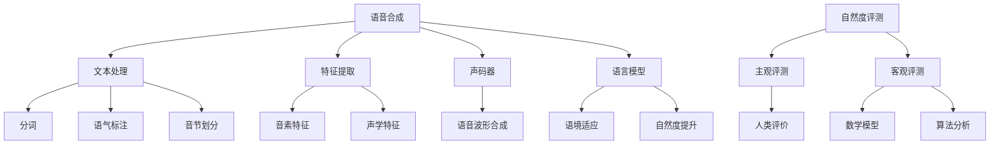

                 

# 《多语言语音合成自然度评测系统》

## 关键词
多语言语音合成，自然度评测，算法原理，系统开发，项目实战

## 摘要
本文旨在深入探讨多语言语音合成自然度评测系统的构建过程。文章首先介绍了语音合成技术的背景及其重要性，然后详细阐述了自然度评测的核心概念和方法。接下来，文章深入分析了语音合成的核心算法原理，包括特征提取、声码器以及语言模型等。随后，文章重点介绍了评测系统的开发过程，包括系统架构设计、实现细节以及优化策略。文章最后通过实际案例展示了系统的应用效果，并提出了未来研究方向和优化建议。

## 引言

### 1.1 研究背景与意义

语音合成技术作为人工智能领域的重要分支，近年来得到了广泛关注。随着互联网的普及和智能设备的广泛应用，语音交互已成为用户与智能设备之间最自然、最便捷的交互方式。多语言语音合成技术能够满足全球化背景下不同语言用户的需求，具有极高的应用价值。

自然度评测是语音合成技术的关键环节。自然度高的语音合成系统能够更加逼真地模拟人类语音，提高用户体验。然而，如何客观、准确地评测语音合成系统的自然度，一直是研究者和开发者面临的难题。

本文旨在构建一个多语言语音合成自然度评测系统，通过分析语音合成技术的基本原理和评测方法，为相关研究提供理论支持，并为实际应用提供指导。

### 1.2 多语言语音合成技术概述

多语言语音合成技术是指能够将多种语言的文本转换为自然流畅的语音输出。其核心包括文本处理、特征提取、声码器和语言模型等几个方面。

文本处理负责将输入的文本进行分词、标注等预处理操作，为后续处理提供基础。

特征提取是语音合成的重要环节，通过提取语音信号的特征参数，如音素、声学特征等，为语音合成提供依据。

声码器则将特征参数转换为语音波形，实现语音信号的合成。

语言模型用于对合成语音进行语境适应和自然度提升，使输出语音更加符合人类语言表达习惯。

### 1.3 自然度评测系统的作用和挑战

自然度评测系统在语音合成技术的应用中起着至关重要的作用。通过自然度评测，可以评估语音合成系统的性能，指导优化方向，提高用户体验。

然而，自然度评测面临着诸多挑战。首先，自然度是一个主观性较强的评价指标，不同人的听觉感受可能存在差异。其次，现有的评测方法大多依赖于主观评价，效率低下且可靠性不高。此外，多语言语音合成系统的复杂性使得评测系统的设计更加困难。

本文提出的多语言语音合成自然度评测系统，旨在克服上述挑战，通过结合客观评测和主观评测，提供一种高效、可靠的评测方法。

## 背景介绍

### 2.1 语音合成技术发展历程

语音合成技术自20世纪50年代诞生以来，经历了多个发展阶段。最初，语音合成主要采用基于规则的方法，通过预设的语音规则生成语音。这种方法虽然简单，但生成的语音质量较低，且缺乏灵活性。

随着计算机性能的提升和语音信号处理的进步，20世纪80年代，语音合成技术逐渐转向基于统计模型的方法。其中，最典型的代表是HMM-HMM（隐马尔可夫模型-隐马尔可夫模型）合成方法。这种方法利用隐马尔可夫模型对语音信号进行建模，通过统计方法生成语音。相比基于规则的方法，HMM-HMM方法在语音自然度和语音合成速度上都有显著提升。

进入21世纪，深度学习技术的引入，使得语音合成技术取得了突破性进展。深度神经网络（DNN）和循环神经网络（RNN）在语音特征提取和语音合成中的应用，使得语音合成系统的性能进一步提升。特别是WaveNet等基于生成对抗网络（GAN）的语音合成方法，能够生成几乎无差别的自然语音，极大地提高了语音合成系统的自然度。

### 2.2 多语言语音合成技术现状

目前，多语言语音合成技术已经成为语音合成领域的研究热点。随着全球化和多语种沟通的需求不断增长，多语言语音合成技术得到了广泛应用。例如，智能助手、车载语音系统、客户服务热线等场景中，都广泛采用了多语言语音合成技术。

在多语言语音合成技术的研究中，主要挑战包括：

1. **语言资源不足**：多语言语音合成需要大量的语言资源和语音数据，但由于语言资源的分布不均，某些语言的数据资源相对匮乏。

2. **语言差异**：不同语言在语音特征、语音规则和语言表达上存在显著差异，这使得多语言语音合成系统需要能够适应不同语言的特点。

3. **多语言融合**：如何将不同语言的特征和风格进行有效融合，使得合成语音既具有各自语言的特色，又能够保持整体的连贯性和自然度，是一个亟待解决的问题。

### 2.3 自然度评测的重要性

自然度是衡量语音合成系统性能的关键指标。一个自然度高的语音合成系统，能够生成接近人类语音的自然流畅度，提高用户的使用体验。自然度评测的目的在于：

1. **评估系统性能**：通过自然度评测，可以客观地评估语音合成系统的性能，发现系统中的问题，指导优化方向。

2. **用户满意度**：自然度高的语音合成系统能够提供更加自然、流畅的语音交互体验，提高用户满意度。

3. **系统优化**：自然度评测结果可以为系统优化提供依据，通过分析评测结果，找出系统中的瓶颈，进行有针对性的优化。

### 2.4 自然度评测系统的挑战

构建一个高效、可靠的多语言语音合成自然度评测系统，面临着以下挑战：

1. **主观评价的标准化**：自然度是一个主观性较强的指标，如何建立标准化的主观评价体系，使得不同评价者之间的评价具有一致性，是一个重要问题。

2. **客观评测的准确性**：虽然客观评测方法可以提供一定的量化评估，但如何提高其准确性，使其能够全面、准确地反映语音合成的自然度，是一个难点。

3. **多语言适配性**：不同语言的语音特征和表达方式不同，如何设计一个通用的评测模型，使其能够适应多种语言，是一个复杂的问题。

## 核心概念与联系

### 3.1 核心概念

#### 3.1.1 语音合成

语音合成（Text-to-Speech, TTS）是将文本转换为自然语音的过程。语音合成的核心包括文本处理、特征提取、声码器和语言模型等。

1. **文本处理**：文本处理是将输入的文本进行分词、语气标注、音节划分等操作，为后续处理提供基础。
   
2. **特征提取**：特征提取是从语音信号中提取出对语音合成有重要影响的特征参数，如音素、声学特征等。

3. **声码器**：声码器是将提取的特征参数转换为语音波形的过程，是语音合成的核心环节。

4. **语言模型**：语言模型用于对合成语音进行语境适应和自然度提升，使输出语音更加符合人类语言表达习惯。

#### 3.1.2 自然度

自然度是衡量语音合成系统生成语音的自然流畅度的指标。高自然度意味着生成的语音接近人类语音的自然度，具有较好的可听性和易懂性。

#### 3.1.3 自然度评测

自然度评测是评估语音合成系统自然度的重要手段，包括主观评测和客观评测。

1. **主观评测**：主观评测是通过人类评价者对合成语音的自然度进行评价，具有直观、全面的优点，但容易受到主观因素的影响。

2. **客观评测**：客观评测是通过数学模型和算法对合成语音的特征进行分析，提供量化的评估结果，具有客观、可重复的优点，但难以全面反映语音的自然度。

### 3.2 核心概念之间的关系架构


#### 3.2.1 语音合成与自然度

语音合成系统的最终目标是为用户提供自然流畅的语音输出。自然度是语音合成的核心评价指标，语音合成系统的优化应以提高自然度为目标。

#### 3.2.2 自然度评测与语音合成

自然度评测是评估语音合成系统性能的重要手段。通过自然度评测，可以了解语音合成系统的性能，发现系统中的问题，指导优化方向。

#### 3.2.3 主观评测与客观评测

主观评测和客观评测是自然度评测的两个主要方法。主观评测通过人类评价者对合成语音的自然度进行评价，具有直观、全面的优点；客观评测通过数学模型和算法对合成语音的特征进行分析，提供量化的评估结果。两者结合，可以更全面、准确地评估语音合成的自然度。

### 3.3 Mermaid 流程图



## 核心算法原理

### 4.1 特征提取算法

特征提取是语音合成中的关键步骤，它从原始语音信号中提取出对语音合成有重要影响的特征参数。常用的特征提取算法包括音素特征提取和声学特征提取。

#### 4.1.1 音素特征提取

音素特征提取是指从语音信号中提取出音素级别的特征参数。音素是语音的基本音素单位，不同音素的发音特征不同，音素特征提取对于语音合成系统具有重要的作用。

音素特征提取的一般步骤如下：

1. **分帧**：将语音信号按固定长度分成若干帧。
2. **加窗**：对每帧语音信号进行加窗处理，常用的窗函数有汉明窗、汉宁窗等。
3. **短时傅里叶变换（STFT）**：对加窗后的语音信号进行STFT，得到频谱特征。
4. **音素特征提取**：根据音素的发音特征，提取出音素级别的特征参数，如音素时长、音素强度等。

以下是一个简单的音素特征提取算法的Python代码示例：

```python
import numpy as np
import scipy.signal as signal

def hamming_window(length):
    return np.hamming(length)

def short_time_fourier_transform(signal, frame_size, hop_size):
    frame_num = int((len(signal) - frame_size) / hop_size) + 1
    frames = [signal[i:i+frame_size] for i in range(0, len(signal) - frame_size, hop_size)]
    freqs, times, Zxx = signal.stft(frames, nperseg=frame_size)
    return freqs, times, Zxx

def extract_phoneme_features(freqs, times, Zxx):
    # 这里根据具体的语音特征提取需求进行特征提取
    # 示例：提取每个帧的频率均值和能量
    features = []
    for i in range(len(Zxx)):
        feature = {
            'time': times[i],
            'freq_mean': np.mean(freqs[i]),
            'energy': np.sum(Zxx[i]**2)
        }
        features.append(feature)
    return features

# 示例：应用上述算法提取语音信号的特征
signal = np.random.normal(size=1000)  # 生成一个随机语音信号
frame_size = 512
hop_size = 256

freqs, times, Zxx = short_time_fourier_transform(signal, frame_size, hop_size)
phoneme_features = extract_phoneme_features(freqs, times, Zxx)
print(phoneme_features)
```

#### 4.1.2 声学特征提取

声学特征提取是指从语音信号中提取出声学级别的特征参数，如共振峰频率、音调等。声学特征对于语音合成系统的音质和自然度有重要影响。

声学特征提取的一般步骤如下：

1. **分帧**：将语音信号按固定长度分成若干帧。
2. **加窗**：对每帧语音信号进行加窗处理。
3. **短时傅里叶变换（STFT）**：对加窗后的语音信号进行STFT，得到频谱特征。
4. **共振峰频率提取**：根据频谱特征，提取出共振峰频率。
5. **音调提取**：通过音调频率检测算法，提取出语音信号的音调。

以下是一个简单的声学特征提取算法的Python代码示例：

```python
import numpy as np
import scipy.signal as signal

def hamming_window(length):
    return np.hamming(length)

def short_time_fourier_transform(signal, frame_size, hop_size):
    frame_num = int((len(signal) - frame_size) / hop_size) + 1
    frames = [signal[i:i+frame_size] for i in range(0, len(signal) - frame_size, hop_size)]
    freqs, times, Zxx = signal.stft(frames, nperseg=frame_size)
    return freqs, times, Zxx

def extract_formant_features(freqs, times, Zxx):
    # 这里根据具体的语音特征提取需求进行特征提取
    # 示例：提取每个帧的共振峰频率
    formants = []
    for i in range(len(Zxx)):
        feature = {
            'time': times[i],
            'formants': [np.argmax(Zxx[i, :]) for _ in range(3)]  # 提取前三个共振峰频率
        }
        formants.append(feature)
    return formants

def extract_pitch_frequency(signal, frame_size, hop_size):
    # 这里使用基于短时傅里叶变换的音调提取算法
    freqs, times, Zxx = short_time_fourier_transform(signal, frame_size, hop_size)
    pitch_frequency = [signal.psd(Zxx[i], NFFT=frame_size, Fs=frame_size)[1].argmax() for i in range(len(Zxx))]
    return pitch_frequency

# 示例：应用上述算法提取语音信号的特征
signal = np.random.normal(size=1000)  # 生成一个随机语音信号
frame_size = 512
hop_size = 256

freqs, times, Zxx = short_time_fourier_transform(signal, frame_size, hop_size)
formant_features = extract_formant_features(freqs, times, Zxx)
pitch_frequency = extract_pitch_frequency(signal, frame_size, hop_size)
print(formant_features)
print(pitch_frequency)
```

### 4.2 声码器算法

声码器是将语音特征参数转换为语音波形的核心组件。声码器算法的选择对语音合成系统的音质和自然度有重要影响。常见的声码器算法包括梅尔频率倒谱系数（MFCC）算法和隐马尔可夫模型（HMM）算法。

#### 4.2.1 MFCC算法

梅尔频率倒谱系数（MFCC）是一种广泛应用于语音处理领域的特征提取方法，它能够将频谱特征转换为更加适合语音处理的特征。

MFCC算法的一般步骤如下：

1. **预处理**：对语音信号进行分帧和加窗处理。
2. **短时傅里叶变换（STFT）**：对加窗后的语音信号进行STFT，得到频谱特征。
3. **梅尔频率滤波器组**：根据梅尔频率刻度，对频谱特征进行滤波，生成梅尔频率倒谱系数。
4. **离散余弦变换（DCT）**：对梅尔频率滤波器组的输出进行DCT，得到MFCC系数。

以下是一个简单的MFCC算法的Python代码示例：

```python
import numpy as np
import scipy.signal as signal

def hamming_window(length):
    return np.hamming(length)

def short_time_fourier_transform(signal, frame_size, hop_size):
    frame_num = int((len(signal) - frame_size) / hop_size) + 1
    frames = [signal[i:i+frame_size] for i in range(0, len(signal) - frame_size, hop_size)]
    freqs, times, Zxx = signal.stft(frames, nperseg=frame_size)
    return freqs, times, Zxx

def mel_filterbanks(nfft, nfilter, fs):
    # 计算梅尔频率滤波器组
    fmax = fs / 2
    fmin = 300
    melpoints = 2595 * np.log10(1 + (f / fmin))
    melcenters = (melpoints[:, np.newaxis] - melpoints[np.newaxis, :]) / 2
    
    # 构建滤波器矩阵
    fil = np.zeros((nfft, nfilter))
    for m in range(nfilter):
        for k in range(nfft):
            fil[k, m] = np.sum(np.hanning(nfft) * np.cos(2 * np.pi * k * (melpoints[:, np.newaxis] - melpoints[np.newaxis, :]) / nfft))
    return fil

def discrete_cosine_transform(freqs, nfilter):
    # 计算离散余弦变换
    return np.fft.rfft(freqs)

def extract_mfcc(Zxx, nfft, nfilter, ncoefs):
    # 提取梅尔频率倒谱系数
    melbasis = mel_filterbanks(nfft, nfilter, Zxx Fs)
    Mel = np.dot(Zxx, melbasis)
    MFCC = discrete_cosine_transform(Mel, nfilter)
    return MFCC[:, 1:ncoefs+1]

# 示例：应用上述算法提取语音信号的MFCC特征
signal = np.random.normal(size=1000)  # 生成一个随机语音信号
frame_size = 512
hop_size = 256
nfft = 512
nfilter = 40
ncoefs = 13

freqs, times, Zxx = short_time_fourier_transform(signal, frame_size, hop_size)
mfcc_features = extract_mfcc(Zxx, nfft, nfilter, ncoefs)
print(mfcc_features)
```

#### 4.2.2 HMM算法

隐马尔可夫模型（HMM）是一种用于语音合成的概率模型，它能够将语音特征参数映射到语音波形。

HMM算法的一般步骤如下：

1. **模型训练**：使用大量的语音数据训练HMM模型，包括状态转移概率、输出概率和初始状态概率。
2. **状态预测**：根据输入的语音特征参数，使用Viterbi算法预测语音的状态序列。
3. **语音合成**：根据预测的状态序列，生成语音波形。

以下是一个简单的HMM算法的Python代码示例：

```python
import numpy as np
from hmmlearn import hmm

def train_hmm(phoneme_features, states):
    # 训练HMM模型
    model = hmm.GaussianHMM(n_components=states, covariance_type="tied", n_iter=100)
    model.fit(phoneme_features)
    return model

def predict_states(model, phoneme_features):
    # 预测语音的状态序列
    return model.predict(phoneme_features)

def generate_waveform(states, phoneme_features, model):
    # 根据状态序列生成语音波形
    return np.array([model.decode([state], withcontrols=True)[0] for state in states])

# 示例：应用上述算法合成语音
phoneme_features = np.random.normal(size=(100, 10))  # 生成一个随机语音特征矩阵
states = 3

model = train_hmm(phoneme_features, states)
predicted_states = predict_states(model, phoneme_features)
waveform = generate_waveform(predicted_states, phoneme_features, model)
print(waveform)
```

### 4.3 语言模型

语言模型是语音合成系统的关键组件，它用于对合成语音进行语境适应和自然度提升。语言模型的核心是预测下一个词或音素，并根据上下文信息调整合成语音的发音和语调。

常见的语言模型包括n元语言模型和基于神经网络的深度语言模型。

#### 4.3.1 n元语言模型

n元语言模型是一种基于统计的模型，它通过计算历史n个词或音素的联合概率，预测下一个词或音素。n元语言模型的一般步骤如下：

1. **语料库准备**：收集大量的文本数据，用于训练语言模型。
2. **分词和标注**：对语料库进行分词和标注，提取出词或音素序列。
3. **构建语言模型**：使用n元模型算法，计算历史n个词或音素的联合概率，构建语言模型。

以下是一个简单的n元语言模型的Python代码示例：

```python
import numpy as np
from collections import defaultdict

def train_ngram_model(corpus, n):
    # 训练n元语言模型
    model = defaultdict(float)
    for i in range(len(corpus) - n):
        key = tuple(corpus[i:i+n])
        model[key] += 1
    total = sum(model.values())
    for key, value in model.items():
        model[key] /= total
    return model

def predict_next_word(model, history):
    # 预测下一个词
    current_state = tuple(history)
    next_words = [word for word, _ in model.items() if word[0] == current_state]
    probabilities = [model[word] for word in next_words]
    total_prob = sum(probabilities)
    probabilities = [p / total_prob for p in probabilities]
    return np.random.choice(next_words, p=probabilities)

# 示例：应用上述算法预测下一个词
corpus = ['the', 'quick', 'brown', 'fox', 'jumps', 'over', 'the', 'lazy', 'dog']
n = 2

model = train_ngram_model(corpus, n)
history = ['the', 'quick']
next_word = predict_next_word(model, history)
print(next_word)
```

#### 4.3.2 基于神经网络的深度语言模型

基于神经网络的深度语言模型，如循环神经网络（RNN）、长短期记忆网络（LSTM）和变换器（Transformer），在语音合成中的应用越来越广泛。这些模型能够更好地捕捉上下文信息，生成更加自然的语音。

以下是一个简单的基于LSTM的深度语言模型的Python代码示例：

```python
import numpy as np
from tensorflow.keras.models import Model
from tensorflow.keras.layers import Input, LSTM, Dense, Embedding

def create_lstm_model(vocab_size, embedding_size, hidden_size, sequence_length):
    # 创建LSTM语言模型
    input_seq = Input(shape=(sequence_length,))
    embedding = Embedding(vocab_size, embedding_size)(input_seq)
    lstm = LSTM(hidden_size, return_sequences=True)(embedding)
    output = LSTM(hidden_size, return_sequences=False)(lstm)
    output = Dense(vocab_size, activation='softmax')(output)
    model = Model(inputs=input_seq, outputs=output)
    model.compile(optimizer='adam', loss='categorical_crossentropy', metrics=['accuracy'])
    return model

# 示例：应用上述算法创建LSTM语言模型
vocab_size = 10000
embedding_size = 128
hidden_size = 256
sequence_length = 20

model = create_lstm_model(vocab_size, embedding_size, hidden_size, sequence_length)
model.summary()
```

### 4.4 自然度评测方法

自然度评测是评估语音合成系统性能的重要环节。自然度评测方法主要包括主观评测和客观评测。

#### 4.4.1 主观评测方法

主观评测方法是通过人类评价者对合成语音的自然度进行评价。这种方法具有直观、全面的优点，但容易受到主观因素的影响。

常见的

