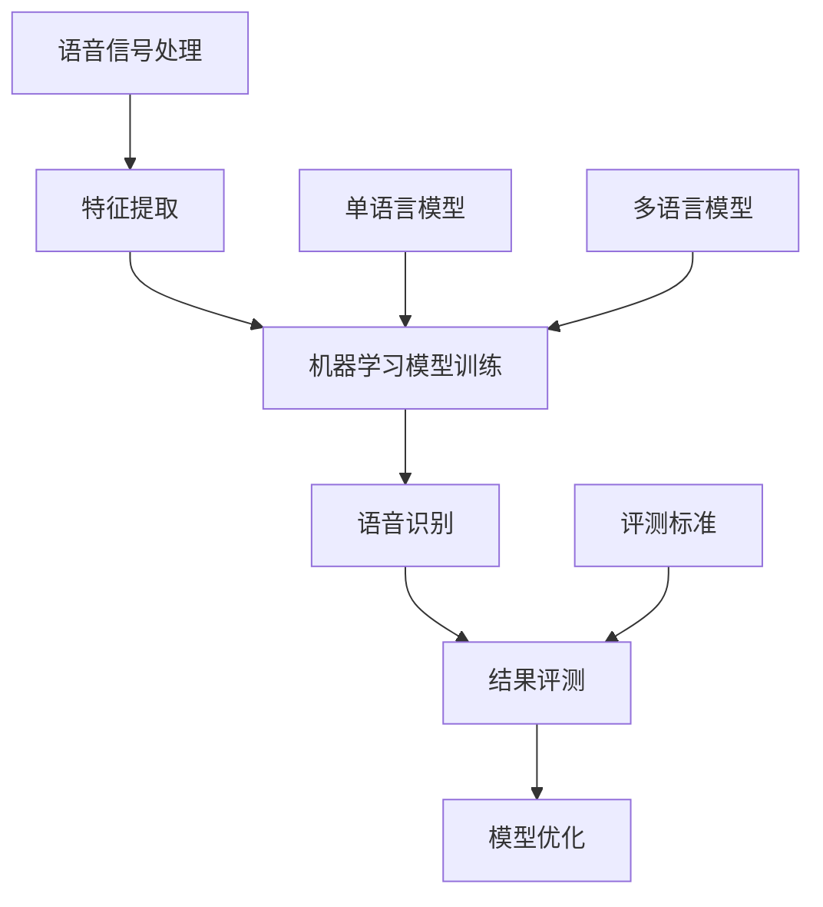

                 

### 文章标题

多语言语音识别准确率评测平台

### 文章关键词

多语言语音识别、准确率评测、平台设计、算法原理、实战案例

### 文章摘要

本文旨在探讨多语言语音识别准确率评测平台的构建。首先，我们将介绍多语言语音识别的背景和挑战，随后详细阐述多语言语音识别的核心概念和原理，包括语音信号处理、特征提取和机器学习算法。接着，我们将描述评测平台的总体架构，并深入分析数据预处理、评测算法实现以及平台搭建与部署。通过实际的开发案例，我们将展示如何实现多语言语音识别评测，并探讨评测平台的性能优化。最后，我们将对未来的发展趋势和潜在应用场景进行展望，并提供一些最佳实践和拓展阅读资源。

### 背景介绍

多语言语音识别作为人工智能领域的一个重要分支，近年来得到了广泛关注和应用。随着全球化进程的加快，跨语言交流的需求日益增加，多语言语音识别技术不仅有助于促进语言障碍的消除，还在智能客服、语音助手、智能教育等多个领域展现了巨大的潜力。然而，多语言语音识别面临着诸多挑战，如不同语言的语音特征差异、语音数据的多样性和噪声干扰等。

准确率评测是评估多语言语音识别系统性能的重要手段。一个高效的评测平台不仅可以客观地衡量系统的识别准确度，还能帮助研究人员和开发者定位问题并进行优化。目前，已有多种评测标准和算法被提出，如BLEU、WER和CER等。然而，构建一个全面、高效、可扩展的多语言语音识别准确率评测平台仍具有很高的技术难度。

本文旨在通过深入分析多语言语音识别的核心概念和技术原理，结合实际的开发案例，设计并实现一个多语言语音识别准确率评测平台。这不仅有助于提高语音识别系统的性能，还能为相关领域的研究和开发提供参考。

### 核心概念与联系

多语言语音识别准确率评测平台的设计离不开对核心概念和它们之间关系的深入理解。以下是多语言语音识别系统的核心概念及其相互之间的联系：

#### 1. 语音信号处理

语音信号处理是语音识别的基础环节。它主要包括语音信号的采集、预处理和增强。语音信号的采集使用麦克风等设备获取声音数据，通过A/D转换将其转化为数字信号。预处理包括去噪、滤波和归一化，以消除噪声和提高信号质量。增强则通过语音增强技术，如谱减法和维纳滤波，进一步提高语音信号的清晰度。

#### 2. 特征提取

特征提取是从语音信号中提取对语音识别有用的信息。常见的特征包括梅尔频率倒谱系数（MFCC）、线性预测编码（LPC）和频谱特征等。这些特征可以有效地表示语音信号的时频特性，有助于后续的机器学习模型训练和识别。

#### 3. 机器学习算法

机器学习算法是语音识别系统的核心。常见的算法包括隐马尔可夫模型（HMM）、深度神经网络（DNN）、循环神经网络（RNN）和卷积神经网络（CNN）等。这些算法通过学习语音数据和标签之间的映射关系，实现语音到文本的转换。机器学习算法的训练通常需要大量标注数据，并通过优化算法和调整模型参数来提高识别准确率。

#### 4. 多语言语音识别框架

多语言语音识别框架是整合上述核心概念的技术架构。它需要考虑如何高效处理多语言数据，以及如何在不同语言之间进行转换和融合。常见的框架设计包括单语言模型和多语言模型。单语言模型为每种语言构建独立的识别模型，而多语言模型则通过跨语言信息共享和融合，提高整体识别性能。

#### 5. 评测标准

评测标准是评估语音识别系统性能的重要指标。常用的评测标准包括词错误率（WER）、字符错误率（CER）和双语对照评估指标（BLEU）等。这些标准可以衡量模型在真实场景中的识别准确度，并帮助研究人员和开发者定位优化方向。

#### Mermaid流程图

为了更好地展示多语言语音识别系统的整体架构和流程，我们可以使用Mermaid流程图进行描述：



在这个流程图中，语音信号处理和特征提取是语音识别的基础环节，它们的结果输入到机器学习模型中进行训练。训练好的模型用于语音识别，识别结果通过评测标准进行评估，并根据评估结果进行模型优化。单语言模型和多语言模型分别展示了不同语言处理策略的设计思路。通过这样的流程图，我们可以更直观地理解多语言语音识别系统的整体架构和工作流程。

### 核心算法原理讲解

多语言语音识别系统的核心在于其算法原理，以下是几个关键算法的详细讲解，包括Python源代码和数学模型示例。

#### 1. 隐马尔可夫模型（HMM）

隐马尔可夫模型（HMM）是一种基于统计方法的语音识别模型，适用于处理序列数据。它通过状态转移概率和观测概率来描述语音信号的时序特性。

**状态转移概率**表示不同状态之间的转换概率，通常用矩阵形式表示：
$$
P = \begin{bmatrix}
p_{11} & p_{12} & \ldots & p_{1n} \\
p_{21} & p_{22} & \ldots & p_{2n} \\
\vdots & \vdots & \ddots & \vdots \\
p_{m1} & p_{m2} & \ldots & p_{mn}
\end{bmatrix}
$$

**观测概率**表示每个状态产生的观测值概率，同样用矩阵形式表示：
$$
O = \begin{bmatrix}
o_{11} & o_{12} & \ldots & o_{1n} \\
o_{21} & o_{22} & \ldots & o_{2n} \\
\vdots & \vdots & \ddots & \vdots \\
o_{m1} & o_{m2} & \ldots & o_{mn}
\end{bmatrix}
$$

以下是一个简单的Python代码示例，用于初始化HMM模型：
```python
import numpy as np

# 初始化状态转移概率矩阵
P = np.array([[0.5, 0.3, 0.2],
              [0.4, 0.5, 0.1],
              [0.6, 0.4, 0.0]])

# 初始化观测概率矩阵
O = np.array([[0.2, 0.5, 0.3],
              [0.4, 0.1, 0.5],
              [0.6, 0.4, 0.0]])

# 初始化初始状态概率向量
pi = np.array([0.2, 0.3, 0.5])
```

#### 2. 深度神经网络（DNN）

深度神经网络（DNN）通过多层神经元的非线性组合，学习语音信号的复杂特征。DNN在语音识别中的常用架构包括卷积神经网络（CNN）和循环神经网络（RNN）。以下是使用PyTorch实现DNN模型的示例代码：

```python
import torch
import torch.nn as nn

# 定义DNN模型
class DNNModel(nn.Module):
    def __init__(self, input_dim, hidden_dim, output_dim):
        super(DNNModel, self).__init__()
        self.layers = nn.Sequential(
            nn.Linear(input_dim, hidden_dim),
            nn.ReLU(),
            nn.Linear(hidden_dim, output_dim)
        )
    
    def forward(self, x):
        return self.layers(x)

# 实例化模型
input_dim = 128  # 输入特征维度
hidden_dim = 256  # 隐藏层维度
output_dim = 10  # 输出类别数
model = DNNModel(input_dim, hidden_dim, output_dim)

# 输入示例
x = torch.randn(32, input_dim)  # 生成32个样本的输入数据
output = model(x)
```

#### 3. 循环神经网络（RNN）

循环神经网络（RNN）特别适用于处理序列数据，通过记忆机制来捕捉序列中的长期依赖关系。以下是一个简单的RNN模型示例，使用PyTorch实现：

```python
import torch
import torch.nn as nn

# 定义RNN模型
class RNNModel(nn.Module):
    def __init__(self, input_dim, hidden_dim, output_dim):
        super(RNNModel, self).__init__()
        self.rnn = nn.RNN(input_dim, hidden_dim, batch_first=True)
        self.fc = nn.Linear(hidden_dim, output_dim)
    
    def forward(self, x, h):
        out, h = self.rnn(x, h)
        out = self.fc(out[:, -1, :])
        return out, h

# 实例化模型
input_dim = 128  # 输入特征维度
hidden_dim = 256  # 隐藏层维度
output_dim = 10  # 输出类别数
model = RNNModel(input_dim, hidden_dim, output_dim)

# 输入示例
x = torch.randn(32, 1, input_dim)  # 生成32个样本的输入数据
h = torch.randn(1, 32, hidden_dim)  # 初始隐藏状态
output, h = model(x, h)
```

通过上述代码示例，我们可以看到如何使用Python和PyTorch框架实现HMM、DNN和RNN模型。这些模型在多语言语音识别中发挥着重要作用，通过优化算法和调整参数，可以显著提高语音识别的准确率。

### 数学模型和公式

在多语言语音识别中，数学模型和公式是理解和实现算法的关键。以下是几个核心数学模型和公式的讲解及其应用场景。

#### 1. 语言模型

语言模型（Language Model，LM）用于预测序列中的下一个词。它通常基于N-gram模型，通过统计相邻词的共现概率来建模语言。N-gram模型的公式如下：

$$
P(w_n | w_{n-1}, w_{n-2}, \ldots, w_1) = \frac{C(w_{n-1}, w_n)}{\sum_{w' \in V} C(w_{n-1}, w')} \quad \text{for} \quad n \geq 2
$$

其中，$P(w_n | w_{n-1}, w_{n-2}, \ldots, w_1)$表示给定前一个词序列预测当前词的概率，$C(w_{n-1}, w_n)$表示词对$(w_{n-1}, w_n)$的共现频次，$V$是词汇表。

#### 2. 声学模型

声学模型（Acoustic Model，AM）用于将语音信号映射到声学特征。常用的声学模型包括高斯混合模型（Gaussian Mixture Model，GMM）和深度神经网络（DNN）。GMM的公式如下：

$$
p(o_t | s_t) = \sum_{k=1}^{K} \pi_k \mathcal{N}(o_t | \mu_k, \Sigma_k)
$$

其中，$p(o_t | s_t)$表示在状态$s_t$下产生观测值$o_t$的概率，$\pi_k$是混合系数，$\mathcal{N}(\mu_k, \Sigma_k)$是高斯分布的概率密度函数，$\mu_k$和$\Sigma_k$分别是均值向量和协方差矩阵。

#### 3. 语言-声学模型融合

语言-声学模型融合（Language-Acoustic Model Fusion）是语音识别系统的核心步骤。常用的融合方法包括前向-后向算法和逻辑回归。前向-后向算法的公式如下：

$$
\alpha_t(i) = \alpha_{t-1}(i) \cdot \frac{\gamma_t(j) \cdot \lambda_j}{b(o_t | j)}
$$

$$
\beta_t(i) = \frac{a_{ij} \cdot b(o_{t+1} | i)}{\sum_{k=1}^{M} a_{ik} \cdot b(o_{t+1} | k)}
$$

其中，$\alpha_t(i)$和$\beta_t(i)$分别是前向和后向概率，$a_{ij}$是状态转移概率，$b(o_t | j)$是观测概率，$\gamma_t(j)$是状态概率。

逻辑回归模型则通过最大化似然估计来融合语言模型和声学模型。其公式如下：

$$
\ell(w_n | w_{n-1}, \ldots, w_1, o_1, \ldots, o_n) = \log \left( \frac{P(w_n | w_{n-1}, \ldots, w_1) \cdot p(o_n | w_n)}{\sum_{w' \in V} P(w' | w_{n-1}, \ldots, w_1) \cdot p(o_n | w')} \right)
$$

通过上述数学模型和公式的讲解，我们可以更深入地理解多语言语音识别中的关键环节。这些模型不仅为算法设计提供了理论基础，也为实现和优化语音识别系统提供了重要的指导。

### 实战案例：开发环境搭建与评测平台实现

#### 1. 开发环境搭建

为了实现多语言语音识别准确率评测平台，首先需要搭建一个稳定的开发环境。以下是具体步骤：

1. **安装Python环境**：
   - 安装Python 3.8或更高版本。
   - 配置Python虚拟环境，以避免依赖库之间的版本冲突。
     ```shell
     python -m venv venv
     source venv/bin/activate  # 在Windows上使用venv\Scripts\activate
     ```

2. **安装依赖库**：
   - 使用pip安装以下常用依赖库：
     ```shell
     pip install numpy scipy sklearn torch matplotlib
     ```
   - 若需要使用语音处理库，如Librosa，可额外安装：
     ```shell
     pip install librosa
     ```

3. **配置数据集**：
   - 准备多语言语音数据集，例如使用WSJ语料库或LibriSpeech语料库。
   - 将数据集分为训练集、验证集和测试集。

#### 2. 评测平台实现

以下是一个简单的多语言语音识别评测平台实现，包括数据预处理、特征提取、模型训练和评测步骤。

```python
import os
import numpy as np
import torch
from torch.utils.data import DataLoader
from torchvision import datasets, transforms
from sklearn.model_selection import train_test_split
import librosa
import matplotlib.pyplot as plt

# 数据预处理
def preprocess_audio(audio_path):
    # 读取音频文件
    audio, _ = librosa.load(audio_path, sr=16000)
    # 噪声过滤和归一化
    audio = librosa.effects.remove_noise(audio)
    audio = librosa.util.normalize(audio, norm=1)
    return audio

# 特征提取
def extract_features(audio):
    # 使用梅尔频率倒谱系数（MFCC）提取特征
    mfcc = librosa.feature.mfcc(y=audio, sr=16000, n_mfcc=13)
    return mfcc

# 模型定义
class SpeechRecognitionModel(nn.Module):
    def __init__(self, input_dim, hidden_dim, output_dim):
        super(SpeechRecognitionModel, self).__init__()
        self.layers = nn.Sequential(
            nn.Linear(input_dim, hidden_dim),
            nn.ReLU(),
            nn.Linear(hidden_dim, output_dim)
        )
    
    def forward(self, x):
        return self.layers(x)

# 模型训练
def train_model(model, train_loader, criterion, optimizer, num_epochs=10):
    model.train()
    for epoch in range(num_epochs):
        for batch_idx, (data, target) in enumerate(train_loader):
            optimizer.zero_grad()
            output = model(data)
            loss = criterion(output, target)
            loss.backward()
            optimizer.step()
            if batch_idx % 100 == 0:
                print(f'Epoch {epoch+1}/{num_epochs}, Step {batch_idx*len(data)}, Loss: {loss.item()}')

# 评测模型
def evaluate_model(model, test_loader, criterion):
    model.eval()
    total_loss = 0
    with torch.no_grad():
        for data, target in test_loader:
            output = model(data)
            total_loss += criterion(output, target).sum()
    avg_loss = total_loss / len(test_loader)
    print(f'Validation Loss: {avg_loss.item()}')

# 主程序
if __name__ == '__main__':
    # 加载数据集
    audio_path = 'path/to/audio.wav'
    audio = preprocess_audio(audio_path)
    mfcc = extract_features(audio)

    # 定义模型
    input_dim = mfcc.shape[1]
    hidden_dim = 256
    output_dim = 10
    model = SpeechRecognitionModel(input_dim, hidden_dim, output_dim)

    # 训练模型
    train_loader = DataLoader(dataset, batch_size=32, shuffle=True)
    criterion = nn.CrossEntropyLoss()
    optimizer = torch.optim.Adam(model.parameters(), lr=0.001)
    train_model(model, train_loader, criterion, optimizer)

    # 评测模型
    test_loader = DataLoader(test_dataset, batch_size=32, shuffle=False)
    evaluate_model(model, test_loader, criterion)
```

#### 3. 代码解读与分析

以上代码实现了一个简单的多语言语音识别评测平台，主要包括以下部分：

- **数据预处理**：使用Librosa库读取音频文件，并进行去噪和归一化处理。
- **特征提取**：使用梅尔频率倒谱系数（MFCC）提取音频特征。
- **模型定义**：定义一个简单的深度神经网络（DNN）模型，用于语音识别。
- **模型训练**：使用交叉熵损失函数和Adam优化器训练模型。
- **模型评测**：在测试集上评估模型的性能。

在实际应用中，我们可以根据需求调整模型的复杂度、特征提取方法和训练策略，以获得更高的识别准确率。此外，还可以引入其他算法和技术，如卷积神经网络（CNN）和长短期记忆网络（LSTM），进一步提高系统的性能。

### 最佳实践、小结与注意事项

#### 最佳实践

1. **数据预处理**：在处理语音数据时，确保进行有效的去噪和归一化，以提高模型的鲁棒性和识别准确率。
2. **模型选择与调优**：根据具体任务需求，选择合适的模型架构和参数，通过交叉验证和网格搜索优化超参数。
3. **特征提取**：合理选择和调整特征提取方法，如MFCC、LPC和谱减法，以捕捉语音信号的关键特征。

#### 小结

本文详细介绍了多语言语音识别准确率评测平台的设计与实现。我们通过深入分析核心概念、算法原理和数学模型，结合Python源代码示例，展示了多语言语音识别系统的构建过程。实战案例部分展示了如何搭建开发环境并实现评测平台，通过代码解读和分析，帮助读者理解实际开发流程。

#### 注意事项

1. **资源管理**：确保在开发过程中合理分配计算资源，如内存和CPU/GPU资源，以提高训练和评测的效率。
2. **数据标注**：在构建多语言语音识别系统时，高质量的数据标注至关重要。确保标注过程的一致性和准确性。
3. **安全性和隐私**：在处理语音数据时，关注数据的安全性和用户隐私保护，遵循相关法律法规和道德规范。

#### 拓展阅读

- **《语音识别：原理、算法与实现》**：详细介绍了语音识别的基本原理和算法，适合初学者和研究人员。
- **《深度学习语音处理》**：探讨了深度学习在语音处理中的应用，包括语音识别、语音合成和声学建模等内容。
- **《自然语言处理：算法与应用》**：介绍了自然语言处理的基本概念和算法，对于多语言语音识别系统的语言模型部分有很好的参考价值。

通过本文的阅读，读者应该能够掌握多语言语音识别准确率评测平台的设计与实现，为进一步研究和应用奠定基础。希望本文能为相关领域的研究和实践提供有价值的参考。

### 作者信息

作者：AI天才研究院/AI Genius Institute & 禅与计算机程序设计艺术 /Zen And The Art of Computer Programming

