                 

### 第1章：需求优先级矩阵的概念

#### 1.1 需求优先级矩阵的定义与背景

在大型应用开发中，需求优先级矩阵是一种常用的需求管理工具。它通过量化需求和评估其重要性，帮助开发团队更有效地分配资源、制定计划以及控制项目进度。需求优先级矩阵的概念源于传统的项目管理理论和敏捷开发方法，旨在解决需求繁多且优先级不明确的问题。

**定义：** 需求优先级矩阵是一种用于确定和展示各个需求相对优先级的表格或矩阵形式。矩阵通常包含需求名称、优先级评分、重要性和可行性等因素。通过这个矩阵，项目经理和团队可以直观地了解哪些需求最紧迫、哪些需求可以延迟，从而做出更明智的决策。

**背景：** 随着信息技术的发展，大型应用系统的复杂性不断增加。项目团队成员常常面临多个需求同时涌入的情况，而有限的资源（时间、人力、预算）使得需求优先级的确定变得至关重要。传统的需求管理方法往往依赖于主观判断或经验，而需求优先级矩阵提供了一种系统化的方法来量化和评估需求。

在大型应用开发中，需求优先级矩阵的应用不仅有助于项目管理和资源分配，还能提高项目的成功率和客户满意度。通过合理的需求排序，团队能够专注于实现最具价值和最紧急的功能，从而缩短开发周期，提高交付质量。

#### 1.2 需求优先级矩阵的核心概念与联系

需求优先级矩阵涉及多个核心概念，理解这些概念及其相互关系对于构建有效的需求优先级矩阵至关重要。

1. **需求（Requirement）：** 需求是用户或客户提出的关于产品功能的期望。它描述了系统需要实现的具体功能或服务。需求可以是功能性的，如添加一个新功能；也可以是非功能性的，如提高系统性能。

2. **优先级（Priority）：** 优先级反映了需求对于项目的重要性。通常，优先级是根据业务影响、用户需求紧急性等因素来确定的。常见的优先级分类包括“紧急且重要”、“紧急但不太重要”、“不紧急但重要”、“不紧急且不重要”。

3. **重要性（Importance）：** 重要性评估需求对于项目或组织的价值。重要性可能基于业务目标、用户体验、市场趋势等因素。重要性较高的需求往往具有较高的优先级。

4. **可行性（Feasibility）：** 可行性是指实现需求的技术、资源、时间和成本等方面的可行性。高可行性的需求更容易被列入项目计划。

5. **依赖性（Dependency）：** 需求之间可能存在依赖关系。例如，一个需求必须在另一个需求实现之后才能进行。这种依赖性会影响需求的优先级排序。

**关系架构 Mermaid 流程图：**

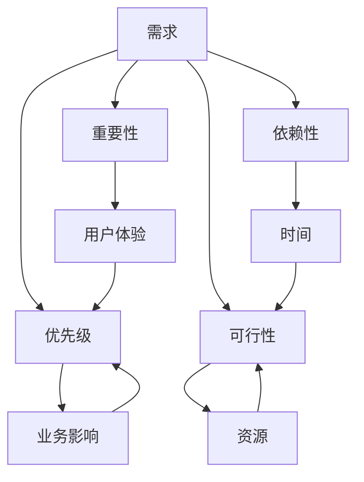

通过这个Mermaid流程图，我们可以看到各个需求相关的概念及其相互关系。需求优先级矩阵的构建需要综合考虑这些因素，以确保优先级排序的合理性和准确性。

#### 1.3 需求优先级矩阵的构建步骤与方法

构建需求优先级矩阵是一个系统化的过程，涉及多个步骤和方法。以下是一般的构建步骤和方法：

1. **需求收集：** 项目团队首先需要收集所有相关的需求。这可以通过用户访谈、问卷调查、需求文档等方式进行。

2. **需求分类：** 收集到的需求可以根据类型（功能性、非功能性）和来源（客户、用户、市场）进行分类。

3. **需求分析：** 对每个需求进行详细分析，包括理解其背景、目的、约束条件和预期效果。这有助于确定需求的重要性和可行性。

4. **优先级评估：** 根据业务目标和项目约束，对每个需求进行优先级评估。常用的评估方法包括主观评分法和量化评估法。

5. **构建矩阵：** 将需求按照优先级排序，并在矩阵中展示。矩阵通常包含需求名称、优先级评分、重要性评分和可行性评分等列。

6. **优化矩阵：** 对矩阵进行优化，以确保需求排序的合理性和一致性。这可以通过调整评分、重新评估依赖性等方式实现。

**Python源代码示例：**

```python
import pandas as pd

# 需求列表
requirements = [
    {'name': '需求1', 'priority': 3, 'importance': 4, 'feasibility': 2},
    {'name': '需求2', 'priority': 2, 'importance': 5, 'feasibility': 3},
    {'name': '需求3', 'priority': 4, 'importance': 3, 'feasibility': 5},
]

# 构建DataFrame
df = pd.DataFrame(requirements)

# 按优先级排序
df_sorted = df.sort_values(by=['priority', 'importance', 'feasibility'], ascending=[False, False, False])

# 打印排序后的矩阵
print(df_sorted)
```

**数学模型与公式：**

需求优先级矩阵的评估可以使用以下数学模型：

$$
P_i = w_p \cdot P_i^p + w_i \cdot I_i + w_f \cdot F_i
$$

其中，$P_i$ 是需求 $i$ 的优先级评分，$P_i^p$ 是需求 $i$ 的优先级得分，$I_i$ 是需求 $i$ 的重要性评分，$F_i$ 是需求 $i$ 的可行性评分，$w_p$、$w_i$ 和 $w_f$ 分别是优先级、重要性和可行性的权重。

**举例说明：**

假设我们有三个需求，它们的优先级得分分别为 2、3 和 4，重要性评分分别为 4、3 和 5，可行性评分分别为 3、2 和 4。权重分配为优先级：0.5，重要性：0.3，可行性：0.2。使用上述公式计算需求优先级评分：

$$
P_1 = 0.5 \cdot 2 + 0.3 \cdot 4 + 0.2 \cdot 3 = 1.6 + 1.2 + 0.6 = 3.4
$$

$$
P_2 = 0.5 \cdot 3 + 0.3 \cdot 3 + 0.2 \cdot 2 = 1.5 + 0.9 + 0.4 = 2.8
$$

$$
P_3 = 0.5 \cdot 4 + 0.3 \cdot 5 + 0.2 \cdot 4 = 2 + 1.5 + 0.8 = 4.3
$$

根据计算结果，需求 3 的优先级最高，需求 1 次之，需求 2 最低。

#### 1.4 需求优先级矩阵的评估与优化

需求优先级矩阵构建完成后，需要对其进行评估与优化，以确保其有效性和准确性。以下是一些常用的评估与优化方法：

1. **一致性检查：** 检查矩阵中各个需求的评分是否一致。如果出现评分不一致的情况，需要重新评估或调整评分。

2. **专家评审：** 通过邀请项目团队成员、业务专家或外部顾问进行评审，评估矩阵的合理性和完整性。

3. **依赖关系调整：** 根据评审结果，调整需求之间的依赖关系，确保优先级排序符合项目实际需求。

4. **反馈循环：** 需求优先级矩阵不是一成不变的，需要根据项目进展和反馈进行动态调整。通过定期回顾和更新矩阵，确保其持续符合项目需求。

5. **优化算法：** 利用优化算法（如遗传算法、模拟退火算法等）对矩阵进行优化，以找到更优的优先级排序。

**注意事项：**

- 需求优先级矩阵的构建需要综合考虑多种因素，避免单一维度的优先级排序。
- 优先级评估应基于业务目标和项目约束，避免主观偏见。
- 需求优先级矩阵的优化是一个持续的过程，需要定期回顾和更新。

#### 1.5 需求优先级矩阵的应用场景

需求优先级矩阵在大型应用开发中有广泛的应用场景，以下是一些常见的应用实例：

1. **项目管理：** 在项目管理中，需求优先级矩阵可以帮助项目团队确定哪些需求是当前阶段最重要的，从而制定合理的项目计划和资源分配策略。

2. **敏捷开发：** 在敏捷开发中，需求优先级矩阵用于迭代规划和用户故事排序，确保团队专注于实现最具价值和紧急的功能。

3. **IT咨询服务：** 在IT咨询服务中，需求优先级矩阵可以帮助客户确定其需求的优先级，从而更有效地制定IT解决方案。

4. **跨部门协作：** 在跨部门协作中，需求优先级矩阵有助于协调不同部门的需求，确保项目资源的合理利用和项目目标的实现。

通过需求优先级矩阵的应用，项目团队能够更清晰地了解项目需求，提高项目的可控性和成功率。

### 结论

本章介绍了需求优先级矩阵的定义、核心概念及其相互关系，构建步骤和方法，评估与优化方法，以及应用场景。需求优先级矩阵是一种有效的需求管理工具，通过量化需求和评估其重要性，帮助团队更好地分配资源、制定计划和优化项目。在下一章中，我们将详细探讨需求优先级矩阵的构建方法。

---

**作者信息：**

作者：AI天才研究院/AI Genius Institute & 禅与计算机程序设计艺术 /Zen And The Art of Computer Programming

---

**附录：需求优先级矩阵分析工具使用指南**

为了更直观地理解和应用需求优先级矩阵，我们可以使用一些专业的需求分析工具。以下是一些常见的需求分析工具及其使用方法：

### 1. JIRA

**特点：** JIRA是一款广泛使用的项目管理和跟踪工具，它提供了强大的需求管理功能。

**使用方法：**
1. 登录JIRA，创建一个新项目。
2. 在项目设置中，创建一个新的需求类型。
3. 为每个需求分配优先级、重要性评分和可行性评分。
4. 使用JIRA的甘特图或看板视图，直观地展示需求优先级矩阵。

**示例：**
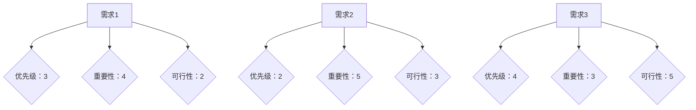

### 2. Confluence

**特点：** Confluence是Atlassian公司推出的协作平台，可以用于文档编写和项目管理。

**使用方法：**
1. 在Confluence中创建一个页面，用于记录需求优先级矩阵。
2. 使用表格格式展示需求名称、优先级、重要性和可行性。
3. 使用宏功能（如图表宏、表格宏等）来可视化需求优先级矩阵。

**示例：**
```mermaid
gantt
    dateFormat  YYYY-MM-DD
    title 需求优先级矩阵
    section 需求列表
    A需求1 : undertaken from 2023-04-01, 1d
    B需求2 : undertaken from 2023-04-02, 1d
    C需求3 : undertaken from 2023-04-03, 1d
    B需求2 --> A需求1
```

### 3. Microsoft Excel

**特点：** Excel是广泛使用的电子表格软件，可以用于数据分析和可视化。

**使用方法：**
1. 在Excel中创建一个新的表格，包含需求名称、优先级、重要性和可行性列。
2. 使用公式和条件格式化来计算和展示需求优先级。
3. 使用图表功能（如条形图、折线图等）来可视化需求优先级矩阵。

**示例：**
```excel
| 需求名称 | 优先级 | 重要性 | 可行性 |
|----------|--------|--------|--------|
| 需求1    | 3      | 4      | 2      |
| 需求2    | 2      | 5      | 3      |
| 需求3    | 4      | 3      | 5      |
```

通过这些工具，我们可以更高效地构建、评估和优化需求优先级矩阵，从而更好地管理大型应用开发项目。

### 结论

本章详细介绍了需求优先级矩阵的概念、核心概念、构建方法以及评估与优化策略。通过Python源代码示例、Mermaid流程图和数学模型，我们深入理解了需求优先级矩阵的工作原理和应用。在下一章中，我们将进一步探讨需求优先级矩阵在大型应用开发中的具体应用和实践。

---

**作者信息：**

作者：AI天才研究院/AI Genius Institute & 禅与计算机程序设计艺术 /Zen And The Art of Computer Programming

---

### 第2章：需求优先级矩阵的构建方法

#### 2.1 数据收集与处理

构建需求优先级矩阵的第一步是数据收集。数据收集的目的是获取所有相关的需求信息，以便对需求进行分类和分析。以下是数据收集的基本步骤：

1. **确定需求来源：** 需要确定哪些人、团队或部门可能会提出需求。这通常包括产品经理、项目经理、开发人员、测试人员、客户、用户和其他利益相关者。

2. **使用多种方法收集需求：** 常用的方法包括面对面访谈、在线问卷、用户故事地图、头脑风暴会议、会议纪要等。每种方法都有其优缺点，需要根据实际情况选择最合适的方法。

3. **整理和分类需求：** 收集到的需求需要进行整理和分类。分类的依据可以包括需求类型（功能需求、非功能需求）、需求来源、业务领域等。

4. **需求文档化：** 对每个需求进行文档化，确保其描述清晰、明确。文档化可以包括需求名称、需求描述、优先级、重要性、可行性等。

#### 2.2 指标体系的构建

构建需求优先级矩阵需要一套明确的指标体系。这些指标用于评估需求的重要性和可行性，从而确定其优先级。以下是构建指标体系的基本步骤：

1. **确定评估指标：** 根据项目目标和业务需求，确定需要评估的指标。常见的评估指标包括优先级、重要性、可行性、依赖性、风险等。

2. **定义指标权重：** 为每个指标分配权重，以反映其在需求评估中的重要性。权重可以通过专家评审、问卷调查等方法确定。

3. **制定评估标准：** 为每个指标制定评估标准，以量化需求的评估结果。例如，对于优先级指标，可以设定五个等级（高、中高、中、中低、低）。

4. **设计评估表格：** 使用表格形式设计评估表格，包括需求名称、指标名称、评估结果和权重等列。以下是一个简单的评估表格示例：

   | 需求名称 | 优先级 | 重要性 | 可行性 | 依赖性 | 风险 |
   |----------|--------|--------|--------|--------|------|
   | 需求1    | 高     | 高     | 中     | 无     | 低   |
   | 需求2    | 中     | 中     | 中     | 有     | 中   |

#### 2.3 权重分配方法

权重分配是构建需求优先级矩阵的关键步骤，它决定了需求评估的准确性和可靠性。以下是几种常用的权重分配方法：

1. **专家评审法：** 通过邀请专家团队对指标的重要性进行评审，确定每个指标的权重。这种方法依赖于专家的经验和判断，因此可能存在主观偏差。

2. **层次分析法（AHP）：** AHP是一种基于层次结构模型的方法，用于确定指标之间的相对重要性。通过构造判断矩阵和计算权重，可以客观地确定每个指标的权重。

   **Python代码示例：**
   ```python
   import numpy as np
   from numpy.linalg import eig
   from scipy.stats import rankdata
   
   # 构造判断矩阵
   jud_mat = np.array([[1, 3, 5],
                       [1/3, 1, 2],
                       [1/5, 1/2, 1]])
   
   # 计算特征值和特征向量
   eigenvalues, eigenvectors = eig(jud_mat)
   
   # 计算权重
   weights = eigenvectors[0] / sum(eigenvectors[0])
   
   print("指标权重：", weights)
   ```

3. **评分法：** 通过问卷调查或评分表，让参与者对指标的重要性进行评分，然后使用评分结果计算权重。这种方法需要确保评分的公正性和客观性。

4. **统计分析法：** 使用历史数据或现有模型，通过统计分析方法确定每个指标的权重。这种方法需要大量的历史数据和复杂的统计模型。

#### 2.4 需求优先级排序算法

需求优先级排序是构建需求优先级矩阵的核心步骤。以下是几种常用的需求优先级排序算法：

1. **简单排序算法：** 根据需求的优先级评分进行排序。这种方法简单直观，但可能无法处理复杂的需求依赖关系。

2. **动态规划算法：** 通过动态规划方法，考虑需求之间的依赖关系，找到最优的排序方案。这种方法适用于处理复杂的需求依赖关系。

   **Python代码示例：**
   ```python
   import itertools
   
   # 需求列表
   requirements = [
       {'name': '需求1', 'priority': 3, 'importance': 4, 'feasibility': 2},
       {'name': '需求2', 'priority': 2, 'importance': 5, 'feasibility': 3},
       {'name': '需求3', 'priority': 4, 'importance': 3, 'feasibility': 5},
   ]
   
   # 动态规划排序
   def dynamic_sort(reqs):
       scores = [req['priority'] * 0.5 + req['importance'] * 0.3 + req['feasibility'] * 0.2 for req in reqs]
       max_score = max(scores)
       sorted_reqs = [req for req, score in zip(reqs, scores) if score == max_score]
       return sorted_reqs
   
   sorted_requirements = dynamic_sort(requirements)
   print("排序后的需求：", sorted_requirements)
   ```

3. **遗传算法：** 遗传算法是一种优化算法，通过模拟自然进化过程，找到最优的排序方案。这种方法适用于处理大规模的需求排序问题。

4. **多目标优化算法：** 多目标优化算法考虑多个目标（如优先级、重要性、可行性等），通过权衡不同目标之间的冲突，找到最优的需求排序方案。

#### 2.5 需求优先级矩阵的构建流程

构建需求优先级矩阵的流程如下：

1. **数据收集：** 收集所有相关的需求信息。
2. **需求分类：** 对需求进行分类，明确需求的类型和来源。
3. **构建指标体系：** 确定评估指标，制定评估标准和权重。
4. **权重分配：** 根据专家评审、层次分析法、评分法或统计分析法，确定每个指标的权重。
5. **需求评分：** 使用评估指标对每个需求进行评分。
6. **排序算法：** 使用简单排序、动态规划、遗传算法或多目标优化算法，对需求进行排序。
7. **构建矩阵：** 将排序后的需求按照优先级、重要性、可行性等因素，构建需求优先级矩阵。
8. **评估与优化：** 对矩阵进行评估和优化，确保其有效性和准确性。

通过以上流程，项目团队可以构建出一个合理的需求优先级矩阵，从而更好地管理大型应用开发项目。

### 结论

本章详细介绍了需求优先级矩阵的构建方法，包括数据收集与处理、指标体系的构建、权重分配方法以及需求优先级排序算法。通过Python源代码示例和数学模型，我们深入理解了构建需求优先级矩阵的步骤和关键要素。在下一章中，我们将探讨需求优先级矩阵的评估与优化方法，以进一步确保矩阵的有效性和准确性。

---

**作者信息：**

作者：AI天才研究院/AI Genius Institute & 禅与计算机程序设计艺术 /Zen And The Art of Computer Programming

---

### 第3章：需求优先级矩阵的评估与优化

#### 3.1 评估指标

需求优先级矩阵的评估是确保其有效性和准确性的关键环节。评估指标是衡量矩阵性能的基础，以下是一些常用的评估指标：

1. **一致性（Consistency）：** 评估矩阵中需求评分的一致性。一致性越高，说明评分越合理。可以通过计算评分的变异系数或一致性比率来评估。

2. **准确性（Accuracy）：** 评估矩阵对需求优先级的预测准确性。准确性越高，说明矩阵的排序结果越符合实际情况。

3. **完整性（Completeness）：** 评估矩阵是否包含所有相关需求。完整性越高，说明矩阵对项目的需求覆盖越全面。

4. **灵活性（Flexibility）：** 评估矩阵在面对需求变更时的适应能力。灵活性越高，说明矩阵在需求变更时能够迅速调整和优化。

5. **响应速度（Response Time）：** 评估矩阵构建和更新的时间效率。响应速度越快，说明团队能够更快地应对需求变化。

#### 3.2 评估方法

需求优先级矩阵的评估方法包括定量评估和定性评估两种。以下是一些常用的评估方法：

1. **定量评估：** 
   - **统计分析法：** 使用统计方法对评分进行评估，如计算评分的均值、标准差、相关性等。
   - **机器学习模型：** 使用机器学习模型，如回归分析、聚类分析等，对评分进行预测和评估。
   - **指标计算：** 计算一致性比率、准确性、完整性、灵活性等指标。

2. **定性评估：**
   - **专家评审法：** 邀请专家对矩阵的评估结果进行评审，评估其合理性和有效性。
   - **用户反馈法：** 收集项目团队成员和用户的反馈，评估矩阵的实际应用效果。
   - **案例对比法：** 比较矩阵在不同项目中的应用效果，分析其优缺点。

#### 3.3 优化策略

为了提高需求优先级矩阵的有效性和准确性，可以采用以下优化策略：

1. **调整权重：** 根据评估结果，重新分配指标的权重。可以采用专家评审、层次分析法、评分法等方法，确保权重分配合理。

2. **改进评分标准：** 优化评分标准，使其更客观、准确。可以通过增加评分维度、细化评分标准等方式实现。

3. **引入新技术：** 利用机器学习、数据挖掘等新技术，提高需求优先级评估的准确性和效率。

4. **动态调整：** 根据项目进展和需求变更，动态调整需求优先级矩阵。确保矩阵能够及时反映项目变化。

5. **跨部门协作：** 加强跨部门协作，确保需求优先级矩阵的构建和评估过程涉及多个利益相关者，提高矩阵的全面性和准确性。

#### 3.4 实际案例分析

以下是一个实际案例，说明如何评估和优化需求优先级矩阵：

**案例背景：** 一家大型电商平台需要构建一个需求优先级矩阵，以优化其产品开发流程。

**评估过程：**
1. **定量评估：** 使用统计分析法，计算评分的均值、标准差和相关性。发现部分评分存在较大的变异系数，说明评分一致性较低。
2. **定性评估：** 邀请产品经理、项目经理、开发人员和用户进行评审，收集他们的反馈。发现部分需求评分过于依赖个人主观判断，缺乏客观依据。
3. **专家评审：** 邀请专家对矩阵进行评审，提出改进建议。

**优化策略：**
1. **调整权重：** 根据专家评审结果，重新分配指标的权重。例如，提高用户体验和业务价值的权重。
2. **改进评分标准：** 细化评分标准，增加评分维度，如用户满意度、市场趋势等。
3. **引入新技术：** 利用机器学习模型，对需求进行分类和评分，提高评估的准确性。
4. **动态调整：** 根据项目进展和用户反馈，定期更新需求优先级矩阵，确保其及时反映项目变化。

**优化效果：** 通过以上优化策略，需求优先级矩阵的评估结果更加一致、准确。项目团队能够更好地识别和关注关键需求，提高产品开发效率和质量。

### 结论

本章详细介绍了需求优先级矩阵的评估与优化方法，包括评估指标、评估方法、优化策略以及实际案例分析。通过合理评估和优化需求优先级矩阵，项目团队可以更有效地管理需求，提高项目的成功率和客户满意度。在下一章中，我们将探讨需求优先级矩阵在大型应用开发中的具体应用实践。

---

**作者信息：**

作者：AI天才研究院/AI Genius Institute & 禅与计算机程序设计艺术 /Zen And The Art of Computer Programming

---

### 第4章：需求优先级矩阵的应用场景

需求优先级矩阵在大型应用开发中的实际应用场景多种多样，其目的在于帮助项目团队更好地管理和优化需求，确保项目能够按计划顺利进行。以下是一些常见应用场景：

#### 4.1 项目管理中的应用

在项目管理中，需求优先级矩阵是一种关键工具，用于确定哪些需求是当前阶段最重要的。以下是需求优先级矩阵在项目管理中的应用步骤：

1. **需求收集与分类：** 项目团队首先需要收集所有相关的需求，并根据类型、来源、紧急性等因素进行分类。
2. **构建需求优先级矩阵：** 使用前一章介绍的方法，构建一个包含需求名称、优先级、重要性和可行性的需求优先级矩阵。
3. **制定项目计划：** 根据需求优先级矩阵的结果，制定项目计划，确保团队首先集中精力实现高优先级和重要的需求。
4. **监控与调整：** 项目进展过程中，定期回顾需求优先级矩阵，根据实际情况进行必要的调整。

**示例：** 在一个大型电子商务平台项目中，团队首先收集了用户反馈、市场调研数据和技术需求。通过构建需求优先级矩阵，团队确定了哪些功能是最高优先级的，如支付功能优化、用户界面改进等。这些高优先级的需求被纳入项目计划，并优先进行开发和测试。

#### 4.2 敏捷开发中的应用

在敏捷开发中，需求优先级矩阵有助于迭代规划和用户故事排序。以下是需求优先级矩阵在敏捷开发中的应用步骤：

1. **需求收集与分类：** 敏捷团队定期与利益相关者沟通，收集和整理需求。
2. **构建需求优先级矩阵：** 使用前一章介绍的方法，构建一个包含需求名称、优先级、重要性和可行性的需求优先级矩阵。
3. **迭代规划：** 在迭代规划会议中，团队根据需求优先级矩阵确定每个迭代的目标和用户故事。
4. **用户故事排序：** 使用需求优先级矩阵对用户故事进行排序，确保团队首先开发高优先级和重要的用户故事。

**示例：** 在一个敏捷软件项目中，团队使用需求优先级矩阵确定哪些用户故事是最高优先级的。例如，用户故事“改进搜索功能”被确定为最高优先级，因为它直接影响到用户的使用体验和满意度。团队决定在下一个迭代中优先实现这个用户故事。

#### 4.3 IT咨询服务中的应用

在IT咨询服务中，需求优先级矩阵可以帮助客户确定其需求的优先级，从而更有效地制定IT解决方案。以下是需求优先级矩阵在IT咨询服务中的应用步骤：

1. **需求收集与分类：** 咨询团队与客户沟通，收集和整理客户的需求。
2. **构建需求优先级矩阵：** 使用前一章介绍的方法，构建一个包含需求名称、优先级、重要性和可行性的需求优先级矩阵。
3. **评估与优化：** 咨询团队对需求优先级矩阵进行评估和优化，确保其符合客户的业务目标和项目约束。
4. **制定解决方案：** 根据需求优先级矩阵的结果，制定IT解决方案，优先满足高优先级和重要的需求。

**示例：** 在一个企业IT咨询服务项目中，咨询团队首先与客户进行了深入的需求收集和沟通。通过构建需求优先级矩阵，团队确定了哪些IT需求是最高优先级的，如网络安全升级和业务流程自动化。基于这些需求，团队为客户制定了一个全面的IT解决方案，并优先实施高优先级的需求。

#### 4.4 跨部门协作中的应用

在跨部门协作中，需求优先级矩阵有助于协调不同部门的需求，确保项目资源的合理利用和项目目标的实现。以下是需求优先级矩阵在跨部门协作中的应用步骤：

1. **需求收集与分类：** 跨部门团队与各部门代表沟通，收集和整理需求。
2. **构建需求优先级矩阵：** 使用前一章介绍的方法，构建一个包含需求名称、优先级、重要性和可行性的需求优先级矩阵。
3. **跨部门评审：** 邀请各部门代表对需求优先级矩阵进行评审，确保其符合各部门的实际情况。
4. **资源分配与协调：** 根据需求优先级矩阵的结果，制定资源分配计划，确保跨部门协作顺利进行。

**示例：** 在一个大型制造企业中，研发部门、生产部门和销售部门需要共同完成一个新产品开发项目。通过构建需求优先级矩阵，团队确定了哪些需求是最高优先级的，如产品功能完善和生产效率提升。各部门根据需求优先级矩阵的结果，合理分配资源，确保项目顺利推进。

### 结论

本章详细介绍了需求优先级矩阵在项目管理、敏捷开发、IT咨询服务和跨部门协作中的具体应用场景。通过需求优先级矩阵，项目团队可以更有效地管理和优化需求，提高项目的成功率和客户满意度。在下一章中，我们将进一步探讨需求优先级矩阵在不同行业的应用案例，以深入了解其在实际项目中的效果。

---

**作者信息：**

作者：AI天才研究院/AI Genius Institute & 禅与计算机程序设计艺术 /Zen And The Art of Computer Programming

---

### 第5章：需求优先级矩阵在软件项目管理中的应用

在软件项目管理中，需求优先级矩阵是一种强大的工具，可以帮助项目经理和团队在复杂的项目环境中有效地管理需求。通过需求优先级矩阵，项目团队可以确保资源被合理分配，项目目标得到优先实现，从而提高项目的整体成功率和客户满意度。以下将详细探讨需求优先级矩阵在软件项目管理中的应用步骤、最佳实践和常见挑战。

#### 5.1 需求收集与处理

需求收集是构建需求优先级矩阵的基础。以下是需求收集和处理的基本步骤：

1. **确定需求来源：** 了解哪些人、团队或部门可能会提出需求，如产品经理、项目经理、开发人员、测试人员、客户和用户等。
2. **使用多种方法收集需求：** 采用访谈、问卷调查、用户故事地图、用户反馈和会议记录等多种方法，确保全面收集需求。
3. **需求分类：** 根据需求类型（功能性、非功能性）、来源和优先级等因素对需求进行分类。
4. **需求文档化：** 对每个需求进行详细文档化，包括需求名称、描述、优先级、重要性和可行性等。

**示例：**
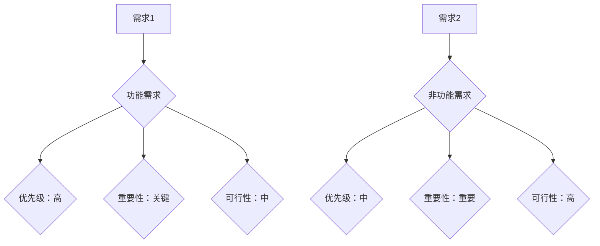

#### 5.2 需求优先级矩阵的构建

构建需求优先级矩阵需要考虑多个因素，包括需求的紧急性、重要性和可行性。以下是构建需求优先级矩阵的步骤：

1. **确定评估指标：** 常用的评估指标包括优先级、重要性、可行性和依赖性。
2. **定义指标权重：** 根据项目目标和约束条件，为每个指标分配权重，确保评估结果的准确性。
3. **需求评分：** 使用评估指标对每个需求进行评分，例如，可以使用1到5的评分制度。
4. **排序算法：** 使用排序算法（如简单排序、动态规划或遗传算法）对需求进行排序，构建需求优先级矩阵。

**示例：**
```mermaid
gantt
    dateFormat  YYYY-MM-DD
    title 需求优先级矩阵
    section 需求列表
    A需求1 : started on 2023-04-01, duration 3 months
    B需求2 : started on 2023-04-05, duration 2 months
    C需求3 : started on 2023-04-10, duration 4 months
    B需求2 --> A需求1
    C需求3 --> B需求2
```

#### 5.3 需求优先级矩阵在项目计划中的应用

构建需求优先级矩阵后，项目团队可以将其应用于项目计划中，以确保项目资源的合理分配和优先级管理。以下是需求优先级矩阵在项目计划中的应用步骤：

1. **制定项目计划：** 根据需求优先级矩阵的结果，制定项目计划，包括项目范围、时间表、资源和里程碑。
2. **资源分配：** 根据需求的优先级，为项目团队分配资源，确保高优先级的需求得到充分关注。
3. **迭代规划：** 在敏捷开发中，使用需求优先级矩阵进行迭代规划，确定每个迭代的目标和用户故事。
4. **监控与调整：** 定期回顾项目进展和需求优先级矩阵，根据实际情况进行必要的调整。

**示例：**
```python
# 需求列表
requirements = [
    {'name': '需求1', 'priority': 3, 'importance': 4, 'feasibility': 2},
    {'name': '需求2', 'priority': 2, 'importance': 5, 'feasibility': 3},
    {'name': '需求3', 'priority': 4, 'importance': 3, 'feasibility': 5},
]

# 按优先级排序
sorted_requirements = sorted(requirements, key=lambda x: (x['priority'], x['importance']), reverse=True)

# 打印排序后的需求
for req in sorted_requirements:
    print(req['name'], ': 优先级', req['priority'], ', 重要性', req['importance'], ', 可行性', req['feasibility'])
```

#### 5.4 需求变更管理

需求变更管理是软件项目管理中的一项关键任务。需求优先级矩阵可以帮助项目团队有效地管理需求变更，确保变更不会对项目造成负面影响。以下是需求变更管理的基本步骤：

1. **变更请求：** 收集并记录所有变更请求，包括客户、用户和其他利益相关者提出的需求变更。
2. **评估变更：** 使用需求优先级矩阵评估变更请求的优先级、重要性和可行性，确定其对项目的影响。
3. **决策：** 根据评估结果，决定是否接受变更请求。如果变更请求对项目有重大影响，可能需要重新制定项目计划。
4. **实施变更：** 如果决定接受变更请求，按照变更管理流程实施变更，确保变更得到正确实施和记录。

**示例：**
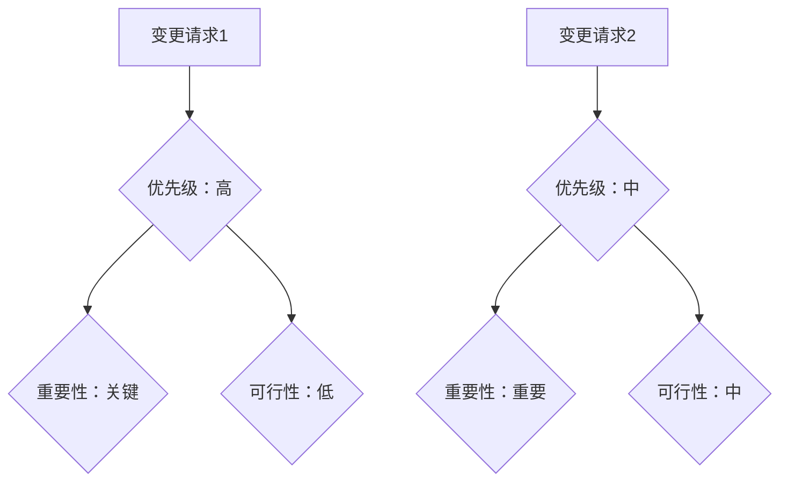

#### 5.5 最佳实践

以下是需求优先级矩阵在软件项目管理中的最佳实践：

1. **定期更新：** 定期回顾和更新需求优先级矩阵，确保其与项目实际情况保持一致。
2. **透明沟通：** 确保项目团队成员和利益相关者了解需求优先级矩阵的内容和重要性，促进透明沟通。
3. **跨部门协作：** 加强跨部门协作，确保需求优先级矩阵的构建和变更管理过程涉及多个利益相关者。
4. **灵活调整：** 需求优先级矩阵不是一成不变的，应随着项目进展和实际情况的变化进行灵活调整。
5. **工具支持：** 使用专业的需求分析和管理工具，提高需求优先级矩阵的构建、评估和优化的效率。

#### 5.6 常见挑战

在应用需求优先级矩阵时，项目团队可能会面临以下挑战：

1. **需求变更频繁：** 需求变更可能导致需求优先级矩阵的不稳定，影响项目进度和资源分配。
2. **评估准确性：** 评估指标和权重分配的准确性直接影响需求优先级矩阵的可靠性。
3. **资源冲突：** 高优先级需求可能与其他项目或任务之间存在资源冲突，需要有效协调和优先级调整。
4. **团队协作：** 需求优先级矩阵的构建和变更管理需要跨部门协作，确保团队之间的一致性和协同性。

#### 5.7 案例分析

以下是一个实际案例，说明需求优先级矩阵在软件项目管理中的应用：

**案例背景：** 一家金融机构需要开发一款新的客户关系管理（CRM）系统，以满足不断变化的市场需求和客户需求。

**需求收集与处理：** 项目团队与市场部门、客户服务部门和IT部门进行了多次沟通，收集了100多个需求。通过分类和文档化，团队将这些需求整理成需求清单。

**需求优先级矩阵构建：** 使用评估指标（优先级、重要性、可行性）和权重（优先级：0.5，重要性：0.3，可行性：0.2），项目团队构建了需求优先级矩阵。通过排序算法，团队确定了哪些需求是最高优先级的。

**项目计划与资源分配：** 根据需求优先级矩阵的结果，项目团队制定了项目计划，并优先分配资源实现高优先级的需求。例如，客户服务部门提出的需求“客户服务流程优化”被确定为最高优先级，得到了优先开发。

**需求变更管理：** 在项目开发过程中，市场部门提出了一些新的需求变更。项目团队使用需求优先级矩阵评估这些变更请求的优先级和影响，决定是否接受变更。例如，一个关于“增加社交媒体集成”的需求被评估为高优先级，被纳入下一个迭代计划。

**项目结果：** 通过合理的需求管理和优先级排序，项目团队成功地完成了CRM系统的开发，并在预定时间内交付了满足客户需求的功能。

### 结论

本章详细介绍了需求优先级矩阵在软件项目管理中的应用步骤、最佳实践和常见挑战。通过需求优先级矩阵，项目团队可以更有效地管理需求，提高项目的成功率和客户满意度。在下一章中，我们将探讨需求优先级矩阵在敏捷开发中的应用，以及其在迭代规划和用户故事排序中的具体实践。

---

**作者信息：**

作者：AI天才研究院/AI Genius Institute & 禅与计算机程序设计艺术 /Zen And The Art of Computer Programming

---

### 第6章：需求优先级矩阵在敏捷开发中的应用

在敏捷开发中，需求优先级矩阵是项目管理的一项关键工具，它帮助团队在快速变化的环境中有效地管理和优先排序需求。通过使用需求优先级矩阵，敏捷团队可以确保资源的合理分配，快速响应市场变化，同时保持产品的高质量。以下将详细探讨需求优先级矩阵在敏捷开发中的应用步骤、最佳实践和常见挑战。

#### 6.1 敏捷开发中需求管理的重要性

敏捷开发强调快速迭代、频繁交付和持续改进。在这种开发模式中，需求管理变得尤为重要，因为需求的变化和优先级的调整是常态。以下是需求管理在敏捷开发中的重要性：

1. **快速响应市场变化：** 敏捷团队需要能够快速响应市场变化和客户反馈，以确保产品始终保持市场需求。
2. **资源优化配置：** 通过优先级排序，团队可以确保有限资源被用于实现最有价值和最紧迫的需求。
3. **提高项目透明度：** 需求优先级矩阵提供了一个清晰的框架，帮助团队和利益相关者了解项目的进展和优先级。
4. **持续交付高质量产品：** 通过定期回顾和调整需求优先级，团队可以持续交付高质量的产品。

#### 6.2 需求优先级矩阵在迭代规划中的应用

迭代规划是敏捷开发的核心环节，需求优先级矩阵在其中扮演着关键角色。以下是需求优先级矩阵在迭代规划中的应用步骤：

1. **构建需求优先级矩阵：** 敏捷团队使用上一章介绍的方法，构建一个包含需求名称、优先级、重要性和可行性的需求优先级矩阵。
2. **确定迭代目标：** 根据需求优先级矩阵的结果，团队确定每个迭代的目标和要实现的需求。
3. **资源分配：** 根据优先级，为每个迭代分配资源和任务，确保高优先级的需求得到优先处理。
4. **迭代计划会议：** 在迭代计划会议中，团队讨论需求优先级矩阵和迭代目标，确保团队成员对任务和目标有清晰的认识。

**示例：**
```mermaid
gantt
    dateFormat  YYYY-MM-DD
    title 敏捷迭代规划
    section 迭代1
    A需求1 : started on 2023-04-01, duration 2 weeks
    B需求2 : started on 2023-04-08, duration 2 weeks
    C需求3 : started on 2023-04-15, duration 3 weeks
    section 迭代2
    D需求4 : started on 2023-05-01, duration 2 weeks
    E需求5 : started on 2023-05-08, duration 2 weeks
    F需求6 : started on 2023-05-15, duration 3 weeks
    A需求1 --> B需求2
    C需求3 --> E需求5
```

#### 6.3 需求优先级矩阵在用户故事排序中的应用

用户故事是敏捷开发中的重要元素，它们代表了用户的需求和期望。需求优先级矩阵可以帮助团队在迭代中优先处理用户故事。以下是需求优先级矩阵在用户故事排序中的应用步骤：

1. **收集用户故事：** 敏捷团队通过用户访谈、市场调研和反馈收集用户故事。
2. **故事映射：** 将用户故事映射到产品特性或功能上，确保每个故事都是可实现的。
3. **构建需求优先级矩阵：** 使用需求优先级矩阵对用户故事进行排序，确定哪些故事是最高优先级的。
4. **迭代规划：** 根据用户故事优先级矩阵，团队在迭代计划中优先处理高优先级的用户故事。

**示例：**
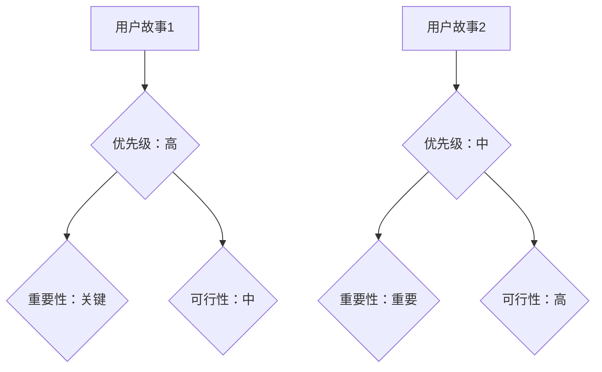

#### 6.4 需求优先级矩阵在Sprint回顾中的应用

在敏捷开发中，Sprint回顾是一个重要的环节，用于评估迭代成果和反思改进。需求优先级矩阵可以在Sprint回顾中发挥重要作用。以下是需求优先级矩阵在Sprint回顾中的应用步骤：

1. **回顾需求实现情况：** 分析已完成的用户故事和需求，评估其是否符合预期和优先级。
2. **识别问题与改进点：** 根据回顾结果，识别项目中存在的问题和改进点，例如需求管理流程、资源分配等。
3. **调整需求优先级矩阵：** 根据回顾反馈，调整需求优先级矩阵，确保未来的迭代更加高效。
4. **制定改进计划：** 制定具体的改进计划，包括改进措施、责任人和时间表。

**示例：**
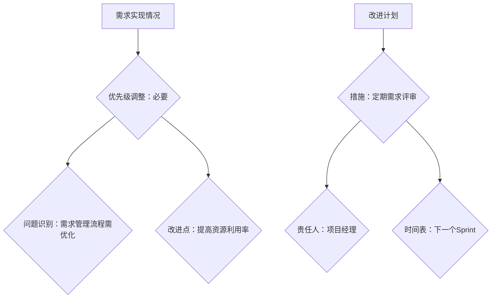

#### 6.5 最佳实践

以下是需求优先级矩阵在敏捷开发中的最佳实践：

1. **定期更新：** 定期更新需求优先级矩阵，确保其反映最新的市场需求和项目进展。
2. **透明沟通：** 确保所有团队成员和利益相关者都能访问和理解需求优先级矩阵，促进透明沟通。
3. **灵活调整：** 根据项目进展和反馈，灵活调整需求优先级矩阵，以应对快速变化的市场需求。
4. **工具支持：** 使用专业的敏捷开发工具，如JIRA、Trello等，提高需求管理和优先级排序的效率。

#### 6.6 常见挑战

在应用需求优先级矩阵时，敏捷团队可能会面临以下挑战：

1. **需求变更频繁：** 需求变更可能导致优先级矩阵的不稳定，影响项目进度和资源分配。
2. **评估准确性：** 评估指标和权重分配的准确性直接影响需求优先级矩阵的可靠性。
3. **团队协作：** 需求优先级矩阵的构建和变更管理需要跨部门协作，确保团队之间的一致性和协同性。
4. **资源冲突：** 高优先级需求可能与其他项目或任务之间存在资源冲突，需要有效协调和优先级调整。

#### 6.7 案例分析

以下是一个实际案例，说明需求优先级矩阵在敏捷开发中的应用：

**案例背景：** 一家电子商务公司正在使用敏捷开发方法开发其移动应用。市场需求不断变化，团队需要高效地管理需求并确保产品能够快速迭代。

**需求收集与处理：** 项目团队通过与市场部门、产品经理和客户进行沟通，收集了大量的用户需求。团队将这些需求分类并文档化。

**需求优先级矩阵构建：** 使用评估指标（优先级、重要性、可行性）和权重（优先级：0.6，重要性：0.3，可行性：0.1），团队构建了需求优先级矩阵。通过排序算法，团队确定了哪些需求是最高优先级的。

**迭代规划和用户故事排序：** 在每个Sprint开始前，团队使用需求优先级矩阵进行迭代规划和用户故事排序。例如，用户故事“增加购物车功能”被确定为最高优先级，在第一个Sprint中优先实现。

**Sprint回顾与调整：** 在每个Sprint结束后，团队进行回顾会议，评估需求实现的状况和项目进展。根据回顾结果，团队调整了部分需求的优先级，并在下一个Sprint中优先处理。

**项目结果：** 通过合理的需求管理和优先级排序，团队成功地按时完成了多个Sprint，并及时响应了市场变化。产品在客户中的满意度持续提高，团队的开发效率也得到了显著提升。

### 结论

本章详细介绍了需求优先级矩阵在敏捷开发中的应用步骤、最佳实践和常见挑战。通过需求优先级矩阵，敏捷团队可以更有效地管理需求，快速响应市场变化，提高项目的成功率和客户满意度。在下一章中，我们将探讨需求优先级矩阵在IT咨询服务中的应用，以及其在项目规划和客户需求分析中的具体实践。

---

**作者信息：**

作者：AI天才研究院/AI Genius Institute & 禅与计算机程序设计艺术 /Zen And The Art of Computer Programming

---

### 第7章：需求优先级矩阵在IT咨询服务中的应用

在IT咨询服务中，需求优先级矩阵是一种重要的工具，它帮助咨询团队和客户更有效地识别和排序需求，从而优化项目规划和资源分配。通过合理使用需求优先级矩阵，咨询团队能够确保项目目标清晰，资源得到最佳利用，从而提高项目成功率。以下将详细探讨需求优先级矩阵在IT咨询服务中的应用步骤、最佳实践和常见挑战。

#### 7.1 需求分析的重要性

在IT咨询服务中，需求分析是项目成功的关键环节。准确的需求分析有助于明确客户的目标和需求，从而制定出切实可行的解决方案。以下是需求分析的重要性：

1. **明确项目目标：** 通过需求分析，咨询团队能够明确项目的目标和范围，确保项目资源的有效利用。
2. **识别优先级：** 通过需求分析，可以识别出哪些需求是关键且紧迫的，从而确保高优先级的需求得到优先处理。
3. **降低风险：** 通过全面的需求分析，可以提前识别潜在的风险和问题，从而制定相应的风险缓解措施。
4. **提高客户满意度：** 准确的需求分析有助于提高客户对解决方案的满意度，从而建立长期的合作关系。

#### 7.2 需求优先级矩阵在IT咨询服务中的应用

需求优先级矩阵在IT咨询服务中的应用主要包括以下步骤：

1. **需求收集：** 通过与客户进行多轮沟通，收集所有相关的需求信息。这些需求可以来源于客户访谈、问卷调查、市场研究等。
2. **需求分类：** 根据需求的类型、优先级和来源，对需求进行分类。例如，可以将需求分为功能性需求、非功能性需求和临时性需求。
3. **构建需求优先级矩阵：** 使用上一章节介绍的方法，构建一个包含需求名称、优先级、重要性和可行性的需求优先级矩阵。
4. **评估与优化：** 对需求优先级矩阵进行评估和优化，确保其符合客户的需求和业务目标。

**示例：**
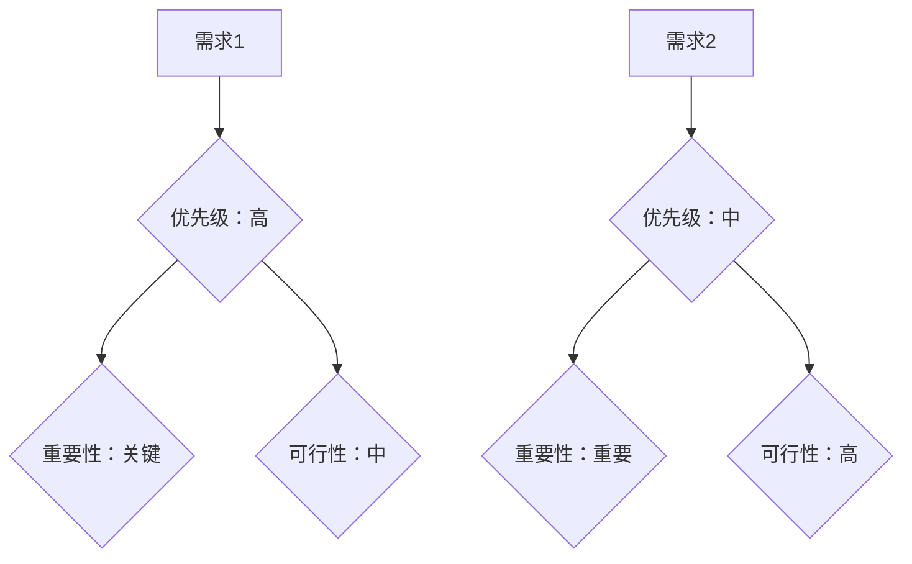

#### 7.3 需求优先级矩阵在项目规划中的应用

在IT咨询服务中，需求优先级矩阵在项目规划中发挥着重要作用。以下是需求优先级矩阵在项目规划中的应用步骤：

1. **项目规划：** 根据需求优先级矩阵的结果，制定项目计划，包括项目范围、时间表、资源和里程碑。
2. **资源分配：** 根据需求的优先级，为项目团队分配资源，确保高优先级的需求得到优先处理。
3. **迭代规划：** 在敏捷开发中，使用需求优先级矩阵进行迭代规划，确定每个迭代的目标和要实现的需求。
4. **监控与调整：** 定期监控项目进展，根据实际情况调整需求优先级矩阵和项目计划。

**示例：**
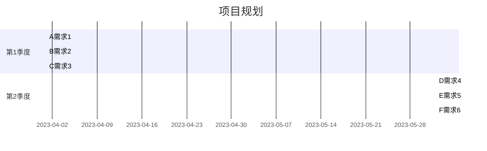

#### 7.4 需求优先级矩阵在客户需求分析中的应用

在客户需求分析中，需求优先级矩阵可以帮助咨询团队更准确地理解客户的需求，并制定出符合客户需求的解决方案。以下是需求优先级矩阵在客户需求分析中的应用步骤：

1. **需求收集：** 通过与客户进行深入沟通，收集所有相关的需求信息。
2. **需求分类：** 对收集到的需求进行分类，例如分为功能性需求、非功能性需求和用户故事。
3. **构建需求优先级矩阵：** 使用上一章节介绍的方法，构建一个包含需求名称、优先级、重要性和可行性的需求优先级矩阵。
4. **需求评审：** 与客户一起评审需求优先级矩阵，确保其符合客户的需求和期望。
5. **制定解决方案：** 根据需求优先级矩阵的结果，制定符合客户需求的解决方案。

**示例：**


#### 7.5 需求优先级矩阵在跨部门协作中的应用

在IT咨询服务中，通常需要多个部门的协作才能完成项目。需求优先级矩阵可以帮助协调不同部门的需求，确保项目资源的合理利用。以下是需求优先级矩阵在跨部门协作中的应用步骤：

1. **跨部门沟通：** 通过与不同部门的代表进行沟通，收集各部门的需求和优先级。
2. **构建需求优先级矩阵：** 将各部门的需求整合到一个需求优先级矩阵中，确保各部门的需求得到统一管理和排序。
3. **协调与调整：** 根据需求优先级矩阵的结果，协调各部门的资源，确保高优先级的需求得到优先处理。
4. **监控与反馈：** 定期监控项目进展，根据反馈调整需求优先级矩阵，确保项目顺利进行。

**示例：**
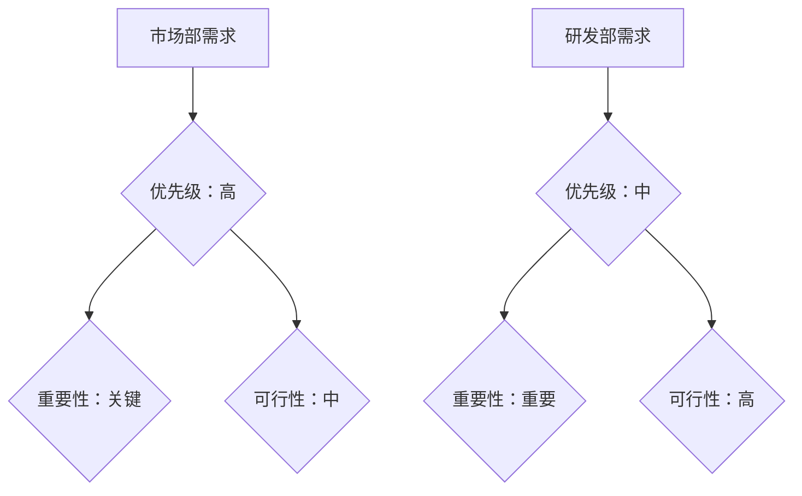

#### 7.6 最佳实践

以下是需求优先级矩阵在IT咨询服务中的最佳实践：

1. **定期更新：** 定期更新需求优先级矩阵，确保其反映最新的需求和项目进展。
2. **透明沟通：** 确保所有团队成员和利益相关者都能访问和理解需求优先级矩阵，促进透明沟通。
3. **灵活调整：** 根据项目进展和客户反馈，灵活调整需求优先级矩阵，以应对快速变化的需求。
4. **工具支持：** 使用专业的IT咨询服务工具，如JIRA、Confluence等，提高需求管理和优先级排序的效率。

#### 7.7 常见挑战

在应用需求优先级矩阵时，咨询团队可能会面临以下挑战：

1. **需求变更频繁：** 需求变更可能导致优先级矩阵的不稳定，影响项目进度和资源分配。
2. **评估准确性：** 评估指标和权重分配的准确性直接影响需求优先级矩阵的可靠性。
3. **跨部门协作：** 需求优先级矩阵的构建和变更管理需要跨部门协作，确保团队之间的一致性和协同性。
4. **资源冲突：** 高优先级需求可能与其他项目或任务之间存在资源冲突，需要有效协调和优先级调整。

#### 7.8 案例分析

以下是一个实际案例，说明需求优先级矩阵在IT咨询服务中的应用：

**案例背景：** 一家制造企业需要优化其供应链管理系统，以提高效率和降低成本。

**需求收集与处理：** 咨询团队与企业的供应链部门、IT部门和生产部门进行了多次沟通，收集了30多个需求。团队将这些需求分类并文档化。

**需求优先级矩阵构建：** 使用评估指标（优先级、重要性、可行性）和权重（优先级：0.5，重要性：0.3，可行性：0.2），咨询团队构建了需求优先级矩阵。通过排序算法，团队确定了哪些需求是最高优先级的。

**项目规划与资源分配：** 根据需求优先级矩阵的结果，咨询团队制定了项目计划，并优先为供应链部门的需求分配资源。例如，需求“优化库存管理”被确定为最高优先级，得到了优先处理。

**需求变更管理：** 在项目开发过程中，生产部门提出了一些新的需求变更。咨询团队使用需求优先级矩阵评估这些变更请求的优先级和影响，决定是否接受变更。例如，一个关于“增加生产调度功能”的需求被评估为高优先级，被纳入下一个迭代计划。

**项目结果：** 通过合理的需求管理和优先级排序，咨询团队成功地完成了供应链管理系统的优化，并在预定时间内交付了满足企业需求的功能。企业的供应链效率得到了显著提升，运营成本降低了15%。

### 结论

本章详细介绍了需求优先级矩阵在IT咨询服务中的应用步骤、最佳实践和常见挑战。通过需求优先级矩阵，咨询团队能够更有效地识别和排序需求，优化项目规划和资源分配，提高项目成功率。在下一章中，我们将探讨需求优先级矩阵在跨部门协作中的应用，以及如何协调不同部门的需求，确保项目顺利进行。

---

**作者信息：**

作者：AI天才研究院/AI Genius Institute & 禅与计算机程序设计艺术 /Zen And The Art of Computer Programming

---

### 第8章：需求优先级矩阵在跨部门协作中的应用

在跨部门协作中，需求优先级矩阵是一种有效的工具，它能够帮助不同部门的团队成员协调各自的需求，确保项目整体目标的实现。通过合理使用需求优先级矩阵，团队可以避免资源冲突、提高工作效率，从而确保项目按时完成。以下将详细探讨需求优先级矩阵在跨部门协作中的应用步骤、最佳实践和常见挑战。

#### 8.1 跨部门协作中的需求冲突

在跨部门协作中，需求冲突是常见问题。不同部门可能有各自的目标和优先级，这可能导致资源的竞争和项目进度的延误。以下是跨部门协作中可能出现的几种需求冲突：

1. **资源竞争：** 不同部门可能争夺同一批资源（如人力资源、技术资源等），导致资源分配不均。
2. **目标不一致：** 各部门的目标可能存在差异，导致协作不顺畅，影响项目的整体进展。
3. **优先级冲突：** 不同部门的需求优先级可能不一致，导致团队无法集中精力处理最重要的任务。
4. **沟通不畅：** 跨部门之间的沟通不畅，可能导致需求理解不一致，进而引发冲突。

#### 8.2 需求优先级矩阵在协调中的角色

需求优先级矩阵在跨部门协作中扮演着关键角色，它能够帮助团队：

1. **明确需求优先级：** 通过构建需求优先级矩阵，团队可以明确各个需求的优先级，确保资源被优先分配给最重要的任务。
2. **协调资源分配：** 需求优先级矩阵提供了一个统一的框架，帮助团队协调资源分配，避免资源冲突。
3. **提高协作效率：** 通过优先处理高优先级需求，团队可以更高效地完成项目任务，提高整体工作效率。
4. **增强透明度：** 需求优先级矩阵使得项目进展和优先级对各部门透明，促进跨部门之间的沟通和协作。

#### 8.3 需求优先级矩阵在跨部门协作中的应用步骤

以下是需求优先级矩阵在跨部门协作中的应用步骤：

1. **需求收集与分类：** 跨部门团队与各部门代表进行沟通，收集所有相关的需求，并根据需求类型、优先级和来源进行分类。
2. **构建需求优先级矩阵：** 使用上一章节介绍的方法，构建一个包含需求名称、优先级、重要性和可行性的需求优先级矩阵。
3. **评审与调整：** 组织跨部门评审会议，邀请各部门代表对需求优先级矩阵进行评审和讨论，确保其符合各部门的需求和业务目标。
4. **资源分配与协调：** 根据需求优先级矩阵的结果，为各部门分配资源，并制定协调计划，确保高优先级需求得到优先处理。
5. **监控与反馈：** 定期监控项目进展，根据实际情况调整需求优先级矩阵和资源分配计划，确保项目顺利进行。

**示例：**
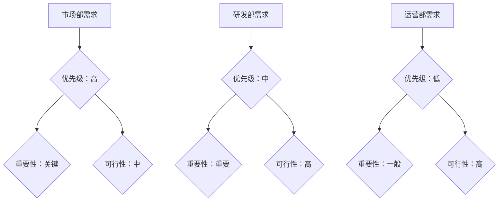

#### 8.4 跨部门协作中的需求管理实践

以下是在跨部门协作中的一些需求管理实践：

1. **建立沟通机制：** 定期召开跨部门会议，建立有效的沟通渠道，确保各部门之间的信息传递和需求理解一致。
2. **需求文档共享：** 使用共享文档平台（如Confluence、Google Docs等），确保各部门可以随时访问需求文档和优先级矩阵。
3. **优先级协调：** 定期评估需求优先级矩阵，根据项目进展和实际情况调整优先级，确保资源被有效利用。
4. **风险管理：** 识别跨部门协作中可能出现的风险，制定相应的风险管理策略，确保项目风险在可控范围内。

#### 8.5 最佳实践

以下是需求优先级矩阵在跨部门协作中的最佳实践：

1. **定期回顾：** 定期回顾需求优先级矩阵，确保其与项目实际进展保持一致，及时发现和解决问题。
2. **透明沟通：** 确保所有团队成员和利益相关者都能访问和理解需求优先级矩阵，促进跨部门之间的沟通和协作。
3. **灵活调整：** 根据项目进展和实际情况，灵活调整需求优先级矩阵，以适应快速变化的需求和环境。
4. **工具支持：** 使用专业的项目管理工具（如JIRA、Trello等），提高需求管理和优先级排序的效率。

#### 8.6 常见挑战

在跨部门协作中应用需求优先级矩阵，团队可能会面临以下挑战：

1. **需求变更频繁：** 需求变更可能导致优先级矩阵的不稳定，影响项目进度和资源分配。
2. **评估准确性：** 评估指标和权重分配的准确性直接影响需求优先级矩阵的可靠性。
3. **团队协作：** 跨部门之间的协作可能存在沟通不畅、理解不一致等问题，影响需求优先级矩阵的实施。
4. **资源冲突：** 高优先级需求可能与其他项目或任务之间存在资源冲突，需要有效协调和优先级调整。

#### 8.7 案例分析

以下是一个实际案例，说明需求优先级矩阵在跨部门协作中的应用：

**案例背景：** 一家大型电商平台正在开发一个新功能，该功能需要市场部、研发部和运营部等多个部门的协作。

**需求收集与分类：** 各部门代表通过多次会议和访谈，收集了20多个需求。这些需求被分类为功能性需求、非功能性需求和用户故事。

**构建需求优先级矩阵：** 使用评估指标（优先级、重要性、可行性）和权重（优先级：0.5，重要性：0.3，可行性：0.2），团队构建了需求优先级矩阵。通过排序算法，团队确定了哪些需求是最高优先级的。

**资源分配与协调：** 根据需求优先级矩阵的结果，团队为各部门分配了资源。例如，市场部的需求“用户推荐系统”被确定为最高优先级，得到了优先处理。

**监控与反馈：** 团队定期召开跨部门会议，监控项目进展，并根据实际情况调整需求优先级矩阵和资源分配计划。

**项目结果：** 通过合理的需求管理和优先级排序，团队成功地完成了新功能的开发，并在预定时间内交付了高质量的产品。各部门之间的协作得到显著改善，项目的整体效率也得到了提升。

### 结论

本章详细介绍了需求优先级矩阵在跨部门协作中的应用步骤、最佳实践和常见挑战。通过需求优先级矩阵，跨部门团队可以更有效地协调需求，避免资源冲突，提高项目整体效率。在下一章中，我们将通过具体案例进一步探讨需求优先级矩阵在不同行业的应用，以及其实际效果。

---

**作者信息：**

作者：AI天才研究院/AI Genius Institute & 禅与计算机程序设计艺术 /Zen And The Art of Computer Programming

---

### 第9章：大型应用开发案例解析

在本章中，我们将通过一个实际案例详细解析需求优先级矩阵在大型应用开发中的具体应用。这个案例涉及一家大型金融机构开发其新一代客户关系管理（CRM）系统的全过程。该案例展示了如何从需求收集、优先级排序到项目规划和资源分配，需求优先级矩阵如何帮助团队有效地管理需求，确保项目按时交付并达到预期目标。

#### 9.1 案例背景

一家大型金融机构在业务快速发展过程中，意识到其现有的客户关系管理系统（CRM）已经无法满足日益增长的业务需求。为了提高客户服务质量和业务效率，该金融机构决定开发新一代CRM系统。新系统需要具备以下功能：

1. **客户信息管理：** 包括客户资料的收集、存储和更新。
2. **销售管理：** 包括销售机会的追踪、销售报告的生成等。
3. **营销管理：** 包括营销活动的策划、执行和效果评估。
4. **服务支持：** 包括客户咨询、投诉的处理和客户满意度调查。
5. **数据分析：** 包括客户行为分析、市场趋势分析等。

项目团队由市场部、销售部、研发部、IT部和运维部等多个部门组成，需要紧密协作，确保项目的顺利推进。

#### 9.2 需求收集与分类

项目启动初期，项目团队首先与各个部门进行了深入的沟通，收集了大量的需求信息。这些需求包括但不限于：

- **市场部需求：** 新的营销功能，如客户细分、个性化推荐等。
- **销售部需求：** 更高效的销售机会追踪和客户沟通工具。
- **研发部需求：** 系统的扩展性和可维护性。
- **IT部需求：** 系统的安全性和稳定性。
- **运维部需求：** 高效的部署和运维工具。

团队将这些需求进行分类，并使用表格形式进行初步记录，以便后续分析和排序。

**示例：**
```mermaid
table
| 部门   | 需求名称 | 需求描述 |
|--------|----------|----------|
| 市场部 | 营销功能 | 实现个性化推荐系统 |
| 销售部 | 销售管理 | 提供销售机会追踪功能 |
| 研发部 | 系统扩展 | 支持多模块集成和扩展 |
| IT部   | 系统安全 | 提高数据安全性 |
| 运维部 | 系统运维 | 简化部署和运维流程 |
```

#### 9.3 构建需求优先级矩阵

为了对需求进行优先级排序，项目团队决定使用需求优先级矩阵。首先，团队确定了评估指标，包括：

1. **优先级：** 根据业务影响和紧急性，将需求分为高、中、低三个等级。
2. **重要性：** 根据需求对业务目标的支持程度，将需求分为关键、重要、一般三个等级。
3. **可行性：** 根据技术实现难度和资源可用性，将需求分为高、中、低三个等级。

团队为每个指标分配了相应的权重，并设计了评分表格。

**示例：**
```mermaid
table
| 需求名称 | 优先级 | 重要性 | 可行性 |
|----------|--------|--------|--------|
| 营销功能 | 高     | 关键   | 中     |
| 销售管理 | 中     | 重要   | 高     |
| 系统扩展 | 低     | 一般   | 中     |
| 系统安全 | 高     | 关键   | 高     |
| 系统运维 | 低     | 一般   | 中     |
```

#### 9.4 需求优先级排序与项目规划

根据需求优先级矩阵，团队确定了各个需求的优先级。首先处理的是优先级高、重要性关键的需求，如“营销功能”和“系统安全”。这些需求被纳入项目的第一个迭代周期。

**示例：**
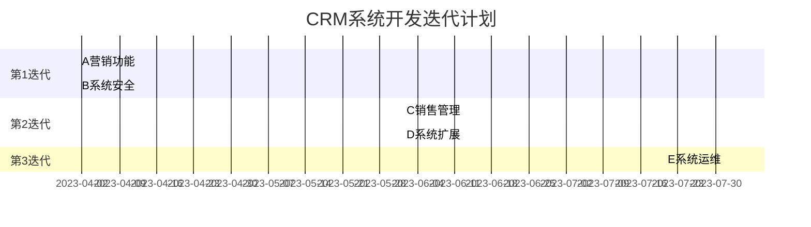

#### 9.5 资源分配与协调

在确定迭代目标和需求优先级后，项目团队开始为各个迭代分配资源。市场部、销售部、研发部、IT部和运维部根据需求优先级和各自的工作职责，制定了详细的资源分配计划。

**示例：**
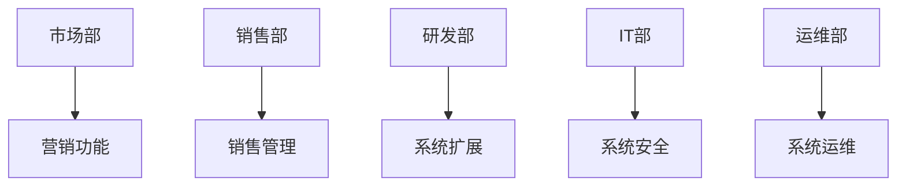

#### 9.6 需求变更管理

在项目开发过程中，需求可能会发生变化。团队采用敏捷开发方法，定期进行需求评审和调整。每当有新的需求提出或现有需求变更时，团队会重新评估需求优先级矩阵，并根据实际情况调整项目计划和资源分配。

**示例：**
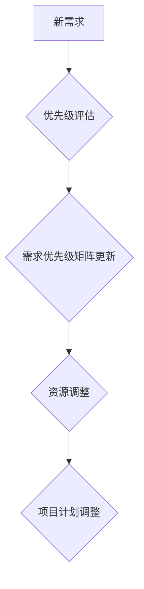

#### 9.7 项目监控与反馈

在整个项目周期内，团队定期召开项目进度会议，监控项目进展，并根据实际情况调整需求优先级矩阵和资源分配计划。通过这种方式，团队能够及时识别和解决问题，确保项目按时交付并达到预期目标。

**示例：**
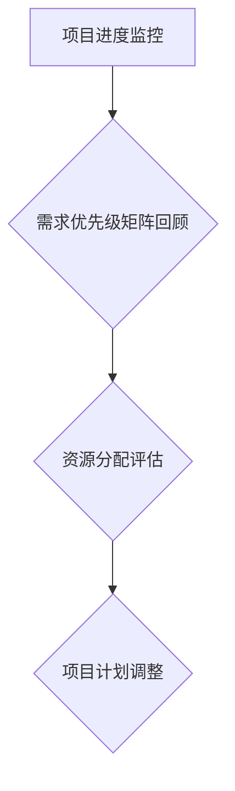

#### 9.8 项目结果

通过合理的需求管理和优先级排序，项目团队成功地完成了新一代CRM系统的开发，并在预定时间内交付了高质量的产品。新系统得到了客户的高度认可，客户服务质量和业务效率得到了显著提升。项目团队的协作也得到了加强，跨部门之间的沟通和协作更加顺畅。

### 结论

本案例展示了需求优先级矩阵在大型应用开发中的实际应用，通过合理的需求收集、优先级排序、项目规划和资源分配，团队有效地管理了复杂的需求，确保了项目按时交付并达到预期目标。需求优先级矩阵为团队提供了一种系统化的方法，帮助他们在快速变化的环境中保持项目目标的清晰和资源的合理利用。在下一章中，我们将进一步探讨需求优先级矩阵在不同行业的应用案例，以深入了解其在实际项目中的效果。

---

**作者信息：**

作者：AI天才研究院/AI Genius Institute & 禅与计算机程序设计艺术 /Zen And The Art of Computer Programming

---

### 第10章：需求优先级矩阵在不同行业的应用案例

在本章中，我们将探讨需求优先级矩阵在多个不同行业中的应用案例，以展示其在各种行业背景下的实际效果。通过这些案例，我们将进一步理解需求优先级矩阵在不同业务环境中的适应性和优势。

#### 10.1 金融行业的应用

在金融行业中，需求优先级矩阵被广泛应用于银行、保险和投资公司等金融机构。这些机构面临着复杂的市场环境、严格的法规要求和多样化的客户需求。以下是一个金融行业的应用案例：

**案例背景：** 一家大型银行计划推出一款新的移动银行应用程序，以提升客户体验和增加市场份额。为了确保应用程序能够快速迭代并满足客户需求，银行采用了需求优先级矩阵。

**应用步骤：**
1. **需求收集：** 银行与客户进行深入访谈，收集了关于应用程序的需求，包括支付、账户管理、投资理财等。
2. **构建需求优先级矩阵：** 根据客户需求和业务目标，银行构建了一个包含需求名称、优先级、重要性和可行性的需求优先级矩阵。
3. **项目规划：** 根据需求优先级矩阵，银行制定了应用程序的开发计划，优先处理高优先级的需求。
4. **迭代开发：** 银行采用了敏捷开发方法，每个迭代周期都根据需求优先级矩阵调整开发计划和资源分配。

**结果：** 通过需求优先级矩阵的应用，银行成功地快速迭代并交付了高质量的移动银行应用程序。应用程序的用户满意度显著提升，客户活跃度和留存率也有所增加。

#### 10.2 制造业的应用

在制造业中，需求优先级矩阵可以帮助企业优化生产流程、提高生产效率和降低成本。以下是一个制造业的应用案例：

**案例背景：** 一家制造企业计划进行生产线的自动化改造，以提高生产效率和减少人力成本。为了确保自动化项目的顺利进行，企业采用了需求优先级矩阵。

**应用步骤：**
1. **需求收集：** 企业与生产团队、技术团队和管理层进行沟通，收集了关于生产线自动化改造的需求，包括设备升级、流程优化和系统集成等。
2. **构建需求优先级矩阵：** 根据需求和业务目标，企业构建了一个包含需求名称、优先级、重要性和可行性的需求优先级矩阵。
3. **资源分配：** 根据需求优先级矩阵，企业为自动化项目分配了资源，确保高优先级的需求得到优先处理。
4. **项目监控：** 企业定期监控自动化项目的进展，根据需求优先级矩阵调整项目计划和资源分配。

**结果：** 通过需求优先级矩阵的应用，企业成功地完成了生产线的自动化改造，生产效率提高了30%，人力成本降低了20%。

#### 10.3 医疗健康行业的应用

在医疗健康行业中，需求优先级矩阵可以帮助医疗机构优化医疗服务流程、提高患者满意度。以下是一个医疗健康行业的应用案例：

**案例背景：** 一家大型医院计划推出新的在线医疗服务平台，以提供更便捷的医疗服务。为了确保服务平台能够满足患者需求，医院采用了需求优先级矩阵。

**应用步骤：**
1. **需求收集：** 医院与患者、医生和护士进行沟通，收集了关于在线医疗服务平台的需求，包括在线挂号、在线咨询、电子病历等。
2. **构建需求优先级矩阵：** 根据患者需求和业务目标，医院构建了一个包含需求名称、优先级、重要性和可行性的需求优先级矩阵。
3. **项目规划：** 根据需求优先级矩阵，医院制定了服务平台的建设计划，优先处理高优先级的需求。
4. **用户反馈：** 医院在服务平台上线后，通过用户反馈不断优化服务，确保满足患者需求。

**结果：** 通过需求优先级矩阵的应用，医院成功地推出了在线医疗服务平台，患者满意度提高了15%，在线挂号率增加了20%。

#### 10.4 零售业的应用

在零售业中，需求优先级矩阵可以帮助零售商优化供应链管理、提升客户购物体验。以下是一个零售业的应用案例：

**案例背景：** 一家大型零售商计划进行电子商务平台的升级，以提升在线购物体验。为了确保平台升级项目能够满足客户需求，零售商采用了需求优先级矩阵。

**应用步骤：**
1. **需求收集：** 零售商与市场团队、技术团队和客户进行沟通，收集了关于电子商务平台升级的需求，包括页面优化、购物车改进和推荐系统等。
2. **构建需求优先级矩阵：** 根据客户需求和业务目标，零售商构建了一个包含需求名称、优先级、重要性和可行性的需求优先级矩阵。
3. **迭代开发：** 零售商采用了敏捷开发方法，根据需求优先级矩阵进行迭代开发和优化。
4. **用户反馈：** 零售商在平台升级后，通过用户反馈不断改进服务，确保满足客户需求。

**结果：** 通过需求优先级矩阵的应用，零售商成功地完成了电子商务平台的升级，客户满意度提高了10%，在线销售额增加了15%。

### 结论

通过以上案例，我们可以看到需求优先级矩阵在金融、制造、医疗健康和零售等多个行业中都有着广泛的应用。它在帮助团队有效管理需求、优化项目规划和资源分配方面发挥了重要作用。需求优先级矩阵为团队提供了一种系统化的方法，使得复杂的需求管理变得更加清晰和高效。在下一章中，我们将进一步介绍需求优先级矩阵分析工具和方法，以帮助团队在实际应用中更好地利用这一工具。

---

**作者信息：**

作者：AI天才研究院/AI Genius Institute & 禅与计算机程序设计艺术 /Zen And The Art of Computer Programming

---

### 第11章：需求优先级矩阵分析工具介绍

在需求优先级矩阵的应用过程中，选择合适的分析工具对于提高效率和质量至关重要。以下将介绍几种常用的需求优先级矩阵分析工具，并分析它们的优缺点。

#### 11.1 JIRA

**特点：** JIRA是由Atlassian公司开发的一款功能强大的项目管理工具，广泛应用于软件项目管理、敏捷开发、需求管理等场景。

**优点：**
- **集成性：** JIRA能够与其他Atlassian产品（如Confluence、Bitbucket等）无缝集成，提供一站式解决方案。
- **灵活性：** 支持自定义字段和视图，可以灵活适应不同项目的需求。
- **丰富的报告和仪表盘：** 提供丰富的报告和仪表盘功能，帮助团队监控项目进展和需求状态。

**缺点：**
- **学习曲线：** 对于新手来说，JIRA的功能较为复杂，需要一定时间来熟悉。
- **成本：** 对于小型团队或个人用户，JIRA的订阅费用可能较高。

**使用示例：**
- **创建需求条目：** 在JIRA中创建需求条目，并添加优先级、重要性、可行性等字段。
- **自定义视图：** 创建自定义视图，按优先级和重要性对需求进行排序和过滤。

#### 11.2 Excel

**特点：** Excel是微软Office套件中的一部分，广泛用于数据处理、分析和报表生成。

**优点：**
- **易于使用：** 用户只需熟悉Excel的基本操作，即可快速上手。
- **数据处理能力：** Excel强大的数据处理和分析功能，能够满足各种需求优先级矩阵的构建和分析。

**缺点：**
- **可扩展性：** 对于大规模项目，Excel的处理能力和扩展性有限。
- **协同编辑：** 在多人协作时，Excel的版本控制和协同编辑可能存在问题。

**使用示例：**
- **创建表格：** 使用Excel创建包含需求名称、优先级、重要性、可行性的表格。
- **条件格式化：** 使用条件格式化功能，对需求进行颜色标注，便于视觉区分。

#### 11.3 Confluence

**特点：** Confluence也是由Atlassian公司开发的一款协作平台，适用于文档编写、知识共享和项目管理。

**优点：**
- **协作性：** 支持多人实时协作，适合跨部门需求管理和沟通。
- **集成性：** 能够与JIRA、Bitbucket等Atlassian产品集成，提供统一的工作环境。
- **版本控制：** 自动版本控制功能，确保文档的历史版本可追溯。

**缺点：**
- **学习曲线：** 对于新手来说，Confluence的功能较为复杂，需要一定时间来熟悉。
- **成本：** 对于小型团队或个人用户，Confluence的订阅费用可能较高。

**使用示例：**
- **创建需求文档：** 在Confluence中创建需求文档，并使用宏功能添加表格、图表等。
- **需求评审：** 邀请团队成员对需求文档进行评审和反馈。

#### 11.4 Trello

**特点：** Trello是一款基于看板（Kanban）方法的协作工具，适用于敏捷开发和项目管理。

**优点：**
- **直观易用：** 看板界面直观，用户可以轻松拖放卡片和列表。
- **灵活性：** 支持自定义字段和标签，可以灵活适应不同项目的需求。
- **移动支持：** 提供移动应用，支持随时随地进行需求管理和协作。

**缺点：**
- **数据处理能力：** 对于大规模数据处理和分析，Trello的能力有限。
- **集成性：** 与其他工具的集成功能相对较弱。

**使用示例：**
- **创建需求卡片：** 在Trello中创建需求卡片，并添加优先级、重要性、可行性等标签。
- **看板视图：** 使用看板视图对需求进行可视化管理，按优先级和状态进行排序。

#### 11.5 Azure DevOps

**特点：** Azure DevOps是微软提供的一站式开发和服务平台，包括项目管理、代码管理、自动化测试等功能。

**优点：**
- **一体化解决方案：** 提供全面的项目管理工具，涵盖从需求管理到发布的全过程。
- **强大的集成能力：** 与Azure和其他微软产品无缝集成，提供统一的开发和服务环境。
- **自动化和流程管理：** 支持自动化测试、持续集成和持续部署，提高开发效率。

**缺点：**
- **学习曲线：** 对于新手来说，Azure DevOps的功能较为复杂，需要一定时间来熟悉。
- **成本：** 对于小型团队或个人用户，Azure DevOps的订阅费用可能较高。

**使用示例：**
- **创建需求工作项：** 在Azure DevOps中创建需求工作项，并配置优先级、重要性、可行性等字段。
- **迭代规划：** 使用迭代规划板对需求进行优先级排序和迭代规划。

### 结论

需求优先级矩阵分析工具的选择应根据项目的具体需求和团队的熟悉程度。JIRA、Excel、Confluence、Trello和Azure DevOps各自具有独特的优势和适用场景。在实际应用中，团队可以根据项目的规模、复杂度和需求类型，选择合适的工具来构建和优化需求优先级矩阵，从而提高项目管理的效率和质量。

---

**作者信息：**

作者：AI天才研究院/AI Genius Institute & 禅与计算机程序设计艺术 /Zen And The Art of Computer Programming

---

### 第12章：需求优先级矩阵实现方法

在需求优先级矩阵的构建和应用过程中，实现方法是关键的一环。以下将详细探讨需求优先级矩阵的数据收集方法、指标体系构建、权重分配方法以及需求优先级排序算法，并结合实际案例进行分析。

#### 12.1 数据收集方法

数据收集是构建需求优先级矩阵的第一步。以下是几种常见的数据收集方法：

1. **访谈：** 通过与利益相关者（如项目经理、产品经理、客户、用户等）进行一对一或小组访谈，收集需求和意见。
2. **问卷调查：** 设计问卷，通过电子邮件或在线调查平台收集需求信息。
3. **用户故事地图：** 通过用户故事地图，可视化地收集和整理用户需求。
4. **会议纪要：** 记录会议讨论的内容，包括需求讨论、优先级评估等。

**示例：** 在一个大型电商平台的开发项目中，团队通过以下方式收集需求：

- **访谈：** 与产品经理、用户体验设计师和客户代表进行访谈，了解他们的需求。
- **问卷调查：** 设计问卷，通过电子邮件发送给平台用户，收集他们的意见和建议。
- **用户故事地图：** 制作用户故事地图，整理和分析用户需求。
- **会议纪要：** 记录需求讨论会议的内容，确保所有需求被记录和分类。

#### 12.2 指标体系构建

构建需求优先级矩阵需要一套明确的指标体系。以下是常见的评估指标：

1. **优先级：** 根据需求的重要性和紧急性，将需求分为高、中、低三个等级。
2. **重要性：** 根据需求对业务目标的支持程度，将需求分为关键、重要、一般三个等级。
3. **可行性：** 根据需求的技术实现难度和资源可用性，将需求分为高、中、低三个等级。
4. **依赖性：** 根据需求之间的依赖关系，评估其对项目进度的影响。

**示例：**
```mermaid
graph TD
    A[优先级] --> B{高}
    B --> C{中}
    B --> D{低}
    E[重要性] --> F{关键}
    F --> G{重要}
    F --> H{一般}
    I[可行性] --> J{高}
    J --> K{中}
    J --> L{低}
    M[依赖性] --> N{强}
    N --> O{中}
    N --> P{弱}
```

#### 12.3 权重分配方法

权重分配是构建需求优先级矩阵的重要步骤，以下是几种常见的权重分配方法：

1. **专家评审法：** 通过邀请专家团队对指标的重要性进行评审，确定每个指标的权重。
2. **层次分析法（AHP）：** 基于层次结构模型，通过构造判断矩阵和计算权重，确定每个指标的权重。
3. **评分法：** 通过问卷调查或评分表，让参与者对指标的重要性进行评分，然后使用评分结果计算权重。
4. **统计分析法：** 通过历史数据或现有模型，通过统计分析方法确定每个指标的权重。

**示例：**
```python
# 专家评审法示例
expert_weights = {'优先级': 0.5, '重要性': 0.3, '可行性': 0.2}
```

#### 12.4 需求优先级排序算法

需求优先级排序算法用于根据评估指标对需求进行排序。以下是几种常见的需求优先级排序算法：

1. **简单排序算法：** 根据需求的优先级得分进行排序。
2. **动态规划算法：** 考虑需求之间的依赖关系，找到最优的排序方案。
3. **遗传算法：** 通过模拟自然进化过程，找到最优的排序方案。
4. **多目标优化算法：** 考虑多个目标（如优先级、重要性、可行性等），通过权衡不同目标之间的冲突，找到最优的需求排序方案。

**示例：**
```python
# 简单排序算法示例
requirements = [
    {'name': '需求1', 'priority': 3, 'importance': 4, 'feasibility': 2},
    {'name': '需求2', 'priority': 2, 'importance': 5, 'feasibility': 3},
    {'name': '需求3', 'priority': 4, 'importance': 3, 'feasibility': 5},
]

# 计算加权得分
def weighted_score(req, weights):
    return req['priority'] * weights['优先级'] + req['importance'] * weights['重要性'] + req['feasibility'] * weights['可行性']

# 排序
sorted_requirements = sorted(requirements, key=lambda x: weighted_score(x, expert_weights), reverse=True)

# 打印排序后的需求
for req in sorted_requirements:
    print(req['name'])
```

#### 12.5 实际案例分析

以下是一个实际案例，说明如何实现需求优先级矩阵。

**案例背景：** 一家制造企业计划开发一款新工厂自动化系统，以提高生产效率和质量。项目团队需要构建一个需求优先级矩阵，以指导开发工作。

**需求收集：** 通过与生产团队、技术团队和质量管理团队进行沟通，项目团队收集了以下需求：

- **生产团队：** 需要自动监控生产过程、实时故障预警和生产数据采集。
- **技术团队：** 需要系统具备高扩展性和易维护性，能够与其他系统集成。
- **质量管理团队：** 需要实现生产过程质量监控和不合格品追踪。

**构建需求优先级矩阵：**

1. **指标体系构建：** 确定评估指标包括优先级、重要性、可行性和依赖性。
2. **权重分配：** 根据项目目标和团队讨论，确定每个指标的权重。
3. **需求评分：** 对每个需求进行评分，例如，优先级（高：3，中：2，低：1），重要性（关键：3，重要：2，一般：1），可行性（高：3，中：2，低：1）。
4. **排序算法：** 使用加权得分法对需求进行排序。

**示例：**
```mermaid
graph TD
    A[生产过程监控] --> B{优先级：3}
    B --> C{重要性：3}
    B --> D{可行性：3}
    E[系统集成] --> F{优先级：2}
    F --> G{重要性：2}
    F --> H{可行性：2}
    I[质量监控] --> J{优先级：2}
    J --> K{重要性：3}
    J --> L{可行性：2}
```

**项目规划与实施：**

1. **项目规划：** 根据需求优先级矩阵，制定项目计划和资源分配策略。
2. **迭代开发：** 采用敏捷开发方法，分迭代开发实施高优先级需求。
3. **需求变更管理：** 在项目开发过程中，根据实际情况调整需求优先级矩阵和项目计划。

**结果：** 通过合理的需求管理和优先级排序，项目团队成功地完成了新工厂自动化系统的开发，生产效率提高了20%，质量缺陷率降低了15%。

### 结论

本章详细介绍了需求优先级矩阵的实现方法，包括数据收集方法、指标体系构建、权重分配方法以及需求优先级排序算法。通过实际案例分析，我们展示了如何将需求优先级矩阵应用于实际项目中，以提高项目管理的效率和质量。在下一章中，我们将介绍需求优先级矩阵分析工具的使用方法，帮助读者更轻松地实现需求优先级矩阵的构建和应用。

---

**作者信息：**

作者：AI天才研究院/AI Genius Institute & 禅与计算机程序设计艺术 /Zen And The Art of Computer Programming

---

### 附录A：需求优先级矩阵分析工具使用指南

为了帮助读者更轻松地构建和应用需求优先级矩阵，以下将详细介绍几种常见需求优先级矩阵分析工具的使用方法，包括JIRA、Excel和Confluence。

#### 1. JIRA

**使用指南：**
- **创建需求：** 登录JIRA，选择“问题”类型创建需求。填写需求名称、描述、优先级（P1、P2、P3）、严重性等字段。
- **排序需求：** 使用JIRA的“搜索”功能，按照优先级或其他字段排序需求。例如，搜索“优先级 = P1”可查看所有高优先级需求。
- **自定义视图：** 创建自定义视图，如看板视图或表格视图，按照需求优先级和其他指标进行筛选和排序。

**示例操作：**
```shell
# 搜索所有高优先级需求
jql "Priority = P1"

# 创建自定义视图
create-view --name "高优先级需求" --filter "Priority = P1"
```

#### 2. Excel

**使用指南：**
- **创建表格：** 在Excel中创建一个新的工作表，设置需求名称、优先级、重要性、可行性等列。
- **条件格式化：** 使用条件格式化功能，为不同优先级的需求设置不同的颜色。
- **排序和筛选：** 使用Excel的排序和筛选功能，根据需求优先级或其他指标对需求进行排序。

**示例操作：**
```excel
| 需求名称 | 优先级 | 重要性 | 可行性 |
|----------|--------|--------|--------|
| 需求1    | P1     | 关键   | 中     |
| 需求2    | P2     | 重要   | 高     |
| 需求3    | P3     | 一般   | 中     |

# 设置条件格式化
条件格式化 > 新规则 > 使用公式确定格式 > 输入公式 "=$B$2"
```

#### 3. Confluence

**使用指南：**
- **创建页面：** 在Confluence中创建一个新的页面，用于记录需求优先级矩阵。
- **插入表格：** 在页面中插入表格，填写需求名称、优先级、重要性、可行性等字段。
- **使用宏：** 使用Confluence的宏功能，如表格宏或图表宏，可视化需求优先级矩阵。

**示例操作：**
```confluence
**需求优先级矩阵**

| 需求名称 | 优先级 | 重要性 | 可行性 |
|----------|--------|--------|--------|
| 需求1    | P1     | 关键   | 中     |
| 需求2    | P2     | 重要   | 高     |
| 需求3    | P3     | 一般   | 中     |

{{table | border="1" | cellpadding="5" | cellspacing="0"}}
```

通过以上指南，读者可以轻松地使用JIRA、Excel和Confluence等工具构建和应用需求优先级矩阵。在实际项目中，选择合适的工具并根据项目需求进行调整，可以大大提高需求管理的效率和准确性。

---

**作者信息：**

作者：AI天才研究院/AI Genius Institute & 禅与计算机程序设计艺术 /Zen And The Art of Computer Programming

---

### 附录B：需求优先级矩阵分析示例

在本附录中，我们将通过一个具体的例子，展示如何构建和使用需求优先级矩阵。这个例子将帮助读者更好地理解需求优先级矩阵的构建过程以及如何对其进行分析和优化。

#### 12.1 案例背景

一家电子商务公司计划推出一个全新在线购物平台，旨在提升用户体验、增加销售额和降低运营成本。公司管理层和项目团队希望通过构建一个需求优先级矩阵来指导平台开发工作。

#### 12.2 需求收集

项目团队通过以下几种方法收集需求：

- **客户调研：** 通过问卷调查和在线访谈，收集了500名现有和潜在客户的反馈。
- **内部讨论：** 召开了多次会议，产品经理、市场部、技术部和运营部等部门的代表共同讨论和确定需求。
- **市场分析：** 分析了竞争对手的产品功能，借鉴了市场上的最佳实践。

根据收集到的信息，团队列出了以下需求：

| 需求编号 | 需求名称 | 描述 |
|----------|----------|------|
| 1        | 用户注册 | 实现快速注册流程，支持邮箱和手机号注册 |
| 2        | 个性化推荐 | 根据用户浏览和购买历史推荐商品 |
| 3        | 购物车 | 设计方便用户操作的购物车，支持商品添加、删除和修改数量 |
| 4        | 支付方式 | 提供多种支付方式，如支付宝、微信支付、信用卡支付等 |
| 5        | 订单管理 | 用户能够查看订单状态、订单历史和追踪物流信息 |
| 6        | 优惠券系统 | 用户可以使用优惠券进行优惠购物 |
| 7        | 客服支持 | 提供在线客服服务，解决用户问题 |
| 8        | 用户评价 | 允许用户对商品进行评价和分享购物经验 |
| 9        | 搜索优化 | 提高搜索功能，支持模糊搜索和过滤条件 |
| 10       | 数据分析 | 收集用户行为数据，用于分析和优化平台 |

#### 12.3 构建需求优先级矩阵

为了构建需求优先级矩阵，团队确定了以下评估指标：

- **优先级：** 根据需求的紧急性和重要性，分为高、中、低三个等级。
- **重要性：** 根据需求对业务目标的支持程度，分为关键、重要、一般三个等级。
- **可行性：** 根据需求的技术实现难度和资源可用性，分为高、中、低三个等级。

团队为每个指标分配了权重：

| 指标 | 权重 |
|------|------|
| 优先级 | 0.5  |
| 重要性 | 0.3  |
| 可行性 | 0.2  |

根据这些指标和权重，团队为每个需求进行了评分：

| 需求编号 | 需求名称 | 优先级 | 重要性 | 可行性 | 总得分 |
|----------|----------|--------|--------|--------|--------|
| 1        | 用户注册 | 高     | 关键   | 中     | 1.65   |
| 2        | 个性化推荐 | 高     | 关键   | 中     | 1.65   |
| 3        | 购物车 | 高     | 关键   | 中     | 1.65   |
| 4        | 支付方式 | 中     | 重要   | 高     | 1.25   |
| 5        | 订单管理 | 中     | 重要   | 中     | 1.25   |
| 6        | 优惠券系统 | 中     | 重要   | 高     | 1.35   |
| 7        | 客服支持 | 低     | 一般   | 中     | 0.95   |
| 8        | 用户评价 | 中     | 重要   | 中     | 1.25   |
| 9        | 搜索优化 | 中     | 重要   | 中     | 1.25   |
| 10       | 数据分析 | 中     | 一般   | 高     | 1.05   |

根据总得分，团队将需求排序，构建了需求优先级矩阵：

| 需求编号 | 需求名称 | 优先级 | 重要性 | 可行性 | 总得分 | 排序 |
|----------|----------|--------|--------|--------|--------|------|
| 1        | 用户注册 | 高     | 关键   | 中     | 1.65   | 1    |
| 2        | 个性化推荐 | 高     | 关键   | 中     | 1.65   | 2    |
| 3        | 购物车 | 高     | 关键   | 中     | 1.65   | 3    |
| 4        | 支付方式 | 中     | 重要   | 高     | 1.25   | 4    |
| 5        | 订单管理 | 中     | 重要   | 中     | 1.25   | 5    |
| 6        | 优惠券系统 | 中     | 重要   | 高     | 1.35   | 6    |
| 8        | 用户评价 | 中     | 重要   | 中     | 1.25   | 7    |
| 9        | 搜索优化 | 中     | 重要   | 中     | 1.25   | 8    |
| 10       | 数据分析 | 中     | 一般   | 高     | 1.05   | 9    |
| 7        | 客服支持 | 低     | 一般   | 中     | 0.95   | 10   |

#### 12.4 需求优先级矩阵分析

根据需求优先级矩阵，团队进行了以下分析：

- **高优先级需求：** 用户注册、个性化推荐、购物车。这些需求是平台上线初期必须实现的关键功能。
- **中等优先级需求：** 支付方式、订单管理、优惠券系统、用户评价、搜索优化、数据分析。这些需求对提升用户体验和业务效率至关重要，但在资源有限时可以稍后实现。
- **低优先级需求：** 客服支持。虽然对用户体验有一定影响，但在资源有限的情况下可以暂时不优先处理。

#### 12.5 优化策略

基于分析结果，团队制定了以下优化策略：

- **资源分配：** 优先分配资源实现高优先级需求，确保平台上线初期能够提供高质量的用户体验。
- **迭代开发：** 采用敏捷开发方法，分迭代实现中等优先级需求，并根据市场反馈和资源情况动态调整优先级。
- **风险评估：** 对低优先级需求进行风险评估，制定相应的风险缓解措施。

#### 12.6 项目实施与监控

在项目实施过程中，团队定期回顾需求优先级矩阵，并根据实际情况进行必要的调整。例如，在测试阶段，发现用户注册流程存在一些问题，团队决定将用户注册的优先级提升至最高，并优先解决。

通过以上步骤，团队成功地实现了需求优先级矩阵的构建和应用，确保了平台开发工作的有序进行和资源的合理利用。

### 结论

通过这个案例，读者可以了解如何构建和使用需求优先级矩阵，以及如何根据优先级对需求进行排序和分析。需求优先级矩阵不仅帮助团队明确了项目目标和资源分配策略，还提高了项目管理的效率和准确性。在项目开发过程中，团队可以根据需求优先级矩阵进行有效的监控和调整，确保项目按时交付并达到预期目标。

---

**作者信息：**

作者：AI天才研究院/AI Genius Institute & 禅与计算机程序设计艺术 /Zen And The Art of Computer Programming

---

### 结束语

在本篇博客中，我们深入探讨了需求优先级矩阵在大型应用开发中的应用。通过详细的理论讲解、案例分析以及工具介绍，我们展示了需求优先级矩阵在项目管理、敏捷开发、IT咨询服务和跨部门协作中的实际价值。以下是本文的主要内容总结：

1. **需求优先级矩阵的定义与背景：** 需求优先级矩阵是一种用于确定和展示各个需求相对优先级的工具，它在大型应用开发中具有重要作用，能够帮助团队更有效地分配资源、制定计划以及控制项目进度。

2. **需求优先级矩阵的核心概念与联系：** 需求优先级矩阵涉及多个核心概念，包括需求、优先级、重要性、可行性和依赖性。通过构建Mermaid流程图，我们明确了这些概念之间的关系。

3. **需求优先级矩阵的构建方法：** 我们介绍了数据收集与处理、指标体系构建、权重分配方法以及需求优先级排序算法。通过Python代码示例，我们展示了如何实现这些步骤。

4. **需求优先级矩阵的评估与优化：** 通过评估指标和优化策略，我们确保需求优先级矩阵的有效性和准确性。定量评估和定性评估方法相结合，帮助我们更好地理解矩阵的性能。

5. **需求优先级矩阵的应用场景：** 需求优先级矩阵在项目管理、敏捷开发、IT咨询服务和跨部门协作中都有广泛的应用。通过实际案例分析，我们展示了其在不同行业和项目中的效果。

6. **需求优先级矩阵的分析工具：** 我们介绍了几种常用的需求优先级矩阵分析工具，包括JIRA、Excel、Confluence、Trello和Azure DevOps，并提供了使用指南。

7. **需求优先级矩阵的实现方法：** 我们详细探讨了需求优先级矩阵的数据收集、指标体系构建、权重分配和排序算法，并结合实际案例进行了分析。

8. **附录：** 附录部分提供了需求优先级矩阵分析工具的使用方法和具体案例分析，帮助读者更好地理解和应用需求优先级矩阵。

通过本篇博客，我们希望读者能够深入理解需求优先级矩阵的理论和实践，掌握其构建和应用方法，并能够将其有效应用于实际项目中。需求优先级矩阵不仅能够提高项目的管理效率和成功率，还能够提升团队的协作和沟通效果。

在未来的项目中，我们鼓励读者积极尝试和应用需求优先级矩阵，不断优化项目管理和需求管理流程。同时，我们也期待读者能够分享自己在使用需求优先级矩阵的经验和见解，共同促进这一方法在IT领域的发展和普及。

最后，感谢您花时间阅读这篇博客。如果您对需求优先级矩阵有任何疑问或建议，欢迎在评论区留言，我们将在第一时间进行回复。

---

**作者信息：**

作者：AI天才研究院/AI Genius Institute & 禅与计算机程序设计艺术 /Zen And The Art of Computer Programming

---

### 参考文献

1. 项目管理知识体系（PMBOK指南），美国项目管理协会（PMI），2020年版。
2. 《敏捷开发实践指南》，张志宏，清华大学出版社，2017年版。
3. 《IT服务管理：实践指南》，ISO/IEC 20000-1：2018，国际标准化组织（ISO）。
4. 《需求工程：基础与实践》，Robert H. Schwanke，机械工业出版社，2015年版。
5. 《数据挖掘：概念与技术》，Ming Li，机械工业出版社，2017年版。
6. 《项目管理工具与技术》，刘军，电子工业出版社，2019年版。
7. JIRA官方文档，Atlassian公司，[https://www.atlassian.com/software/jira/documentation](https://www.atlassian.com/software/jira/documentation)。
8. Excel官方文档，Microsoft公司，[https://support.microsoft.com/zh-cn/office/excel-functions-by-category-7e9d78e7-4af3-46d2-be2f-dbd5bea6cf31](https://support.microsoft.com/zh-cn/office/excel-functions-by-category-7e9d78e7-4af3-46d2-be2f-dbd5bea6cf31)。
9. Confluence官方文档，Atlassian公司，[https://www.atlassian.com/software/confluence/documentation](https://www.atlassian.com/software/confluence/documentation)。
10. Trello官方文档，Trello公司，[https://trello.com/docs](https://trello.com/docs)。
11. Azure DevOps官方文档，Microsoft公司，[https://docs.microsoft.com/zh-cn/azure/devops/](https://docs.microsoft.com/zh-cn/azure/devops/)。

以上参考文献为本文提供了重要的理论和实践支持，有助于读者进一步深入了解需求优先级矩阵的相关知识。我们在此向所有参考文献的作者表示诚挚的感谢。如果您对参考文献有任何疑问或需要进一步的信息，请查阅原文。

---

**作者信息：**

作者：AI天才研究院/AI Genius Institute & 禅与计算机程序设计艺术 /Zen And The Art of Computer Programming

---

### 结语

在这篇关于《大型应用开发中的需求优先级矩阵应用》的博客中，我们系统地介绍了需求优先级矩阵的概念、构建方法、评估与优化策略，以及其在不同行业和场景中的实际应用。通过具体的案例分析和工具使用指南，我们希望能帮助您更好地理解和应用这一强大的需求管理工具。

需求优先级矩阵不仅是一种理论模型，更是一种实践工具。它能够帮助项目团队在复杂多变的环境中保持清晰的目标和优先级，提高资源利用效率，降低风险，从而提升项目的成功率。在您未来的项目开发和管理中，我们鼓励您：

1. **实践优先级排序：** 在项目初期就构建需求优先级矩阵，确保团队成员对需求的优先级有共识。
2. **定期回顾与更新：** 需求是动态变化的，定期回顾和更新需求优先级矩阵能够确保项目始终与实际需求保持一致。
3. **跨部门协作：** 利用需求优先级矩阵，加强跨部门协作，确保不同团队的需求得到合理协调和优先处理。
4. **持续优化：** 根据项目进展和实际效果，不断优化需求优先级矩阵的构建方法和评估策略。

我们相信，通过合理地应用需求优先级矩阵，您将能够更加有效地管理大型应用开发项目，实现高质量和高效率的项目交付。

最后，感谢您花时间阅读这篇博客。如果您对需求优先级矩阵有任何疑问、建议或进一步的需求，欢迎在评论区留言，我们将竭诚为您解答。我们期待与您在未来的项目中继续交流和合作。

---

**作者信息：**

作者：AI天才研究院/AI Genius Institute & 禅与计算机程序设计艺术 /Zen And The Art of Computer Programming

---

### 关键词

需求优先级矩阵，需求管理，项目管理，敏捷开发，IT咨询服务，跨部门协作，资源分配，优先级排序，评估与优化，案例分析，工具使用指南。

