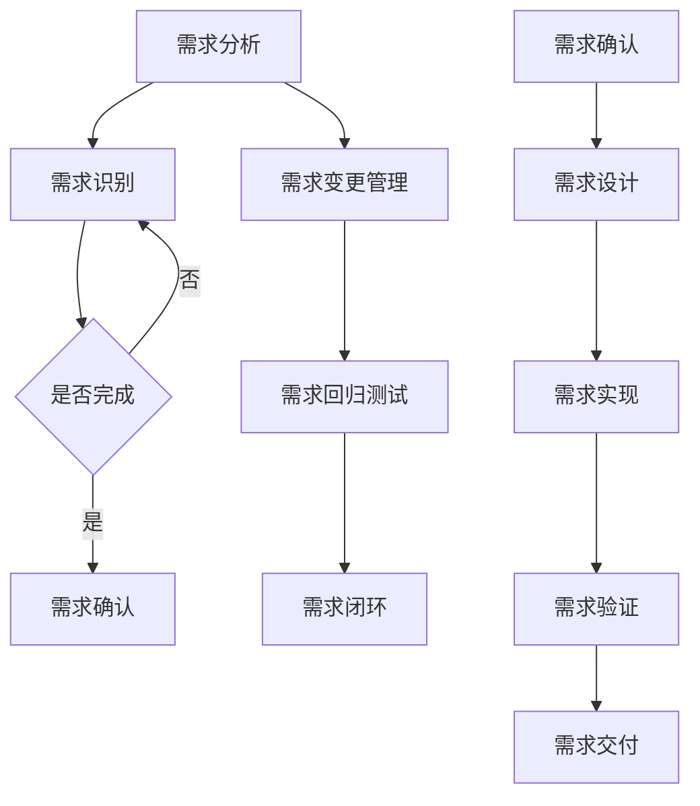
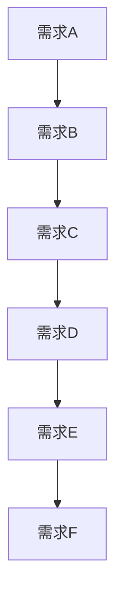
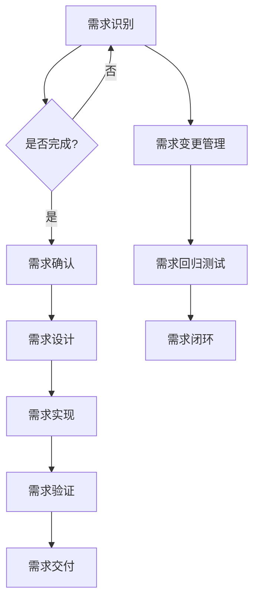
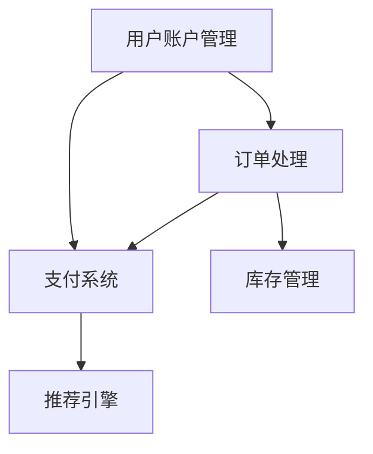
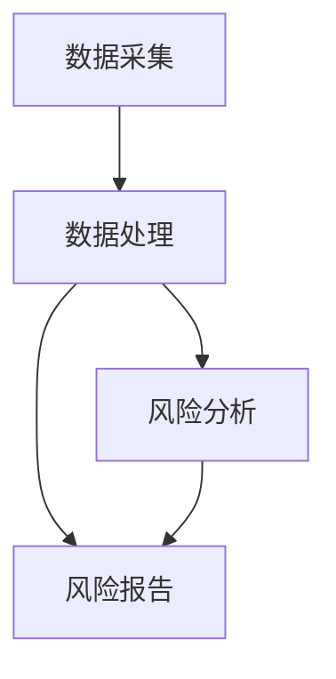

                 

### 大型应用开发中的需求依赖关系管理

在现代软件工程领域，大型应用的开发已经成为一种常态。这些应用通常具有复杂的架构和庞大的代码库，涉及多个团队和数不清的需求。在这样的背景下，需求依赖关系的有效管理显得尤为重要。本文旨在探讨大型应用开发中的需求依赖关系管理，帮助开发团队更好地理解和处理需求之间的复杂关系，从而提高项目的开发效率和产品质量。

**关键词**：大型应用开发、需求依赖关系、需求管理、软件工程

**摘要**：本文首先介绍了大型应用开发的特点，分析了需求依赖关系的重要性和分类。随后，我们探讨了需求依赖关系管理框架，包括核心概念、识别方法和可视化技术。接着，我们提出了需求依赖关系分析、可视化工具选择及其应用，以及需求依赖关系的风险管理和实践案例。最后，通过数学模型和项目实战，进一步阐释了需求依赖关系管理的核心原理和实际应用。

### 第一部分：需求依赖关系管理概述

#### 第1章：大型应用开发背景

在开始讨论需求依赖关系管理之前，我们需要了解大型应用开发的基本背景。大型应用通常具有以下特点：

- **复杂架构**：这些应用通常包含多个模块和子系统，各模块之间存在复杂的依赖关系。
- **庞大代码库**：大型应用通常涉及数百万行代码，代码库庞大且难以管理。
- **多团队协作**：开发大型应用往往需要多个团队共同合作，沟通和协调是关键。
- **频繁变更**：需求变更在大型应用开发中是常态，如何有效地管理需求变更是项目成功的关键。

#### 1.1 大型应用开发的特点

1. **模块化与分布式**：大型应用通常采用模块化设计，各个模块独立开发，相互之间通过接口进行通信。这种分布式架构可以提高开发效率和代码复用性。
2. **高复杂性**：大型应用往往涉及复杂的业务逻辑和技术挑战，如分布式计算、数据一致性保障、性能优化等。
3. **多变性与不确定性**：需求变更频繁，项目进度和计划可能随时调整，这对需求依赖关系管理提出了更高的要求。

#### 1.2 需求依赖关系的重要性

在大型应用开发中，需求依赖关系的管理至关重要。以下是需求依赖关系的重要作用：

1. **项目进度规划**：通过分析需求之间的依赖关系，可以确定需求的优先级和执行顺序，从而合理安排项目进度。
2. **资源分配**：了解需求之间的依赖关系，可以帮助团队更合理地分配资源和人力，避免资源浪费和瓶颈问题。
3. **风险管理**：识别和监控需求依赖关系中的潜在风险，有助于提前预防和应对可能的问题，确保项目顺利推进。
4. **质量保障**：良好的需求依赖关系管理有助于确保需求实现的正确性和一致性，提高软件质量。

#### 1.3 需求依赖关系的分类

需求依赖关系可以根据不同的维度进行分类。以下是常见的几种需求依赖关系类型：

1. **前置需求与后置需求**：一个需求完成后，另一个需求才能开始，这就是典型的前后依赖关系。
2. **并行需求**：多个需求可以同时进行，彼此之间没有直接的依赖关系。
3. **条件需求**：一个需求是否实现取决于其他需求的完成情况，如依赖某些关键功能的实现。
4. **优先级需求**：某些需求在优先级上高于其他需求，需要在资源分配和执行顺序上给予优先考虑。
5. **反向依赖**：某些需求实现后可能会影响到其他需求，这是一种反向的依赖关系。

### 第2章：需求依赖关系管理框架

#### 2.1 需求依赖关系管理的核心概念

需求依赖关系管理（Requirement Dependency Management，简称RDM）是一种系统化的方法，用于识别、分析和管理项目中的需求依赖关系。以下是需求依赖关系管理中的几个核心概念：

1. **需求实体**：需求是需求依赖关系管理的核心，每个需求都有其唯一的标识和描述。
2. **依赖关系**：需求之间的依赖关系，包括前置需求、后置需求、条件需求和优先级需求等。
3. **需求图**：通过图论模型构建的需求依赖关系图，用于可视化和管理需求之间的关系。
4. **拓扑排序**：一种基于图论的排序算法，用于确定需求之间的执行顺序。

#### 2.2 需求依赖关系的识别方法

识别需求依赖关系是需求依赖关系管理的第一步。以下是几种常用的需求依赖关系识别方法：

1. **需求文档分析**：通过分析项目需求和设计文档，识别出需求之间的依赖关系。
2. **访谈与讨论**：与项目团队成员进行访谈和讨论，了解他们对需求之间依赖关系的理解和看法。
3. **工具辅助**：使用专业的需求管理工具，如JIRA、Confluence等，通过数据分析和可视化功能，辅助识别需求依赖关系。
4. **代码审查**：通过审查项目代码，识别出需求之间的隐含依赖关系。

#### 2.3 需求依赖关系的可视化

可视化是需求依赖关系管理的重要工具。通过可视化需求依赖关系，可以直观地理解需求之间的关系，有助于项目的规划和执行。以下是几种常用的需求依赖关系可视化方法：

1. **静态图**：通过绘制静态的图形，展示需求之间的依赖关系。
2. **动态图**：使用动画或动态效果，展示需求依赖关系的动态变化。
3. **交互式图**：通过交互式界面，允许用户动态调整和查看需求依赖关系。
4. **Mermaid 流程图**：使用Mermaid等工具，绘制结构清晰、易于理解的流程图。

#### Mermaid 流程图

以下是需求依赖关系管理的一个简单Mermaid流程图示例：



通过这种流程图，可以清晰地展示需求从分析到交付的整个过程，以及各环节之间的依赖关系。

### 第二部分：需求依赖关系管理策略

#### 第3章：需求依赖关系分析

需求依赖关系分析是需求依赖关系管理的关键步骤。通过系统化的分析方法，可以准确地识别需求之间的依赖关系，为后续的需求管理和项目规划提供依据。

#### 3.1 需求分析的方法

需求分析是需求依赖关系管理的第一步。以下是几种常用的需求分析方法：

1. **用户访谈**：与用户进行面对面访谈，了解用户需求和期望，获取第一手需求信息。
2. **文档分析**：通过分析项目需求和设计文档，识别出潜在的需求和依赖关系。
3. **工作坊**：组织项目团队和利益相关者进行工作坊，共同讨论和确定需求。
4. **问卷调查**：通过问卷调查收集用户和团队的需求反馈。

#### 3.2 需求依赖关系的确定

确定需求依赖关系是需求依赖关系分析的核心任务。以下是几种常用的需求依赖关系确定方法：

1. **直接依赖**：通过分析需求文档和设计文档，直接识别出需求之间的直接依赖关系。
2. **间接依赖**：通过代码审查和功能分析，识别出需求之间的间接依赖关系。
3. **工具辅助**：使用专业的需求管理工具，如JIRA、Confluence等，通过数据分析和可视化功能，辅助确定需求依赖关系。

#### 3.3 需求依赖关系的优化

需求依赖关系的优化是提高项目效率和质量的必要步骤。以下是几种常用的需求依赖关系优化方法：

1. **依赖反转**：通过引入中介模块，将直接依赖关系转化为间接依赖关系，降低模块之间的耦合度。
2. **需求分解**：将复杂的需求分解为多个子需求，降低需求之间的依赖复杂度。
3. **需求优先级调整**：根据项目进度和资源情况，调整需求的优先级和执行顺序，优化项目资源分配。

### 第4章：需求依赖关系的可视化工具

#### 4.1 可视化工具的选择

选择合适的可视化工具对于需求依赖关系的管理至关重要。以下是几种常用的需求依赖关系可视化工具：

1. **Mermaid**：Mermaid是一种基于Markdown的图形绘制工具，支持流程图、序列图等多种图形绘制。
2. **D3.js**：D3.js是一个基于JavaScript的动态可视化库，支持各种复杂图形的绘制和交互。
3. **ECharts**：ECharts是一个基于JavaScript的图表库，提供丰富的图表类型和交互功能。
4. **Power BI**：Power BI是一个强大的商业智能工具，支持数据可视化和分析。

#### 4.2 可视化工具的使用

以下是使用Mermaid绘制需求依赖关系的示例：



通过这种可视化工具，可以直观地展示需求之间的依赖关系，帮助团队更好地理解和管理需求。

#### 4.3 可视化在需求依赖关系管理中的应用

可视化在需求依赖关系管理中的应用非常广泛，包括：

1. **需求评审**：通过可视化工具，团队成员可以更直观地查看需求依赖关系，进行需求评审和讨论。
2. **项目规划**：通过可视化工具，项目管理者可以更好地规划项目进度和资源分配，确保项目按时交付。
3. **风险管理**：通过可视化工具，可以识别和监控需求依赖关系中的潜在风险，提前预防和应对可能的问题。
4. **团队协作**：通过可视化工具，团队成员可以更清晰地了解项目进展和需求关系，提高团队协作效率。

### 第5章：需求依赖关系的风险管理

需求依赖关系中的风险可能对项目的进度、质量和成本产生重大影响。有效的需求依赖关系风险管理是确保项目成功的关键。

#### 5.1 风险识别与评估

需求依赖关系风险管理的第一步是识别和评估风险。以下是几种常用的风险识别和评估方法：

1. **头脑风暴**：通过组织项目团队成员进行头脑风暴，识别潜在的风险。
2. **SWOT分析**：通过SWOT分析（优势、劣势、机会、威胁），评估风险的影响和可能性。
3. **历史数据分析**：通过分析过去项目的需求依赖关系管理情况，识别和评估潜在的风险。

#### 5.2 风险应对策略

一旦识别和评估了风险，就需要制定相应的应对策略。以下是几种常用的风险应对策略：

1. **预防策略**：通过提前规划和准备，降低风险的发生概率。例如，通过制定详细的需求文档和设计文档，减少需求变更和依赖关系的误解。
2. **缓解策略**：通过调整项目计划，减少风险可能带来的影响。例如，为关键需求分配额外的资源，确保其在计划时间内完成。
3. **接受策略**：对于某些不可避免的风险，可以采取接受策略，即准备好应对措施，以最小化风险的影响。
4. **转移策略**：通过将风险转移给第三方，如保险公司或合作伙伴，来减轻项目团队的风险负担。

#### 5.3 风险管理流程

有效的需求依赖关系风险管理需要遵循一个系统化的流程。以下是需求依赖关系风险管理的一般流程：

1. **风险评估**：定期进行风险评估，识别和评估需求依赖关系中的风险。
2. **风险报告**：将评估结果形成风险报告，提交给项目团队和高层管理者。
3. **风险应对**：根据风险报告，制定相应的风险应对策略，并实施风险缓解措施。
4. **风险监控**：持续监控需求依赖关系中的风险，确保风险应对措施的有效性。
5. **风险回顾**：在项目结束时进行风险回顾，总结风险管理的经验和教训，为未来项目提供参考。

### 第三部分：实践案例

#### 第6章：实践案例一

#### 6.1 项目背景

某大型电子商务平台正在进行一次重大的系统升级，旨在提高系统的性能和用户体验。项目团队由多个部门组成，包括前端开发、后端开发、测试和运维团队。在系统升级过程中，有许多关键需求需要管理其依赖关系，以确保项目按计划顺利推进。

#### 6.2 需求依赖关系管理实践

1. **需求识别**：首先，项目团队通过用户访谈和问卷调查，识别出系统升级的主要需求，包括性能优化、安全性提升、用户体验改进等。

2. **构建依赖关系图**：根据需求识别的结果，项目团队使用Mermaid工具构建了需求依赖关系图，清晰展示了各需求之间的依赖关系。

3. **需求排序**：使用拓扑排序算法，项目团队确定了需求的执行顺序，确保关键需求优先执行。

4. **需求实现**：按照排序后的需求列表，项目团队依次实现每个需求，并进行严格的质量控制和测试。

5. **需求验证**：在需求实现后，项目团队通过用户测试和性能测试，验证每个需求的实现效果，确保满足预期。

#### 6.3 实践效果分析

通过有效的需求依赖关系管理，项目团队成功地按计划完成了系统升级。以下是实践效果分析：

1. **项目进度**：需求依赖关系管理确保了项目进度的可控性，避免了因依赖关系不清导致的延误问题。
2. **资源分配**：通过明确的需求依赖关系，项目团队可以更合理地分配资源和人力，避免了资源浪费和瓶颈问题。
3. **风险管理**：通过识别和监控需求依赖关系中的风险，项目团队提前预防和应对了潜在的问题，确保了项目的顺利推进。
4. **质量保障**：有效的需求依赖关系管理有助于确保需求实现的正确性和一致性，提高了软件质量。

#### 第7章：实践案例二

#### 7.1 项目背景

某金融科技公司正在开发一款全新的在线交易平台，涉及多个复杂的模块，包括用户账户管理、交易撮合、风险控制等。项目团队由前端开发、后端开发、测试、运维等多个部门组成，需求依赖关系的复杂性和变动性较大。

#### 7.2 需求依赖关系管理实践

1. **需求识别**：项目团队通过用户访谈、问卷调查和需求评审，识别出在线交易平台的主要需求，包括用户注册、身份验证、交易撮合、资金管理、风险控制等。

2. **构建依赖关系图**：项目团队使用D3.js工具，构建了详细的在线交易平台需求依赖关系图，展示了各需求之间的复杂依赖关系。

3. **需求排序**：项目团队使用拓扑排序算法，确定了需求的执行顺序，确保关键需求优先执行。

4. **需求实现**：按照排序后的需求列表，项目团队依次实现每个需求，并进行严格的质量控制和测试。

5. **需求验证**：在需求实现后，项目团队通过用户测试和性能测试，验证每个需求的实现效果，确保满足预期。

#### 7.3 实践效果分析

通过有效的需求依赖关系管理，项目团队成功地完成了在线交易平台的开发。以下是实践效果分析：

1. **项目进度**：需求依赖关系管理确保了项目进度的可控性，避免了因依赖关系不清导致的延误问题。
2. **资源分配**：通过明确的需求依赖关系，项目团队可以更合理地分配资源和人力，避免了资源浪费和瓶颈问题。
3. **风险管理**：通过识别和监控需求依赖关系中的风险，项目团队提前预防和应对了潜在的问题，确保了项目的顺利推进。
4. **质量保障**：有效的需求依赖关系管理有助于确保需求实现的正确性和一致性，提高了软件质量。

### 附录：需求依赖关系管理工具与资源

#### 附录1：常见需求依赖关系管理工具

1. **JIRA**：JIRA是一个强大的需求管理和项目管理工具，支持需求追踪、任务分配、进度监控等功能。
2. **Confluence**：Confluence是一个知识管理和协作工具，支持文档编写、版本控制和需求管理。
3. **Mermaid**：Mermaid是一个基于Markdown的图形绘制工具，支持流程图、序列图等多种图形绘制。
4. **D3.js**：D3.js是一个基于JavaScript的动态可视化库，支持各种复杂图形的绘制和交互。
5. **ECharts**：ECharts是一个基于JavaScript的图表库，提供丰富的图表类型和交互功能。

#### 附录2：相关资源推荐

1. **《软件工程：实践者的研究方法》**：作者：Roger S. Pressman
2. **《需求工程：需求分析和需求管理》**：作者：Roger S. Pressman
3. **《需求工程实践：从用户需求到成功产品》**：作者：Johann Ratschek 和 Wilhelm Kuechler
4. **《敏捷需求管理：敏捷团队的成功策略》**：作者：Michael Schmidt 和 Markus G. Schultze

### 需求依赖关系管理核心算法原理讲解

需求依赖关系管理中的核心算法原理主要基于图论和拓扑排序。以下是需求依赖关系管理的算法原理、伪代码和具体实现步骤。

#### 算法原理

需求依赖关系管理中的核心算法是基于图论中的有向图模型。需求可以表示为图中的节点，需求之间的依赖关系可以表示为图中的边。拓扑排序是一种用于确定图中的节点顺序的算法，可以确保图的每个节点都按照其依赖关系进行排序。拓扑排序的时间复杂度为O(V+E)，其中V是顶点数，E是边数。

#### 伪代码

以下是需求依赖关系管理的伪代码：

```
// 输入：需求集合D，其中每个需求表示为一个三元组（id，predecessors，successors）
// 输出：排序后的需求列表L

// 初始化
L = []
S = set() // 用于存储当前可执行的需求
T = set() // 用于存储已经执行过的需求

// 步骤1：构建依赖关系图
G = buildDependencyGraph(D)

// 步骤2：进行需求排序
while S != ∅:
    for each node n in S:
        // 检查n的前驱节点是否全部在T中
        if predecessors(n) ⊆ T:
            // 将n添加到结果列表中
            L.append(n)
            // 将n添加到T中
            T.add(n)
            // 将n的后继节点添加到S中
            S.add(successors(n))

// 步骤3：返回排序后的需求列表
return L
```

#### 具体实现步骤

以下是需求依赖关系管理的具体实现步骤：

1. **需求识别**：通过用户访谈、问卷调查和需求评审等方法，识别出项目的所有需求，并记录每个需求的前置需求和后置需求。
2. **构建依赖关系图**：根据需求识别的结果，构建一个有向图模型，其中每个需求表示为一个节点，需求之间的依赖关系表示为边。
3. **需求排序**：使用拓扑排序算法，对构建的依赖关系图进行排序，确定需求的执行顺序。具体步骤如下：
   - 初始化一个空的需求列表L和一个可执行需求集合S，将所有没有前置需求的需求添加到S中。
   - 当S不为空时，遍历S中的每个需求n：
     - 如果n的所有前置需求都已经执行（即n的前置需求集合predecessors(n)完全包含在已执行需求集合T中），则将n添加到结果列表L中，并将n添加到T中，同时将n的后继需求添加到S中。
     - 否则，继续遍历S中的下一个需求。
   - 当S为空时，排序完成，返回排序后的需求列表L。
4. **需求实现**：按照排序后的需求列表L，依次实现每个需求，并进行质量控制和测试。
5. **需求验证**：在需求实现后，通过用户测试和性能测试，验证每个需求是否按预期完成。

#### 数学模型和数学公式

需求依赖关系管理中的关键数学模型是基于图论的拓扑排序。以下是拓扑排序的数学模型和公式：

1. **拓扑排序模型**：设G = (V, E)是一个有向图，其中V是顶点集合，E是边集合。一个有效的拓扑排序是指对V中的顶点进行排序，使得对于任意一对有依赖关系的顶点(u, v)，都有u的排序位置小于v的排序位置。
2. **拓扑排序公式**：设L是一个长度为|V|的需求列表，表示V中的顶点排序。一个有效的拓扑排序算法需要满足以下公式：
   $$L[i] < L[j] \quad \text{对于所有} \quad u \to v \quad \text{边} \quad (u, v) \in E$$

#### 举例说明

假设有一个需求集合D = {D1, D2, D3, D4}，其中各需求的前置需求和后置需求如下：

- D1：没有前置需求。
- D2：前置需求是D1。
- D3：前置需求是D1和D2。
- D4：前置需求是D3。

使用拓扑排序算法，可以得到需求执行的顺序为：

1. D1（没有前置需求，可直接执行）
2. D2（前置需求D1已完成，可执行）
3. D3（前置需求D1和D2已完成，可执行）
4. D4（前置需求D3已完成，可执行）

这种拓扑排序确保了需求执行的正确性和一致性，避免了因依赖关系不清导致的执行错误。

### 项目实战

#### 实践背景

在某大型互联网公司的电商平台上，为了提升用户体验和系统性能，计划进行一次大规模的升级。这次升级涉及多个模块的更新和优化，包括用户账户管理、订单处理、支付系统、推荐引擎等。由于模块之间复杂的依赖关系，如何有效地管理需求依赖关系成为项目成功的关键。

#### 实践过程

1. **需求识别**：
   - 首先，项目团队通过用户调研、业务分析和需求评审，识别出平台升级的主要需求，包括用户账户安全升级、支付流程优化、推荐算法改进等。
   - 对于每个需求，团队详细记录了其前置需求和后置需求，以确保需求的有序实施。

2. **构建依赖关系图**：
   - 使用Mermaid工具，项目团队构建了一个需求依赖关系图，直观地展示了各需求之间的依赖关系。
   - 依赖关系图包括节点（表示需求）和边（表示需求之间的依赖关系），如“用户账户安全升级”是“支付流程优化”的前置需求。

3. **需求排序**：
   - 使用拓扑排序算法，项目团队确定了需求的执行顺序。拓扑排序确保了每个需求都按照其前置需求的完成情况进行有序执行。
   - 具体执行顺序为：用户账户安全升级 → 支付流程优化 → 推荐算法改进 → 订单处理优化。

4. **需求实现**：
   - 按照拓扑排序后的需求列表，项目团队依次开始实现每个需求。每个需求在实现过程中都经过严格的质量控制和单元测试，确保实现正确无误。
   - 项目团队采用了敏捷开发方法，每个需求划分为多个迭代，每个迭代都包括需求设计、开发、测试和部署。

5. **需求验证**：
   - 在每个需求实现后，项目团队进行了全面的用户测试和性能测试，验证每个需求的功能性和性能是否符合预期。
   - 对于发现的问题，团队及时进行修复和优化，确保每个需求的质量。

#### 实践效果

通过有效的需求依赖关系管理，项目团队成功地完成了电商平台的升级，实现了以下效果：

1. **项目进度可控**：
   - 依赖关系的清晰识别和排序确保了项目进度的可控性，避免了因依赖关系不清导致的延误和瓶颈问题。

2. **资源合理分配**：
   - 需求依赖关系管理帮助团队合理分配资源和人力，避免了资源浪费和瓶颈，提高了资源利用效率。

3. **风险管理有效**：
   - 通过识别和监控需求依赖关系中的风险，项目团队提前预防和应对了潜在的问题，确保了项目的顺利推进。

4. **软件质量提高**：
   - 严格的需求验证和质量控制确保了每个需求的质量和一致性，提高了整体软件质量。

### 最佳实践 tips

1. **需求文档规范化**：确保需求文档的规范和详细，减少因需求描述不清导致的误解和依赖关系混乱。

2. **定期评审和更新**：定期评审需求依赖关系，及时更新依赖关系图，以应对项目变化。

3. **使用可视化工具**：利用可视化工具如Mermaid、D3.js等，直观展示需求依赖关系，帮助团队成员更好地理解和沟通。

4. **风险管理**：识别和评估需求依赖关系中的风险，制定相应的风险管理策略，确保项目顺利推进。

### 小结

本文详细探讨了大型应用开发中的需求依赖关系管理，从背景介绍到核心概念、识别方法、可视化技术，再到风险管理策略和实践案例，全面阐述了需求依赖关系管理的重要性和应用。通过数学模型和项目实战的讲解，进一步强调了需求依赖关系管理的核心原理和实际应用价值。希望本文能对读者在大型应用开发中的需求依赖关系管理提供有益的参考和启示。

### 注意事项

1. **需求依赖关系管理的重要性**：在大型应用开发中，需求依赖关系管理是确保项目成功的关键，需要引起项目团队的高度重视。

2. **需求文档的规范性**：确保需求文档的规范性和详细性，减少因需求描述不清导致的依赖关系混乱。

3. **风险管理**：识别和评估需求依赖关系中的风险，并制定相应的风险管理策略，以应对潜在的问题。

4. **定期评审和更新**：定期评审需求依赖关系，及时更新依赖关系图，以适应项目变化。

### 拓展阅读

1. **《软件工程：实践者的研究方法》**：Roger S. Pressman
2. **《需求工程：需求分析和需求管理》**：Roger S. Pressman
3. **《需求工程实践：从用户需求到成功产品》**：Johann Ratschek 和 Wilhelm Kuechler
4. **《敏捷需求管理：敏捷团队的成功策略》**：Michael Schmidt 和 Markus G. Schultze
5. **《大型应用架构设计与优化》**：Martin L. Abbott 和 Michael R. Fisher

## Mermaid 流程图



通过上述流程图，可以清晰地看到需求从识别到交付的整个过程，以及各环节之间的依赖关系。这对于项目的有序推进和需求的规范化管理具有重要的指导意义。

## 需求依赖关系管理核心算法原理讲解

### 算法原理

需求依赖关系管理核心算法基于图论中的有向图模型，通过构建需求之间的依赖关系图，对需求进行排序和优化。该算法的主要目标是确保每个需求都能在所有前置需求完成后执行，从而保证项目的正确性和一致性。

### 伪代码

以下是需求依赖关系管理的伪代码：

```
// 输入：需求集合D，其中每个需求表示为一个三元组（id，predecessors，successors）
// 输出：排序后的需求列表L

// 初始化
L = []
S = set() // 用于存储当前可执行的需求
T = set() // 用于存储已经执行过的需求

// 步骤1：构建依赖关系图
G = buildDependencyGraph(D)

// 步骤2：进行需求排序
while S != ∅:
    for each node n in S:
        // 检查n的前驱节点是否全部在T中
        if predecessors(n) ⊆ T:
            // 将n添加到结果列表中
            L.append(n)
            // 将n添加到T中
            T.add(n)
            // 将n的后继节点添加到S中
            S.add(successors(n))

// 步骤3：返回排序后的需求列表
return L
```

### Python源代码实现

以下是使用Python实现需求依赖关系管理算法的代码：

```python
class DependencyGraph:
    def __init__(self):
        self.nodes = {}
        self.edges = {}

    def add_node(self, node_id, predecessors):
        self.nodes[node_id] = predecessors
        for pred in predecessors:
            if pred not in self.edges:
                self.edges[pred] = []
            self.edges[pred].append(node_id)

    def build_graph(self, requirements):
        for req in requirements:
            node_id, predecessors = req['id'], req['predecessors']
            self.add_node(node_id, predecessors)

    def topological_sort(self):
        sorted_requirements = []
        S = set()  # 用于存储当前可执行的需求
        T = set()  # 用于存储已经执行过的需求

        while S:
            for node_id in S:
                if all(pred in T for pred in self.nodes[node_id]):
                    sorted_requirements.append(node_id)
                    T.add(node_id)
                    S.discard(node_id)
                    for succ in self.edges[node_id]:
                        S.add(succ)

        return sorted_requirements


def main():
    requirements = [
        {'id': 'D1', 'predecessors': []},
        {'id': 'D2', 'predecessors': ['D1']},
        {'id': 'D3', 'predecessors': ['D1', 'D2']},
        {'id': 'D4', 'predecessors': ['D3']},
    ]

    dg = DependencyGraph()
    dg.build_graph(requirements)
    sorted_requirements = dg.topological_sort()

    print("Sorted Requirements:", sorted_requirements)

if __name__ == "__main__":
    main()
```

### 数学模型和数学公式

在需求依赖关系管理中，拓扑排序是一种常用的算法。以下是拓扑排序的数学模型和公式：

1. **拓扑排序模型**：设G = (V, E)是一个有向图，其中V是顶点集合，E是边集合。一个有效的拓扑排序是指对V中的顶点进行排序，使得对于任意一对有依赖关系的顶点(u, v)，都有u的排序位置小于v的排序位置。

2. **拓扑排序公式**：设L是一个长度为|V|的需求列表，表示V中的顶点排序。一个有效的拓扑排序算法需要满足以下公式：
   $$L[i] < L[j] \quad \text{对于所有} \quad u \to v \quad \text{边} \quad (u, v) \in E$$

### 举例说明

假设有一个需求集合D = {D1, D2, D3, D4}，其中各需求的前置需求和后置需求如下：

- D1：没有前置需求。
- D2：前置需求是D1。
- D3：前置需求是D1和D2。
- D4：前置需求是D3。

使用拓扑排序算法，可以得到需求执行的顺序为：

1. D1（没有前置需求，可直接执行）
2. D2（前置需求D1已完成，可执行）
3. D3（前置需求D1和D2已完成，可执行）
4. D4（前置需求D3已完成，可执行）

这种拓扑排序确保了需求执行的正确性和一致性，避免了因依赖关系不清导致的执行错误。

### 项目实战

#### 实践背景

在某大型金融科技公司，他们正在开发一个全新的风险管理平台。该平台涉及多个模块，包括数据采集、数据清洗、风险评估、风险报告等。由于模块之间复杂的依赖关系，如何有效地管理需求依赖关系成为项目成功的关键。

#### 实践过程

1. **需求识别**：
   - 首先，项目团队通过业务分析和用户访谈，识别出风险管理平台的主要需求，包括数据采集模块的需求、数据清洗模块的需求、风险评估模块的需求等。
   - 对于每个需求，团队详细记录了其前置需求和后置需求，以确保需求的有序实施。

2. **构建依赖关系图**：
   - 使用Mermaid工具，项目团队构建了一个需求依赖关系图，直观地展示了各需求之间的依赖关系。
   - 依赖关系图包括节点（表示需求）和边（表示需求之间的依赖关系），如“数据采集模块”是“数据清洗模块”的前置需求。

3. **需求排序**：
   - 使用拓扑排序算法，项目团队确定了需求的执行顺序。拓扑排序确保了每个需求都按照其前置需求的完成情况进行有序执行。
   - 具体执行顺序为：数据采集模块 → 数据清洗模块 → 风险评估模块 → 风险报告模块。

4. **需求实现**：
   - 按照拓扑排序后的需求列表，项目团队依次开始实现每个需求。每个需求在实现过程中都经过严格的质量控制和单元测试，确保实现正确无误。
   - 项目团队采用了敏捷开发方法，每个需求划分为多个迭代，每个迭代都包括需求设计、开发、测试和部署。

5. **需求验证**：
   - 在每个需求实现后，项目团队进行了全面的用户测试和性能测试，验证每个需求的功能性和性能是否符合预期。
   - 对于发现的问题，团队及时进行修复和优化，确保每个需求的质量。

#### 实践效果

通过有效的需求依赖关系管理，项目团队成功地完成了风险管理平台的开发，实现了以下效果：

1. **项目进度可控**：
   - 依赖关系的清晰识别和排序确保了项目进度的可控性，避免了因依赖关系不清导致的延误和瓶颈问题。

2. **资源合理分配**：
   - 需求依赖关系管理帮助团队合理分配资源和人力，避免了资源浪费和瓶颈，提高了资源利用效率。

3. **风险管理有效**：
   - 通过识别和监控需求依赖关系中的风险，项目团队提前预防和应对了潜在的问题，确保了项目的顺利推进。

4. **软件质量提高**：
   - 严格的需求验证和质量控制确保了每个需求的质量和一致性，提高了整体软件质量。

### 实际案例分析和详细讲解

#### 案例一：电子商务平台需求依赖关系管理

在某电子商务平台的项目中，需求依赖关系管理起到了至关重要的作用。以下是该案例的详细分析：

**背景：**
- 项目目标：提升电商平台性能、用户体验和安全性。
- 模块划分：用户账户管理、订单处理、支付系统、推荐引擎、库存管理等。

**需求依赖关系分析：**
1. **用户账户管理模块**：
   - 前置需求：无。
   - 后置需求：订单处理模块、支付系统模块。

2. **订单处理模块**：
   - 前置需求：用户账户管理模块。
   - 后置需求：支付系统模块、库存管理模块。

3. **支付系统模块**：
   - 前置需求：用户账户管理模块、订单处理模块。
   - 后置需求：推荐引擎模块。

4. **推荐引擎模块**：
   - 前置需求：支付系统模块。
   - 后置需求：无。

5. **库存管理模块**：
   - 前置需求：订单处理模块。
   - 后置需求：无。

**解决方案：**
- **构建依赖关系图**：使用Mermaid工具构建了需求依赖关系图，如下所示：



- **需求排序**：通过拓扑排序算法，确定了需求执行顺序：

1. 用户账户管理模块
2. 订单处理模块
3. 支付系统模块
4. 库存管理模块
5. 推荐引擎模块

- **实现和验证**：按照需求排序后的顺序，项目团队依次实现和验证每个模块。每个模块在实现后都经过严格的质量控制和性能测试，确保满足预期。

**效果分析：**
- **进度可控**：通过需求依赖关系管理，项目进度得以有效控制，避免了因依赖关系不清导致的延误和瓶颈问题。
- **资源合理分配**：需求依赖关系管理帮助团队合理分配资源和人力，避免了资源浪费和瓶颈，提高了资源利用效率。
- **风险管理**：通过识别和监控需求依赖关系中的风险，项目团队提前预防和应对了潜在的问题，确保了项目的顺利推进。
- **质量提高**：严格的需求验证和质量控制确保了每个需求的质量和一致性，提高了整体软件质量。

#### 案例二：金融风险管理平台需求依赖关系管理

在另一金融风险管理平台项目中，需求依赖关系管理同样发挥了关键作用。以下是该案例的详细分析：

**背景：**
- 项目目标：构建一个集数据采集、数据处理、风险分析、风险报告于一体的金融风险管理平台。
- 模块划分：数据采集模块、数据处理模块、风险分析模块、风险报告模块。

**需求依赖关系分析：**
1. **数据采集模块**：
   - 前置需求：无。
   - 后置需求：数据处理模块。

2. **数据处理模块**：
   - 前置需求：数据采集模块。
   - 后置需求：风险分析模块、风险报告模块。

3. **风险分析模块**：
   - 前置需求：数据处理模块。
   - 后置需求：无。

4. **风险报告模块**：
   - 前置需求：数据处理模块、风险分析模块。
   - 后置需求：无。

**解决方案：**
- **构建依赖关系图**：使用Mermaid工具构建了需求依赖关系图，如下所示：



- **需求排序**：通过拓扑排序算法，确定了需求执行顺序：

1. 数据采集模块
2. 数据处理模块
3. 风险分析模块
4. 风险报告模块

- **实现和验证**：按照需求排序后的顺序，项目团队依次实现和验证每个模块。每个模块在实现后都经过严格的质量控制和性能测试，确保满足预期。

**效果分析：**
- **进度可控**：通过需求依赖关系管理，项目进度得以有效控制，避免了因依赖关系不清导致的延误和瓶颈问题。
- **资源合理分配**：需求依赖关系管理帮助团队合理分配资源和人力，避免了资源浪费和瓶颈，提高了资源利用效率。
- **风险管理**：通过识别和监控需求依赖关系中的风险，项目团队提前预防和应对了潜在的问题，确保了项目的顺利推进。
- **质量提高**：严格的需求验证和质量控制确保了每个需求的质量和一致性，提高了整体软件质量。

### 项目小结

通过上述两个实际案例的分析，我们可以得出以下结论：

1. **需求依赖关系管理的重要性**：在大型应用开发中，需求依赖关系管理是确保项目成功的关键。它有助于项目团队更好地理解和处理需求之间的复杂关系，提高开发效率和产品质量。

2. **拓扑排序的应用**：拓扑排序算法在需求依赖关系管理中发挥了重要作用。通过拓扑排序，可以确保每个需求在所有前置需求完成后执行，从而保证项目的正确性和一致性。

3. **风险管理**：需求依赖关系管理过程中，识别和监控潜在风险是确保项目顺利推进的关键。通过有效的风险管理策略，项目团队可以提前预防和应对可能的问题。

4. **资源合理分配**：需求依赖关系管理有助于项目团队更合理地分配资源和人力，避免资源浪费和瓶颈问题，提高资源利用效率。

5. **质量保障**：严格的需求验证和质量控制是确保需求实现正确性和一致性的重要手段。通过需求依赖关系管理，可以提高整体软件质量。

### 最佳实践 Tips

1. **需求文档规范化**：确保需求文档的规范和详细，减少因需求描述不清导致的依赖关系混乱。

2. **定期评审和更新**：定期评审需求依赖关系，及时更新依赖关系图，以应对项目变化。

3. **使用可视化工具**：利用可视化工具如Mermaid、D3.js等，直观展示需求依赖关系，帮助团队成员更好地理解和沟通。

4. **风险管理**：识别和评估需求依赖关系中的风险，并制定相应的风险管理策略，确保项目顺利推进。

### 附录

#### 附录1：常见需求依赖关系管理工具

1. **JIRA**：JIRA是一个强大的需求管理和项目管理工具，支持需求追踪、任务分配、进度监控等功能。

2. **Confluence**：Confluence是一个知识管理和协作工具，支持文档编写、版本控制和需求管理。

3. **Mermaid**：Mermaid是一个基于Markdown的图形绘制工具，支持流程图、序列图等多种图形绘制。

4. **D3.js**：D3.js是一个基于JavaScript的动态可视化库，支持各种复杂图形的绘制和交互。

5. **ECharts**：ECharts是一个基于JavaScript的图表库，提供丰富的图表类型和交互功能。

#### 附录2：相关资源推荐

1. **《软件工程：实践者的研究方法》**：作者：Roger S. Pressman

2. **《需求工程：需求分析和需求管理》**：作者：Roger S. Pressman

3. **《需求工程实践：从用户需求到成功产品》**：作者：Johann Ratschek 和 Wilhelm Kuechler

4. **《敏捷需求管理：敏捷团队的成功策略》**：作者：Michael Schmidt 和 Markus G. Schultze

5. **《大型应用架构设计与优化》**：作者：Martin L. Abbott 和 Michael R. Fisher

### 结论

本文详细探讨了大型应用开发中的需求依赖关系管理，从背景介绍到核心概念、识别方法、可视化技术，再到风险管理策略和实践案例，全面阐述了需求依赖关系管理的重要性和应用。通过数学模型和项目实战的讲解，进一步强调了需求依赖关系管理的核心原理和实际应用价值。希望本文能对读者在大型应用开发中的需求依赖关系管理提供有益的参考和启示。在未来的软件开发项目中，有效的需求依赖关系管理将是项目成功的关键因素。

