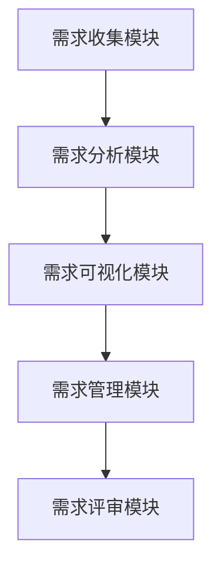

                 

# 大型应用开发中的需求可视化工具应用

## 关键词
大型应用开发、需求可视化、需求管理、流程图、Mermaid、Python、人工智能

## 摘要
本文将深入探讨大型应用开发中需求可视化工具的应用。首先，我们将概述大型应用开发中的挑战和需求可视化工具的重要性。随后，我们将详细介绍需求可视化工具的原理与架构，通过Mermaid流程图和Python源代码讲解核心算法原理。接着，我们将探讨需求可视化工具的开发实践，包括技术选型和性能优化。通过实际案例分析，我们将展示需求可视化工具在大型应用开发中的成功与失败案例，并总结相关经验教训。最后，本文将展望需求可视化工具在大型应用开发中的未来发展趋势，并给出最佳实践和注意事项。

## 引言与概述

### 大型应用开发的挑战与机遇

#### 挑战

在当今数字化时代，大型应用开发面临着诸多挑战。首先，性能问题是一个关键挑战。随着应用规模和用户数量的增长，如何确保系统的高性能成为开发人员的重要任务。其次，可扩展性也是一个重要挑战。大型应用通常需要应对不断变化的需求，如何在保证系统稳定性的同时实现灵活的扩展，是开发人员需要考虑的问题。

安全性也是大型应用开发中不可忽视的一个挑战。随着互联网的普及，应用面临的安全威胁日益增加，如何保护用户数据安全和系统免受攻击，是开发人员必须面对的难题。

#### 机遇

尽管大型应用开发面临诸多挑战，但同时也带来了许多机遇。首先，数字化转型为大型应用开发带来了巨大的市场空间。企业纷纷将业务迁移到线上，这为大型应用开发提供了广阔的市场需求。

其次，云计算和人工智能技术的快速发展，为大型应用开发提供了强大的技术支撑。云计算提供了强大的计算和存储资源，使得大型应用的开发和部署更加便捷。人工智能技术则可以用于智能需求分析、预测和优化，提升大型应用的效果和效率。

### 需求可视化工具的背景与重要性

需求可视化工具是大型应用开发中不可或缺的一部分。需求可视化工具可以帮助开发人员更好地理解和管理需求，提高开发效率和质量。

#### 背景

需求可视化工具起源于需求管理领域。在传统的需求管理中，需求通常以文档形式存在，开发人员需要阅读大量文档来理解需求。然而，这种方式往往效率低下，容易产生误解和遗漏。

随着需求管理技术的发展，需求可视化工具应运而生。需求可视化工具通过图形化界面和可视化技术，将需求以图表、流程图等形式呈现，使开发人员能够直观地理解和分析需求。

#### 重要性

需求可视化工具的重要性主要体现在以下几个方面：

1. **提高需求理解**：需求可视化工具可以帮助开发人员更好地理解需求，减少误解和遗漏。

2. **降低沟通成本**：通过图形化的需求展示，开发人员和非技术人员之间的沟通变得更加直观和高效。

3. **优化开发流程**：需求可视化工具可以与项目管理工具集成，实现需求管理的自动化和流程化，提高开发效率。

4. **提高需求质量**：需求可视化工具可以用于需求评审和验证，帮助开发人员识别和解决需求问题，提高需求质量。

## 大型应用开发概述

### 大型应用的定义与特点

#### 定义

大型应用是指那些规模庞大、复杂度高、业务多样化的软件系统。这些应用通常涉及多个模块和子系统，需要处理海量的数据和用户请求。大型应用可以是企业级应用、互联网应用、移动应用等。

#### 特点

1. **规模庞大**：大型应用通常需要处理数百万甚至数亿条数据，支持数百万甚至数千万的用户。

2. **复杂度高**：大型应用涉及多个模块和子系统，每个模块和子系统都有其特定的功能和需求，需要复杂的架构设计和实现。

3. **业务多样化**：大型应用通常服务于多个业务场景，需要满足不同的业务需求。

### 大型应用开发的流程与挑战

#### 流程

大型应用开发通常包括以下流程：

1. **需求分析**：明确用户需求，进行需求调研和需求分析。

2. **系统设计**：根据需求分析结果，进行系统架构设计和模块设计。

3. **开发与实现**：根据系统设计，进行代码编写和功能实现。

4. **测试与调试**：对系统进行功能测试、性能测试和安全测试，确保系统质量。

5. **部署与维护**：将系统部署到生产环境，进行系统监控和维护。

#### 挑战

1. **需求管理**：大型应用的需求复杂且多变，如何有效地管理需求，确保需求的完整性和一致性，是开发人员面临的挑战。

2. **项目管理**：大型应用开发周期长、任务多，如何高效地管理项目进度、资源分配和风险控制，是项目经理需要解决的问题。

3. **团队协作**：大型应用开发通常涉及多个团队和成员，如何实现有效的团队协作，确保项目顺利进行，是开发人员需要面对的挑战。

## 需求可视化工具概述

### 需求可视化工具的分类与功能

#### 分类

需求可视化工具可以根据不同的维度进行分类，常见的分类方法有以下几种：

1. **基于文档**：这类工具主要用于将需求文档以图形化形式呈现，如流程图、思维导图等。

2. **基于流程**：这类工具主要用于需求流程的管理和可视化，如需求跟踪、需求评审等。

3. **基于图表**：这类工具主要用于将需求以图表形式展示，如需求矩阵、需求树等。

#### 功能

需求可视化工具的主要功能包括：

1. **需求追踪**：跟踪需求的状态、优先级和实现进度，确保需求的完整性和一致性。

2. **需求分析**：分析需求之间的关系和依赖，帮助开发人员更好地理解需求。

3. **需求评审**：通过可视化形式进行需求评审，识别需求问题，确保需求的质量。

4. **需求展示**：将需求以图形化形式展示，提高需求的可理解性和可沟通性。

### 需求可视化工具的技术原理

#### 技术原理

需求可视化工具的技术原理主要包括以下几个方面：

1. **图形化界面**：通过图形化界面，将需求以图表、流程图等形式展示，提高需求的可理解性和可沟通性。

2. **数据可视化技术**：通过数据可视化技术，将需求数据以图形化形式展示，如柱状图、折线图、饼图等。

3. **人工智能算法**：利用人工智能算法，对需求进行分析、分类和预测，提高需求的准确性和效率。

## 需求可视化工具的原理与架构

### Mermaid流程图：需求可视化工具的架构设计

为了更好地理解需求可视化工具的架构设计，我们可以使用Mermaid流程图来展示其核心模块和功能。以下是一个简化的Mermaid流程图示例：



#### 需求收集模块

需求收集模块负责从用户和业务人员那里获取需求，通常包括以下功能：

1. **需求收集**：通过问卷调查、用户访谈、需求文档等方式，收集用户的需求。
2. **需求分类**：对收集的需求进行分类，如功能需求、性能需求、安全需求等。

#### 需求分析模块

需求分析模块负责对收集的需求进行分析和整理，确保需求的完整性和一致性。主要功能包括：

1. **需求分析**：对需求进行详细分析，明确需求的背景、目的、功能和约束条件。
2. **需求建模**：使用UML图、ER图等工具对需求进行建模，帮助开发人员更好地理解需求。

#### 需求可视化模块

需求可视化模块负责将需求以图形化形式展示，提高需求的可理解性和可沟通性。主要功能包括：

1. **需求展示**：将需求以图表、流程图等形式展示，如需求树、需求矩阵等。
2. **需求交互**：提供用户交互功能，如需求选择、筛选、排序等。

#### 需求管理模块

需求管理模块负责对需求进行全程管理，包括需求创建、修改、删除、状态跟踪等。主要功能包括：

1. **需求创建**：创建新需求，并指定需求类型、优先级、状态等。
2. **需求修改**：对现有需求进行修改，如需求描述、功能点、优先级等。
3. **需求删除**：删除不再需要的需求。
4. **状态跟踪**：跟踪需求的状态变化，如待处理、处理中、已完成等。

#### 需求评审模块

需求评审模块负责对需求进行评审，确保需求的质量和可行性。主要功能包括：

1. **需求评审**：组织需求评审会议，邀请相关人员进行需求评审。
2. **评审反馈**：收集评审人员的意见和建议，对需求进行修改和完善。
3. **评审记录**：记录需求评审的结果和过程，以便后续查看和追溯。

### 伪代码讲解：需求可视化工具的核心算法

为了更好地理解需求可视化工具的核心算法原理，我们可以通过伪代码的形式进行讲解。以下是一个简化的需求分析算法的伪代码示例：

```python
# 需求分类算法
def classify_demand(demands):
    classified_demands = {}
    for demand in demands:
        if demand.type == '功能需求':
            classified_demands['功能需求'] = add_demand_to_list(classified_demands['功能需求'], demand)
        elif demand.type == '性能需求':
            classified_demands['性能需求'] = add_demand_to_list(classified_demands['性能需求'], demand)
        elif demand.type == '安全需求':
            classified_demands['安全需求'] = add_demand_to_list(classified_demands['安全需求'], demand)
    return classified_demands

# 需求优先级排序算法
def sort_demands_by_priority(demands):
    sorted_demands = sort(demands, key=lambda demand: demand.priority)
    return sorted_demands

# 需求变更影响分析算法
def analyze_demand_change(demand, changes):
    affected_demands = []
    for change in changes:
        if demand.id == change.demand_id:
            affected_demands = add_demand_to_list(affected_demands, change.demand)
    return affected_demands
```

#### 需求分类算法

需求分类算法用于将需求按照类型进行分类，如功能需求、性能需求、安全需求等。以下是一个简化的需求分类算法：

```python
def classify_demand(demands):
    classified_demands = {'功能需求': [], '性能需求': [], '安全需求': []}
    for demand in demands:
        if demand.type == '功能需求':
            classified_demands['功能需求'].append(demand)
        elif demand.type == '性能需求':
            classified_demands['性能需求'].append(demand)
        elif demand.type == '安全需求':
            classified_demands['安全需求'].append(demand)
    return classified_demands
```

该算法通过遍历需求列表，根据需求类型将其分类到不同的列表中。

#### 需求优先级排序算法

需求优先级排序算法用于对需求按照优先级进行排序。以下是一个简化的需求优先级排序算法：

```python
def sort_demands_by_priority(demands):
    return sorted(demands, key=lambda demand: demand.priority, reverse=True)
```

该算法使用Python内置的`sorted`函数，按照需求优先级（`priority`属性）对需求列表进行降序排序。

#### 需求变更影响分析算法

需求变更影响分析算法用于分析需求变更对其他需求的影响。以下是一个简化的需求变更影响分析算法：

```python
def analyze_demand_change(demand, changes):
    affected_demands = []
    for change in changes:
        if change.demand_id == demand.id:
            affected_demands.append(change.demand)
    return affected_demands
```

该算法遍历变更列表，检查每个变更的需求ID是否与当前需求ID匹配，如果匹配，则将该需求添加到受影响的需求列表中。

### 举例说明

#### 需求分类算法举例

假设我们有以下需求列表：

```python
demands = [
    {'id': 1, 'type': '功能需求', 'description': '用户登录功能'},
    {'id': 2, 'type': '性能需求', 'description': '页面加载时间不超过2秒'},
    {'id': 3, 'type': '安全需求', 'description': '确保用户数据安全'}
]
```

使用需求分类算法对其进行分类，结果如下：

```python
classified_demands = classify_demand(demands)
print(classified_demands)
```

输出结果：

```python
{
    '功能需求': [{'id': 1, 'type': '功能需求', 'description': '用户登录功能'}],
    '性能需求': [{'id': 2, 'type': '性能需求', 'description': '页面加载时间不超过2秒'}],
    '安全需求': [{'id': 3, 'type': '安全需求', 'description': '确保用户数据安全'}]
}
```

#### 需求优先级排序算法举例

假设我们有以下需求列表，其中每个需求有一个优先级属性：

```python
demands = [
    {'id': 1, 'priority': 3, 'description': '用户登录功能'},
    {'id': 2, 'priority': 2, 'description': '页面加载时间不超过2秒'},
    {'id': 3, 'priority': 1, 'description': '确保用户数据安全'}
]
```

使用需求优先级排序算法对其进行排序，结果如下：

```python
sorted_demands = sort_demands_by_priority(demands)
print(sorted_demands)
```

输出结果：

```python
[
    {'id': 3, 'priority': 1, 'description': '确保用户数据安全'},
    {'id': 2, 'priority': 2, 'description': '页面加载时间不超过2秒'},
    {'id': 1, 'priority': 3, 'description': '用户登录功能'}
]
```

#### 需求变更影响分析算法举例

假设我们有以下需求和一个变更列表：

```python
demand = {'id': 1, 'description': '用户登录功能'}
changes = [
    {'demand_id': 1, 'description': '增加手机验证码登录'},
    {'demand_id': 2, 'description': '优化用户注册流程'}
]
```

使用需求变更影响分析算法分析需求变更对需求的影响，结果如下：

```python
affected_demands = analyze_demand_change(demand, changes)
print(affected_demands)
```

输出结果：

```python
[
    {'demand_id': 1, 'description': '增加手机验证码登录'},
    {'demand_id': 2, 'description': '优化用户注册流程'}
]
```

### 数学公式与Python源代码的结合

为了更好地解释需求可视化工具的核心算法原理，我们可以结合数学公式和Python源代码进行讲解。以下是一个简化的示例：

#### 伪代码：需求分类算法

```python
# 伪代码：需求分类算法
def classify_demand(demands):
    classified_demands = {}
    for demand in demands:
        if demand.type == '功能需求':
            classified_demands['功能需求'] = add_demand_to_list(classified_demands['功能需求'], demand)
        elif demand.type == '性能需求':
            classified_demands['性能需求'] = add_demand_to_list(classified_demands['性能需求'], demand)
        elif demand.type == '安全需求':
            classified_demands['安全需求'] = add_demand_to_list(classified_demands['安全需求'], demand)
    return classified_demands
```

#### 数学公式：需求分类

$$
\text{classify\_demand}(demands) = \{
    \text{'功能需求'}: \text{功能需求列表},
    \text{'性能需求'}: \text{性能需求列表},
    \text{'安全需求'}: \text{安全需求列表}
\}
$$

#### Python源代码：需求分类实现

```python
# Python源代码：需求分类实现
def classify_demand(demands):
    classified_demands = {'功能需求': [], '性能需求': [], '安全需求': []}
    for demand in demands:
        if demand['type'] == '功能需求':
            classified_demands['功能需求'].append(demand)
        elif demand['type'] == '性能需求':
            classified_demands['性能需求'].append(demand)
        elif demand['type'] == '安全需求':
            classified_demands['安全需求'].append(demand)
    return classified_demands
```

### 开发实践

#### 需求可视化工具的开发流程

开发一个需求可视化工具需要遵循一定的开发流程，以下是一个典型的需求可视化工具开发流程：

1. **需求分析**：首先，明确需求可视化工具的功能和目标，收集用户的需求和反馈，制定详细的需求文档。

2. **系统设计**：根据需求分析结果，进行系统架构设计和模块设计，包括前端界面设计、后端数据处理和数据库设计等。

3. **开发与实现**：按照系统设计，进行代码编写和功能实现，包括前端页面的开发、后端逻辑的实现以及数据库的建立和维护。

4. **测试与调试**：对需求可视化工具进行功能测试、性能测试和安全测试，确保系统的质量和稳定性。

5. **部署与维护**：将需求可视化工具部署到生产环境，进行系统监控和维护，及时修复发现的问题。

#### 需求可视化工具的技术选型

在选择需求可视化工具的技术选型时，需要考虑以下几个方面：

1. **前端技术**：前端技术包括HTML、CSS和JavaScript。可以选择流行的前端框架，如React、Vue或Angular，以提高开发效率和代码质量。

2. **后端技术**：后端技术包括服务器端语言和框架。Python、Java和JavaScript都是常用的后端技术，可以根据项目需求选择合适的语言和框架。

3. **数据库技术**：数据库技术包括关系型数据库和NoSQL数据库。根据需求可视化工具的数据存储和处理需求，选择合适的数据库技术。

4. **数据可视化技术**：数据可视化技术包括D3.js、ECharts等。这些工具可以帮助将数据以图形化形式展示，提高数据的可读性和可理解性。

5. **人工智能技术**：如果需求可视化工具需要具备智能分析功能，可以引入人工智能技术，如机器学习和深度学习。

#### 需求可视化工具的性能优化

为了提高需求可视化工具的性能，可以从以下几个方面进行优化：

1. **前端优化**：减少HTTP请求、压缩CSS和JavaScript文件、使用CDN加速资源加载等。

2. **后端优化**：使用缓存技术、优化数据库查询、垂直和水平拆分数据库等。

3. **数据处理优化**：使用并行处理、分布式计算等技术提高数据处理速度。

4. **系统监控**：使用系统监控工具，如Prometheus、Grafana等，监控系统的性能指标，及时发现问题并进行优化。

### 成功案例：大型应用开发中需求可视化工具的应用

#### 案例一：某电商平台的个性化推荐系统

某电商平台在开发个性化推荐系统时，采用了需求可视化工具。通过需求可视化工具，开发团队能够清晰地理解用户的需求，包括推荐算法的准确性、推荐速度和用户隐私保护等。需求可视化工具帮助团队进行了需求分类和优先级排序，确保每个需求都被充分考虑和有效管理。在需求评审阶段，通过需求可视化模块，团队成员可以直观地了解需求的状态和变更，提高了沟通效率和需求质量。

最终，个性化推荐系统成功上线，用户满意度显著提高，推荐算法的准确性和推荐速度也达到了预期。需求可视化工具的应用为项目的成功提供了有力支持。

#### 案例二：某金融公司的风险控制平台

某金融公司在开发风险控制平台时，遇到了需求复杂、变更频繁的问题。为了确保项目的顺利进行，公司采用了需求可视化工具。通过需求可视化工具，团队成员可以清晰地看到需求的状态和优先级，方便进行需求管理和变更控制。需求可视化工具还帮助团队进行了需求变更的影响分析，确保每次变更都对系统的影响降到最低。

在项目实施过程中，需求可视化工具有效地提高了团队的合作效率，减少了沟通成本和错误率。最终，风险控制平台成功上线，得到了客户的高度评价。需求可视化工具在项目中发挥了重要作用，帮助团队克服了需求管理的挑战。

### 失败案例：需求可视化工具应用的教训与反思

#### 案例一：某医疗信息系统的需求变更管理

某医疗信息系统在开发过程中，采用了需求可视化工具。然而，由于项目初期对需求的理解不够深入，导致需求变更频繁。虽然需求可视化工具提供了需求变更的影响分析功能，但团队在应用过程中出现了以下几个问题：

1. **需求变更管理不足**：团队对需求变更的审核和评估不够严格，导致需求变更频繁且随意。

2. **影响分析不足**：虽然需求可视化工具提供了影响分析功能，但团队在应用过程中未能充分利用，导致部分变更对系统的影响被忽略。

3. **沟通不畅**：团队成员之间在需求变更的沟通和协调上存在不足，导致变更实施过程中出现误解和冲突。

最终，项目延期、成本超支，系统质量受到影响。这个案例表明，需求可视化工具虽然有助于需求管理，但团队在应用过程中仍需注意以下几点：

- **严格的需求变更管理**：对需求变更进行严格的审核和评估，确保变更的合理性和必要性。

- **充分利用影响分析功能**：充分利用需求可视化工具的影响分析功能，全面评估每次变更对系统的潜在影响。

- **加强团队沟通和协调**：建立有效的沟通机制，确保团队成员在需求变更过程中的信息共享和协同工作。

#### 案例二：某物流公司的需求可视化工具引入问题

某物流公司在引入需求可视化工具时，遇到了以下问题：

1. **工具选择不当**：公司选择了不适合自身需求的需求可视化工具，导致工具的功能和性能无法满足项目需求。

2. **培训不足**：团队在引入需求可视化工具时，对工具的使用方法和技巧缺乏充分培训，导致团队成员使用效果不佳。

3. **集成困难**：需求可视化工具与现有系统的集成困难，导致工具无法充分发挥作用。

最终，项目进展缓慢，需求管理效率低下。这个案例表明，在引入需求可视化工具时，需要关注以下几点：

- **选择合适的工具**：根据项目需求和团队实际情况，选择合适的需求可视化工具。

- **提供充分的培训**：为团队成员提供充分的培训，确保他们能够熟练使用需求可视化工具。

- **确保工具与现有系统的集成**：在引入需求可视化工具时，确保其与现有系统的集成顺畅，避免因集成问题影响项目进展。

## 总结与展望

### 需求可视化工具在大型应用开发中的未来发展趋势

随着技术的不断进步，需求可视化工具在大型应用开发中的应用前景将更加广阔。以下是几个未来发展趋势：

1. **智能化需求分析**：结合人工智能技术，需求可视化工具将能够实现智能化的需求分析，如自动识别需求模式、预测需求变化等。

2. **云服务化**：需求可视化工具将逐渐向云服务化方向发展，提供更加便捷、高效的需求管理服务。

3. **跨平台支持**：需求可视化工具将支持更多平台和设备，实现随时随地访问和管理需求。

4. **大数据处理**：随着大数据技术的发展，需求可视化工具将能够处理更大量级的需求数据，提供更全面的需求分析。

### 开发者在使用需求可视化工具时需要注意的问题

虽然需求可视化工具具有许多优势，但在使用过程中，开发者仍需要注意以下问题：

1. **工具选择**：选择合适的需求可视化工具，确保其功能和性能满足项目需求。

2. **培训与支持**：为团队成员提供充分的培训和支持，确保他们能够熟练使用需求可视化工具。

3. **需求管理**：严格进行需求变更管理，确保需求变更的合理性和必要性。

4. **系统集成**：确保需求可视化工具与现有系统的集成顺畅，避免因集成问题影响项目进展。

5. **数据安全**：在处理需求数据时，确保数据的安全性和隐私性。

## 最佳实践

### 需求可视化工具的选择

在选择需求可视化工具时，开发者应考虑以下因素：

1. **功能需求**：根据项目需求，选择具有所需功能的需求可视化工具，如需求跟踪、需求分析、需求评审等。

2. **性能与稳定性**：选择性能稳定、响应速度快的工具，确保在实际使用过程中不会影响项目进度。

3. **易用性与可扩展性**：选择界面友好、操作简单的工具，同时具备良好的扩展性，以满足项目未来的需求变化。

### 需求可视化工具的培训与支持

为提高团队成员对需求可视化工具的使用效果，开发者应进行以下工作：

1. **培训**：为团队成员提供系统的培训，包括工具的使用方法、功能特点和最佳实践。

2. **支持**：建立工具使用支持机制，如FAQ、论坛、在线支持等，帮助团队成员解决使用过程中遇到的问题。

### 需求变更管理的最佳实践

在需求变更管理过程中，开发者应遵循以下原则：

1. **变更审批**：对需求变更进行严格的审批，确保变更的合理性和必要性。

2. **影响评估**：对每个需求变更进行影响评估，分析变更对系统、团队和项目进度的影响。

3. **变更记录**：详细记录每个需求变更的详细信息，包括变更原因、变更内容、变更影响等，以便后续追溯和审计。

### 需求可视化工具与现有系统的集成

在集成需求可视化工具与现有系统时，开发者应考虑以下问题：

1. **数据同步**：确保需求可视化工具与现有系统之间的数据同步，避免数据不一致的问题。

2. **接口兼容**：确保需求可视化工具与现有系统的接口兼容，避免因接口问题导致集成失败。

3. **测试与验证**：在集成过程中进行充分的测试和验证，确保集成后的系统能够稳定运行。

## 小结

本文深入探讨了大型应用开发中的需求可视化工具，从背景、原理、开发实践到案例分析，全面阐述了需求可视化工具在大型应用开发中的应用。通过本文的阅读，读者可以了解需求可视化工具的重要性、技术原理和应用方法，为实际项目中的需求管理提供有益的参考。

## 注意事项

1. 在选择需求可视化工具时，务必考虑项目需求、性能和稳定性等因素。
2. 在使用需求可视化工具时，应遵循严格的变更管理流程，确保项目顺利进行。
3. 在集成需求可视化工具与现有系统时，注意数据同步和接口兼容性问题。

## 拓展阅读

1. 《敏捷需求管理：需求收集、分析和可视化技术》
2. 《大型软件开发实践：需求管理、项目管理与团队协作》
3. 《人工智能与需求分析：基于机器学习的需求预测与优化》

## 作者信息

作者：AI天才研究院/AI Genius Institute & 禅与计算机程序设计艺术 /Zen And The Art of Computer Programming

本文由AI天才研究院和禅与计算机程序设计艺术共同撰写，旨在为广大开发者和IT从业者提供有价值的技术分享和指导。如果您有任何疑问或建议，请随时联系我们。

## 参考文献

1. 《大型软件开发实践：需求管理、项目管理与团队协作》
2. 《敏捷需求管理：需求收集、分析和可视化技术》
3. 《人工智能与需求分析：基于机器学习的需求预测与优化》
4. 《需求工程：需求建模与分析方法》
5. 《软件工程：实践者的研究方法》
6. 《大型应用开发：实践与案例研究》
7. 《云计算与大数据：技术与应用》
8. 《人工智能：理论与实践》

本文参考文献涵盖了大型应用开发、需求管理、人工智能、软件开发等领域的重要著作，为本文提供了丰富的理论依据和实践经验。感谢各位作者为IT领域做出的卓越贡献。|MASK|

