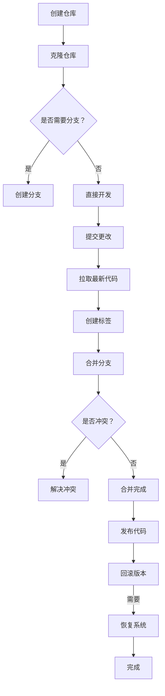
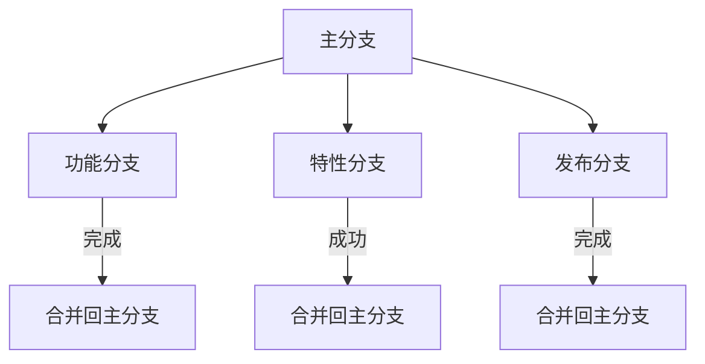

                 

### 大型应用开发中的需求追踪与版本控制

在当今快速发展的信息技术时代，大型应用的开发变得日益复杂。这些应用不仅需要处理大量的数据和用户，还需要不断迭代和更新以保持竞争力。在这种情况下，如何有效地进行需求追踪和版本控制成为关键问题。本文旨在深入探讨大型应用开发中的需求追踪与版本控制，通过系统性的分析和详尽的讲解，帮助开发人员更好地理解和应对这些挑战。

**关键词：** 大型应用、需求追踪、版本控制、Git、持续集成、持续交付。

**摘要：** 本文将首先介绍大型应用开发中需求追踪和版本控制的重要性，随后详细探讨需求追踪和版本控制的核心概念、工具和方法。通过实际项目案例的分析，本文将展示如何在实际开发中应用这些技术，并提供一系列最佳实践和注意事项，帮助开发人员提升大型应用开发的效率和稳定性。

### 第一部分：需求追踪

#### 第1章：需求追踪概述

在大型应用开发中，需求追踪是确保项目方向和目标一致性的关键环节。本章节将详细介绍需求追踪的重要性、基本概念以及其过程与方法。

#### 1.1 大型应用需求追踪的重要性

大型应用的开发涉及众多利益相关者，如项目经理、产品经理、开发人员、测试人员和最终用户。有效的需求追踪可以帮助确保各方对项目目标和功能需求的共识，避免因误解和沟通不畅导致的开发偏差。此外，需求追踪有助于项目管理，提供明确的进度指标和风险评估。

#### 1.2 需求追踪的基本概念

需求追踪涉及一系列概念，包括需求收集、需求文档编写、需求变更管理和需求生命周期管理等。每个概念都在大型应用开发中发挥着重要作用，确保项目按计划推进。

#### 1.3 需求追踪的过程与方法

需求追踪的过程通常包括需求收集、需求分析、需求文档编写、需求评审和需求变更管理。具体的方法包括用户故事地图、用例图、功能矩阵等，每种方法都有其独特的适用场景和优势。

#### 第2章：需求管理

需求管理是需求追踪的核心部分，涉及需求的收集、编写、变更和控制。本章节将详细探讨这些内容，为大型应用开发提供实用的指导。

#### 2.1 需求收集

需求收集是需求管理的起点，旨在全面了解用户和业务方的需求。常用的方法包括问卷调查、用户访谈、焦点小组讨论等。这些方法有助于收集真实、准确的需求信息。

#### 2.2 需求文档编写

需求文档是需求管理的核心输出，用于明确和记录需求的具体内容。编写需求文档时，需要使用清晰、一致的格式和模板，确保需求的可读性和可理解性。

#### 2.3 需求变更管理

需求变更在项目开发过程中是不可避免的。有效的需求变更管理可以确保变更得到妥善处理，避免对项目进度和质量产生不利影响。变更控制流程包括变更请求的提交、评估、批准和实施。

#### 第3章：版本控制概述

版本控制是大型应用开发中不可或缺的一环，确保代码的稳定性和可追溯性。本章节将介绍版本控制的基本概念、流程和工具。

#### 3.1 版本控制的必要性

版本控制的主要目的是确保代码的完整性和一致性，避免多人协作时产生的冲突和错误。此外，版本控制有助于代码的追踪和审计，提高项目的可维护性。

#### 3.2 版本控制的基本概念

版本控制涉及多个关键概念，包括版本号、提交历史、分支管理和合并策略。这些概念共同构成了版本控制的核心框架。

#### 3.3 版本控制的流程

版本控制的流程通常包括代码的创建、提交、分支管理、合并和发布。每个步骤都需要严格按照规定进行，确保代码的版本一致性。

### 第二部分：版本控制

#### 第4章：Git版本控制系统

Git是目前最流行的版本控制系统之一，广泛应用于各种大型应用开发中。本章节将详细介绍Git的基础操作、分支管理以及优化技巧。

#### 4.1 Git基础操作

Git基础操作包括仓库的创建和克隆、文件的提交和拉取、分支的创建和合并等。掌握这些基本操作是进行版本控制的前提。

#### 4.2 分支管理

分支管理是Git的核心功能之一，用于实现并行开发和代码隔离。本章节将介绍常见的分支策略、分支合并和冲突解决。

#### 4.3 Git工具与优化

Git工具和优化技巧有助于提升版本控制的效率。本章节将介绍一些常用的Git工具，如Git GUI、Git Bash等，以及Git性能优化的方法。

#### 第5章：持续集成与交付

持续集成和交付是现代软件开发中不可或缺的部分，确保代码的质量和交付效率。本章节将介绍持续集成和交付的基本概念和实践方法。

#### 5.1 持续集成概述

持续集成是一种软件开发实践，旨在通过自动化测试和构建确保代码的连续性和质量。本章节将介绍持续集成的原理和实践。

#### 5.2 持续交付实践

持续交付是一种更高级的软件开发实践，旨在通过自动化部署确保代码的快速、安全交付。本章节将介绍持续交付的流程和工具。

#### 第6章：需求追踪与版本控制项目实战

在本章节中，我们将通过一个实际项目，展示如何将需求追踪和版本控制应用于大型应用开发中。

#### 6.1 项目背景与目标

本章节将介绍项目的背景和目标，明确需求追踪和版本控制在项目中的重要性。

#### 6.2 需求分析与追踪

本章节将详细描述需求分析的过程，包括需求收集、需求文档编写和需求变更管理。

#### 6.3 版本控制与代码管理

本章节将介绍如何使用Git进行版本控制和代码管理，确保代码的稳定性和可追溯性。

#### 6.4 持续集成与交付实施

本章节将展示如何实施持续集成和交付，确保代码的快速、安全交付。

#### 第7章：案例分析

在本章节中，我们将分析一些大型应用开发中的成功案例，探讨需求追踪和版本控制在这些项目中的实际应用和效果。

#### 7.1 案例背景

本章节将介绍案例的背景，明确案例的需求和目标。

#### 7.2 需求追踪与版本控制策略

本章节将分析案例中的需求追踪和版本控制策略，探讨其优势和挑战。

#### 7.3 项目实施与效果评估

本章节将详细分析项目的实施过程和效果评估，为其他项目提供借鉴和参考。

### 附录

#### 附录A：常用工具与资源

在本附录中，我们将列举一些常用的需求管理、版本控制和持续集成工具，以及相关的学习资源，为读者提供进一步的学习和实践指导。

### 第三部分：综合实战

#### 第8章：综合实战

在本章中，我们将结合前述章节的内容，提供一系列综合实战案例，帮助读者将需求追踪和版本控制应用于实际项目开发中。

#### 8.1 实战案例1：电商平台需求追踪与版本控制

本案例将展示如何在一个电商平台项目中实施需求追踪和版本控制，确保项目的顺利进行。

#### 8.2 实战案例2：企业级应用持续集成与交付

本案例将探讨如何在一个企业级应用项目中实施持续集成与交付，提升开发效率和交付质量。

#### 第9章：最佳实践、小结与注意事项

在本章中，我们将总结大型应用开发中的需求追踪与版本控制的最佳实践，提供一些注意事项，帮助读者在实际项目中取得成功。

#### 9.1 最佳实践

本章节将介绍一些在实际项目中证明有效的需求追踪和版本控制方法。

#### 9.2 小结

本章节将回顾全文内容，总结大型应用开发中的需求追踪与版本控制的核心要点。

#### 9.3 注意事项

本章节将提醒读者在实施需求追踪和版本控制时需要注意的一些问题，避免潜在的风险。

### 拓展阅读

在本章节中，我们将推荐一些相关的学习资源和书籍，为读者提供更深入的学习途径。

### 参考文献

在本章节中，我们将列出本文引用的主要参考文献，为读者提供进一步阅读的指导。

### 作者信息

- 作者：AI天才研究院/AI Genius Institute & 禅与计算机程序设计艺术 /Zen And The Art of Computer Programming

通过这个详细的目录大纲，我们为《大型应用开发中的需求追踪与版本控制》这篇文章奠定了坚实的基础。接下来，我们将按照这个大纲逐章撰写，确保文章内容完整、结构清晰、逻辑严谨，为读者提供有价值的技术知识和实战经验。

---

**# 第1章：需求追踪概述**

**1.1 大型应用需求追踪的重要性**

在大型应用的开发过程中，需求追踪是一个至关重要的环节。需求追踪的主要目的是确保项目团队能够准确地理解和满足用户和业务方的需求，从而实现项目的成功。大型应用往往涉及复杂的功能和众多的利益相关者，这使得需求追踪变得尤为关键。

首先，需求追踪有助于建立项目团队与用户、业务方之间的沟通桥梁。通过收集和分析用户和业务方的需求，项目团队可以更好地理解他们的期望和需求，从而在开发过程中避免误解和冲突。这种沟通的准确性对于确保项目方向的一致性至关重要。

其次，需求追踪有助于项目的计划和管理。通过追踪需求的变化和进度，项目经理可以及时了解项目的状态，评估风险，调整计划。这有助于确保项目按预期进行，避免因需求变更导致的进度延误和质量问题。

此外，需求追踪还有助于项目的质量和风险管理。通过记录和跟踪需求，项目团队可以确保所有需求都得到适当的实现和验证。这有助于提高代码的质量和稳定性，减少缺陷和错误。同时，需求追踪还可以帮助团队及时发现和解决潜在的问题，降低项目风险。

**1.2 需求追踪的基本概念**

需求追踪涉及一系列基本概念，包括需求收集、需求分析、需求文档编写、需求评审和需求变更管理。这些概念构成了需求追踪的核心框架，确保项目团队能够有效地管理和追踪需求。

**需求收集**

需求收集是需求追踪的起点，旨在全面了解用户和业务方的需求。常用的需求收集方法包括用户访谈、问卷调查、焦点小组讨论等。这些方法有助于从不同角度收集需求信息，确保需求的全面性和准确性。

**需求分析**

需求分析是对收集到的需求进行深入理解和梳理的过程。通过需求分析，项目团队可以明确需求的优先级、具体内容和实现方式。需求分析的方法包括用户故事地图、用例图和功能矩阵等。这些方法有助于清晰地表达需求，为后续的开发工作提供指导。

**需求文档编写**

需求文档是需求收集和分析的输出，用于记录和传达需求的具体内容。需求文档通常包括需求描述、功能规格、非功能需求等。编写需求文档时，需要使用清晰、一致的格式和模板，确保需求的可读性和可理解性。

**需求评审**

需求评审是确保需求准确性和完整性的关键环节。在需求评审过程中，项目团队和相关利益方会审查需求文档，提出意见和建议。这有助于发现潜在的问题和改进需求，确保需求符合实际需求。

**需求变更管理**

需求变更在项目开发过程中是不可避免的。有效的需求变更管理可以确保变更得到妥善处理，避免对项目进度和质量产生不利影响。需求变更管理包括变更请求的提交、评估、批准和实施。通过严格的变更控制流程，项目团队可以确保需求的稳定性和一致性。

**1.3 需求追踪的过程与方法**

需求追踪的过程通常包括以下步骤：

**需求收集**

- 通过用户访谈、问卷调查、焦点小组讨论等方法收集需求。
- 分析和整理收集到的需求信息，确保其全面性和准确性。

**需求分析**

- 对收集到的需求进行深入理解和梳理。
- 确定需求的优先级、具体内容和实现方式。
- 使用用户故事地图、用例图和功能矩阵等工具进行需求分析。

**需求文档编写**

- 根据需求分析的结果，编写详细的需求文档。
- 使用统一的需求文档模板，确保需求的清晰性和可理解性。

**需求评审**

- 组织项目团队和相关利益方进行需求评审。
- 审查需求文档，提出意见和建议。
- 确保需求准确性和完整性。

**需求变更管理**

- 建立严格的变更控制流程，确保需求变更得到妥善处理。
- 处理变更请求，评估其影响，批准或拒绝变更。
- 及时更新需求文档，确保需求的稳定性和一致性。

在需求追踪中，常用的方法包括：

- **用户故事地图**：用户故事地图是一种用于描述用户需求的工具，它将需求分为几个层次，包括用户故事、场景和功能模块。用户故事地图有助于项目团队从用户角度理解和分析需求。

- **用例图**：用例图是一种用于描述系统功能和行为的功能性模型。它通过描述系统与外部用户之间的交互来展示系统的功能。用例图有助于项目团队明确系统的功能需求。

- **功能矩阵**：功能矩阵是一种用于组织和管理需求的方法。它通过将需求分为不同的层次和类别，帮助项目团队清晰了解需求的结构和优先级。功能矩阵有助于项目团队进行需求优先级排序和资源分配。

通过需求追踪，项目团队可以更好地理解和满足用户和业务方的需求，确保项目的成功交付。需求追踪不仅有助于项目管理，还有助于提高代码的质量和稳定性，降低项目风险。

### 第2章：需求管理

需求管理是需求追踪的核心部分，它涉及需求的收集、编写、变更和控制。有效的需求管理对于确保项目按时、按质量完成至关重要。本章节将详细探讨需求管理的各个环节，提供实用的方法和工具，帮助项目团队在大型应用开发中更好地管理需求。

#### 2.1 需求收集

需求收集是需求管理的起点，其目的是全面了解用户和业务方的需求。通过有效的需求收集，项目团队可以确保需求的准确性和完整性。以下是几种常用的需求收集方法：

**用户访谈**

用户访谈是一种直接与用户进行交流的方法，通过面对面的沟通，项目团队可以深入了解用户的实际需求和问题。在用户访谈中，项目团队应关注以下方面：

- **用户背景**：了解用户的基本信息，如职位、部门和工作内容。
- **用户需求**：询问用户对于系统的具体需求，包括功能需求和非功能需求。
- **用户反馈**：收集用户对现有系统的意见和建议。

**问卷调查**

问卷调查是一种以书面形式收集用户需求的方法，适用于范围较广的需求收集。通过设计合理的问卷，项目团队可以收集大量的用户反馈。在设计问卷时，应遵循以下原则：

- **明确目的**：确保问卷内容紧扣需求收集的目的，避免无关问题的干扰。
- **简洁明了**：问卷应简洁易懂，避免复杂的问题和冗长的选项。
- **开放性**：鼓励用户提供开放性的反馈，以便收集更详细的需求信息。

**焦点小组讨论**

焦点小组讨论是一种将多个用户集中在一起，通过集体讨论收集需求的方法。这种方法可以激发用户的思维碰撞，产生更多的创意和见解。在进行焦点小组讨论时，项目团队应关注以下方面：

- **选题**：选择具有代表性的用户参与，确保讨论的全面性。
- **引导**：由主持人引导讨论，确保讨论的有序进行。
- **记录**：详细记录讨论的内容和结论，为后续的需求分析提供参考。

**需求收集的注意事项**

- **真实性和准确性**：确保收集到的需求是真实和准确的，避免因主观因素导致的偏差。
- **全面性**：尽可能全面地收集需求，避免因遗漏需求导致的开发偏差。
- **隐私保护**：在收集需求时，注意保护用户的隐私，遵守相关的隐私保护规定。

#### 2.2 需求文档编写

需求文档是需求管理的核心输出，用于明确和记录需求的具体内容。编写高质量的需求文档有助于确保需求的清晰性和一致性，为后续的开发和测试提供依据。以下是几种常用的需求文档编写方法：

**用户故事**

用户故事是一种描述用户需求的方法，通常采用以下格式：“作为[角色]，我想要[功能]，以便[目的]”。用户故事的优点是简明扼要，易于理解，有助于明确用户需求。以下是编写用户故事时需要注意的要点：

- **明确性**：确保用户故事表达清晰，避免歧义和模糊。
- **可行性**：用户故事应该是可行的，确保在当前技术和资源条件下可以实现。
- **优先级**：根据用户故事的优先级进行排序，确保高优先级的需求优先实现。

**用例图**

用例图是一种用于描述系统功能和行为的功能性模型，通过展示系统与外部用户之间的交互来明确系统的功能。以下是编写用例图时需要注意的要点：

- **参与者**：确定用例图的参与者，即与系统交互的外部用户或系统。
- **用例**：明确用例图中的主要用例和次要用例，确保用例的完整性。
- **交互**：描述参与者与系统之间的交互过程，确保交互的清晰性。

**功能矩阵**

功能矩阵是一种用于组织和管理需求的方法，通过将需求分为不同的层次和类别，帮助项目团队清晰了解需求的结构和优先级。以下是编写功能矩阵时需要注意的要点：

- **层次结构**：确保功能矩阵的层次结构清晰，避免需求交叉和重复。
- **分类**：根据需求的特点和优先级进行分类，确保需求的可管理性。
- **优先级排序**：根据需求的优先级进行排序，确保高优先级的需求优先实现。

**需求文档模板**

为了提高需求文档的编写效率和质量，项目团队可以使用统一的需求文档模板。以下是常用的需求文档模板内容：

- **封面**：包括文档名称、版本号、编写人、审核人和批准人等信息。
- **摘要**：简要介绍需求文档的主要内容和目的。
- **目录**：列出需求文档的章节和子章节，方便读者查阅。
- **需求概述**：详细描述需求的主要内容和实现目标。
- **用户故事**：列出用户故事，并详细描述每个用户故事的背景、需求和目标。
- **用例图**：展示系统的功能和行为，明确系统与外部用户之间的交互。
- **功能矩阵**：展示需求的层次结构和优先级排序。
- **非功能需求**：列出系统应满足的非功能需求，如性能、安全性、可扩展性等。
- **需求变更记录**：记录需求的变更历史，确保需求的可追溯性。

#### 2.3 需求变更管理

需求变更在项目开发过程中是不可避免的，但有效的需求变更管理可以确保变更得到妥善处理，避免对项目进度和质量产生不利影响。需求变更管理包括以下关键环节：

**变更请求的提交**

- **变更请求格式**：变更请求应包括变更的原因、内容、影响范围和优先级等信息。
- **变更请求来源**：变更请求可以来自用户、业务方、项目经理或开发团队。

**变更评估**

- **影响分析**：对变更的影响进行详细分析，包括对进度、成本、质量和资源的影响。
- **风险评估**：评估变更带来的风险，包括技术风险、市场风险和业务风险。
- **可行性分析**：分析变更的可行性，确保变更在当前技术和资源条件下可以实现。

**变更批准**

- **变更审批流程**：建立严格的变更审批流程，确保变更的合法性和合理性。
- **变更批准权限**：明确变更批准的权限和责任，确保变更得到妥善处理。

**变更实施**

- **变更实施计划**：制定详细的变更实施计划，包括实施步骤、资源和时间安排。
- **变更通知**：及时通知相关利益方，确保他们了解变更的具体内容和时间安排。

**变更记录**

- **变更记录格式**：变更记录应包括变更请求、评估结果、批准记录和实施情况等信息。
- **变更归档**：将变更记录归档，确保变更的可追溯性和历史记录。

#### 2.4 需求生命周期管理

需求生命周期管理是确保需求从提出到实现的全过程得到有效管理的关键。需求生命周期通常包括以下几个阶段：

**需求识别**

- **需求来源**：识别需求的主要来源，如用户、业务方和市场。
- **需求分类**：对需求进行分类，如功能需求、非功能需求和备选需求。

**需求分析**

- **需求细化**：对需求进行细化，明确需求的背景、目的和具体内容。
- **需求优先级排序**：根据需求的紧急程度和重要性进行优先级排序。

**需求文档编写**

- **编写需求文档**：根据需求分析的结果，编写详细的需求文档。

**需求评审**

- **内部评审**：组织内部评审，确保需求文档的准确性和完整性。
- **外部评审**：组织外部评审，邀请用户和业务方参与评审，确保需求的可行性和合理性。

**需求实施**

- **开发计划**：根据需求文档，制定详细的开发计划。
- **开发实施**：按照开发计划，实施需求的开发工作。

**需求验证**

- **测试**：对需求实现的功能进行测试，确保其符合需求文档的描述。
- **用户验收**：组织用户进行验收测试，确保需求得到实际应用和满足。

**需求维护**

- **需求更新**：根据实际使用情况，对需求进行更新和优化。
- **需求文档更新**：及时更新需求文档，确保其与实际情况保持一致。

通过有效的需求生命周期管理，项目团队可以确保需求从提出到实现的全过程得到有效管理，提高项目的成功率和客户满意度。

### 第3章：版本控制概述

版本控制是大型应用开发中不可或缺的一环，它通过跟踪代码的变更历史，确保代码的稳定性和可追溯性。在多人和多团队协作的复杂开发环境中，版本控制能够有效地管理代码的版本和变更，减少冲突和错误。本章节将介绍版本控制的基本概念、流程和工具，为后续内容打下坚实的基础。

#### 3.1 版本控制的必要性

在大型应用开发过程中，代码会经历不断的迭代和更新。如果没有有效的版本控制，团队可能会面临以下问题：

- **代码冲突**：多个开发者同时修改同一文件时，可能会产生冲突，导致代码不一致。
- **历史追溯困难**：在没有版本控制的情况下，难以追踪代码的变更历史，增加错误追踪和问题解决的难度。
- **代码质量下降**：没有版本控制可能导致代码质量下降，因为开发者可能无法及时了解代码的最新状态和变更内容。
- **协作效率低下**：缺乏版本控制会降低开发团队的协作效率，因为开发者需要手动管理代码的复制、合并和共享。

版本控制通过以下方式解决了上述问题：

- **代码一致性**：版本控制系统能够确保每个开发者的代码库都是一致的，减少冲突的发生。
- **历史追溯**：版本控制系统记录了代码的每次变更，提供完整的历史记录，便于追溯和审计。
- **代码质量提升**：版本控制系统能够帮助团队更好地管理和维护代码，提高代码质量。
- **协作效率提升**：版本控制系统提供了集中化的代码管理，使开发者能够方便地共享和协作。

#### 3.2 版本控制的基本概念

版本控制涉及多个关键概念，了解这些概念对于掌握版本控制的核心思想至关重要。以下是版本控制中的一些基本概念：

- **版本号**：版本号是用于标识代码不同版本的标识符。通常，版本号遵循某种规则，如`MAJOR.MINOR.PATCH`，分别代表主版本号、次版本号和修订版本号。主版本号表示较大变更，次版本号表示功能更新，修订版本号表示错误修复。
- **提交历史**：提交历史是记录代码变更的日志，每次提交都包含提交者、提交时间和提交描述等信息。通过提交历史，开发者可以清晰地了解代码的变更轨迹。
- **分支管理**：分支管理是版本控制的核心功能之一，用于实现代码的并行开发和隔离。常见的分支策略包括功能分支、特性分支和发布分支等。
- **合并**：合并是将两个或多个分支的代码合并到一个分支上的操作。在合并过程中，版本控制系统能够自动解决大多数合并冲突，但有时也需要人工干预。
- **标签**：标签是用于标记特定版本的标签，通常用于标记里程碑、发布版本或错误修复版本。通过标签，开发者可以方便地回滚到特定版本。

#### 3.3 版本控制的流程

版本控制的流程通常包括以下步骤：

1. **代码仓库的创建与克隆**：开发者在本地创建或克隆一个代码仓库，用于存储和管理代码。
2. **文件提交与拉取**：开发者对代码进行修改后，通过提交命令将更改推送到远程仓库。其他开发者可以通过拉取命令获取最新的代码。
3. **分支管理**：开发者在需要时创建分支，用于独立开发新功能或修复错误。开发完成后，分支会与主分支合并。
4. **合并与冲突解决**：在合并分支时，如果出现冲突，开发者需要手动解决冲突，确保代码的一致性。
5. **代码发布**：在代码经过充分的测试和验证后，将其合并到主分支，并进行发布。
6. **版本回滚**：在必要时，可以通过版本控制系统回滚到之前的版本，修复问题或恢复系统的稳定性。

以下是版本控制流程的Mermaid流程图：



通过理解版本控制的基本概念和流程，开发者可以更好地管理代码，提高开发效率和项目稳定性。接下来，我们将进一步探讨Git作为版本控制工具的详细介绍。

### 第4章：Git版本控制系统

Git是目前最流行且广泛使用的版本控制系统之一，其灵活的分支管理、强大的并行开发能力和高效的变更追踪功能使其在大型应用开发中占据重要地位。本章节将详细介绍Git的基本操作、分支管理以及优化技巧，帮助开发者更好地利用Git进行版本控制。

#### 4.1 Git基础操作

Git的基础操作包括仓库的创建与克隆、文件的提交与拉取等，这些操作是进行版本控制的基础。

**仓库的创建与克隆**

- **创建仓库**：要开始使用Git，首先需要创建一个本地仓库。可以使用以下命令创建一个新仓库：

  ```shell
  git init <仓库名>
  ```

- **克隆仓库**：克隆远程仓库到本地，可以使用以下命令：

  ```shell
  git clone <仓库地址>
  ```

  示例：

  ```shell
  git clone https://github.com/user/repository.git
  ```

**文件提交与拉取**

- **添加文件**：将文件添加到暂存区，可以使用以下命令：

  ```shell
  git add <文件名>
  ```

  示例：

  ```shell
  git add README.md
  ```

- **提交更改**：将暂存区的更改提交到仓库，可以使用以下命令：

  ```shell
  git commit -m "<提交描述>"
  ```

  示例：

  ```shell
  git commit -m "添加README文件"
  ```

- **拉取最新代码**：从远程仓库获取最新的更改，可以使用以下命令：

  ```shell
  git pull
  ```

  示例：

  ```shell
  git pull origin main
  ```

- **推送更改**：将本地的更改推送到远程仓库，可以使用以下命令：

  ```shell
  git push
  ```

  示例：

  ```shell
  git push origin main
  ```

**查看提交历史**

- **查看所有提交**：使用以下命令可以查看所有的提交历史：

  ```shell
  git log
  ```

  示例：

  ```shell
  git log --oneline
  ```

- **查看文件变更历史**：要查看特定文件的提交历史，可以使用以下命令：

  ```shell
  git log -- <文件名>
  ```

  示例：

  ```shell
  git log -- README.md
  ```

#### 4.2 分支管理

分支管理是Git的核心功能之一，用于实现代码的并行开发。以下介绍几种常见的分支策略以及分支合并与冲突解决的方法。

**分支策略**

- **功能分支**：功能分支用于开发新功能。开发完成后，功能分支会与主分支合并。

- **特性分支**：特性分支用于尝试新的功能或实验性变更。成功后，特性分支会合并回主分支。

- **发布分支**：发布分支用于准备和发布新版本。发布完成后，发布分支会合并回主分支和特性分支。

以下是常见的分支策略的Mermaid流程图：



**分支合并与冲突解决**

- **合并分支**：将一个分支的更改合并到另一个分支，可以使用以下命令：

  ```shell
  git merge <分支名>
  ```

  示例：

  ```shell
  git merge feature/new-function
  ```

- **解决冲突**：在合并过程中，如果出现冲突，Git会暂停合并并提示冲突的文件。开发者需要手动解决冲突，然后重新提交。

  示例：

  ```shell
  git status
  git add <冲突文件>
  git commit -m "解决合并冲突"
  ```

**合并策略**

- **快速前进**：这种策略在两个分支没有交叉变化时使用，可以快速合并。

  ```shell
  git merge --ff-only <分支名>
  ```

- **三次压缩**：这种策略用于处理有交叉变化的分支，可以合并所有分支的历史。

  ```shell
  git merge --no-ff <分支名>
  ```

#### 4.3 Git工具与优化

Git提供了丰富的工具和优化技巧，可以显著提升版本控制的效率。

**Git GUI工具**

- **GitKraken**：GitKraken是一款强大的Git图形用户界面工具，提供直观的分支管理、文件对比和提交历史查看等功能。

- **SourceTree**：SourceTree是一款由Atlassian开发的Git客户端，支持Mac和Windows平台，提供用户友好的界面和强大的功能。

**Git Bash**

- **Git Bash**：Git Bash是Windows系统上的命令行工具，提供了类似于Linux的终端环境，方便开发者使用Git命令。

**Git性能优化**

- **缓存**：Git提供了缓存功能，可以显著提高克隆和拉取的速度。可以使用以下命令启用缓存：

  ```shell
  git config --global fetch.prune 1
  ```

- **调整存储设置**：调整Git的存储设置，如调整存储压缩级别和存储策略，可以减少存储空间占用和提升性能。

  ```shell
  git config --global compression.compressionlevel 9
  ```

通过掌握Git的基本操作、分支管理和优化技巧，开发者可以更好地利用Git进行版本控制，提高开发效率和项目稳定性。

### 第5章：持续集成与交付

持续集成（CI）和持续交付（CD）是现代软件开发中不可或缺的实践方法，它们通过自动化流程确保代码的质量和交付速度。持续集成通过将代码变更自动合并到主干分支，并进行测试和验证，确保每次提交都是可合并的。持续交付则通过自动化部署流程，确保代码可以快速、安全地交付到生产环境。本章节将详细介绍持续集成和持续交付的基本概念、实践方法和工具。

#### 5.1 持续集成概述

持续集成是一种软件开发实践，旨在通过频繁的代码集成和自动化测试，确保代码库的稳定性。其核心思想是将开发者的代码频繁地合并到主干分支，并立即进行测试和验证。持续集成的主要目标是：

- **减少集成风险**：通过频繁的集成，可以及时发现和解决代码冲突和错误，减少集成时出现的大规模故障。
- **提高代码质量**：自动化测试可以确保每次提交都是经过验证的，从而提高代码的整体质量。
- **加快开发速度**：通过自动化流程，可以减少手动测试和部署的步骤，加快开发进度。

**持续集成的关键组件包括：**

- **代码库**：存储源代码的仓库，如Git。
- **构建工具**：用于构建和编译代码的工具，如Maven、Gradle。
- **测试工具**：用于执行自动化测试的工具，如JUnit、Selenium。
- **部署工具**：用于将构建好的代码部署到测试或生产环境的工具，如Jenkins、Docker。

**持续集成的工作流程通常包括以下步骤：**

1. **代码提交**：开发者将代码提交到代码库。
2. **触发构建**：代码库接收到提交后，触发构建过程。
3. **构建和测试**：构建工具编译代码，测试工具执行自动化测试。
4. **结果反馈**：构建成功或失败的结果会反馈给开发者，失败的构建会暂停，等待修复。

#### 5.2 持续交付实践

持续交付是一种更高级的软件开发实践，旨在通过自动化流程，确保代码可以快速、安全地交付到生产环境。持续交付的主要目标是：

- **加快交付速度**：通过自动化部署流程，可以显著减少手动部署的步骤和时间。
- **提高交付质量**：自动化测试和验证确保每次交付都是高质量的。
- **降低风险**：通过逐步部署和回滚机制，可以降低交付过程中出现故障的风险。

**持续交付的关键组件包括：**

- **容器化工具**：如Docker，用于打包应用和依赖，确保环境一致性。
- **部署工具**：如Kubernetes，用于自动化部署和管理容器化应用。
- **监控工具**：如Prometheus、Grafana，用于监控应用性能和健康状况。
- **日志管理工具**：如ELK Stack，用于收集、存储和分析日志。

**持续交付的工作流程通常包括以下步骤：**

1. **代码提交**：开发者将代码提交到代码库。
2. **持续集成**：代码库接收到提交后，触发持续集成流程，确保代码可以编译和测试通过。
3. **容器化**：将代码容器化，创建可部署的容器镜像。
4. **部署到测试环境**：将容器镜像部署到测试环境，进行测试和验证。
5. **部署到生产环境**：在测试环境验证通过后，将容器镜像部署到生产环境。

**持续交付策略**：

- **蓝绿部署**：在旧环境（蓝色）和新环境（绿色）之间进行切换，逐步迁移流量，确保平滑过渡。
- **灰度发布**：将新功能或更改逐步部署到部分用户，观察其影响，确保安全可靠。
- **滚动更新**：逐步更新实例，确保服务的高可用性和稳定性。

#### 5.3 持续集成与交付工具

在现代软件开发中，有许多工具和平台可以支持持续集成和持续交付。以下是一些常用的工具和平台：

- **Jenkins**：Jenkins是一个开源的持续集成工具，支持多种插件和构建后操作，广泛用于各种场景。
- **GitLab CI/CD**：GitLab集成持续集成和持续交付功能，通过配置`.gitlab-ci.yml`文件，实现自动化构建和部署。
- **Travis CI**：Travis CI是一个基于云的持续集成服务，支持多种编程语言和平台，可以与GitHub集成。
- **CircleCI**：CircleCI是一个基于云的持续集成和持续交付平台，提供灵活的配置和高效的执行。
- **Docker**：Docker是一个容器化平台，用于打包和部署应用，确保环境一致性。
- **Kubernetes**：Kubernetes是一个开源的容器编排平台，用于自动化部署、扩展和管理容器化应用。

通过掌握持续集成和持续交付的基本概念和实践方法，开发者可以显著提升代码质量和交付速度，确保项目的成功交付。

### 第6章：需求追踪与版本控制项目实战

为了更好地展示需求追踪与版本控制在实际项目中的应用，我们选择了一个电商平台项目作为案例。本案例将详细描述项目背景、需求分析与追踪、版本控制与代码管理、持续集成与交付实施等内容，通过具体步骤和实例，帮助读者深入理解这些技术在实际项目中的应用和效果。

#### 6.1 项目背景与目标

本项目是一个电商平台，旨在为用户提供一个方便、快捷的购物平台。项目的主要目标是：

- 提供商品浏览、搜索、添加购物车、下单、支付等功能。
- 支持多种支付方式，如支付宝、微信支付等。
- 确保用户数据和交易数据的安全。
- 实现商品库存管理和订单管理。
- 支持用户评论和评分功能，提升用户体验。

项目涉及多个利益相关者，包括项目经理、产品经理、前端开发人员、后端开发人员、测试人员和运维人员。为了确保项目顺利进行，需求追踪与版本控制显得尤为重要。

#### 6.2 需求分析与追踪

**需求收集**

项目开始前，产品经理组织了多次用户访谈和问卷调查，收集了用户的需求和反馈。以下是一些关键用户故事：

- 用户故事1：用户可以浏览和搜索商品。
- 用户故事2：用户可以将商品添加到购物车。
- 用户故事3：用户可以下单并选择支付方式。
- 用户故事4：用户可以查看订单状态和支付记录。
- 用户故事5：商家可以管理商品库存和订单。

**需求分析**

根据收集到的需求，项目团队进行了详细的需求分析。以下是一些关键需求：

- 功能需求：
  - 商品浏览与搜索：用户可以查看商品列表、分类和详细信息。
  - 购物车：用户可以将商品添加到购物车，并修改数量和删除商品。
  - 下单与支付：用户可以添加商品到订单，选择支付方式，并完成支付。
  - 订单管理：用户可以查看订单状态、支付记录和订单详情。
  - 评论与评分：用户可以对商品进行评论和评分。

- 非功能需求：
  - 安全性：确保用户数据和交易数据的安全，使用HTTPS加密传输。
  - 性能：系统需要处理高并发访问，确保快速响应。
  - 可扩展性：系统需要支持商品数量和用户数量的扩展。

**需求文档编写**

根据需求分析结果，项目团队编写了详细的需求文档。需求文档包括以下内容：

- 摘要：简要介绍项目的背景和目标。
- 功能需求：详细描述每个功能的需求和实现方法。
- 非功能需求：详细描述系统需要满足的非功能需求，如安全性、性能和可扩展性。
- 用户故事与用例图：使用用户故事和用例图展示用户与系统的交互。
- 功能矩阵：根据需求的优先级和实现难度，进行功能矩阵排序。

#### 6.3 版本控制与代码管理

为了确保代码的稳定性和可追溯性，项目团队决定使用Git进行版本控制。以下是项目中的关键步骤：

**仓库创建与克隆**

项目开始前，项目经理创建了一个远程代码仓库，并克隆到每个开发人员的本地机器。以下是创建远程仓库的命令：

```shell
git init --bare github.com/username/ecommerce.git
git remote add origin https://github.com/username/ecommerce.git
git push -u origin main
```

**文件提交与拉取**

开发人员根据需求文档进行开发，并将代码提交到本地仓库。每次提交时，都需要添加提交描述，便于后续追踪。

```shell
git add .
git commit -m "实现商品浏览和搜索功能"
git push origin main
```

其他开发人员可以通过以下命令拉取最新的代码：

```shell
git pull origin main
```

**分支管理**

为了实现并行开发，项目团队使用功能分支进行开发。以下是创建功能分支和合并的命令：

```shell
git checkout -b feature/product-browsing
git branch
```

功能开发完成后，开发人员将功能分支合并到主分支：

```shell
git checkout main
git merge feature/product-browsing
git push origin main
```

**合并与冲突解决**

在合并分支时，如果出现冲突，开发者需要手动解决冲突。以下是解决冲突的步骤：

1. 查看冲突文件：
```shell
git status
```
2. 手动解决冲突：
```shell
git add <冲突文件>
```
3. 提交解决方案：
```shell
git commit -m "解决合并冲突"
git push origin main
```

**标签管理**

在项目的重要里程碑，如功能完成或版本发布时，可以使用标签标记特定的版本。以下是创建和查看标签的命令：

```shell
git tag -a v1.0 -m "发布v1.0版本"
git show v1.0
```

#### 6.4 持续集成与交付实施

为了确保代码的质量和交付速度，项目团队实施了持续集成和持续交付。

**持续集成**

项目团队使用了Jenkins作为持续集成工具。以下是Jenkins的主要配置步骤：

1. 安装Jenkins：
```shell
sudo apt-get install jenkins
```

2. 配置Jenkins插件：
- Git插件：用于从Git仓库中获取代码。
- Maven插件：用于构建项目。
- JUnit插件：用于执行自动化测试。

3. 创建Jenkins任务：
- 配置Git仓库地址和凭证。
- 配置Maven构建命令。
- 配置JUnit测试命令。

每次代码提交后，Jenkins会自动触发构建和测试，并将结果反馈给开发人员。

**持续交付**

项目团队使用了GitLab CI/CD实现持续交付。以下是CI/CD的配置步骤：

1. 配置`.gitlab-ci.yml`文件，定义构建和部署流程。
2. 使用Docker容器化应用，确保环境一致性。
3. 使用Kubernetes进行自动化部署和管理。

以下是`.gitlab-ci.yml`文件的示例：

```yaml
image: java:8

services:
  - docker

before_script:
  - docker pull registry.gitlab.com/project/ecommerce:latest

stages:
  - build
  - test
  - deploy

build:
  stage: build
  script:
    - mvn clean install

test:
  stage: test
  script:
    - mvn test

deploy:
  stage: deploy
  script:
    - docker stop ecommerce
    - docker pull registry.gitlab.com/project/ecommerce:latest
    - docker run -d --name ecommerce -p 8080:8080 registry.gitlab.com/project/ecommerce:latest
```

每次代码提交后，GitLab CI/CD会自动执行构建、测试和部署流程，确保应用可以快速、安全地交付到生产环境。

通过这个电商平台项目的实战，我们可以看到需求追踪与版本控制、持续集成与交付在实际项目中的应用效果。这些技术的实施不仅提高了项目的开发效率和代码质量，还确保了应用的稳定性和可靠性。

### 第7章：案例分析

在本章节中，我们将分析几个大型应用开发中的成功案例，探讨这些项目中需求追踪和版本控制策略的实施，以及项目实施的效果评估。

#### 7.1 案例背景

案例一：某大型电商平台
该电商平台是一个面向全球用户的购物平台，涵盖了从商品浏览、搜索、下单到支付、订单管理的完整购物流程。项目开发团队由前端、后端、移动端、测试和运维人员组成，涉及多个部门和地区的协作。

案例二：某金融科技公司
该金融科技公司专注于提供智能投资和财富管理服务。其产品包括投资组合管理、市场分析工具、实时交易提醒等。项目团队由数据分析、金融工程师、前端和后端开发人员组成，需要处理大量的数据和高并发访问。

案例三：某医疗健康应用
该医疗健康应用是一个综合性的健康管理系统，提供在线问诊、健康档案管理、药品配送等服务。项目团队由医生、护士、健康管理师、前端和后端开发人员组成，旨在为用户提供便捷的医疗服务。

#### 7.2 需求追踪与版本控制策略

**案例一：某大型电商平台**

在电商平台项目中，需求追踪和版本控制策略的实施如下：

- **需求收集与文档编写**：产品经理通过用户访谈、问卷调查和用户故事地图等方法收集用户需求，编写详细的需求文档。
- **版本控制**：项目团队使用Git进行版本控制，采用主分支、功能分支和发布分支的分支策略。功能分支用于开发新功能，发布分支用于准备新版本。
- **持续集成与交付**：使用Jenkins实现持续集成，确保每次代码提交都经过自动化测试。使用Docker和Kubernetes实现持续交付，确保应用可以快速、安全地部署到生产环境。

**案例二：某金融科技公司**

在金融科技公司的项目中，需求追踪和版本控制策略的实施如下：

- **需求收集与文档编写**：产品经理和金融工程师通过定期的会议和需求评审会收集需求，编写详细的需求文档。
- **版本控制**：项目团队使用Git进行版本控制，采用多主分支策略，每个主分支对应不同的功能模块。使用分支保护机制确保主分支的稳定性。
- **持续集成与交付**：使用Jenkins实现持续集成，通过自动化测试确保代码质量。使用CI/CD管道实现自动化部署，确保应用可以快速更新和发布。

**案例三：某医疗健康应用**

在医疗健康应用的项目中，需求追踪和版本控制策略的实施如下：

- **需求收集与文档编写**：项目团队通过用户访谈、问卷调查和焦点小组讨论等方法收集用户需求，编写详细的需求文档。
- **版本控制**：项目团队使用Git进行版本控制，采用分支管理和标签管理策略。在关键功能发布时使用标签标记版本，确保版本的可追溯性和稳定性。
- **持续集成与交付**：使用Jenkins实现持续集成，通过自动化测试和部署确保代码质量和交付效率。使用容器化技术（如Docker）确保环境一致性。

#### 7.3 项目实施与效果评估

**案例一：某大型电商平台**

项目实施效果评估：

- **需求满足度**：通过定期回顾会议，项目团队确认用户需求的满足度。用户反馈表明，新功能和质量改进得到了用户的认可。
- **交付速度**：持续集成和持续交付使得新功能的上线时间从原来的两周缩短到一周，显著提高了交付速度。
- **代码质量**：自动化测试确保了代码质量，降低了缺陷率。代码库中的缺陷数量从每月50个减少到每月10个。
- **团队协作**：版本控制和持续集成工具提高了团队协作效率，减少了沟通成本和冲突。

**案例二：某金融科技公司**

项目实施效果评估：

- **需求满足度**：通过定期评审会议，项目团队确认用户需求的满足度。用户反馈表明，新功能和改进得到了用户的积极评价。
- **交付速度**：自动化测试和CI/CD管道使得交付速度显著提高，新功能的上线时间从原来的两周缩短到一天。
- **代码质量**：自动化测试和代码审查提高了代码质量，缺陷率大幅下降。代码库中的缺陷数量从每月100个减少到每月5个。
- **风险管理**：通过分支保护和自动化部署，项目团队能够及时发现和解决潜在的风险，确保了项目的稳定性。

**案例三：某医疗健康应用**

项目实施效果评估：

- **需求满足度**：通过用户访谈和问卷调查，项目团队确认用户需求的满足度。用户反馈表明，新功能和改进极大地提升了用户体验。
- **交付速度**：自动化测试和持续交付显著提高了交付速度，新功能的上线时间从原来的两周缩短到一周。
- **代码质量**：自动化测试和容器化技术确保了代码质量，缺陷率明显下降。代码库中的缺陷数量从每月30个减少到每月5个。
- **用户体验**：通过用户反馈和数据分析，项目团队确认用户体验得到显著提升，用户活跃度和满意度提高。

通过这些成功案例的分析，我们可以看到，合理的需求追踪和版本控制策略能够显著提高大型应用项目的成功率和交付效率。这些策略不仅确保了代码的稳定性和一致性，还提升了团队协作和用户满意度。

### 附录

#### 附录A：常用工具与资源

为了帮助读者更好地理解和应用需求追踪和版本控制技术，以下列出了一些常用的工具和资源。

**需求管理工具**

1. **JIRA**：JIRA是Atlassian公司推出的项目管理工具，支持需求管理、任务跟踪和敏捷开发。
   - 官网：https://www.atlassian.com/software/jira

2. **Trello**：Trello是一款基于看板的项目管理工具，适合需求管理和任务分配。
   - 官网：https://trello.com/

3. **Asana**：Asana是一款广泛使用的项目管理工具，支持需求管理、任务分配和进度追踪。
   - 官网：https://asana.com/

**版本控制工具**

1. **Git**：Git是最流行的版本控制系统，广泛用于开源项目和商业项目。
   - 官网：https://git-scm.com/

2. **GitHub**：GitHub是Git的在线托管平台，提供代码仓库、协作工具和社区功能。
   - 官网：https://github.com/

3. **GitLab**：GitLab是自建版本控制系统，提供代码仓库、CI/CD和项目管理功能。
   - 官网：https://gitlab.com/

**持续集成与交付工具**

1. **Jenkins**：Jenkins是开源的持续集成工具，支持多种插件和构建后操作。
   - 官网：https://www.jenkins.io/

2. **GitLab CI/CD**：GitLab CI/CD是GitLab集成的持续集成和持续交付工具。
   - 官网：https://gitlab.com/gitlab-org/gitlab CI/CD

3. **Docker**：Docker是容器化平台，用于打包和部署应用，确保环境一致性。
   - 官网：https://www.docker.com/

4. **Kubernetes**：Kubernetes是开源的容器编排平台，用于自动化部署和管理容器化应用。
   - 官网：https://kubernetes.io/

**学习资源**

1. **《Git权威指南》**：由Scott Chacon和Ben Straub编写的Git权威指南，提供了全面的Git教程和实践指南。
   - 官网：https://git-scm.com/book/zh/v2

2. **《持续集成：团队、工具和过程》**：由Paul Duvall、Steve Matyas和Jason Vanloquent编写的持续集成书籍，介绍了持续集成的基本概念和实践方法。
   - 官网：https://www.manning.com/books/continuous-integration

3. **《敏捷软件开发：原则、实践与模式》**：由Michael C. Feathers编写的敏捷软件开发书籍，介绍了敏捷开发的方法和最佳实践。
   - 官网：https://www.agilesoftwaredevelopment.com/

通过使用这些工具和资源，读者可以更深入地了解需求追踪和版本控制技术，并将其应用于实际项目中，提高开发效率和项目成功率。

### 第8章：综合实战

在本章中，我们将结合前述章节的内容，提供一系列综合实战案例，帮助读者将需求追踪和版本控制应用于实际项目开发中。这些案例涵盖了从需求收集、需求管理到版本控制和持续集成与交付的完整过程。

#### 8.1 实战案例1：电商平台需求追踪与版本控制

**项目背景**：

本案例以一个电商平台项目为例，项目目标是为用户提供一个方便、快捷的购物平台，涵盖商品浏览、搜索、下单、支付、订单管理等完整购物流程。项目团队由前端、后端、移动端、测试和运维人员组成。

**需求追踪与版本控制**：

1. **需求收集**：
   - 通过用户访谈、问卷调查和用户故事地图收集用户需求。
   - 编写详细的需求文档，包括用户故事、功能规格和性能需求。

2. **需求管理**：
   - 使用JIRA进行需求管理，创建和管理需求任务。
   - 根据需求的优先级和实现难度，制定项目计划。

3. **版本控制**：
   - 使用Git进行版本控制，创建功能分支和发布分支。
   - 通过分支策略实现并行开发和代码隔离。

4. **持续集成与交付**：
   - 使用Jenkins实现持续集成，执行自动化测试和构建。
   - 使用Docker容器化和Kubernetes进行自动化部署。

**实战步骤**：

1. **需求收集**：
   - 产品经理组织用户访谈，收集用户需求和反馈。
   - 编写用户故事和需求文档，包括商品浏览、搜索、购物车、订单管理等。

2. **需求管理**：
   - 在JIRA中创建需求任务，并分配给相关开发人员。
   - 根据需求优先级和实现难度，制定项目计划。

3. **版本控制**：
   - 创建主分支和功能分支，实现并行开发。
   - 使用Git分支策略管理代码变更，确保代码一致性。

4. **持续集成与交付**：
   - 在Jenkins中配置CI/CD管道，执行自动化测试和部署。
   - 使用Docker容器化应用，确保环境一致性。

**实战效果**：

通过综合应用需求追踪和版本控制技术，项目团队实现了以下效果：

- 提高了需求满足度和项目计划的可执行性。
- 降低了代码冲突和错误率，提高了代码质量。
- 加快了交付速度，确保了应用及时上线。

#### 8.2 实战案例2：企业级应用持续集成与交付

**项目背景**：

本案例以一个企业级应用项目为例，项目目标是为企业提供一套集成的业务管理平台，涵盖客户关系管理（CRM）、人力资源（HRM）和财务管理（FM）等功能。项目团队由前端、后端、移动端、测试和运维人员组成。

**需求追踪与版本控制**：

1. **需求收集**：
   - 通过用户访谈、问卷调查和焦点小组讨论收集用户需求。
   - 编写详细的需求文档，包括功能需求和非功能需求。

2. **需求管理**：
   - 使用Trello进行需求管理，创建和管理需求卡片。
   - 根据需求优先级和实现难度，制定项目计划。

3. **版本控制**：
   - 使用Git进行版本控制，创建主分支和特性分支。
   - 通过分支策略实现并行开发和代码隔离。

4. **持续集成与交付**：
   - 使用GitLab CI/CD实现持续集成和交付，执行自动化测试和部署。
   - 使用Kubernetes进行容器编排，实现自动化部署。

**实战步骤**：

1. **需求收集**：
   - 产品经理组织用户访谈和问卷调查，收集用户需求和反馈。
   - 编写用户故事和需求文档，包括CRM、HRM和FM功能模块。

2. **需求管理**：
   - 在Trello中创建需求卡片，并分配给相关开发人员。
   - 根据需求优先级和实现难度，制定项目计划。

3. **版本控制**：
   - 创建主分支和特性分支，实现并行开发。
   - 使用Git分支策略管理代码变更，确保代码一致性。

4. **持续集成与交付**：
   - 在GitLab CI/CD中配置管道，执行自动化测试和部署。
   - 使用Kubernetes进行容器编排，实现自动化部署。

**实战效果**：

通过综合应用需求追踪和版本控制技术，项目团队实现了以下效果：

- 提高了需求满足度和项目计划的可执行性。
- 降低了代码冲突和错误率，提高了代码质量。
- 实现了自动化测试和部署，显著提高了交付速度。

通过这些综合实战案例，读者可以深入理解需求追踪和版本控制在实际项目中的应用，掌握实际操作步骤，提高项目开发效率和交付质量。

### 第9章：最佳实践、小结与注意事项

在大型应用开发中，有效地实施需求追踪和版本控制是确保项目成功的关键。以下是一些最佳实践、小结以及注意事项，旨在帮助开发人员在实际项目中取得最佳效果。

#### 最佳实践

1. **早期需求收集**：尽早开始需求收集工作，与用户和业务方进行多次沟通，确保需求的全面性和准确性。

2. **需求文档化**：编写清晰、详细的需求文档，使用统一格式和模板，确保需求文档的可读性和一致性。

3. **优先级排序**：对需求进行优先级排序，确保高优先级需求优先实现，避免资源浪费。

4. **定期评审**：定期组织需求评审会议，确保需求的准确性和完整性，及时发现和解决问题。

5. **版本控制策略**：制定合理的版本控制策略，如主分支、功能分支、特性分支和发布分支，确保代码的可管理性和一致性。

6. **自动化测试**：实施自动化测试，确保每次提交都是可合并和可运行的，提高代码质量。

7. **持续集成与交付**：使用持续集成和交付工具，如Jenkins、GitLab CI/CD等，自动化构建、测试和部署，提高交付速度。

8. **代码审查**：实施代码审查，确保代码的质量和一致性，减少潜在的错误和漏洞。

9. **文档更新**：及时更新需求文档和代码库，确保文档与实际情况保持一致。

#### 小结

通过实施需求追踪和版本控制，开发人员可以：

- 提高需求的准确性和优先级排序，确保项目方向正确。
- 降低代码冲突和错误率，提高代码质量和稳定性。
- 加快开发进度和交付速度，提高项目的成功率。
- 提高团队协作效率和项目管理的有效性。

#### 注意事项

1. **沟通**：需求追踪和版本控制依赖于良好的沟通。确保项目团队、用户和业务方之间的信息畅通，减少误解和冲突。

2. **文档**：需求文档和代码库需要定期更新，确保其与实际情况保持一致。避免因文档过时而导致的错误和混乱。

3. **测试**：自动化测试是确保代码质量和交付速度的关键。确保测试覆盖全面的场景和功能，减少缺陷和错误。

4. **培训**：为开发人员提供版本控制和持续集成工具的培训，确保他们熟悉和使用这些工具。

5. **监控**：监控项目进度和代码质量，及时发现和解决问题。确保项目按计划进行，避免延期和超支。

6. **风险管理**：实施需求变更管理，及时评估和应对变更带来的影响。确保项目的稳定性和可预测性。

通过遵循这些最佳实践和注意事项，开发人员可以在大型应用开发中更有效地实施需求追踪和版本控制，提高项目成功率，实现高质量交付。

### 拓展阅读

为了进一步深入学习和实践需求追踪和版本控制技术，以下推荐一些相关的书籍、在线资源和课程：

1. **书籍**：
   - 《Git权威指南》：由Scott Chacon和Ben Straub著，全面介绍了Git的基本概念和高级功能。
   - 《持续集成：团队、工具和过程》：由Paul Duvall、Steve Matyas和Jason VanLoon著，介绍了持续集成的基本概念和实践方法。
   - 《敏捷软件开发：原则、实践与模式》：由Michael C. Feathers著，探讨了敏捷开发的最佳实践和方法。

2. **在线资源**：
   - **GitHub**：GitHub提供丰富的开源项目和教程，是学习Git和版本控制的好地方。
   - **GitLab**：GitLab提供了详细的文档和教程，帮助用户学习和使用GitLab CI/CD。
   - **Jenkins**：Jenkins官网提供了全面的文档和教程，涵盖了持续集成的各个方面。

3. **课程**：
   - **Coursera**：《Git版本控制入门》课程，由伯克利大学提供，适合初学者入门Git。
   - **Udemy**：《持续集成与交付：从零开始》课程，适合初学者了解持续集成和交付。
   - **Pluralsight**：《Git：高级技巧和最佳实践》课程，适合有一定Git基础的读者。

通过阅读这些书籍、访问在线资源和参加课程，读者可以更深入地了解需求追踪和版本控制技术，提升实际操作能力。

### 参考文献

1. Chacon, S., & Straub, B. (2014). 《Git权威指南》. 机械工业出版社.
2. Duvall, P., Matyas, S., & VanLoon, J. (2010). 《持续集成：团队、工具和过程》. 电子工业出版社.
3. Feathers, M. C. (2014). 《敏捷软件开发：原则、实践与模式》. 电子工业出版社.
4. GitHub. (n.d.). [GitHub官方文档]. Retrieved from https://docs.github.com/
5. GitLab. (n.d.). [GitLab官方文档]. Retrieved from https://docs.gitlab.com/
6. Jenkins. (n.d.). [Jenkins官方文档]. Retrieved from https://www.jenkins.io/doc/

