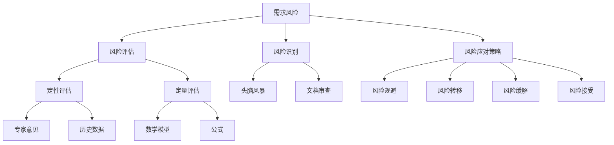

                 

### 文章标题

# 大型应用开发中的需求风险评估和管理

**关键词：** 大型应用开发、需求风险管理、风险评估、风险识别、应对策略、监控与改进

**摘要：** 本文深入探讨了大型应用开发中的需求风险评估和管理。通过介绍需求风险管理的背景、核心概念，以及需求识别、风险评估、应对策略、监控与改进的方法和工具，本文旨在为开发团队提供一套完整的需求风险管理框架，以提高大型应用项目的成功率和可靠性。

----------------------------------------------------------------

### 背景介绍

在当今快速发展的信息技术时代，大型应用开发已经成为企业业务发展的重要驱动力。随着业务需求的日益复杂，大型应用的开发面临诸多挑战，其中需求风险的管理成为关键一环。需求风险指的是在需求获取、分析、设计、开发、测试等过程中，可能导致项目延期、预算超支、功能不完整等问题的一系列不确定性因素。

#### 大型应用开发的特点

大型应用通常具备以下特点：

- **复杂度高**：涉及多个模块、系统，需要多个团队协同工作。
- **需求多样化**：涵盖多个业务领域，需求变化频繁。
- **高成本**：项目周期长，开发成本高。
- **高影响力**：对于企业运营和客户体验具有重要影响。

#### 需求风险管理的重要性

需求风险管理是确保大型应用开发项目成功的关键因素。通过有效的需求风险管理，可以：

- **降低项目风险**：识别和评估潜在的需求风险，制定应对策略，降低项目失败的概率。
- **优化资源分配**：合理分配人力、物力资源，提高项目效率。
- **提高客户满意度**：确保项目按期交付，满足客户需求，提升客户满意度。
- **提升项目管理水平**：建立系统化的需求风险管理流程，提高项目管理能力。

#### 本文结构

本文将分五个部分对大型应用开发中的需求风险管理进行详细探讨：

1. **需求风险管理基础**：介绍需求风险管理的概念、框架和方法。
2. **需求风险识别与分析**：探讨需求风险的识别、影响评估和优先级排序。
3. **需求风险应对策略**：讨论风险规避、转移、缓解和降低策略。
4. **需求风险管理与监控**：介绍需求风险管理的流程、监控与评估方法，以及持续改进。
5. **案例与实践**：通过实际案例，展示需求风险管理在大型应用开发中的具体应用。

通过本文的阅读，读者将全面了解需求风险管理的理论和实践方法，为实际项目中的需求风险管理提供指导。

### 核心概念与联系

在大型应用开发中的需求风险管理，涉及多个核心概念和实体。为了更好地理解和掌握这些概念，我们需要建立一个清晰的概念关系架构。以下是几个关键概念及其相互关系：

#### 1. 需求风险

需求风险是指项目在需求获取、分析、设计、开发、测试等阶段中，因需求变化、需求不明确、需求错误等导致项目无法按预期进行的风险。需求风险可以分为以下几类：

- **需求变更风险**：因需求频繁变更导致项目延期、成本超支等风险。
- **需求不明确风险**：需求描述不清、不完整，导致开发过程中出现问题。
- **需求错误风险**：需求本身存在逻辑错误、功能缺陷等。

#### 2. 风险评估

风险评估是指通过系统的方法和工具，对需求风险进行识别、评估和排序的过程。风险评估方法包括定性和定量两种：

- **定性风险评估**：通过专家意见、历史数据等非数值化方法，对风险进行评估。
- **定量风险评估**：通过数学模型和公式，对风险的概率和影响进行量化。

#### 3. 风险识别

风险识别是指识别和发现潜在的需求风险的过程。风险识别方法包括：

- **头脑风暴**：通过团队成员的集体讨论，识别潜在的需求风险。
- **文档审查**：通过审查需求文档、设计文档等，发现潜在的需求风险。

#### 4. 风险应对策略

风险应对策略是指针对识别出的需求风险，制定相应的应对措施。常见的风险应对策略包括：

- **风险规避**：通过调整项目计划，避免需求风险的发生。
- **风险转移**：通过合同、保险等方式，将需求风险转移给第三方。
- **风险缓解**：通过改进设计、增加冗余等手段，降低需求风险的影响。
- **风险接受**：对无法规避或转移的风险，制定接受策略。

#### 5. 风险监控与评估

风险监控与评估是指在整个项目生命周期中，对需求风险进行持续监控和评估的过程。风险监控与评估方法包括：

- **定期评估**：通过定期召开风险评估会议，对需求风险进行评估。
- **动态监控**：通过实时监控系统，对需求风险进行动态监控。

#### 6. 需求变更管理

需求变更是需求风险管理中的重要一环。需求变更管理包括：

- **变更控制流程**：对需求变更进行审批、实施和监控的流程。
- **变更影响分析**：对需求变更可能带来的影响进行分析。

#### 概念关系架构

为了更好地展示上述概念之间的关系，我们可以使用Mermaid流程图进行说明。以下是需求风险管理中关键概念及其关系的Mermaid流程图：

通过上述Mermaid流程图，我们可以清晰地看到需求风险管理中的各个核心概念及其相互关系。这有助于我们更好地理解和掌握需求风险管理的理论和实践方法。

### 需求风险评估的方法与工具

需求风险评估是需求风险管理的重要环节，通过评估可以识别出潜在的风险，并对其进行优先级排序，以便项目团队能够有针对性地进行应对。以下是几种常见的需求风险评估方法与工具。

#### 定性风险评估

定性风险评估是通过专家意见、历史数据和直觉等非数值化方法对需求风险进行评估。这种方法的主要优点是快速、简单，适用于风险识别初期。

**1. 专家评估法**

专家评估法是指邀请领域专家对需求风险进行评估。专家根据其经验和专业知识，对风险的概率和影响进行评分。常用的评估尺度包括1-5分的五级评估法，其中：

- **概率评分**：1（非常低），2（低），3（中等），4（高），5（非常高）
- **影响评分**：1（非常低），2（低），3（中等），4（高），5（非常高）

**2. 风险矩阵**

风险矩阵是定性风险评估中常用的一种工具，通过将风险的概率和影响进行交叉分析，生成一个二维矩阵。风险矩阵可以帮助我们识别出高风险区域，并对其进行重点关注。

**3. 蒙特卡洛模拟**

蒙特卡洛模拟是一种基于概率统计的评估方法，通过大量随机模拟来评估需求风险的概率分布和累积分布。这种方法适用于对需求风险的概率和影响进行量化评估。

#### 定量风险评估

定量风险评估是通过数学模型和公式对需求风险的概率和影响进行量化评估。这种方法具有较高的精确度，适用于项目团队已经具备一定的风险评估基础。

**1. 统计模型**

统计模型是通过历史数据来预测需求风险的概率和影响。常见的统计模型包括回归分析、时间序列分析等。通过这些模型，我们可以对需求风险进行定量评估，并提供预测结果。

**2. 贝叶斯网络**

贝叶斯网络是一种概率图模型，用于表示需求风险之间的概率关系。通过贝叶斯网络，我们可以计算每个需求风险的概率分布，并识别出高风险区域。

**3. 风险价值（Value at Risk, VaR）**

风险价值（VaR）是一种衡量需求风险损失上限的指标。VaR可以根据需求风险的概率分布，计算在给定置信水平下的最大可能损失。这种方法适用于对需求风险的影响进行量化评估。

#### 常用的需求风险评估工具

**1. 风险评估矩阵**

风险评估矩阵是一种将定性评估和定量评估相结合的工具，可以帮助项目团队快速识别和评估需求风险。常用的风险评估矩阵包括五级风险评估矩阵、九级风险评估矩阵等。

**2. 风险管理软件**

风险管理软件可以帮助项目团队自动化需求风险评估过程，提高评估效率和准确性。常见的需求风险管理软件包括RiskMaster、Qualys Risk、Open Risk等。

**3. 工具和方法组合**

在实际应用中，项目团队可以结合多种风险评估方法和工具，以提高需求风险评估的全面性和准确性。例如，结合定性评估和定量评估方法，或结合多种风险管理工具。

### 实践案例

以下是一个需求风险评估的实践案例：

**项目背景**：某企业计划开发一款电商平台，涉及多个模块，如商品管理、订单管理、用户管理等。

**需求风险识别**：通过头脑风暴和文档审查，识别出以下需求风险：

- **需求变更风险**：客户需求不明确，可能导致项目延期和成本超支。
- **技术风险**：电商平台的技术架构复杂，可能存在技术难题。
- **数据隐私风险**：涉及用户数据保护，可能面临法律风险。

**定性风险评估**：通过专家评估法，对每个需求风险进行评估：

- **需求变更风险**：概率4（高），影响3（中等）
- **技术风险**：概率3（中等），影响4（高）
- **数据隐私风险**：概率2（低），影响2（低）

**定量风险评估**：通过蒙特卡洛模拟，计算每个需求风险的概率分布和VaR：

- **需求变更风险**：VaR为10万元
- **技术风险**：VaR为30万元
- **数据隐私风险**：VaR为5万元

**风险排序**：根据评估结果，将需求风险按照风险优先级排序：

1. 技术风险
2. 需求变更风险
3. 数据隐私风险

**风险应对策略**：针对每个需求风险，制定相应的应对策略：

- **技术风险**：加强与外部技术团队的合作，确保技术难题得到有效解决。
- **需求变更风险**：建立需求变更控制流程，确保需求变更得到及时处理。
- **数据隐私风险**：加强数据安全保护，确保用户数据的安全和隐私。

通过上述实践案例，我们可以看到需求风险评估方法在实际项目中的应用。项目团队通过定性评估和定量评估方法，识别出潜在的需求风险，并对其进行优先级排序，制定相应的应对策略，从而有效降低项目风险，提高项目成功率。

### 需求识别与分析

在大型应用开发中，需求识别与分析是需求风险管理的重要环节。正确的需求识别和分析有助于项目团队明确项目的目标、功能、性能和约束条件，从而降低需求风险，提高项目成功率。以下是需求识别与分析的方法和步骤。

#### 1. 需求收集

需求收集是指从客户、业务团队和其他相关利益相关者处获取项目需求的过程。需求收集的方法包括：

- **问卷调查**：通过设计问卷，收集客户和用户的需求。
- **访谈**：与客户、业务团队进行面对面的交流，了解他们的需求和期望。
- **研讨会**：组织项目相关各方参加研讨会，讨论和确定需求。
- **历史数据**：分析历史项目数据，提取有价值的需求信息。

#### 2. 需求分类

需求分类是将收集到的需求按照一定的标准进行分类的过程。常见的需求分类方法包括：

- **功能需求**：描述系统应具备的功能。
- **非功能需求**：描述系统应具备的性能、安全性、可靠性等。
- **用户需求**：描述用户在使用系统时应得到的好处和体验。
- **业务需求**：描述系统应满足的业务目标和需求。

#### 3. 需求验证

需求验证是指对收集到的需求进行验证，确保需求是明确、一致、可行且可测量的。需求验证的方法包括：

- **需求评审**：组织项目团队和相关利益相关者对需求进行评审，发现和解决需求中的问题。
- **需求验证工具**：使用需求验证工具，如Doors、Confluence等，对需求进行自动化验证。
- **用户验收测试**：与客户共同制定用户验收测试计划，对需求进行验证。

#### 4. 需求跟踪

需求跟踪是指在整个项目生命周期中，对需求进行持续跟踪和管理。需求跟踪的方法包括：

- **需求变更管理**：对需求变更进行记录、审批和实施。
- **需求基线管理**：确定需求基线，确保需求的一致性和稳定性。
- **需求状态跟踪**：记录需求的状态，如待开发、开发中、测试中、已完成等。

#### 5. 需求分析

需求分析是将需求转化为可执行的任务的过程。需求分析的方法包括：

- **功能分解**：将高层次的需求分解为具体的子功能。
- **需求建模**：使用需求模型，如用例图、活动图等，描述需求。
- **需求优先级排序**：根据需求的重要性和紧急性，对需求进行优先级排序。

#### 6. 需求确认

需求确认是指对分析后的需求进行确认，确保需求是正确、完整和可行的。需求确认的方法包括：

- **需求确认会议**：与客户和相关利益相关者召开确认会议，讨论和确认需求。
- **需求文档评审**：对需求文档进行评审，确保需求文档的准确性和一致性。

#### 7. 实践案例

以下是一个需求识别与分析的实践案例：

**项目背景**：某企业计划开发一款在线教育平台，提供在线课程、直播课程、作业提交和成绩管理等功能。

**需求收集**：通过问卷调查、访谈和研讨会，收集以下需求：

- **功能需求**：
  - 在线课程发布与播放
  - 直播课程授课与管理
  - 作业提交与成绩管理
  - 学生和教师账号管理
- **非功能需求**：
  - 系统稳定性：保证99.9%的在线可用性
  - 性能：能够支持1000个并发用户
  - 安全性：确保用户数据的安全和隐私
  - 可扩展性：能够根据需求进行扩展

**需求验证**：通过需求评审和用户验收测试，验证需求的明确性、一致性和可行性。

**需求跟踪**：使用需求跟踪工具，记录需求的变更和状态，确保需求的一致性和稳定性。

**需求分析**：将需求分解为具体的子功能，并使用用例图描述需求。

**需求确认**：与客户和相关利益相关者召开确认会议，讨论和确认需求。

通过上述需求识别与分析的实践案例，我们可以看到需求识别与分析在大型应用开发中的重要性。通过正确的方法和步骤，项目团队可以确保需求的明确性、一致性和可行性，从而降低需求风险，提高项目成功率。

### 需求风险的影响评估

在需求风险管理过程中，需求风险的影响评估是关键的一环。通过评估需求风险的影响，项目团队可以了解风险对项目目标、资源分配、时间进度和整体成功率的潜在影响，从而制定出相应的应对策略。以下是需求风险影响评估的方法和步骤。

#### 1. 影响评估标准

影响评估标准是评估需求风险影响程度的重要依据。常见的评估标准包括：

- **时间影响**：评估风险对项目时间进度的影响，如可能导致项目延期的时间长度。
- **成本影响**：评估风险对项目成本的影响，如可能导致成本增加的金额。
- **功能影响**：评估风险对项目功能实现的影响，如可能导致的功能缺失或变更。
- **资源影响**：评估风险对项目资源（如人力、物资）的影响，如可能导致资源短缺或浪费。

#### 2. 影响评估方法

影响评估方法包括定量评估和定性评估两种。

- **定量评估**：通过数学模型和公式，对需求风险的影响进行量化评估。常见的定量评估方法包括：

  - **蒙特卡洛模拟**：通过大量随机模拟，计算需求风险的概率分布和累积分布，从而评估风险的影响。
  - **风险价值（VaR）**：计算在给定置信水平下，需求风险可能导致的最大损失，从而评估风险的影响。
  - **决策树分析**：通过构建决策树模型，分析不同风险情况下的项目结果，从而评估风险的影响。

- **定性评估**：通过专家意见、历史数据和主观判断等方法，对需求风险的影响进行评估。常见的定性评估方法包括：

  - **专家评估法**：邀请领域专家对需求风险的影响进行评估。
  - **风险矩阵**：通过将风险的概率和影响进行交叉分析，生成风险矩阵，从而评估风险的影响。
  - **历史数据对比**：通过对比历史项目数据，评估当前需求风险的影响。

#### 3. 影响评估步骤

影响评估步骤主要包括以下几步：

- **风险识别**：识别出潜在的需求风险。
- **影响分析**：对每个需求风险的可能影响进行分析，如时间、成本、功能、资源等。
- **影响量化**：对需求风险的影响进行量化评估，如通过蒙特卡洛模拟、VaR等方法。
- **优先级排序**：根据需求风险的影响程度，对风险进行优先级排序，以便项目团队能够有针对性地进行应对。
- **影响报告**：编写影响评估报告，详细记录需求风险的影响评估结果，为项目决策提供依据。

#### 4. 实践案例

以下是一个需求风险影响评估的实践案例：

**项目背景**：某企业计划开发一款电商平台，涉及多个模块，如商品管理、订单管理、用户管理等。

**需求风险识别**：通过头脑风暴和文档审查，识别出以下需求风险：

- **需求变更风险**：因客户需求不明确，可能导致项目延期和成本超支。
- **技术风险**：电商平台的技术架构复杂，可能存在技术难题。
- **数据隐私风险**：涉及用户数据保护，可能面临法律风险。

**影响分析**：

- **需求变更风险**：
  - **时间影响**：可能导致项目延期3个月。
  - **成本影响**：可能导致成本增加50万元。
  - **功能影响**：可能导致部分功能无法按期实现。
  - **资源影响**：可能导致人力资源紧张。

- **技术风险**：
  - **时间影响**：可能导致项目延期6个月。
  - **成本影响**：可能导致成本增加100万元。
  - **功能影响**：可能导致部分功能无法实现。
  - **资源影响**：可能导致技术团队工作量增加。

- **数据隐私风险**：
  - **时间影响**：可能导致项目延期1个月。
  - **成本影响**：可能导致成本增加30万元。
  - **功能影响**：可能导致部分功能受限。
  - **资源影响**：可能导致法律团队工作量增加。

**影响量化**：

- **需求变更风险**：通过蒙特卡洛模拟，计算需求变更风险的概率分布和VaR，得出VaR为80万元。
- **技术风险**：通过VaR方法，计算技术风险的最大可能损失为200万元。
- **数据隐私风险**：通过专家评估法，评估数据隐私风险的概率为20%，影响为严重。

**优先级排序**：根据影响评估结果，将需求风险按照优先级排序：

1. 技术风险
2. 需求变更风险
3. 数据隐私风险

**影响报告**：编写需求风险影响评估报告，详细记录每个需求风险的影响评估结果，为项目决策提供依据。

通过上述实践案例，我们可以看到需求风险影响评估在项目决策中的重要性。项目团队通过量化需求风险的影响，可以更好地了解风险对项目的潜在影响，从而制定出有效的应对策略，降低项目风险，提高项目成功率。

### 需求风险的优先级排序

在大型应用开发过程中，需求风险的优先级排序至关重要。通过对风险进行优先级排序，项目团队可以聚焦于最关键的风险，从而有针对性地分配资源，制定应对策略，提高项目成功率。以下是需求风险优先级排序的方法和步骤。

#### 1. 风险优先级评估标准

风险优先级评估标准是进行风险排序的重要依据。常见的评估标准包括：

- **影响程度**：风险对项目目标的影响程度，如时间、成本、功能、资源等。
- **发生概率**：风险发生的可能性，如非常低、低、中等、高、非常高。
- **紧急程度**：风险发生的紧急程度，如紧迫、较紧迫、一般、不紧迫。
- **可控制性**：风险是否可以被项目团队有效控制，如完全可控制、部分可控制、不可控制。

#### 2. 风险优先级排序方法

风险优先级排序方法包括定量排序和定性排序两种。

- **定量排序**：通过数学模型和公式，对需求风险进行定量评估，从而确定风险优先级。常见的定量排序方法包括：

  - **综合评分法**：通过为每个风险分配权重，计算每个风险的加权得分，从而确定优先级。
  - **风险优先级矩阵**：通过将风险的概率和影响进行交叉分析，生成一个二维矩阵，从而确定风险优先级。

- **定性排序**：通过专家意见、历史数据和主观判断等方法，对需求风险进行定性评估，从而确定风险优先级。常见的定性排序方法包括：

  - **专家评估法**：邀请领域专家对需求风险进行评估，并根据评估结果确定优先级。
  - **风险矩阵**：通过将风险的概率和影响进行交叉分析，生成一个二维矩阵，从而确定风险优先级。

#### 3. 风险优先级排序步骤

风险优先级排序步骤主要包括以下几步：

- **风险识别**：识别出所有潜在的需求风险。
- **风险分析**：对每个需求风险的可能影响进行分析，如时间、成本、功能、资源等。
- **风险评估**：根据评估标准，对每个需求风险进行定量或定性评估。
- **优先级排序**：根据风险评估结果，确定每个风险的优先级。
- **优先级确认**：与项目团队和相关利益相关者讨论，确认风险优先级排序的合理性。

#### 4. 实践案例

以下是一个需求风险优先级排序的实践案例：

**项目背景**：某企业计划开发一款智能制造平台，涉及多个模块，如设备监控、数据采集、生产调度等。

**需求风险识别**：通过头脑风暴和文档审查，识别出以下需求风险：

- **数据采集风险**：因数据采集不稳定，可能导致设备监控数据不准确。
- **设备监控风险**：因设备监控算法复杂，可能导致监控效果不理想。
- **生产调度风险**：因生产调度规则复杂，可能导致生产效率低下。

**风险分析**：

- **数据采集风险**：
  - **影响程度**：时间、成本、功能、资源。
  - **发生概率**：中等。
  - **紧急程度**：较紧迫。
  - **可控制性**：部分可控制。

- **设备监控风险**：
  - **影响程度**：时间、成本、功能、资源。
  - **发生概率**：高。
  - **紧急程度**：紧迫。
  - **可控制性**：完全可控制。

- **生产调度风险**：
  - **影响程度**：时间、成本、功能、资源。
  - **发生概率**：低。
  - **紧急程度**：一般。
  - **可控制性**：部分可控制。

**风险评估**：

- **数据采集风险**：通过专家评估法，评估风险优先级为3。
- **设备监控风险**：通过风险矩阵，评估风险优先级为1。
- **生产调度风险**：通过专家评估法，评估风险优先级为2。

**优先级排序**：根据风险评估结果，将需求风险按照优先级排序：

1. 设备监控风险
2. 生产调度风险
3. 数据采集风险

**优先级确认**：与项目团队和相关利益相关者讨论，确认风险优先级排序的合理性。

通过上述实践案例，我们可以看到需求风险优先级排序在项目风险管理中的重要性。项目团队通过合理的风险排序，可以更好地聚焦于最关键的风险，从而制定出有效的应对策略，降低项目风险，提高项目成功率。

### 需求风险应对策略

在大型应用开发过程中，需求风险应对策略的制定和实施至关重要。通过有效的应对策略，项目团队可以降低风险对项目的负面影响，确保项目按计划顺利进行。以下是几种常见的需求风险应对策略。

#### 1. 风险规避

风险规避是指通过调整项目计划，避免需求风险的发生。常见的规避策略包括：

- **项目调整**：根据需求风险的情况，对项目计划进行调整，以避免风险的发生。例如，推迟项目启动时间、调整项目范围等。
- **技术改进**：采用更成熟的技术方案，避免因技术风险导致的失败。例如，选择已经经过验证的框架、工具等。
- **需求细化**：通过细化需求，降低需求变更的风险。例如，制定详细的用户需求文档、需求变更管理流程等。

#### 2. 风险转移

风险转移是指通过合同、保险等方式，将需求风险转移给第三方。常见的转移策略包括：

- **外包**：将部分需求开发任务外包给第三方团队，从而将需求风险转移给外包方。例如，将系统架构设计、前端开发等任务外包。
- **保险**：购买保险，将需求风险转移给保险公司。例如，购买项目保险，以保障项目在发生不可抗力因素时能够获得赔偿。
- **合作开发**：与合作伙伴共同承担需求风险，通过合作开发降低风险。例如，与供应商合作，共同承担技术风险。

#### 3. 风险缓解

风险缓解是指通过改进设计、增加冗余等手段，降低需求风险的影响。常见的缓解策略包括：

- **冗余设计**：通过增加系统的冗余，提高系统的可靠性。例如，采用备份机制、冗余服务器等。
- **容错机制**：在系统设计时，考虑可能出现的故障情况，并设计相应的容错机制。例如，采用故障转移、故障恢复等技术。
- **优化流程**：通过优化项目流程，提高项目的稳定性。例如，采用敏捷开发、迭代开发等。

#### 4. 风险接受

风险接受是指对无法规避或转移的风险，制定接受策略。常见的接受策略包括：

- **风险容忍**：对某些风险设定容忍度，当风险在容忍度范围内时，可以接受。例如，对某些低概率、低影响的风险，可以设定容忍度。
- **风险预留**：在项目预算和时间计划中，预留一定的风险预留，以应对可能发生的风险。例如，在项目预算中设置风险预留金，在时间计划中预留缓冲时间。
- **风险监控**：对已接受的风险进行持续监控，确保风险在可控范围内。例如，定期进行风险评估、监控风险指标等。

#### 5. 实践案例

以下是一个需求风险应对策略的实践案例：

**项目背景**：某企业计划开发一款智能交通管理系统，涉及交通信号控制、路况监测、车辆管理等多个模块。

**需求风险识别**：通过头脑风暴和文档审查，识别出以下需求风险：

- **技术风险**：智能交通管理系统的技术复杂，可能存在技术难题。
- **需求变更风险**：客户需求不明确，可能导致项目延期和成本超支。
- **数据隐私风险**：涉及用户数据保护，可能面临法律风险。

**风险应对策略**：

- **技术风险**：
  - **规避**：选择成熟的技术框架和工具，避免技术难题。
  - **转移**：与专业团队合作，共同承担技术风险。
  - **缓解**：增加系统的冗余设计，提高系统的可靠性。

- **需求变更风险**：
  - **规避**：通过需求细化，降低需求变更的风险。
  - **接受**：在项目预算和时间计划中设置风险预留，以应对需求变更。

- **数据隐私风险**：
  - **规避**：采用数据加密技术，确保用户数据的安全。
  - **转移**：购买保险，将数据隐私风险转移给保险公司。
  - **缓解**：建立数据隐私保护机制，降低数据泄露的风险。

通过上述需求风险应对策略的实践案例，我们可以看到不同的风险应对策略在项目风险管理中的重要性。项目团队根据风险的类型和特点，制定相应的应对策略，可以有效地降低风险对项目的负面影响，确保项目成功完成。

### 需求风险管理的流程与实施

需求风险管理是一个系统化的过程，贯穿于大型应用开发的整个生命周期。为了确保需求风险管理的高效实施，项目团队需要建立一套完整的流程，并遵循一定的实施步骤。以下是需求风险管理的主要流程与实施步骤。

#### 1. 风险识别

风险识别是需求风险管理的首要步骤，旨在识别项目中可能出现的各种需求风险。具体实施步骤如下：

- **召开风险识别会议**：邀请项目团队成员、相关利益相关者参与，通过头脑风暴、文档审查、历史数据分析等方法，识别出潜在的需求风险。
- **风险清单**：将识别出的风险记录在风险清单中，并分类整理，如技术风险、需求变更风险、数据隐私风险等。
- **风险优先级排序**：对风险清单中的风险进行优先级排序，以便后续的进一步处理。

#### 2. 风险评估

风险评估是对识别出的需求风险进行定量或定性评估，以确定其发生的概率和影响程度。具体实施步骤如下：

- **风险分析**：对每个需求风险的可能影响进行分析，如时间、成本、功能、资源等。
- **定量评估**：采用数学模型、蒙特卡洛模拟等方法，对需求风险的概率和影响进行量化评估。
- **定性评估**：通过专家评估、风险矩阵等方法，对需求风险的影响程度进行评估。
- **风险报告**：编写风险评估报告，详细记录每个需求风险的概率、影响和优先级排序。

#### 3. 风险应对

风险应对是根据风险评估的结果，制定相应的应对策略，并实施这些策略。具体实施步骤如下：

- **制定风险应对计划**：根据风险评估报告，制定风险应对计划，包括规避、转移、缓解和接受等策略。
- **资源分配**：为风险应对计划分配必要的资源，如人力、物力、资金等。
- **执行风险应对计划**：按照风险应对计划，实施具体的应对措施。
- **监控和调整**：在实施过程中，持续监控风险应对的效果，并根据实际情况进行调整。

#### 4. 风险监控

风险监控是对需求风险进行持续跟踪和管理，以确保风险在可控范围内。具体实施步骤如下：

- **建立风险监控机制**：制定风险监控流程，明确监控责任人、监控频率和监控指标。
- **定期评估**：定期召开风险评估会议，对需求风险进行重新评估，更新风险评估报告。
- **动态调整**：根据监控结果，及时调整风险应对策略，确保风险在可控范围内。
- **风险报告**：编写风险监控报告，记录风险监控的成果和问题，为项目决策提供依据。

#### 5. 持续改进

持续改进是需求风险管理的关键环节，旨在通过不断优化流程，提高需求风险管理的效果。具体实施步骤如下：

- **收集反馈**：从项目团队、相关利益相关者那里收集需求风险管理过程中的反馈，识别问题和改进机会。
- **分析问题**：对收集到的反馈进行分析，找出需求风险管理中的薄弱环节。
- **制定改进计划**：根据分析结果，制定需求风险管理的改进计划，包括流程优化、工具升级、培训等。
- **实施改进**：按照改进计划，实施具体的改进措施。
- **评估效果**：评估改进措施的效果，确保需求风险管理得到持续优化。

#### 实践案例

以下是一个需求风险管理流程与实施的实践案例：

**项目背景**：某企业计划开发一款企业资源计划（ERP）系统，涉及财务、采购、库存等多个模块。

**风险识别**：通过召开风险识别会议，识别出以下需求风险：

- **技术风险**：ERP系统的技术复杂，可能存在技术难题。
- **需求变更风险**：客户需求不明确，可能导致项目延期和成本超支。
- **数据隐私风险**：涉及企业敏感数据，可能面临法律风险。

**风险评估**：

- **技术风险**：通过专家评估法，评估风险发生的概率为中等，影响程度为高。
- **需求变更风险**：通过风险矩阵，评估风险发生的概率为高，影响程度为高。
- **数据隐私风险**：通过专家评估法，评估风险发生的概率为低，影响程度为高。

**风险应对**：

- **技术风险**：采用成熟的技术框架和工具，避免技术难题；与专业团队合作，共同承担技术风险；增加系统的冗余设计，提高系统的可靠性。
- **需求变更风险**：通过需求细化，降低需求变更的风险；在项目预算和时间计划中设置风险预留，以应对需求变更。
- **数据隐私风险**：采用数据加密技术，确保用户数据的安全；购买保险，将数据隐私风险转移给保险公司；建立数据隐私保护机制，降低数据泄露的风险。

**风险监控**：

- **建立风险监控机制**：定期召开风险评估会议，对需求风险进行重新评估；建立风险监控报告制度，记录风险监控的成果和问题。
- **动态调整**：根据监控结果，及时调整风险应对策略，确保风险在可控范围内。

**持续改进**：

- **收集反馈**：从项目团队、客户和相关利益相关者那里收集需求风险管理过程中的反馈；识别问题和改进机会。
- **分析问题**：对收集到的反馈进行分析，找出需求风险管理中的薄弱环节。
- **制定改进计划**：根据分析结果，制定需求风险管理的改进计划；包括流程优化、工具升级、培训等。
- **实施改进**：按照改进计划，实施具体的改进措施；持续优化需求风险管理流程。

通过上述需求风险管理流程与实施的实践案例，我们可以看到需求风险管理在项目中的重要性。项目团队通过系统化的流程和实施步骤，可以有效地识别、评估、应对和管理需求风险，提高项目成功率。

### 需求风险的监控与评估

在大型应用开发过程中，需求风险的监控与评估是确保需求风险管理效果的关键环节。通过持续监控与评估，项目团队可以及时发现风险的变化，调整应对策略，确保项目顺利进行。以下是需求风险监控与评估的方法和步骤。

#### 1. 监控方法

需求风险的监控方法包括定期监控和动态监控两种。

- **定期监控**：定期召开风险评估会议，对需求风险进行重新评估，分析风险的变化趋势，调整应对策略。定期监控的方法包括：

  - **风险评估会议**：组织项目团队成员和相关利益相关者，定期召开风险评估会议，讨论和评估需求风险。
  - **监控报告**：编写监控报告，记录每次监控的结果和发现的问题，为项目决策提供依据。

- **动态监控**：通过实时监控系统，对需求风险进行动态监控，及时发现风险的变化。动态监控的方法包括：

  - **实时监控工具**：使用实时监控工具，如Jenkins、SonarQube等，对需求风险进行持续监控。
  - **风险指标**：定义风险指标，如项目进度、成本、功能实现情况等，通过监控这些指标，及时发现风险的变化。

#### 2. 评估方法

需求风险的评估方法包括定量评估和定性评估两种。

- **定量评估**：通过数学模型和公式，对需求风险的概率和影响进行量化评估。定量评估的方法包括：

  - **风险价值（VaR）**：计算在给定置信水平下，需求风险可能导致的最大损失，从而评估风险的影响。
  - **蒙特卡洛模拟**：通过大量随机模拟，计算需求风险的概率分布和累积分布，从而评估风险的影响。

- **定性评估**：通过专家意见、历史数据和主观判断等方法，对需求风险的影响进行评估。定性评估的方法包括：

  - **专家评估法**：邀请领域专家对需求风险进行评估，并根据评估结果调整应对策略。
  - **风险矩阵**：通过将风险的概率和影响进行交叉分析，生成风险矩阵，从而评估风险的影响。

#### 3. 监控与评估步骤

需求风险的监控与评估步骤主要包括以下几步：

- **建立监控体系**：制定监控计划，明确监控责任人、监控频率和监控指标。
- **数据收集**：收集需求风险的相关数据，如项目进度、成本、功能实现情况等。
- **数据分析**：对收集到的数据进行分析，识别风险的变化趋势。
- **风险评估**：根据数据分析结果，对需求风险进行定量或定性评估，更新风险评估报告。
- **调整应对策略**：根据评估结果，调整需求风险应对策略，确保风险在可控范围内。
- **报告与反馈**：编写监控与评估报告，记录监控与评估的结果和发现的问题，为项目决策提供依据。

#### 4. 实践案例

以下是一个需求风险监控与评估的实践案例：

**项目背景**：某企业计划开发一款智能制造系统，涉及设备监控、数据采集、生产调度等多个模块。

**监控与评估步骤**：

- **建立监控体系**：制定监控计划，明确监控责任人、监控频率和监控指标，如项目进度、成本、功能实现情况等。
- **数据收集**：通过实时监控系统，收集项目进度、成本、功能实现情况等数据，如每月的项目进度报告、成本支出报告等。
- **数据分析**：对收集到的数据进行分析，识别风险的变化趋势，如项目进度是否滞后、成本是否超支、功能实现是否达到预期等。
- **风险评估**：根据数据分析结果，对需求风险进行定量或定性评估，如通过专家评估法，评估技术风险的概率和影响程度；通过风险矩阵，评估需求变更风险的概率和影响程度。
- **调整应对策略**：根据评估结果，调整需求风险应对策略，如对技术风险，加强与外部技术团队的合作，确保技术难题得到有效解决；对需求变更风险，建立需求变更管理流程，确保需求变更得到及时处理。
- **报告与反馈**：编写监控与评估报告，记录监控与评估的结果和发现的问题，如项目进度滞后、成本超支等，为项目决策提供依据。

通过上述需求风险监控与评估的实践案例，我们可以看到监控与评估在需求风险管理中的重要性。项目团队通过定期监控与评估，可以及时发现风险的变化，调整应对策略，确保项目顺利进行。

### 需求风险管理中的持续改进

在大型应用开发中，需求风险管理并非一成不变的过程。随着项目的推进和环境的变化，需求风险管理需要不断地进行调整和优化，以确保其能够有效地应对新的风险和挑战。以下是需求风险管理中的持续改进方法。

#### 1. 持续改进的重要性

持续改进是确保需求风险管理有效性的关键。通过持续改进，项目团队可以：

- **提高风险管理能力**：不断学习和应用新的风险管理方法，提高团队的整体风险管理水平。
- **降低风险概率**：通过识别和解决风险管理中的问题，降低未来项目中的需求风险。
- **提高项目成功率**：通过持续改进，确保项目在变化的环境中能够顺利推进，提高项目成功率。

#### 2. 持续改进的方法

持续改进的方法包括以下几种：

- **定期回顾**：定期对需求风险管理过程进行回顾和总结，识别成功经验和不足之处，为下一步改进提供依据。
- **问题识别**：通过项目回顾、团队讨论、用户反馈等方式，识别需求风险管理中的问题。
- **分析问题根本原因**：对识别出的问题进行深入分析，找出根本原因，为制定改进措施提供基础。
- **制定改进计划**：根据问题分析和根本原因，制定详细的改进计划，包括改进措施、责任人和时间表。
- **实施改进措施**：按照改进计划，实施具体的改进措施，如流程优化、工具升级、培训等。
- **评估改进效果**：评估改进措施的效果，确保问题得到有效解决，并记录改进成果。
- **建立反馈机制**：建立反馈机制，收集项目团队和相关利益相关者的反馈，不断优化需求风险管理流程。

#### 3. 实践案例

以下是一个需求风险管理持续改进的实践案例：

**项目背景**：某企业计划开发一款企业资源计划（ERP）系统，涉及财务、采购、库存等多个模块。

**持续改进步骤**：

- **定期回顾**：项目团队每季度对需求风险管理过程进行回顾，总结成功经验和不足之处。
- **问题识别**：通过项目回顾、团队讨论和用户反馈，识别出需求风险管理中的问题，如风险识别不够全面、风险评估不够准确等。
- **分析问题根本原因**：对识别出的问题进行深入分析，找出根本原因，如风险管理流程不够清晰、团队对风险评估方法掌握不够熟练等。
- **制定改进计划**：根据问题分析和根本原因，制定详细的改进计划，包括：
  - **改进措施**：优化风险管理流程，完善风险评估方法，加强团队培训等。
  - **责任人**：明确改进措施的责任人，确保改进计划得到有效执行。
  - **时间表**：制定具体的时间表，确保改进措施在规定时间内完成。
- **实施改进措施**：按照改进计划，实施具体的改进措施，如更新风险管理文档、开展风险评估培训等。
- **评估改进效果**：评估改进措施的效果，确保问题得到有效解决，并记录改进成果。
- **建立反馈机制**：建立反馈机制，收集项目团队和相关利益相关者的反馈，不断优化需求风险管理流程。

通过上述持续改进的实践案例，我们可以看到持续改进在需求风险管理中的重要性。项目团队通过定期回顾、问题识别、分析、制定和实施改进计划，以及建立反馈机制，可以不断优化需求风险管理流程，提高项目成功率。

### 大型应用开发中的需求风险管理案例

在大型应用开发中，需求风险管理是确保项目成功的关键环节。以下将介绍几个实际案例，展示需求风险管理的具体应用和实践。

#### 案例一：某电商平台的开发

**项目背景**：某知名电商平台计划开发一款新的在线购物平台，涉及商品管理、订单处理、用户账户等多个模块。

**需求风险管理过程**：

1. **需求收集**：通过市场调研、用户访谈和问卷调查，收集客户和潜在用户的需求。
2. **需求分析**：对收集到的需求进行分类和验证，确保需求的明确性和一致性。
3. **风险识别**：识别出以下需求风险：
   - **技术风险**：平台架构复杂，存在技术实现的难题。
   - **需求变更风险**：客户需求不明确，可能导致项目延期和成本超支。
   - **数据隐私风险**：涉及用户数据保护，可能面临法律风险。

4. **风险评估**：
   - **技术风险**：通过专家评估，风险发生概率为中等，影响程度为高。
   - **需求变更风险**：通过风险矩阵，评估风险发生概率为高，影响程度为高。
   - **数据隐私风险**：评估风险发生概率为中等，影响程度为高。

5. **风险应对**：
   - **技术风险**：采用成熟的技术框架和工具，避免技术难题；与专业团队合作，共同承担技术风险。
   - **需求变更风险**：建立需求变更管理流程，确保需求变更得到及时处理。
   - **数据隐私风险**：采用数据加密技术，确保用户数据的安全；购买保险，将数据隐私风险转移给保险公司。

6. **风险监控与评估**：
   - **定期监控**：每季度召开风险评估会议，对需求风险进行重新评估。
   - **动态监控**：通过实时监控系统，监控项目进度、成本和功能实现情况。

通过上述需求风险管理过程，该电商平台成功避免了技术难题和需求变更带来的风险，确保了项目的顺利进行。

#### 案例二：某银行系统的开发

**项目背景**：某银行计划开发一款新的在线银行系统，提供账户管理、转账支付、贷款申请等功能。

**需求风险管理过程**：

1. **需求收集**：通过用户调研、业务团队访谈和用户测试，收集用户的需求和期望。
2. **需求分析**：对收集到的需求进行分类和验证，确保需求的明确性和一致性。
3. **风险识别**：识别出以下需求风险：
   - **技术风险**：系统需要处理大量的交易数据，存在性能瓶颈。
   - **数据安全风险**：涉及用户敏感信息，可能面临数据泄露的风险。
   - **需求变更风险**：银行内部需求变化频繁，可能导致项目延期和成本超支。

4. **风险评估**：
   - **技术风险**：通过专家评估，风险发生概率为高，影响程度为高。
   - **数据安全风险**：通过风险矩阵，评估风险发生概率为高，影响程度为高。
   - **需求变更风险**：评估风险发生概率为高，影响程度为中等。

5. **风险应对**：
   - **技术风险**：采用高性能数据库和缓存技术，提高系统的性能；与外部技术团队合作，共同解决技术难题。
   - **数据安全风险**：采用数据加密和防火墙技术，确保用户数据的安全；制定数据安全政策，加强内部数据安全管理。
   - **需求变更风险**：建立需求变更管理流程，确保需求变更得到及时处理。

6. **风险监控与评估**：
   - **定期监控**：每月召开风险评估会议，对需求风险进行重新评估。
   - **动态监控**：通过实时监控系统，监控系统性能、数据安全情况和需求变更情况。

通过上述需求风险管理过程，该银行成功降低了技术风险和数据安全风险，确保了在线银行系统的稳定和安全运行。

#### 案例三：某医疗信息化系统的开发

**项目背景**：某医疗机构计划开发一款医疗信息化系统，提供病历管理、预约挂号、电子处方等功能。

**需求风险管理过程**：

1. **需求收集**：通过与医护人员、管理人员和患者的访谈，收集用户的需求和期望。
2. **需求分析**：对收集到的需求进行分类和验证，确保需求的明确性和一致性。
3. **风险识别**：识别出以下需求风险：
   - **需求变更风险**：医疗行业需求变化频繁，可能导致项目延期和成本超支。
   - **数据隐私风险**：涉及患者敏感信息，可能面临数据泄露的风险。
   - **系统兼容性风险**：系统需要与多种医疗设备兼容，存在兼容性问题。

4. **风险评估**：
   - **需求变更风险**：通过专家评估，风险发生概率为高，影响程度为高。
   - **数据隐私风险**：通过风险矩阵，评估风险发生概率为高，影响程度为高。
   - **系统兼容性风险**：评估风险发生概率为中等，影响程度为高。

5. **风险应对**：
   - **需求变更风险**：建立需求变更管理流程，确保需求变更得到及时处理。
   - **数据隐私风险**：采用数据加密和防火墙技术，确保患者数据的安全；制定数据隐私政策，加强内部数据安全管理。
   - **系统兼容性风险**：与医疗设备供应商合作，共同解决兼容性问题；进行充分的系统测试，确保与各种医疗设备兼容。

6. **风险监控与评估**：
   - **定期监控**：每季度召开风险评估会议，对需求风险进行重新评估。
   - **动态监控**：通过实时监控系统，监控系统性能、数据安全情况和兼容性测试结果。

通过上述需求风险管理过程，该医疗机构成功降低了需求变更风险和数据隐私风险，确保了医疗信息化系统的顺利运行。

### 项目小结

通过上述案例，我们可以看到需求风险管理在大型应用开发中的重要性。无论是电商平台、银行系统还是医疗信息化系统，需求风险管理都是确保项目成功的关键环节。有效的需求风险管理可以帮助项目团队：

- **降低风险**：通过识别和评估需求风险，项目团队能够有针对性地制定应对策略，降低项目失败的概率。
- **提高项目成功率**：通过系统化的需求风险管理，项目团队能够更好地应对风险，确保项目按计划进行。
- **优化资源分配**：通过需求风险管理，项目团队能够合理分配资源，提高项目效率。
- **提升客户满意度**：通过有效的需求风险管理，项目团队能够更好地满足客户需求，提升客户满意度。

总之，需求风险管理是大型应用开发中不可或缺的一环，项目团队应高度重视并持续优化需求风险管理流程，以确保项目成功。

### 最佳实践

在大型应用开发中的需求风险管理过程中，总结和借鉴最佳实践能够有效提高项目成功率。以下是几个关键的最佳实践建议：

#### 1. 建立全面的需求文档

需求文档是需求管理的核心依据，其全面性和准确性直接影响项目进展。最佳实践建议：

- **详细描述需求**：确保每个需求都被详细、清晰、明确地描述，避免歧义和误解。
- **需求文档版本控制**：使用版本控制工具，如Git，记录需求文档的变更历史，便于追踪和管理。
- **需求评审**：组织项目团队和相关利益相关者对需求文档进行评审，确保需求的准确性和一致性。

#### 2. 采用敏捷开发方法

敏捷开发方法强调快速迭代和持续改进，有助于更好地适应需求变化。最佳实践建议：

- **定期迭代**：按照短周期（如两周或一个月）进行迭代开发，快速响应需求变化。
- **用户故事**：使用用户故事（User Story）来记录需求，确保每个需求都与用户需求相关。
- **需求优先级排序**：根据需求的紧急程度和重要性，定期更新需求优先级，确保优先处理关键需求。

#### 3. 强化沟通与协作

有效的沟通和协作是需求风险管理的关键。最佳实践建议：

- **设立沟通渠道**：确保项目团队和相关利益相关者之间有畅通的沟通渠道，如定期会议、邮件更新等。
- **共享信息**：使用项目管理工具，如JIRA、Trello，共享项目进度、风险信息等，确保团队成员对项目状况有清晰的认识。
- **跨部门协作**：建立跨部门协作机制，确保需求、设计和开发等环节的无缝对接。

#### 4. 持续风险监控与评估

需求风险管理是一个持续的过程，需要定期监控和评估。最佳实践建议：

- **定期风险评估**：定期召开风险评估会议，更新风险评估报告，确保风险在可控范围内。
- **风险预警机制**：建立风险预警机制，对可能出现的风险进行提前预测和预警。
- **风险管理工具**：使用风险管理工具，如RiskMaster、Open Risk等，自动化需求风险的管理和监控。

#### 5. 培训与知识共享

培训与知识共享有助于提高项目团队的风险管理能力。最佳实践建议：

- **风险管理培训**：定期组织风险管理培训，提高团队对需求风险管理的认识和技能。
- **知识共享平台**：建立知识共享平台，如Wiki或内部博客，记录风险管理过程中的经验和教训，供团队成员参考。
- **案例分享**：组织成功和失败案例分享会，通过案例分析，总结需求风险管理的经验和教训。

通过遵循这些最佳实践，项目团队可以更好地管理需求风险，提高大型应用开发项目的成功率和可靠性。

### 注意事项

在大型应用开发中的需求风险管理过程中，项目团队需要关注以下注意事项，以确保风险管理的效果：

1. **需求变更管理**：需求变更可能导致项目风险增加，因此需要建立有效的需求变更管理流程，确保每个变更都经过严格评估和审批。
2. **风险管理意识**：项目团队成员应具备风险管理意识，积极参与风险识别、评估和应对，共同维护项目风险可控。
3. **沟通与协作**：确保项目团队和相关利益相关者之间的沟通畅通，避免因信息不对称导致的风险管理失效。
4. **持续监控**：需求风险管理是一个持续的过程，需要定期监控和评估风险，及时调整应对策略。
5. **资源分配**：合理分配资源，确保在风险应对过程中有足够的资源支持。

通过关注这些注意事项，项目团队能够更好地应对需求风险，提高项目成功率。

### 拓展阅读

为了深入理解大型应用开发中的需求风险管理，以下是几本推荐的拓展阅读书籍：

1. 《需求工程：基础理论与实践》（"Requirements Engineering: Foundation, Principles, and Challenges"）
   - 作者：Markus Kramer，Ulrich Hansmann
   - 简介：本书系统地介绍了需求工程的基础知识、原则和方法，包括需求获取、需求分析和需求管理等内容。

2. 《风险管理：原则与实践》（"Risk Management: Concepts and Cases"）
   - 作者：John J. Havard，Stephen P. Wachenheim
   - 简介：本书提供了风险管理的基本概念和实践案例，涵盖了风险识别、风险评估、风险应对等关键内容。

3. 《敏捷项目管理：实践指南》（"Agile Project Management: Creating Innovative Products"）
   - 作者：Robert C. Martin
   - 简介：本书介绍了敏捷项目管理的方法和原则，强调持续交付、客户协作和迭代开发，对需求管理有重要参考价值。

4. 《需求工程与软件架构：理论与实践》（"Requirements Engineering and Software Architecture: Modeling and Analysis"）
   - 作者：Risto Miikkulainen，Bernhard Steffen
   - 简介：本书探讨了需求工程与软件架构之间的联系，包括需求建模、需求分析与架构设计等内容。

通过阅读这些书籍，读者可以进一步了解需求风险管理的理论和实践方法，提高项目管理的专业能力。

