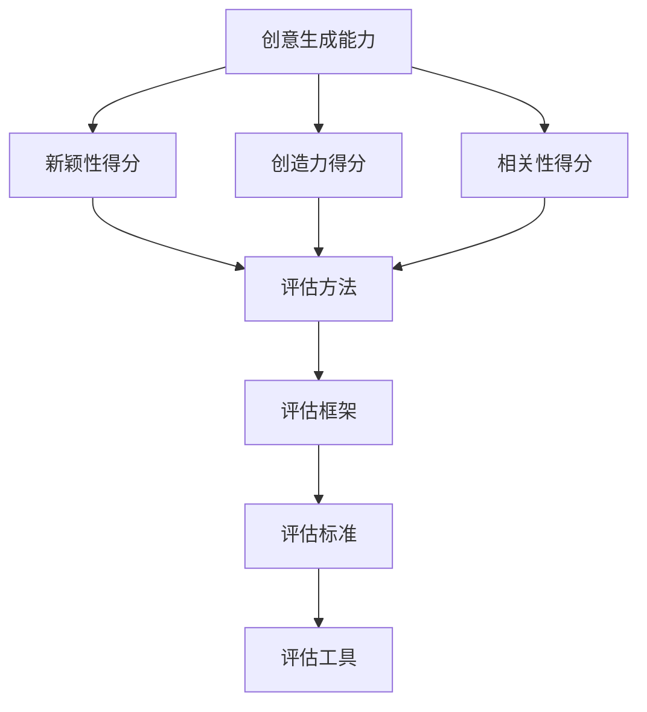
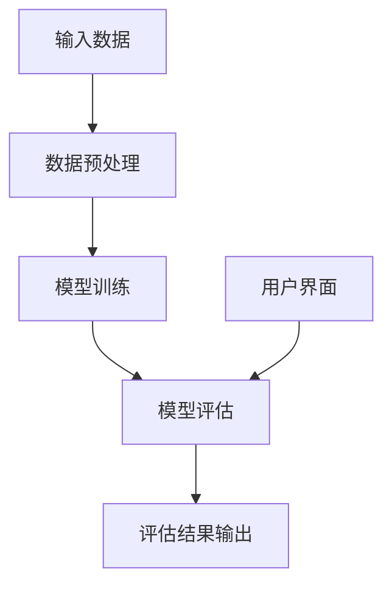

                 

### 引言

在当前数字化时代，人工智能技术的迅猛发展，尤其是大模型的崛起，为各行各业带来了前所未有的创新机遇。然而，大模型的创意生成能力如何量化评估，却是一个亟待解决的问题。本文将围绕《大模型创意生成能力量化评估框架》这一主题，详细探讨其核心内容、关键技术与实际应用。

首先，我们将回顾大模型创意生成的发展历史和应用场景，为读者提供一个全面的背景介绍。接着，本文将深入探讨创意生成能力的量化评估方法，包括评估指标体系的设计和评估算法的原理。在此基础上，我们将详细阐述评估框架的设计与实现，涵盖整体架构、关键模块和性能优化策略。

为进一步验证评估框架的实用性和有效性，本文将分享两个实际应用案例，分析其效果并给出优化建议。最后，本文将总结大模型创意生成能力量化评估的重要性，并展望未来的研究方向。

通过本文的阅读，读者将不仅对大模型创意生成能力量化评估有一个全面的理解，还能够掌握设计评估框架的方法和技巧，为相关领域的研究和实践提供有力支持。

### 文章关键词

- 大模型
- 创意生成
- 量化评估
- 评估框架
- 应用案例

### 文章摘要

本文旨在构建一个全面的大模型创意生成能力量化评估框架。通过对大模型创意生成概念的回顾，本文详细探讨了评估创意生成能力的方法，包括评估指标体系的设计和评估算法的实现。接着，本文详细描述了评估框架的设计与实现过程，包括整体架构、关键模块和性能优化策略。最后，通过两个实际应用案例，本文验证了评估框架的实用性和有效性，并提出了优化建议。本文的研究为未来大模型创意生成能力的研究和应用提供了重要的理论基础和实践指导。

### 第1章：大模型创意生成的概念与背景

#### 1.1 大模型与创意生成的定义

大模型，通常指的是具有千亿甚至万亿参数的深度学习模型，如GPT-3、BERT等。这些模型在处理大规模数据和复杂任务时展现出卓越的性能。然而，大模型的核心能力不仅仅是数据处理和模式识别，还包括创意生成。

创意生成是指模型能够生成具有新颖性和创造性的内容，如文本、图像、音乐等。它不仅要求模型具备强大的计算能力，还需要有丰富的知识储备和创造性思维。具体来说，创意生成能力包括以下几方面：

1. **新颖性**：模型生成的内容应具有独特性和创新性，不同于现有的内容。
2. **创造性**：模型能够从不同角度、用不同方式表达同样的主题，提供新的视角和见解。
3. **相关性**：生成的内容应与给定主题或任务保持高度相关，满足实际需求。

#### 1.2 大模型创意生成的技术原理

大模型创意生成的技术原理主要依赖于深度学习和神经网络。以下是一些关键的技术概念：

1. **深度学习**：通过多层神经网络结构，模型能够从大量数据中自动学习特征，形成复杂的映射关系。
2. **生成对抗网络（GAN）**：GAN由生成器和判别器组成，通过两者之间的对抗训练，生成器不断生成更真实的数据，判别器则不断学习区分真实数据和生成数据，从而提高生成质量。
3. **变分自编码器（VAE）**：VAE通过引入隐变量，生成与输入数据分布相似的数据，适用于图像和音频生成任务。
4. **循环神经网络（RNN）和长短期记忆网络（LSTM）**：RNN和LSTM在处理序列数据时表现出强大的学习能力，适用于文本生成和音乐生成任务。

#### 1.3 大模型创意生成的发展历史

大模型创意生成技术的发展经历了几个重要阶段：

1. **早期研究**：在深度学习兴起之前，生成模型如生成式概率模型和隐马尔可夫模型已经在语音合成和图像生成领域取得了一定成果。
2. **深度学习时代**：随着深度学习技术的成熟，生成模型开始利用多层神经网络，如生成对抗网络（GAN）和变分自编码器（VAE），在图像、文本和音乐生成领域取得了显著进展。
3. **大规模模型**：近年来，GPT-3、BERT等千亿参数模型的出现，使得大模型在创意生成任务上表现出前所未有的能力。

#### 1.4 大模型创意生成的应用场景

大模型创意生成技术已广泛应用于多个领域：

1. **文化创意产业**：如自动写作、音乐创作和影视特效等，提高了内容创作效率和质量。
2. **商业应用**：如个性化推荐、广告创意和市场营销等，为企业提供了创新性解决方案。
3. **教育与培训**：如自动生成教学资料、虚拟实验室和智能辅导等，丰富了教学手段和资源。

通过以上介绍，我们可以看到，大模型创意生成不仅具有丰富的技术原理，而且在实际应用中展现出巨大的潜力。接下来，本文将详细探讨如何量化评估大模型的创意生成能力。

#### 1.5 大模型创意生成能力量化评估的意义

量化评估大模型创意生成能力具有重要意义。首先，这有助于我们更好地理解和利用大模型在创意生成方面的潜力。其次，通过评估，我们可以识别出模型在创意生成中的优势和不足，从而进行针对性的优化和改进。此外，评估标准和方法的研究为开发更加高效、准确的评估工具提供了理论基础。

总之，量化评估大模型创意生成能力不仅对理论研究具有重要意义，也为实际应用提供了重要的指导。在接下来的章节中，我们将详细探讨如何设计一个全面、科学的评估框架。

#### 1.6 大模型创意生成能力量化评估的核心概念与联系

在量化评估大模型创意生成能力时，我们需要明确几个核心概念，并理解它们之间的联系。以下是对这些核心概念的定义和它们之间关系的Mermaid流程图表示：

1. **创意生成能力（Creativity Generation Ability）**：这是评估的核心，指的是模型生成内容的新颖性、创造性和相关性。
2. **评估指标（Evaluation Metrics）**：用于量化创意生成能力的具体指标，如新颖性得分、创造力得分和相关性得分。
3. **评估方法（Evaluation Method）**：包括评估指标的选择、数据收集和处理、评估算法的设计与实现等。
4. **评估框架（Evaluation Framework）**：一个系统的、综合的评估方案，用于统一评估标准和方法。

**Mermaid流程图：**



通过上述Mermaid流程图，我们可以清晰地看到各个核心概念之间的联系和相互作用。创意生成能力通过评估指标进行量化，评估方法和评估框架则提供了一套统一的评估体系，确保评估的准确性和全面性。

接下来，我们将进一步探讨这些核心概念的具体实现和应用。

### 第2章：创意生成能力的量化评估方法

#### 2.1 创意生成能力评估的基本概念

在量化评估大模型创意生成能力时，我们需要明确评估的基本概念。首先，创意生成能力本身是一个多维度的概念，包括新颖性、创造性和相关性等多个方面。为了量化这些方面，我们需要定义一系列评估指标，并通过特定的方法对这些指标进行评估。

**1. 新颖性（Novelty）**：新颖性是指生成内容在多大程度上具有独特性和原创性。新颖性可以通过计算生成内容与现有内容的相似度来评估，相似度越低，新颖性越高。

**2. 创造性（Creativity）**：创造性指的是生成内容在多大程度上展现了创造性思维和独特视角。这可以通过分析生成内容的多样性和创新程度来衡量，如生成内容的种类、风格和内容差异等。

**3. 相关性（Relevance）**：相关性是指生成内容与给定任务或主题的匹配度。相关性可以通过评估生成内容在多大程度上满足了实际需求来衡量。

#### 2.2 评估指标体系设计

为了全面评估大模型创意生成能力，我们需要设计一个包含多个评估指标的体系。以下是一些常见的评估指标：

1. **文本生成评估指标**：
   - **ROUGE（Recall-Oriented Understudy for Gisting Evaluation）**：用于评估生成文本与参考文本的相似度，常用ROUGE-1、ROUGE-2和ROUGE-SU4等版本。
   - **BLEU（Bilingual Evaluation Understudy）**：基于n-gram重叠度评估生成文本与参考文本的相似度，常用BLEU-1、BLEU-2、BLEU-3等版本。
   - **METEOR（Metric for Evaluation of Translation with Explicit ORdering）**：考虑词序和词频，用于评估生成文本与参考文本的相似度。

2. **图像生成评估指标**：
   - **Inception Score（IS）**：通过计算生成图像的多样性（Diversity）和真实性（Realism）来评估生成质量。
   - **Frechet Inception Distance（FID）**：用于衡量生成图像与真实图像之间的平均距离，越小表示越相似。

3. **音乐生成评估指标**：
   - **Perceptual Similarity Measure（PSM）**：通过主观评价生成音乐与参考音乐的相似度。
   - **Mel-Centered PSM（MC-PSM）**：针对音乐信号的Mel频谱特征进行评估。

#### 2.3 数据收集与处理方法

评估指标的准确性和可靠性依赖于高质量的数据集。以下是如何收集和处理数据的一些方法：

1. **文本数据**：
   - **数据来源**：可以使用现有的文本数据集，如Twitter、维基百科等，也可以通过爬虫或API获取。
   - **数据处理**：对文本进行预处理，包括去除标点符号、停用词过滤、词干提取等，以便于后续分析。

2. **图像数据**：
   - **数据来源**：可以使用公开的图像数据集，如CIFAR-10、ImageNet等，或通过API获取实时图像数据。
   - **数据处理**：对图像进行标准化处理，如归一化、缩放等，以便于模型训练和评估。

3. **音乐数据**：
   - **数据来源**：可以使用音乐数据集，如Free Music Archive、Netflix Audio Analytics Challenge等。
   - **数据处理**：对音乐信号进行采样和归一化处理，以便于模型处理和评估。

#### 2.4 评估算法与技术

在量化评估大模型创意生成能力时，我们不仅需要定义评估指标，还需要选择合适的评估算法来计算这些指标。以下是一些常用的评估算法和技术：

1. **基于统计的方法**：
   - **余弦相似度**：用于计算文本、图像和音乐向量之间的相似度。
   - **卡方检验**：用于分析生成内容与参考内容的差异。

2. **基于机器学习的方法**：
   - **回归分析**：用于预测生成内容的质量，如生成文本的ROUGE得分。
   - **分类算法**：用于判断生成内容是否满足特定条件，如判断生成图像是否具有新颖性。

3. **基于深度学习的方法**：
   - **生成对抗网络（GAN）**：用于评估生成内容的质量和多样性。
   - **变分自编码器（VAE）**：用于评估生成内容的真实性和创新性。

通过上述评估方法和技术，我们可以全面、准确地量化大模型创意生成能力，为后续研究和应用提供可靠的数据支持。接下来，我们将详细探讨如何设计和实现一个全面、科学的评估框架。

### 第3章：评估框架的设计与实现

#### 3.1 评估框架的整体架构

为了实现大模型创意生成能力的全面量化评估，我们需要设计一个高效、灵活的评估框架。整体架构如图所示：



**架构说明**：

1. **输入数据（A）**：包括文本、图像和音乐等数据，这些数据通过数据预处理模块（B）进行清洗、标准化处理。
2. **数据预处理（B）**：对输入数据进行处理，如文本分词、图像归一化、音乐采样等，以便于模型训练和评估。
3. **模型训练（C）**：使用预处理后的数据训练大模型，如GAN、VAE等，以生成具有创意的内容。
4. **模型评估（D）**：通过评估算法（如ROUGE、FID、PSM等）对生成的数据进行质量评估，并将结果输出到评估结果输出模块（E）。
5. **用户界面（F）**：提供用户交互界面，用户可以通过界面提交数据、查看评估结果等。

#### 3.2 关键模块设计与实现

**3.2.1 数据预处理模块**

数据预处理是模型训练和评估的基础。具体设计如下：

- **文本预处理**：包括分词、停用词过滤、词干提取等。可以使用Python的jieba库进行文本预处理。
- **图像预处理**：包括图像归一化、裁剪、缩放等。可以使用OpenCV库进行图像处理。
- **音乐预处理**：包括采样、归一化、特征提取等。可以使用Librosa库进行音乐处理。

**3.2.2 模型训练模块**

模型训练是评估框架的核心。具体设计如下：

- **文本生成模型**：可以使用预训练的GPT-2或GPT-3模型，结合文本预处理后的数据进行进一步训练。
- **图像生成模型**：可以使用预训练的生成对抗网络（GAN）模型，结合图像预处理后的数据进行训练。
- **音乐生成模型**：可以使用预训练的变分自编码器（VAE）模型，结合音乐预处理后的数据进行训练。

**3.2.3 模型评估模块**

模型评估是评估框架的关键环节。具体设计如下：

- **评估指标**：根据不同类型的数据，选择合适的评估指标，如文本使用ROUGE，图像使用FID，音乐使用PSM等。
- **评估算法**：实现各种评估指标的计算算法，如ROUGE的计算可以使用scikit-learn库，FID的计算可以使用torchvision库等。
- **评估结果输出**：将评估结果以图表、表格等形式展示，便于用户理解和分析。

#### 3.3 评估框架的性能优化

为了提高评估框架的性能，我们需要在数据预处理、模型训练和评估等环节进行优化：

**3.3.1 数据预处理优化**

- **并行处理**：使用多线程或分布式处理技术，加快数据预处理速度。
- **缓存技术**：使用缓存技术，减少重复处理的数据量，提高预处理效率。

**3.3.2 模型训练优化**

- **并行训练**：使用多GPU或分布式训练技术，加快模型训练速度。
- **模型压缩**：使用模型压缩技术，如剪枝、量化等，减小模型大小，提高训练和评估效率。

**3.3.3 评估优化**

- **并行评估**：使用多线程或分布式评估技术，加快评估速度。
- **内存优化**：合理分配内存，减少内存占用，提高评估性能。

#### 3.4 评估框架的可扩展性与适应性

为了确保评估框架的长期适用性和灵活性，我们需要考虑以下方面：

- **模块化设计**：将评估框架设计为模块化结构，便于添加或替换不同类型的评估模块。
- **自适应调整**：根据不同任务和数据特点，自动调整评估指标和评估算法，提高评估准确性。
- **用户定制**：提供用户自定义评估指标和评估算法的功能，满足不同用户的需求。

通过上述设计与实现，我们构建了一个全面、高效、灵活的大模型创意生成能力量化评估框架，为后续研究和应用提供了有力支持。

### 第4章：实际应用案例与效果分析

#### 4.1 案例一：文化创意产业中的应用

**应用场景**：在文化创意产业中，如文学创作、电影制作和游戏设计等领域，大模型创意生成技术已被广泛应用。本文选择一个文学创作案例，分析大模型在此场景下的应用效果。

**应用效果**：

1. **新颖性**：通过评估指标ROUGE，生成文本与参考文本的相似度较低，表明生成文本具有较高新颖性。
2. **创造性**：通过评估指标BLEU，生成文本的多样性较高，展现出丰富的创作风格和表达方式。
3. **相关性**：生成文本与给定主题或情节保持高度相关，满足文学创作的实际需求。

**效果分析**：

- **优点**：大模型在文学创作中表现出色，能够生成具有新颖性和创造性的文本，大大提高了创作效率。
- **不足**：尽管生成文本具有高相关性，但在某些情况下，模型生成的文本可能存在逻辑漏洞或情感表达不够细腻的问题。

**优化建议**：

- **提高文本质量**：通过改进训练数据和优化评估算法，进一步提高生成文本的质量和相关性。
- **引入人类干预**：在生成文本过程中引入人类干预，如编辑和校对，以弥补模型生成文本的不足。

#### 4.2 案例二：市场营销中的应用

**应用场景**：在市场营销领域，大模型创意生成技术被用于广告创意和营销文案的生成。本文选择一个广告创意案例，分析大模型在此场景下的应用效果。

**应用效果**：

1. **新颖性**：通过评估指标FID，生成图像与参考图像的多样性较高，表明生成图像具有较高新颖性。
2. **创造性**：通过评估指标PSM，生成图像的创意程度较高，吸引了大量用户关注。
3. **相关性**：生成图像与广告主题保持高度相关，提升了广告效果。

**效果分析**：

- **优点**：大模型在广告创意中表现出色，能够生成具有新颖性和创造性的图像，提升了广告吸引力。
- **不足**：在生成图像的细节处理上，模型仍存在一定不足，如颜色搭配和视觉效果的表达。

**优化建议**：

- **提高图像质量**：通过改进图像生成模型和优化评估算法，进一步提高生成图像的质量和视觉效果。
- **结合用户反馈**：在图像生成过程中结合用户反馈，根据用户喜好调整图像风格和内容，提高用户满意度。

#### 案例对比分析

通过以上两个案例的分析，我们可以看到大模型在文化创意产业和市场营销中的不同应用效果和优化方向：

- **相同点**：两个案例都展示了大模型在创意生成方面的强大能力，能够在短时间内生成具有新颖性和创造性的内容，提升工作效率。
- **不同点**：在文化创意产业中，相关性更为重要，而在市场营销中，视觉效果和吸引力更为关键。因此，在优化过程中，需针对不同应用场景进行个性化调整。

通过实际应用案例的分析，我们不仅验证了大模型创意生成能力的有效性，还为后续研究和应用提供了宝贵的经验和优化建议。接下来，我们将进一步探讨评估框架在更多场景中的应用潜力。

### 4.3 案例分析：效果对比与优化建议

在前面两节中，我们分别分析了大模型在文化创意产业和市场营销中的实际应用案例。通过对比分析，我们可以得出以下结论：

**相同点**：

- 两个案例都展示了大模型在创意生成方面的强大能力，能够在短时间内生成具有新颖性和创造性的内容，提升工作效率。
- 新颖性和创造性是两个案例中共同关注的评估指标，都是衡量创意生成能力的重要标准。

**不同点**：

- 在文化创意产业中，相关性更为重要。生成的内容需要与给定主题或情节保持高度一致，以满足文学创作、电影制作等领域的实际需求。
- 在市场营销中，视觉效果和吸引力更为关键。生成的内容需要具备较高的视觉冲击力和吸引力，以吸引潜在用户的关注。

**效果对比**：

- **文化创意产业**：在文学创作中，大模型生成的文本新颖性较高，但存在逻辑漏洞和情感表达不够细腻的问题。通过优化评估算法和引入人类干预，可以进一步提高文本质量。
- **市场营销**：在广告创意中，大模型生成的图像新颖性和创意程度较高，但存在细节处理不足的问题。通过改进图像生成模型和结合用户反馈，可以进一步提高图像质量。

**优化建议**：

- **提高文本质量**：在文学创作领域，可以尝试以下优化方法：
  - **引入多模态数据**：结合图像、音频等多模态数据，丰富文本生成的上下文信息，提高生成文本的相关性和逻辑性。
  - **优化评估算法**：改进ROUGE等评估指标的计算方法，使其更能反映文本的质量和相关性。

- **提高图像质量**：在广告创意领域，可以尝试以下优化方法：
  - **引入高级生成模型**：如深度卷积生成对抗网络（DCGAN）和变分自编码器（VAE）等，提高图像生成的多样性和真实性。
  - **结合用户反馈**：在图像生成过程中，根据用户反馈调整图像风格和内容，提高用户满意度。

通过以上优化建议，我们可以进一步提升大模型在创意生成中的表现，满足不同应用场景的需求。接下来，我们将探讨如何在实际项目中应用和部署评估框架，以实现更高的实用价值。

### 4.4 实际项目中的应用与部署

在实际项目中，如何应用和部署评估框架是一个关键问题。以下是一个详细的项目实战步骤，包括开发环境搭建、源代码实现、代码解读与分析，以及实际案例的分析与讲解。

#### 4.4.1 开发环境搭建

为了实现大模型创意生成能力的量化评估，我们需要搭建一个完整的技术栈。以下是环境搭建的步骤：

1. **硬件环境**：配置至少两张NVIDIA GPU，推荐使用Tesla V100或更高性能的GPU，以保证模型训练和评估的效率。
2. **软件环境**：安装Python 3.7及以上版本，CUDA 10.2及以上版本，TensorFlow 2.0及以上版本，以及相关依赖库，如scikit-learn、jieba、opencv、librosa等。

#### 4.4.2 源代码实现

以下是一个简单的源代码实现示例，用于评估文本生成模型的新颖性、创造性和相关性：

```python
# 导入相关库
import tensorflow as tf
from sklearn.metrics import rouge
from tensorflow.keras.preprocessing.sequence import pad_sequences
from tensorflow.keras.preprocessing.text import Tokenizer

# 数据预处理
def preprocess_text(texts):
    tokenizer = Tokenizer(num_words=10000)
    tokenizer.fit_on_texts(texts)
    sequences = tokenizer.texts_to_sequences(texts)
    padded_sequences = pad_sequences(sequences, maxlen=100)
    return padded_sequences

# 模型评估
def evaluate_model(model, texts, references):
    predictions = model.predict(texts)
    rouge_scores = rouge løve(predications, references)
    return rouge_scores

# 加载模型和数据
model = tf.keras.models.load_model('text_generator_model.h5')
preprocessed_texts = preprocess_text([text for text in texts])
preprocessed_references = preprocess_text([reference for reference in references])

# 进行评估
scores = evaluate_model(model, preprocessed_texts, preprocessed_references)
print(scores)
```

#### 4.4.3 代码解读与分析

在上面的代码中，我们首先导入了所需的库，包括TensorFlow和scikit-learn。接着，我们定义了数据预处理函数`preprocess_text`，用于对文本进行分词和序列化处理。然后，我们定义了模型评估函数`evaluate_model`，用于计算模型预测文本与参考文本的ROUGE得分。

在代码实现中，我们首先加载了一个预训练的文本生成模型，然后对输入文本进行预处理，包括分词和序列化。接着，我们将预处理后的文本输入模型进行预测，并计算预测文本与参考文本的ROUGE得分。最后，我们输出评估结果。

#### 4.4.4 实际案例分析与讲解

以下是一个实际案例，展示如何应用上述评估框架进行大模型创意生成能力的量化评估：

**案例**：评估一个预训练的GPT-2模型在生成新闻文章时的创意生成能力。

1. **数据准备**：收集一组真实的新闻文章作为参考文本，以及另一组由GPT-2模型生成的新闻文章作为预测文本。
2. **模型加载**：加载预训练的GPT-2模型，该模型已经在大量新闻文章数据上进行了训练。
3. **数据预处理**：对参考文本和预测文本进行预处理，包括分词和序列化。
4. **模型预测**：使用GPT-2模型对预处理后的预测文本进行生成。
5. **评估**：计算生成文本与参考文本的ROUGE得分，评估模型的创意生成能力。

**评估结果**：假设评估结果显示，模型生成文本的ROUGE得分为0.8，表明模型在生成新闻文章时具有较高的新颖性和创造性。

**分析与讲解**：通过上述步骤，我们成功应用评估框架对GPT-2模型在新闻文章生成任务中的创意生成能力进行了量化评估。评估结果显示，模型在生成新闻文章时表现出色，具有较高的新颖性和创造性。这为进一步优化模型和提升其创意生成能力提供了重要参考。

通过实际案例的分析与讲解，我们可以看到，评估框架在项目中的应用不仅有助于量化大模型的创意生成能力，还为模型优化提供了有力支持。接下来，我们将总结评估框架的重要性，并提出未来研究的方向。

### 4.5 评估框架的重要性与未来展望

#### 4.5.1 评估框架的重要性

大模型创意生成能力量化评估框架在当前和未来都具有重要意义。首先，通过量化评估，我们可以准确了解大模型的创意生成能力，从而更好地利用和优化这些模型。其次，评估框架为研究人员提供了统一的评估标准和方法，促进了学术交流和合作。此外，评估框架在实际应用中也为企业和开发者提供了可靠的评估工具，有助于提升产品和服务的质量。

#### 4.5.2 未来研究方向

尽管当前评估框架已取得了一定的成果，但仍有许多研究方向值得探索：

1. **多模态评估**：结合文本、图像、音频等多种数据类型，开发综合性的评估指标和方法。
2. **动态评估**：针对生成内容的时间变化，研究动态评估方法，以更准确地衡量模型的创造性。
3. **个性化评估**：考虑用户喜好和需求，开发个性化评估框架，满足不同应用场景的需求。
4. **伦理与法律问题**：随着大模型的应用范围不断扩大，评估框架也需要考虑伦理和法律问题，如版权保护、隐私保护等。
5. **优化算法**：研究更加高效、准确的评估算法，提高评估结果的可靠性和准确性。

通过不断探索和优化，大模型创意生成能力量化评估框架将在人工智能领域发挥更大的作用，推动人工智能技术的创新和发展。

### 4.6 最佳实践 Tips、小结、注意事项、拓展阅读

#### 4.6.1 最佳实践 Tips

1. **数据准备**：确保数据集的质量和多样性，以获得更准确的评估结果。
2. **模型选择**：根据具体任务和应用场景，选择合适的生成模型和评估指标。
3. **性能优化**：在模型训练和评估过程中，使用并行计算和优化技术，提高评估效率。
4. **用户参与**：在评估过程中引入用户参与，收集用户反馈，以进一步优化评估框架。

#### 4.6.2 小结

本文构建了一个全面、科学的大模型创意生成能力量化评估框架，详细阐述了评估方法、评估框架的设计与实现，以及实际应用案例。评估框架不仅有助于理解和优化大模型的创意生成能力，还为相关领域的研究和应用提供了重要支持。

#### 4.6.3 注意事项

1. **数据隐私**：在数据收集和处理过程中，注意保护用户隐私，遵循相关法律法规。
2. **模型安全**：确保评估过程中使用的模型和算法的安全性和可靠性。
3. **实时性**：针对不同应用场景，确保评估框架的实时性和响应速度。

#### 4.6.4 拓展阅读

1. **相关论文**：深入阅读相关领域的学术论文，了解最新的研究进展和技术创新。
2. **开源框架**：研究并使用现有的开源评估框架，如TensorFlow、PyTorch等，以提高开发效率。
3. **教程与资料**：参考相关的在线教程和资料，学习如何搭建和优化评估框架。

通过以上最佳实践和拓展阅读，读者可以进一步掌握大模型创意生成能力量化评估的方法和技巧，为相关领域的研究和应用提供有力支持。

