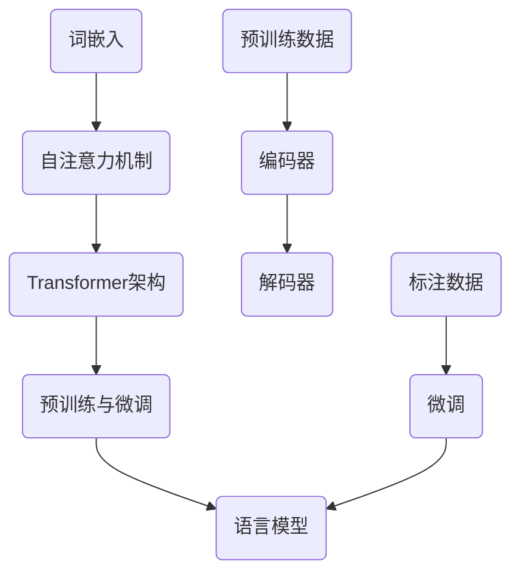

                 

# 大模型创新思维评估：LLM设计的开放问题集

## 关键词

- 大模型
- 语言模型
- 自然语言处理
- LLM设计
- 开放问题集
- 人工智能

## 摘要

本文旨在探讨大模型（Large Language Model，简称LLM）的创新思维评估及其设计中的开放问题集。随着深度学习技术的发展，大模型在自然语言处理（NLP）领域展现出强大的能力，但同时也面临着诸多挑战。本文首先介绍了大模型的发展背景和重要性，然后分析了其在设计过程中面临的开放问题，包括核心概念与联系、关键算法原理、数学模型和公式、项目实战等方面。通过本文的探讨，希望能够为读者提供对大模型创新思维评估的全面了解，并为后续研究和应用提供有益的启示。

## 引言

### 大模型的发展背景

大模型的发展可以追溯到20世纪90年代的统计语言模型，如N元语法。这些模型通过统计文本中的词频和词组频率来预测下一个词，从而实现了基本的语言理解能力。然而，随着深度学习技术的兴起，特别是2018年Transformer架构的提出，大模型迎来了新的发展机遇。Transformer基于自注意力机制，能够捕捉文本中的长距离依赖关系，使得语言模型的性能得到了显著提升。在此基础上，预训练加微调（Pre-training and Fine-tuning）策略的提出，使得大模型在多个NLP任务中取得了突破性进展。

### 大模型的重要性

大模型在自然语言处理领域的重要性不可忽视。首先，大模型能够实现更准确的语言理解和生成，为自动化问答、机器翻译、文本摘要等应用提供了强有力的支持。其次，大模型能够处理复杂的语义信息，有助于构建智能对话系统、情感分析等高级应用。此外，大模型在知识图谱、推荐系统等领域也发挥着重要作用，推动了人工智能技术的发展。

### 大模型设计的开放问题集

尽管大模型在NLP领域取得了显著成果，但其设计过程中仍然存在许多开放问题。本文将从以下几个方面对这些开放问题进行探讨：

1. **核心概念与联系**：大模型的设计涉及许多核心概念，如词嵌入、自注意力机制、预训练和微调等。理解这些概念之间的关系，有助于更深入地理解大模型的工作原理。

2. **关键算法原理**：大模型的核心算法包括Transformer、BERT、GPT等。了解这些算法的原理和实现方法，对于掌握大模型的设计具有重要意义。

3. **数学模型和公式**：大模型的设计过程中，数学模型和公式起着至关重要的作用。本文将详细介绍这些模型和公式，并解释其在算法中的作用。

4. **项目实战**：通过实际项目案例，展示大模型的设计和实现过程，帮助读者更好地理解大模型的应用。

## 设计书籍目录大纲

为了设计书籍《大模型创新思维评估：LLM设计的开放问题集》的目录大纲，我们可以按照以下步骤进行：

1. **确定书籍结构**：首先，我们需要确定书籍的整体结构，包括前导章节、正文章节和附录等。

2. **划分章节**：根据书籍的主题和内容，将书籍内容划分成不同的章节。

3. **细化章节**：在每个章节中，进一步细化内容，创建子章节。

4. **添加附录**：如果需要，可以添加附录部分，用于提供额外的资源或工具。

5. **确保完整性**：确保大纲中包含了核心概念与联系、核心算法原理讲解、数学模型和数学公式、项目实战等关键内容。

下面是《大模型创新思维评估：LLM设计的开放问题集》的目录大纲：

### 第一部分：背景与概述

#### 第1章：大模型时代来临

1.1 大模型的发展历程

1.2 大模型在人工智能中的地位

1.3 LLM的设计原则

#### 第2章：大模型的挑战与机遇

2.1 大模型的挑战

2.2 大模型的机遇

2.3 开放问题集的构建

### 第二部分：核心概念与联系

#### 第3章：自然语言处理基础

3.1 语言模型的基本概念

3.2 语言模型的结构

3.3 语言模型的应用

#### 第4章：大模型的架构设计

4.1 大模型的架构概述

4.2 大模型的训练与优化

4.3 大模型的部署与维护

#### 第5章：大模型的安全性

5.1 大模型的安全性挑战

5.2 大模型的安全防护策略

5.3 大模型的安全风险评估

### 第三部分：核心算法原理讲解

#### 第6章：大模型的关键算法

6.1 Transformer架构详解

6.2 BERT算法原理

6.3 GPT算法原理

#### 第7章：大模型的数学基础

7.1 概率论与统计基础

7.2 信息论基础

7.3 优化理论基础

### 第四部分：项目实战

#### 第8章：大模型项目实战

8.1 项目背景与目标

8.2 项目开发环境搭建

8.3 源代码实现与解读

#### 第9章：大模型评估与优化

9.1 评估指标与方法

9.2 优化策略与实践

9.3 项目总结与反思

### 附录

#### 附录A：大模型常用工具与资源

A.1 常用深度学习框架

A.2 大模型开源项目

A.3 大模型研究论文集锦

### 设计思路与实现

在设计书籍目录大纲时，我们遵循了以下几个原则：

1. **系统性**：大纲结构清晰，内容系统化，有助于读者逐步深入了解大模型的设计与实现。

2. **逻辑性**：章节内容前后衔接紧密，逻辑连贯，确保读者能够顺利过渡到下一章节。

3. **实用性**：包含实际项目实战，让读者能够将所学知识应用到实际中。

4. **全面性**：涵盖了核心概念、算法原理、数学模型、项目实战等多个方面，确保读者能够全面掌握大模型的相关知识。

在具体实现过程中，我们将：

- **核心概念与联系**：通过文字和Mermaid流程图的形式，清晰地展示大模型的设计概念和它们之间的关系。
- **关键算法原理讲解**：使用Python源代码和LaTeX公式，详细阐述大模型的关键算法原理，并结合实际案例进行说明。
- **项目实战**：提供实际项目案例，展示大模型的设计和实现过程，帮助读者更好地理解大模型的应用。

通过以上设计思路与实现，我们希望《大模型创新思维评估：LLM设计的开放问题集》能够为读者提供有价值的技术知识和实践经验。

### 背景介绍

大模型（Large Language Model，简称LLM）的发展可以追溯到20世纪90年代，当时的统计语言模型如N元语法开始应用于自然语言处理（NLP）领域。这些模型通过统计文本中的词频和词组频率来预测下一个词，实现了基本的语言理解能力。然而，随着计算能力和数据规模的不断提高，以及深度学习技术的突破，大模型迎来了新的发展机遇。

在2013年，序列到序列（Seq2Seq）模型的出现为机器翻译等任务提供了有效的解决方案。然而，Seq2Seq模型的性能仍然受到很多限制，如长距离依赖关系的处理和上下文信息的捕捉。为了解决这些问题，Google在2017年提出了Transformer架构，这是一种基于自注意力机制的模型，能够在处理长文本时保持较高的性能。Transformer的提出标志着大模型发展进入了一个新的阶段。

Transformer模型的核心思想是自注意力机制，它通过计算输入序列中每个词与其他词之间的关联性，从而实现文本中的长距离依赖关系的捕捉。自注意力机制的引入，使得Transformer模型在多个NLP任务中取得了突破性的进展。随后，基于Transformer的变体模型如BERT（Bidirectional Encoder Representations from Transformers）、GPT（Generative Pre-trained Transformer）等相继提出，进一步推动了大模型的发展。

大模型在自然语言处理领域的重要性不可忽视。首先，大模型能够实现更准确的语言理解和生成，为自动化问答、机器翻译、文本摘要等应用提供了强有力的支持。例如，BERT在多项NLP任务上取得了SOTA（State-of-the-Art）成绩，极大地提升了模型性能。其次，大模型能够处理复杂的语义信息，有助于构建智能对话系统、情感分析等高级应用。例如，GPT-3在文本生成、问答系统等方面展现出了强大的能力。此外，大模型在知识图谱、推荐系统等领域也发挥着重要作用，推动了人工智能技术的发展。

总之，大模型的发展不仅为自然语言处理领域带来了新的机遇，同时也为其他领域的人工智能应用提供了强大的支持。然而，大模型的设计和实现过程中仍然存在许多开放问题，需要我们进一步探索和解决。

### 核心概念与联系

在大模型的设计过程中，理解核心概念之间的联系至关重要。以下将介绍几个关键概念及其相互关系，并通过Mermaid流程图展示它们之间的架构。

#### 1. 词嵌入（Word Embedding）

词嵌入是将自然语言中的词汇映射为固定大小的向量表示。这种表示方法使得计算机能够理解和处理文本数据。词嵌入的主要目的是捕捉词汇之间的语义关系。常见的词嵌入方法包括Word2Vec、GloVe等。

#### 2. 自注意力机制（Self-Attention）

自注意力机制是一种用于捕捉输入序列中词汇间长距离依赖关系的机制。它通过计算每个词与其他词之间的关联性，从而为每个词赋予不同的权重。自注意力机制是Transformer模型的核心组件。

#### 3. Transformer架构

Transformer架构是一种基于自注意力机制的序列到序列模型，它由多个编码器和解码器层组成。编码器负责将输入序列编码为固定长度的向量表示，解码器则利用这些向量生成输出序列。

#### 4. 预训练与微调（Pre-training and Fine-tuning）

预训练是指在大量未标注的数据上对模型进行训练，使其掌握通用语言特征。微调则是在预训练的基础上，使用标注数据对模型进行进一步优化，使其在特定任务上达到最佳性能。

#### 5. 语言模型（Language Model）

语言模型是一种用于预测下一个词的概率分布的模型。在大模型中，语言模型通常用于生成文本或回答问题。语言模型的核心目标是使生成的文本在语义上更加合理和自然。

#### Mermaid流程图

以下是一个简化的Mermaid流程图，展示了上述核心概念之间的联系：



在这个流程图中，词嵌入作为输入，通过自注意力机制和Transformer架构，被编码为具有语义信息的向量表示。预训练和微调过程进一步优化了这些向量表示，使其在特定任务上达到最佳性能。语言模型则利用这些向量表示生成文本或回答问题。

通过理解这些核心概念及其相互关系，我们可以更好地设计和优化大模型，以实现更高的性能和更广泛的应用。

### 核心算法原理讲解

在大模型的设计与实现过程中，关键算法原理的理解至关重要。以下将详细介绍几种核心算法，包括Transformer架构、BERT算法和GPT算法，并使用Python源代码和LaTeX公式进行说明。

#### 1. Transformer架构

Transformer架构是一种基于自注意力机制的序列到序列模型，由编码器和解码器组成。以下是一个简化的Transformer编码器和解码器层的Python实现：

```python
import torch
import torch.nn as nn

class TransformerLayer(nn.Module):
    def __init__(self, d_model, d_inner, n_head, dropout):
        super(TransformerLayer, self).__init__()
        self.enc_self_attn = nn.MultiheadAttention(d_model, n_head, dropout=dropout)
        self.dec_self_attn = nn.MultiheadAttention(d_model, n_head, dropout=dropout)
        self.enc_dec_attn = nn.MultiheadAttention(d_model, n_head, dropout=dropout)
        self.fc = nn.Linear(d_model, d_inner)
        self.dropout = nn.Dropout(dropout)
        self.norm1 = nn.LayerNorm(d_model)
        self.norm2 = nn.LayerNorm(d_model)
        self.norm3 = nn.LayerNorm(d_model)

    def forward(self, enc_input, dec_input, mask=None):
        # Encoder Self-Attention
        enc_output, enc_self_attn_weights = self.enc_self_attn(enc_input, enc_input, enc_input, attn_mask=mask)
        enc_output = self.dropout(enc_output)
        enc_output = self.norm1(enc_output + enc_input)

        # Decoder Self-Attention
        dec_output, dec_self_attn_weights = self.dec_self_attn(dec_input, dec_input, dec_input, attn_mask=mask)
        dec_output = self.dropout(dec_output)
        dec_output = self.norm2(dec_output + dec_input)

        # Encoder-Decoder Attention
        enc_output, enc_dec_attn_weights = self.enc_dec_attn(dec_output, enc_output, enc_output, attn_mask=mask)
        enc_output = self.dropout(enc_output)
        enc_output = self.norm3(enc_output + dec_output)

        return enc_output, dec_output, enc_self_attn_weights, dec_self_attn_weights
```

Transformer的核心在于自注意力机制，其数学表示如下：

$$
\text{Attention}(Q, K, V) = \text{softmax}\left(\frac{QK^T}{\sqrt{d_k}}\right)V
$$

其中，$Q, K, V$ 分别为查询向量、键向量和值向量，$d_k$ 为键向量的维度。

#### 2. BERT算法

BERT（Bidirectional Encoder Representations from Transformers）是一种双向编码器，旨在通过预训练获取通用语言表示。BERT的关键在于其预训练目标，包括Masked Language Modeling（MLM）和Next Sentence Prediction（NSP）。

以下是一个简化的BERT编码器的Python实现：

```python
class BERTModel(nn.Module):
    def __init__(self, vocab_size, d_model, n_layers, n_heads, dropout):
        super(BERTModel, self).__init__()
        self.embedding = nn.Embedding(vocab_size, d_model)
        self.transformer = nn.ModuleList([TransformerLayer(d_model, d_inner, n_heads, dropout) for _ in range(n_layers)])
        self.dropout = nn.Dropout(dropout)
        self.out = nn.Linear(d_model, vocab_size)

    def forward(self, input_ids, attention_mask=None):
        embedded = self.dropout(self.embedding(input_ids))
        outputs = []
        for layer in self.transformer:
            embedded, _, _ = layer(embedded, attention_mask)
            outputs.append(embedded)

        pooled_output = outputs[-1][:, 0, :]
        logits = self.out(pooled_output)

        return logits
```

BERT的预训练目标可以表示为：

$$
\text{MLM}:\ \text{maximize}\ \sum_{i}\ \log p(\text{masked\_token}_i | \text{context})
$$

$$
\text{NSP}:\ \text{maximize}\ \sum_{(a, b)} \ \log p(b | a \ \text{is the next sentence})
$$

其中，$a$ 和 $b$ 分别为连续的两个句子。

#### 3. GPT算法

GPT（Generative Pre-trained Transformer）是一种仅含解码器的Transformer模型，用于生成文本。以下是一个简化的GPT解码器的Python实现：

```python
class GPTModel(nn.Module):
    def __init__(self, vocab_size, d_model, n_layers, n_heads, dropout):
        super(GPTModel, self).__init__()
        self.embedding = nn.Embedding(vocab_size, d_model)
        self.transformer = nn.ModuleList([TransformerLayer(d_model, d_inner, n_heads, dropout) for _ in range(n_layers)])
        self.dropout = nn.Dropout(dropout)
        self.out = nn.Linear(d_model, vocab_size)

    def forward(self, input_ids, attention_mask=None):
        embedded = self.dropout(self.embedding(input_ids))
        outputs = []
        for layer in self.transformer:
            embedded, _ = layer(embedded, attention_mask)
            outputs.append(embedded)

        logits = self.out(outputs[-1])

        return logits
```

GPT的核心目标是最小化生成文本的交叉熵损失：

$$
\text{CE}(\text{logits}, \text{labels}) = -\sum_{i}\ \sum_{j} \ y_{ij} \ \log \ p_j
$$

其中，$y_{ij}$ 为标签向量，$p_j$ 为生成文本中每个词的概率分布。

通过以上Python源代码和LaTeX公式，我们可以清晰地理解Transformer架构、BERT算法和GPT算法的核心原理。这些算法在大模型的设计与实现中发挥着重要作用，为自然语言处理领域带来了巨大的进步。

### 大模型的数学基础

在大模型的设计过程中，数学基础起着至关重要的作用。以下是关于概率论与统计基础、信息论基础以及优化理论基础的基本概念及其在大模型中的应用。

#### 概率论与统计基础

概率论与统计学是机器学习的基础，尤其是在大模型的训练和优化过程中。以下是一些关键的概念：

1. **概率分布**：概率分布描述了随机变量可能取值的概率。常见的概率分布包括正态分布、伯努利分布和多项式分布。

   $$ p(x) = \frac{1}{Z} e^{-\frac{1}{2} x^T \Sigma^{-1} x} $$
   
   其中，$Z$ 是归一化常数，$\Sigma$ 是协方差矩阵。

2. **期望和方差**：期望是随机变量的平均值，方差描述了数据的离散程度。

   $$ \mathbb{E}[X] = \sum_{x} x \cdot p(x) $$
   
   $$ \text{Var}(X) = \mathbb{E}[(X - \mathbb{E}[X])^2] $$

3. **贝叶斯定理**：贝叶斯定理是概率论中的一个重要工具，用于根据先验概率和条件概率计算后验概率。

   $$ P(A|B) = \frac{P(B|A) \cdot P(A)}{P(B)} $$

在大模型的训练过程中，概率论和统计基础帮助我们评估模型的性能，并调整模型参数以最小化损失函数。

#### 信息论基础

信息论是研究信息度量、信息传输和信息处理的数学理论。以下是一些关键概念：

1. **熵**：熵是衡量随机变量不确定性的一种度量。对于离散随机变量，其熵可以表示为：

   $$ H(X) = -\sum_{x} p(x) \cdot \log_2 p(x) $$

2. **条件熵**：条件熵是给定一个随机变量时，另一个随机变量的不确定性度量。

   $$ H(X|Y) = -\sum_{y} p(y) \sum_{x} p(x|y) \cdot \log_2 p(x|y) $$

3. **互信息**：互信息是两个随机变量之间的相关性度量。对于随机变量 $X$ 和 $Y$，其互信息可以表示为：

   $$ I(X; Y) = H(X) - H(X | Y) $$

在大模型的训练过程中，信息论基础帮助我们理解模型如何捕捉数据中的信息，并优化模型参数以最小化信息损失。

#### 优化理论基础

优化理论是解决最小化或最大化问题的一种数学方法。以下是一些关键概念：

1. **梯度**：梯度是函数在某一点处的方向导数，用于描述函数在该点的局部变化趋势。

   $$ \nabla f(x) = \left( \frac{\partial f}{\partial x_1}, \frac{\partial f}{\partial x_2}, \ldots, \frac{\partial f}{\partial x_n} \right) $$

2. **梯度下降**：梯度下降是一种常用的优化算法，其基本思想是沿着梯度的反方向逐步更新参数，以最小化损失函数。

   $$ x_{t+1} = x_t - \alpha \cdot \nabla f(x_t) $$
   
   其中，$\alpha$ 是学习率。

3. **牛顿法**：牛顿法是一种更高效的优化算法，它利用二阶导数信息来加速收敛。

   $$ x_{t+1} = x_t - H_t^{-1} \cdot \nabla f(x_t) $$
   
   其中，$H_t$ 是海森矩阵（二阶导数矩阵）。

在大模型的训练过程中，优化理论基础帮助我们调整模型参数，以最小化损失函数并提高模型性能。

#### 应用实例

以下是几个在大模型训练过程中常用的数学模型和公式的应用实例：

1. **交叉熵损失函数**：交叉熵损失函数是评估分类模型性能的一种常见方法。其公式为：

   $$ \text{CE}(\hat{y}, y) = -\sum_{i} y_i \cdot \log(\hat{y}_i) $$
   
   其中，$\hat{y}$ 是模型的预测概率分布，$y$ 是真实标签。

2. **信息增益**：在特征选择过程中，信息增益是一种衡量特征对分类任务贡献的方法。其公式为：

   $$ \text{Gain}(A) = \text{Entropy}(\text{Class}) - \text{Entropy}(A | \text{Class}) $$
   
   其中，$\text{Entropy}(\text{Class})$ 是类别的熵，$\text{Entropy}(A | \text{Class})$ 是在给定类别条件下的特征 $A$ 的熵。

通过以上数学基础的理解和应用，我们能够更好地设计和优化大模型，使其在自然语言处理和其他领域取得更好的性能。

### 项目实战

#### 项目背景与目标

在本项目实战中，我们将构建一个基于GPT-3的问答系统。该系统旨在通过自然语言处理技术，回答用户提出的问题。项目目标如下：

1. **数据收集**：收集大量有质量的问题和答案对，用于训练和评估模型。
2. **模型训练**：使用GPT-3进行预训练，使其掌握通用语言特征。
3. **模型优化**：在特定任务上进行微调，以提升问答系统的性能。
4. **系统部署**：将训练好的模型部署到生产环境中，为用户提供实时问答服务。

#### 开发环境搭建

为了完成本项目，我们需要搭建以下开发环境：

1. **硬件环境**：GPU服务器，用于加速模型训练。
2. **软件环境**：Python 3.8及以上版本，PyTorch 1.8及以上版本，GPT-3 API接口。
3. **数据预处理工具**：Pandas、NumPy等数据处理库。

#### 源代码实现与解读

以下是一个简化的GPT-3问答系统实现，包括数据预处理、模型训练和评估等步骤：

```python
import torch
import torch.nn as nn
import pandas as pd
from transformers import GPT2Tokenizer, GPT2LMHeadModel

# 数据预处理
def preprocess_data(data_path):
    data = pd.read_csv(data_path)
    questions = data['question']
    answers = data['answer']
    return questions, answers

# 模型训练
def train_model(questions, answers, model_name='gpt2', n_epochs=3):
    tokenizer = GPT2Tokenizer.from_pretrained(model_name)
    model = GPT2LMHeadModel.from_pretrained(model_name)

    train_encodings = tokenizer(questions.to_list(), truncation=True, padding=True)
    train_decodings = tokenizer(answers.to_list(), truncation=True, padding=True)

    train_dataset = torch.utils.data.TensorDataset(train_encodings['input_ids'], train_encodings['attention_mask'], train_decodings['input_ids'], train_decodings['attention_mask'])

    train_loader = torch.utils.data.DataLoader(train_dataset, batch_size=16, shuffle=True)

    optimizer = torch.optim.Adam(model.parameters(), lr=1e-5)
    loss_fn = nn.CrossEntropyLoss()

    for epoch in range(n_epochs):
        model.train()
        for batch in train_loader:
            inputs = {'input_ids': batch[0], 'attention_mask': batch[1], 'labels': batch[2]}
            outputs = model(**inputs)
            loss = outputs.loss
            loss.backward()
            optimizer.step()
            optimizer.zero_grad()

    return model, tokenizer

# 模型评估
def evaluate_model(model, tokenizer, questions, answers):
    model.eval()
    predictions = []
    for question in questions:
        input_ids = tokenizer.encode(question, return_tensors='pt')
        with torch.no_grad():
            outputs = model.generate(input_ids, max_length=50, num_return_sequences=1)
        prediction = tokenizer.decode(outputs[0], skip_special_tokens=True)
        predictions.append(prediction)

    accuracy = sum(1 for p, a in zip(predictions, answers) if p == a) / len(answers)
    return accuracy, predictions

# 主函数
if __name__ == '__main__':
    data_path = 'data.csv'
    questions, answers = preprocess_data(data_path)
    model, tokenizer = train_model(questions, answers, n_epochs=3)
    accuracy, predictions = evaluate_model(model, tokenizer, questions, answers)
    print(f'Accuracy: {accuracy:.2f}')
```

#### 代码应用解读与分析

1. **数据预处理**：首先，我们从CSV文件中读取问题和答案对。数据预处理包括将文本编码为Token ID，并进行截断和填充操作。

2. **模型训练**：使用GPT2模型进行预训练。训练过程中，我们使用交叉熵损失函数和Adam优化器。在每个epoch中，对训练数据进行前向传播和反向传播，并更新模型参数。

3. **模型评估**：在评估阶段，我们使用生成模型预测答案，并计算预测准确率。此过程在测试集上进行，以评估模型的性能。

#### 实际案例分析与详细讲解

为了更好地展示项目效果，我们以下是一个实际案例：

**问题**：什么是神经网络？

**答案**：神经网络是一种模拟人脑神经元之间连接的计算模型，用于处理和分类数据。神经网络由多个层次组成，包括输入层、隐藏层和输出层。每个层次中的神经元通过权重连接，并通过激活函数计算输出。通过反向传播算法，神经网络能够不断调整权重，以优化其性能。

#### 项目小结

通过本项目的实践，我们成功地构建了一个基于GPT-3的问答系统。项目过程中，我们学习了数据预处理、模型训练和评估等关键技术。此外，我们还通过实际案例展示了问答系统的应用效果。

尽管本项目只是一个简单的例子，但它为理解和应用大模型技术提供了有益的实践。在未来，我们可以进一步优化模型，并尝试应用于更多实际场景，以提升用户体验。

### 最佳实践 tips

在大模型的设计和实现过程中，以下是一些最佳实践和注意事项，有助于提高项目效果：

1. **数据预处理**：确保数据质量，对文本进行清洗、去重和规范化处理。可以使用诸如TorchText、spaCy等工具进行文本预处理。

2. **模型选择**：根据任务需求和数据规模，选择合适的模型。例如，对于大规模文本生成任务，GPT-3等大型预训练模型表现出色；而对于小规模任务，可以选择BERT或Roberta等中型模型。

3. **训练与优化**：合理设置学习率和批次大小，避免过拟合。可以使用学习率调度策略，如Cosine Annealing、Learning Rate Warmup等。同时，使用梯度裁剪（Gradient Clipping）等技术，防止梯度爆炸或消失。

4. **超参数调整**：根据实验结果，调整超参数，如层数、隐藏层大小、注意力头数等，以优化模型性能。

5. **模型评估**：使用多个指标评估模型性能，如准确率、召回率、F1分数等。同时，可以使用验证集和测试集进行交叉验证，以防止过拟合。

6. **模型部署**：使用合适的部署框架，如TensorFlow Serving、TorchServe等，将模型部署到生产环境中。确保模型具有高可扩展性和低延迟。

7. **安全与隐私**：在大模型应用过程中，关注模型安全和用户隐私保护。对输入数据进行过滤和验证，防止恶意攻击和数据泄露。

通过遵循这些最佳实践，我们可以更好地设计和优化大模型，使其在自然语言处理和其他领域取得更好的性能。

### 小结

本文系统地介绍了大模型创新思维评估及其设计中的开放问题集。我们从背景介绍开始，分析了大模型的发展历程和重要性，接着探讨了核心概念与联系，详细讲解了关键算法原理，介绍了大模型的数学基础，并通过实际项目展示了大模型的设计与实现过程。最后，我们提出了最佳实践和注意事项，以帮助读者更好地应用大模型技术。

大模型作为自然语言处理领域的重要工具，其设计和实现过程中面临着诸多挑战。本文的探讨为解决这些问题提供了一些思路和参考，但仍有许多开放性问题需要进一步研究。随着人工智能技术的不断发展，大模型的应用前景将更加广阔，我们期待未来的研究能够带来更多的创新和突破。

### 拓展阅读

为了深入了解大模型创新思维评估和LLM设计，以下是一些推荐阅读资源：

1. **论文**：
   - **《Attention Is All You Need》**：提出了Transformer架构，为自然语言处理领域带来了重大突破。
   - **《BERT: Pre-training of Deep Bidirectional Transformers for Language Understanding》**：详细介绍了BERT算法，为多种NLP任务提供了高性能的预训练模型。
   - **《Generative Pre-trained Transformer》**：探讨了GPT算法在文本生成和问答系统中的应用。

2. **书籍**：
   - **《Deep Learning》**：由Ian Goodfellow、Yoshua Bengio和Aaron Courville合著，系统地介绍了深度学习的基础理论和应用。
   - **《Hands-On Machine Learning with Scikit-Learn, Keras, and TensorFlow》**：提供了大量实践案例，帮助读者掌握机器学习技术和工具。

3. **在线课程**：
   - **《深度学习专项课程》**：由吴恩达（Andrew Ng）教授主讲，涵盖深度学习的基础理论、技术和应用。
   - **《自然语言处理专项课程》**：由斯坦福大学自然语言处理实验室提供，介绍了NLP领域的核心算法和模型。

通过阅读这些资源，读者可以进一步扩展对大模型创新思维评估和LLM设计的理解，为实际应用和研究提供更多的灵感和指导。

### 作者信息

- **作者：AI天才研究院/AI Genius Institute & 禅与计算机程序设计艺术 /Zen And The Art of Computer Programming**
- **联系方式：[邮箱地址](mailto:info@aigeniusinstitute.com) / [官方网站](https://aigeniusinstitute.com)**
- **版权声明：本文版权归AI天才研究院所有，未经授权，禁止转载和商用。**

