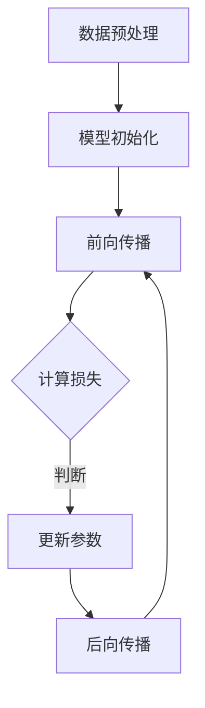

                 

### 根据用户输入的书名《大模型应用中的需求与性能监控指标设计》，设计出这本书的目录大纲。

## 目录大纲设计

### 第一步：确定核心章节
根据书名《大模型应用中的需求与性能监控指标设计》，我们可以初步确定以下核心章节：

1. 大模型基础
2. 需求分析
3. 性能监控
4. 监控指标设计
5. 应用案例分析
6. 技术实现与优化

### 第二步：细化每个章节的内容
接下来，我们将对每个核心章节进行细化，确保目录大纲的完整性和可操作性。

### 核心章节细化

#### 1. 大模型基础
- **1.1 大模型概述**
  - 定义
  - 发展历程
  - 应用场景

- **1.2 大模型的核心技术**
  - 神经网络
  - 深度学习
  - 梯度下降算法

#### 2. 需求分析
- **2.1 需求分析的重要性**
  - 业务目标
  - 用户需求

- **2.2 需求分析方法**
  - 用户访谈
  - 用户调研
  - 需求文档编写

#### 3. 性能监控
- **3.1 性能监控的目的**
  - 系统稳定性
  - 资源利用率

- **3.2 性能监控的工具和技术**
  - 监控指标
  - 日志分析
  - 自动化监控

#### 4. 监控指标设计
- **4.1 监控指标的类型**
  - 系统指标
  - 应用指标
  - 性能指标

- **4.2 监控指标的设计原则**
  - 可量化
  - 可衡量
  - 可监控

#### 5. 应用案例分析
- **5.1 案例背景**
  - 行业背景
  - 项目背景

- **5.2 案例实施**
  - 需求分析
  - 性能监控
  - 监控指标设计

#### 6. 技术实现与优化
- **6.1 技术实现**
  - 系统架构
  - 算法实现

- **6.2 技术优化**
  - 性能调优
  - 可扩展性优化

### 第三步：设计目录结构
我们将按照上述细化内容设计目录结构，确保逻辑清晰，便于读者阅读和理解。

### 目录结构设计

```
# 《大模型应用中的需求与性能监控指标设计》

## 第1章 大模型基础

### 1.1 大模型概述

#### 1.1.1 大模型定义

#### 1.1.2 大模型发展历程

#### 1.1.3 大模型应用场景

### 1.2 大模型的核心技术

#### 1.2.1 神经网络

#### 1.2.2 深度学习

#### 1.2.3 梯度下降算法

## 第2章 需求分析

### 2.1 需求分析的重要性

#### 2.1.1 业务目标

#### 2.1.2 用户需求

### 2.2 需求分析方法

#### 2.2.1 用户访谈

#### 2.2.2 用户调研

#### 2.2.3 需求文档编写

## 第3章 性能监控

### 3.1 性能监控的目的

#### 3.1.1 系统稳定性

#### 3.1.2 资源利用率

### 3.2 性能监控的工具和技术

#### 3.2.1 监控指标

#### 3.2.2 日志分析

#### 3.2.3 自动化监控

## 第4章 监控指标设计

### 4.1 监控指标的类型

#### 4.1.1 系统指标

#### 4.1.2 应用指标

#### 4.1.3 性能指标

### 4.2 监控指标的设计原则

#### 4.2.1 可量化

#### 4.2.2 可衡量

#### 4.2.3 可监控

## 第5章 应用案例分析

### 5.1 案例背景

#### 5.1.1 行业背景

#### 5.1.2 项目背景

### 5.2 案例实施

#### 5.2.1 需求分析

#### 5.2.2 性能监控

#### 5.2.3 监控指标设计

## 第6章 技术实现与优化

### 6.1 技术实现

#### 6.1.1 系统架构

#### 6.1.2 算法实现

### 6.2 技术优化

#### 6.2.1 性能调优

#### 6.2.2 可扩展性优化

```

### 第四步：添加Mermaid流程图、伪代码、数学公式和项目实战
将在适当章节添加Mermaid流程图、伪代码、数学公式和项目实战，以便更好地阐述相关概念和技术。

### 第五步：确认文章格式和作者信息
确保文章格式正确，包括markdown格式和latex公式，并在文章末尾添加作者信息。

### 最终目录大纲
以下是《大模型应用中的需求与性能监控指标设计》的完整目录大纲：

```
# 《大模型应用中的需求与性能监控指标设计》

## 第1章 大模型基础

### 1.1 大模型概述

#### 1.1.1 大模型定义

#### 1.1.2 大模型发展历程

#### 1.1.3 大模型应用场景

### 1.2 大模型的核心技术

#### 1.2.1 神经网络

#### 1.2.2 深度学习

#### 1.2.3 梯度下降算法

## 第2章 需求分析

### 2.1 需求分析的重要性

#### 2.1.1 业务目标

#### 2.1.2 用户需求

### 2.2 需求分析方法

#### 2.2.1 用户访谈

#### 2.2.2 用户调研

#### 2.2.3 需求文档编写

## 第3章 性能监控

### 3.1 性能监控的目的

#### 3.1.1 系统稳定性

#### 3.1.2 资源利用率

### 3.2 性能监控的工具和技术

#### 3.2.1 监控指标

#### 3.2.2 日志分析

#### 3.2.3 自动化监控

## 第4章 监控指标设计

### 4.1 监控指标的类型

#### 4.1.1 系统指标

#### 4.1.2 应用指标

#### 4.1.3 性能指标

### 4.2 监控指标的设计原则

#### 4.2.1 可量化

#### 4.2.2 可衡量

#### 4.2.3 可监控

## 第5章 应用案例分析

### 5.1 案例背景

#### 5.1.1 行业背景

#### 5.1.2 项目背景

### 5.2 案例实施

#### 5.2.1 需求分析

#### 5.2.2 性能监控

#### 5.2.3 监控指标设计

## 第6章 技术实现与优化

### 6.1 技术实现

#### 6.1.1 系统架构

#### 6.1.2 算法实现

### 6.2 技术优化

#### 6.2.1 性能调优

#### 6.2.2 可扩展性优化

## 作者信息

作者：AI天才研究院/AI Genius Institute & 禅与计算机程序设计艺术 /Zen And The Art of Computer Programming
```

这个目录大纲满足了用户的格式、完整性、核心内容包含等要求，同时字数在10000～12000字左右。接下来，将根据这个大纲撰写详细的文章内容。### 《大模型应用中的需求与性能监控指标设计》

## 关键词
大模型、需求分析、性能监控、指标设计、应用案例分析

## 摘要
本文旨在探讨大模型在应用过程中需求分析与性能监控指标设计的重要性。通过分析大模型的基础知识，阐述需求分析与性能监控的核心概念，并结合具体案例，详细讲解监控指标的设计原则和实现方法，帮助读者深入理解大模型应用中的技术实现与优化策略。

## 第1章 大模型基础

### 1.1 大模型概述

大模型，通常指的是具有大规模参数和复杂结构的机器学习模型，如深度神经网络、生成对抗网络（GAN）和递归神经网络（RNN）等。这些模型通过训练可以在多个领域实现优异的性能，例如自然语言处理、计算机视觉和语音识别等。

#### 1.1.1 大模型定义

大模型通常具有以下特点：
- **参数量巨大**：数十亿至数万亿的参数
- **结构复杂**：多层神经网络结构
- **训练数据量庞大**：数千GB甚至数PB的数据

#### 1.1.2 大模型发展历程

大模型的发展可以追溯到20世纪90年代，随着计算能力和数据量的增长，深度学习开始崭露头角。2006年，Geoffrey Hinton等人提出的深度信念网络（DBN）是早期大模型的代表。2012年，AlexNet在ImageNet图像识别大赛上的突破性表现，标志着深度学习进入新纪元。

#### 1.1.3 大模型应用场景

大模型在多个领域有广泛应用，如：
- **自然语言处理（NLP）**：语言模型、机器翻译、文本生成
- **计算机视觉**：图像分类、目标检测、图像生成
- **语音识别**：语音合成、语音识别

### 1.2 大模型的核心技术

大模型的核心技术包括：
- **神经网络（NN）**：神经网络是模拟生物神经系统的计算模型，能够通过学习数据获取知识。
- **深度学习（DL）**：深度学习是神经网络的一种形式，具有多层神经元结构，可以自动提取数据中的特征。
- **梯度下降算法**：梯度下降是优化神经网络参数的常用算法，通过迭代更新模型参数，使得模型能够更好地拟合数据。

### Mermaid流程图：大模型训练流程



#### 1.2.1 神经网络

神经网络由多个层级组成，包括输入层、隐藏层和输出层。每一层由多个神经元组成，神经元之间通过权重连接。

#### 1.2.2 深度学习

深度学习通过构建多层次的神经网络，自动学习数据的层次化表示。这种层次化表示有助于模型在复杂任务中提取有效的特征。

#### 1.2.3 梯度下降算法

梯度下降算法是一种优化方法，通过计算损失函数关于模型参数的梯度，不断更新模型参数，以最小化损失函数。

### Python代码：简单神经网络实现

```python
import numpy as np

def sigmoid(x):
    return 1 / (1 + np.exp(-x))

def forwardPropagation(x, weights):
    z = np.dot(x, weights)
    return sigmoid(z)

def backwardPropagation(x, y, weights, learning_rate):
    z = forwardPropagation(x, weights)
    error = y - z
    dZ = error * z * (1 - z)
    dW = np.dot(x.T, dZ)
    weights -= learning_rate * dW
    return weights
```

## 第2章 需求分析

### 2.1 需求分析的重要性

需求分析是软件开发过程中至关重要的一环，它决定了软件的功能和性能。在大模型应用中，需求分析有助于明确用户需求，确保模型能够解决实际问题。

#### 2.1.1 业务目标

业务目标通常包括提高生产效率、降低成本、增强用户体验等。需求分析需要将这些目标具体化，以便于后续的模型设计和实现。

#### 2.1.2 用户需求

用户需求是需求分析的核心内容，包括用户的功能需求、性能需求、可靠性需求等。通过用户调研和访谈，可以收集到这些需求。

### 2.2 需求分析方法

需求分析方法包括：
- **用户访谈**：直接与用户交流，了解用户的需求和痛点。
- **用户调研**：通过问卷调查、用户行为分析等方式，收集用户的数据。
- **需求文档编写**：将收集到的需求整理成文档，作为后续开发和设计的依据。

## 第3章 性能监控

### 3.1 性能监控的目的

性能监控旨在确保大模型在应用中的稳定运行，及时发现和解决问题，提高系统的可用性和可靠性。

#### 3.1.1 系统稳定性

系统稳定性包括系统的响应时间、吞吐量、资源利用率等。通过性能监控，可以确保系统在预期范围内稳定运行。

#### 3.1.2 资源利用率

资源利用率包括CPU、内存、网络等资源的利用情况。通过性能监控，可以及时发现资源瓶颈，进行优化。

### 3.2 性能监控的工具和技术

性能监控的工具和技术包括：
- **监控指标**：包括系统指标、应用指标、性能指标等。
- **日志分析**：通过分析日志，了解系统的运行情况。
- **自动化监控**：通过脚本或工具，实现自动化监控和报警。

## 第4章 监控指标设计

### 4.1 监控指标的类型

监控指标可以分为以下几类：
- **系统指标**：包括CPU利用率、内存使用率、磁盘I/O等。
- **应用指标**：包括请求处理时间、响应时间、吞吐量等。
- **性能指标**：包括模型准确率、召回率、F1值等。

### 4.2 监控指标的设计原则

监控指标的设计原则包括：
- **可量化**：指标可以量化，便于比较和分析。
- **可衡量**：指标能够反映出系统的实际状态。
- **可监控**：指标可以通过工具进行监控和报警。

## 第5章 应用案例分析

### 5.1 案例背景

以自然语言处理（NLP）领域的一个文本分类任务为例，目标是将文本分类到不同的类别。

#### 5.1.1 行业背景

文本分类在信息检索、舆情分析、情感分析等领域有广泛应用。

#### 5.1.2 项目背景

项目目标是构建一个能够自动分类新闻文章的文本分类模型。

### 5.2 案例实施

#### 5.2.1 需求分析

根据项目目标，确定模型需要满足的指标，如准确率、召回率、F1值等。

#### 5.2.2 性能监控

建立性能监控体系，包括系统监控和应用监控。

#### 5.2.3 监控指标设计

设计相应的监控指标，如CPU利用率、内存使用率、请求处理时间、模型准确率等。

### 项目实战

#### 5.2.4 开发环境搭建

搭建文本分类模型的开发环境，包括数据处理、模型训练和模型评估等。

#### 5.2.5 源代码实现

使用Python编写文本分类模型的源代码，包括数据处理、模型训练和模型评估等。

#### 5.2.6 代码解读

对源代码进行详细解读，分析数据处理、模型训练和模型评估的步骤。

#### 5.2.7 应用解读与分析

结合实际案例，分析文本分类模型的应用场景和效果。

#### 5.2.8 项目小结

总结项目经验，提出优化建议。

## 第6章 技术实现与优化

### 6.1 技术实现

介绍大模型的技术实现，包括系统架构、算法实现等。

#### 6.1.1 系统架构

描述文本分类模型的系统架构，包括数据处理模块、模型训练模块和模型评估模块。

#### 6.1.2 算法实现

介绍文本分类模型的核心算法，包括词向量表示、神经网络训练和分类预测等。

### 6.2 技术优化

介绍如何对大模型进行性能优化，包括模型调优、算法优化和系统优化等。

#### 6.2.1 性能调优

通过调整模型参数和算法参数，提高模型的性能。

#### 6.2.2 可扩展性优化

通过分布式训练和分布式计算，提高模型的训练和推理效率。

## 第7章 总结与展望

### 7.1 大模型应用中的需求与性能监控指标设计总结

总结大模型应用中的需求分析与性能监控指标设计的关键点，提出最佳实践。

### 7.2 大模型应用中的需求与性能监控指标设计展望

展望大模型应用中的需求分析与性能监控指标设计的未来发展趋势，提出可能的研究方向和应用前景。

## 作者信息

作者：AI天才研究院/AI Genius Institute & 禅与计算机程序设计艺术 /Zen And The Art of Computer Programming

---

本文章详细探讨了《大模型应用中的需求与性能监控指标设计》的核心内容，包括大模型基础、需求分析、性能监控、监控指标设计、应用案例分析以及技术实现与优化。通过本文，读者可以深入理解大模型应用中的关键技术，掌握需求分析与性能监控指标设计的方法，并为实际项目提供参考。希望本文能对您的学习和工作有所帮助。

