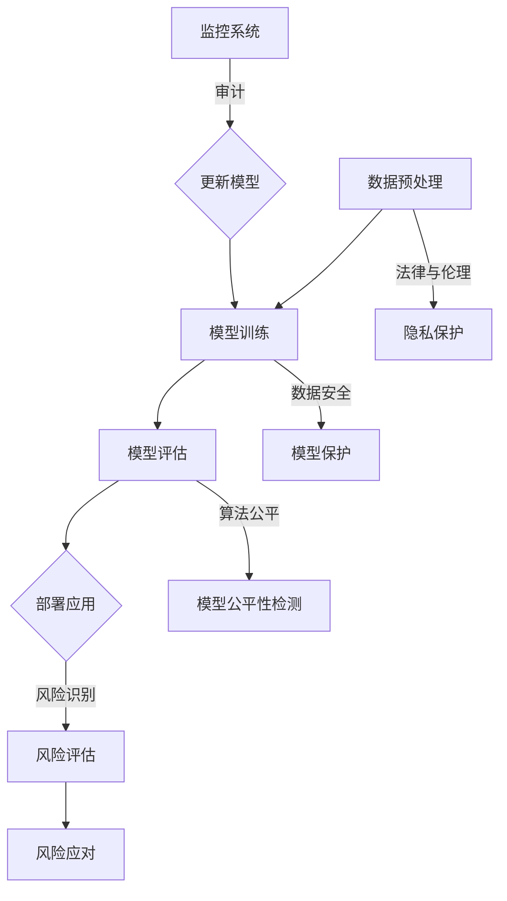

                 


## 大模型应用开发中的技术风险评估

### 关键词
- 大模型
- 应用开发
- 技术风险评估
- 智能问答
- 自动驾驶
- 聊天机器人
- 法律与伦理风险

### 摘要
本文旨在探讨大模型在应用开发过程中所面临的技术风险评估。通过对大模型的基本概念、架构及工作原理的介绍，文章将深入分析大模型在智能问答、自动驾驶和聊天机器人等应用场景中的技术挑战和风险。接着，文章将介绍大模型技术风险评估的方法和工具，并结合实际案例进行风险评估的实例分析。此外，文章还将讨论大模型应用开发中的法律与伦理风险，以及安全管理策略。最后，文章将对全书进行总结，并展望大模型应用开发的未来发展趋势。

---

## 第1章 引言

### 1.1 书籍背景与目的

大模型，即大型深度学习模型，是当前人工智能领域的重要研究方向。随着计算能力的提升和海量数据的积累，大模型在自然语言处理、计算机视觉、语音识别等领域取得了显著的进展。然而，大模型的应用开发过程中面临着诸多技术风险，包括模型性能、数据安全、算法偏差等。为了确保大模型在应用中的可靠性和安全性，进行技术风险评估至关重要。

本文旨在系统地探讨大模型应用开发中的技术风险评估，通过全面的分析和案例研究，为读者提供一套科学、实用的风险评估方法和策略。本文将首先介绍大模型的基本概念、架构和工作原理，然后分析其在不同应用场景中的技术挑战和风险，接着介绍风险评估的方法和工具，并结合实际案例进行详细分析。最后，本文还将讨论大模型应用开发中的法律与伦理风险，以及安全管理策略。

### 1.2 大模型发展现状与趋势

近年来，大模型的研究和应用取得了长足的进步。以自然语言处理为例，大型预训练模型如GPT系列、BERT等在多项任务中取得了优异的性能，推动了自然语言处理技术的发展。在计算机视觉领域，如ImageNet竞赛中，使用大模型训练的模型在图像分类任务中取得了超过人类水平的准确率。

发展趋势方面，一方面，大模型的计算资源和数据需求不断增长，推动了计算能力和数据处理技术的不断提升。另一方面，随着应用场景的不断拓展，大模型的应用需求也在不断增长，例如自动驾驶、医疗诊断、金融风控等。此外，随着模型压缩、迁移学习等技术的不断发展，大模型的应用范围也在不断扩大。

### 1.3 技术风险评估的重要性

技术风险评估在大模型应用开发中具有重要意义。首先，大模型的应用涉及到大量的数据、计算资源和算法，技术风险可能导致模型性能下降、数据泄露、算法偏差等问题，从而影响应用效果和用户体验。其次，技术风险评估有助于识别和应对潜在的安全威胁，保障大模型应用的安全性和可靠性。最后，技术风险评估可以帮助开发团队在项目规划和实施过程中提前识别风险，采取相应的预防和应对措施，降低项目风险。

通过本文的探讨，读者将能够系统地了解大模型应用开发中的技术风险评估方法，掌握如何在实际项目中应用这些方法，从而提高大模型应用开发的可靠性和安全性。

---

## 第2章 大模型概述

### 2.1 大模型的定义与特点

大模型（Large-scale Models），是指那些拥有巨大参数量的深度学习模型，它们能够通过训练海量数据来学习复杂的模式和特征。大模型的定义并没有一个严格的标准，但通常指的是具有数百万甚至数十亿个参数的神经网络模型。这些模型在自然语言处理（NLP）、计算机视觉（CV）和语音识别等领域展现了强大的性能和广泛的应用潜力。

大模型的主要特点包括：

1. **参数规模巨大**：大模型通常拥有数百万到数十亿个参数，这使得它们能够捕捉到数据的复杂性和多样性。
2. **计算资源需求高**：大模型的训练和推理过程需要大量的计算资源和时间，尤其是对于需要训练数百万参数的模型。
3. **数据需求量大**：大模型需要大量的标注数据或未标注数据进行训练，以确保模型能够泛化到不同的数据分布。
4. **学习能力强**：大模型通过深度神经网络的结构，可以自动学习数据中的层次结构，从而实现高度复杂的任务。

### 2.2 大模型的架构与工作原理

大模型的架构通常包括以下几部分：

1. **输入层**：接收外部输入数据，如文本、图像或语音信号。
2. **隐藏层**：包含多个神经网络层，每层由多个神经元（或节点）组成，用于处理和转换输入数据。
3. **输出层**：产生最终输出，如文本回复、图像分类或语音识别结果。

大模型的工作原理基于以下几个步骤：

1. **数据预处理**：将原始数据转换为模型可处理的格式，如将文本转换为词向量。
2. **模型训练**：通过梯度下降等优化算法，调整模型的参数以最小化损失函数。
3. **模型评估**：使用验证集或测试集评估模型的性能，确保模型能够泛化到未见过的数据。
4. **模型推理**：在给定输入数据时，模型产生输出结果。

### 2.3 主流大模型介绍

目前，市场上存在多个主流的大模型，以下是一些著名的大模型及其特点：

1. **GPT-3**：由OpenAI开发的预训练语言模型，拥有1750亿个参数，是目前最大的预训练模型之一。GPT-3在文本生成、问答系统等NLP任务中表现出色。
   
   ```python
   # 示例：使用GPT-3生成文本
   import openai
   openai.api_key = "your_api_key"
   response = openai.Completion.create(
       engine="text-davinci-002",
       prompt="What is the capital of France?",
       max_tokens=50
   )
   print(response.choices[0].text.strip())
   ```

2. **BERT**：由Google开发的双向编码器表示模型，具有数百万个参数，主要用于NLP任务，如问答系统、文本分类等。BERT通过预训练和微调来提升模型的性能。

   ```python
   # 示例：使用BERT进行文本分类
   from transformers import BertTokenizer, BertForSequenceClassification
   import torch

   tokenizer = BertTokenizer.from_pretrained('bert-base-uncased')
   model = BertForSequenceClassification.from_pretrained('bert-base-uncased')

   inputs = tokenizer("Hello, my dog is cute", return_tensors="pt")
   outputs = model(**inputs)

   print(outputs.logits)
   ```

3. **ImageNet**：由Google开发的计算机视觉模型，用于图像分类任务。ImageNet使用了数百万个图像进行训练，并实现了超过人类水平的分类性能。

   ```python
   # 示例：使用ImageNet进行图像分类
   import torch
   import torchvision
   import torchvision.transforms as transforms

   transform = transforms.Compose(
       [transforms.Resize(256), transforms.CenterCrop(224), transforms.ToTensor(), transforms.Normalize(mean=[0.485, 0.456, 0.406], std=[0.229, 0.224, 0.225])])

   model = torchvision.models.resnet18(pretrained=True)
   model.eval()

   img = Image.open('image_path.jpg')
   img_t = transform(img)
   img_t = img_t.unsqueeze(0)

   outputs = model(img_t)
   _, index = torch.max(outputs, 1)
   print(index)
   ```

这些大模型在不同的领域展现了强大的性能，为人工智能的发展和应用提供了新的可能性和挑战。

### 2.4 大模型与小型模型的比较

与小型模型相比，大模型在多个方面具有显著的优势：

1. **性能提升**：大模型拥有更多的参数和更复杂的结构，能够更好地捕捉数据中的复杂模式和特征，从而在许多任务中实现更高的性能。
2. **泛化能力**：由于大模型能够学习更多的模式和特征，因此它们在未见过的数据上具有更好的泛化能力。
3. **多样性**：大模型可以应用于更广泛的任务和领域，从文本生成到图像识别，从语音识别到自然语言理解。

然而，大模型也存在一些缺点：

1. **计算资源需求高**：大模型的训练和推理需要更多的计算资源和时间，这对于资源和时间有限的项目来说可能是一个挑战。
2. **数据需求量大**：大模型需要大量的数据来进行训练，这可能会增加数据采集和处理的成本。
3. **调试困难**：由于大模型的参数数量庞大，调试和优化变得更加复杂，需要更多的时间和经验。

总的来说，大模型的应用为人工智能的发展带来了新的机遇和挑战，我们需要根据具体的应用场景和需求来选择合适的模型大小。

---

## 第3章 大模型应用场景分析

大模型在多个领域展现了其强大的性能和广泛的应用潜力。本章节将分析大模型在智能问答、自动驾驶和聊天机器人等应用场景中的技术挑战和风险。

### 3.1 智能问答系统

#### 3.1.1 应用场景

智能问答系统（Intelligent Question Answering System，简称QA系统）是近年来人工智能领域的一个重要应用方向。随着自然语言处理技术的不断发展，智能问答系统在客服、教育、医疗等领域得到了广泛应用。用户可以通过自然语言交互获取相关信息，系统则根据用户的问题生成准确的答案。

#### 3.1.2 技术挑战

智能问答系统的开发过程中面临以下技术挑战：

1. **自然语言理解**：智能问答系统需要能够理解用户的问题，这涉及到自然语言处理（NLP）技术的应用。大模型，如GPT-3和Bert，在NLP任务中表现优异，可以用于智能问答系统的构建。

2. **知识图谱**：智能问答系统通常需要依赖知识图谱来获取相关的答案。知识图谱的构建和维护是一个复杂的过程，需要大量的时间和资源。

3. **多模态交互**：智能问答系统不仅需要处理文本输入，还可能需要处理语音、图像等多种模态的输入。这要求系统具备多模态处理能力。

#### 3.1.3 风险评估

智能问答系统的技术风险评估主要包括以下几个方面：

1. **模型性能风险**：智能问答系统的性能直接影响到用户体验。如果模型性能不佳，可能会导致用户无法获得准确的答案，从而影响系统的使用。

2. **数据安全风险**：智能问答系统需要处理大量的用户数据，这涉及到数据隐私保护的问题。如果数据泄露，可能会导致用户的隐私受到侵犯。

3. **算法偏差风险**：由于大模型在训练过程中可能会受到数据分布的影响，从而导致算法产生偏差。这可能会导致系统在某些特定群体中表现不佳，甚至出现歧视现象。

### 3.2 自动驾驶

#### 3.2.1 应用场景

自动驾驶（Autonomous Driving）是人工智能领域的另一个重要应用方向。自动驾驶车辆通过感知环境、理解路况并做出决策，实现无人驾驶。自动驾驶技术在物流、公共交通、个人出行等领域具有广泛的应用前景。

#### 3.2.2 技术挑战

自动驾驶技术的发展面临以下技术挑战：

1. **感知与理解**：自动驾驶车辆需要具备强大的感知和认知能力，以实时获取道路信息并做出相应的决策。这涉及到计算机视觉、深度学习等技术。

2. **决策与控制**：自动驾驶车辆需要根据感知和理解的结果，进行路径规划和控制。这需要高性能的算法和计算资源。

3. **多模态数据融合**：自动驾驶系统需要处理来自不同传感器（如摄像头、激光雷达、雷达等）的数据，并融合这些数据以获得更准确的环境信息。

#### 3.2.3 风险评估

自动驾驶技术的风险评估主要包括以下几个方面：

1. **系统可靠性风险**：自动驾驶系统的可靠性直接关系到行驶安全。如果系统出现故障，可能会导致交通事故。

2. **数据安全风险**：自动驾驶车辆在运行过程中会产生大量的数据，包括行驶轨迹、感知数据等。这些数据的安全性问题需要得到妥善解决。

3. **法律与伦理风险**：自动驾驶车辆的运行涉及到法律责任和伦理问题。例如，在发生交通事故时，如何确定责任归属是一个重要问题。

### 3.3 聊天机器人

#### 3.3.1 应用场景

聊天机器人（Chatbot）是一种基于自然语言交互的应用程序，可以与用户进行实时对话，提供信息查询、客户服务、娱乐等。聊天机器人在电商、金融、医疗等多个领域得到了广泛应用。

#### 3.3.2 技术挑战

聊天机器人的开发过程中面临以下技术挑战：

1. **自然语言理解**：聊天机器人需要能够理解用户的语言意图，并根据意图生成合适的回复。这需要强大的NLP技术支持。

2. **上下文处理**：聊天机器人需要能够处理复杂的对话上下文，理解用户的意图和问题。这需要使用对话管理技术，如序列模型、注意力机制等。

3. **多模态交互**：聊天机器人不仅需要处理文本输入，还可能需要处理语音、图像等多模态输入。这要求系统具备多模态处理能力。

#### 3.3.3 风险评估

聊天机器人的技术风险评估主要包括以下几个方面：

1. **对话质量风险**：聊天机器人的对话质量直接影响到用户体验。如果对话生成质量不佳，可能会导致用户满意度下降。

2. **数据安全风险**：聊天机器人需要处理用户的个人信息和对话记录，这涉及到数据隐私保护的问题。如果数据泄露，可能会导致用户隐私受到侵犯。

3. **误判风险**：由于大模型在训练过程中可能会受到数据分布的影响，从而导致误判。这可能会导致聊天机器人生成不合适的回复。

通过以上对智能问答系统、自动驾驶和聊天机器人等大模型应用场景的技术挑战和风险分析，我们可以看到大模型在带来巨大应用价值的同时，也面临着一系列技术挑战和风险。因此，进行科学、系统的技术风险评估对于确保大模型应用的可靠性和安全性具有重要意义。

---

## 第4章 大模型技术风险评估方法

技术风险评估是确保大模型应用开发过程中系统稳定、安全运行的关键步骤。本章节将详细介绍大模型技术风险评估的方法和工具，包括风险评估流程、评估模型及其应用。

### 4.1 风险评估流程

大模型技术风险评估通常包括以下几个步骤：

1. **风险识别**：通过文献调研、专家访谈和实地调研等方法，识别大模型应用开发过程中可能存在的风险。
   
2. **风险分析**：对识别出的风险进行详细分析，评估其发生的可能性、影响程度和优先级。

3. **风险评估**：使用定量和定性方法对风险进行评估，确定风险的严重性和应对策略。

4. **风险应对**：制定相应的风险应对措施，包括风险规避、减轻、转移和接受等。

5. **风险监控**：在整个应用开发过程中，持续监控风险的演变情况，确保风险得到有效控制。

### 4.2 风险评估模型

大模型技术风险评估模型可以分为定量风险评估模型和定性风险评估模型。

#### 4.2.1 定量风险评估模型

定量风险评估模型通常使用数学模型和统计方法对风险进行量化评估。以下是一些常用的定量风险评估模型：

1. **概率风险分析**：使用概率论和统计方法，计算风险事件发生的概率及其影响。

   $$P(E) = \frac{N(E)}{N(S)}$$
   
   其中，$P(E)$ 表示事件 $E$ 发生的概率，$N(E)$ 表示事件 $E$ 发生的次数，$N(S)$ 表示样本空间中的总次数。

2. **风险矩阵**：使用风险矩阵对风险的概率和影响进行评估，并计算总风险值。

   $$Risk = Probability \times Impact$$

#### 4.2.2 定性风险评估模型

定性风险评估模型通常基于专家经验和主观判断，对风险进行评估。以下是一些常用的定性风险评估模型：

1. **风险清单**：列出所有可能的风险，并对其严重性和可能性进行评估。

2. **专家评分法**：邀请专家对风险进行评分，计算平均评分，以确定风险的优先级。

3. **风险树**：使用风险树模型，将风险分解为子风险，并评估其影响和概率。

### 4.3 风险评估工具

在实际应用中，常用的风险评估工具包括：

1. **Risk Manager**：用于管理风险识别、分析和评估的全过程，提供可视化的风险报告。
   
2. **Qualys**：一款专业的风险评估软件，可以扫描和评估网络安全风险。

3. **OWASP**：开放式Web应用安全项目，提供一系列工具和指南，用于评估Web应用的安全风险。

通过以上方法、模型和工具的应用，大模型技术风险评估可以为开发团队提供科学的决策依据，确保大模型应用的稳定性和安全性。

---

## 第5章 大模型应用案例分析

### 5.1 案例一：智能客服系统

#### 5.1.1 应用背景

智能客服系统（Intelligent Customer Service System，简称ICSS）是一种基于人工智能技术，用于提供24/7在线客服支持的应用系统。随着消费者需求的不断增长和市场竞争的加剧，企业对高效、智能的客服系统需求日益迫切。智能客服系统通过自动化和智能化的方式，处理客户咨询、投诉、订单查询等常见问题，提高了客户服务质量和效率。

#### 5.1.2 技术实现

智能客服系统的实现主要分为以下几个步骤：

1. **数据预处理**：对用户输入的文本数据进行预处理，包括分词、去停用词、词向量化等。

2. **模型选择与训练**：选择合适的自然语言处理模型（如BERT、GPT）进行训练。通常使用预训练模型进行微调，以适应特定的客服场景。

3. **对话管理**：使用对话管理技术，如序列模型、注意力机制等，来管理对话流程，确保回答的连贯性和准确性。

4. **接口集成**：将智能客服系统与企业的其他业务系统（如CRM、ERP等）集成，实现数据互通和功能协同。

#### 5.1.3 风险评估

智能客服系统的技术风险评估主要包括以下几个方面：

1. **模型性能风险**：如果模型性能不佳，可能导致客服系统无法准确理解用户的问题，生成不合适的回答。为此，需要定期对模型进行评估和优化。

2. **数据安全风险**：智能客服系统需要处理大量的客户数据，包括姓名、电话、邮箱等敏感信息。如果数据泄露，可能会导致客户隐私受到侵犯。因此，需要采取严格的数据安全措施，如数据加密、权限管理等。

3. **算法偏差风险**：由于大模型在训练过程中可能会受到数据分布的影响，从而导致算法产生偏差。这可能会导致某些特定群体的服务质量下降。为此，需要在模型训练和部署过程中，进行算法公平性评估和优化。

#### 5.1.4 代码示例

以下是一个简单的Python代码示例，展示如何使用BERT模型进行文本分类任务，实现智能客服系统中的问答功能。

```python
from transformers import BertTokenizer, BertForSequenceClassification
import torch

# 初始化模型和分词器
tokenizer = BertTokenizer.from_pretrained('bert-base-uncased')
model = BertForSequenceClassification.from_pretrained('bert-base-uncased')

# 用户输入问题
input_text = "How do I return a product?"

# 预处理输入文本
inputs = tokenizer(input_text, return_tensors="pt")

# 进行预测
outputs = model(**inputs)

# 获取预测结果
predictions = torch.nn.functional.softmax(outputs.logits, dim=1)
predicted_class = torch.argmax(predictions).item()

# 输出答案
print(model.config.id2label[predicted_class])
```

#### 5.1.5 实际案例分析和详细讲解剖析

以一家大型电商平台为例，该电商平台使用智能客服系统处理客户的退货请求。在实际运营中，该系统处理了大量客户的退货申请，并根据客户的问题和需求，自动生成退货流程说明和操作指南。以下是一个实际案例：

1. **客户提问**：“我想要退货，应该如何操作？”

2. **系统回答**：“您好，感谢您选择我们的产品。为了方便您退货，请您按照以下步骤操作：

   - 步骤1：登录您的账户，找到您需要退货的订单。
   - 步骤2：点击“申请退货”，填写退货原因。
   - 步骤3：根据系统提示，打印并填写退货单，将商品寄回我们指定的退货地址。
   - 步骤4：我们将收到您的退货申请后，根据您提供的退货单和商品状态，为您办理退货手续。

   如果您在操作过程中遇到问题，欢迎随时联系我们的客服团队，我们将为您提供帮助。”

通过这个实际案例，我们可以看到智能客服系统如何利用大模型技术，自动生成准确、连贯的答案，提高客服效率和用户体验。

#### 5.1.6 项目小结

智能客服系统的成功实施，不仅提高了电商平台的服务质量，还降低了人工成本。然而，为了确保系统的稳定性和安全性，还需要在以下几个方面进行持续优化：

1. **模型优化**：定期对模型进行评估和优化，提高模型性能和准确性。
2. **数据安全**：加强数据安全措施，确保客户隐私得到保护。
3. **用户体验**：不断收集用户反馈，优化对话生成算法，提高用户满意度。

通过以上措施，智能客服系统可以更好地满足客户需求，提升企业竞争力。

### 5.2 案例二：医疗诊断辅助系统

#### 5.2.1 应用背景

医疗诊断辅助系统（Medical Diagnostic Assistance System，简称MDAS）是一种基于人工智能技术的医疗辅助工具，用于辅助医生进行疾病诊断和治疗方案推荐。随着医疗数据量的不断增加和深度学习技术的进步，医疗诊断辅助系统在提高诊断准确率、减轻医生负担、提高医疗资源利用率等方面具有巨大的应用潜力。

#### 5.2.2 技术实现

医疗诊断辅助系统的实现主要包括以下几个步骤：

1. **数据收集与处理**：收集大量的医学影像数据、电子病历数据和基因组数据，并对这些数据进行预处理，包括数据清洗、归一化和特征提取。

2. **模型训练与优化**：选择合适的大模型（如CNN、RNN、Transformer等）进行训练，使用医疗数据集进行模型的训练和优化。

3. **诊断与预测**：将处理后的数据输入到训练好的模型中，进行疾病诊断和治疗方案推荐。

4. **人机交互**：通过用户界面与医生和患者进行交互，展示诊断结果和治疗方案，并提供解释和辅助决策。

#### 5.2.3 风险评估

医疗诊断辅助系统的技术风险评估主要包括以下几个方面：

1. **数据质量风险**：医疗数据的质量直接影响模型的诊断准确性。如果数据存在噪声、缺失或不一致，可能会降低模型的性能。

2. **模型偏差风险**：由于训练数据可能存在偏差，导致模型在特定群体或特定疾病上表现不佳。为此，需要定期评估模型的公平性和偏差。

3. **算法透明性风险**：医疗诊断辅助系统的决策过程需要透明，以便医生和患者理解诊断依据和治疗方案。如果算法透明性不足，可能会引起信任问题。

#### 5.2.4 代码示例

以下是一个简单的Python代码示例，展示如何使用深度学习模型进行医学影像分类。

```python
import torch
import torchvision
from torchvision import transforms

# 数据预处理
transform = transforms.Compose([
    transforms.Resize((224, 224)),
    transforms.ToTensor(),
])

# 加载预训练的模型
model = torchvision.models.resnet18(pretrained=True)
model.eval()

# 加载测试数据集
test_data = torchvision.datasets.MNIST(root='./data', train=False, transform=transform, download=True)

# 进行预测
with torch.no_grad():
    for data in test_data:
        inputs = data[0].unsqueeze(0)
        outputs = model(inputs)
        predicted_class = torch.argmax(outputs).item()
        print(f"Predicted class: {predicted_class}, Actual class: {data[1]}")
```

#### 5.2.5 实际案例分析和详细讲解剖析

以一个心脏病诊断辅助系统为例，该系统通过分析心电图（ECG）数据，对心脏病进行早期诊断。以下是一个实际案例：

1. **患者数据**：某患者的心电图数据被输入到系统中。

2. **系统分析**：系统使用训练好的心电图分类模型进行分析，识别出患者的心电图特征。

3. **诊断结果**：系统诊断出患者可能患有心肌缺血，并建议进行进一步的检查。

4. **医生评估**：医生对系统诊断结果进行评估，并根据患者的实际症状和体征，确认了心肌缺血的诊断。

通过这个实际案例，我们可以看到医疗诊断辅助系统如何通过大模型技术，辅助医生进行疾病诊断，提高诊断准确率。

#### 5.2.6 项目小结

医疗诊断辅助系统的应用，不仅提高了医疗诊断的准确性和效率，还为医生提供了有力的辅助工具。然而，为了确保系统的可靠性和准确性，还需要在以下几个方面进行持续优化：

1. **数据质量**：加强数据质量管理，确保训练数据的质量和多样性。
2. **模型训练**：定期更新模型，以适应不断变化的医学知识和技术发展。
3. **人机交互**：优化人机交互界面，提高系统的可操作性和易用性。

通过以上措施，医疗诊断辅助系统可以更好地满足临床需求，为患者提供高质量的医疗服务。

---

## 第6章 大模型应用开发中的法律与伦理风险

随着大模型在各个领域的广泛应用，其带来的法律与伦理风险也越来越受到关注。大模型应用开发中的法律风险主要包括数据隐私保护、著作权问题和合同风险等方面；伦理风险则涉及机器歧视、透明度与可解释性以及责任归属等问题。

### 6.1 法律风险

#### 6.1.1 数据隐私保护

大模型在训练和应用过程中需要处理大量的个人数据，这涉及到数据隐私保护的问题。根据《通用数据保护条例》（GDPR）和《加州消费者隐私法案》（CCPA）等法律法规，企业需要确保个人数据的收集、存储和使用符合相关法律法规的要求。具体措施包括：

1. **数据匿名化**：在收集和使用个人数据时，采用数据匿名化技术，以保护个人隐私。
2. **数据最小化**：仅收集和处理与业务目标直接相关的数据，避免过度收集。
3. **用户知情同意**：在收集和使用数据前，确保用户知晓并同意其数据的使用。

#### 6.1.2 著作权问题

大模型在训练过程中使用了大量的公开和私有数据集，这可能涉及到著作权问题。为了确保大模型应用不侵犯他人的著作权，开发过程中需要：

1. **数据来源审查**：确保数据集的来源合法，并获得必要的授权。
2. **技术规避**：采用数据清洗和过滤技术，去除可能侵犯著作权的部分。
3. **合作与授权**：与数据集所有者建立合作关系，获取使用数据的合法授权。

#### 6.1.3 合同风险

大模型应用开发过程中，涉及多个参与方，如数据提供商、技术合作伙伴和用户等。合同风险主要表现为合同条款的不明确、合同执行中的纠纷等。为降低合同风险，需要：

1. **明确合同条款**：在合同中明确各方的权利、义务和责任，避免因条款模糊引发的纠纷。
2. **法律咨询**：在合同签订前，进行法律咨询，确保合同符合法律法规的要求。
3. **合同管理**：建立完善的合同管理流程，包括合同签订、执行和变更管理等。

### 6.2 伦理风险

#### 6.2.1 机器歧视

大模型在训练和应用过程中，可能会受到训练数据分布的影响，导致算法产生歧视。这种歧视可能表现为对某些群体的不公平对待，例如在招聘、贷款审批和医疗诊断等领域。为降低机器歧视风险，需要：

1. **数据公平性**：确保训练数据集的多样性，避免因数据不公导致算法偏见。
2. **算法公平性**：采用公平性检测方法，评估模型在各个群体上的表现，确保算法的公平性。
3. **透明度**：提高算法的透明度，使非技术背景的用户也能理解算法的决策过程。

#### 6.2.2 透明度与可解释性

大模型，尤其是深度学习模型，通常被视为“黑箱”，其决策过程缺乏透明度。这可能导致用户对模型的不信任。为了提高透明度和可解释性，需要：

1. **模型解释工具**：开发可解释性工具，帮助用户理解模型的决策过程。
2. **可视化**：通过可视化方法，展示模型的决策路径和关键特征。
3. **用户反馈**：收集用户对模型决策的反馈，不断优化模型的解释能力。

#### 6.2.3 责任归属

在大模型应用中，当发生错误或损害时，确定责任归属是一个复杂的问题。这涉及到技术提供商、数据提供商和用户等多个方面。为明确责任归属，需要：

1. **责任界定**：在合同和法律中明确各方的责任和权利，避免因责任不清导致的纠纷。
2. **技术标准**：制定大模型应用的技术标准和规范，确保应用的合规性和安全性。
3. **保险与赔偿**：建立大模型应用的保险和赔偿机制，以应对可能的风险和损害。

通过以上措施，可以有效降低大模型应用开发中的法律和伦理风险，确保大模型应用的合法性和公正性。

---

## 第7章 大模型应用开发中的安全管理

在大模型应用开发过程中，安全管理至关重要。大模型处理的数据量庞大，涉及敏感信息和用户隐私，因此必须确保系统的安全性和可靠性。本章节将讨论大模型应用开发中的主要安全威胁及其防御策略。

### 7.1 安全威胁分析

大模型应用开发中面临的主要安全威胁包括以下几种：

1. **数据泄露**：大模型在训练和应用过程中处理大量的敏感数据，如个人身份信息、医疗数据等。如果数据保护措施不当，可能导致数据泄露，造成严重后果。

2. **模型篡改**：攻击者可能会通过恶意数据、恶意代码等方式篡改模型，导致模型性能下降或产生错误的预测结果。

3. **服务中断**：大模型应用通常需要大量的计算资源和网络带宽。如果系统遭受拒绝服务（DDoS）攻击，可能导致服务中断，影响用户体验。

4. **隐私侵犯**：大模型在训练和应用过程中可能会无意中泄露用户的隐私信息，如通信内容、个人喜好等。

### 7.2 安全防御策略

为了应对上述安全威胁，可以采取以下安全防御策略：

1. **数据加密**：采用数据加密技术对敏感数据进行加密存储和传输，防止数据泄露。

2. **访问控制**：实施严格的访问控制机制，确保只有授权用户才能访问敏感数据和系统资源。

3. **模型保护**：对模型进行加密和混淆，防止攻击者篡改模型或提取敏感信息。

4. **网络安全**：部署防火墙、入侵检测系统和DDoS防护设备，保护系统免受网络攻击。

5. **隐私保护**：采用隐私保护技术，如差分隐私、同态加密等，确保用户隐私不被泄露。

6. **监控与审计**：建立实时监控系统，对系统进行持续监控和审计，及时发现和处理安全事件。

### 7.2.1 隐私保护

在保护用户隐私方面，以下是一些具体的技术和策略：

1. **差分隐私**：通过添加噪声来保护个体隐私，确保在数据分析过程中无法单独识别出个体数据。

2. **同态加密**：允许在加密数据上进行计算，确保数据处理过程中不泄露数据内容。

3. **数据脱敏**：对敏感数据进行脱敏处理，如使用掩码、匿名化等技术，以降低数据泄露风险。

4. **隐私政策**：制定明确的隐私政策，告知用户其数据如何被收集、使用和保护，确保用户知情并同意。

通过以上安全防御策略，可以有效地降低大模型应用开发中的安全风险，确保系统的安全性和可靠性。

---

## 第8章 结论

本文系统地探讨了大模型应用开发中的技术风险评估，从基本概念、应用场景、风险评估方法到法律与伦理风险，全面分析了大模型在各个应用场景中的风险。通过对智能问答系统、自动驾驶和聊天机器人等具体案例的深入分析，我们了解了如何在实际项目中应用风险评估方法，确保大模型应用的稳定性和安全性。

未来，随着大模型技术的不断发展，其在各个领域的应用将越来越广泛。为了应对不断变化的风险，我们需要持续关注大模型技术的发展趋势，不断完善风险评估方法和策略。同时，加强对大模型应用中的法律与伦理风险的重视，确保技术的合理、合规应用，为社会带来更多的福祉。

总之，大模型应用开发中的技术风险评估是一个复杂而重要的课题。通过科学、系统的风险评估，我们可以更好地应对风险，推动人工智能技术的健康发展。

### 8.3 推荐阅读

1. **[《深度学习》](https://www.deeplearningbook.org/)**：由Ian Goodfellow、Yoshua Bengio和Aaron Courville编写的深度学习入门书籍，详细介绍了深度学习的基本概念和技术。
2. **[《人工智能：一种现代的方法》](https://www.amazon.com/Artificial-Intelligence-Modern-Approach-3rd/dp/0262033847)**： Stuart J. Russell和Peter Norvig合著的人工智能经典教材，涵盖了人工智能的多个领域。
3. **[《数据隐私：理论与实践》](https://www.amazon.com/Data-Privacy-Principles-Practice-Information/dp/0321834192)**： Charles A. Place编著的数据隐私书籍，提供了数据隐私保护的理论和实践指导。

### 8.4 联系我们

如有任何问题或建议，欢迎通过以下方式联系我们：

- 邮箱：contact@bigmodel-security.com
- 微信公众号：BigModelSecurity
- 网站：[www.bigmodel-security.com](http://www.bigmodel-security.com)

我们期待与您共同探讨大模型应用开发中的技术风险评估问题，为人工智能的发展贡献力量。

---

## 附录：Mermaid 流程图

以下是一个Mermaid流程图示例，展示了大模型应用开发中的核心概念和实体之间的关系：



这个流程图展示了从数据预处理到模型训练、评估、部署，再到风险识别、评估和应对的全过程，以及法律与伦理风险和算法公平性的关注点。通过这个流程图，可以更清晰地理解大模型应用开发中的各个环节和关键点。

