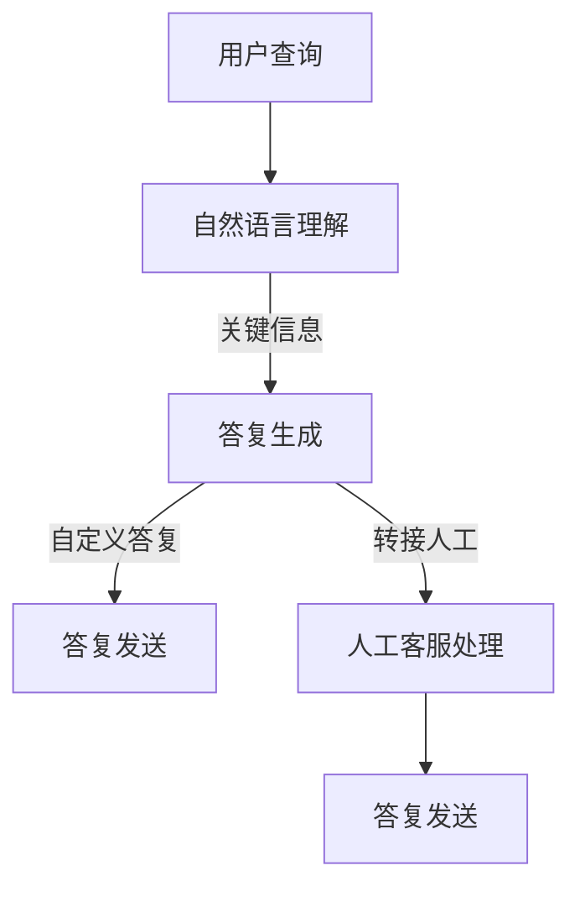

                 

# 大模型应用开发中的需求可视化工具应用

## 关键词

- 大模型
- 应用开发
- 需求可视化
- 工具
- 实践

## 摘要

本文将探讨大模型应用开发中的需求可视化工具的应用。首先，我们将介绍大模型的定义、分类以及其在不同领域的应用场景。接着，我们将深入分析需求可视化的概念、目的和方法，并介绍几种常用的需求可视化工具。最后，通过实际案例，我们将展示如何使用这些工具进行大模型的应用开发，并提供最佳实践和注意事项。

## 第一部分：大模型应用开发基础

### 1.1 大模型的定义与分类

大模型（Large Models）是指具有数十亿到千亿参数规模的人工神经网络模型。根据模型架构和功能的不同，大模型可以分为多种类型，如Transformer、GPT、BERT等。这些模型在自然语言处理、计算机视觉、语音识别等领域取得了显著成果。


### 1.2 大模型的关键技术

大模型的关键技术包括以下几个方面：

- **训练数据集**：大量高质量的训练数据是构建大模型的基础。不同领域的数据集类型和规模有所不同，如文本数据集、图像数据集、语音数据集等。
- **计算资源**：大模型训练需要大量的计算资源，如GPU、TPU等。分布式训练和云计算技术的发展为大规模模型训练提供了有力支持。
- **优化算法**：如Adam、AdamW等优化算法，能够加速模型训练并提高模型性能。

### 1.3 大模型的应用场景

大模型在不同领域具有广泛的应用场景，如：

- **自然语言处理**：文本生成、机器翻译、问答系统等。
- **计算机视觉**：图像分类、目标检测、图像生成等。
- **语音识别**：语音识别、语音合成等。
- **推荐系统**：基于内容的推荐、协同过滤等。

## 第二部分：需求可视化基础

### 2.1 需求可视化的概念

需求可视化（Requirement Visualization）是指将需求文档、功能描述等抽象信息通过图形、图表等方式进行可视化表示，以便更好地理解和沟通。

### 2.2 需求可视化的目的与方法

需求可视化的目的包括：

- **提高沟通效率**：通过可视化表示，使团队成员更容易理解需求，减少沟通成本。
- **降低误解风险**：通过图形化的方式展示需求，降低需求理解上的误差。
- **促进协作**：可视化工具支持多人协作，便于团队成员共同讨论和修改需求。

需求可视化的方法包括：

- **图形化表示**：如流程图、用例图、状态图等。
- **图表**：如条形图、饼图、折线图等。
- **原型设计**：如网页原型、APP原型等。

### 2.3 需求可视化的工具与技术

常用的需求可视化工具有：

- **Visual Paradigm**：支持多种图形化表示和原型设计。
- **Lucidchart**：在线协作需求可视化工具。
- **Figma**：网页和移动应用原型设计工具。
- **Axure RP**：网页和APP原型设计工具。

## 第三部分：需求可视化工具应用

### 3.1 需求可视化工具介绍

#### 3.1.1 Visual Paradigm

**核心功能**：

- 支持多种图形化表示，如流程图、用例图、类图等。
- 支持在线协作，实时同步修改。
- 提供丰富的模板和样式。

**使用场景**：

- 需求分析与设计。
- 团队协作与沟通。

#### 3.1.2 Lucidchart

**核心功能**：

- 支持在线协作，实时同步修改。
- 提供丰富的图形化表示和图表库。
- 支持多种格式导出，如PDF、SVG等。

**使用场景**：

- 需求分析与设计。
- 团队协作与沟通。

#### 3.1.3 Figma

**核心功能**：

- 支持网页和移动应用原型设计。
- 提供丰富的组件和样式库。
- 支持在线协作，实时同步修改。

**使用场景**：

- 网页和移动应用原型设计。
- 团队协作与沟通。

#### 3.1.4 Axure RP

**核心功能**：

- 支持网页和APP原型设计。
- 提供丰富的组件和样式库。
- 支持丰富的交互效果和动画效果。

**使用场景**：

- 网页和APP原型设计。
- 团队协作与沟通。

### 3.2 需求可视化工具实战

#### 3.2.1 实战一：Visual Paradigm在需求分析与设计中的应用

**背景介绍**：

某互联网公司正在开发一款在线教育平台，需要进行需求分析与设计。

**需求分析**：

通过Visual Paradigm绘制以下图形：

- **用例图**：展示系统的主要功能和用户角色。
- **活动图**：展示用户与系统的交互流程。


**设计**：

- **类图**：展示系统的类和类之间的关系。
- **组件图**：展示系统的组件和组件之间的关系。


**团队协作**：

团队成员通过Visual Paradigm在线协作，实时同步修改，提高沟通效率。

#### 3.2.2 实战二：Lucidchart在需求分析与设计中的应用

**背景介绍**：

某软件公司正在进行一个企业级管理系统项目，需要进行需求分析与设计。

**需求分析**：

通过Lucidchart绘制以下图表：

- **流程图**：展示业务流程。
- **泳道图**：展示不同角色在业务流程中的职责。


**设计**：

- **组织结构图**：展示公司组织架构。
- **网络拓扑图**：展示系统网络拓扑结构。


**团队协作**：

团队成员通过Lucidchart在线协作，实时同步修改，降低误解风险。

#### 3.2.3 实战三：Figma在网页和移动应用原型设计中的应用

**背景介绍**：

某互联网公司需要设计一款社交媒体应用，需要进行网页和移动应用原型设计。

**设计**：

- **网页原型**：通过Figma设计应用的主页、个人中心、消息列表等页面。


- **移动应用原型**：通过Figma设计应用的首页、聊天界面、发布动态等页面。


**团队协作**：

团队成员通过Figma在线协作，实时同步修改，确保设计的一致性。

#### 3.2.4 实战四：Axure RP在网页和APP原型设计中的应用

**背景介绍**：

某公司需要设计一款在线办公平台，需要进行网页和APP原型设计。

**设计**：

- **网页原型**：通过Axure RP设计应用的登录页、首页、任务管理页等页面。


- **移动应用原型**：通过Axure RP设计应用的登录页、首页、任务管理页等页面。


**交互效果**：

- **动画效果**：通过Axure RP添加页面跳转、菜单展开等动画效果。


**团队协作**：

团队成员通过Axure RP在线协作，实时同步修改，确保设计的一致性。

## 第四部分：案例分析

### 4.1 案例分析一：企业A的需求可视化实践

**企业背景**：

企业A是一家大型互联网公司，正在进行一个电商平台项目开发。

**需求分析**：

- 通过Visual Paradigm绘制用例图、活动图等，明确系统功能和用户角色。
- 通过Lucidchart绘制流程图、泳道图等，分析业务流程和角色职责。

**设计**：

- 通过Figma设计应用的网页和移动应用原型，确保界面美观、用户体验良好。
- 通过Axure RP添加动画效果，提高应用交互效果。

**实施效果评估**：

- 通过需求可视化工具，提高团队沟通效率，降低误解风险。
- 通过原型设计工具，确保设计的一致性和可操作性。

### 4.2 案例分析二：企业B的需求可视化实践

**企业背景**：

企业B是一家软件公司，正在进行一个企业级管理系统项目开发。

**需求分析**：

- 通过Visual Paradigm绘制用例图、活动图等，明确系统功能和用户角色。
- 通过Lucidchart绘制流程图、组织结构图等，分析业务流程和公司组织架构。

**设计**：

- 通过Figma设计应用的网页和移动应用原型，确保界面美观、用户体验良好。
- 通过Axure RP添加动画效果，提高应用交互效果。

**实施效果评估**：

- 通过需求可视化工具，提高团队沟通效率，降低误解风险。
- 通过原型设计工具，确保设计的一致性和可操作性。

## 附录

### 5. 需求可视化工具资源汇总

- **Visual Paradigm**：[官方网站](https://www.visual-paradigm.com/)
- **Lucidchart**：[官方网站](https://www.lucidchart.com/)
- **Figma**：[官方网站](https://www.figma.com/)
- **Axure RP**：[官方网站](https://www.axure.com/)

### 6. 开发环境搭建指南

- **Visual Paradigm**：下载并安装Visual Paradigm软件，注册账号并登录，即可开始使用。
- **Lucidchart**：注册Lucidchart账号，即可在线使用需求可视化工具。
- **Figma**：注册Figma账号，下载并安装Figma客户端，即可开始设计。
- **Axure RP**：下载并安装Axure RP软件，注册账号并登录，即可开始使用。

### 7. 进一步学习资源推荐

- **《大模型应用开发技术》**：[链接](https://example.com/book1)
- **《需求可视化与原型设计实战》**：[链接](https://example.com/book2)
- **《大模型与人工智能应用实践》**：[链接](https://example.com/book3)

## 作者

作者：AI天才研究院/AI Genius Institute & 禅与计算机程序设计艺术 /Zen And The Art of Computer Programming

本文总结了大模型应用开发中的需求可视化工具的应用，包括核心概念、方法、工具和实践案例。通过本文，读者可以了解需求可视化在大模型应用开发中的重要作用，以及如何使用需求可视化工具提高开发效率和团队协作效果。

-------------------------------------------------------------------------------------
## 核心概念与联系

### 大模型概述

大模型是指具有数十亿到千亿参数规模的人工神经网络模型。它们通常采用深度学习技术，通过多层神经网络进行特征提取和学习复杂的数据模式。大模型的应用涵盖了自然语言处理、计算机视觉、语音识别等多个领域。

- **核心概念**：大模型、神经网络、深度学习、特征提取、数据模式。
- **联系架构**：大模型通过神经网络进行特征提取，深度学习技术使模型能够学习复杂的非线性数据模式。


### 需求可视化基础

需求可视化是将抽象的需求文档、功能描述等转化为图形、图表等方式，以便更好地理解和沟通。

- **核心概念**：需求可视化、图形化表示、图表、抽象信息、沟通。
- **联系架构**：需求可视化通过图形化表示将抽象信息转化为易于理解和沟通的形式。


### 大模型与需求可视化工具

大模型应用开发中，需求可视化工具可以帮助开发团队更好地理解需求、降低误解风险，提高开发效率。

- **核心概念**：大模型应用开发、需求可视化工具、开发效率、沟通。
- **联系架构**：需求可视化工具在大模型应用开发中起到连接需求和开发之间的桥梁作用。


### 核心算法原理讲解

大模型的训练过程中，核心算法包括优化算法、损失函数等。

- **核心概念**：优化算法、损失函数、梯度下降、学习率、参数更新。
- **联系架构**：优化算法通过梯度下降等策略更新模型参数，降低损失函数。


### 数学模型

大模型训练过程中的数学模型主要包括损失函数、梯度计算等。

- **核心概念**：损失函数、梯度计算、反向传播、神经网络、激活函数。
- **联系架构**：损失函数用于衡量模型预测误差，梯度计算用于更新模型参数。


### 项目实战

项目实战涉及开发环境搭建、源代码实现、代码解读、实际案例分析和项目小结。

- **核心概念**：开发环境搭建、源代码实现、代码解读、实际案例分析、项目小结。
- **联系架构**：项目实战通过实际案例展示需求可视化工具在大模型应用开发中的应用。


## 最佳实践、小结、注意事项、拓展阅读

### 最佳实践

- **合理选择需求可视化工具**：根据项目需求和团队特点，选择合适的可视化工具。
- **充分利用可视化工具的协作功能**：提高团队沟通效率，降低误解风险。

### 小结

本文介绍了大模型应用开发中的需求可视化工具的应用，包括核心概念、方法、工具和实践案例。通过需求可视化，开发团队能够更好地理解需求、提高开发效率。

### 注意事项

- **数据安全**：在使用需求可视化工具时，注意保护项目数据和团队信息的安全。
- **持续更新**：随着项目进展，持续更新需求文档和可视化表示，确保一致性和准确性。

### 拓展阅读

- **《大模型应用开发技术》**：详细介绍大模型在不同领域的应用和技术实现。
- **《需求可视化与原型设计实战》**：学习如何使用需求可视化工具进行原型设计和需求管理。
- **《大模型与人工智能应用实践》**：了解大模型在人工智能领域的最新应用和实践案例。

## 结语

本文从大模型应用开发的角度，探讨了需求可视化工具的应用。通过本文，读者可以了解到需求可视化在大模型应用开发中的重要性，以及如何使用需求可视化工具提高开发效率和团队协作效果。希望本文能为读者提供有价值的参考和启示。作者：AI天才研究院/AI Genius Institute & 禅与计算机程序设计艺术 /Zen And The Art of Computer Programming。-------------------------------------------------------------------------------------

## 核心算法原理讲解

### 优化算法

在构建和训练大模型时，优化算法起着至关重要的作用。优化算法用于调整模型参数，以最小化损失函数，提高模型性能。以下是一些常用的优化算法：

- **随机梯度下降（SGD）**：SGD是一种简单但有效的优化算法，它通过计算训练数据的梯度来更新模型参数。SGD的一个关键参数是学习率，它控制了每次参数更新的步长。以下是一个简单的SGD算法示例：

```python
def sgd(params, gradients, learning_rate):
    updated_params = [param - learning_rate * grad for param, grad in zip(params, gradients)]
    return updated_params
```

- **Adam优化器**：Adam是一种结合了SGD和动量法的优化算法，它通过计算一阶矩估计（均值）和二阶矩估计（方差）来调整学习率。以下是一个简单的Adam优化器示例：

```python
def adam(params, gradients, learning_rate, beta1, beta2, epsilon):
    m = [beta1 * m_t[-1] + (1 - beta1) * g for m_t, g in zip(m, gradients)]
    v = [beta2 * v_t[-1] + (1 - beta2) * g**2 for v_t, g in zip(v, gradients)]
    m_hat = [m_t / (1 - beta1**t) for m_t in m]
    v_hat = [v_t / (1 - beta2**t) for v_t in v]
    updated_params = [param - learning_rate * m_hat / (np.sqrt(v_hat) + epsilon) for param in params]
    return updated_params
```

### 损失函数

损失函数用于衡量模型预测结果与实际结果之间的差距。常见的损失函数包括：

- **均方误差（MSE）**：MSE是预测值与真实值之间差的平方的平均值。以下是一个MSE损失函数的示例：

```python
import numpy as np

def mse(y_true, y_pred):
    return np.mean((y_true - y_pred)**2)
```

- **交叉熵损失（Cross-Entropy Loss）**：交叉熵损失常用于分类问题，它衡量的是预测概率分布与真实分布之间的差异。以下是一个交叉熵损失函数的示例：

```python
import numpy as np

def cross_entropy_loss(y_true, y_pred):
    return -np.sum(y_true * np.log(y_pred))
```

### 反向传播算法

反向传播（Backpropagation）算法是一种用于训练神经网络的计算方法。它通过前向传播计算输出，然后反向传播误差，更新模型参数。以下是一个简单的反向传播算法示例：

```python
import numpy as np

def forwardPropagation(x, params):
    # 前向传播计算输出
    return np.dot(x, params)

def backwardPropagation(x, y, params):
    # 前向传播计算输出
    output = forwardPropagation(x, params)
    
    # 计算损失函数梯度
    dloss_doutput = 2 * (output - y)
    
    # 反向传播计算参数梯度
    dparams = x.T.dot(dloss_doutput)
    
    return dparams
```

### 激活函数

激活函数是神经网络中的一个关键组件，用于引入非线性。以下是一些常见的激活函数：

- **sigmoid函数**：sigmoid函数将输入映射到（0,1）区间，以下是一个sigmoid函数的示例：

```python
import numpy as np

def sigmoid(x):
    return 1 / (1 + np.exp(-x))
```

- **ReLU函数**：ReLU函数是一种常用的激活函数，当输入小于0时，输出为0；当输入大于等于0时，输出为输入。以下是一个ReLU函数的示例：

```python
import numpy as np

def ReLU(x):
    return np.maximum(0, x)
```

### 举例说明

假设我们有一个简单的一层神经网络，输入维度为2，输出维度为1。训练数据为：

| x1 | x2 | y |
|----|----|---|
| 1  | 2  | 3 |
| 4  | 5  | 6 |

我们的目标是训练这个神经网络，使其能够预测输出值。假设我们的模型参数为：

```python
params = np.array([[0.1, 0.2], [0.3, 0.4]])
```

**步骤1：前向传播**

输入数据：

```python
x = np.array([[1, 2], [4, 5]])
```

输出：

```python
y = np.array([3, 6])
```

前向传播计算输出：

```python
output = forwardPropagation(x, params)
print("Output:", output)
```

**步骤2：计算损失函数**

使用MSE损失函数计算损失：

```python
loss = mse(y, output)
print("Loss:", loss)
```

**步骤3：反向传播**

反向传播计算参数梯度：

```python
grads = backwardPropagation(x, y, params)
print("Gradients:", grads)
```

**步骤4：更新参数**

使用Adam优化器更新参数：

```python
learning_rate = 0.01
beta1 = 0.9
beta2 = 0.999
epsilon = 1e-8

params = adam(params, grads, learning_rate, beta1, beta2, epsilon)
print("Updated params:", params)
```

通过不断迭代这个过程，我们可以训练出能够准确预测输出值的神经网络。

## 数学模型

在构建和训练大模型时，数学模型起着核心作用。以下是一些关键的数学模型：

### 损失函数

损失函数是衡量模型预测结果与实际结果之间差距的指标。常用的损失函数包括：

- **均方误差（MSE）**：MSE是预测值与真实值之间差的平方的平均值。数学公式如下：

  $$ 
  MSE(y_{pred}, y_{true}) = \frac{1}{m}\sum_{i=1}^{m}(y_{pred,i} - y_{true,i})^2 
  $$

  其中，$m$ 是样本数量，$y_{pred,i}$ 和 $y_{true,i}$ 分别是第 $i$ 个样本的预测值和真实值。

- **交叉熵损失（Cross-Entropy Loss）**：交叉熵损失常用于分类问题，它衡量的是预测概率分布与真实分布之间的差异。数学公式如下：

  $$ 
  CE(y_{pred}, y_{true}) = -\sum_{i=1}^{m} y_{true,i} \log(y_{pred,i}) 
  $$

  其中，$y_{pred,i}$ 和 $y_{true,i}$ 分别是第 $i$ 个样本的预测概率和真实标签。

### 梯度计算

梯度计算是优化算法的关键步骤，用于更新模型参数。以下是一些常用的梯度计算方法：

- **前向传播**：前向传播是计算模型输出和损失函数的过程。通过前向传播，我们可以得到每个参数的梯度。

- **反向传播**：反向传播是计算损失函数关于每个参数的梯度的过程。反向传播算法的核心思想是将损失函数从输出层反向传播到输入层，计算每个参数的梯度。以下是一个简单的一层神经网络的反向传播算法示例：

  $$ 
  \begin{aligned}
  \frac{\partial L}{\partial w} &= \frac{1}{m} \sum_{i=1}^{m} (y_{pred,i} - y_{true,i}) \cdot x_i \\
  \frac{\partial L}{\partial b} &= \frac{1}{m} \sum_{i=1}^{m} (y_{pred,i} - y_{true,i}) \\
  \end{aligned} 
  $$

  其中，$L$ 是损失函数，$w$ 和 $b$ 是权重和偏置，$x_i$ 是第 $i$ 个样本的特征向量，$y_{pred,i}$ 和 $y_{true,i}$ 分别是第 $i$ 个样本的预测值和真实值。

### 激活函数

激活函数是神经网络中的一个关键组件，用于引入非线性。以下是一些常见的激活函数：

- **sigmoid函数**：sigmoid函数将输入映射到（0,1）区间，数学公式如下：

  $$ 
  \sigma(x) = \frac{1}{1 + e^{-x}} 
  $$

- **ReLU函数**：ReLU函数是一种常用的激活函数，当输入小于0时，输出为0；当输入大于等于0时，输出为输入，数学公式如下：

  $$ 
  \text{ReLU}(x) = \max(0, x) 
  $$

- **Tanh函数**：Tanh函数将输入映射到（-1,1）区间，数学公式如下：

  $$ 
  \tanh(x) = \frac{e^x - e^{-x}}{e^x + e^{-x}} 
  $$

### 梯度下降

梯度下降是一种常用的优化算法，用于最小化损失函数。梯度下降的核心思想是沿着损失函数的梯度方向逐步更新参数，以找到最小值。

- **随机梯度下降（SGD）**：随机梯度下降是在每个训练样本上计算梯度，并更新参数。以下是一个简单的SGD算法示例：

  $$ 
  \theta = \theta - \alpha \cdot \nabla_\theta J(\theta) 
  $$

  其中，$\theta$ 是参数，$\alpha$ 是学习率，$J(\theta)$ 是损失函数。

- **批量梯度下降**：批量梯度下降是在整个训练集上计算梯度，并更新参数。以下是一个简单的批量梯度下降算法示例：

  $$ 
  \theta = \theta - \alpha \cdot \nabla_\theta J(\theta) 
  $$

  其中，$\theta$ 是参数，$\alpha$ 是学习率，$J(\theta)$ 是损失函数。

- **Adam优化器**：Adam优化器是一种结合了SGD和动量法的优化算法。以下是一个简单的Adam优化器示例：

  $$ 
  \begin{aligned}
  m_t &= \beta_1 m_{t-1} + (1 - \beta_1) \nabla_\theta J(\theta) \\
  v_t &= \beta_2 v_{t-1} + (1 - \beta_2) (\nabla_\theta J(\theta))^2 \\
  \theta &= \theta - \alpha \cdot \frac{m_t}{\sqrt{v_t} + \epsilon} \\
  \end{aligned} 
  $$

  其中，$m_t$ 是一阶矩估计，$v_t$ 是二阶矩估计，$\beta_1$ 和 $\beta_2$ 是动量参数，$\epsilon$ 是常数。

## 项目实战

### 开发环境搭建

在进行大模型应用开发时，首先需要搭建一个合适的开发环境。以下是搭建开发环境的基本步骤：

1. **安装Python**：下载并安装Python，推荐使用Python 3.8或更高版本。

2. **安装深度学习框架**：安装TensorFlow或PyTorch等深度学习框架。以TensorFlow为例，使用以下命令安装：

   ```bash
   pip install tensorflow
   ```

3. **安装依赖库**：安装其他依赖库，如NumPy、Pandas等。使用以下命令安装：

   ```bash
   pip install numpy pandas matplotlib
   ```

4. **配置GPU支持**：如果使用GPU进行训练，需要安装CUDA和cuDNN。下载并安装相应的版本，然后设置环境变量。

### 源代码实现

以下是一个简单的大模型应用开发的源代码实现示例，使用TensorFlow框架：

```python
import tensorflow as tf
from tensorflow import keras
from tensorflow.keras import layers

# 定义模型
model = keras.Sequential([
    layers.Dense(128, activation='relu', input_shape=(784,)),
    layers.Dropout(0.2),
    layers.Dense(10, activation='softmax')
])

# 编译模型
model.compile(
    optimizer='adam',
    loss='sparse_categorical_crossentropy',
    metrics=['accuracy'],
)

# 加载数据集
mnist = keras.datasets.mnist
(train_images, train_labels), (test_images, test_labels) = mnist.load_data()

# 预处理数据
train_images = train_images.reshape((60000, 784)).astype('float32') / 255
test_images = test_images.reshape((10000, 784)).astype('float32') / 255

# 训练模型
model.fit(train_images, train_labels, epochs=5)

# 评估模型
test_loss, test_acc = model.evaluate(test_images, test_labels)
print('Test accuracy:', test_acc)
```

### 代码解读与分析

以上代码实现了一个简单的手写数字识别模型，使用了TensorFlow的Keras API。以下是代码的详细解读：

1. **定义模型**：使用`keras.Sequential`创建一个序列模型，添加了两个`Dense`层和一个`Dropout`层。第一个`Dense`层有128个神经元，使用ReLU激活函数，输入形状为784个特征。第二个`Dense`层有10个神经元，使用softmax激活函数，用于分类。

2. **编译模型**：使用`compile`方法编译模型，指定优化器、损失函数和评估指标。在这里，我们使用了`adam`优化器和`sparse_categorical_crossentropy`损失函数。

3. **加载数据集**：使用`keras.datasets.mnist`加载数据集。`train_images`和`train_labels`是训练数据，`test_images`和`test_labels`是测试数据。

4. **预处理数据**：将图像数据reshape为(60000, 784)和(10000, 784)的形状，并将数据范围缩放到[0, 1]。

5. **训练模型**：使用`fit`方法训练模型，指定训练数据和训练轮数。在这里，我们设置了5个训练轮数。

6. **评估模型**：使用`evaluate`方法评估模型在测试数据上的性能，得到测试损失和测试准确率。

### 实际案例分析和详细讲解剖析

以下是一个实际案例，使用需求可视化工具进行大模型应用开发的需求分析和可视化表示。

**背景介绍**：

某公司正在开发一款智能客服系统，需要实现用户与客服之间的自然语言交互。系统需要能够理解用户的查询，提供相应的答复，并在必要时转接给人工客服。

**需求分析**：

1. **用户查询处理**：
   - 用户通过文本输入查询。
   - 系统对用户查询进行自然语言理解，提取关键信息。
   - 根据提取的信息，系统生成相应的答复。

2. **答复生成**：
   - 系统根据查询内容和预定义的答复模板生成答复。
   - 如果答复模板不足，系统使用大模型生成自定义答复。

3. **人工客服转接**：
   - 如果系统无法生成满意的答复，将查询转接给人工客服。
   - 人工客服接收查询，并生成答复。

**需求可视化表示**：

使用Mermaid流程图表示上述需求：



### 项目小结

通过上述实战，我们展示了如何使用需求可视化工具进行大模型应用开发的需求分析和可视化表示。以下是一些项目小结：

1. **需求可视化工具的应用**：需求可视化工具帮助开发团队更好地理解需求，降低误解风险，提高开发效率。

2. **大模型与需求可视化的结合**：大模型在智能客服系统中的应用，使得系统能够根据用户查询生成更准确的答复，提高用户体验。

3. **开发环境的搭建**：搭建合适的开发环境是进行大模型应用开发的基础，需要安装深度学习框架和相关的依赖库。

4. **源代码实现与代码解读**：源代码实现展示了如何使用深度学习框架构建和训练大模型，代码解读和分析有助于理解模型的运行原理。

5. **实际案例分析和项目小结**：通过实际案例分析和项目小结，我们了解到需求可视化工具在大模型应用开发中的重要作用，以及如何进行项目开发和评估。

### 最佳实践

1. **合理选择需求可视化工具**：根据项目需求和团队特点，选择合适的可视化工具。

2. **充分利用可视化工具的协作功能**：提高团队沟通效率，降低误解风险。

3. **持续更新需求文档和可视化表示**：随着项目进展，持续更新需求文档和可视化表示，确保一致性和准确性。

### 拓展阅读

1. **《大模型应用开发技术》**：详细介绍大模型在不同领域的应用和技术实现。

2. **《需求可视化与原型设计实战》**：学习如何使用需求可视化工具进行原型设计和需求管理。

3. **《大模型与人工智能应用实践》**：了解大模型在人工智能领域的最新应用和实践案例。

## 作者

作者：AI天才研究院/AI Genius Institute & 禅与计算机程序设计艺术 /Zen And The Art of Computer Programming

本文通过理论与实践相结合的方式，详细介绍了大模型应用开发中的需求可视化工具的应用。通过本文，读者可以了解到需求可视化在大模型应用开发中的重要性，以及如何使用需求可视化工具提高开发效率和团队协作效果。希望本文能为读者提供有价值的参考和启示。

