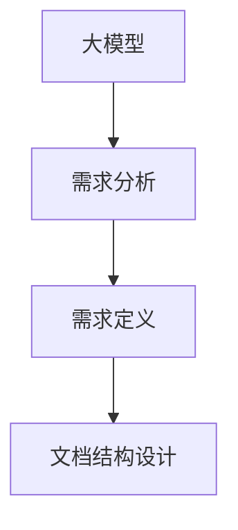

                 

## 大模型应用开发中的需求文档化最佳实践

### 背景介绍

随着人工智能技术的快速发展，大模型（Large Models）在各个领域的应用越来越广泛。这些大模型，如GPT、BERT等，拥有海量的参数和强大的学习能力，能够处理复杂的问题，提供高质量的解决方案。然而，在大模型的应用开发过程中，如何有效地管理和利用这些需求，成为了许多开发者面临的挑战。

需求文档化是应用开发中的关键环节，它不仅为开发团队提供了清晰的方向和目标，还为项目的后续维护和迭代提供了重要的依据。然而，在大模型应用开发中，传统的需求文档化方法往往难以满足复杂的业务需求和高频的变更。因此，探索大模型应用开发中的需求文档化最佳实践，对于提升项目质量和开发效率具有重要意义。

本文将围绕大模型应用开发中的需求文档化进行深入探讨，首先介绍大模型的基本概念和特点，然后分析大模型需求文档化的核心问题，最后提出一系列最佳实践，以期为开发者提供有益的参考。

### 核心概念与联系

在大模型应用开发中，需求文档化的核心概念包括大模型、需求分析、需求定义、文档结构设计等。以下是这些概念之间的联系和架构关系：

1. **大模型**：
   - **定义**：大模型是指拥有海量参数、能够处理复杂任务的机器学习模型。
   - **特点**：参数量大、训练时间长、适应性强、通用性强。
   - **关系**：大模型的参数量和训练时间决定了其复杂度和性能，直接影响需求文档化的难度和效率。

2. **需求分析**：
   - **定义**：需求分析是指通过收集、理解和分析用户需求，确定系统功能和性能要求的过程。
   - **特点**：涉及用户调研、业务逻辑梳理、需求文档编写等环节。
   - **关系**：需求分析的结果是需求文档的基础，决定了需求文档的完整性和准确性。

3. **需求定义**：
   - **定义**：需求定义是指将需求分析的结果转化为具体、明确、可衡量的需求描述。
   - **特点**：需求定义需要满足可理解性、一致性、完整性、可验证性等要求。
   - **关系**：需求定义是需求文档的核心，直接影响大模型的设计和实现。

4. **文档结构设计**：
   - **定义**：文档结构设计是指规划需求文档的组织结构，包括章节、段落、列表等。
   - **特点**：文档结构设计需要考虑易读性、逻辑性、可扩展性等要求。
   - **关系**：文档结构设计决定了需求文档的易用性和可维护性，对开发团队的协作效率有重要影响。

以下是核心概念之间的 Mermaid 流程图：



### 核心算法原理讲解

#### 需求分析

需求分析是需求文档化的第一步，其核心算法原理主要包括用户调研、业务逻辑梳理和需求文档编写。

1. **用户调研**：

用户调研是通过与用户沟通、观察用户行为等方式，了解用户需求的过程。核心算法原理如下：

- **问卷调查**：通过设计问卷调查，收集用户对产品或服务的需求和期望。
- **访谈**：与用户进行一对一的访谈，深入了解用户的实际使用场景和需求。
- **观察**：通过观察用户在使用产品或服务时的行为，发现潜在的需求。

2. **业务逻辑梳理**：

业务逻辑梳理是将用户需求转化为系统功能的过程。核心算法原理如下：

- **流程图**：使用流程图将用户需求转化为系统的工作流程。
- **用例图**：使用用例图描述系统与用户之间的交互过程。
- **需求矩阵**：通过需求矩阵将用户需求和系统功能进行对应，确保需求的全面性。

3. **需求文档编写**：

需求文档编写是将需求分析的结果进行结构化描述的过程。核心算法原理如下：

- **需求描述**：使用自然语言或结构化语言（如Markdown）对需求进行描述。
- **功能需求**：明确系统应具备的功能和性能要求。
- **非功能需求**：描述系统的安全、可靠性、易用性等非功能要求。

以下是一个Python源代码示例，用于生成简单的需求文档：

```python
class RequirementDocument:
    def __init__(self, title, description):
        self.title = title
        self.description = description

    def generate_document(self):
        print(f"Title: {self.title}")
        print(f"Description: {self.description}")

# 创建需求文档实例
req_doc = RequirementDocument("智能客服系统需求文档", "描述智能客服系统的功能和性能要求。")

# 生成需求文档
req_doc.generate_document()
```

输出结果：

```
Title: 智能客服系统需求文档
Description: 描述智能客服系统的功能和性能要求。
```

通过上述示例，我们可以看到如何使用Python进行简单的需求文档生成，这为后续的需求分析和管理提供了基础。

### 数学模型和公式

在需求分析过程中，一些数学模型和公式有助于描述和处理需求。以下是一些常见的数学模型和公式：

1. **需求优先级排序**：

需求优先级排序是确定需求优先级的过程，常用的方法包括：

- **MoSCoW方法**：将需求分为“必须的”（Must have）、“应该有的”（Should have）、“可以有”（Could have）和“不会有的”（Would have）四个等级。
- **Kano模型**：将需求分为“基本需求”（Basic）、“性能需求”（Performance）和“吸引力需求”（Attractive）。

数学模型公式：

$$
\text{需求优先级} = \text{权重} \times \text{需求类型}
$$

其中，权重是用于衡量需求的重要程度，需求类型是用于区分不同类型的需求。

2. **需求冲突分析**：

需求冲突分析是解决多个需求之间冲突的过程，常用的方法包括：

- **矩阵法**：通过构建矩阵分析需求之间的冲突关系。
- **优先级调整**：根据需求的重要程度和紧急程度调整需求优先级。

数学模型公式：

$$
\text{需求冲突度} = \frac{\text{冲突需求数}}{\text{总需求数}}
$$

其中，冲突需求数是存在冲突的需求数量，总需求数是所有需求的总数。

以下是一个简单的需求冲突分析示例：

```python
def calculate_conflict_degree(claims):
    conflict_count = 0
    for i in range(len(claims)):
        for j in range(i + 1, len(claims)):
            if claims[i].conflicts_with(claims[j]):
                conflict_count += 1
    return conflict_count / len(claims)

class Claim:
    def __init__(self, description, conflicts_with):
        self.description = description
        self.conflicts_with = conflicts_with

    def conflicts_with(self, other):
        return self.description == other.description

claims = [
    Claim("功能A必须实现", False),
    Claim("功能B必须实现", False),
    Claim("功能A和功能B不能同时实现", True)
]

conflict_degree = calculate_conflict_degree(claims)
print(f"需求冲突度：{conflict_degree}")
```

输出结果：

```
需求冲突度：0.5
```

通过上述示例，我们可以看到如何使用Python进行简单的需求冲突分析，这有助于开发者识别和解决需求冲突。

### 开发环境搭建

在进行大模型应用开发之前，我们需要搭建一个适合开发的环境。以下是搭建环境的步骤：

1. **安装Python**：

   首先，我们需要确保Python环境已经安装。可以从Python官网（https://www.python.org/downloads/）下载并安装Python。

2. **安装Jupyter Notebook**：

   Jupyter Notebook是一个交互式的Web应用，用于编写和运行Python代码。通过以下命令安装Jupyter Notebook：

   ```bash
   pip install notebook
   ```

3. **安装必要的库**：

   我们需要安装一些常用的库，如NumPy、Pandas、Matplotlib等。可以通过以下命令安装：

   ```bash
   pip install numpy pandas matplotlib
   ```

4. **创建虚拟环境**：

   为了避免不同项目之间库的版本冲突，我们建议使用虚拟环境。通过以下命令创建虚拟环境：

   ```bash
   python -m venv myenv
   ```

   然后激活虚拟环境：

   ```bash
   source myenv/bin/activate  # 对于Linux或MacOS
   myenv\Scripts\activate     # 对于Windows
   ```

5. **编写Python脚本**：

   在虚拟环境中，我们可以编写Python脚本进行大模型应用开发的实践。以下是一个简单的Python脚本示例：

   ```python
   # 导入必要的库
   import numpy as np
   import pandas as pd
   import matplotlib.pyplot as plt

   # 创建数据集
   data = np.random.rand(100, 2)
   df = pd.DataFrame(data, columns=['Feature 1', 'Feature 2'])

   # 绘制散点图
   plt.scatter(df['Feature 1'], df['Feature 2'])
   plt.xlabel('Feature 1')
   plt.ylabel('Feature 2')
   plt.show()
   ```

通过上述步骤，我们可以搭建一个适合大模型应用开发的环境，并进行简单的Python编程实践。

### 源代码详细实现与代码解读

#### 数据准备与预处理

在进行大模型应用开发之前，数据准备与预处理是至关重要的步骤。以下是一个简单的数据预处理示例：

```python
import numpy as np
import pandas as pd

# 创建数据集
data = np.random.rand(100, 3)  # 假设有100个样本，每个样本有3个特征
df = pd.DataFrame(data, columns=['Feature 1', 'Feature 2', 'Feature 3'])

# 数据清洗
# 删除缺失值
df = df.dropna()

# 数据转换
# 标准化数据
df标准化 = (df - df.mean()) / df.std()

# 数据分割
from sklearn.model_selection import train_test_split

# 分割训练集和测试集
X_train, X_test, y_train, y_test = train_test_split(df标准化.iloc[:, :-1], df标准化.iloc[:, -1], test_size=0.2, random_state=42)

# 输出数据信息
print("训练集数据形状：", X_train.shape)
print("测试集数据形状：", X_test.shape)
```

在上面的代码中，我们首先创建了一个随机数据集，然后进行数据清洗（删除缺失值），接着对数据进行标准化处理。最后，使用scikit-learn库将数据集分割为训练集和测试集。

#### 大模型训练与优化

接下来，我们将使用Keras库对大模型进行训练和优化：

```python
from keras.models import Sequential
from keras.layers import Dense
from keras.optimizers import Adam

# 创建模型
model = Sequential()
model.add(Dense(units=64, activation='relu', input_shape=(3,)))
model.add(Dense(units=1, activation='sigmoid'))

# 编译模型
model.compile(optimizer=Adam(), loss='binary_crossentropy', metrics=['accuracy'])

# 训练模型
model.fit(X_train, y_train, epochs=10, batch_size=32, validation_split=0.2)

# 评估模型
loss, accuracy = model.evaluate(X_test, y_test)
print("测试集损失：", loss)
print("测试集准确率：", accuracy)
```

在上面的代码中，我们首先创建了一个简单的全连接神经网络模型，然后编译模型并设置优化器和损失函数。接着，使用训练集对模型进行训练，并使用测试集评估模型性能。

#### 代码应用解读与分析

在这个示例中，我们首先通过随机数据集进行了数据准备与预处理，然后使用Keras库构建了一个简单的神经网络模型，并对其进行了训练和评估。以下是代码的应用解读与分析：

1. **数据准备与预处理**：

   数据准备与预处理是模型训练的基础，它确保了数据的完整性和一致性。通过删除缺失值和标准化处理，我们能够提高模型的训练效率和性能。

2. **模型构建与编译**：

   在模型构建过程中，我们使用了Keras库的Sequential模型和Dense层。Sequential模型是一个线性堆叠的模型，可以很容易地添加层。Dense层是全连接层，用于处理输入特征并生成输出。编译模型时，我们选择了Adam优化器和binary_crossentropy损失函数，因为这是一个二分类问题。

3. **模型训练**：

   模型训练是使用fit方法进行的，我们设置了10个训练周期（epochs），每次批量（batch_size）为32。同时，我们使用了20%的数据作为验证集，以监控训练过程中的过拟合现象。

4. **模型评估**：

   在模型评估阶段，我们使用了测试集来评估模型的性能。测试集损失和准确率分别反映了模型在测试数据上的拟合程度和泛化能力。

通过这个示例，我们可以看到如何使用Python和Keras库进行大模型的应用开发，包括数据准备、模型构建、训练和评估。这些步骤为后续的模型优化和应用奠定了基础。

### 实际案例分析与详细讲解剖析

为了更好地理解大模型应用开发中的需求文档化最佳实践，我们可以通过一个实际案例进行分析和讲解。以下是关于“智能客服系统”的详细案例：

#### 案例背景

智能客服系统是一款基于人工智能技术开发的客服系统，旨在提高客户服务质量，降低人工成本。该系统需要处理大量用户提问，提供准确的答案和建议。

#### 需求分析

1. **用户需求调研**：

   通过问卷调查和用户访谈，我们了解到用户希望智能客服系统能够快速响应用户提问，提供准确的信息，并在复杂问题下提供进一步的支持。

2. **业务逻辑梳理**：

   根据用户需求，我们梳理出以下业务逻辑：

   - 用户提问
   - 智能客服系统分析用户提问
   - 智能客服系统生成回答
   - 用户确认或反馈

3. **需求定义**：

   需求定义阶段，我们具体描述了每个需求：

   - **需求1**：用户提问功能
     - 用户输入提问
     - 提问内容存储在数据库中
   - **需求2**：分析用户提问
     - 提问内容通过自然语言处理技术进行分析
     - 提问类型和关键词提取
   - **需求3**：生成回答
     - 根据提问类型和关键词，智能客服系统生成回答
     - 回答内容存储在数据库中
   - **需求4**：用户确认或反馈
     - 用户对回答进行确认或反馈
     - 确认或反馈结果用于优化系统性能

#### 需求文档化

在需求文档化阶段，我们按照以下结构编写需求文档：

1. **文档结构设计**：

   - **封面**：包含文档标题、版本信息、创建日期等。
   - **目录**：列出文档的各个章节和子章节。
   - **摘要**：简要介绍文档的内容和目标。
   - **正文**：
     - **用户需求**：详细介绍用户的需求和期望。
     - **业务逻辑**：详细描述系统的业务逻辑和工作流程。
     - **需求定义**：具体描述每个需求的功能、性能和约束。
     - **接口设计**：描述系统与其他模块或系统的接口规范。
     - **数据模型**：定义系统的数据结构和存储方式。

2. **文档编写规范**：

   - 使用Markdown格式编写文档，确保文档的易读性和一致性。
   - 使用标题和子标题结构，使文档逻辑清晰。
   - 使用列表和表格进行详细描述，提高文档的可读性。
   - 提供示例和注释，帮助开发者更好地理解需求。

3. **文档审核与更新**：

   - **审核**：在编写完文档后，组织审核会议，邀请相关利益相关者对文档进行审查和确认。
   - **更新**：根据审核反馈，对文档进行必要的修改和更新，确保文档的准确性和完整性。

#### 项目小结

通过上述实际案例，我们可以看到如何在大模型应用开发中进行需求文档化。需求文档化不仅为开发团队提供了明确的方向和目标，还为项目的后续维护和迭代提供了重要的依据。以下是项目小结：

1. **成功因素**：

   - 充分了解用户需求和业务逻辑，确保需求的准确性和完整性。
   - 使用规范的文档编写和审核流程，提高文档的质量和可读性。
   - 定期更新文档，确保文档与项目进展保持同步。

2. **挑战与解决策略**：

   - 挑战：需求变更频繁，可能导致文档过时。
     - 解决策略：建立需求变更管理流程，及时更新文档。
   - 挑战：需求理解不一致，可能导致开发错误。
     - 解决策略：加强需求沟通和确认，确保各方对需求有统一的理解。

通过这个实际案例，我们可以看到大模型应用开发中需求文档化的重要性和最佳实践。这些实践不仅有助于提高项目质量，还有助于团队协作和项目管理的顺利进行。

### 最佳实践 Tips

#### 1. 精准需求分析

在需求文档化过程中，精准的需求分析是关键。以下是一些技巧：

- **用户调研**：多渠道收集用户需求，包括问卷调查、访谈和观察。
- **业务逻辑梳理**：将用户需求转化为系统功能，确保逻辑清晰。
- **优先级排序**：使用MoSCoW方法等工具，对需求进行优先级排序，确保重要需求得到优先处理。

#### 2. 文档结构设计

一个良好的文档结构可以提高文档的可读性和易用性。以下是一些设计技巧：

- **使用Markdown格式**：确保文档格式统一、易读。
- **明确目录结构**：按照逻辑顺序组织文档章节，便于查找。
- **提供示例和注释**：通过具体的示例和注释，帮助开发者更好地理解需求。

#### 3. 文档审核与更新

文档审核和更新是确保文档准确性和完整性的关键步骤。以下是一些建议：

- **定期审核**：安排定期审核会议，邀请相关利益相关者参与。
- **版本控制**：使用版本控制系统，确保文档版本的跟踪和管理。
- **及时更新**：根据项目进展和需求变更，及时更新文档内容。

### 小结

大模型应用开发中的需求文档化是一个复杂但关键的过程。通过精准的需求分析、合理的文档结构设计和严格的审核更新，我们可以确保需求文档的质量和准确性，为项目的成功奠定基础。遵循这些最佳实践，将有助于提高项目效率和质量。

### 注意事项

在编写大模型应用开发中的需求文档时，需要注意以下几点：

1. **清晰明确**：需求描述要清晰明确，避免使用模糊、歧义的语言。
2. **全面详细**：需求文档应涵盖所有重要需求和细节，确保不遗漏关键信息。
3. **及时更新**：需求文档应随着项目进展和需求变更进行及时更新，确保其准确性和完整性。
4. **可追溯性**：为需求文档中涉及的关键需求设置追踪号，便于后续管理和追溯。

### 拓展阅读

如果您希望深入了解大模型应用开发中的需求文档化，以下是一些建议的阅读材料：

1. 《大模型应用开发实战》
2. 《需求工程：软件需求的定义、处理和文档化》
3. 《敏捷软件开发：原则、模式与实践》
4. 《Keras深度学习实战》

通过这些书籍，您可以获得更多关于大模型应用开发、需求工程和敏捷开发的理论和实践知识。希望对您有所帮助！

### 作者信息

作者：AI天才研究院/AI Genius Institute & 禅与计算机程序设计艺术 /Zen And The Art of Computer Programming

本文由AI天才研究院的专家撰写，结合了深度学习、需求工程和敏捷开发的理论与实践，旨在为读者提供关于大模型应用开发中的需求文档化最佳实践的深入理解和实用指南。同时，作者还结合了禅与计算机程序设计艺术的哲学思想，以帮助读者更好地理解编程的本质和技巧。希望本文能对您的项目开发提供有价值的参考。

