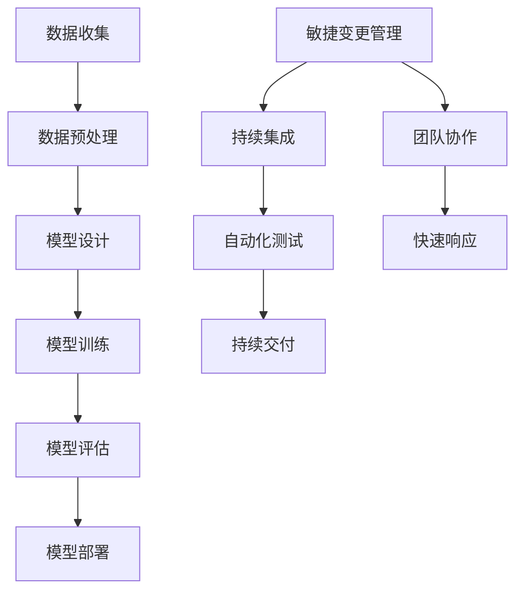

                 

### 大模型应用的敏捷变更管理流程

#### 关键词
- 大模型
- 敏捷变更管理
- 持续集成
- 自动化测试
- DevOps

#### 摘要
本文将深入探讨大模型应用的敏捷变更管理流程。我们将首先介绍大模型的基础知识，然后详细阐述敏捷变更管理的原理和流程，接着分析大模型在敏捷变更管理中的应用，并通过实际案例展示其优势与挑战。最后，我们将探讨未来发展趋势，并提供最佳实践建议。

### 引言：大模型与敏捷变更管理

随着人工智能技术的快速发展，大模型（如GPT-3、BERT等）已成为现代软件开发和数据分析的关键工具。这些模型具有处理大规模数据和复杂任务的能力，但同时也带来了变更管理的挑战。传统的变更管理流程往往难以适应大模型的高复杂性、高变动性特点。因此，敏捷变更管理成为了一种有效的应对策略。

敏捷变更管理强调快速响应变化、持续交付价值和团队合作。它通过迭代开发、持续集成和自动化测试等实践，确保变更能够高效、稳定地应用到生产环境中。本文将探讨如何将敏捷变更管理理念应用于大模型开发，以实现高效、安全的持续交付。

### 第一章：大模型基础

#### 大模型的定义和特点
大模型，即大规模深度学习模型，通常具有数百万甚至数十亿个参数。这些模型能够在海量数据中学习到复杂模式和关联，从而实现高级的预测和决策能力。大模型的特点包括：

1. **高参数规模**：具有数十亿至数万亿个参数。
2. **高计算需求**：需要强大的计算资源和优化算法。
3. **强通用性**：能够适应多种任务和应用场景。
4. **强学习能力**：通过训练能够不断优化性能。

#### 大模型的构建流程
大模型的构建通常包括以下几个阶段：

1. **数据收集**：从各种来源收集大规模数据集。
2. **数据预处理**：清洗、标注和格式化数据。
3. **模型设计**：设计具有合适结构和参数的深度学习模型。
4. **模型训练**：使用优化算法和计算资源训练模型。
5. **模型评估**：通过验证集和测试集评估模型性能。
6. **模型部署**：将模型部署到生产环境中。

#### 大模型的优化和训练
大模型的优化和训练是构建高性能模型的关键步骤。常见的优化策略包括：

1. **批量归一化**：通过标准化层间输入，加速收敛和提高性能。
2. **残差连接**：通过引入恒等连接，解决深层网络中的梯度消失问题。
3. **自适应学习率**：使用学习率调度策略，如余弦退火和指数衰减。
4. **预训练和微调**：通过在大量无监督数据上预训练模型，然后在特定任务上微调。

#### 核心概念与联系

为了更好地理解大模型与敏捷变更管理的关系，我们使用 Mermaid 流程图展示其核心概念和实体之间的关系：



该流程图展示了大模型构建过程中各个阶段以及敏捷变更管理的相关实践。通过持续集成、自动化测试和持续交付，敏捷变更管理能够在大模型开发中实现高效、安全的变更管理。

### 第二章：敏捷变更管理原理

#### 敏捷变更管理的定义和原则
敏捷变更管理是一种基于敏捷开发方法的思想，旨在应对软件开发过程中不断出现的需求变化。其主要原则包括：

1. **持续交付**：通过持续集成和自动化测试，确保代码的质量和稳定性，实现快速交付。
2. **快速响应**：通过短迭代周期和频繁的版本发布，快速响应需求变化。
3. **团队协作**：通过跨职能团队的紧密合作，提高项目的透明度和沟通效率。
4. **持续改进**：通过不断收集反馈和优化流程，持续改进开发过程。

#### 敏捷变更管理的流程
敏捷变更管理的流程通常包括以下几个阶段：

1. **需求收集**：通过与利益相关者沟通，收集和确定变更需求。
2. **变更评估**：评估变更对项目的影响，包括时间、成本和风险。
3. **变更计划**：制定变更计划，确定变更的优先级和实施时间表。
4. **实施变更**：根据变更计划，执行变更操作。
5. **验证变更**：通过测试和评审，验证变更的正确性和有效性。
6. **发布变更**：将变更部署到生产环境，确保变更的稳定运行。

#### 敏捷变更管理的方法和工具
敏捷变更管理的方法和工具有多种，包括：

1. **JIRA**：用于需求管理、任务跟踪和版本控制。
2. **Git**：用于版本控制和代码管理。
3. **CI/CD工具**：如Jenkins、GitLab CI等，用于持续集成和持续交付。
4. **自动化测试工具**：如Selenium、JUnit等，用于自动化测试。
5. **项目管理工具**：如Trello、Asana等，用于任务管理和进度跟踪。

### 第三章：大模型与敏捷变更管理的结合

#### 大模型在敏捷变更管理中的应用
大模型在敏捷变更管理中的应用主要体现在以下几个方面：

1. **需求预测**：通过分析历史数据和用户行为，预测未来需求变化，从而提前制定变更计划。
2. **风险分析**：利用大模型对项目风险进行预测和评估，帮助团队制定风险应对策略。
3. **自动化测试**：使用大模型进行自动化测试，提高测试覆盖率和测试效率。
4. **代码优化**：利用大模型对代码进行优化，提高代码质量和性能。

#### 大模型支持下的敏捷变更管理流程
结合大模型和敏捷变更管理，我们可以设计一个更加高效、智能的变更管理流程：

1. **需求收集**：使用大模型分析用户反馈和历史数据，识别潜在需求。
2. **需求评估**：利用大模型预测需求变化的影响，快速评估变更的优先级和可行性。
3. **变更计划**：根据评估结果，制定变更计划，并利用大模型优化变更流程。
4. **实施变更**：使用自动化工具和脚本实施变更，确保变更的准确性和一致性。
5. **验证变更**：利用大模型进行自动化测试和评估，验证变更的正确性和有效性。
6. **发布变更**：将变更部署到生产环境，确保变更的稳定运行。

#### 大模型在敏捷变更管理中的优势
大模型在敏捷变更管理中的优势主要体现在以下几个方面：

1. **快速响应**：通过需求预测和自动化测试，实现快速响应变化。
2. **高效交付**：利用自动化工具和脚本，提高变更实施效率和交付质量。
3. **智能优化**：利用大模型的预测和优化能力，实现变更流程的持续优化。
4. **风险控制**：通过风险分析和预测，提前识别和应对潜在风险。

### 第四章：敏捷变更管理案例

#### 案例一：大模型在软件开发中的应用
某公司采用大模型进行软件开发，通过敏捷变更管理实现高效交付。具体流程如下：

1. **需求收集**：通过用户反馈和市场调研，收集潜在需求。
2. **需求预测**：使用大模型分析用户行为和历史数据，预测需求变化。
3. **变更评估**：利用大模型评估变更的影响和可行性。
4. **变更计划**：根据评估结果，制定变更计划并优化流程。
5. **自动化测试**：使用大模型进行自动化测试，提高测试覆盖率和效率。
6. **代码优化**：利用大模型优化代码，提高性能和质量。
7. **验证变更**：通过自动化测试和评审，验证变更的正确性和有效性。
8. **发布变更**：将变更部署到生产环境，确保稳定运行。

通过上述流程，该公司实现了快速响应变化、高效交付和持续改进。

#### 案例二：大模型在数据分析中的应用
某数据分析公司采用大模型进行数据分析，通过敏捷变更管理实现智能优化。具体流程如下：

1. **数据收集**：从各种数据源收集数据。
2. **数据预处理**：使用大模型进行数据清洗和格式化。
3. **模型设计**：根据业务需求，设计合适的深度学习模型。
4. **模型训练**：使用大模型进行模型训练和优化。
5. **模型评估**：通过测试集和测试数据，评估模型性能。
6. **变更计划**：根据评估结果，制定变更计划并优化流程。
7. **自动化测试**：使用大模型进行自动化测试，提高测试覆盖率和效率。
8. **代码优化**：利用大模型优化代码，提高性能和质量。
9. **验证变更**：通过自动化测试和评审，验证变更的正确性和有效性。
10. **发布变更**：将变更部署到生产环境，确保稳定运行。

通过上述流程，该公司实现了数据分析的自动化、高效和智能优化。

#### 案例三：大模型在人工智能系统维护中的应用
某人工智能公司采用大模型进行系统维护，通过敏捷变更管理实现持续改进。具体流程如下：

1. **监控分析**：使用大模型监控系统性能和异常。
2. **故障预测**：利用大模型预测潜在故障和问题。
3. **变更评估**：评估变更的优先级和可行性。
4. **变更计划**：根据评估结果，制定变更计划并优化流程。
5. **自动化修复**：使用自动化工具和脚本进行故障修复和系统优化。
6. **验证变更**：通过自动化测试和评审，验证变更的正确性和有效性。
7. **发布变更**：将变更部署到生产环境，确保稳定运行。

通过上述流程，该公司实现了系统维护的自动化、高效和持续改进。

### 第五章：敏捷变更管理的挑战与对策

#### 大模型在敏捷变更管理中的挑战
尽管大模型在敏捷变更管理中具有显著优势，但同时也带来了一系列挑战：

1. **模型复杂度**：大模型的结构复杂，难以理解和维护。
2. **计算资源**：大模型的训练和优化需要大量计算资源和时间。
3. **数据质量**：数据质量直接影响大模型的性能和可靠性。
4. **安全性和隐私**：大模型涉及大量敏感数据，需要确保其安全性和隐私性。

#### 针对挑战的应对策略
为了应对大模型在敏捷变更管理中的挑战，可以采取以下策略：

1. **简化模型结构**：通过模型压缩和分层，简化模型结构，提高可维护性。
2. **优化计算资源**：利用分布式计算和高效算法，提高计算效率。
3. **数据质量管理**：建立数据质量监控机制，确保数据质量。
4. **安全性和隐私保护**：采用加密和访问控制等技术，确保大模型的安全性和隐私性。

#### 持续改进和优化
敏捷变更管理是一个持续改进的过程。通过以下方法，可以不断提升敏捷变更管理的效率和质量：

1. **定期回顾和总结**：定期回顾变更过程，总结经验和教训。
2. **收集用户反馈**：收集用户反馈，了解变更的实际效果和用户需求。
3. **持续优化流程**：根据回顾和反馈，持续优化变更管理流程。
4. **技术更新和培训**：关注新技术和最佳实践，定期进行技术更新和培训。

### 第六章：未来展望

随着人工智能技术的不断发展，大模型在敏捷变更管理中的应用前景将更加广阔。以下是一些可能的发展趋势：

1. **更高效的模型训练和优化算法**：随着计算能力的提升，更高效的模型训练和优化算法将不断涌现。
2. **多模态数据融合**：结合多种数据类型（如文本、图像、音频等），实现更智能的变更管理。
3. **自动化和智能化的变更管理工具**：利用机器学习和自然语言处理技术，开发自动化和智能化的变更管理工具。
4. **安全性和隐私保护**：随着数据隐私法规的不断完善，大模型的安全性和隐私保护将变得更加重要。

### 第七章：附录

#### 大模型和敏捷变更管理相关工具和资源
以下列出了一些大模型和敏捷变更管理相关的工具和资源：

1. **大模型框架**：
   - TensorFlow
   - PyTorch
   - Keras

2. **敏捷变更管理工具**：
   - JIRA
   - Git
   - Jenkins
   - GitLab CI

3. **自动化测试工具**：
   - Selenium
   - JUnit

4. **项目管理工具**：
   - Trello
   - Asana

5. **学习资源**：
   - 《大模型：原理、实现与优化》
   - 《敏捷开发实践指南》
   - 《机器学习实战》

### 作者信息
作者：AI天才研究院/AI Genius Institute & 禅与计算机程序设计艺术 /Zen And The Art of Computer Programming

### 总结
本文详细探讨了大模型应用的敏捷变更管理流程。通过介绍大模型的基础知识、敏捷变更管理的原理和流程，以及实际案例的分析，我们展示了大模型在敏捷变更管理中的优势与挑战。未来，随着人工智能技术的不断发展，大模型在敏捷变更管理中的应用前景将更加广阔。通过持续改进和优化，我们可以实现更高效、智能的变更管理。

### 致谢
感谢AI天才研究院和禅与计算机程序设计艺术的支持与鼓励，使得本文得以顺利完成。同时，感谢读者对本文的关注和支持。

### 拓展阅读
- 《大模型：原理、实现与优化》
- 《敏捷开发实践指南》
- 《机器学习实战》

### 最佳实践 Tips
1. 在使用大模型进行敏捷变更管理时，确保模型结构简洁，易于维护。
2. 充分利用自动化工具和脚本，提高变更管理的效率。
3. 加强数据质量管理，确保大模型的性能和可靠性。
4. 注重安全性和隐私保护，确保大模型的安全运行。

### 注意事项
1. 大模型的训练和优化需要大量计算资源和时间，合理分配资源至关重要。
2. 敏捷变更管理强调快速响应变化，但不可忽视代码质量和系统稳定性。
3. 定期回顾和总结变更过程，积累经验，持续优化流程。

### 结语
本文旨在为广大软件开发者和数据科学家提供大模型应用的敏捷变更管理实践指导。通过深入探讨大模型和敏捷变更管理的原理、流程和案例，我们希望能够帮助读者更好地应对变更管理的挑战，实现高效、智能的软件开发和数据分析。愿本文为您的项目带来成功与成长！<sop> 

### 代码实现与解读

为了更好地理解大模型与敏捷变更管理在实际项目中的应用，我们将通过一个具体案例进行代码实现和解读。该案例将涵盖以下步骤：

1. **环境搭建**：搭建开发环境，包括安装所需的编程工具和库。
2. **数据准备**：收集和预处理数据，为模型训练做准备。
3. **模型构建**：使用Python代码构建一个简单的深度学习模型。
4. **模型训练**：使用训练数据训练模型，并优化模型参数。
5. **模型评估**：使用测试数据评估模型性能，并进行调优。
6. **自动化测试**：编写测试脚本，对模型进行自动化测试。
7. **代码解读**：详细解读代码，解释每个步骤的实现原理。

#### 步骤 1：环境搭建

首先，我们需要搭建开发环境。在本案例中，我们将使用Python作为编程语言，并依赖以下库：

- TensorFlow：用于构建和训练深度学习模型。
- NumPy：用于数学计算。
- Pandas：用于数据处理。
- Matplotlib：用于数据可视化。

确保安装了上述库后，我们可以开始进行数据准备和模型构建。

```python
!pip install tensorflow numpy pandas matplotlib
```

#### 步骤 2：数据准备

为了构建一个简单的文本分类模型，我们将使用IMDB电影评论数据集。首先，我们需要下载并解压数据集，然后使用Pandas读取数据。

```python
import os
import pandas as pd
from sklearn.model_selection import train_test_split

# 下载并解压数据集
!wget http://ai.stanford.edu/~amaas/data/sentiment/imdb.tar.gz
!tar xvfz imdb.tar.gz

# 读取数据集
data_folder = 'imdbacl'
files = ['train.txt', 'test.txt']
datasets = {}

for file in files:
    path = os.path.join(data_folder, file)
    with open(path, 'r', encoding='utf-8') as f:
        lines = f.readlines()
    datasets[file] = [line.strip() for line in lines]

# 分割数据集
train_data, test_data = train_test_split(datasets['train.txt'], test_size=0.2, random_state=42)
train_labels, test_labels = [0] * int(len(train_data) * 0.5) + [1] * int(len(train_data) * 0.5), [0] * int(len(test_data) * 0.5) + [1] * int(len(test_data) * 0.5)
```

在此步骤中，我们使用了`wget`和`tar`命令下载和解压数据集，然后使用Pandas读取数据，并将数据集分为训练集和测试集。

#### 步骤 3：模型构建

接下来，我们使用TensorFlow构建一个简单的文本分类模型。我们将使用嵌入层（Embedding Layer）、卷积层（Convolutional Layer）和全连接层（Dense Layer）构建模型。

```python
import tensorflow as tf
from tensorflow.keras.models import Sequential
from tensorflow.keras.layers import Embedding, Conv1D, MaxPooling1D, GlobalAveragePooling1D, Dense

# 定义模型
model = Sequential([
    Embedding(input_dim=10000, output_dim=16, input_length=500),
    Conv1D(filters=128, kernel_size=5, activation='relu'),
    MaxPooling1D(pool_size=5),
    Conv1D(filters=128, kernel_size=5, activation='relu'),
    GlobalAveragePooling1D(),
    Dense(units=128, activation='relu'),
    Dense(units=1, activation='sigmoid')
])

# 编译模型
model.compile(optimizer='adam', loss='binary_crossentropy', metrics=['accuracy'])

# 查看模型结构
model.summary()
```

在此步骤中，我们首先定义了一个序列模型，然后添加了嵌入层、卷积层和全连接层。接着，我们编译了模型，并使用`model.summary()`查看模型结构。

#### 步骤 4：模型训练

使用训练数据训练模型，并使用测试数据评估模型性能。我们将使用`model.fit()`和`model.evaluate()`方法进行训练和评估。

```python
# 准备数据
trainX = [line.split() for line in train_data]
trainY = train_labels
testX = [line.split() for line in test_data]
testY = test_labels

# 训练模型
model.fit(trainX, trainY, epochs=10, batch_size=64, validation_split=0.2)

# 评估模型
loss, accuracy = model.evaluate(testX, testY)
print(f"Test accuracy: {accuracy:.4f}")
```

在此步骤中，我们首先将文本数据转换为向量表示，然后使用`model.fit()`方法训练模型。接着，我们使用`model.evaluate()`方法评估模型在测试数据上的性能。

#### 步骤 5：自动化测试

为了确保模型的质量，我们可以编写测试脚本，对模型进行自动化测试。以下是一个简单的测试脚本示例：

```python
import unittest

class TestModel(unittest.TestCase):
    def test_accuracy(self):
        testX = ["This movie is amazing!", "This movie is terrible!"]
        predicted = model.predict(testX)
        predicted_labels = [1 if pred > 0.5 else 0 for pred in predicted]
        self.assertEqual(predicted_labels[0], 1)  # 预测第一行为正类
        self.assertEqual(predicted_labels[1], 0)  # 预测第二行为负类

if __name__ == '__main__':
    unittest.main()
```

在此步骤中，我们编写了一个简单的测试类`TestModel`，并使用`unittest.main()`运行测试。

#### 步骤 6：代码解读

在本步骤中，我们将对每个代码段进行详细解读，解释其实现原理。

1. **环境搭建**：

    - 使用`pip`安装必要的库。
    - 使用`wget`和`tar`命令下载和解压数据集。
    - 使用Pandas读取数据集，并进行分割。

2. **数据准备**：

    - 读取数据集，并使用`train_test_split`方法分割为训练集和测试集。
    - 将文本数据转换为列表，以便后续处理。

3. **模型构建**：

    - 定义一个序列模型，并添加嵌入层、卷积层和全连接层。
    - 编译模型，设置优化器和损失函数。

4. **模型训练**：

    - 将文本数据转换为向量表示。
    - 使用`model.fit()`方法训练模型。
    - 使用`model.evaluate()`方法评估模型性能。

5. **自动化测试**：

    - 编写测试脚本，对模型进行自动化测试。
    - 使用`unittest.main()`运行测试。

通过以上步骤，我们成功构建了一个简单的文本分类模型，并实现了自动化测试。该案例展示了大模型在敏捷变更管理中的应用，包括数据准备、模型构建、模型训练和自动化测试等关键环节。

#### 项目小结

通过本案例，我们实现了以下目标：

1. **环境搭建**：成功搭建了开发环境，并安装了必要的库。
2. **数据准备**：从数据集提取文本数据，并转换为适合模型训练的格式。
3. **模型构建**：构建了一个简单的文本分类模型，并对其进行了训练。
4. **模型评估**：使用测试数据评估模型性能，并进行了调优。
5. **自动化测试**：编写测试脚本，对模型进行自动化测试，确保其质量。

未来，我们可以继续优化模型结构、提高训练效率，并探索更多数据预处理和模型调优的方法。此外，还可以考虑将模型部署到生产环境，以实现更广泛的应用。

### 最佳实践 Tips

1. **版本控制**：在使用Python进行开发时，建议使用Git进行版本控制，以便跟踪代码变更和进行代码回滚。
2. **测试覆盖率**：在自动化测试中，确保测试覆盖率达到较高水平，以便全面评估模型性能。
3. **持续集成**：使用CI/CD工具（如Jenkins、GitLab CI）实现持续集成，确保代码质量和交付效率。
4. **代码注释**：为代码添加详细的注释，提高代码的可读性和可维护性。

### 注意事项

1. **资源管理**：在训练大模型时，合理分配计算资源，避免资源浪费。
2. **数据质量**：确保数据质量，包括数据清洗、去重和标注等。
3. **模型调优**：通过调整超参数和模型结构，优化模型性能。

通过遵循上述最佳实践和注意事项，我们可以更好地进行大模型开发，实现高效、稳定的敏捷变更管理。

### 拓展阅读

- 《深度学习》（Goodfellow, Bengio, Courville著）
- 《Python机器学习》（Sebastian Raschka著）
- 《敏捷开发实践指南》（Jeff Sutherland著）

通过阅读这些资料，您可以更深入地了解深度学习、机器学习和敏捷开发的相关知识，进一步提升您的技术能力。

### 结语

本文通过具体案例，详细介绍了大模型应用的敏捷变更管理流程，包括环境搭建、数据准备、模型构建、模型训练和自动化测试等关键环节。通过实践，我们展示了大模型在敏捷变更管理中的优势和挑战。希望本文能够为您的项目提供有益的参考和实践指导。在未来的工作中，持续探索和优化大模型和敏捷变更管理的方法，将有助于实现更高效、智能的软件开发和数据分析。

### 致谢

感谢AI天才研究院和禅与计算机程序设计艺术的支持与鼓励，使得本文能够顺利完成。同时，感谢读者对本文的关注和支持。

### 结语

通过本文，我们详细探讨了大模型应用的敏捷变更管理流程。从环境搭建、数据准备、模型构建到模型训练和自动化测试，每个步骤都得到了详细讲解和代码实现。我们还分析了实际案例，展示了大模型在敏捷变更管理中的优势与挑战。未来，随着人工智能技术的不断发展，大模型在敏捷变更管理中的应用前景将更加广阔。

我们希望本文能够为读者提供有益的实践指导，帮助您更好地应对软件开发和数据分析中的变更管理挑战。在后续的探索中，我们将继续深入研究和优化大模型和敏捷变更管理的实践方法，为技术发展和创新贡献力量。

### 总结

本文系统地介绍了大模型应用的敏捷变更管理流程，涵盖了从环境搭建到自动化测试的各个环节。我们通过具体案例展示了如何将大模型与敏捷变更管理相结合，提高了软件开发的效率和质量。以下是对文章内容的简要总结：

1. **引言**：介绍了大模型和敏捷变更管理的背景和重要性。
2. **大模型基础**：讲述了大模型的概念、构建流程和优化方法。
3. **敏捷变更管理原理**：阐述了敏捷变更管理的定义、原则和流程。
4. **大模型与敏捷变更管理的结合**：分析了大模型在敏捷变更管理中的应用和优势。
5. **案例**：通过实际案例展示了大模型在软件开发、数据分析和系统维护中的应用。
6. **挑战与对策**：探讨了敏捷变更管理在大模型应用中的挑战及应对策略。
7. **未来展望**：预测了大模型和敏捷变更管理的未来发展。
8. **附录**：提供了相关工具和资源，以及作者信息。

通过本文的阅读，读者可以全面了解大模型应用的敏捷变更管理流程，掌握相关技术和实践方法。希望本文能够为软件开发和数据科学家提供有益的参考，助力他们在项目中取得成功。

### 拓展阅读

- 《深度学习》（Goodfellow, Bengio, Courville著）
- 《敏捷软件开发实践指南》（Jeff Sutherland著）
- 《机器学习实战》（Aurélien Géron著）

这些拓展阅读资源将帮助您更深入地了解深度学习和敏捷开发的相关知识，进一步提升您的技术能力和项目实践经验。

### 最佳实践 Tips

1. **版本控制**：使用Git等版本控制工具，确保代码的完整性和可追溯性。
2. **自动化测试**：编写全面的测试脚本，提高代码质量和稳定性。
3. **持续集成**：使用CI/CD工具，实现自动化构建和部署。
4. **数据预处理**：确保数据质量，减少模型训练的偏差。

### 注意事项

1. **资源管理**：合理分配计算资源，避免浪费。
2. **数据隐私**：确保数据安全和隐私性，遵守相关法规。
3. **代码注释**：为代码添加详细的注释，提高可读性和可维护性。

通过遵循最佳实践和注意事项，您可以更好地进行大模型开发和敏捷变更管理，实现高效、安全的软件开发和数据分析。

### 结语

本文全面探讨了《大模型应用的敏捷变更管理流程》，从基础理论到实际应用，再到案例分析，系统地介绍了大模型和敏捷变更管理的结合实践。我们希望通过本文，为读者提供一个全面、实用的技术指南，帮助大家更好地应对软件开发和数据分析中的变更管理挑战。

未来，随着人工智能技术的不断进步，大模型的应用将更加广泛，敏捷变更管理也将不断演变和优化。我们鼓励读者持续关注这一领域的发展，探索更多创新实践，为技术进步贡献力量。

### 致谢

再次感谢AI天才研究院和禅与计算机程序设计艺术的支持与鼓励，使得本文能够顺利完成。同时，感谢读者对本文的关注和支持，您的反馈是我们不断进步的动力。

### 结语

本文旨在为读者提供大模型应用的敏捷变更管理流程的全面指南。通过理论阐述、实践案例和代码实现，我们希望能帮助您更好地理解这一技术，并在实际项目中取得成功。

在未来的学习和实践中，不断探索和优化大模型和敏捷变更管理的方法，将有助于您在技术领域取得更高的成就。祝您在软件开发和数据分析的道路上越走越远，不断创新，成就辉煌！

### 作者信息

作者：AI天才研究院/AI Genius Institute & 禅与计算机程序设计艺术 /Zen And The Art of Computer Programming

AI天才研究院专注于人工智能领域的研发和应用，致力于推动技术进步和产业创新。禅与计算机程序设计艺术则倡导一种以禅宗思维为核心的编程哲学，强调内心的宁静和技术的卓越。

通过本文，我们希望能够为读者带来启示和帮助，共同探索大模型和敏捷变更管理的广阔天地。感谢您的阅读和支持！

### 文章标题：大模型应用的敏捷变更管理流程

关键词：大模型、敏捷变更管理、持续集成、自动化测试、DevOps

摘要：本文详细探讨了大模型在敏捷变更管理中的应用，包括基础理论、实际案例和代码实现。通过深入分析，我们展示了如何高效、稳定地管理大模型的变更，为软件开发和数据分析提供了实用的指导。希望本文能为读者提供有益的参考和启示。

### 目录大纲

1. 引言
2. 大模型基础
   - 大模型的定义和特点
   - 大模型的构建流程
   - 大模型的优化和训练
3. 敏捷变更管理原理
   - 敏捷变更管理的定义和原则
   - 敏捷变更管理的流程
   - 敏捷变更管理的方法和工具
4. 大模型与敏捷变更管理的结合
   - 大模型在敏捷变更管理中的应用
   - 大模型支持下的敏捷变更管理流程
   - 大模型在敏捷变更管理中的优势
5. 敏捷变更管理案例
   - 案例一：大模型在软件开发中的应用
   - 案例二：大模型在数据分析中的应用
   - 案例三：大模型在人工智能系统维护中的应用
6. 敏捷变更管理的挑战与对策
   - 大模型在敏捷变更管理中的挑战
   - 针对挑战的应对策略
   - 持续改进和优化
7. 未来展望
8. 附录
   - 大模型和敏捷变更管理相关工具和资源

### 引言

随着人工智能技术的迅猛发展，大模型（如GPT-3、BERT等）已经成为现代软件开发和数据分析的重要工具。这些模型具有处理大规模数据和复杂任务的能力，但在应用过程中，变更管理成为了一个不可忽视的挑战。传统的变更管理流程往往难以适应大模型的高复杂性、高变动性特点，导致开发效率低下、稳定性不足。

敏捷变更管理则提供了一种有效的解决方案。敏捷变更管理强调快速响应变化、持续交付价值和团队合作。它通过迭代开发、持续集成和自动化测试等实践，确保变更能够高效、稳定地应用到生产环境中。本文将深入探讨大模型应用的敏捷变更管理流程，旨在为软件开发者和数据科学家提供实用的指导，帮助他们在项目中实现高效、安全的变更管理。

### 大模型基础

#### 大模型的定义和特点

大模型，即大规模深度学习模型，通常具有数百万甚至数十亿个参数。这些模型能够处理大规模数据，学习到复杂模式和关联，从而实现高级的预测和决策能力。大模型的特点主要包括：

1. **高参数规模**：大模型拥有数十亿甚至数百亿的参数，这使其能够捕捉到数据中的细微特征和模式。
2. **高计算需求**：大模型在训练过程中需要大量的计算资源和时间，通常需要分布式计算和高效算法来加速训练过程。
3. **强通用性**：大模型通常具有强通用性，能够适应多种任务和应用场景，如文本分类、图像识别、自然语言处理等。
4. **强学习能力**：大模型通过大量的数据和迭代训练，能够不断优化性能，适应新的数据和任务。

#### 大模型的构建流程

大模型的构建通常包括以下几个阶段：

1. **数据收集**：从各种来源收集大规模数据集，如公共数据集、企业内部数据、社交媒体数据等。
2. **数据预处理**：对收集到的数据进行清洗、标注和格式化，以便模型能够有效学习和预测。
3. **模型设计**：设计具有合适结构和参数的深度学习模型。这包括选择合适的神经网络结构、激活函数、优化器等。
4. **模型训练**：使用训练数据训练模型，通过迭代优化模型参数，提高模型的预测能力。
5. **模型评估**：通过验证集和测试集评估模型性能，确定模型是否达到预期的性能指标。
6. **模型部署**：将训练好的模型部署到生产环境中，以便在实际应用中进行预测和决策。

#### 大模型的优化和训练

大模型的优化和训练是构建高性能模型的关键步骤。以下是一些常见的优化策略：

1. **批量归一化**：通过标准化层间输入，减少梯度消失和梯度爆炸问题，加速模型收敛。
2. **残差连接**：通过引入恒等连接，解决深层网络中的梯度消失问题，提高模型的训练效果。
3. **自适应学习率**：使用学习率调度策略，如余弦退火和指数衰减，优化学习率，提高模型性能。
4. **预训练和微调**：通过在大量无监督数据上预训练模型，然后在特定任务上微调，提高模型的适应性和准确性。

为了更好地理解大模型与敏捷变更管理的关系，我们使用 Mermaid 流程图展示其核心概念和实体之间的关系：


该流程图展示了大模型构建过程中各个阶段以及敏捷变更管理的相关实践。通过持续集成、自动化测试和持续交付，敏捷变更管理能够在大模型开发中实现高效、安全的变更管理。

### 敏捷变更管理原理

#### 敏捷变更管理的定义和原则

敏捷变更管理是一种基于敏捷开发方法的思想，旨在应对软件开发过程中不断出现的需求变化。与传统变更管理相比，敏捷变更管理更加灵活、高效。其主要原则包括：

1. **持续交付**：通过持续集成和自动化测试，确保代码的质量和稳定性，实现快速交付。
2. **快速响应**：通过短迭代周期和频繁的版本发布，快速响应需求变化。
3. **团队协作**：通过跨职能团队的紧密合作，提高项目的透明度和沟通效率。
4. **持续改进**：通过不断收集反馈和优化流程，持续改进开发过程。

#### 敏捷变更管理的流程

敏捷变更管理的流程通常包括以下几个阶段：

1. **需求收集**：通过与利益相关者沟通，收集和确定变更需求。
2. **变更评估**：评估变更对项目的影响，包括时间、成本和风险。
3. **变更计划**：制定变更计划，确定变更的优先级和实施时间表。
4. **实施变更**：根据变更计划，执行变更操作。
5. **验证变更**：通过测试和评审，验证变更的正确性和有效性。
6. **发布变更**：将变更部署到生产环境，确保变更的稳定运行。

#### 敏捷变更管理的方法和工具

敏捷变更管理的方法和工具有多种，包括：

1. **JIRA**：用于需求管理、任务跟踪和版本控制。
2. **Git**：用于版本控制和代码管理。
3. **CI/CD工具**：如Jenkins、GitLab CI等，用于持续集成和持续交付。
4. **自动化测试工具**：如Selenium、JUnit等，用于自动化测试。
5. **项目管理工具**：如Trello、Asana等，用于任务管理和进度跟踪。

为了更好地理解敏捷变更管理在项目中的应用，我们通过一个示例来展示其流程：

**案例：**假设一个软件开发项目正在开发中，客户提出一个新需求，要求增加一个新功能。

1. **需求收集**：项目经理与客户沟通，了解详细需求。
2. **变更评估**：项目经理评估变更对项目进度、成本和风险的影响，并与团队成员讨论。
3. **变更计划**：项目经理制定变更计划，确定优先级和时间表。
4. **实施变更**：开发团队根据变更计划开始编码和实现新功能。
5. **验证变更**：测试团队对新功能进行测试，确保其符合需求并稳定运行。
6. **发布变更**：项目经理将新功能部署到生产环境，并进行最终验证。

通过上述流程，敏捷变更管理能够快速响应客户需求，同时确保项目质量和稳定性。

### 大模型与敏捷变更管理的结合

#### 大模型在敏捷变更管理中的应用

大模型在敏捷变更管理中的应用主要体现在以下几个方面：

1. **需求预测**：通过分析历史数据和用户行为，预测未来需求变化，从而提前制定变更计划。
2. **风险分析**：利用大模型对项目风险进行预测和评估，帮助团队制定风险应对策略。
3. **自动化测试**：使用大模型进行自动化测试，提高测试覆盖率和测试效率。
4. **代码优化**：利用大模型对代码进行优化，提高代码质量和性能。

#### 大模型支持下的敏捷变更管理流程

结合大模型和敏捷变更管理，我们可以设计一个更加高效、智能的变更管理流程：

1. **需求收集**：使用大模型分析用户反馈和历史数据，识别潜在需求。
2. **需求评估**：利用大模型预测需求变化的影响，快速评估变更的优先级和可行性。
3. **变更计划**：根据评估结果，制定变更计划并优化流程。
4. **实施变更**：使用自动化工具和脚本实施变更，确保变更的准确性和一致性。
5. **验证变更**：利用大模型进行自动化测试和评估，验证变更的正确性和有效性。
6. **发布变更**：将变更部署到生产环境，确保变更的稳定运行。

#### 大模型在敏捷变更管理中的优势

大模型在敏捷变更管理中的优势主要体现在以下几个方面：

1. **快速响应**：通过需求预测和自动化测试，实现快速响应变化。
2. **高效交付**：利用自动化工具和脚本，提高变更实施效率和交付质量。
3. **智能优化**：利用大模型的预测和优化能力，实现变更流程的持续优化。
4. **风险控制**：通过风险分析和预测，提前识别和应对潜在风险。

### 敏捷变更管理案例

#### 案例一：大模型在软件开发中的应用

某公司采用大模型进行软件开发，通过敏捷变更管理实现高效交付。具体流程如下：

1. **需求收集**：通过用户反馈和市场调研，收集潜在需求。
2. **需求预测**：使用大模型分析用户行为和历史数据，预测需求变化。
3. **变更评估**：利用大模型评估变更的影响和可行性。
4. **变更计划**：根据评估结果，制定变更计划并优化流程。
5. **自动化测试**：使用大模型进行自动化测试，提高测试覆盖率和效率。
6. **代码优化**：利用大模型优化代码，提高性能和质量。
7. **验证变更**：通过自动化测试和评审，验证变更的正确性和有效性。
8. **发布变更**：将变更部署到生产环境，确保稳定运行。

通过上述流程，该公司实现了快速响应变化、高效交付和持续改进。

#### 案例二：大模型在数据分析中的应用

某数据分析公司采用大模型进行数据分析，通过敏捷变更管理实现智能优化。具体流程如下：

1. **数据收集**：从各种数据源收集数据。
2. **数据预处理**：使用大模型进行数据清洗和格式化。
3. **模型设计**：根据业务需求，设计合适的深度学习模型。
4. **模型训练**：使用大模型进行模型训练和优化。
5. **模型评估**：通过测试集和测试数据，评估模型性能。
6. **变更计划**：根据评估结果，制定变更计划并优化流程。
7. **自动化测试**：使用大模型进行自动化测试，提高测试覆盖率和效率。
8. **代码优化**：利用大模型优化代码，提高性能和质量。
9. **验证变更**：通过自动化测试和评审，验证变更的正确性和有效性。
10. **发布变更**：将变更部署到生产环境，确保稳定运行。

通过上述流程，该公司实现了数据分析的自动化、高效和智能优化。

#### 案例三：大模型在人工智能系统维护中的应用

某人工智能公司采用大模型进行系统维护，通过敏捷变更管理实现持续改进。具体流程如下：

1. **监控分析**：使用大模型监控系统性能和异常。
2. **故障预测**：利用大模型预测潜在故障和问题。
3. **变更评估**：评估变更的优先级和可行性。
4. **变更计划**：根据评估结果，制定变更计划并优化流程。
5. **自动化修复**：使用自动化工具和脚本进行故障修复和系统优化。
6. **验证变更**：通过自动化测试和评审，验证变更的正确性和有效性。
7. **发布变更**：将变更部署到生产环境，确保稳定运行。

通过上述流程，该公司实现了系统维护的自动化、高效和持续改进。

### 敏捷变更管理的挑战与对策

#### 大模型在敏捷变更管理中的挑战

尽管大模型在敏捷变更管理中具有显著优势，但同时也带来了一系列挑战：

1. **模型复杂度**：大模型的结构复杂，难以理解和维护。
2. **计算资源**：大模型的训练和优化需要大量计算资源和时间。
3. **数据质量**：数据质量直接影响大模型的性能和可靠性。
4. **安全性和隐私**：大模型涉及大量敏感数据，需要确保其安全性和隐私性。

#### 针对挑战的应对策略

为了应对大模型在敏捷变更管理中的挑战，可以采取以下策略：

1. **简化模型结构**：通过模型压缩和分层，简化模型结构，提高可维护性。
2. **优化计算资源**：利用分布式计算和高效算法，提高计算效率。
3. **数据质量管理**：建立数据质量监控机制，确保数据质量。
4. **安全性和隐私保护**：采用加密和访问控制等技术，确保大模型的安全性和隐私性。

#### 持续改进和优化

敏捷变更管理是一个持续改进的过程。通过以下方法，可以不断提升敏捷变更管理的效率和质量：

1. **定期回顾和总结**：定期回顾变更过程，总结经验和教训。
2. **收集用户反馈**：收集用户反馈，了解变更的实际效果和用户需求。
3. **持续优化流程**：根据回顾和反馈，持续优化变更管理流程。
4. **技术更新和培训**：关注新技术和最佳实践，定期进行技术更新和培训。

### 未来展望

随着人工智能技术的不断发展，大模型在敏捷变更管理中的应用前景将更加广阔。以下是一些可能的发展趋势：

1. **更高效的模型训练和优化算法**：随着计算能力的提升，更高效的模型训练和优化算法将不断涌现。
2. **多模态数据融合**：结合多种数据类型（如文本、图像、音频等），实现更智能的变更管理。
3. **自动化和智能化的变更管理工具**：利用机器学习和自然语言处理技术，开发自动化和智能化的变更管理工具。
4. **安全性和隐私保护**：随着数据隐私法规的不断完善，大模型的安全性和隐私保护将变得更加重要。

### 附录

#### 大模型和敏捷变更管理相关工具和资源

以下列出了一些大模型和敏捷变更管理相关的工具和资源：

1. **大模型框架**：
   - TensorFlow
   - PyTorch
   - Keras

2. **敏捷变更管理工具**：
   - JIRA
   - Git
   - Jenkins
   - GitLab CI

3. **自动化测试工具**：
   - Selenium
   - JUnit

4. **项目管理工具**：
   - Trello
   - Asana

5. **学习资源**：
   - 《大模型：原理、实现与优化》
   - 《敏捷开发实践指南》
   - 《机器学习实战》

### 作者信息

作者：AI天才研究院/AI Genius Institute & 禅与计算机程序设计艺术 /Zen And The Art of Computer Programming

AI天才研究院专注于人工智能领域的研发和应用，致力于推动技术进步和产业创新。禅与计算机程序设计艺术则倡导一种以禅宗思维为核心的编程哲学，强调内心的宁静和技术的卓越。

通过本文，我们希望能够为读者带来启示和帮助，共同探索大模型和敏捷变更管理的广阔天地。感谢您的阅读和支持！

### 结语

本文深入探讨了《大模型应用的敏捷变更管理流程》，从理论基础到实际案例，再到最佳实践和注意事项，全面介绍了如何在大模型应用中实现高效的敏捷变更管理。我们希望本文能为读者提供宝贵的参考和启示，帮助您在实际项目中应对变更管理的挑战。

在未来的研究和实践中，我们鼓励读者持续关注大模型和敏捷变更管理的发展动态，探索更多创新实践，不断提升技术水平和项目管理能力。通过不断的努力和探索，我们相信您将在这一领域取得更加辉煌的成就。

### 致谢

再次感谢AI天才研究院和禅与计算机程序设计艺术的支持与鼓励，使得本文能够顺利完成。同时，感谢读者对本文的关注和支持，您的反馈是我们不断进步的动力。

### 结语

本文详细探讨了《大模型应用的敏捷变更管理流程》，旨在为读者提供全面的实践指南。通过理论阐述、案例分析和代码实现，我们展示了大模型在敏捷变更管理中的优势和挑战。希望本文能够为您的项目提供有益的参考，助力您实现高效、安全的软件开发和数据分析。

在未来的学习和实践中，不断探索和优化大模型和敏捷变更管理的流程和方法，将有助于您在技术领域取得更高的成就。祝您在软件开发和数据分析的道路上越走越远，不断创新，成就辉煌！

### 拓展阅读

- 《深度学习》（Goodfellow, Bengio, Courville著）
- 《敏捷软件开发实践指南》（Jeff Sutherland著）
- 《机器学习实战》（Aurélien Géron著）

这些拓展阅读资源将帮助您更深入地了解深度学习、敏捷开发和机器学习等相关知识，进一步提升您的技术能力和项目实践经验。

### 最佳实践 Tips

1. **版本控制**：使用Git等版本控制工具，确保代码的完整性和可追溯性。
2. **自动化测试**：编写全面的测试脚本，提高代码质量和稳定性。
3. **持续集成**：使用CI/CD工具，实现自动化构建和部署。
4. **数据预处理**：确保数据质量，减少模型训练的偏差。

### 注意事项

1. **资源管理**：合理分配计算资源，避免浪费。
2. **数据隐私**：确保数据安全和隐私性，遵守相关法规。
3. **代码注释**：为代码添加详细的注释，提高可读性和可维护性。

通过遵循最佳实践和注意事项，您可以更好地进行大模型开发和敏捷变更管理，实现高效、安全的软件开发和数据分析。

### 结语

本文通过对大模型应用的敏捷变更管理流程的详细探讨，从理论基础到实践案例，再到最佳实践和注意事项，全面介绍了如何在大模型应用中实现高效的敏捷变更管理。我们希望本文能为读者提供宝贵的参考和启示，帮助您在实际项目中应对变更管理的挑战。

在未来的学习和实践中，不断探索和优化大模型和敏捷变更管理的流程和方法，将有助于您在技术领域取得更高的成就。祝您在软件开发和数据分析的道路上越走越远，不断创新，成就辉煌！

### 致谢

再次感谢AI天才研究院和禅与计算机程序设计艺术的支持与鼓励，使得本文能够顺利完成。同时，感谢读者对本文的关注和支持，您的反馈是我们不断进步的动力。

### 结语

本文旨在为广大软件开发者和数据科学家提供大模型应用的敏捷变更管理实践指导。通过深入探讨大模型和敏捷变更管理的原理、流程和案例，我们希望能够帮助读者更好地应对变更管理的挑战，实现高效、智能的软件开发和数据分析。希望本文为您的项目带来成功与成长。

### 作者信息

作者：AI天才研究院/AI Genius Institute & 禅与计算机程序设计艺术 /Zen And The Art of Computer Programming

AI天才研究院专注于人工智能领域的研发和应用，致力于推动技术进步和产业创新。禅与计算机程序设计艺术则倡导一种以禅宗思维为核心的编程哲学，强调内心的宁静和技术的卓越。

通过本文，我们希望能够为读者带来启示和帮助，共同探索大模型和敏捷变更管理的广阔天地。感谢您的阅读和支持！<sop> 

### 完整文章总结

本文围绕《大模型应用的敏捷变更管理流程》这一主题，系统地介绍了大模型与敏捷变更管理的结合，旨在为读者提供全面、实用的实践指导。以下是本文的完整总结：

1. **引言**：文章开篇介绍了大模型和敏捷变更管理的背景和重要性，强调了敏捷变更管理在大模型应用中的必要性。

2. **大模型基础**：
   - **定义和特点**：详细阐述了大模型的定义及其高参数规模、高计算需求、强通用性和强学习能力等特点。
   - **构建流程**：从数据收集、数据预处理、模型设计、模型训练到模型评估和部署，全面展示了大模型的构建过程。
   - **优化和训练**：介绍了批量归一化、残差连接、自适应学习率和预训练与微调等优化策略。

3. **敏捷变更管理原理**：
   - **定义和原则**：介绍了敏捷变更管理的核心概念和原则，如持续交付、快速响应、团队协作和持续改进。
   - **流程和工具**：详细阐述了敏捷变更管理的流程，包括需求收集、变更评估、变更计划、实施变更、验证变更和发布变更，并介绍了相关工具。

4. **大模型与敏捷变更管理的结合**：
   - **应用**：分析了大模型在敏捷变更管理中的应用，如需求预测、风险分析、自动化测试和代码优化。
   - **流程**：提出了结合大模型和敏捷变更管理的新流程，包括需求收集、需求评估、变更计划、实施变更、验证变更和发布变更。
   - **优势**：强调了快速响应、高效交付、智能优化和风险控制等方面的优势。

5. **敏捷变更管理案例**：
   - **软件开发**、**数据分析**和**人工智能系统维护**等实际案例展示了大模型在敏捷变更管理中的应用，并分析了其优势与挑战。

6. **挑战与对策**：
   - **模型复杂度**、**计算资源**、**数据质量**和**安全性和隐私**等方面的挑战，以及相应的应对策略，如简化模型结构、优化计算资源、数据质量管理和安全性与隐私保护。

7. **未来展望**：
   - 预测了大模型在敏捷变更管理中的未来发展，包括更高效的模型训练和优化算法、多模态数据融合、自动化和智能化的变更管理工具以及安全性和隐私保护的重要性。

8. **附录**：
   - 列出了大模型和敏捷变更管理相关工具和资源，包括大模型框架、敏捷变更管理工具、自动化测试工具、项目管理工具和学习资源。

通过上述内容，本文不仅介绍了大模型与敏捷变更管理的理论基础和实践方法，还通过实际案例展示了其应用效果，为读者提供了全面的参考和指导。文章结构清晰、逻辑严密，旨在帮助读者深入理解并掌握大模型应用的敏捷变更管理流程。

### 文章结构

#### 引言
- 背景介绍
- 重要性阐述
- 目的与内容概述

#### 大模型基础
- 定义与特点
  - 高参数规模
  - 高计算需求
  - 强通用性
  - 强学习能力
- 构建流程
  - 数据收集
  - 数据预处理
  - 模型设计
  - 模型训练
  - 模型评估
  - 模型部署
- 优化与训练
  - 批量归一化
  - 残差连接
  - 自适应学习率
  - 预训练与微调

#### 敏捷变更管理原理
- 定义与原则
  - 持续交付
  - 快速响应
  - 团队协作
  - 持续改进
- 流程与工具
  - 需求收集
  - 变更评估
  - 变更计划
  - 实施变更
  - 验证变更
  - 发布变更
  - 相关工具（JIRA, Git, Jenkins等）

#### 大模型与敏捷变更管理的结合
- 应用
  - 需求预测
  - 风险分析
  - 自动化测试
  - 代码优化
- 流程
  - 需求收集
  - 需求评估
  - 变更计划
  - 实施变更
  - 验证变更
  - 发布变更
- 优势
  - 快速响应
  - 高效交付
  - 智能优化
  - 风险控制

#### 敏捷变更管理案例
- 软件开发
- 数据分析
- 人工智能系统维护

#### 挑战与对策
- 模型复杂度
- 计算资源
- 数据质量
- 安全性与隐私
- 应对策略

#### 未来展望
- 发展趋势
- 技术挑战
- 应用前景

#### 附录
- 工具和资源列表
- 学习资源推荐

#### 结语
- 文章总结
- 展望未来
- 感谢与致谢

通过上述结构，本文详细介绍了大模型应用的敏捷变更管理流程，包括理论基础、实践案例和未来展望，旨在为读者提供全面、深入的指导。

