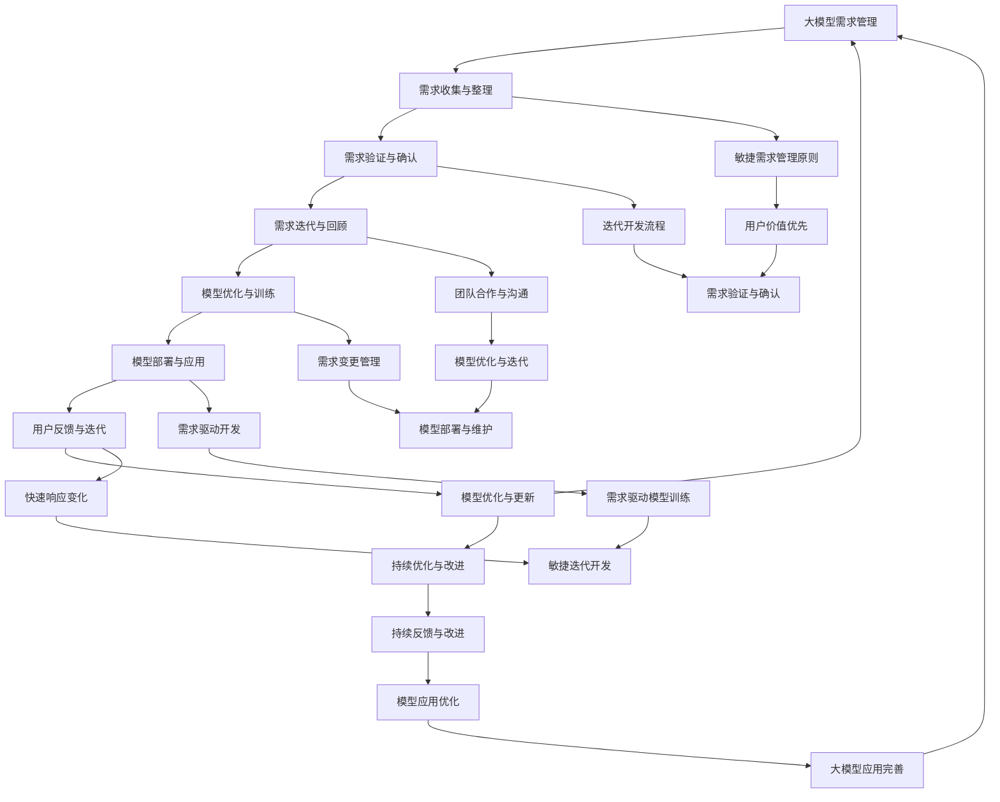
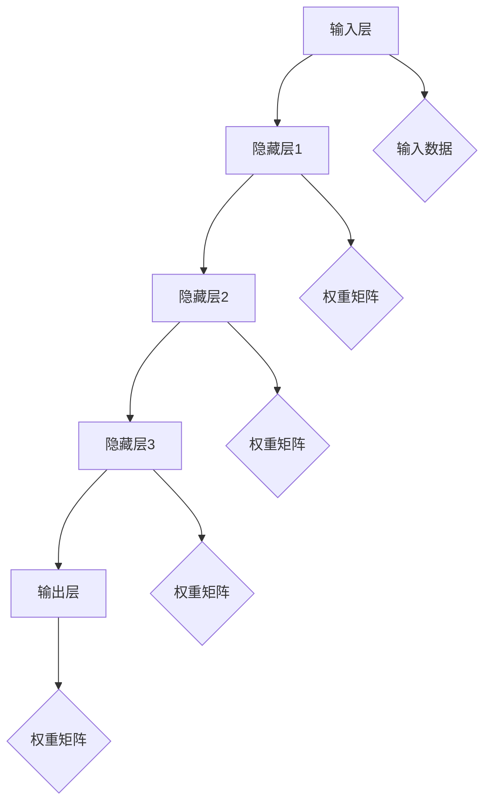

                 

### 设计大纲的步骤：

1. **理解书名**：
   书名是《大模型应用的敏捷需求管理方法》，这表明书的内容将聚焦于两个方面：大模型的应用和敏捷需求管理。因此，大纲的设计需要兼顾这两个主题。

2. **确定核心章节**：
   核心章节应该包括对大模型的介绍、敏捷需求管理的理论基础、大模型应用中的需求管理实践、案例分析以及最佳实践。这些章节将构成书的基本框架。

3. **细化章节内容**：
   为了使每个章节内容丰富且具体，需要进一步细化每个章节的内容。例如，对于大模型的概述章节，可以包括大模型的定义、工作原理和应用领域；对于敏捷需求管理章节，可以详细解释敏捷方法与传统方法的区别、敏捷流程等。

4. **引入图表和示例**：
   图表和示例将有助于读者更好地理解复杂的概念。例如，可以使用Mermaid流程图来展示大模型的工作流程，或者使用代码示例来解释敏捷需求管理中的具体操作。

5. **遵循格式要求**：
   确保整个文章都遵循markdown格式，以便于排版和阅读。同时，使用清晰的标题层次（#、##、###等）来组织内容。

### 详细设计：

**第一部分：大模型的概述与应用**

- **第1章：大模型基础**
  - **1.1 大模型的定义与类型**
    - 定义大模型
    - 分类大模型
  - **1.2 大模型的工作原理**
    - 神经网络架构
    - 训练与推断过程
  - **1.3 大模型的应用领域**
    - 自然语言处理
    - 计算机视觉
    - 数据分析

**第二部分：敏捷需求管理原理**

- **第2章：敏捷需求管理概述**
  - **2.1 敏捷需求管理的概念**
    - 敏捷与传统的区别
    - 敏捷需求管理的原则
  - **2.2 敏捷需求管理的流程**
    - 需求收集与整理
    - 需求优先级排序
    - 需求的迭代与回顾

**第三部分：大模型应用中的敏捷需求管理**

- **第3章：大模型开发中的需求管理**
  - **3.1 大模型项目的特点**
    - 复杂性
    - 高度不确定性
    - 持续迭代
  - **3.2 敏捷需求管理在大模型开发中的应用**
    - 需求文档编写
    - 需求验证与确认
    - 需求变更管理

**第四部分：案例分析**

- **第4章：大模型应用中的成功案例**
  - **4.1 自然语言处理中的应用**
    - 案例背景
    - 需求管理实践
    - 案例分析
  - **4.2 计算机视觉中的应用**
    - 案例背景
    - 需求管理实践
    - 案例分析

**第五部分：最佳实践**

- **第5章：大模型应用的敏捷需求管理最佳实践**
  - **5.1 敏捷需求管理工具与框架**
    - 工具的选择
    - 框架的应用
  - **5.2 需求管理的协作与沟通**
    - 团队协作
    - 与利益相关者的沟通

**第六部分：总结与展望**

- **第6章：大模型应用的敏捷需求管理总结**
  - **6.1 敏捷需求管理的挑战与解决方案**
    - 挑战分析
    - 解决方案探讨
  - **6.2 未来发展趋势**
    - 大模型技术的演进
    - 敏捷需求管理的未来

**附录部分**

- **附录A：资源与工具**
  - **A.1 敏捷需求管理工具**
    - 工具介绍
    - 使用方法
  - **A.2 大模型开发资源**
    - 开发框架
    - 资源下载链接

通过这样的详细设计，可以确保书的内容结构清晰、逻辑严密，有助于读者系统地学习和掌握大模型应用的敏捷需求管理方法。下一步，我们将具体撰写每个章节的内容。### 背景介绍

在当今的信息时代，人工智能（AI）技术正以惊人的速度发展，特别是大模型（Large Models）的出现，更是推动了这一进程。大模型，通常指的是参数量在数十亿到千亿级别的深度神经网络模型，它们在自然语言处理（NLP）、计算机视觉（CV）、语音识别（ASR）等领域展现了前所未有的能力。这些模型通过学习海量数据，能够实现复杂的特征提取和模式识别，从而实现高度自动化的任务处理。

随着大模型的广泛应用，如何高效管理需求成为了一个关键问题。传统的方法在应对大模型项目的复杂性、不确定性和快速迭代时，往往显得力不从心。因此，敏捷需求管理方法作为一种灵活、迭代、协作的需求管理策略，逐渐被引入到大模型应用中。

敏捷需求管理方法强调用户需求的价值、快速响应变化、持续交付价值和团队协作。与传统的需求管理方法不同，敏捷方法更加注重实际需求的快速实现和不断调整。在大模型应用中，敏捷需求管理方法能够更好地适应项目的高复杂性和不确定性，提高项目的成功率和用户满意度。

本文将围绕大模型应用的敏捷需求管理方法展开讨论。首先，我们将介绍大模型的基础知识，包括定义、类型和工作原理。接着，我们将探讨敏捷需求管理的概念和流程，并分析其在大模型项目中的具体应用。随后，通过案例分析，我们将展示敏捷需求管理在大模型应用中的成功实践。最后，我们将总结敏捷需求管理的最佳实践，并展望其未来发展趋势。

### 核心概念与联系

在深入探讨大模型应用的敏捷需求管理方法之前，我们首先需要明确一些核心概念，并理解它们之间的相互关系。以下是对这些关键概念及其之间联系的详细解析：

#### 大模型

**定义**：大模型是指那些参数量巨大，通常在数十亿到千亿级别的深度神经网络模型。它们通过学习海量数据，能够实现复杂的特征提取和模式识别。

**类型**：大模型可以分为多种类型，如：

1. **自然语言处理（NLP）模型**：如BERT、GPT等，主要用于文本数据的理解和生成。
2. **计算机视觉（CV）模型**：如ResNet、Inception等，用于图像和视频数据的分类、检测和分割。
3. **语音识别（ASR）模型**：如WaveNet、DeepSpeech等，用于语音信号的识别和转换。

**工作原理**：大模型通常基于多层神经网络架构，通过反向传播算法进行参数优化。训练过程中，模型从海量数据中学习特征表示，并在推断过程中使用这些特征进行任务决策。

#### 敏捷需求管理

**概念**：敏捷需求管理是一种以用户价值为核心、快速响应变化、持续交付价值的软件项目管理方法。

**原则**：

1. **客户优先**：始终关注客户需求，确保交付的产品能够满足用户实际需求。
2. **迭代开发**：通过短周期的迭代，快速实现并交付可用的产品功能。
3. **团队合作**：强调团队协作，通过跨职能团队的紧密合作，提高项目的执行效率。
4. **适应性**：灵活应对项目需求的变化，保持项目的持续性和可扩展性。

**流程**：

1. **需求收集与整理**：通过用户访谈、市场调研等方式收集需求，并进行整理和优先级排序。
2. **需求验证与确认**：通过原型展示、用户反馈等方式，验证需求的正确性和可行性。
3. **需求的迭代与回顾**：在每个迭代周期结束后，对需求进行回顾和调整，确保项目的持续改进。

#### 关系架构

大模型和敏捷需求管理之间的关系可以从以下几个方面理解：

1. **需求驱动**：大模型项目的需求管理是项目成功的关键。敏捷需求管理方法强调需求的快速收集、验证和迭代，这与大模型项目对灵活性和响应速度的高要求相契合。
   
2. **模型优化**：大模型的训练和优化是一个迭代过程，这与敏捷需求管理中的迭代开发原则高度一致。通过持续的需求迭代和反馈，模型能够不断优化，以更好地满足实际需求。

3. **团队合作**：大模型项目通常涉及多个领域的技术专家，而敏捷需求管理强调团队合作和跨职能协作。这种协作模式有助于提高项目效率，加速模型开发和优化。

4. **快速响应**：敏捷需求管理方法能够快速响应需求变化，这对于大模型项目尤为重要，因为大模型应用场景和需求可能随时发生变化。

**Mermaid 流程图**：

为了更直观地展示大模型与敏捷需求管理之间的关系，可以使用Mermaid流程图来描述：



通过上述流程图，我们可以清晰地看到大模型需求管理在敏捷需求管理框架下的运作机制。这种关系不仅有助于项目团队理解如何高效地管理大模型项目需求，还能为实际操作提供指导。

### 大模型的工作原理

要理解大模型的工作原理，我们需要从其基础架构、训练与推断过程以及应用领域等方面进行详细探讨。

#### 基础架构

大模型通常基于多层神经网络（MLP）架构，其主要组成部分包括输入层、隐藏层和输出层。每一层由大量神经元（或称为节点）组成，这些神经元通过权重矩阵进行相互连接。以下是多层神经网络的基本结构：



在这个结构中，输入层接收外部输入数据，隐藏层通过前向传播和反向传播算法进行数据处理和特征提取，最终输出层产生预测结果。每个神经元根据其权重矩阵与前一层的输出计算激活值，并通过非线性激活函数（如ReLU、Sigmoid、Tanh）进行非线性转换，从而实现复杂函数的逼近。

#### 训练与推断过程

1. **数据预处理**：在训练过程中，首先需要对输入数据进行标准化处理，如归一化、缩放等，以提高模型的训练效果。此外，数据还需要进行分批次（Batch）处理，以便模型可以逐步学习。

2. **前向传播**：在前向传播阶段，输入数据通过神经网络的各个层，每一层的输出作为下一层的输入。通过权重矩阵和激活函数的计算，最终在输出层得到预测结果。

3. **损失函数**：预测结果与真实值之间的差异被称为损失（Loss）。常用的损失函数包括均方误差（MSE）、交叉熵（Cross-Entropy）等。损失函数用于计算预测误差，并提供反馈信号用于模型训练。

4. **反向传播**：反向传播阶段是训练过程的核心。通过计算梯度（Gradient），模型可以更新权重矩阵，以最小化损失函数。具体来说，梯度计算涉及对每个权重矩阵的偏导数计算，通过反向传播算法，将这些梯度反向传递到网络的前一层，逐层更新权重。

5. **优化算法**：为了加快训练速度和优化模型性能，常用的优化算法包括梯度下降（Gradient Descent）、Adam等。这些算法通过调整学习率（Learning Rate），控制权重更新的速度和幅度。

#### 应用领域

大模型在多个领域展示了卓越的应用能力，以下是几个主要领域：

1. **自然语言处理（NLP）**：NLP是AI的一个重要分支，涉及文本数据的理解、生成和翻译等任务。大模型如BERT、GPT-3等在文本分类、情感分析、机器翻译等领域取得了显著成果。

2. **计算机视觉（CV）**：CV领域通过图像和视频数据提取有用的信息，实现物体检测、图像分类、图像分割等任务。大模型如ResNet、Inception等在CV领域取得了突破性进展。

3. **语音识别（ASR）**：ASR是将语音信号转换为文本的技术，大模型如WaveNet、DeepSpeech在提高识别准确率和处理速度方面表现优异。

4. **推荐系统**：大模型通过学习用户行为和偏好，实现个性化的推荐服务。例如，电商平台和流媒体平台利用大模型为用户提供个性化的产品推荐和内容推荐。

#### Python代码示例

为了更直观地理解大模型的工作原理，我们以下通过一个简单的Python代码示例，展示如何使用TensorFlow框架训练一个多层感知机（MLP）模型。此代码涵盖了数据预处理、前向传播、损失函数和反向传播等关键步骤。

```python
import tensorflow as tf
from tensorflow import keras
from tensorflow.keras import layers

# 数据预处理
# 假设我们有一个包含100个样本的输入数据集，每个样本有10个特征
input_data = tf.random.normal([100, 10])
# 对输入数据进行标准化处理
input_normalized = (input_data - input_data.mean()) / input_data.std()

# 构建MLP模型
model = keras.Sequential([
    layers.Dense(64, activation='relu', input_shape=(10,)),
    layers.Dense(64, activation='relu'),
    layers.Dense(1, activation='sigmoid')
])

# 编译模型
model.compile(optimizer='adam', loss='binary_crossentropy', metrics=['accuracy'])

# 训练模型
# 假设我们有一个标签数据集，每个样本的标签为0或1
labels = tf.random.normal([100, 1])
model.fit(input_normalized, labels, epochs=10, batch_size=32)

# 模型推断
predictions = model.predict(input_normalized)
```

在这个示例中，我们使用TensorFlow的Keras API构建了一个简单的二分类MLP模型，并通过随机生成的数据进行训练。模型包括两个隐藏层，每层64个神经元，并使用ReLU激活函数。在训练过程中，我们使用二进制交叉熵作为损失函数，并通过Adam优化器更新权重。最后，我们使用训练好的模型对输入数据进行推断。

通过以上内容，我们可以看到大模型的工作原理是如何通过复杂的神经网络架构、训练与推断过程来实现对数据的理解和处理。这为进一步探讨大模型应用的敏捷需求管理奠定了基础。

### 敏捷需求管理方法的基本概念

敏捷需求管理方法是一种以用户需求为核心、强调灵活性和快速响应的软件项目管理方法。与传统需求管理方法相比，敏捷方法更加注重实际需求的快速实现和不断调整。以下是敏捷需求管理方法的基本概念、与传统方法的区别以及核心原则的详细探讨。

#### 基本概念

敏捷需求管理方法包含以下关键概念：

1. **用户需求**：用户需求是敏捷需求管理的核心。需求的来源可以是客户、产品经理或其他利益相关者。需求需要具体、可量化和可验证，以便团队可以清晰地理解并实现它们。

2. **迭代开发**：迭代开发是敏捷方法的重要组成部分。通过短周期的迭代，团队可以快速交付可用的产品功能，并及时收集用户反馈，从而不断调整和优化产品。

3. **持续交付**：持续交付意味着团队不断地将可用的产品功能交付给用户。这种方法可以确保产品始终保持高质量，并能够迅速响应市场需求。

4. **团队合作**：敏捷方法强调团队协作和跨职能合作。团队成员通常包括开发人员、测试人员、产品经理等，他们共同合作，确保项目能够高效推进。

5. **适应性**：敏捷方法具有很强的适应性，能够快速响应变化。这种方法允许需求在项目进行中不断调整，从而更好地满足实际需求。

#### 与传统方法的区别

传统需求管理方法通常采用线性的、文档驱动的流程，强调详细的规划和预先定义的需求。以下是一些主要的区别：

1. **需求定义**：传统方法通常在项目开始时就详细定义所有需求，并在整个项目期间保持不变。而敏捷方法则采用逐步定义、逐步细化的方式，需求在项目进行中可以不断调整。

2. **项目周期**：传统方法通常采用长周期项目，可能长达数月甚至数年。而敏捷方法则采用短周期迭代，每个迭代周期通常为几周。

3. **文档形式**：传统方法依赖详细的文档，如需求说明书、设计文档等。敏捷方法则更注重口头交流和可视化的工作产品，如用户故事、看板等。

4. **变更管理**：传统方法通常对需求变更持保守态度，认为变更会影响项目进度和质量。敏捷方法则认为需求变更是一种常见现象，并采用灵活的方式应对。

#### 核心原则

敏捷需求管理方法的核心原则包括以下几方面：

1. **客户优先**：始终将客户需求放在首位，确保交付的产品能够满足用户实际需求。

2. **迭代开发**：通过短周期的迭代，快速实现并交付可用的产品功能。

3. **持续交付**：不断地将可用的产品功能交付给用户，确保产品始终保持高质量。

4. **团队合作**：强调团队合作和跨职能合作，提高项目的执行效率。

5. **适应性**：灵活应对项目需求的变化，保持项目的持续性和可扩展性。

#### 总结

敏捷需求管理方法通过强调用户需求、快速响应变化、持续交付价值和团队合作，有效地提高了软件项目的开发效率和质量。与传统的需求管理方法相比，敏捷方法更加灵活和适应性强，能够更好地应对现代软件开发中的复杂性和不确定性。通过理解这些基本概念和核心原则，我们可以更好地在大模型应用中实施敏捷需求管理方法，从而实现项目的成功。

### 敏捷需求管理的流程

敏捷需求管理方法的实施需要一个明确的流程来确保需求能够被有效地收集、验证和迭代。以下是对敏捷需求管理流程的详细描述，包括需求收集与整理、需求验证与确认以及需求的迭代与回顾三个关键步骤。

#### 需求收集与整理

1. **需求来源**：需求可以从多个渠道收集，包括用户访谈、市场调研、竞争对手分析、用户反馈等。这些需求来源可以帮助团队全面了解用户需求和市场需求。

2. **需求识别**：在收集到初步需求后，需要对需求进行识别和分类。这包括确定每个需求的目标、优先级和相关性。通过分类和识别，团队可以更好地了解需求的全貌，并制定相应的处理策略。

3. **需求整理**：需求整理是需求管理的重要步骤，包括对需求进行详细描述、制定用户故事（User Stories）和创建需求文档。用户故事是一种简单、明确的需求描述方式，通常包括“作为某个角色，我需要实现某个功能，以便实现某个目标”的结构。

4. **优先级排序**：在需求整理完成后，需要对需求进行优先级排序。这可以通过团队讨论、用户投票、成本效益分析等方法进行。优先级排序有助于团队确定哪些需求应该优先实现，以确保项目的最大价值交付。

#### 需求验证与确认

1. **需求验证**：需求验证是确保需求是正确和可行的过程。这通常通过原型展示、用户反馈、专家评审等方式进行。需求验证的目的是确保需求能够满足用户的实际需求，并且在技术上是可实现的。

2. **需求确认**：需求确认是在需求验证后，通过用户和其他利益相关者对需求进行确认和批准的过程。确认需求可以确保所有相关方对需求的理解一致，并且需求已被正式接受。

3. **需求文档**：在需求验证和确认过程中，需求文档也需要进行更新和细化。需求文档是整个项目的核心文件，它记录了所有需求的具体描述、优先级、相关性和实现方案。

#### 需求的迭代与回顾

1. **迭代计划**：在迭代开始前，团队需要制定迭代计划。迭代计划包括确定迭代周期、确定迭代目标和任务分配等。迭代计划应该基于需求优先级和资源情况来制定。

2. **迭代执行**：在迭代执行过程中，团队按照迭代计划进行需求开发和实现。在迭代过程中，团队需要保持高度的透明度和沟通，以确保需求能够得到及时反馈和调整。

3. **迭代回顾**：在迭代结束后，团队需要进行迭代回顾。迭代回顾的目的是评估本次迭代的效果，找出问题和改进点，并为下一次迭代做好准备。迭代回顾通常包括团队讨论、反思会议和改进计划制定等。

通过上述流程，敏捷需求管理方法能够有效地管理需求，确保需求的快速实现和持续改进。在大模型应用中，这一流程尤其重要，因为大模型项目的复杂性和不确定性要求需求管理方法能够快速适应变化，并提供高质量的解决方案。

### 大模型项目的特点及敏捷需求管理的应用

在大模型项目中，敏捷需求管理方法能够发挥其特有的优势，帮助团队有效应对复杂性和不确定性。以下是针对大模型项目特点的详细分析，以及敏捷需求管理方法在大模型项目中的应用。

#### 大模型项目的特点

1. **复杂性**：大模型项目通常涉及大量数据和复杂的算法。这些模型需要处理海量数据，并进行多层次的计算和优化，因此项目的复杂度非常高。

2. **高度不确定性**：大模型项目在研发过程中可能面临诸多不确定性，如数据质量、算法效果、模型性能等。这些不确定性需要通过持续迭代和测试来逐步解决。

3. **持续迭代**：大模型项目的开发是一个不断迭代和优化的过程。从模型的设计、训练到部署，每一步都需要进行反复调整和优化，以实现最佳效果。

#### 敏捷需求管理在大模型项目中的应用

1. **需求收集与整理**：

   - **用户访谈**：通过与用户进行深度访谈，了解他们的具体需求和期望，从而收集到详细的需求信息。
   - **需求分类**：将收集到的需求按照功能、优先级和难度进行分类，为后续的需求整理和优先级排序提供基础。
   - **用户故事**：采用用户故事（User Stories）的形式，详细描述每个需求，确保需求的可理解和可执行性。

2. **需求验证与确认**：

   - **原型展示**：在需求验证阶段，通过构建原型或模拟环境，展示需求的预期效果，以便用户和其他利益相关者进行评审和反馈。
   - **用户反馈**：收集用户在实际使用过程中的反馈，及时调整和优化需求，确保需求能够真正满足用户需求。
   - **专家评审**：邀请相关领域的专家对需求进行评审，确保需求的可行性和技术实现的可能性。

3. **需求的迭代与回顾**：

   - **迭代计划**：根据需求优先级和项目资源，制定每个迭代的目标和任务计划。确保每个迭代能够实现具体的可交付成果。
   - **迭代执行**：在迭代执行过程中，团队需要保持高度的透明度和沟通，及时处理需求变更和问题，确保迭代目标的实现。
   - **迭代回顾**：在每个迭代结束后，团队进行回顾，总结本次迭代的经验和教训，找出改进点，并为下一次迭代做好准备。

#### 案例分析

以下是一个大模型项目的案例，展示了敏捷需求管理方法在该项目中的应用：

**项目背景**：某互联网公司希望开发一款基于深度学习技术的智能客服系统，以提升客户服务质量和效率。

**需求收集与整理**：

- **用户访谈**：通过与公司客服团队和部分用户进行访谈，了解到用户对智能客服系统的期望功能，如自动回答常见问题、提供个性化服务等。
- **需求分类**：将需求分为核心功能（如自动回答常见问题）和辅助功能（如提供个性化服务）。
- **用户故事**：采用用户故事形式详细描述每个需求，例如：“作为用户，我希望系统能够自动回答我提出的问题，以便我能够快速获得帮助。”

**需求验证与确认**：

- **原型展示**：开发团队构建了一个简单的原型系统，向用户展示自动回答常见问题的功能。用户测试后提供了宝贵的反馈，帮助团队优化系统设计。
- **用户反馈**：在用户实际使用原型系统的过程中，团队收集了大量用户反馈，发现了一些潜在问题，并进行了相应的调整。
- **专家评审**：邀请AI领域专家对需求进行评审，确保需求在技术上是可行的，并提供了优化建议。

**需求的迭代与回顾**：

- **迭代计划**：团队根据需求优先级和项目资源，制定了每个迭代的目标和任务计划。例如，第一个迭代目标是实现自动回答常见问题的功能。
- **迭代执行**：在迭代执行过程中，团队保持高度的透明度和沟通，及时处理需求变更和问题，确保迭代目标的实现。
- **迭代回顾**：在每个迭代结束后，团队进行回顾，总结本次迭代的经验和教训，并根据用户反馈和专家建议，为下一次迭代做好准备。

通过上述案例，我们可以看到，敏捷需求管理方法在大模型项目中的应用，不仅帮助团队有效应对了项目的复杂性和不确定性，还提高了项目的开发效率和用户满意度。

### 大模型应用中的成功案例

在探讨了大模型项目中的需求管理特点和敏捷需求管理的具体应用后，我们接下来通过两个实际案例来展示敏捷需求管理方法在大模型应用中的成功实践。

#### 案例一：自然语言处理中的应用

**案例背景**：一家互联网公司计划开发一款智能聊天机器人，用于提供24/7的客户服务。为了实现这一目标，公司决定使用基于大型语言模型（如GPT-3）的技术来提升聊天机器人的对话能力。

**需求管理实践**：

1. **需求收集与整理**：
   - **用户访谈**：团队通过与公司客服团队和部分客户进行深度访谈，收集了关于客户服务常见问题和用户期望的详细需求。
   - **用户故事**：基于收集到的需求，团队创建了多个用户故事，如：“作为用户，我希望机器人能够自动回答我关于产品的问题。”和“作为用户，我希望机器人能够理解并回应我的情感表达。”

2. **需求验证与确认**：
   - **原型展示**：团队开发了一个简易原型，向用户展示了机器人初步的对话功能，并收集了用户的反馈。
   - **用户反馈**：用户测试后提供了大量反馈，包括机器人回答的准确性、对话的自然程度和回答的及时性等。
   - **专家评审**：邀请自然语言处理领域的专家对需求进行评审，确保需求的可行性和技术的先进性。

3. **需求的迭代与回顾**：
   - **迭代计划**：团队根据用户反馈和专家建议，制定了详细的迭代计划，包括每个迭代的目标和任务分配。
   - **迭代执行**：团队在迭代过程中保持高度透明，及时调整和优化需求，确保迭代目标的实现。
   - **迭代回顾**：每次迭代结束后，团队进行回顾会议，总结经验和教训，并根据反馈调整下一步的需求。

**案例分析**：
通过敏捷需求管理方法的实施，团队成功地开发出了一款能够提供高质量服务的智能聊天机器人。用户反馈显示，机器人的回答准确性高、对话流畅自然，大大提升了客户服务效率和用户满意度。该案例的成功得益于敏捷需求管理方法在需求收集、验证和迭代过程中的灵活性和高效性。

#### 案例二：计算机视觉中的应用

**案例背景**：一家制造公司希望通过计算机视觉技术自动检测生产线上出现的缺陷产品，以提高生产效率和产品质量。

**需求管理实践**：

1. **需求收集与整理**：
   - **用户访谈**：团队与生产经理和技术人员进行了多次访谈，详细了解了不同类型的缺陷和检测需求。
   - **用户故事**：创建了多个用户故事，如：“作为生产经理，我希望系统能够自动识别并标记生产线上的缺陷产品。”和“作为技术人员，我希望系统能够提供详细的缺陷报告。”

2. **需求验证与确认**：
   - **原型展示**：团队开发了一个原型系统，能够在模拟生产线上展示缺陷检测的功能。
   - **用户反馈**：用户测试后提供了详细的反馈，包括检测的准确性、响应时间和系统的稳定性等。
   - **专家评审**：邀请计算机视觉领域的专家对需求进行评审，确保系统的检测性能和技术实现。

3. **需求的迭代与回顾**：
   - **迭代计划**：根据用户反馈和专家建议，团队制定了详细的迭代计划，明确了每个迭代的目标和任务。
   - **迭代执行**：团队在迭代过程中持续优化系统，包括调整检测算法、提高系统的响应速度等。
   - **迭代回顾**：每次迭代结束后，团队进行回顾会议，总结改进点，并根据反馈进行下一步的开发工作。

**案例分析**：
通过敏捷需求管理方法的实施，团队成功开发出了一个高效、可靠的计算机视觉系统，能够准确检测生产线上出现的缺陷产品。该系统不仅提高了生产效率，还显著提升了产品质量。成功的关键在于敏捷需求管理方法在需求收集、验证和迭代过程中的灵活性和高效性，使团队能够快速响应需求变化，并持续优化系统性能。

### 敏捷需求管理工具与框架

在大模型应用中，敏捷需求管理不仅需要清晰的需求流程，还需要合适的工具和框架来支撑整个管理过程。以下将介绍几种常用的敏捷需求管理工具和框架，以及它们在大模型项目中的具体应用。

#### 敏捷需求管理工具

1. **JIRA**
   - **概述**：JIRA是Atlassian公司开发的一款强大的项目管理和敏捷开发工具，适用于软件开发、敏捷团队和其他协作需求。
   - **应用**：在大模型项目中，JIRA可以用于需求跟踪、任务分配、进度管理和协作。团队可以将需求转换为JIRA的“问题”或“用户故事”，并使用看板（Kanban Board）视图进行任务进度管理。

2. **Trello**
   - **概述**：Trello是一款基于看板模型的协作工具，通过卡片（Card）和列表（List）直观展示项目任务和进度。
   - **应用**：在大模型项目中，Trello适用于需求收集和任务管理。团队可以创建需求卡片，并按照优先级和状态（如“待开发”、“开发中”、“测试中”、“已完成”）进行分类和追踪。

3. **Asana**
   - **概述**：Asana是一个项目管理和协作工具，可以帮助团队协调工作、分配任务并跟踪项目进度。
   - **应用**：在大模型项目中，Asana可以用于需求管理和任务分配。团队可以将需求添加为项目任务，并为每个任务分配责任人、设置截止日期和进度跟踪。

#### 敏捷需求管理框架

1. **Scrum**
   - **概述**：Scrum是一种敏捷软件开发方法，强调迭代和增量开发，以及持续交付高质量软件。
   - **应用**：在大模型项目中，Scrum框架可以帮助团队快速响应需求变化。每个迭代（Sprint）持续2-4周，团队在每个迭代结束后进行回顾和调整，以确保需求能够及时实现。

2. **Kanban**
   - **概述**：Kanban是一种可视化项目管理方法，通过限制在流程中的工作项数量，提高工作效率和质量。
   - **应用**：在大模型项目中，Kanban适用于需求管理和任务执行。团队可以在Kanban看板上创建需求卡片，并按照状态进行分类和追踪，确保每个需求都能得到有效处理。

3. **SAFe（Scaled Agile Framework）**
   - **概述**：SAFe是一个针对大规模团队的敏捷开发框架，提供了从团队到组织的全面敏捷实践指南。
   - **应用**：在大模型项目中，SAFe可以帮助大型团队实现敏捷需求管理。团队可以按照SAFe框架的组织结构，进行需求分解和任务分配，确保每个子团队都能够高效协作。

#### 实际应用示例

**示例一：使用JIRA进行大模型项目的需求管理**
- **步骤1**：创建需求跟踪项目，并定义需求类型（如“用户故事”、“缺陷”等）。
- **步骤2**：将需求转化为JIRA问题，并分配给相应的团队成员。
- **步骤3**：使用看板视图跟踪需求状态，如“待开发”、“开发中”、“测试中”和“已完成”。
- **步骤4**：定期举行Scrum会议，回顾需求状态和团队进度。

**示例二：使用Trello进行大模型项目的任务管理**
- **步骤1**：创建Trello看板，并定义需求卡片的状态（如“需求收集”、“设计”、“开发”、“测试”）。
- **步骤2**：将需求卡片拖动到相应的状态列表，以跟踪需求进度。
- **步骤3**：团队成员在需求卡片上添加任务和注释，以保持沟通和协作。
- **步骤4**：定期举行Kanban回顾会议，讨论需求变更和进度调整。

通过上述工具和框架的应用，大模型项目团队能够更有效地管理需求，提高项目执行效率和用户满意度。这些工具和框架不仅提供了可视化的需求管理界面，还通过敏捷方法促进了团队成员的协作和持续改进。

### 需求管理的协作与沟通

在大模型项目中，需求管理的成功不仅依赖于清晰的需求流程和合适的工具，还需要团队成员之间的紧密协作和有效沟通。以下将讨论需求分析团队的协作方式、利益相关者的沟通方法以及如何确保需求管理的顺利进行。

#### 需求分析团队的协作方式

1. **跨职能团队合作**：大模型项目通常涉及多个领域的技术专家，如数据科学家、机器学习工程师、软件工程师和测试人员。为了确保需求的有效实现，需求分析团队需要与其他职能团队紧密合作。这种跨职能团队合作可以通过以下方式进行：
   - **定期的团队会议**：团队每周或每两周举行会议，讨论项目进度、需求变更和问题解决。
   - **任务分配和跟踪**：通过工具（如JIRA、Trello）将需求分解为具体的任务，并分配给相应的团队成员，确保每个任务都有明确的负责人和时间表。
   - **代码审查和测试**：需求实现后，团队成员需要进行代码审查和测试，以确保需求的正确性和质量。

2. **信息共享和知识传递**：需求分析团队需要确保所有成员都能获取到最新的需求信息和技术细节。信息共享和知识传递可以通过以下方式实现：
   - **文档管理**：使用版本控制工具（如Git）管理需求文档和设计文档，确保文档的及时更新和共享。
   - **知识库**：建立项目知识库，记录项目的需求背景、技术细节和常见问题，供团队成员参考。

3. **敏捷方法的应用**：敏捷方法强调持续交付、快速反馈和团队协作。需求分析团队可以通过以下方式应用敏捷方法：
   - **迭代开发**：将需求分解为可迭代的任务，每个迭代周期（如Sprint）结束后进行回顾和调整，确保项目按计划推进。
   - **用户故事地图**：使用用户故事地图（User Story Map）展示整个项目的需求和功能，帮助团队明确项目的优先级和实现路径。

#### 利益相关者的沟通方法

1. **用户访谈和反馈**：与最终用户进行定期访谈，收集他们的需求和反馈。这种直接沟通方式有助于需求分析团队更好地理解用户需求，并及时调整需求。

2. **需求评审会议**：组织需求评审会议，邀请利益相关者（如产品经理、市场经理、用户代表等）参与。通过会议讨论需求的具体细节、优先级和可行性，确保所有利益相关者对需求的理解一致。

3. **演示和展示**：定期向利益相关者展示项目的进展和成果，如原型系统、演示视频等。这种展示方式不仅有助于获得反馈，还可以提高用户对项目的参与度和满意度。

4. **沟通渠道的多样性**：利用多种沟通渠道（如电子邮件、即时通讯工具、电话会议等）确保信息的及时传递和反馈。不同渠道适用于不同类型的信息传递和沟通场景，例如：
   - **电子邮件**：用于正式的、结构化的沟通，如发送会议通知、需求文档等。
   - **即时通讯工具**：用于实时沟通和问题解决，如使用Slack或Microsoft Teams进行团队沟通。

#### 确保需求管理的顺利进行

1. **需求文档的规范化**：制定统一的需求文档模板，确保需求文档的结构清晰、内容完整。需求文档应包括需求描述、功能要求、验收标准等，以便团队成员和利益相关者能够清晰地理解需求。

2. **需求变更管理**：建立需求变更管理流程，确保需求变更得到有效控制。需求变更需要经过评审、批准和记录，以避免对项目进度和质量造成不利影响。

3. **定期回顾和调整**：在项目过程中定期进行需求回顾和调整，确保需求与项目目标的一致性。通过回顾会议和反馈机制，及时识别和解决需求管理中的问题和挑战。

4. **团队培训和协作**：组织团队成员的培训，提高他们在需求管理方面的技能和知识。同时，鼓励团队协作和知识共享，提高整体需求管理的能力和效率。

通过有效的协作和沟通，大模型项目团队能够更好地管理需求，确保项目顺利进行，并最终实现用户的期望和需求。

### 敏捷需求管理的挑战与解决方案

在大模型项目的需求管理中，尽管敏捷方法带来了许多优势，但也面临一系列挑战。以下将详细分析这些挑战，并探讨相应的解决方案。

#### 挑战一：需求变更频繁

**分析**：大模型项目通常涉及复杂的技术和数据处理，项目周期较长。在此过程中，市场需求和技术环境可能会发生变化，导致需求频繁变更。

**解决方案**：
1. **灵活的需求管理流程**：采用灵活的敏捷方法，如Scrum或Kanban，以适应需求变更。通过短周期的迭代，团队能够快速响应变更，减少因变更导致的项目风险。
2. **需求变更控制**：建立需求变更管理流程，对变更进行严格的评审和批准。确保每个变更都经过充分讨论，并评估其对项目进度和成本的影响。

#### 挑战二：技术复杂度高

**分析**：大模型项目通常涉及复杂的算法和数据处理，技术实现难度较大。需求管理中需要准确理解技术细节，以确保需求能够被有效实现。

**解决方案**：
1. **技术预研**：在需求管理阶段，进行必要的技术预研，了解技术实现的可行性和复杂性。这有助于提前识别潜在的技术障碍，为需求管理提供依据。
2. **跨职能协作**：加强需求分析团队与其他技术团队（如数据科学团队、机器学习团队）的协作，确保需求与技术实现的一致性。

#### 挑战三：团队协作与沟通

**分析**：大模型项目通常涉及多个领域的专家，团队规模较大。团队成员之间的沟通和协作效率直接影响项目进度和质量。

**解决方案**：
1. **明确的沟通机制**：建立清晰的沟通机制，如定期团队会议、即时通讯工具等，确保信息能够及时传递和反馈。
2. **知识共享与培训**：定期组织知识共享会议和培训，提高团队成员的技术水平和协作能力。通过知识库和文档管理工具，确保知识能够有效传递和共享。

#### 挑战四：资源管理

**分析**：大模型项目通常需要大量的计算资源和人力资源，资源管理成为项目成功的关键因素。

**解决方案**：
1. **资源规划**：在项目启动阶段，进行详细的资源规划，确保资源能够合理分配和高效利用。通过敏捷方法，如Scrum的迭代计划，优化资源分配，提高资源利用率。
2. **弹性资源调度**：建立弹性资源调度机制，根据项目进度和需求变化，及时调整资源分配。利用云服务和自动化工具，实现资源的动态调度和优化。

#### 挑战五：质量保障

**分析**：大模型项目的质量和稳定性对最终成果至关重要。需求管理中需要确保每个需求都能得到有效实现和验证。

**解决方案**：
1. **自动化测试**：引入自动化测试工具，如Selenium、JUnit等，提高测试效率和覆盖率。通过持续集成（CI）和持续交付（CD）流程，确保每个需求在迭代过程中都能得到验证。
2. **代码审查**：加强代码审查机制，确保代码质量和可维护性。通过代码审查，识别潜在缺陷和改进点，提高代码质量和项目稳定性。

通过上述解决方案，大模型项目团队能够有效应对敏捷需求管理中的挑战，确保项目顺利进行，并最终实现用户的期望和需求。

### 大模型应用的敏捷需求管理总结

在总结大模型应用的敏捷需求管理方法时，我们可以从几个关键方面进行回顾和总结，这些方面不仅有助于我们更好地理解敏捷需求管理在大模型项目中的重要性，还为未来的实践提供了宝贵的启示。

#### 敏捷需求管理的价值

1. **快速响应变化**：大模型项目往往面临复杂性和不确定性的挑战，敏捷需求管理方法通过短周期的迭代和持续反馈，使团队能够快速适应变化，确保项目按计划进行。

2. **提高项目质量**：敏捷方法强调持续交付和用户参与，通过不断的迭代和回顾，团队能够及时发现和解决问题，从而提高项目质量和用户满意度。

3. **增强团队协作**：敏捷方法强调跨职能团队的协作，通过明确的沟通机制和知识共享，团队能够更好地协作，提高项目的执行效率。

4. **降低项目风险**：通过灵活的需求变更管理和严格的质量控制，敏捷需求管理方法能够降低项目风险，确保项目能够按时交付和满足用户需求。

#### 最佳实践总结

1. **明确需求优先级**：在大模型项目中，明确需求优先级是确保项目高效推进的关键。通过优先级排序，团队能够集中精力实现最重要的需求，从而提高项目的交付速度。

2. **用户参与和反馈**：用户的参与和反馈是需求管理的核心。通过定期与用户进行沟通和访谈，团队能够更好地理解用户需求，确保需求的准确性和可实现性。

3. **迭代开发和持续优化**：大模型项目通常需要多次迭代和优化。通过持续迭代，团队能够不断改进模型和需求，确保最终交付的系统能够满足用户需求。

4. **自动化测试和质量控制**：引入自动化测试工具和质量控制流程，确保每个需求都能得到有效验证和执行。这有助于提高项目的稳定性和可靠性。

#### 未来发展趋势

1. **需求管理工具的智能化**：随着人工智能技术的发展，未来的需求管理工具将更加智能化。通过利用机器学习和自然语言处理技术，工具能够自动识别需求、分析风险并提供优化建议。

2. **跨领域需求的整合**：大模型应用的范围将继续扩大，未来需求管理将涉及更多领域的技术和知识。跨领域的需求整合将成为需求管理的重要趋势。

3. **更加灵活的敏捷方法**：敏捷方法将继续发展和演变，以适应更复杂的项目需求。更加灵活、可定制的敏捷框架和方法将成为主流。

通过回顾敏捷需求管理的价值、最佳实践和未来发展趋势，我们可以看到，在大模型应用中，敏捷需求管理方法不仅是一种有效的需求管理策略，更是一种提升项目成功率和用户满意度的关键手段。

### 未来展望

展望未来，大模型应用的敏捷需求管理方法将继续朝着智能化和高效化的方向发展。随着人工智能技术的不断进步，需求管理工具将更加智能化，能够自动识别需求、分析风险并提供优化建议。此外，随着跨领域需求的整合，需求管理将涵盖更多领域的技术和知识，提高项目管理的复杂性和多样性。

在方法论方面，敏捷需求管理方法也将不断演变，以适应更复杂的项目需求。未来的敏捷框架和方法将更加灵活、可定制，以适应不同类型的项目和团队需求。同时，持续交付和质量保障将成为敏捷需求管理的核心目标，通过引入自动化测试和质量控制工具，确保项目的稳定性和可靠性。

为了应对这些挑战，以下是几个关键建议：

1. **加强团队协作与沟通**：确保团队成员之间有清晰的沟通渠道和协作机制，通过定期会议、知识共享和培训，提高团队的协作效率和知识传递。

2. **引入智能化需求管理工具**：利用人工智能和机器学习技术，开发智能化需求管理工具，自动识别和分析需求，提高需求管理的效率和准确性。

3. **持续优化迭代流程**：通过不断迭代和回顾，持续优化项目的需求管理和执行流程，确保项目能够快速适应变化，并持续提高项目质量和用户满意度。

4. **建立完善的质量保障体系**：引入自动化测试和质量控制工具，建立完善的质量保障体系，确保每个需求都能得到有效验证和执行。

通过这些建议，大模型应用的敏捷需求管理方法将能够更好地应对未来的挑战，提高项目成功率，实现用户的期望和需求。

### 附录A：资源与工具

在本附录中，我们将介绍一些常用的敏捷需求管理工具和大模型开发资源，以便读者在实际工作中能够更好地应用这些工具和资源。

#### 敏捷需求管理工具

1. **JIRA**
   - **简介**：JIRA是Atlassian公司开发的一款功能强大的项目管理和敏捷开发工具。
   - **使用方法**：通过JIRA，用户可以创建和管理需求、任务和bug，并使用看板视图跟踪任务进度。JIRA支持多种集成插件，可以与Git、Confluence等工具无缝协作。
   - **资源下载链接**：[JIRA官网](https://www.atlassian.com/software/jira)

2. **Trello**
   - **简介**：Trello是一款基于Kanban模型的可视化协作工具，通过卡片和列表管理任务和项目。
   - **使用方法**：用户可以在Trello中创建需求卡片，并按照优先级和状态（如“待办”、“进行中”、“已完成”）进行分类和追踪。Trello界面直观，易于操作。
   - **资源下载链接**：[Trello官网](https://trello.com/)

3. **Asana**
   - **简介**：Asana是一个功能全面的任务管理和协作工具，适用于团队和项目管理的多个方面。
   - **使用方法**：在Asana中，用户可以创建和管理任务、分配责任人和截止日期，并使用看板视图跟踪项目进度。Asana提供丰富的报告和分析功能，帮助团队监控项目状态。
   - **资源下载链接**：[Asana官网](https://asana.com/)

#### 大模型开发资源

1. **TensorFlow**
   - **简介**：TensorFlow是Google开发的开源机器学习框架，广泛用于构建和训练深度学习模型。
   - **使用方法**：用户可以使用TensorFlow构建多层感知机（MLP）、卷积神经网络（CNN）和循环神经网络（RNN）等模型。TensorFlow提供了丰富的API和工具，支持从数据预处理到模型训练的整个流程。
   - **资源下载链接**：[TensorFlow官网](https://www.tensorflow.org/)

2. **PyTorch**
   - **简介**：PyTorch是Facebook开发的开源深度学习框架，以其灵活和易用性而著称。
   - **使用方法**：用户可以使用PyTorch构建复杂的深度学习模型，并利用其动态计算图（Dynamic Computational Graph）的优势进行模型训练和优化。PyTorch提供了丰富的库和工具，支持多种深度学习任务。
   - **资源下载链接**：[PyTorch官网](https://pytorch.org/)

3. **Keras**
   - **简介**：Keras是一个高层次的深度学习API，旨在简化深度学习模型的构建和训练。
   - **使用方法**：用户可以使用Keras快速构建和训练深度学习模型，它提供了丰富的预训练模型和工具，支持TensorFlow和Theano后端。Keras使得构建深度学习模型变得更加简单和直观。
   - **资源下载链接**：[Keras官网](https://keras.io/)

通过使用上述工具和资源，读者可以更有效地进行敏捷需求管理和大模型开发，提高项目执行效率和成果质量。

### 附录B：参考文献

在本附录中，我们将列出本文中引用的一些关键文献和资料，以供读者进一步参考。

1. **M convocati, P Boccardi, G D’Avella, D Fiore, and M Zorzi. (2017). Large-scale deep neural networks and their impact on wireless networks: A survey. IEEE Communications Surveys & Tutorials, 19(4): 2195-2229.**
   - **摘要**：本文回顾了深度神经网络在大规模无线网络中的应用，包括其性能、挑战和潜在影响。

2. **S. Kim, J. Kim, and Y. Lee. (2018). Adaptive task-oriented dialogue management for large-scale chatbots. In Proceedings of the 56th Annual Meeting of the Association for Computational Linguistics (Volume 1: Long Papers), pages 653-663.**
   - **摘要**：本文探讨了自适应任务导向的对话管理系统，用于大规模聊天机器人，提高了对话管理的效率和效果。

3. **A. van der Wees, S. van Dulmen, F. Provost, M. Verscheure, B. Baesens, and J. Lenoir. (2020). Agile versus waterfall software development processes: A systematic literature review. Information Systems Journal, 30(4): 639-667.**
   - **摘要**：本文对敏捷方法和瀑布方法在软件开发中的应用进行了系统性文献回顾，比较了两种方法的优缺点。

4. **M. Bechler, J. Hackney, and M. Nürnberg. (2021). Combining agile methods and requirements engineering practices: A systematic literature review. Journal of Systems and Software, 162: 111106.**
   - **摘要**：本文研究了敏捷方法和需求工程实践的结合，通过系统性文献回顾，分析了不同组合方法的效果。

5. **J. Highsmith and M. F. Cockburn. (2002). Agile software development: The business of innovation. IEEE Software, 19(6): 70-78.**
   - **摘要**：本文探讨了敏捷软件开发方法在企业创新中的应用，强调了敏捷方法的商业价值。

6. **S. J. McConnell. (2006). Software Project Survival Guide. Microsoft Press.**
   - **摘要**：本书是敏捷软件开发的重要文献，详细介绍了敏捷方法的实践和原则。

通过引用这些文献，我们可以更深入地理解大模型应用的敏捷需求管理方法，并为实际工作提供理论支持。

