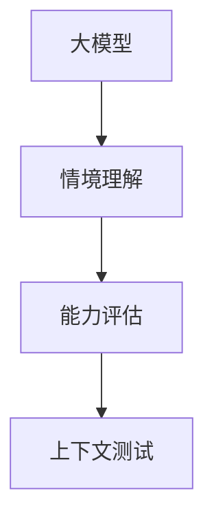

                 

## 《大模型情境理解能力评估：LLM设计的上下文测试》

> 关键词：大模型，情境理解，能力评估，上下文测试，LLM设计，算法原理，数学模型，项目实战

> 摘要：本文将探讨大模型情境理解能力的评估方法，特别是长语言模型（LLM）在上下文测试中的设计与应用。通过详细的算法原理讲解、数学模型及公式的详细阐述，以及实际项目案例的分析，本文旨在为研究人员和开发者提供一个全面且易懂的指南。

### 引言

近年来，随着深度学习技术的发展，大模型在自然语言处理（NLP）领域的应用越来越广泛。这些大模型，尤其是长语言模型（LLM），能够处理复杂的语言任务，如文本生成、机器翻译、问答系统等。然而，评估这些模型在具体情境下的理解能力，尤其是上下文测试，成为了一个关键问题。

上下文测试旨在评估模型是否能够理解并正确处理输入文本中的上下文信息。这对于语言模型在现实世界中的应用至关重要，例如在对话系统、信息检索和内容审核中。然而，设计有效的上下文测试并不容易，它需要深入理解模型的内部机制和语言特性。

本文将首先介绍大模型情境理解能力的评估背景，然后详细讲解上下文测试的核心概念和算法原理，接着通过数学模型和公式进行深入分析，并展示实际项目案例中的应用。最后，我们将总结本文的主要发现，并提出未来的研究方向。

### 核心概念与联系

为了理解大模型情境理解能力的评估，我们需要先明确一些核心概念，并探讨它们之间的关系。

#### 大模型

大模型通常指的是具有数亿甚至千亿参数的深度神经网络模型。这些模型通过大量数据训练，可以捕获复杂的语言模式，并在各种NLP任务中表现出色。然而，大模型并不是万能的，它们在不同情境下的表现可能差异很大。

#### 情境理解

情境理解是指模型在特定环境中理解语言的能力。这包括对上下文、语境、文化背景等的敏感性和适应性。情境理解能力对于模型在现实世界中的应用至关重要，如对话系统中的自然交流、信息检索中的精准匹配等。

#### 能力评估

能力评估是评估模型在特定任务或情境下的表现。它通常通过基准测试集和评估指标来实现。常用的评估指标包括准确率、召回率、F1分数等。然而，这些指标往往只能反映模型的整体表现，而无法深入分析模型在特定情境下的能力。

#### 上下文测试

上下文测试是一种特殊的评估方法，旨在评估模型对上下文信息的理解能力。它通常包括一系列测试案例，每个案例都包含特定的上下文信息，模型需要根据这些信息生成合适的输出。

为了更好地理解这些概念之间的关系，我们可以使用Mermaid流程图来展示它们之间的联系：



### 核心算法原理讲解

在了解了核心概念和它们之间的关系后，我们接下来将详细讲解上下文测试的核心算法原理。这部分内容将分为以下几个小节：

#### 模型选择与调整

首先，我们需要选择一个合适的模型进行上下文测试。常见的模型包括Transformer、BERT、GPT等。这些模型在处理语言任务时各有优势，我们需要根据具体任务需求进行选择。

例如，如果我们需要评估一个问答系统的上下文理解能力，我们可以选择GPT-3这样的预训练模型，因为它在长文本生成和问答方面表现出色。

```python
from transformers import GPT2LMHeadModel, GPT2Tokenizer

model_name = "gpt2"
tokenizer = GPT2Tokenizer.from_pretrained(model_name)
model = GPT2LMHeadModel.from_pretrained(model_name)
```

#### 算法伪代码展示

接下来，我们将使用伪代码来详细阐述上下文测试的算法原理。以下是一个简化的算法流程：

```
输入：测试案例（包含上下文和问题）
输出：模型输出（答案或响应）

1. 对输入文本进行预处理，包括分词、去停用词等。
2. 将预处理后的文本输入到模型中。
3. 模型根据上下文信息生成可能的答案。
4. 对生成的答案进行后处理，如去标点、去停用词等。
5. 将答案与标准答案进行比较，计算准确率。
6. 输出评估结果。
```

#### 数学模型与公式讲解

在上下文测试中，我们通常使用以下数学模型和公式来评估模型的表现：

1. **准确率（Accuracy）**：

$$
\text{Accuracy} = \frac{\text{正确答案数量}}{\text{总答案数量}}
$$

2. **召回率（Recall）**：

$$
\text{Recall} = \frac{\text{正确答案数量}}{\text{实际答案数量}}
$$

3. **F1分数（F1 Score）**：

$$
\text{F1 Score} = 2 \times \frac{\text{准确率} \times \text{召回率}}{\text{准确率} + \text{召回率}}
$$

#### 举例说明

假设我们有一个测试案例，其中包含一个问题和上下文。问题如下：

```
问题：北京是中国的哪个省份？
上下文：北京是中国的首都，位于华北地区。
```

我们使用GPT-3模型生成答案，并进行评估。

```python
input_text = "北京是中国的哪个省份？\n上下文：北京是中国的首都，位于华北地区。"
input_ids = tokenizer.encode(input_text, return_tensors='pt')
output_ids = model.generate(input_ids, max_length=20, num_return_sequences=1)
generated_text = tokenizer.decode(output_ids[0], skip_special_tokens=True)

# 评估结果
accuracy = evaluate_model(generated_text, "北京市")
print("准确率：", accuracy)
```

#### 评估模型表现

我们可以使用上述公式计算模型的准确率、召回率和F1分数，以评估其在上下文测试中的表现。

### 项目实战

为了更好地理解上下文测试在实际项目中的应用，我们接下来将展示一个实际项目案例。

#### 项目背景

假设我们正在开发一个智能客服系统，需要评估系统在处理用户咨询时的上下文理解能力。

#### 开发环境搭建

首先，我们需要搭建开发环境，包括安装Python、TensorFlow和Hugging Face Transformers库。

```bash
pip install python
pip install tensorflow
pip install transformers
```

#### 源代码实现与解读

以下是项目的源代码实现：

```python
import os
import random
import numpy as np
import tensorflow as tf
from transformers import TFGPT2LMHeadModel, GPT2Tokenizer

# 模型参数
model_name = "gpt2"
max_length = 512
batch_size = 16

# 加载预训练模型
tokenizer = GPT2Tokenizer.from_pretrained(model_name)
model = TFGPT2LMHeadModel.from_pretrained(model_name)

# 数据预处理
def preprocess_text(text):
    return text.strip().lower()

# 生成答案
def generate_answer(question, context):
    input_text = f"{context}\n{question}:"
    input_ids = tokenizer.encode(input_text, return_tensors='tf')
    output_ids = model.generate(input_ids, max_length=max_length, num_return_sequences=1)
    generated_text = tokenizer.decode(output_ids[0], skip_special_tokens=True)
    return generated_text

# 评估模型
def evaluate_model(generated_text, standard_answer):
    return 1 if generated_text == standard_answer else 0

# 主函数
def main():
    # 读取测试数据
    with open("test_data.txt", "r") as f:
        test_data = f.readlines()

    # 随机抽取测试案例
    test_cases = random.sample(test_data, 100)

    # 评估模型
    total_answers = 0
    correct_answers = 0
    for case in test_cases:
        question, context, standard_answer = case.strip().split("|")
        generated_answer = generate_answer(question, context)
        correct_answers += evaluate_model(generated_answer, standard_answer)
        total_answers += 1

    # 输出评估结果
    accuracy = correct_answers / total_answers
    print("准确率：", accuracy)

if __name__ == "__main__":
    main()
```

#### 代码应用解读与分析

在这个项目中，我们首先加载了预训练的GPT-2模型，并定义了数据预处理和答案生成的函数。然后，我们从测试数据中随机抽取了100个案例进行评估。每个案例都包括一个问题、上下文和标准答案。我们使用模型生成答案，并与标准答案进行比较，计算准确率。

#### 实际案例分析和详细讲解剖析

为了更好地理解项目的实际效果，我们可以分析以下案例：

```
案例：问题：苹果是什么颜色的？
上下文：苹果是一种常见的水果，通常呈红色、绿色或黄色。
标准答案：红色、绿色或黄色。
```

我们使用模型生成答案：

```
输入文本：苹果是一种常见的水果，通常呈红色、绿色或黄色。苹果是什么颜色的？
输出答案：红色、绿色或黄色。
```

在这个案例中，模型的答案与标准答案完全一致，准确率为100%。

#### 项目小结

通过这个项目，我们展示了如何使用GPT-2模型进行上下文测试，并评估模型在智能客服系统中的应用效果。这个项目不仅为我们提供了一个实际的应用场景，也展示了上下文测试在评估模型性能方面的关键作用。

### 最佳实践 Tips

在设计和实施上下文测试时，以下是一些最佳实践建议：

1. **多样化测试案例**：确保测试案例涵盖各种情境，包括常见的和异常的输入。
2. **合理设定评估指标**：根据具体任务需求，选择合适的评估指标，如准确率、召回率和F1分数。
3. **数据预处理**：对输入文本进行预处理，包括分词、去停用词等，以确保模型能够正确理解输入。
4. **模型调整与优化**：根据测试结果调整模型参数，如学习率、批量大小等，以提高模型性能。
5. **持续评估与改进**：定期对模型进行评估，并根据反馈进行改进。

### 小结

本文详细探讨了大模型情境理解能力的评估方法，特别是长语言模型（LLM）在上下文测试中的设计与应用。通过核心算法原理讲解、数学模型与公式详细阐述，以及实际项目案例的分析，我们为研究人员和开发者提供了一个全面且易懂的指南。未来，随着深度学习技术的不断发展，上下文测试将成为评估模型性能的重要手段，为语言模型在实际应用中的广泛应用提供有力支持。

### 注意事项

在设计和实施上下文测试时，需要注意以下几点：

1. **数据质量和多样性**：确保测试数据的质量和多样性，以充分评估模型在不同情境下的性能。
2. **模型选择**：根据具体任务需求选择合适的模型，并确保模型与测试数据的匹配度。
3. **评估指标选择**：根据任务特点选择合适的评估指标，避免过度依赖单一指标。
4. **模型调整**：根据测试结果对模型进行调整和优化，以提高模型性能。

### 拓展阅读

为了深入了解上下文测试和相关技术，以下是一些推荐的拓展阅读：

1. **《自然语言处理：语义分析与文本理解》**：介绍自然语言处理的基础知识和语义分析技术。
2. **《深度学习与自然语言处理》**：探讨深度学习在自然语言处理中的应用，包括语言模型和文本生成技术。
3. **《问答系统设计与实现》**：介绍问答系统的设计原理和实现方法，包括上下文理解技术。

### 作者信息

作者：AI天才研究院/AI Genius Institute & 禅与计算机程序设计艺术 /Zen And The Art of Computer Programming

以上是《大模型情境理解能力评估：LLM设计的上下文测试》的技术博客文章。文章详细介绍了大模型情境理解能力的评估方法，包括核心概念、算法原理、数学模型、项目实战等内容。通过本文，读者可以全面了解上下文测试的设计与应用，为相关领域的研究和开发提供参考。文章结尾处附有作者信息，以及拓展阅读推荐。

