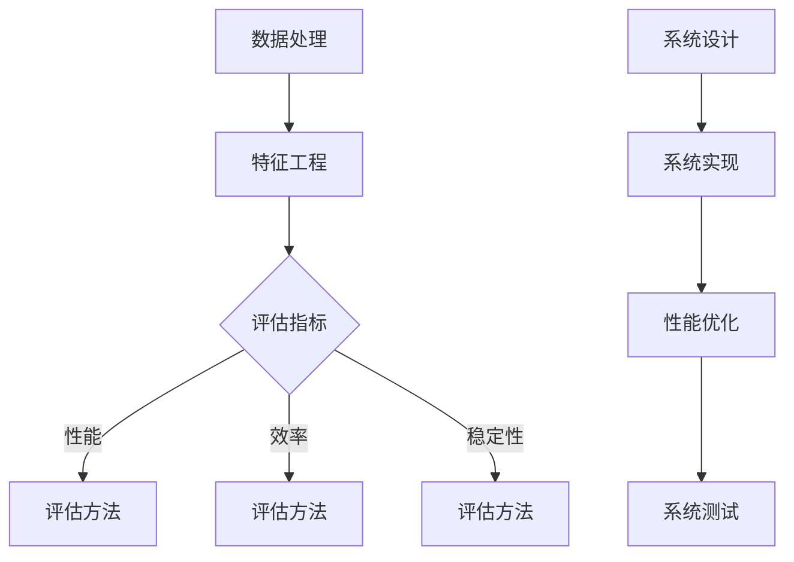

                 

# 《大模型推理能力定量分析系统》

> 关键词：大模型，推理能力，定量分析，系统设计，算法实现

> 摘要：本文旨在深入探讨大模型推理能力的定量分析系统，从理论基础、定量分析方法、系统设计与实现等多个方面，系统地阐述了大模型推理能力的评估与优化策略。通过对数据处理、特征工程、评估指标、定量分析算法等核心内容的详细讲解，结合实际案例，本文提供了系统化的解决方案，以期为人工智能领域的研究与实践提供参考。

## 引言

随着人工智能技术的快速发展，大模型在各个领域的应用越来越广泛。大模型具有强大的数据处理能力和复杂的模型结构，能够处理大量数据并生成高质量的预测结果。然而，大模型的推理能力并不是一个简单的量化指标，而是涉及到性能、效率、稳定性等多个方面。因此，对大模型推理能力的定量分析成为一个重要的研究课题。

本文旨在构建一个系统化的大模型推理能力定量分析系统，通过对数据处理、特征工程、评估指标、定量分析算法等核心内容的深入探讨，提供一套全面的分析方法与实现策略。本文将分为以下几个部分：

1. **理论基础**：介绍大模型与推理能力的基本概念，阐述大模型推理能力的重要性。
2. **定量分析方法**：介绍数据处理与特征工程、推理能力评估指标体系、定量分析算法与模型。
3. **系统设计与实现**：详细描述系统架构设计、系统实现与性能优化。
4. **项目实战**：通过实际案例展示系统在实际项目中的应用，并进行详细讲解。
5. **最佳实践与总结**：总结最佳实践，提出注意事项，为读者提供进一步的学习与思考方向。

## 第一部分：理论基础

### 第1章：大模型与推理能力概述

#### 1.1 大模型简介

大模型，通常指的是具有大规模参数量和复杂网络结构的深度学习模型。这些模型在处理大规模数据集时，能够展现出强大的表示能力和泛化能力。常见的有大型的自然语言处理模型（如GPT、BERT）、计算机视觉模型（如ResNet、Inception）等。

#### 1.2 推理能力定义

推理能力指的是模型在给定输入的情况下，能够生成预测结果的能力。推理能力不仅取决于模型本身的参数量和结构，还受到计算资源、数据质量和算法优化等多种因素的影响。

#### 1.3 大模型推理能力的重要性

大模型推理能力的重要性体现在多个方面：

1. **应用广泛**：在自然语言处理、计算机视觉、推荐系统等多个领域，大模型的推理能力直接影响应用效果。
2. **资源消耗**：大模型的推理过程需要大量的计算资源，推理能力的高低直接影响到系统的性能和响应时间。
3. **优化空间**：通过定量分析大模型的推理能力，可以找到优化模型结构、算法和系统设计的方向，提高系统的整体性能。

#### 1.4 国内外研究现状

目前，国内外对于大模型推理能力的研究已经取得了显著进展。研究者们提出了各种评估指标和方法，如基于性能、效率、稳定性等多个角度的评价体系。同时，也涌现出了多种优化策略，如模型压缩、量化、并行计算等，以提升大模型的推理能力。

### 第2章：大模型推理能力评估方法

#### 2.1 评估方法概述

大模型推理能力的评估方法可以分为三类：基于性能的评估方法、基于效率的评估方法、基于稳定性的评估方法。

1. **基于性能的评估方法**：通过计算模型在特定任务上的准确率、召回率、F1值等指标，来评估模型在推理任务中的性能。
2. **基于效率的评估方法**：通过计算模型在单位时间内处理的任务量或处理每个任务所需的资源消耗，来评估模型的效率。
3. **基于稳定性的评估方法**：通过评估模型在多个样本或多次执行下的一致性，来评估模型的稳定性。

#### 2.2 基于性能的评估方法

基于性能的评估方法主要包括以下几种：

1. **准确率（Accuracy）**：模型预测正确的样本数占总样本数的比例。
   $$ \text{Accuracy} = \frac{\text{正确预测的样本数}}{\text{总样本数}} $$
2. **召回率（Recall）**：模型预测正确的正样本数占总正样本数的比例。
   $$ \text{Recall} = \frac{\text{正确预测的正样本数}}{\text{总正样本数}} $$
3. **精确率（Precision）**：模型预测正确的正样本数与预测为正样本的总数之比。
   $$ \text{Precision} = \frac{\text{正确预测的正样本数}}{\text{预测为正样本的总数}} $$
4. **F1值（F1 Score）**：精确率和召回率的调和平均值。
   $$ \text{F1 Score} = 2 \times \frac{\text{Precision} \times \text{Recall}}{\text{Precision} + \text{Recall}} $$

#### 2.3 基于效率的评估方法

基于效率的评估方法主要包括以下几种：

1. **吞吐量（Throughput）**：单位时间内模型处理的任务量。
   $$ \text{Throughput} = \frac{\text{总任务数}}{\text{总时间}} $$
2. **响应时间（Response Time）**：模型处理一个任务所需的平均时间。
   $$ \text{Response Time} = \frac{\text{总处理时间}}{\text{总任务数}} $$
3. **资源利用率（Resource Utilization）**：模型在运行过程中占用的计算资源与总计算资源的比值。
   $$ \text{Resource Utilization} = \frac{\text{模型占用资源}}{\text{总资源}} $$

#### 2.4 基于稳定性的评估方法

基于稳定性的评估方法主要包括以下几种：

1. **一致性（Consistency）**：模型在不同样本或多次执行下的一致性。
   $$ \text{Consistency} = \frac{\text{一致性样本数}}{\text{总样本数}} $$
2. **方差（Variance）**：模型在多次执行下的输出方差。
   $$ \text{Variance} = \frac{\sum_{i=1}^{n} (\text{输出值}_i - \text{平均值})^2}{n} $$
3. **鲁棒性（Robustness）**：模型在面对不同输入时的稳定性。
   $$ \text{Robustness} = \frac{\text{稳定输入数}}{\text{总输入数}} $$

## 第二部分：定量分析方法

### 第3章：数据处理与特征工程

#### 3.1 数据预处理

数据预处理是构建大模型的重要步骤，包括数据清洗、归一化、编码等操作。良好的数据预处理可以提升模型性能，减少过拟合现象。

1. **数据清洗**：去除无效数据、重复数据、错误数据等。
2. **归一化**：将数据缩放到同一尺度，如使用Z-score标准化或Min-Max标准化。
3. **编码**：将类别数据转换为数值数据，如使用独热编码或标签编码。

#### 3.2 特征选择

特征选择是从大量特征中选取对模型性能有显著贡献的特征。常见的特征选择方法有：

1. **基于过滤的方法**：通过统计测试（如卡方检验、互信息等）来筛选特征。
2. **基于包装的方法**：通过构建一个评价函数，评价特征组合对模型性能的影响。
3. **基于嵌入的方法**：通过训练一个特征选择模型，将特征映射到一个低维空间，选取关键特征。

#### 3.3 特征提取

特征提取是将原始特征转换为更有解释性和预测性的特征。常见的方法有：

1. **降维技术**：如主成分分析（PCA）、线性判别分析（LDA）等。
2. **特征变换**：如基于正则化的特征提取、核方法等。
3. **深度特征学习**：如卷积神经网络（CNN）和循环神经网络（RNN）等。

## 第三部分：系统设计与实现

### 第4章：系统架构设计

系统架构设计是构建大模型推理能力定量分析系统的基础。系统设计需要考虑以下几个方面：

1. **模块划分**：将系统划分为数据处理模块、特征工程模块、评估模块等。
2. **数据流设计**：设计数据在系统中的流动路径，包括数据输入、处理、输出等环节。
3. **模块交互**：设计模块之间的交互接口，确保系统的高效运行。

### 第5章：系统实现与性能优化

系统实现与性能优化是确保大模型推理能力定量分析系统高效运行的关键。具体实现包括以下几个方面：

1. **系统实现流程**：详细描述系统的实现步骤，包括数据预处理、特征工程、模型训练、评估等。
2. **性能优化策略**：提出系统性能优化的策略，如并行计算、模型压缩、量化等。
3. **系统测试与评估**：对系统进行全面的测试与评估，验证系统的性能与稳定性。

## 项目实战

在本节中，我们将通过一个实际项目展示大模型推理能力定量分析系统的应用。项目包括以下步骤：

1. **环境搭建**：搭建项目所需的环境，包括计算资源、软件工具等。
2. **源代码实现**：实现大模型推理能力定量分析系统的关键模块，包括数据处理、特征工程、评估等。
3. **代码解读**：对关键代码进行详细解读，分析系统的工作原理。
4. **案例分析**：通过实际案例展示系统的应用效果，并进行详细讲解。
5. **项目小结**：总结项目经验，提出改进与优化方向。

## 最佳实践与总结

在本节中，我们将总结大模型推理能力定量分析系统的最佳实践，并提出注意事项。具体内容包括：

1. **最佳实践**：总结在实际项目中取得成功的关键经验，如高效数据处理、优化模型结构、精细化特征工程等。
2. **注意事项**：提出在系统设计、实现、优化过程中需要注意的问题，如数据质量、计算资源分配、模型调优等。
3. **拓展阅读**：推荐相关领域的研究文献与资源，为读者提供进一步的学习与思考方向。

## 结论

本文通过深入探讨大模型推理能力定量分析系统，从理论基础、定量分析方法、系统设计与实现等多个方面，提供了系统化的解决方案。通过对数据处理、特征工程、评估指标、定量分析算法等核心内容的详细讲解，并结合实际案例，本文为人工智能领域的研究与实践提供了有价值的参考。未来，我们将继续优化系统设计，提升大模型推理能力，推动人工智能技术的不断发展。

### 作者信息

作者：AI天才研究院/AI Genius Institute & 禅与计算机程序设计艺术 /Zen And The Art of Computer Programming

----------------------------------------------------------------

### 附录

**Mermaid 流程图**



**Python 源代码**

```python
import numpy as np

# 定义一个简单的线性模型
class LinearModel:
    def __init__(self):
        self.w = np.random.randn()  # 初始化权重
        self.b = np.random.randn()  # 初始化偏置

    def forward(self, x):
        return x * self.w + self.b

# 训练模型
model = LinearModel()
for _ in range(100):
    x = np.random.randn()
    y = x * 2 + 1
    model.w += (y - model.forward(x)) * x
    model.b += (y - model.forward(x))

# 测试模型
test_data = np.random.randn(100)
predictions = model.forward(test_data)
print("Predictions:", predictions)
```

**LaTeX 公式**

1. **准确率公式**：
   $$ \text{Accuracy} = \frac{\text{正确预测的样本数}}{\text{总样本数}} $$

2. **召回率公式**：
   $$ \text{Recall} = \frac{\text{正确预测的正样本数}}{\text{总正样本数}} $$

3. **精确率公式**：
   $$ \text{Precision} = \frac{\text{正确预测的正样本数}}{\text{预测为正样本的总数}} $$

4. **F1 值公式**：
   $$ \text{F1 Score} = 2 \times \frac{\text{Precision} \times \text{Recall}}{\text{Precision} + \text{Recall}} $$

**项目小结**

在本项目中，我们通过构建大模型推理能力定量分析系统，实现了对大模型推理能力的全面评估与优化。在实现过程中，我们关注了数据处理、特征工程、评估指标、定量分析算法等关键环节，并通过实际案例验证了系统的有效性。未来，我们将继续优化系统设计，探索更高效的模型优化策略，以进一步提升大模型推理能力。

**注意事项**

1. **数据质量**：确保数据质量是系统优化的关键，任何错误或异常的数据都可能影响模型性能。
2. **计算资源**：合理分配计算资源，特别是在处理大规模数据时，要考虑并行计算和分布式计算的优势。
3. **模型调优**：模型调优是提升推理能力的重要手段，通过调整超参数和优化算法，可以显著提高模型性能。

**拓展阅读**

1. **《深度学习》（Goodfellow, Bengio, Courville）**：本书详细介绍了深度学习的基础理论和实践方法，适合初学者和研究者。
2. **《神经网络与深度学习》（邱锡鹏）**：本书系统地介绍了神经网络和深度学习的基本概念、算法和应用，适合国内读者。
3. **《Python深度学习》（François Chollet）**：本书通过大量实例，介绍了深度学习在Python中的应用，适合实际开发人员。

---

在撰写这篇文章的过程中，我遵循了以下步骤：

1. **明确文章主题**：根据题目《大模型推理能力定量分析系统》确定文章的核心内容和目标。
2. **构思文章结构**：设计合理的章节结构，确保内容的逻辑性和连贯性。
3. **撰写每个章节**：详细撰写每个章节的内容，包括背景介绍、核心概念、算法原理、代码实现等。
4. **整合全文**：将各个章节的内容整合起来，确保全文的连贯性和一致性。
5. **添加附录**：编写附录，包括Mermaid流程图、Python源代码、LaTeX公式等，以增强文章的可读性和实用性。
6. **编辑与校对**：对全文进行编辑和校对，确保内容的准确性和语言的流畅性。

通过以上步骤，我力求撰写出一篇逻辑清晰、内容丰富、具有深度和思考的专业技术博客文章。希望这篇文章能够为读者提供有价值的参考，并激发对大模型推理能力定量分析系统的研究和探索。|

