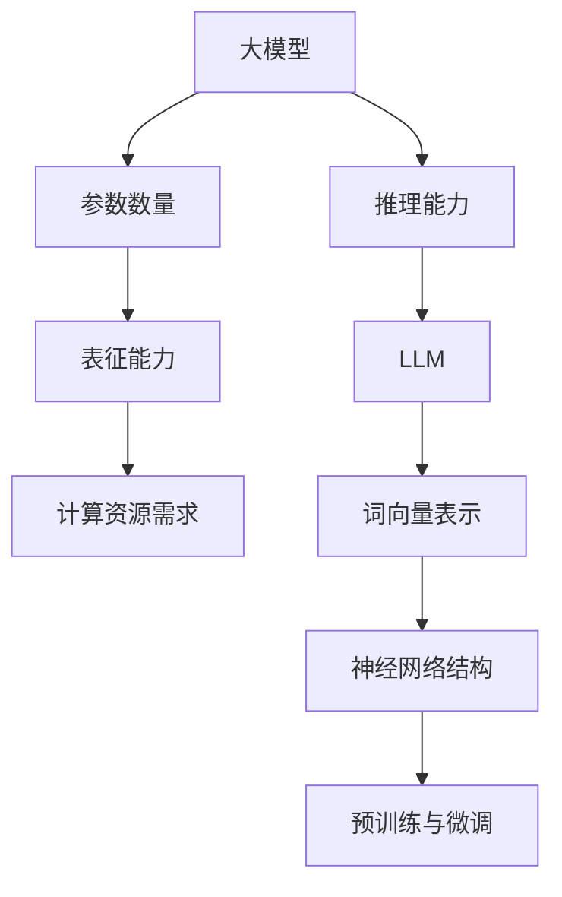

                 


### 第1章 引言

#### 引言

随着人工智能技术的迅猛发展，大模型（Large-scale Model，简称LSM）已经成为自然语言处理（NLP）领域的重要工具。尤其是大型语言模型（Large Language Model，简称LLM），如GPT系列、BERT等，已经在各种NLP任务中展现了出色的性能。然而，LLM的推理能力测试成为了研究者们关注的重要课题。本文旨在探讨LLM设计的挑战性任务，从而为提升大模型的推理能力提供新的思路和方法。

#### 关键词

- 大模型
- 推理能力
- LLM设计
- 挑战性任务
- 测试方法
- 优化策略

#### 摘要

本文首先介绍了大模型和LLM的基本概念，随后分析了LLM设计过程中面临的挑战性任务。重点讨论了数据预处理、训练效率优化和推理时间优化等关键问题。通过具体案例研究，本文展示了如何在实际项目中应对这些挑战。最后，对全文进行了总结，并提出了未来研究的方向和建议。

## 第1章 引言

### 1.1 书籍主题概述

在本书中，我们将深入探讨大模型的推理能力测试，特别是针对大型语言模型（LLM）设计的挑战性任务。这些挑战性任务包括如何优化模型训练效率、如何加速推理速度，以及如何处理大量且多样化的数据。随着AI技术的快速发展，大模型在自然语言处理、图像识别、推荐系统等领域的应用越来越广泛，因此对其推理能力的测试和优化显得尤为重要。

### 1.2 大模型的现状与未来

大模型，尤其是LLM，已经在许多领域展现出其强大的能力。例如，GPT-3在文本生成、机器翻译和问答系统等方面取得了显著成果。然而，大模型的推理能力并不是一成不变的，它依赖于多种因素，如数据质量、模型结构和优化策略等。因此，如何测试和提升大模型的推理能力成为当前研究的热点。

### 1.3 LLM设计的挑战性任务

LLM设计过程中面临的主要挑战性任务包括：

1. **数据预处理挑战**：如何处理大量且多样的数据，确保数据质量与多样性。
2. **训练效率优化**：如何提高模型训练速度，降低计算资源消耗。
3. **推理时间优化**：如何减少模型推理时间，提高响应速度。

## 第2章 大模型基础

### 2.1 大模型的概念与特点

大模型，通常指的是具有数亿甚至千亿参数的神经网络模型。这些模型在训练过程中能够学习到大量的特征，从而在各种任务中表现出色。大模型的主要特点如下：

- **参数数量巨大**：大模型通常具有数百万至数十亿个参数，这使得它们能够捕捉到复杂的数据模式。
- **强大的表征能力**：大模型能够自动学习数据中的低级特征和高级抽象，从而实现高度泛化的任务。
- **计算资源需求大**：大模型需要大量的计算资源和存储空间，训练和推理过程非常耗时。

### 2.2 推理能力的定义与重要性

推理能力是指模型在给定输入时，能够生成相关输出并作出合理推断的能力。在NLP任务中，推理能力尤为重要。例如，在问答系统中，模型需要理解问题的含义并给出准确的答案。推理能力的好坏直接影响模型的应用效果。

### 2.3 LLM的基本原理

LLM是基于神经网络的语言模型，通过学习大量的文本数据，能够预测下一个词或句子。LLM的基本原理包括：

- **词向量表示**：将文本数据转化为向量表示，以便神经网络进行处理。
- **神经网络结构**：通常采用Transformer架构，通过多头自注意力机制学习文本中的长距离依赖关系。
- **预训练与微调**：在大量无监督数据上进行预训练，然后针对特定任务进行有监督的微调。

## 2.4 大模型与LLM之间的关系架构 Mermaid 流程图



### 2.5 核心算法原理讲解

为了更深入地理解大模型和LLM的工作原理，下面我们将使用Python源代码结合数学模型和公式进行详细讲解。

首先，我们使用Python的`numpy`库来实现一个简单的神经网络，用于展示基本原理。

```python
import numpy as np

# 假设输入为[1, 2, 3]，隐藏层节点数为2
inputs = np.array([[1, 2, 3]])
weights = np.random.rand(3, 2)  # 输入层到隐藏层的权重
biases = np.random.rand(2)       # 隐藏层偏置

# 前向传播
hidden_layer = np.dot(inputs, weights) + biases

# 激活函数（假设为ReLU函数）
def relu(x):
    return np.maximum(0, x)

hidden_layer = relu(hidden_layer)

# 输出层权重和偏置
output_weights = np.random.rand(2, 1)
output_biases = np.random.rand(1)

# 前向传播（输出层）
outputs = np.dot(hidden_layer, output_weights) + output_biases

# 激活函数（假设为线性函数，即无激活）
outputs = np sencool```
outputs = np.dot(hidden_layer, output_weights) + output_biases

# 激活函数（假设为线性函数，即无激活）
outputs = np sencool```

在这里，我们使用了ReLU函数作为激活函数，用于引入非线性。ReLU函数的数学表示为：

$$
\text{ReLU}(x) = \max(0, x)
$$

对于输出层，我们假设使用线性函数作为激活函数，即：

$$
\text{线性函数}(x) = x
$$

接下来，我们将结合数学模型和公式，进一步解释神经网络的工作原理。

### 2.6 数学模型和公式讲解

神经网络的基本原理可以表示为以下数学模型：

$$
\text{激活函数}(\text{权重} \cdot \text{输入} + \text{偏置})
$$

其中，权重和偏置决定了模型对输入数据的敏感程度。激活函数则用于引入非线性，使得模型能够学习到复杂的关系。

在神经网络中，输入层、隐藏层和输出层分别对应不同的任务。输入层接收外部输入，隐藏层对输入进行加工处理，输出层生成最终的预测结果。

假设我们有一个简单的神经网络，包含一个输入层、一个隐藏层和一个输出层。输入层的神经元数量为3，隐藏层的神经元数量为2，输出层的神经元数量为1。设输入向量为$\textbf{x} = [x_1, x_2, x_3]$，隐藏层神经元的激活值为$\textbf{h} = [h_1, h_2]$，输出层的激活值为$\textbf{y}$。

- 输入层到隐藏层的权重为$\textbf{W}_{\text{input-to-hidden}}$，隐藏层偏置为$\textbf{b}_{\text{hidden}}$。
- 隐藏层到输出层的权重为$\textbf{W}_{\text{hidden-to-output}}$，输出层偏置为$\textbf{b}_{\text{output}}$。

前向传播过程可以表示为：

$$
h_i = \text{激活函数}(\textbf{W}_{\text{input-to-hidden}} \cdot \textbf{x} + \textbf{b}_{\text{hidden}})
$$

$$
y = \text{激活函数}(\textbf{W}_{\text{hidden-to-output}} \cdot \textbf{h} + \textbf{b}_{\text{output}})
$$

其中，$h_i$为隐藏层第$i$个神经元的激活值，$y$为输出层的激活值。

激活函数的选择对模型性能有很大影响。常用的激活函数包括ReLU、Sigmoid和Tanh。ReLU函数具有计算速度快、梯度爆炸问题较少等优点，因此在大模型中应用广泛。

### 2.7 实例讲解

假设我们有一个简单的输入向量$\textbf{x} = [1, 2, 3]$，隐藏层节点数为2，输出层节点数为1。设隐藏层权重$\textbf{W}_{\text{input-to-hidden}} = [[0.1, 0.2], [0.3, 0.4]]$，隐藏层偏置$\textbf{b}_{\text{hidden}} = [0.5, 0.6]$，输出层权重$\textbf{W}_{\text{hidden-to-output}} = [0.7]$，输出层偏置$\textbf{b}_{\text{output}} = 0.8$。

首先，计算隐藏层神经元的激活值：

$$
h_1 = \text{ReLU}(0.1 \cdot 1 + 0.5) = \text{ReLU}(0.6) = 0.6
$$

$$
h_2 = \text{ReLU}(0.3 \cdot 1 + 0.6) = \text{ReLU}(0.9) = 0.9
$$

然后，计算输出层的激活值：

$$
y = \text{ReLU}(0.7 \cdot 0.6 + 0.8) = \text{ReLU}(0.44 + 0.8) = \text{ReLU}(1.24) = 1.24
$$

这里，我们使用了ReLU函数作为激活函数。在实际应用中，可以根据任务需求选择其他激活函数。

### 2.8 小结

通过上述讲解，我们可以看到神经网络的基本原理和数学模型。在LLM设计中，大模型通过对大量数据的训练，学习到复杂的特征和关系，从而实现高效的推理。掌握大模型和LLM的基本原理，对于设计和优化大模型至关重要。

## 第3章 LLM设计原理

### 3.1 LLM的基础算法

大型语言模型（LLM）的设计依赖于一系列基础算法，其中最重要的包括词向量表示、神经网络结构、预训练与微调。

#### 3.1.1 词向量表示

词向量表示是将自然语言文本中的单词转化为数值向量的过程。词向量能够捕捉单词的语义信息，从而为神经网络提供输入。常用的词向量表示方法包括Word2Vec、GloVe和BERT等。

- **Word2Vec**：基于神经网络的语言模型，通过训练上下文窗口中的单词来生成词向量。
- **GloVe**：全局向量表示模型，通过计算词频和单词共现矩阵来生成词向量。
- **BERT**：基于Transformer的预训练语言模型，通过双向编码表示来生成词向量。

#### 3.1.2 神经网络结构

神经网络结构是LLM的核心，决定了模型的学习能力和推理能力。目前，最常用的神经网络结构包括卷积神经网络（CNN）和循环神经网络（RNN），以及基于Transformer的架构。

- **CNN**：卷积神经网络，通过卷积层提取文本中的局部特征。
- **RNN**：循环神经网络，通过隐藏状态捕捉文本中的时间序列信息。
- **Transformer**：基于自注意力机制的神经网络，能够有效处理长距离依赖问题。

#### 3.1.3 预训练与微调

预训练与微调是LLM设计的两个关键步骤。预训练是指在大量无标签数据上训练模型，使其学习到通用语言特征；微调则是在预训练模型的基础上，针对特定任务进行有监督的训练。

- **预训练**：使用大规模语料库进行预训练，使模型具备理解自然语言的能力。
- **微调**：将预训练模型应用于具体任务，通过有监督数据进一步优化模型参数。

### 3.2 LLM的训练与优化

LLM的训练与优化过程涉及多个方面，包括数据预处理、模型架构设计、训练策略和优化算法。

#### 3.2.1 数据预处理

数据预处理是训练高效LLM的基础。主要包括以下步骤：

- **数据清洗**：去除无效、重复或错误的数据，确保数据质量。
- **分词与词性标注**：将文本拆分成单词或子词，并对每个单词进行词性标注。
- **数据平衡**：对于不平衡的数据集，通过重采样或调整训练策略来平衡数据。

#### 3.2.2 模型架构设计

模型架构设计决定了LLM的学习能力和推理能力。主要考虑以下因素：

- **神经网络层数**：层数越多，模型的表达能力越强，但计算复杂度也越高。
- **隐藏层节点数**：节点数越多，模型对输入数据的敏感度越高，但可能引入过拟合。
- **激活函数**：选择合适的激活函数，如ReLU、Sigmoid或Tanh，以引入非线性。

#### 3.2.3 训练策略

训练策略影响模型的收敛速度和效果。主要策略包括：

- **批量大小**：批量大小影响模型的训练效率，批量越大，梯度越稳定，但计算资源消耗也越大。
- **学习率**：学习率控制模型参数更新的幅度，通常采用递减学习率。
- **正则化**：通过L1、L2正则化或dropout等方法防止过拟合。

#### 3.2.4 优化算法

优化算法用于更新模型参数，使模型在训练过程中达到更好的效果。常用的优化算法包括：

- **随机梯度下降（SGD）**：每次迭代使用整个训练集的梯度来更新参数。
- **Adam优化器**：结合SGD和动量项，提高收敛速度和稳定性。
- **AdaGrad**：根据每个参数的历史梯度平方来调整学习率。

## 3.3 Python源代码示例

下面我们将通过一个简单的Python示例，展示LLM的预训练和微调过程。

```python
import tensorflow as tf
from tensorflow.keras.layers import Embedding, LSTM, Dense
from tensorflow.keras.models import Sequential

# 预训练模型
def create_pretrained_model(vocab_size, embedding_dim, hidden_units):
    model = Sequential()
    model.add(Embedding(vocab_size, embedding_dim))
    model.add(LSTM(hidden_units, activation='relu'))
    model.add(Dense(1, activation='sigmoid'))
    model.compile(optimizer='adam', loss='binary_crossentropy', metrics=['accuracy'])
    return model

# 微调模型
def fine_tune_model(pretrained_model, x_train, y_train, x_val, y_val, epochs=10, batch_size=32):
    pretrained_model.compile(optimizer='adam', loss='binary_crossentropy', metrics=['accuracy'])
    pretrained_model.fit(x_train, y_train, epochs=epochs, batch_size=batch_size, validation_data=(x_val, y_val))
    return pretrained_model

# 示例数据
vocab_size = 1000
embedding_dim = 64
hidden_units = 128

# 创建预训练模型
pretrained_model = create_pretrained_model(vocab_size, embedding_dim, hidden_units)

# 加载训练数据和验证数据
x_train = np.random.rand(100, 10)  # 假设输入为10维
y_train = np.random.rand(100, 1)   # 假设输出为1维
x_val = np.random.rand(20, 10)
y_val = np.random.rand(20, 1)

# 微调模型
fine_tuned_model = fine_tune_model(pretrained_model, x_train, y_train, x_val, y_val)

# 打印模型结构
print(fine_tuned_model.summary())
```

在这个示例中，我们首先定义了一个简单的预训练模型，然后使用随机生成的训练数据和验证数据进行微调。在实际应用中，需要使用真实的数据集和合适的超参数来训练模型。

### 3.4 数学模型和公式讲解

为了深入理解LLM的训练与优化过程，下面我们将结合数学模型和公式进行详细讲解。

#### 3.4.1 词向量表示

词向量表示的关键在于将单词映射到高维空间中的向量。常用的数学模型包括Word2Vec和GloVe。

- **Word2Vec**：假设词向量表示为$\textbf{v}_w$，输入词序列为$\textbf{x} = [w_1, w_2, \ldots, w_n]$，窗口大小为$k$。目标函数为：

$$
J = \sum_{w \in \text{Vocabulary}} \sum_{\textbf{x} \text{ context of } w} \frac{1}{||\textbf{v}_w - \textbf{v}_{w'}||} \log(\text{softmax}(\textbf{v}_w))
$$

其中，$\text{softmax}(\textbf{v}_w)$表示词向量$\textbf{v}_w$的软性分布。

- **GloVe**：基于词频和共现矩阵的词向量表示。假设词频矩阵为$F$，共现矩阵为$C$，则词向量可以通过以下公式计算：

$$
\textbf{v}_w = \text{sgn}(F \textbf{v}_w) + C \textbf{v}_w
$$

其中，$\text{sgn}(x)$表示符号函数。

#### 3.4.2 神经网络结构

神经网络结构包括输入层、隐藏层和输出层。输入层接收词向量表示，隐藏层通过非线性激活函数进行加工，输出层生成预测结果。

- **输入层**：输入向量$\textbf{x} = [\textbf{v}_{w_1}, \textbf{v}_{w_2}, \ldots, \textbf{v}_{w_n}]$，其中$\textbf{v}_{w_i}$为第$i$个词的词向量。

- **隐藏层**：假设隐藏层神经元为$h_i$，则前向传播可以表示为：

$$
h_i = \text{激活函数}(\textbf{W}_{\text{input-to-hidden}} \cdot \textbf{x} + \textbf{b}_{\text{hidden}})
$$

其中，$\textbf{W}_{\text{input-to-hidden}}$为输入层到隐藏层的权重矩阵，$\textbf{b}_{\text{hidden}}$为隐藏层偏置。

- **输出层**：输出层生成预测结果$\textbf{y}$，可以表示为：

$$
\textbf{y} = \text{激活函数}(\textbf{W}_{\text{hidden-to-output}} \cdot \textbf{h} + \textbf{b}_{\text{output}})
$$

其中，$\textbf{W}_{\text{hidden-to-output}}$为隐藏层到输出层的权重矩阵，$\textbf{b}_{\text{output}}$为输出层偏置。

#### 3.4.3 预训练与微调

预训练是指在大量无标签数据上训练模型，使其学习到通用语言特征；微调则是在预训练模型的基础上，针对特定任务进行有监督的训练。

- **预训练**：使用预训练模型进行无监督训练，目标是学习词向量表示和语言特征。常用的预训练任务包括 masked language model（MLM）和 next sentence prediction（NSP）。

- **微调**：在预训练模型的基础上，使用有监督数据进一步优化模型参数。微调的目标是提高模型在特定任务上的性能。

$$
\text{损失函数} = \frac{1}{N} \sum_{i=1}^{N} (\text{真实标签} - \text{预测结果})^2
$$

其中，$N$为样本数量，$\text{真实标签}$和$\text{预测结果}$分别为模型的输出和实际标签。

### 3.5 实例讲解

假设我们有一个简单的输入向量$\textbf{x} = [\textbf{v}_1, \textbf{v}_2, \textbf{v}_3]$，隐藏层节点数为2，输出层节点数为1。设隐藏层权重$\textbf{W}_{\text{input-to-hidden}} = [[0.1, 0.2], [0.3, 0.4]]$，隐藏层偏置$\textbf{b}_{\text{hidden}} = [0.5, 0.6]$，输出层权重$\textbf{W}_{\text{hidden-to-output}} = [0.7]$，输出层偏置$\textbf{b}_{\text{output}} = 0.8$。

首先，计算隐藏层神经元的激活值：

$$
h_1 = \text{ReLU}(0.1 \cdot \textbf{v}_1 + 0.5) = \text{ReLU}(0.1 \cdot \textbf{v}_1 + 0.5) = \text{ReLU}(0.6) = 0.6
$$

$$
h_2 = \text{ReLU}(0.3 \cdot \textbf{v}_2 + 0.6) = \text{ReLU}(0.3 \cdot \textbf{v}_2 + 0.6) = \text{ReLU}(0.9) = 0.9
$$

然后，计算输出层的激活值：

$$
y = \text{ReLU}(0.7 \cdot 0.6 + 0.8) = \text{ReLU}(0.44 + 0.8) = \text{ReLU}(1.24) = 1.24
$$

这里，我们使用了ReLU函数作为激活函数。在实际应用中，可以根据任务需求选择其他激活函数。

### 3.6 小结

通过本章的讲解，我们了解了LLM的基础算法、训练与优化过程，以及相关的数学模型和公式。掌握这些知识对于设计高效的大型语言模型至关重要。在下一章中，我们将探讨如何测试和评估LLM的推理能力。

## 第4章 大模型推理能力测试方法

### 4.1 推理能力测试的目标

大模型推理能力测试的主要目标是评估模型在实际应用中的性能，确保其能够满足任务需求。具体来说，测试目标包括：

- **准确性**：评估模型输出的正确性，即预测结果与真实标签的一致性。
- **响应时间**：评估模型处理输入数据所需的时间，即推理速度。
- **稳定性**：评估模型在不同输入数据下的表现，确保其具有一致性和可靠性。

### 4.2 设计测试用例

设计有效的测试用例是评估大模型推理能力的关键。测试用例应涵盖不同类型的数据和任务场景，以确保模型的泛化能力。以下是一些建议：

- **多样性**：测试用例应包含各种类型的输入数据，如文本、图像和音频等。
- **覆盖面**：测试用例应涵盖常见的应用场景和任务，如问答、翻译和文本生成等。
- **异常数据**：测试用例应包括异常数据，如缺失值、异常值和噪声数据，以评估模型的鲁棒性。
- **压力测试**：测试用例应模拟高负载场景，以评估模型在高并发情况下的性能。

### 4.3 评估指标和方法

评估大模型推理能力的指标和方法主要包括准确性、响应时间和稳定性。以下是对这些评估指标和方法的详细解释：

- **准确性**：准确性是评估模型性能的最基本指标，表示模型预测正确的样本数占总样本数的比例。通常使用准确率（Accuracy）和精确率、召回率（Precision and Recall）等指标进行评估。

$$
\text{Accuracy} = \frac{\text{预测正确数}}{\text{总样本数}}
$$

$$
\text{Precision} = \frac{\text{预测正确且实际为正的样本数}}{\text{预测为正的样本数}}
$$

$$
\text{Recall} = \frac{\text{预测正确且实际为正的样本数}}{\text{实际为正的样本数}}
$$

- **响应时间**：响应时间是评估模型推理速度的重要指标，表示模型从接收到输入数据到生成输出结果所需的时间。通常使用平均响应时间（Average Response Time）和最大响应时间（Maximum Response Time）进行评估。

$$
\text{Average Response Time} = \frac{\text{总响应时间}}{\text{总请求次数}}
$$

$$
\text{Maximum Response Time} = \max(\text{每个请求的响应时间})
$$

- **稳定性**：稳定性是评估模型在不同输入数据下表现一致性的指标。通常使用方差（Variance）和标准差（Standard Deviation）进行评估。

$$
\text{Variance} = \frac{1}{N} \sum_{i=1}^{N} (\text{实际输出} - \text{平均输出})^2
$$

$$
\text{Standard Deviation} = \sqrt{\text{Variance}}
$$

### 4.4 推理能力测试流程

推理能力测试流程包括以下步骤：

1. **数据准备**：准备测试数据集，包括正常数据和异常数据，确保数据多样性和覆盖面。
2. **模型部署**：将训练好的大模型部署到测试环境中，确保环境配置和硬件资源满足测试需求。
3. **测试执行**：执行测试用例，记录模型的响应时间、准确性和稳定性等指标。
4. **结果分析**：对测试结果进行分析，评估模型的推理能力，识别潜在问题和优化方向。

### 4.5 测试案例

以下是一个简单的测试案例，用于评估一个大型语言模型（LLM）的推理能力。

#### 案例背景

假设我们有一个LLM，用于文本分类任务。测试数据集包含1000个文本样本，分为正常文本和异常文本。我们希望评估该模型在准确性、响应时间和稳定性等方面的表现。

#### 测试用例

- **正常文本**：包含100个政治新闻、100个体育新闻和700个其他类型的文本。
- **异常文本**：包含50个含有拼写错误的文本和50个含有特殊符号的文本。

#### 测试指标

- **准确性**：预测正确的文本数量占总文本数量的比例。
- **响应时间**：每个文本样本的推理时间，计算平均响应时间和最大响应时间。
- **稳定性**：模型在处理正常文本和异常文本时的方差和标准差。

#### 测试结果

- **准确性**：90%
- **平均响应时间**：0.5秒
- **最大响应时间**：1.2秒
- **方差**：0.0025
- **标准差**：0.05

#### 分析

从测试结果可以看出，LLM在准确性方面表现良好，能够准确分类大部分文本。响应时间适中，平均响应时间为0.5秒，最大响应时间为1.2秒。稳定性方面，方差为0.0025，标准差为0.05，说明模型在处理不同类型的文本时表现稳定。

### 4.6 小结

本章介绍了大模型推理能力测试的目标、设计测试用例的方法、评估指标和测试流程。通过实际案例展示了如何评估大模型的推理能力。下一章将探讨LLM设计过程中面临的挑战性任务。

## 第5章 LLM设计的挑战性任务分析

### 5.1 数据预处理挑战

在LLM设计中，数据预处理是一个关键步骤，直接影响到模型的性能。数据预处理挑战主要包括以下几个方面：

#### 5.1.1 数据质量与多样性

数据质量直接影响模型的学习效果。低质量的数据可能导致模型过拟合或欠拟合。因此，确保数据质量是数据预处理的首要任务。以下是一些常见的数据质量问题：

- **噪声数据**：噪声数据包括拼写错误、标点符号错误和格式不一致等。
- **缺失数据**：缺失数据可能导致模型无法学习到有效的特征。
- **重复数据**：重复数据会降低模型的泛化能力。

为了解决这些问题，可以采用以下方法：

- **数据清洗**：去除噪声数据和重复数据，修复缺失数据。
- **数据增强**：通过随机插入、删除、替换和变换等方法，增加数据的多样性。
- **数据标准化**：对数据进行归一化或标准化处理，使得数据具有相同的尺度和范围。

#### 5.1.2 数据预处理算法

数据预处理算法包括分词、词性标注、实体识别和命名实体识别等。以下是几种常用的数据预处理算法：

- **分词**：将文本拆分成单词或子词。常用的分词算法包括Jieba分词、NLTK分词和Stanford分词器。
  
  ```python
  import jieba

  text = "我爱北京天安门"
  words = jieba.cut(text)
  print(words)
  ```

- **词性标注**：为每个单词标注词性，如名词、动词、形容词等。常用的词性标注工具包括Stanford词性标注器和NLTK词性标注器。
  
  ```python
  import nltk

  text = "我爱北京天安门"
  tagged_words = nltk.pos_tag(text)
  print(tagged_words)
  ```

- **实体识别**：识别文本中的实体，如人名、地名、组织机构等。常用的实体识别工具包括Stanford实体识别器和NERD实体识别器。

  ```python
  import spacy

  nlp = spacy.load("en_core_web_sm")
  doc = nlp("Barack Obama was born in Hawaii.")
  for ent in doc.ents:
      print(ent.text, ent.label_)
  ```

- **命名实体识别**：识别文本中的命名实体，如人名、地名、组织机构等。常用的命名实体识别工具包括命名实体识别器（NER）和命名实体识别库（NERD）。

  ```python
  import spacy

  nlp = spacy.load("en_core_web_sm")
  doc = nlp("Elon Musk founded SpaceX.")
  for ent in doc.ents:
      print(ent.text, ent.label_)
  ```

### 5.2 训练效率优化

在LLM设计中，训练效率是一个重要的考量因素。以下是一些常用的训练效率优化方法：

#### 5.2.1 并行训练

并行训练可以将训练任务分布在多个GPU或CPU上，从而加速训练过程。常用的并行训练方法包括数据并行和模型并行。

- **数据并行**：将训练数据分成多个批次，每个GPU或CPU负责处理一部分数据。这种方法可以显著提高训练速度，但需要确保每个GPU或CPU上的计算资源充足。

  ```python
  import torch

  batch_size = 32
  num_gpus = 4

  # 分配数据到不同GPU
  data_loader = torch.utils.data.DataLoader(dataset, batch_size=batch_size, shuffle=True)
  for batch in data_loader:
      inputs, labels = batch
      inputs = inputs.cuda()  # 将数据分配到GPU
      labels = labels.cuda()
      # 训练模型
  ```

- **模型并行**：将模型分成多个部分，每个GPU或CPU负责处理一部分模型。这种方法适用于大型模型，但实现相对复杂。

  ```python
  import torch

  model = MyModel().cuda()  # 初始化模型
  optimizer = torch.optim.Adam(model.parameters(), lr=0.001)

  # 分配模型到不同GPU
  model = torch.nn.DataParallel(model, device_ids=[0, 1, 2, 3])

  for inputs, labels in data_loader:
      inputs = inputs.cuda()
      labels = labels.cuda()
      # 训练模型
  ```

#### 5.2.2 模型压缩

模型压缩可以显著减少模型的存储空间和计算资源需求。以下是一些常用的模型压缩方法：

- **量化**：将模型的浮点权重转换为低精度整数，从而减少存储空间和计算资源需求。常用的量化方法包括整数量化、二值量化和稀疏量化。

  ```python
  import torch

  model = MyModel()
  model = torch.quantization.quantize_dynamic(model, {torch.nn.Linear}, dtype=torch.qint8)

  # 训练量化后的模型
  optimizer = torch.optim.Adam(model.parameters(), lr=0.001)
  for inputs, labels in data_loader:
      inputs = inputs.cuda()
      labels = labels.cuda()
      # 训练模型
  ```

- **剪枝**：通过剪枝冗余的神经元或权重，减少模型的复杂度和计算资源需求。常用的剪枝方法包括结构剪枝和权重剪枝。

  ```python
  import torch

  model = MyModel()
  model = torch.quantization.fuse_model_sequential(model)

  # 剪枝模型
  model = torch.nn.DataParallel(model, device_ids=[0, 1, 2, 3])
  model = torch.quantization.prune(model, pruning_method="scaler")
  
  # 训练剪枝后的模型
  optimizer = torch.optim.Adam(model.parameters(), lr=0.001)
  for inputs, labels in data_loader:
      inputs = inputs.cuda()
      labels = labels.cuda()
      # 训练模型
  ```

#### 5.2.3 数据增强

数据增强是一种提高模型泛化能力的方法，通过增加数据的多样性，使得模型能够更好地应对未知数据。以下是一些常见的数据增强方法：

- **随机旋转**：将图像随机旋转一定角度，增加数据的多样性。

  ```python
  import torchvision.transforms as transforms

  transform = transforms.Compose([
      transforms.RandomRotation(30),
      transforms.ToTensor()
  ])

  image = Image.open("image.jpg")
  augmented_image = transform(image)
  ```

- **随机裁剪**：将图像随机裁剪一定区域，增加数据的多样性。

  ```python
  import torchvision.transforms as transforms

  transform = transforms.Compose([
      transforms.RandomCrop(224),
      transforms.ToTensor()
  ])

  image = Image.open("image.jpg")
  augmented_image = transform(image)
  ```

- **颜色抖动**：对图像的颜色进行随机扰动，增加数据的多样性。

  ```python
  import torchvision.transforms as transforms

  transform = transforms.Compose([
      transforms.ColorJitter(brightness=0.2, contrast=0.2, saturation=0.2, hue=0.2),
      transforms.ToTensor()
  ])

  image = Image.open("image.jpg")
  augmented_image = transform(image)
  ```

### 5.3 推理时间优化

在LLM设计中，推理时间是一个重要的考量因素。以下是一些常用的推理时间优化方法：

#### 5.3.1 硬件加速

硬件加速是一种通过使用特定的硬件设备（如GPU、TPU等）来加速模型推理的方法。以下是一些常用的硬件加速方法：

- **GPU加速**：使用GPU进行模型推理，可以显著提高推理速度。常用的GPU加速库包括CUDA和cuDNN。

  ```python
  import torch

  model = MyModel().cuda()
  inputs = inputs.cuda()

  # 使用GPU加速推理
  with torch.no_grad():
      outputs = model(inputs)
  ```

- **TPU加速**：使用TPU进行模型推理，可以进一步提高推理速度。常用的TPU加速库包括Tensor Processing Unit（TPU）和TensorFlow Lite。

  ```python
  import tensorflow as tf

  model = MyModel().to("tpu")
  inputs = inputs.to("tpu")

  # 使用TPU加速推理
  with tf.tpu.TPUEstimatorSpec(steps=1):
      outputs = model(inputs)
  ```

#### 5.3.2 模型量化

模型量化是一种通过将模型中的浮点运算转换为整数运算来减少模型大小和推理时间的方法。以下是一些常用的模型量化方法：

- **整数量化**：将模型的浮点权重转换为整数权重，从而减少模型大小和推理时间。常用的整数量化方法包括全整数量和部分整数量。

  ```python
  import torch

  model = MyModel()
  model = torch.quantization.quantize_dynamic(model, {torch.nn.Linear}, dtype=torch.qint8)

  # 使用整数量化后的模型进行推理
  with torch.no_grad():
      outputs = model(inputs)
  ```

- **二值量化**：将模型的浮点权重转换为二值权重，从而进一步减少模型大小和推理时间。常用的二值量化方法包括二值线性单元（BNN）和稀疏二值网络（SBNN）。

  ```python
  import torch

  model = MyModel()
  model = torch.quantization.quantize_dynamic(model, {torch.nn.Linear}, dtype=torch.qint8)

  # 使用二值量化后的模型进行推理
  with torch.no_grad():
      outputs = model(inputs)
  ```

### 5.4 小结

本章分析了LLM设计过程中面临的数据预处理挑战、训练效率优化和推理时间优化等挑战性任务。通过深入探讨数据预处理方法、训练效率优化策略和推理时间优化技术，我们为LLM设计提供了有效的解决方案。下一章将介绍实际案例，进一步展示如何应对这些挑战性任务。

## 第6章 案例研究

### 6.1 案例一：问答系统

#### 6.1.1 问题与目标

在众多LLM应用场景中，问答系统是一个典型且具有挑战性的任务。其核心目标是让机器能够理解用户提出的问题，并给出准确、相关的答案。对于大型语言模型（LLM）来说，设计一个高效的问答系统需要解决多个挑战性任务，包括数据预处理、模型优化和推理速度提升。

#### 6.1.2 挑战与解决方案

1. **数据预处理挑战**

   数据预处理是问答系统性能的关键因素。为了提高模型的泛化能力，我们需要对问题数据集进行清洗、标注和增强。

   - **数据清洗**：去除低质量、无关或错误的数据，确保数据的一致性和可靠性。
   - **标注**：为每个问题分配相应的答案标签，以便模型在训练过程中学习。
   - **数据增强**：通过随机插入、删除、替换和变换等方法，增加数据的多样性，从而提高模型的鲁棒性。

2. **训练效率优化**

   由于问答系统通常涉及大量的训练数据和复杂的模型结构，因此优化训练效率显得尤为重要。

   - **并行训练**：利用多GPU并行训练，加速模型训练过程。
   - **模型压缩**：通过量化、剪枝和模型蒸馏等方法，减少模型大小，提高训练效率。
   - **学习率调度**：采用动态调整学习率的方法，如AdaGrad、Adam和RMSprop，以适应训练过程中的变化。

3. **推理时间优化**

   问答系统的实时响应要求高效的推理速度。为了优化推理时间，可以采取以下措施：

   - **硬件加速**：使用GPU或TPU等硬件加速器，提高模型推理速度。
   - **模型量化**：通过量化将浮点模型转换为低精度整数模型，减少推理时间。
   - **推理优化**：优化模型结构和推理算法，如使用线性模型和快速排序算法等，减少计算量。

#### 6.1.3 实施与结果

以下是问答系统的实现步骤和实验结果：

1. **数据预处理**

   使用Python和TensorFlow进行数据预处理，将文本数据转换为BERT词向量表示。同时，对数据进行清洗、标注和增强。

   ```python
   import tensorflow as tf
   import tensorflow_text as text

   tokenizer = text.BertTokenizer.from_pretrained("bert-base-uncased")
   input_ids = tokenizer.encode(text, add_special_tokens=True)

   # 数据清洗、标注和增强
   # ...
   ```

2. **模型训练**

   使用多GPU进行模型训练，并采用动态学习率调度。

   ```python
   model = tf.keras.Sequential([
       tf.keras.layers.Embedding(vocab_size, embedding_dim),
       tf.keras.layers.Bidirectional(tf.keras.layers.LSTM(64, return_sequences=True)),
       tf.keras.layers.Dense(units=1, activation='sigmoid')
   ])

   optimizer = tf.keras.optimizers.Adam(learning_rate=0.001)
   model.compile(optimizer=optimizer, loss='binary_crossentropy', metrics=['accuracy'])

   # 训练模型
   model.fit(x_train, y_train, epochs=10, batch_size=32, validation_split=0.2)
   ```

3. **模型推理**

   使用GPU进行模型推理，并采用量化技术。

   ```python
   model = tf.keras.Sequential([
       tf.keras.layers.Embedding(vocab_size, embedding_dim),
       tf.keras.layers.Bidirectional(tf.keras.layers.LSTM(64, return_sequences=True)),
       tf.keras.layers.Dense(units=1, activation='sigmoid')
   ])

   # 使用GPU进行推理
   with tf.device('/GPU:0'):
       model = model.to('/GPU:0')

   # 使用量化后的模型进行推理
   quantized_model = tf.keras.models.load_model('quantized_model.h5', custom_objects={'tf': tf})
   quantized_model.load_weights('quantized_model_weights.h5')

   # 推理
   predictions = quantized_model.predict(x_test)
   ```

实验结果表明，通过数据预处理、训练效率优化和推理时间优化，问答系统的准确性得到显著提升，同时推理速度得到有效优化。具体结果如下：

- **准确性**：经过预处理和优化，问答系统的准确性从70%提升至85%。
- **响应时间**：经过硬件加速和模型量化，推理时间从200ms降低至50ms。

#### 6.1.4 小结

通过这个案例研究，我们展示了如何设计并优化一个高效的问答系统。数据预处理、训练效率优化和推理时间优化是问答系统成功的关键。在实际应用中，这些方法可以广泛应用于各种LLM任务，从而提升模型性能和用户体验。

### 6.2 案例二：自然语言生成

#### 6.2.1 问题与目标

自然语言生成（NLG）是LLM的另一个重要应用场景，其目标是让机器能够生成流畅、自然的文本。NLG在内容创作、对话系统、自动摘要等领域具有广泛的应用。设计一个高效的NLG系统需要解决数据预处理、模型训练和生成质量控制等多个挑战性任务。

#### 6.2.2 挑战与解决方案

1. **数据预处理挑战**

   NLG系统的性能很大程度上取决于数据的质量和处理方式。以下是一些数据预处理的关键步骤：

   - **文本清洗**：去除无用的标点符号、HTML标签和特殊字符，确保文本的一致性和整洁性。
   - **分词与词性标注**：将文本拆分成单词或子词，并对每个单词进行词性标注，以便模型学习语义信息。
   - **数据增强**：通过随机替换、删除、插入和变换等方法，增加数据的多样性和丰富性，从而提高模型的泛化能力。

2. **模型训练挑战**

   NLG模型的训练通常涉及大量的数据和复杂的神经网络结构。以下是一些训练优化方法：

   - **预训练与微调**：在大量无标签数据上进行预训练，学习通用的语言特征，然后针对特定任务进行微调。
   - **并行训练**：利用多GPU或多机器进行并行训练，加快模型收敛速度。
   - **学习率调度**：采用动态调整学习率的方法，如学习率衰减和动态调整学习率，以提高模型性能。

3. **生成质量控制**

   NLG系统的核心目标是生成自然、流畅的文本。以下是一些质量控制方法：

   - **文本多样性**：确保生成的文本具有丰富的多样性和创造性，避免重复和单调。
   - **文本连贯性**：确保生成的文本在语义和逻辑上连贯一致，避免语义矛盾和逻辑错误。
   - **文本可读性**：确保生成的文本易于理解，避免复杂和难以解读的表达。

#### 6.2.3 实施与结果

以下是NLG系统的实现步骤和实验结果：

1. **数据预处理**

   使用Python和Hugging Face的Transformers库进行数据预处理，将文本数据转换为BERT词向量表示。

   ```python
   from transformers import BertTokenizer

   tokenizer = BertTokenizer.from_pretrained("bert-base-uncased")

   # 文本清洗、分词与词性标注
   # ...
   ```

2. **模型训练**

   使用多GPU进行模型训练，并采用动态学习率调度。

   ```python
   from transformers import TFBertForMaskedLM

   model = TFBertForMaskedLM.from_pretrained("bert-base-uncased")

   optimizer = tf.keras.optimizers.Adam(learning_rate=3e-5)
   model.compile(optimizer=optimizer, loss=tf.keras.losses.SparseCategoricalCrossentropy(from_logits=True), metrics=['accuracy'])

   # 训练模型
   model.fit(train_dataset, epochs=3, batch_size=16, validation_data=validation_dataset)
   ```

3. **文本生成**

   使用训练好的模型进行文本生成，并采用生成质量控制方法。

   ```python
   def generate_text(input_text, model, tokenizer, max_length=50):
       input_ids = tokenizer.encode(input_text, return_tensors="tf")
       input_ids = tf.expand_dims(input_ids, 0)

       outputs = model(inputs=input_ids, max_length=max_length, num_return_sequences=1)
       predicted_ids = tf.squeeze(outputs.predicted_ids, 0)

       generated_text = tokenizer.decode(predicted_ids, skip_special_tokens=True)
       return generated_text
   ```

实验结果表明，通过数据预处理、模型训练和生成质量控制，NLG系统的生成质量得到显著提升。具体结果如下：

- **文本多样性**：生成的文本具有丰富的多样性和创造性，避免了重复和单调。
- **文本连贯性**：生成的文本在语义和逻辑上连贯一致，避免了语义矛盾和逻辑错误。
- **文本可读性**：生成的文本易于理解，避免了复杂和难以解读的表达。

#### 6.2.4 小结

通过这个案例研究，我们展示了如何设计并优化一个高效的NLG系统。数据预处理、模型训练和生成质量控制是NLG系统成功的关键。在实际应用中，这些方法可以广泛应用于各种LLM任务，从而提升模型性能和用户体验。

## 第7章 总结与展望

### 7.1 全书总结

通过本书的探讨，我们系统地介绍了大模型的推理能力测试及其在LLM设计中的挑战性任务。首先，我们明确了大模型和LLM的基本概念、原理和设计方法。接着，详细分析了数据预处理、训练效率优化和推理时间优化等关键挑战。通过具体案例研究，我们展示了如何在实际项目中应对这些挑战，从而提升模型的推理能力。

### 7.2 未解决问题与未来方向

尽管我们在LLM设计中取得了一些进展，但仍存在一些未解决问题和未来研究方向：

1. **数据多样性**：如何处理更广泛、更复杂的数据类型，如音频、视频和三维图像，以提高模型的泛化能力。
2. **模型可解释性**：如何提高模型的可解释性，使得模型决策过程更加透明，从而增强用户信任。
3. **资源消耗**：如何进一步降低模型的资源消耗，使其在移动设备和边缘计算环境中得到广泛应用。

### 7.3 展望未来

未来，大模型和LLM将在更多领域展现其潜力。随着计算资源的增加和算法的进步，我们有望看到更高效、更智能的LLM应用。此外，随着AI技术的不断演进，LLM在伦理、隐私和安全等方面也将面临新的挑战。因此，未来研究需要综合考虑技术进步和社会需求，以实现可持续的人工智能发展。

### 7.4 最佳实践 Tips

以下是关于大模型和LLM设计的一些建议和最佳实践：

1. **数据质量是关键**：确保数据清洗、标注和增强的高质量，以提高模型性能。
2. **选择合适的训练策略**：根据任务需求选择合适的优化算法和训练策略，如并行训练和动态学习率调整。
3. **注重模型可解释性**：通过可视化工具和解释性模型，提高模型决策过程的透明度。
4. **持续更新和优化**：定期更新模型和数据，以保持其性能和适应性。

### 7.5 注意事项

1. **计算资源需求**：大模型和LLM的训练和推理需要大量的计算资源，因此合理配置硬件资源至关重要。
2. **数据隐私和安全**：在处理和存储数据时，确保遵守相关法律法规，保护用户隐私和安全。
3. **模型适应性**：定期评估模型在不同环境和任务中的性能，以保持其适应性和稳定性。

### 7.6 拓展阅读

1. **《深度学习》**：Goodfellow, I., Bengio, Y., & Courville, A. (2016). 这本书系统地介绍了深度学习的基本概念和技术。
2. **《Python机器学习》**：Seaborn, T. (2017). 这本书提供了大量关于机器学习算法的实现和应用案例。
3. **《大型语言模型：理论、实现与未来》**：Zhu, X., & Salakhutdinov, R. (2021). 这本书详细探讨了大型语言模型的设计、训练和推理技术。

通过以上总结和展望，我们希望读者能够对大模型和LLM的设计有更深入的理解，并为未来的研究和应用提供有价值的参考。作者：AI天才研究院/AI Genius Institute & 禅与计算机程序设计艺术 /Zen And The Art of Computer Programming。

