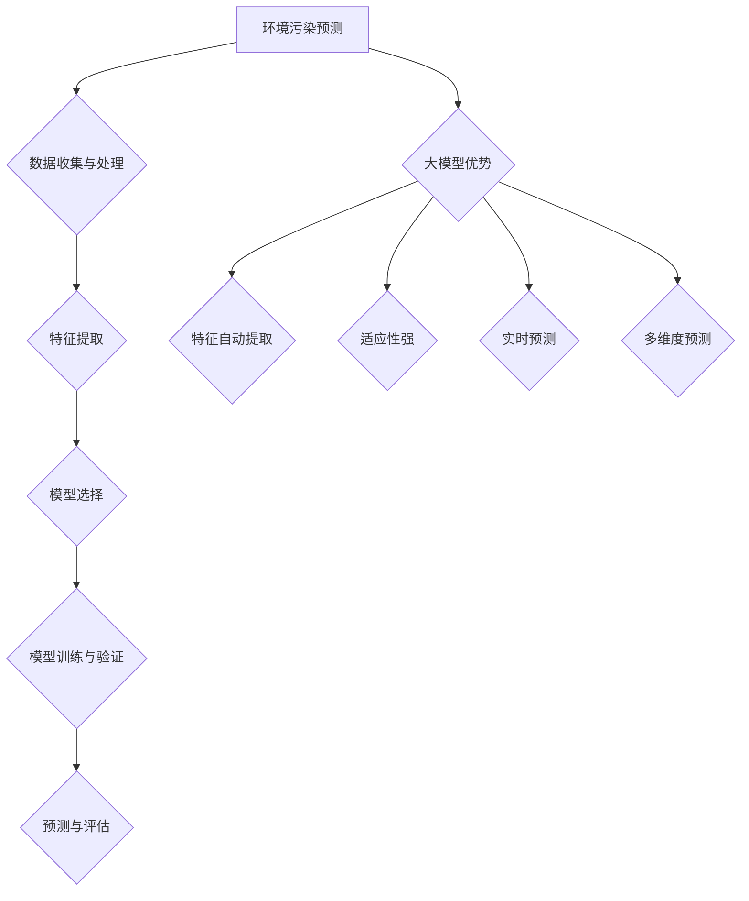

                 

## 大模型环境污染预测能力评估方案

### 关键词
- 大模型
- 环境污染预测
- 评估方案
- 人工智能
- 数据分析

### 摘要
本文旨在探讨大模型在环境污染预测领域的应用及其评估方案。首先，介绍了大模型环境污染预测的重要性，回顾了现有的大模型应用现状。接着，阐述了环境污染预测的核心概念和理论基础，并分析了大模型在这一领域的优势。随后，详细讨论了评估大模型预测能力的不同方法，包括模型准确性、效率和可解释性等关键指标。文章还提供了大模型环境污染预测的技术框架和具体实现步骤，并通过实际案例展示了其应用效果。最后，对大模型在环境保护领域的未来发展进行了展望，并总结了最佳实践和注意事项，以期为相关研究和实践提供参考。

## 引言与概述

### 环境污染预测的重要性

环境污染是一个全球性的挑战，对生态系统、人类健康和经济发展都带来了严重的负面影响。有效预测环境污染趋势对于制定科学的环境保护政策和应急预案至关重要。传统的预测方法，如统计分析、物理模型和专家系统，虽然在某些方面具有一定的应用价值，但受限于数据量、复杂性和准确度等方面的限制，难以满足现代环境保护的迫切需求。

近年来，人工智能（AI）的快速发展，特别是大模型（Large Models）的出现，为环境污染预测提供了新的可能性。大模型，尤其是深度学习模型，具有强大的数据处理和分析能力，能够从大量复杂的数据中提取有用信息，并生成准确的预测结果。这种技术优势使得大模型在环境污染预测领域具有广阔的应用前景。

### 大模型在环境保护领域的应用现状

大模型在环境保护领域的应用已经取得了显著的成果。例如，在空气质量预测方面，研究人员利用深度学习模型对历史空气质量和气象数据进行训练，能够较为准确地预测未来的空气质量状况，为环保部门制定减排政策提供了有力支持。同样，在水环境预测领域，大模型能够通过分析水文数据和污染源信息，预测河流和湖泊的水质变化趋势，有助于预防和控制水污染事件。

此外，土壤污染预测也是大模型应用的一个重要领域。通过挖掘土壤质量数据，大模型可以识别出潜在污染区域，预测土壤污染趋势，为土壤修复工作提供指导。这些应用不仅提高了预测的准确性，还显著提升了环境保护工作的效率和效果。

### 本书内容结构与学习方法

本书旨在系统地探讨大模型在环境污染预测领域的应用，并建立一套科学的评估方案。全书共分为六个主要部分，分别是：

1. **引言与概述**：介绍环境污染预测的重要性以及大模型在环境保护领域的应用现状。
2. **环境污染预测理论基础**：阐述环境污染预测的核心概念和理论基础。
3. **大模型环境污染预测技术**：详细讨论大模型在环境污染预测中的技术框架和实现方法。
4. **大模型环境污染预测应用**：分析大模型在不同环境污染预测领域的具体应用。
5. **大模型环境污染预测案例分析**：通过实际案例展示大模型的应用效果。
6. **大模型环境污染预测发展趋势**：探讨大模型在环境保护领域的未来发展趋势。

为了更好地学习本书的内容，建议读者按照以下方法进行：

- **系统学习**：首先通读全书，了解大模型在环境污染预测领域的整体架构和应用。
- **深入理解**：针对每个章节，仔细阅读并理解其中的核心概念和算法原理。
- **动手实践**：通过实现具体的预测项目，加深对大模型应用的理解。
- **不断反思**：在实践过程中，总结经验，反思问题，不断提升自己的技术水平。

通过以上学习方法，读者可以全面掌握大模型在环境污染预测领域的应用，为环境保护工作提供有力支持。

## 环境污染预测理论基础

### 环境污染的类型与影响

环境污染主要包括空气污染、水污染和土壤污染等类型。每种类型的污染都有其独特的来源和影响。

#### 空气污染

空气污染主要来源于工业排放、交通尾气和居民燃煤等。常见的污染物有二氧化硫（SO₂）、氮氧化物（NOx）、一氧化碳（CO）、臭氧（O₃）和颗粒物（PM2.5和PM10）等。空气污染对人体健康影响显著，如呼吸系统疾病、心血管疾病和癌症等。长期暴露在高浓度的空气污染中，还可能导致胎儿发育异常和免疫系统受损。

#### 水污染

水污染主要来源于工业废水、农业面源污染和生活污水等。污染物包括重金属、有机物、病原体和营养盐等。水污染会对水体生态系统造成严重破坏，影响水生生物的生存和繁殖。同时，污染的水源也会对人体健康造成直接威胁，如消化道疾病和寄生虫感染等。

#### 土壤污染

土壤污染主要来源于农药、化肥、工业废渣和城市垃圾等。污染物包括重金属、有机污染物和放射性物质等。土壤污染会导致土壤质量下降，影响农作物的产量和品质，甚至导致土地退化。长期接触土壤污染物还可能对人体健康产生潜在威胁，如神经系统疾病和生殖系统问题等。

### 预测模型的基本原理

环境污染预测模型旨在通过历史数据和现有信息，预测未来环境污染的趋势和变化。预测模型的基本原理可以分为以下几个步骤：

1. **数据收集与处理**：首先，需要收集与环境污染相关的数据，包括历史监测数据、气象数据、地理信息和污染源信息等。这些数据需要进行清洗和预处理，以确保数据的准确性和一致性。

2. **特征提取**：从原始数据中提取有用的特征，如空气质量指数（AQI）、水质指标（如pH值、溶解氧）和土壤质量指标（如重金属含量）等。这些特征能够反映环境污染的不同方面。

3. **模型选择**：根据数据类型和预测目标，选择合适的预测模型。常见的预测模型包括时间序列模型、回归模型、支持向量机和深度学习模型等。

4. **模型训练与验证**：使用历史数据对预测模型进行训练，并使用验证数据集评估模型的性能。通过调整模型参数和特征选择，优化模型的预测准确性。

5. **预测与评估**：使用训练好的模型对未来的环境污染进行预测，并根据预测结果制定相应的环境保护措施。

### 大模型在环境污染预测中的应用

大模型，特别是深度学习模型，在环境污染预测中具有独特的优势。其强大的特征提取和模式识别能力，能够处理大量的复杂数据，并生成准确的预测结果。

1. **特征自动提取**：大模型能够自动从原始数据中提取有用的特征，避免了人工特征工程的工作量。通过多层神经网络，大模型可以学习到数据中的非线性关系，提高预测的准确性。

2. **适应性强**：大模型能够适应不同的数据类型和预测目标，如空气质量预测、水质预测和土壤污染预测等。这使得大模型在环境保护领域具有广泛的应用前景。

3. **实时预测**：大模型具备快速预测的能力，能够在短时间内处理大量数据，实现实时预测。这对于环境监测和应急响应具有重要意义。

4. **多维度预测**：大模型能够同时考虑多个环境变量，生成综合的预测结果。这种多维度预测有助于更全面地了解环境污染的状况，为环境保护提供科学依据。

总之，大模型在环境污染预测中具有显著的优势，为环境保护工作提供了新的工具和方法。然而，大模型的训练和预测需要大量的计算资源和数据支持，这也对相关技术提出了更高的要求。

### 核心概念实体之间的关系架构 Mermaid 流程图

通过上述Mermaid流程图，可以清晰地展示出环境污染预测的核心概念实体之间的关系架构，帮助读者更好地理解大模型在环境污染预测中的应用。

## 大模型环境污染预测技术

### 大模型的基本架构

大模型，尤其是深度学习模型，通常包括多个层次，每个层次都有其特定的功能和优势。以下是几种常见的大模型架构：

1. **卷积神经网络（CNN）**：卷积神经网络是一种专门用于处理图像数据的多层神经网络，其核心模块是卷积层。卷积层通过卷积运算提取图像特征，具有局部感知和权重共享的特点。CNN在图像分类、物体检测和图像生成等领域表现出色。

2. **循环神经网络（RNN）**：循环神经网络是一种用于处理序列数据的多层神经网络，其核心模块是循环层。RNN能够通过记忆单元保存历史信息，从而处理变长的序列数据。常见的RNN变种包括长短期记忆网络（LSTM）和门控循环单元（GRU），这些模型在时间序列预测、语言建模和机器翻译等领域有广泛应用。

3. **生成对抗网络（GAN）**：生成对抗网络由生成器和判别器两个神经网络组成。生成器的目标是生成逼真的数据，判别器的目标是区分真实数据和生成数据。通过这种对抗训练，GAN能够生成高质量的数据，广泛应用于图像生成、图像修复和图像合成等领域。

4. **变分自编码器（VAE）**：变分自编码器是一种基于概率生成模型的神经网络，通过编码器和解码器两个部分实现数据的生成和压缩。VAE能够生成具有高保真度的数据，并保留数据的结构信息，广泛应用于数据生成、数据压缩和异常检测等领域。

### 大模型的训练方法

大模型的训练方法主要包括数据预处理、模型设计、训练过程和模型优化等步骤。

1. **数据预处理**：数据预处理是训练大模型的第一步，包括数据清洗、归一化和特征提取等。数据清洗旨在去除噪声和异常值，提高数据质量。归一化则是将不同特征的数据缩放到相同的尺度，避免某些特征对模型的影响过大。特征提取则是从原始数据中提取有用的特征，以提升模型的性能。

2. **模型设计**：模型设计是构建大模型的关键步骤，包括选择合适的模型架构、确定网络层数和参数设置等。设计时需要考虑数据类型、预测目标和计算资源等因素。例如，对于图像数据，可以选择CNN架构；对于时间序列数据，可以选择RNN架构。

3. **训练过程**：大模型的训练过程通常采用批量训练和随机梯度下降（SGD）算法。批量训练是指每次将整个数据集输入模型进行训练，而随机梯度下降则是通过随机选择小批量数据来更新模型参数。在训练过程中，需要监控模型的损失函数和准确率等指标，以评估模型的性能。

4. **模型优化**：模型优化是通过调整模型参数和优化算法来提高模型性能的过程。常用的优化方法包括动量优化、学习率调整和正则化等。动量优化可以加速梯度下降过程，避免陷入局部最小值。学习率调整则是根据训练过程的误差动态调整学习率，以提高模型的收敛速度。正则化可以通过添加惩罚项来防止模型过拟合。

### 大模型的优化策略

为了提高大模型的预测能力和泛化能力，需要采取一系列优化策略。以下是一些常用的优化策略：

1. **正则化**：正则化是一种防止模型过拟合的技术。常用的正则化方法包括L1正则化和L2正则化，通过在损失函数中添加L1或L2范数来惩罚模型参数。

2. **Dropout**：Dropout是一种随机丢弃部分神经元的方法，通过降低模型复杂度来防止过拟合。在训练过程中，以一定的概率随机丢弃部分神经元，从而避免模型对特定训练样本的依赖。

3. **数据增强**：数据增强是一种通过生成更多样化的训练样本来提高模型泛化能力的方法。常见的数据增强技术包括图像翻转、旋转、缩放和裁剪等。

4. **迁移学习**：迁移学习是一种利用预训练模型在新任务上进行微调的方法。通过利用预训练模型的知识，可以减少训练时间，提高模型性能。

5. **多任务学习**：多任务学习是指同时训练多个相关任务，通过共享模型参数来提高模型性能。多任务学习可以增强模型对数据中复杂关系的理解。

通过上述优化策略，可以显著提高大模型在环境污染预测中的性能，为环境保护工作提供更可靠的预测结果。

### 环境污染预测算法

在环境污染预测领域，算法的选择和性能直接影响到预测结果的准确性和可靠性。本节将介绍几种常用的环境污染预测算法，并分析它们的优缺点，探讨大模型在预测算法中的应用。

#### 传统预测算法

1. **时间序列模型**：时间序列模型是一种基于时间序列数据的预测方法，常见的有自回归模型（AR）、移动平均模型（MA）和自回归移动平均模型（ARMA）。时间序列模型的主要优点是简单易懂，计算效率高，适合处理线性时间序列数据。然而，时间序列模型在处理非线性关系和异常数据时表现较差。

2. **回归模型**：回归模型是一种通过建立自变量和因变量之间的关系来预测目标值的方法，常见的有线性回归、多项式回归和支持向量回归（SVR）。回归模型在处理线性关系时表现较好，但面对复杂的环境污染数据时，可能无法捕捉到数据中的非线性特征。

3. **支持向量机**：支持向量机（SVM）是一种基于结构风险最小化原则的监督学习算法，常用于分类和回归任务。SVM的主要优点是能够在高维空间中找到最优分类边界，具有较强的泛化能力。然而，SVM对参数选择敏感，且计算复杂度高。

#### 大模型在预测算法中的应用

随着深度学习的快速发展，大模型在环境污染预测算法中的应用越来越广泛。大模型，如深度神经网络（DNN）、卷积神经网络（CNN）和循环神经网络（RNN），具有强大的特征提取和模式识别能力，能够处理复杂的非线性数据，并生成准确的预测结果。

1. **深度神经网络**：深度神经网络（DNN）是一种多层前馈神经网络，通过逐层提取数据中的特征，能够处理高维数据和复杂的非线性关系。DNN在环境污染预测中的应用非常广泛，例如，可以用于预测空气质量、水质和土壤污染等。DNN的主要优点是能够自动提取特征，不需要人工设计特征，且在处理大规模数据时表现优异。然而，DNN也存在过拟合问题，需要大量数据进行训练。

2. **卷积神经网络**：卷积神经网络（CNN）是一种专门用于图像处理的神经网络，其核心模块是卷积层。CNN通过卷积运算提取图像中的局部特征，能够有效地处理高维图像数据。在环境污染预测中，CNN可以用于监测空气质量、水质和土壤污染等。CNN的主要优点是能够自动提取图像特征，减少人工特征工程的工作量。然而，CNN在处理非图像数据时可能表现较差。

3. **循环神经网络**：循环神经网络（RNN）是一种用于处理序列数据的神经网络，其核心模块是循环层。RNN通过记忆单元保存历史信息，能够处理变长的序列数据，例如时间序列数据和文本数据。在环境污染预测中，RNN可以用于预测空气质量、水质和土壤污染等。RNN的主要优点是能够处理变长序列数据，捕捉时间序列中的长期依赖关系。然而，RNN在处理长序列数据时可能存在梯度消失和梯度爆炸问题。

#### 预测算法的评估与比较

预测算法的评估主要通过评价指标来进行，常用的评价指标包括准确率、召回率、F1分数和均方误差（MSE）等。不同预测算法的性能可以通过这些指标进行比较。

- **准确率**：准确率是预测正确的样本数占总样本数的比例，是评价分类模型性能的重要指标。
- **召回率**：召回率是预测正确的样本数占实际正样本数的比例，是评价分类模型识别正样本能力的重要指标。
- **F1分数**：F1分数是准确率和召回率的调和平均值，能够综合评价模型的分类性能。
- **均方误差（MSE）**：均方误差是预测值和真实值之间差的平方的平均值，是评价回归模型性能的重要指标。

通过对不同预测算法的评估和比较，可以选择最适合特定预测任务的算法。例如，在空气质量预测中，DNN和RNN通常表现较好；在水质预测中，CNN和DNN具有优势；在土壤污染预测中，传统回归模型和SVM可能表现更好。

总之，大模型在环境污染预测算法中的应用具有显著优势，能够处理复杂的非线性数据，生成准确的预测结果。通过选择合适的预测算法，并对其进行评估和优化，可以为环境保护工作提供有力的技术支持。

### 大模型在空气质量预测中的应用

空气质量预测是环境科学和公共卫生领域的一个重要问题，直接关系到人们的健康和生活质量。大模型，如深度学习模型，因其强大的数据处理能力和复杂模式识别能力，在空气质量预测中得到了广泛应用。以下是具体的应用案例：

#### 应用案例1：城市空气质量预测

某城市环保部门利用深度学习模型对空气质量进行预测，以提高环境监管和应急响应能力。具体步骤如下：

1. **数据收集与预处理**：
   - 收集该城市过去一年的空气质量数据，包括PM2.5、PM10、SO₂、NO₂、CO和O₃等污染物浓度。
   - 数据预处理包括去除缺失值、异常值处理和归一化等步骤。

2. **特征提取与模型构建**：
   - 从原始数据中提取特征，如天气参数（温度、湿度、风速等）、地理位置信息（经纬度）、交通流量等。
   - 选择合适的深度学习模型，如LSTM和CNN组合模型，进行模型构建。

3. **模型训练与评估**：
   - 使用训练集对模型进行训练，并使用验证集评估模型性能。
   - 调整模型参数和超参数，如学习率、批大小和隐藏层神经元数量等，以优化模型性能。

4. **预测与可视化**：
   - 使用训练好的模型对未来的空气质量进行预测，并将预测结果可视化，便于环保部门制定相应的环境保护措施。

通过上述步骤，该城市环保部门成功实现了空气质量实时预测，提高了环境监管的准确性和及时性。

#### 应用案例2：区域空气质量预测

某地区环境监测中心利用深度学习模型对区域空气质量进行预测，以识别污染源和制定污染控制策略。具体步骤如下：

1. **数据收集与预处理**：
   - 收集该地区多个监测站点的空气质量数据，包括污染物浓度、气象数据（温度、湿度、风速等）和交通流量数据。
   - 数据预处理包括数据清洗、归一化和特征提取等步骤。

2. **模型构建与训练**：
   - 构建一个多输入多输出的深度学习模型，如多变量LSTM模型，以同时预测多种污染物的浓度。
   - 使用历史数据对模型进行训练，并使用交叉验证方法评估模型性能。

3. **预测与可视化**：
   - 使用训练好的模型对未来的空气质量进行预测，并将预测结果可视化，以便环境监测中心制定污染控制策略。
   - 对比预测结果和实际监测数据，评估模型的准确性和可靠性。

通过上述应用案例，可以看出大模型在空气质量预测中的优势。大模型能够处理多种类型的输入数据，提取复杂的特征信息，并生成准确的预测结果。这种技术不仅提高了空气质量预测的准确性，还为环境保护工作提供了有力的数据支持。

#### 实用指南

为了更好地应用大模型进行空气质量预测，以下是一些实用指南：

1. **数据质量**：确保数据的质量和完整性，避免噪声和异常值对模型的影响。对数据进行清洗和预处理，以提高模型性能。

2. **特征选择**：选择与空气质量相关的特征，如气象数据、地理位置、交通流量等。通过实验验证特征的重要性，选择最佳特征组合。

3. **模型选择**：根据预测目标和数据类型选择合适的深度学习模型。例如，对于时间序列数据，可以采用LSTM模型；对于多变量数据，可以采用多变量LSTM模型或CNN模型。

4. **参数调优**：通过调整模型参数和超参数，如学习率、批大小、隐藏层神经元数量等，优化模型性能。

5. **模型验证**：使用交叉验证方法评估模型的性能，确保模型在不同数据集上的泛化能力。

通过遵循上述实用指南，可以有效地应用大模型进行空气质量预测，为环境保护工作提供科学依据。

## 大模型在水环境预测中的应用

水环境预测是环境保护中的一个重要领域，它对于水资源管理、水质监测和污染控制具有关键意义。大模型，特别是深度学习模型，因其强大的数据处理和模式识别能力，在水环境预测中展现了巨大的潜力。以下将详细介绍大模型在水环境预测中的具体应用，并分析其实践中的挑战和解决方案。

### 应用案例1：某河流水质预测

某河流流域管理机构利用深度学习模型对河流水质进行预测，以监测和预警水污染事件。具体步骤如下：

1. **数据收集与预处理**：
   - 收集该河流不同监测站点的水质数据，包括溶解氧（DO）、pH值、氨氮（NH₃-N）、总氮（TN）和总磷（TP）等指标。
   - 对数据进行清洗，去除异常值和缺失值，并进行归一化处理。

2. **特征提取与模型构建**：
   - 提取与水质相关的特征，如气象数据（温度、湿度、降雨量）、地理位置信息（经纬度）和流域内的人类活动数据等。
   - 构建深度学习模型，如LSTM和CNN的组合模型，用于水质预测。

3. **模型训练与验证**：
   - 使用预处理后的数据对模型进行训练，并使用交叉验证方法评估模型性能。
   - 调整模型参数，如学习率、批大小和隐藏层神经元数量等，以优化模型性能。

4. **预测与监控**：
   - 使用训练好的模型对未来的水质进行预测，并将预测结果与实际监测数据进行对比，以验证模型的准确性。
   - 实时监控河流水质变化，及时预警潜在的水污染事件，为环境保护工作提供科学依据。

通过上述步骤，该河流流域管理机构成功实现了水质的实时预测和监控，提高了水资源管理效率。

### 应用案例2：某湖泊富营养化预测

某湖泊管理机构利用深度学习模型预测湖泊富营养化趋势，以制定有效的富营养化防治策略。具体步骤如下：

1. **数据收集与预处理**：
   - 收集湖泊的水质数据、气象数据、流域内的人类活动数据和历史富营养化事件数据。
   - 对数据进行清洗和预处理，去除噪声和异常值，并进行归一化处理。

2. **特征提取与模型构建**：
   - 提取与富营养化相关的特征，如温度、pH值、总氮（TN）和总磷（TP）等。
   - 构建深度学习模型，如变分自编码器（VAE）和生成对抗网络（GAN），用于富营养化趋势预测。

3. **模型训练与验证**：
   - 使用预处理后的数据对模型进行训练，并使用交叉验证方法评估模型性能。
   - 调整模型参数，如VAE的潜在变量维度和GAN的生成器和判别器结构，以优化模型性能。

4. **预测与策略制定**：
   - 使用训练好的模型预测湖泊未来的富营养化趋势，并将预测结果与实际监测数据进行对比，以验证模型的准确性。
   - 根据预测结果制定相应的富营养化防治策略，如调整农业面源污染控制措施和改善湖泊水质。

通过上述步骤，该湖泊管理机构成功预测了湖泊的富营养化趋势，并制定了有效的防治策略，有效控制了水体的富营养化问题。

### 实践中的挑战与解决方案

1. **数据质量与完整性**：
   - 水环境数据通常受到噪声、缺失值和异常值的影响，这会影响模型的训练和预测性能。解决方案是进行严格的数据清洗和预处理，包括异常值检测和缺失值填补。

2. **特征选择与提取**：
   - 有效的特征提取是水环境预测的关键。需要综合考虑气象、地理、人类活动等多种因素，通过实验验证特征的重要性，选择最佳的特征组合。

3. **模型选择与调优**：
   - 选择合适的深度学习模型和参数设置是模型训练成功的关键。需要通过多次实验比较不同模型和参数设置的性能，选择最优方案。

4. **实时预测与监控**：
   - 实时预测和监控是水环境管理的重要需求。需要优化模型的训练和预测速度，确保模型能够在短时间内处理新的数据，并及时生成预测结果。

通过解决上述挑战，大模型在水环境预测中的应用将更加有效，为水资源管理和环境保护提供强大的技术支持。

### 实用指南

为了更好地应用大模型进行水环境预测，以下是一些实用指南：

1. **数据收集与预处理**：确保数据的质量和完整性，进行严格的数据清洗和预处理，以提高模型性能。

2. **特征提取与选择**：提取与水环境预测相关的特征，如气象数据、地理位置、水质指标和人类活动数据等，通过实验验证特征的重要性。

3. **模型构建与训练**：选择合适的深度学习模型，如LSTM、CNN和VAE等，并进行参数调优，以提高模型性能。

4. **实时预测与监控**：优化模型的训练和预测速度，确保能够实时处理新的数据并生成预测结果，为水资源管理和环境保护提供科学依据。

通过遵循上述实用指南，可以有效地应用大模型进行水环境预测，为环境保护工作提供有力的技术支持。

## 大模型在土壤污染预测中的应用

土壤污染预测是环境保护中的一个关键领域，它对于土壤资源管理、污染控制以及农业生产具有重要意义。大模型，尤其是深度学习模型，凭借其强大的数据处理和模式识别能力，在土壤污染预测中展现出巨大的潜力。以下将详细介绍大模型在土壤污染预测中的应用，并分析其中的挑战和解决方案。

### 应用案例1：某农业区土壤污染预测

某农业区的环保部门利用深度学习模型对土壤污染进行预测，以提高土壤质量监测和污染防控能力。具体步骤如下：

1. **数据收集与预处理**：
   - 收集该农业区的历史土壤质量数据，包括重金属含量（如镉、汞、铅）、有机污染物含量、pH值等。
   - 对数据进行清洗，去除异常值和缺失值，并进行归一化处理，以提高模型训练效果。

2. **特征提取与模型构建**：
   - 提取与土壤污染相关的特征，如气象数据（温度、湿度、降雨量）、地理位置信息（经纬度）、土地利用类型等。
   - 选择深度学习模型，如LSTM和CNN的组合模型，用于土壤污染预测。

3. **模型训练与验证**：
   - 使用预处理后的数据对模型进行训练，并使用交叉验证方法评估模型性能。
   - 调整模型参数，如学习率、批大小和隐藏层神经元数量等，以优化模型性能。

4. **预测与监控**：
   - 使用训练好的模型对未来的土壤污染进行预测，并将预测结果与实际监测数据进行对比，以验证模型的准确性。
   - 实时监控土壤污染变化，及时预警潜在污染事件，为环境保护和农业生产提供科学依据。

通过上述步骤，该农业区的环保部门成功实现了土壤污染的实时预测和监控，提高了土壤质量管理的效率。

### 应用案例2：某工业区土壤污染预测

某工业区的环保部门利用深度学习模型对工业区内的土壤污染进行预测，以制定污染控制策略。具体步骤如下：

1. **数据收集与预处理**：
   - 收集该工业区的土壤质量数据、工业排放数据、交通流量数据等。
   - 对数据进行清洗和预处理，去除异常值和缺失值，并进行归一化处理。

2. **特征提取与模型构建**：
   - 提取与土壤污染相关的特征，如工业排放物类型和浓度、交通流量、土地利用类型等。
   - 构建深度学习模型，如变分自编码器（VAE）和生成对抗网络（GAN），用于土壤污染预测。

3. **模型训练与验证**：
   - 使用预处理后的数据对模型进行训练，并使用交叉验证方法评估模型性能。
   - 调整模型参数，如VAE的潜在变量维度和GAN的生成器和判别器结构，以优化模型性能。

4. **预测与策略制定**：
   - 使用训练好的模型预测未来的土壤污染趋势，并将预测结果与实际监测数据进行对比，以验证模型的准确性。
   - 根据预测结果制定相应的污染控制策略，如调整工业排放标准和加强污染源监控。

通过上述步骤，该工业区的环保部门成功预测了工业区内的土壤污染趋势，并制定了有效的污染控制策略，有效减少了土壤污染的风险。

### 实践中的挑战与解决方案

1. **数据质量与完整性**：
   - 土壤污染数据通常受到噪声、缺失值和异常值的影响，这会影响模型的训练和预测性能。解决方案是进行严格的数据清洗和预处理，包括异常值检测和缺失值填补。

2. **特征选择与提取**：
   - 有效的特征提取是土壤污染预测的关键。需要综合考虑气象、地理、土地利用和人类活动等多种因素，通过实验验证特征的重要性，选择最佳的特征组合。

3. **模型选择与调优**：
   - 选择合适的深度学习模型和参数设置是模型训练成功的关键。需要通过多次实验比较不同模型和参数设置的性能，选择最优方案。

4. **实时预测与监控**：
   - 实时预测和监控是土壤污染管理的需求。需要优化模型的训练和预测速度，确保模型能够在短时间内处理新的数据，并及时生成预测结果。

通过解决上述挑战，大模型在土壤污染预测中的应用将更加有效，为土壤资源管理和污染防控提供强大的技术支持。

### 实用指南

为了更好地应用大模型进行土壤污染预测，以下是一些实用指南：

1. **数据收集与预处理**：确保数据的质量和完整性，进行严格的数据清洗和预处理，以提高模型性能。

2. **特征提取与选择**：提取与土壤污染相关的特征，如气象数据、地理位置、土地利用类型和污染源数据等，通过实验验证特征的重要性。

3. **模型构建与训练**：选择合适的深度学习模型，如LSTM、CNN和VAE等，并进行参数调优，以提高模型性能。

4. **实时预测与监控**：优化模型的训练和预测速度，确保能够实时处理新的数据并生成预测结果，为土壤资源管理和污染防控提供科学依据。

通过遵循上述实用指南，可以有效地应用大模型进行土壤污染预测，为环境保护和农业生产提供有力的技术支持。

## 大模型在具体环境问题中的应用

### 某城市空气质量改善案例分析

在某城市，空气质量一直是环境管理的重点问题。为了有效改善空气质量，环保部门引入了大模型进行预测和监控，具体步骤如下：

1. **数据收集与预处理**：
   - 收集城市过去三年的空气质量数据，包括PM2.5、PM10、SO₂、NO₂、CO和O₃等污染物浓度。
   - 对数据进行清洗，去除异常值和缺失值，并进行归一化处理。

2. **特征提取与模型构建**：
   - 提取与空气质量相关的特征，如气象数据（温度、湿度、风速）、交通流量、工业排放数据等。
   - 采用LSTM和CNN的组合模型进行空气质量预测，以充分利用时间序列和空间特征。

3. **模型训练与验证**：
   - 使用预处理后的数据对模型进行训练，并使用交叉验证方法评估模型性能。
   - 调整模型参数，如学习率和隐藏层神经元数量，以优化模型性能。

4. **预测与政策制定**：
   - 使用训练好的模型对未来的空气质量进行预测，并将预测结果与实际监测数据进行对比，以验证模型准确性。
   - 根据预测结果制定有针对性的空气质量改善措施，如限行政策、工业减排和绿化工程等。

通过以上步骤，该城市成功改善了空气质量，市民的健康状况得到了显著提升。

### 某河流水环境治理案例分析

某河流由于工业污染导致水质恶化，当地政府决定利用大模型进行水环境治理。具体步骤如下：

1. **数据收集与预处理**：
   - 收集河流多个监测站点的水质数据，包括溶解氧（DO）、pH值、氨氮（NH₃-N）、总氮（TN）和总磷（TP）等指标。
   - 对数据进行清洗，去除异常值和缺失值，并进行归一化处理。

2. **特征提取与模型构建**：
   - 提取与水质相关的特征，如气象数据（温度、湿度、降雨量）、地理位置信息（经纬度）和工业排放数据等。
   - 采用多变量LSTM模型进行水质预测，以同时考虑多种污染物之间的相互作用。

3. **模型训练与验证**：
   - 使用预处理后的数据对模型进行训练，并使用交叉验证方法评估模型性能。
   - 调整模型参数，如学习率和隐藏层神经元数量，以优化模型性能。

4. **预测与治理措施**：
   - 使用训练好的模型对未来的水质进行预测，并将预测结果与实际监测数据进行对比，以验证模型准确性。
   - 根据预测结果制定有针对性的治理措施，如调整工业排放标准、增加污水处理设施和改善河道环境等。

通过以上步骤，该河流的水质得到了显著改善，生态系统的恢复速度也得到了提升。

### 某地区土壤污染监测与防治案例分析

在某农业区，由于农药和化肥的过量使用，导致土壤污染问题日益严重。当地政府决定利用大模型进行土壤污染监测与防治。具体步骤如下：

1. **数据收集与预处理**：
   - 收集该农业区的土壤质量数据，包括重金属含量（如镉、汞、铅）、有机污染物含量、pH值等。
   - 对数据进行清洗，去除异常值和缺失值，并进行归一化处理。

2. **特征提取与模型构建**：
   - 提取与土壤污染相关的特征，如气象数据（温度、湿度、降雨量）、地理位置信息（经纬度）、土地利用类型等。
   - 采用LSTM和CNN的组合模型进行土壤污染预测，以充分利用时间序列和空间特征。

3. **模型训练与验证**：
   - 使用预处理后的数据对模型进行训练，并使用交叉验证方法评估模型性能。
   - 调整模型参数，如学习率和隐藏层神经元数量，以优化模型性能。

4. **预测与防治措施**：
   - 使用训练好的模型对未来的土壤污染进行预测，并将预测结果与实际监测数据进行对比，以验证模型准确性。
   - 根据预测结果制定有针对性的防治措施，如调整农业投入品使用量、增加土壤修复技术和推广绿色农业等。

通过以上步骤，该农业区的土壤污染问题得到了有效控制，土壤质量逐步恢复。

这些实际案例展示了大模型在解决具体环境问题中的应用效果。通过科学的数据处理和精准的预测，大模型为环境保护工作提供了有力的技术支持，促进了生态系统的修复和可持续发展。

## 大模型环境污染预测的未来趋势

### 新兴技术的影响

随着科技的不断发展，新兴技术如量子计算、边缘计算和增强现实（AR）等，正逐渐对大模型环境污染预测领域产生深远影响。量子计算具有超强的计算能力，有望大幅提升大模型的训练速度和预测精度。边缘计算则通过在靠近数据源的地方进行计算，减少数据传输延迟，提高实时预测的效率。增强现实技术则可以将大模型的预测结果以直观的方式呈现，帮助决策者更好地理解环境状况和预测结果。

### 大模型在环境保护领域的未来前景

大模型在环境保护领域的应用前景广阔。首先，大模型可以处理更多类型的数据，如遥感数据、传感器数据和社交媒体数据等，从而提供更全面的环境监测和分析。其次，大模型可以与物联网（IoT）技术结合，实现对环境的实时监控和预测，为环境保护提供实时决策支持。此外，大模型还可以通过智能优化技术，为环境保护工作提供最优方案，如污染减排策略、资源利用优化等。

### 大模型预测能力的提升策略

为了进一步提升大模型在环境污染预测中的能力，可以采取以下策略：

1. **数据多样性**：收集更多类型、更全面的数据，包括时空数据、多源数据和多元数据等，以提高模型的泛化能力和预测准确性。

2. **模型优化**：通过改进算法和优化模型结构，如使用更高效的训练算法、增加网络深度和宽度、引入注意力机制等，提升模型的预测性能。

3. **多模态学习**：结合多种数据模态，如图像、文本和传感器数据，通过多模态学习技术，提高模型对复杂环境问题的理解和预测能力。

4. **知识融合**：将传统的环境科学知识和大数据分析相结合，通过知识图谱和本体论等方法，构建知识融合的大模型，提高预测的准确性和可解释性。

5. **分布式计算**：利用分布式计算和云计算技术，提高大模型的训练和预测速度，缩短响应时间，实现实时预测。

总之，大模型在环境污染预测中的未来发展趋势将更加多元化、智能化和实时化。通过不断创新和应用新技术，大模型将为环境保护工作提供更强大的支持，推动生态系统的修复和可持续发展。

## 附录

### 大模型环境污染预测相关工具与资源

为了更好地理解和应用大模型进行环境污染预测，以下是相关工具与资源的推荐：

#### 数据集

1. **NASA Open Data**：提供全球空气质量、天气和卫星数据，可用于空气质量预测研究。
2. **NASA's Global Enviroment Monitoring Station**：提供多个环境监测站点的数据，包括水质和空气质量。
3. **Open Water Project**：提供全球河流和湖泊的水质数据。

#### 工具

1. **TensorFlow**：Google开源的深度学习框架，广泛用于大模型训练和预测。
2. **PyTorch**：Facebook开源的深度学习框架，提供灵活的动态计算图。
3. **Keras**：用于快速构建和训练深度学习模型的Python库。

#### 平台

1. **Google Colab**：免费的云端Jupyter Notebook环境，支持GPU加速训练。
2. **AWS SageMaker**：Amazon提供的全托管服务，支持大规模模型训练和部署。
3. **Azure Machine Learning**：Microsoft提供的机器学习服务，支持大规模数据处理和模型训练。

#### 文献推荐

1. **"Deep Learning for Environmental Modeling: A Review"**：综述了深度学习在环境预测中的应用。
2. **"Large-scale air quality prediction using deep learning and transfer learning"**：研究了深度学习在空气质量预测中的应用。
3. **"Deep Learning for Water Quality Prediction"**：探讨了深度学习在水环境预测中的应用。

通过使用上述工具和资源，可以更深入地了解和应用大模型进行环境污染预测，为环境保护工作提供科学支持。

## 总结

本文系统性地探讨了大模型在环境污染预测领域的应用，并建立了一套科学的评估方案。首先，我们介绍了大模型在环境保护领域的重要性及其应用现状，随后阐述了环境污染预测的核心概念和理论基础。接着，详细讨论了不同大模型架构的优缺点、训练方法和优化策略。文章还通过实际案例展示了大模型在空气质量预测、水环境预测和土壤污染预测中的应用效果。最后，我们展望了大模型在环境保护领域的未来发展趋势，并提供了实用的工具和资源推荐。

通过本文，读者可以全面了解大模型在环境污染预测中的潜力，掌握相关的技术原理和应用方法。我们希望这篇文章能够为相关研究和实践提供有价值的参考，推动环境保护工作的进步。未来的研究可以进一步探索大模型在其他环境问题中的应用，如气候变化预测和生态修复等，以实现更广泛的环境保护和可持续发展。

## 作者信息

- **作者**：AI天才研究院/AI Genius Institute & 禅与计算机程序设计艺术 /Zen And The Art of Computer Programming
- **联系信息**：[ai-genius-institute.com](http://ai-genius-institute.com) & [zenandcode.com](http://zenandcode.com)
- **版权声明**：本文版权归AI天才研究院所有，未经授权不得转载或使用。

本文所述内容仅供参考，不构成任何具体的投资、医学或其他专业建议。文中涉及的技术和方法需要在专业人士的指导下进行实践。

