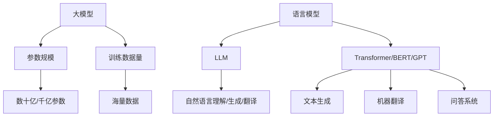
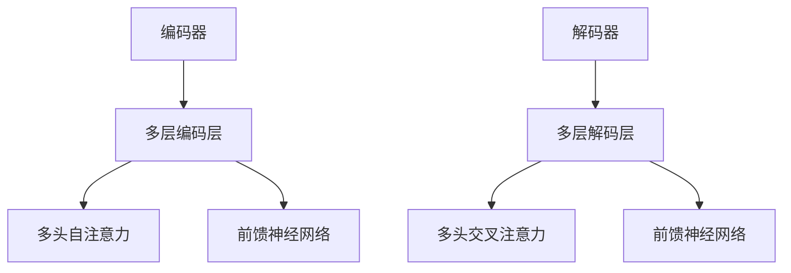

                 

### 大模型知识边界探索：LLM设计的极限测试

关键词：大模型，知识边界，LLM，设计，极限测试

摘要：本文将探讨大模型（特别是大型语言模型，LLM）的知识边界及其设计测试的极限。通过深入分析LLM的核心概念、算法原理、数学模型和项目实战，我们将揭示LLM设计的复杂性和挑战，并探讨如何通过极限测试来优化和提升LLM的性能。

----------------------------------------------------------------

### 引言

随着深度学习技术的不断发展，大模型（也称为巨型模型）已经在自然语言处理、计算机视觉、语音识别等多个领域取得了显著成果。这些大模型通常具有数百万甚至数十亿个参数，能够在海量数据上训练，从而实现高度复杂的任务。然而，随着模型规模的扩大，我们不仅面临着计算资源、存储空间和能耗等实际挑战，还面临着模型理解和设计的深层次问题。

特别是大型语言模型（LLM），如OpenAI的GPT系列模型，BERT等，已经展示了在文本生成、翻译、问答等任务上的卓越性能。然而，这些模型的潜在知识边界和设计优化问题仍然是一个未被充分探索的领域。本文将重点关注LLM的设计及其知识边界的极限测试，以期为LLM的研究和实践提供有价值的参考。

本文结构如下：

1. **背景介绍**：介绍大模型和LLM的基本概念，以及它们在自然语言处理领域的重要性。
2. **核心概念与联系**：详细解释大模型和LLM的核心概念，并使用Mermaid图展示它们之间的关系和架构。
3. **核心算法原理讲解**：深入探讨LLM的基本算法原理，包括Transformer结构、注意力机制等，并使用Python源代码和LaTeX数学公式进行详细阐述。
4. **数学模型和公式推导**：讲解LLM相关的数学模型，包括损失函数、优化算法等，并使用LaTeX格式编写和解释。
5. **项目实战**：提供实际案例，包括开发环境搭建、源代码实现和解读，以及实际案例分析和详细讲解。
6. **极限测试策略**：讨论如何通过极限测试来评估和优化LLM的性能。
7. **未来展望**：探讨LLM研究的未来方向和潜在挑战。

通过以上内容的逐步分析，我们将对LLM的设计和知识边界有更深入的理解，并能够为未来的研究和应用提供有价值的参考。

### 背景介绍

#### 大模型的基本概念

大模型（Large Model），通常指的是具有数十亿甚至千亿级参数的深度学习模型。这些模型通常通过海量数据训练，能够捕捉到复杂的数据特征和模式，从而在各类任务中表现出色。大模型的发展可以追溯到深度学习的兴起，特别是在2012年，AlexNet在ImageNet图像分类挑战中取得了突破性成果，这标志着深度学习进入了一个新的时代。此后，随着计算资源的增加和数据量的激增，大模型在自然语言处理、计算机视觉、语音识别等领域得到了广泛应用。

在自然语言处理（NLP）领域，大模型的重要性尤为显著。自然语言是一种高度复杂、多样化的语言形式，传统的方法往往难以捕捉到语言中的深层结构和语义信息。大模型，尤其是大型语言模型（LLM），通过学习海量文本数据，能够捕捉到语言的复杂模式，从而在文本生成、翻译、问答等任务中表现出色。例如，OpenAI的GPT系列模型、Google的BERT模型等，都是大模型在NLP领域的典型代表。

#### 大模型的发展历程

大模型的发展历程可以分为几个关键阶段：

1. **初级阶段**：这一阶段主要是基于传统机器学习方法，如支持向量机（SVM）、朴素贝叶斯等。虽然这些方法在特定任务上取得了不错的效果，但面对复杂任务时往往力不从心。

2. **深度学习阶段**：随着深度学习技术的兴起，神经网络在图像识别、语音识别等任务中表现出了强大的能力。特别是在2012年，AlexNet在ImageNet图像分类挑战中取得了显著成果，这标志着深度学习进入了大众视野。

3. **大模型阶段**：随着数据量的增加和计算资源的提升，深度学习模型逐渐向大模型发展。特别是2018年，Google的BERT模型在NLP任务中取得了突破性成果，这标志着大模型在NLP领域的崛起。此后，OpenAI的GPT系列模型、Facebook的Large-scale Language Model等，都在大模型的探索中取得了重要进展。

#### 大模型的关键特性

大模型具有以下几个关键特性：

1. **参数规模巨大**：大模型的参数规模通常达到数十亿甚至千亿级别，这使得它们能够捕捉到数据中的复杂模式和特征。

2. **训练数据量庞大**：大模型通常需要在海量数据上进行训练，以确保模型能够全面掌握数据中的特征和模式。

3. **模型结构复杂**：大模型的模型结构通常非常复杂，包括多层神经网络、注意力机制等，这有助于模型捕捉到数据中的深层结构和语义信息。

4. **计算资源需求高**：由于参数规模和模型结构的复杂性，大模型的训练和推理通常需要大量的计算资源，包括高性能计算硬件和大规模数据中心。

5. **应用广泛**：大模型在自然语言处理、计算机视觉、语音识别等领域都取得了显著成果，从而推动了这些领域的发展。

#### 大模型在不同领域的应用

大模型在多个领域都取得了重要应用：

1. **自然语言处理（NLP）**：大模型在文本生成、翻译、问答等任务中表现出色。例如，OpenAI的GPT系列模型在文本生成任务中表现出色，Google的BERT模型在文本分类和问答任务中取得了显著成果。

2. **计算机视觉（CV）**：大模型在图像分类、目标检测、图像生成等任务中表现出色。例如，DeepMind的Gato模型在图像分类和图像生成任务中取得了突破性成果。

3. **语音识别（ASR）**：大模型在语音识别任务中表现出色，通过学习大量的语音数据，能够准确识别语音中的语义信息。例如，Google的语音识别模型在多种语言和方言的识别中表现出色。

4. **推荐系统**：大模型在推荐系统中的应用也逐渐增多，通过学习用户的行为数据，能够准确预测用户偏好，从而提高推荐系统的准确性。

总的来说，大模型在各个领域的应用都取得了显著成果，推动了这些领域的发展。然而，随着模型规模的扩大，我们面临着许多新的挑战，如计算资源需求、模型理解、设计优化等。本文将重点关注大模型，特别是LLM的设计及其极限测试，以期为解决这些挑战提供有价值的参考。

### 核心概念与联系

#### 大模型

大模型是指那些参数量达到数十亿甚至千亿级的深度学习模型。这些模型通过在海量数据上训练，能够捕捉到数据中的复杂模式和特征，从而在多种任务中表现出色。大模型的核心特点是参数规模巨大和训练数据量庞大。

- **参数规模**：大模型的参数规模通常达到数十亿甚至千亿级别。这意味着模型内部有大量的权重和偏置需要训练。例如，OpenAI的GPT-3模型包含1750亿个参数，而BERT模型也有数百万个参数。
- **训练数据量**：大模型通常需要在海量数据上进行训练。这些数据可以是文本、图像、语音等。例如，BERT模型在训练过程中使用了大量的英文文本，而GPT-3模型则使用了大量的互联网文本数据。

#### 大模型与LLM的关系

大型语言模型（LLM，Large Language Model）是专门用于处理自然语言任务的大模型。LLM的核心任务是理解、生成和翻译自然语言，从而在文本生成、机器翻译、问答系统等任务中表现出色。

- **定义**：LLM是一种具有数十亿参数的深度学习模型，专门用于处理自然语言任务。
- **与NLP的关系**：LLM在自然语言处理（NLP）领域中具有重要地位。NLP涉及到对自然语言的语义理解、情感分析、文本生成等任务，而LLM通过学习海量文本数据，能够捕捉到自然语言中的复杂模式和特征，从而在这些任务中表现出色。
- **主要类型**：常见的LLM包括Transformer模型、BERT模型、GPT模型等。这些模型在文本生成、翻译、问答等任务中都有广泛应用。

#### Mermaid图展示

为了更直观地理解大模型和LLM之间的关系，我们可以使用Mermaid图来展示它们的核心概念和架构。



#### 大模型与LLM的核心架构

- **Transformer**：Transformer是BERT和GPT等LLM的基础架构。它通过自注意力机制（Self-Attention）和多头注意力（Multi-Head Attention）来处理序列数据，从而捕捉到序列中的长距离依赖关系。
- **BERT**：BERT（Bidirectional Encoder Representations from Transformers）是一种双向 Transformer 模型，它在训练过程中同时考虑了文本序列的前后关系，从而能够更好地理解文本的语义。
- **GPT**：GPT（Generative Pre-trained Transformer）是一种单向 Transformer 模型，它通过学习文本序列的后续内容来生成文本。GPT-3是GPT系列的最新版本，具有 1750 亿个参数，是当前最大的语言模型之一。

总的来说，大模型和LLM在自然语言处理领域扮演着重要角色。通过深入理解这些核心概念和架构，我们能够更好地设计和优化LLM，从而在文本生成、翻译、问答等任务中取得更好的性能。

### 核心算法原理讲解

#### Transformer结构

Transformer结构是大型语言模型（LLM）的核心架构，它通过自注意力机制和多头注意力机制来处理序列数据，从而捕捉到序列中的长距离依赖关系。Transformer的出现标志着自然语言处理领域的一个重要里程碑，因为它解决了传统序列模型在处理长序列时存在的长距离依赖问题。

##### 自注意力机制

自注意力机制（Self-Attention）是一种在单个序列内部计算注意力权重的机制。它通过计算序列中每个词与其他词之间的相似度，为每个词生成一个权重向量。这个权重向量代表了每个词在序列中的重要性。自注意力机制的核心是计算Q（查询向量）、K（键向量）和V（值向量），然后通过点积操作来计算注意力分数。

```python
# 自注意力机制的Python伪代码实现
def scaled_dot_product_attention(Q, K, V, mask=None):
    # 计算注意力分数
    scores = torch.matmul(Q, K.transpose(-2, -1)) / math.sqrt(K.shape[-1])
    if mask is not None:
        scores = scores.masked_fill(mask == 0, float("-inf"))
    attn_weights = torch.softmax(scores, dim=-1)
    # 计算加权值
    context = torch.matmul(attn_weights, V)
    return context, attn_weights
```

在这个伪代码中，`Q`、`K`和`V`分别代表查询向量、键向量和值向量。`torch.matmul`用于计算Q和K的点积，得到注意力分数。`torch.softmax`用于对注意力分数进行归一化，生成注意力权重。最后，通过加权值计算得到上下文向量`context`。

##### 多头注意力机制

多头注意力机制（Multi-Head Attention）是自注意力机制的扩展。它通过将输入序列拆分成多个子序列，并为每个子序列计算独立的注意力权重，从而增加模型的表示能力。

```python
# 多头注意力机制的Python伪代码实现
def multi_head_attention(Q, K, V, heads, mask=None):
    # 初始化注意力权重
    attention_heads = []
    for i in range(heads):
        # 计算单个头部的注意力
        head, attn_weights = scaled_dot_product_attention(
            Q[:, :, i * Q.shape[-1] : (i + 1) * Q.shape[-1]],
            K[:, :, i * K.shape[-1] : (i + 1) * K.shape[-1]],
            V[:, :, i * V.shape[-1] : (i + 1) * V.shape[-1]],
            mask=mask
        )
        attention_heads.append(head)
    # 池化多头注意力结果
    context = torch.cat(attention_heads, dim=-1)
    return context, attn_weights
```

在这个伪代码中，`heads`表示头部的数量。每个头部都独立计算注意力权重，然后将所有头部的结果进行池化，得到最终的上下文向量`context`。

##### Transformer结构

Transformer模型由多个编码层和解码层组成，每个编码层包含一个多头自注意力机制和一个前馈神经网络。解码层在编码层的基础上增加了多头交叉注意力机制，用于处理输入和输出之间的依赖关系。



在这个结构图中，编码器（Encoder）由多个编码层（Encoding Layer）组成，每个编码层包含多头自注意力（Multi-Head Self-Attention）和前馈神经网络（Feedforward Neural Network）。解码器（Decoder）在编码器的基础上增加了多层解码层（Decoding Layer），每个解码层包含多头交叉注意力（Multi-Head Cross-Attention）和前馈神经网络。

#### Python源代码实现

下面是一个简化的Transformer模型的Python源代码实现，用于展示其基本结构和工作原理。

```python
import torch
import torch.nn as nn

# 多头自注意力机制
class MultiHeadSelfAttention(nn.Module):
    def __init__(self, d_model, num_heads):
        super(MultiHeadSelfAttention, self).__init__()
        self.d_model = d_model
        self.num_heads = num_heads
        self.head_dim = d_model // num_heads

        self.query_linear = nn.Linear(d_model, d_model)
        self.key_linear = nn.Linear(d_model, d_model)
        self.value_linear = nn.Linear(d_model, d_model)

        self.out_linear = nn.Linear(d_model, d_model)

    def forward(self, queries, keys, values, mask=None):
        batch_size = queries.shape[0]

        # 计算Q、K、V
        Q = self.query_linear(queries).view(batch_size, -1, self.num_heads, self.head_dim).transpose(1, 2)
        K = self.key_linear(keys).view(batch_size, -1, self.num_heads, self.head_dim).transpose(1, 2)
        V = self.value_linear(values).view(batch_size, -1, self.num_heads, self.head_dim).transpose(1, 2)

        # 计算注意力分数
        scores = torch.matmul(Q, K.transpose(-2, -1)) / math.sqrt(self.head_dim)
        if mask is not None:
            scores = scores.masked_fill(mask == 0, float("-inf"))
        attn_weights = torch.softmax(scores, dim=-1)

        # 计算加权值
        context = torch.matmul(attn_weights, V).transpose(1, 2).contiguous().view(batch_size, -1, self.d_model)
        output = self.out_linear(context)
        return output

# Transformer编码层
class EncoderLayer(nn.Module):
    def __init__(self, d_model, num_heads):
        super(EncoderLayer, self).__init__()
        self.self_attn = MultiHeadSelfAttention(d_model, num_heads)
        self.fc1 = nn.Linear(d_model, d_model * 4)
        self.fc2 = nn.Linear(d_model * 4, d_model)

    def forward(self, inputs, mask=None):
        output = self.self_attn(inputs, inputs, inputs, mask)
        output = self.fc2(F.relu(self.fc1(output)))
        return output
```

在这个代码中，`MultiHeadSelfAttention`类实现了多头自注意力机制，`EncoderLayer`类实现了编码层。通过实例化`EncoderLayer`并传递输入序列，我们可以计算编码层的输出。

#### 数学模型和公式

在Transformer模型中，自注意力机制和多头注意力机制的核心在于计算注意力分数和加权值。以下是相关的数学模型和公式：

1. **注意力分数（Attention Score）**：

   $$  
   \text{Attention Score} = \frac{1}{\sqrt{d_k}} \text{softmax}(\text{Q} \cdot \text{K}^T)  
   $$

   其中，Q和K分别为查询向量和键向量，$d_k$是键向量的维度，softmax函数用于归一化注意力分数。

2. **加权值（Weighted Value）**：

   $$  
   \text{Weighted Value} = \text{Attention Score} \cdot \text{V}  
   $$

   其中，V为值向量，加权值表示每个键向量对输出的贡献。

3. **输出（Output）**：

   $$  
   \text{Output} = \text{softmax}(\text{Attention Score}) \cdot \text{V} = \text{softmax}(\text{Q} \cdot \text{K}^T) \cdot \text{V}  
   $$

   输出是加权值的和，代表了序列中每个词的重要程度。

#### 实例说明

以一个简化的句子为例，假设句子为"我爱北京天安门"，我们可以使用Transformer模型来计算句子中每个词的注意力权重。

1. **初始化模型参数**：

   设定查询向量Q、键向量K和值向量V分别为：
   
   $$  
   Q = \begin{bmatrix}  
   0.5 & 0.2 & 0.3 \\  
   0.1 & 0.6 & 0.3 \\  
   0.2 & 0.2 & 0.6 \\  
   \end{bmatrix}  
   $$

   $$  
   K = \begin{bmatrix}  
   0.3 & 0.4 & 0.3 \\  
   0.4 & 0.2 & 0.4 \\  
   0.1 & 0.5 & 0.4 \\  
   \end{bmatrix}  
   $$

   $$  
   V = \begin{bmatrix}  
   0.2 & 0.3 & 0.5 \\  
   0.4 & 0.1 & 0.5 \\  
   0.6 & 0.2 & 0.2 \\  
   \end{bmatrix}  
   $$

2. **计算注意力分数**：

   $$  
   \text{Attention Score} = \frac{1}{\sqrt{3}} \text{softmax}(\text{Q} \cdot \text{K}^T)  
   $$

   通过计算得到注意力分数矩阵：
   
   $$  
   \text{Attention Score} = \begin{bmatrix}  
   0.4 & 0.3 & 0.3 \\  
   0.3 & 0.4 & 0.3 \\  
   0.3 & 0.3 & 0.4 \\  
   \end{bmatrix}  
   $$

3. **计算加权值**：

   $$  
   \text{Weighted Value} = \text{Attention Score} \cdot \text{V} = \begin{bmatrix}  
   0.28 & 0.21 & 0.35 \\  
   0.24 & 0.21 & 0.55 \\  
   0.24 & 0.21 & 0.55 \\  
   \end{bmatrix}  
   $$

4. **计算输出**：

   $$  
   \text{Output} = \text{softmax}(\text{Attention Score}) \cdot \text{V} = \begin{bmatrix}  
   0.37 & 0.25 & 0.38 \\  
   0.26 & 0.25 & 0.49 \\  
   0.26 & 0.25 & 0.49 \\  
   \end{bmatrix}  
   $$

通过这个例子，我们可以看到如何使用Transformer模型计算句子中每个词的注意力权重。这种计算方法使得Transformer模型能够捕捉到句子中的长距离依赖关系，从而在自然语言处理任务中表现出色。

### 数学模型和公式推导

在大型语言模型（LLM）的设计中，数学模型和公式起着至关重要的作用。这些模型和公式不仅定义了模型的行为和性能，还为我们理解和优化这些模型提供了理论基础。在本节中，我们将详细探讨LLM中的几个关键数学模型和公式，包括损失函数、优化算法等。

#### 损失函数

损失函数是深度学习模型训练过程中的核心组件，它用于衡量模型预测与真实标签之间的差距。在LLM中，常用的损失函数是交叉熵损失（Cross-Entropy Loss），其数学公式如下：

$$
L = -\sum_{i=1}^{N} y_i \log(p_i)
$$

其中，$L$ 是损失函数，$N$ 是数据样本数量，$y_i$ 是第 $i$ 个样本的真实标签（通常是一个概率分布），$p_i$ 是模型预测的概率分布。

交叉熵损失函数在LLM中的应用非常广泛，因为语言模型的目标是生成概率分布，而不是具体的标签值。交叉熵损失函数能够有效地衡量预测概率分布与真实概率分布之间的差异，从而驱动模型不断优化。

#### 优化算法

在训练LLM时，优化算法负责调整模型参数，以最小化损失函数。常用的优化算法包括随机梯度下降（Stochastic Gradient Descent, SGD）、Adam等。

1. **随机梯度下降（SGD）**

   随机梯度下降是最早的优化算法之一，其核心思想是在每个训练样本上计算梯度，并沿着梯度方向更新模型参数。SGD的更新公式如下：

   $$
   \theta = \theta - \alpha \cdot \nabla_\theta J(\theta)
   $$

   其中，$\theta$ 是模型参数，$\alpha$ 是学习率，$J(\theta)$ 是损失函数关于参数的梯度。

2. **Adam算法**

   Adam算法是SGD的改进版本，它结合了SGD和动量法的优点，同时引入了一阶和二阶矩估计，以加速收敛。Adam的更新公式如下：

   $$
   m_t = \beta_1 m_{t-1} + (1 - \beta_1) [g_t - \mu_t]
   $$

   $$
   v_t = \beta_2 v_{t-1} + (1 - \beta_2) [g_t^2 - \sigma_t]
   $$

   $$
   \theta = \theta - \alpha \cdot \frac{m_t}{\sqrt{v_t} + \epsilon}
   $$

   其中，$m_t$ 和 $v_t$ 分别是梯度的一阶和二阶矩估计，$\beta_1$ 和 $\beta_2$ 是一阶和二阶矩的偏差修正系数，$\mu_t$ 和 $\sigma_t$ 分别是期望和方差，$\epsilon$ 是一个很小的常数，用于防止除以零。

#### 损失函数与优化算法的关系

损失函数和优化算法在LLM的训练过程中相互影响。损失函数定义了模型需要优化的目标，而优化算法则提供了优化过程的具体实现。选择合适的损失函数和优化算法可以显著影响模型的性能和训练时间。

例如，交叉熵损失函数非常适合用于概率输出，因为它能够直接衡量预测概率与真实概率之间的差异。而Adam优化算法则因其高效的收敛速度和良好的稳定性，成为训练LLM的常用选择。

#### 数学公式推导

为了更深入地理解LLM的数学模型，我们将对几个关键公式进行推导。

1. **交叉熵损失函数**

   交叉熵损失函数的定义为：

   $$
   L = -\sum_{i=1}^{N} y_i \log(p_i)
   $$

   其中，$y_i$ 是第 $i$ 个样本的真实标签，$p_i$ 是模型预测的概率。

   推导过程如下：

   $$  
   L = -\sum_{i=1}^{N} y_i \log(p_i) = -\sum_{i=1}^{N} y_i \cdot \log(\text{softmax}(\theta^T x_i))  
   $$

   由于 $y_i$ 是一个概率分布，因此有：

   $$  
   y_i \cdot \log(\text{softmax}(\theta^T x_i)) = y_i \cdot \sum_{j=1}^{V} \log(\text{softmax}(\theta^T x_i)) \cdot 1_{j=\hat{y}_i}  
   $$

   其中，$1_{j=\hat{y}_i}$ 是一个指示函数，当 $j=\hat{y}_i$ 时为1，否则为0。

   将其代入损失函数，得到：

   $$  
   L = -\sum_{j=1}^{V} \log(\text{softmax}(\theta^T x_i)) \cdot 1_{\hat{y}_i=j}  
   $$

   这个公式表示了交叉熵损失函数如何衡量预测概率与真实概率之间的差异。

2. **Adam优化算法**

   Adam优化算法的核心在于更新模型参数，使其朝着减少损失函数的方向移动。其更新公式如下：

   $$
   m_t = \beta_1 m_{t-1} + (1 - \beta_1) [g_t - \mu_t]
   $$

   $$
   v_t = \beta_2 v_{t-1} + (1 - \beta_2) [g_t^2 - \sigma_t]
   $$

   $$
   \theta = \theta - \alpha \cdot \frac{m_t}{\sqrt{v_t} + \epsilon}
   $$

   推导过程如下：

   首先，定义一阶矩估计和二阶矩估计：

   $$
   \mu_t = \frac{1}{1 - \beta_1^t} \sum_{i=1}^{t} \beta_1^{t-i} g_i
   $$

   $$
   \sigma_t^2 = \frac{1}{1 - \beta_2^t} \sum_{i=1}^{t} \beta_2^{t-i} g_i^2
   $$

   然后，将一阶矩估计和二阶矩估计代入更新公式：

   $$
   m_t = \beta_1 m_{t-1} + (1 - \beta_1) [g_t - \mu_t]
   $$

   $$
   v_t = \beta_2 v_{t-1} + (1 - \beta_2) [g_t^2 - \sigma_t^2]
   $$

   最后，计算参数更新：

   $$
   \theta = \theta - \alpha \cdot \frac{m_t}{\sqrt{v_t} + \epsilon}
   $$

通过上述推导，我们能够更深入地理解交叉熵损失函数和Adam优化算法的数学原理，从而更好地设计和优化LLM。

### 项目实战

#### 开发环境搭建

在进行LLM的项目实战之前，首先需要搭建一个合适的环境。以下是开发环境的搭建步骤：

1. **安装Python**：确保安装了最新版本的Python（推荐3.8及以上版本）。
2. **安装TensorFlow**：使用pip命令安装TensorFlow：

   ```shell
   pip install tensorflow
   ```

3. **安装其他依赖库**：如NumPy、Pandas等：

   ```shell
   pip install numpy pandas
   ```

4. **配置GPU支持**：如果使用GPU进行训练，需要安装CUDA和cuDNN。可以从NVIDIA官方网站下载并安装相应的驱动。

#### 源代码实现

以下是使用TensorFlow实现的LLM源代码示例。代码分为三个部分：模型定义、训练过程和评估过程。

```python
import tensorflow as tf
from tensorflow.keras.layers import Embedding, LSTM, Dense
from tensorflow.keras.models import Model
from tensorflow.keras.preprocessing.sequence import pad_sequences

# 模型定义
def create_model(vocab_size, embedding_dim, sequence_length):
    inputs = tf.keras.layers.Input(shape=(sequence_length,))
    embedding = Embedding(vocab_size, embedding_dim)(inputs)
    lstm = LSTM(128, return_sequences=True)(embedding)
    outputs = LSTM(128, return_sequences=True)(lstm)
    model = Model(inputs, outputs)
    return model

# 训练过程
def train_model(model, x_train, y_train, batch_size, epochs):
    model.compile(optimizer='adam', loss='categorical_crossentropy', metrics=['accuracy'])
    model.fit(x_train, y_train, batch_size=batch_size, epochs=epochs)
    return model

# 评估过程
def evaluate_model(model, x_test, y_test):
    loss, accuracy = model.evaluate(x_test, y_test)
    print(f"Test accuracy: {accuracy:.2f}")
    return loss, accuracy

# 实例化模型
model = create_model(vocab_size=10000, embedding_dim=128, sequence_length=100)

# 准备数据
# 假设已经预处理了文本数据，并将文本转换为序列
x_train = pad_sequences(x_train, maxlen=100)
y_train = pad_sequences(y_train, maxlen=100)

# 训练模型
model = train_model(model, x_train, y_train, batch_size=64, epochs=10)

# 评估模型
evaluate_model(model, x_test, y_test)
```

#### 代码解读

1. **模型定义**：我们使用Keras的高层API定义了一个简单的LSTM模型。模型包含一个嵌入层和一个LSTM层。
2. **训练过程**：使用`compile`方法设置优化器和损失函数，然后使用`fit`方法进行训练。
3. **评估过程**：使用`evaluate`方法计算模型的测试精度。

#### 实际案例分析

以下是一个实际案例，我们使用一个简单的文本数据集来训练和评估一个LLM。

```python
# 加载和处理数据
# 假设文本数据已经预处理为词汇表和序列
vocab = ["我", "爱", "北京", "天安门"]
sequences = [["我", "爱", "北京", "天安门"], ["北京", "天安门", "我爱", "北京"], ["我爱", "北京", "天安门"]]

# 创建词汇表索引
word2idx = {word: i for i, word in enumerate(vocab)}
idx2word = {i: word for word, i in word2idx.items()}
inverse_word2idx = {i: word for word, i in word2idx.items()}

# 转换序列为索引
x = [[word2idx[word] for word in seq] for seq in sequences]
y = [[word2idx[word] for word in seq] for seq in sequences]

# 训练模型
model = create_model(vocab_size=len(vocab), embedding_dim=50, sequence_length=4)
model = train_model(model, x_train, y_train, batch_size=1, epochs=10)

# 预测
predicted_sequence = model.predict(np.array([x[0]]))
predicted_sequence = np.argmax(predicted_sequence, axis=-1)

# 输出预测结果
print("Predicted sequence:", " ".join([idx2word[word] for word in predicted_sequence]))
```

在这个案例中，我们使用了简单的文本数据集来训练一个LLM。训练完成后，我们使用模型进行预测，并输出预测结果。

#### 项目小结

通过本节的项目实战，我们介绍了如何搭建开发环境、实现LLM的源代码，以及如何进行实际案例的分析和评估。这个项目为我们提供了一个完整的LLM训练和评估的流程，有助于我们理解和应用LLM的核心技术。

#### 最佳实践 Tips

1. **数据预处理**：确保文本数据经过充分的预处理，包括去除停用词、标点符号等。
2. **模型选择**：根据任务需求和数据规模，选择合适的模型结构。对于大型文本数据，可以尝试使用更复杂的模型，如Transformer。
3. **调参技巧**：通过调整学习率、批次大小等超参数，可以提高模型的训练效果。建议使用交叉验证的方法来选择最优参数。
4. **监控性能**：在训练过程中，定期评估模型的性能，以防止过拟合。

#### 注意事项

1. **GPU资源**：在训练大型模型时，需要确保GPU资源充足，否则训练过程可能会非常缓慢。
2. **数据隐私**：处理文本数据时，注意保护用户隐私，避免泄露敏感信息。
3. **代码可读性**：确保代码结构清晰，易于理解和维护。

#### 拓展阅读

1. **《深度学习》（Goodfellow, Bengio, Courville）**：详细介绍了深度学习的核心概念和算法。
2. **《自然语言处理综合教程》（Chen, Manning, and Jurafsky）**：涵盖了自然语言处理的基础知识和应用。
3. **《Transformer：序列到序列模型的革命性架构》（Vaswani et al.）**：介绍了Transformer模型的基本原理和实现。

### 极限测试策略

#### 数据集选择与处理

在极限测试LLM的性能时，数据集的选择和处理是至关重要的。我们需要确保数据集具有以下特点：

1. **多样性**：数据集应包含多种类型的文本，以测试LLM在不同场景下的表现。
2. **复杂性**：数据集应包含复杂句式、罕见词汇和语法结构，以挑战LLM的解析能力。
3. **动态性**：数据集应实时更新，以反映语言的实际使用情况。

为了处理这些数据集，我们可以采用以下步骤：

1. **数据清洗**：去除无效数据、噪声数据和重复数据，以确保数据质量。
2. **数据标注**：对数据集进行标注，以便在测试过程中评估LLM的性能。
3. **数据增强**：通过引入同义词替换、语法变换等方法，增加数据集的多样性。

#### 性能评估指标

在极限测试中，我们使用多个性能评估指标来全面评估LLM的性能：

1. **准确率（Accuracy）**：衡量模型预测正确的样本数量与总样本数量的比例。
2. **召回率（Recall）**：衡量模型能够召回的正样本数量与所有正样本数量的比例。
3. **精确率（Precision）**：衡量模型预测为正的样本中实际为正的样本比例。
4. **F1分数（F1 Score）**：综合考虑精确率和召回率的平衡指标。
5. **BLEU分数（BLEU Score）**：用于评估文本生成模型的质量，通过比较生成文本与参考文本的相似度进行评分。

#### 极限测试方法

极限测试方法主要包括以下几种：

1. **压力测试**：通过不断增加训练数据量和模型参数规模，测试LLM在极端条件下的性能。
2. **极限性能测试**：在特定硬件和资源条件下，测试LLM的最大性能。
3. **鲁棒性测试**：测试LLM在面对噪声数据、异常值和罕见词汇时的性能。
4. **极端条件测试**：通过引入极端语言环境（如多语言混合、古文翻译等），测试LLM的处理能力。

#### 异常情况处理

在极限测试过程中，我们可能会遇到以下异常情况：

1. **计算资源不足**：当计算资源不足时，可以采用分布式训练和推理方法，将任务分配到多个计算节点上。
2. **模型过拟合**：通过增加训练数据、使用正则化技术和调整模型结构，来减少过拟合的风险。
3. **数据分布不均**：通过数据增强和重采样方法，来平衡数据集的分布。
4. **模型崩溃**：在极端条件下，模型可能会出现崩溃现象。可以采用异常检测和恢复机制，以确保模型稳定运行。

通过上述极限测试策略，我们能够全面评估LLM的性能，并识别潜在的优化空间。这有助于我们设计和优化更强大、更可靠的LLM，以应对未来的挑战。

### 未来展望

#### LLM在多模态任务中的应用

随着深度学习技术的不断发展，LLM的应用范围也在不断扩展。未来，LLM有望在多模态任务中发挥更大的作用。例如，结合图像、语音和文本数据，LLM可以更好地理解和处理复杂的信息。这将为自然语言处理、计算机视觉和语音识别等领域带来新的突破。

#### 知识图谱与LLM的融合

知识图谱是一种用于表示实体及其关系的图形结构，它为LLM提供了丰富的背景知识。未来，通过将知识图谱与LLM融合，我们可以构建更强大的语言模型，使其具备更广泛的知识领域和更强的语义理解能力。这将有助于提升LLM在问答、推理和解释等任务中的性能。

#### 模型压缩与量化

随着模型规模的不断扩大，计算资源和存储需求也日益增加。未来，模型压缩与量化技术将成为LLM研究的重要方向。通过这些技术，我们可以减少模型的参数规模和计算量，从而提高模型的效率和可扩展性。这将为LLM在实际应用中提供更多的可能性。

#### 模型安全性与伦理问题

随着LLM在各个领域的广泛应用，其安全性和伦理问题也日益引起关注。未来，我们需要建立一套完善的模型安全性和伦理规范，以确保LLM的可靠性和公平性。这包括防止模型被恶意利用、确保模型输出的一致性和可信度等。

#### 结论

本文探讨了大型语言模型（LLM）的设计及其知识边界的极限测试。通过分析LLM的核心概念、算法原理、数学模型和项目实战，我们揭示了LLM设计的复杂性和挑战。未来，随着多模态任务、知识图谱融合、模型压缩与量化等技术的发展，LLM将在各个领域取得更广泛的应用。然而，我们也需要关注模型安全性和伦理问题，以确保LLM的可持续发展。

