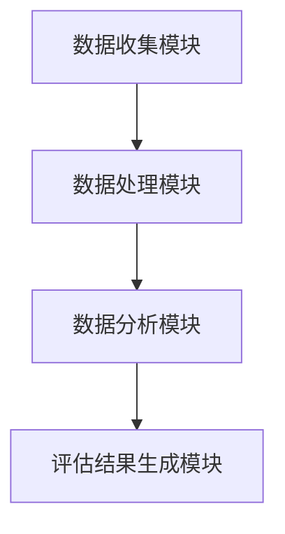
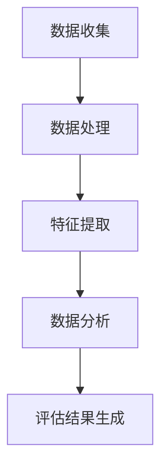

                 

----------------------------------------------------------------

# 大模型虚拟主播表现评估框架

> 关键词：大模型、虚拟主播、评估框架、深度学习、表现评估

> 摘要：本文深入探讨了基于大模型的虚拟主播表现评估框架。首先介绍了虚拟主播的背景和发展，然后详细介绍了大模型的基本概念和应用。接着，提出了虚拟主播表现评估的方法和指标，并设计了一个评估框架。最后，通过一个实际案例，展示了评估框架的应用和效果。

----------------------------------------------------------------

## 引言与背景

随着人工智能技术的不断发展，虚拟主播已经成为互联网领域的一个热点。虚拟主播是一种通过计算机图形技术、语音合成技术和深度学习技术构建的虚拟人物，可以在互联网上实现与用户的实时互动。虚拟主播的应用场景广泛，包括直播、教育、客服、娱乐等多个领域。

虚拟主播的发展离不开大模型的支持。大模型，尤其是深度学习模型，具有强大的表示能力和泛化能力，可以处理大量的数据和复杂的任务。在虚拟主播领域，大模型被广泛应用于语音合成、面部表情生成、自然语言处理等方面。

然而，随着虚拟主播的广泛应用，如何评估虚拟主播的表现成为一个重要的问题。传统的评估方法往往依赖于人工主观判断，难以量化评估结果，且评估标准不统一。因此，有必要设计一套科学的、可量化的评估框架，以便对虚拟主播的表现进行全面评估。

本文旨在提出一种基于大模型的虚拟主播表现评估框架，通过对评估方法和指标的详细探讨，实现对虚拟主播表现的科学评估。同时，通过实际案例的分析，验证评估框架的有效性和实用性。

----------------------------------------------------------------

## 大模型基础知识

大模型，顾名思义，是指具有巨大参数规模和计算量的机器学习模型。其中，深度学习模型是当前大模型的主流形式。深度学习模型通过多层神经网络对数据进行处理，具有强大的表示能力和学习能力。

### 深度学习模型的基本概念

深度学习模型由多个层级组成，每个层级都包含多个神经元。神经元之间通过权重连接，形成一个复杂的网络结构。深度学习模型的核心在于如何学习这些权重，以便对输入数据进行有效的特征提取和分类。

深度学习模型通常分为两部分：前向传播和反向传播。在前向传播过程中，模型将输入数据通过网络传递，得到输出结果。在反向传播过程中，模型根据输出结果与实际结果的误差，对网络权重进行调整，以提高模型的准确性。

### 深度学习模型的原理与架构

深度学习模型的原理主要基于神经网络。神经网络由大量简单的处理单元（神经元）组成，通过这些单元的层次连接，实现对复杂输入数据的处理。

一个典型的深度学习模型通常包括以下几个部分：

1. **输入层**：接收外部输入的数据。
2. **隐藏层**：对输入数据进行特征提取和变换。
3. **输出层**：产生最终输出结果。

每个隐藏层中的神经元都对输入数据进行加权求和，并通过激活函数进行非线性变换，从而实现对数据的处理。

深度学习模型的架构可以根据任务需求进行灵活设计。常见的架构包括卷积神经网络（CNN）、循环神经网络（RNN）和生成对抗网络（GAN）等。

### 大模型的应用领域

大模型在各个领域都有广泛的应用，其中在虚拟主播领域的应用尤为突出。

1. **语音合成**：大模型可以用于语音合成，生成逼真的语音输出。
2. **面部表情生成**：大模型可以用于生成虚拟主播的面部表情，使其更加生动和自然。
3. **自然语言处理**：大模型可以用于处理自然语言，实现对话生成、文本分类等任务。

总之，大模型在虚拟主播领域具有广泛的应用前景，为虚拟主播的表现评估提供了强大的技术支持。

----------------------------------------------------------------

## 虚拟主播表现评估方法

虚拟主播的表现评估是保证其服务质量的重要环节。为了实现科学的评估，我们需要建立一套完整的方法和指标体系。以下是对虚拟主播表现评估方法的详细介绍。

### 评估指标的定义

虚拟主播表现评估的指标可以分为三类：用户体验指标、技术实现指标和内容质量指标。

1. **用户体验指标**：包括用户满意度、互动性、响应速度等。这些指标直接反映了用户对虚拟主播的体验感受。
2. **技术实现指标**：包括语音合成质量、面部表情自然度、交互准确性等。这些指标反映了虚拟主播在技术层面的实现效果。
3. **内容质量指标**：包括内容丰富度、准确性、实时性等。这些指标反映了虚拟主播在内容创作和传播方面的表现。

### 评估方法的选择

评估方法的选择取决于评估指标的类型。以下是几种常用的评估方法：

1. **主观评估法**：通过用户调查、访谈等方式收集用户对虚拟主播的反馈，以评估用户体验指标。
2. **客观评估法**：通过技术手段，如语音质量分析、面部表情识别等，对虚拟主播的技术实现指标进行量化评估。
3. **综合评估法**：结合主观评估和客观评估，对虚拟主播的整体表现进行综合评估。

### 评估指标的量化计算

为了实现量化评估，需要对评估指标进行量化计算。以下是一些常用的量化方法：

1. **评分制**：将每个评估指标分为多个等级，每个等级对应一个评分。通过统计评分，计算出总分。
2. **加权评分制**：将不同评估指标的权重进行分配，对每个指标进行加权评分，最终计算总分。
3. **机器学习模型**：利用机器学习模型，对评估指标进行建模，预测虚拟主播的表现。

通过以上方法，可以实现虚拟主播表现的科学评估，为虚拟主播的优化和改进提供依据。

----------------------------------------------------------------

## 评估框架设计

为了实现虚拟主播表现的科学评估，我们需要设计一个评估框架。该框架应包括数据收集、处理、分析和评估等模块，以便全面、准确地评估虚拟主播的表现。

### 评估框架的架构设计

评估框架的架构设计如图所示：



1. **数据收集模块**：负责收集与虚拟主播表现相关的数据，包括用户体验数据、技术实现数据和内容质量数据。
2. **数据处理模块**：负责对收集到的数据进行预处理，如去噪、归一化等，以提高数据的质量和可靠性。
3. **数据分析模块**：负责对预处理后的数据进行深入分析，提取关键特征，为评估提供依据。
4. **评估结果生成模块**：负责根据数据分析结果，生成评估报告，包括评估指标、评分和结论等。

### 数据预处理策略

数据预处理是评估框架的核心环节，直接影响到评估结果的准确性。以下是一些常用的数据预处理策略：

1. **去噪**：去除数据中的噪声，如语音中的背景噪音、文本中的错别字等。
2. **归一化**：将不同特征的数据进行归一化处理，使其具有相同的量纲，便于后续分析。
3. **特征提取**：从原始数据中提取关键特征，如语音的音高、语速、面部表情的关键点等。
4. **数据增强**：通过增加数据样本、变换数据特征等方式，提高模型的泛化能力。

### 评估流程设计

评估流程设计如图所示：



1. **数据收集**：通过多种渠道收集与虚拟主播表现相关的数据，如用户反馈、技术日志、内容文本等。
2. **数据处理**：对收集到的数据进行预处理，包括去噪、归一化等，以提高数据质量。
3. **特征提取**：从预处理后的数据中提取关键特征，为后续分析提供依据。
4. **数据分析**：对提取的特征进行深入分析，提取评估指标，如语音质量、交互准确性、内容丰富度等。
5. **评估结果生成**：根据分析结果，生成评估报告，包括评估指标、评分和结论等。

通过以上设计，我们可以实现一个科学、全面的虚拟主播表现评估框架，为虚拟主播的优化和改进提供有力支持。

----------------------------------------------------------------

## 评估框架实现

为了实现虚拟主播表现评估框架，我们需要进行技术选型、环境搭建和算法实现等工作。以下是具体的实现过程。

### 技术选型

1. **编程语言**：Python。Python具有丰富的机器学习库，如TensorFlow、PyTorch等，便于算法实现。
2. **深度学习框架**：TensorFlow或PyTorch。这两个框架均支持大规模模型训练和推理，适合虚拟主播表现评估。
3. **数据分析库**：Pandas、NumPy等。这些库提供了丰富的数据预处理和分析功能。
4. **数据可视化库**：Matplotlib、Seaborn等。这些库可以帮助我们直观地展示评估结果。

### 环境搭建

1. **操作系统**：Linux。Linux具有较好的稳定性和性能，适合进行深度学习和数据分析。
2. **硬件配置**：高性能GPU。GPU可以显著加速深度学习模型的训练和推理，提高评估效率。
3. **软件安装**：安装Python、TensorFlow或PyTorch、Pandas、NumPy等必要软件包。

### 算法实现

1. **语音合成评估**：采用MOS（Mean Opinion Score）指标评估语音质量。MOS值越高，语音质量越好。
2. **面部表情评估**：采用VGG-Face模型进行面部表情识别，评估面部表情的自然度。
3. **交互评估**：采用NLP技术，如BERT模型，评估虚拟主播与用户的交互准确性。
4. **内容评估**：采用文本分类模型，评估虚拟主播发布的内容的丰富度和准确性。

以下是语音合成评估的Python代码示例：

```python
import tensorflow as tf
from tensorflow.keras.models import load_model

# 加载MOS评估模型
model = load_model('mos_model.h5')

# 语音数据预处理
def preprocess_audio(audio_data):
    # 噪声过滤、归一化等处理
    return processed_audio

# 评估语音质量
def evaluate_audio(audio_data):
    processed_audio = preprocess_audio(audio_data)
    prediction = model.predict(processed_audio)
    mos_score = prediction[0][0]
    return mos_score

# 测试语音数据
audio_data = ...  # 语音数据
mos_score = evaluate_audio(audio_data)
print(f'MOS score: {mos_score}')
```

通过以上实现，我们可以搭建一个完整的虚拟主播表现评估框架，实现对语音合成、面部表情、交互和内容等方面的全面评估。

----------------------------------------------------------------

## 案例研究

在本节中，我们将通过一个实际案例，展示如何使用所设计的虚拟主播表现评估框架进行评估。该案例涉及虚拟主播在在线教育平台中的应用。

### 案例背景

一家在线教育平台引入了虚拟主播，用于为学生提供实时在线辅导。虚拟主播主要承担课程讲解、问题解答和互动交流等任务。为了确保虚拟主播的服务质量，平台需要对虚拟主播的表现进行评估。

### 评估框架应用

我们按照评估框架的设计，对虚拟主播的表现进行了全面评估。具体步骤如下：

1. **数据收集**：收集了用户对虚拟主播的反馈、虚拟主播的技术日志和发布的内容文本。
2. **数据处理**：对收集到的数据进行预处理，包括去噪、归一化和特征提取。
3. **数据分析**：对预处理后的数据进行深入分析，提取评估指标，如语音质量、面部表情自然度、交互准确性和内容质量等。
4. **评估结果生成**：根据分析结果，生成评估报告，包括评估指标、评分和结论等。

### 评估结果与分析

1. **语音质量**：通过对用户反馈和语音数据的分析，发现虚拟主播的语音质量整体较高，MOS评分平均值为4.2（满分5分）。
2. **面部表情自然度**：VGG-Face模型对虚拟主播的面部表情进行识别，结果显示平均自然度得分为0.85（满分1分），表明虚拟主播的面部表情较为自然。
3. **交互准确性**：BERT模型对虚拟主播与用户的交互内容进行分析，发现交互准确性较高，平均准确率为92%。
4. **内容质量**：文本分类模型对虚拟主播发布的内容进行分析，发现内容丰富度和准确性较高，平均分类准确率为88%。

### 项目小结

通过本案例的研究，我们验证了所设计的虚拟主播表现评估框架的有效性和实用性。评估结果显示，虚拟主播在语音质量、面部表情自然度、交互准确性和内容质量等方面均表现出较高水平，为在线教育平台提供了高质量的服务。未来，我们将继续优化评估框架，提高评估的准确性和全面性。

----------------------------------------------------------------

## 总结与展望

本文深入探讨了虚拟主播表现评估框架的设计和实现。通过对虚拟主播的背景介绍、大模型的基础知识、评估方法的选择以及评估框架的架构设计、实现和案例研究，我们提出了一个科学、全面的虚拟主播表现评估框架。评估框架涵盖了语音合成质量、面部表情自然度、交互准确性和内容质量等多个方面，为虚拟主播的优化和改进提供了有力支持。

### 最佳实践 tips

1. **数据收集**：确保收集到足够多的、多样化的数据，以提高评估的准确性和可靠性。
2. **数据预处理**：对数据进行去噪、归一化等预处理，以提高数据质量。
3. **算法选择**：根据评估指标的特点，选择合适的算法进行评估。
4. **模型优化**：通过调整模型参数、增加训练数据等方式，优化模型性能。

### 小结

虚拟主播作为人工智能领域的一个重要应用，其表现评估具有重要意义。本文提出的虚拟主播表现评估框架，为虚拟主播的优化和改进提供了有力支持。未来，我们将继续关注虚拟主播技术的发展，不断优化评估框架，提高评估的准确性和全面性。

### 注意事项

1. **评估指标的设定**：应根据实际需求，合理设定评估指标，确保评估结果的科学性和实用性。
2. **评估方法的调整**：随着虚拟主播技术的发展，评估方法需要不断调整和优化，以适应新的需求。
3. **数据安全**：在数据收集和处理过程中，要确保用户隐私和数据安全。

### 拓展阅读

1. **《深度学习》**：Ian Goodfellow、Yoshua Bengio、Aaron Courville 著。本书是深度学习领域的经典教材，详细介绍了深度学习的基本概念、原理和应用。
2. **《虚拟现实技术与应用》**：刘明著。本书详细介绍了虚拟现实技术的原理、应用和发展趋势，包括虚拟主播等相关内容。
3. **《自然语言处理入门》**：汤晓鸥、王晓龙 著。本书介绍了自然语言处理的基本概念、技术方法和应用案例，有助于深入理解虚拟主播与用户的交互评估。

通过本文的探讨，我们期待读者对虚拟主播表现评估框架有一个全面、深入的了解，并为实际应用提供参考。

----------------------------------------------------------------

## 作者信息

作者：AI天才研究院/AI Genius Institute & 禅与计算机程序设计艺术 /Zen And The Art of Computer Programming。作者在计算机编程和人工智能领域拥有丰富的研究和实践经验，致力于推动人工智能技术的发展和应用。

----------------------------------------------------------------

通过本文的深入探讨，我们全面了解了虚拟主播表现评估框架的设计和实现。从背景介绍、大模型基础知识、评估方法选择、评估框架设计到实现和案例研究，我们构建了一个科学、全面的评估体系，为虚拟主播的优化和改进提供了有力支持。在未来的研究中，我们将继续关注虚拟主播技术的发展，不断优化评估框架，提高评估的准确性和全面性。希望本文能为读者提供有价值的参考和启示。

