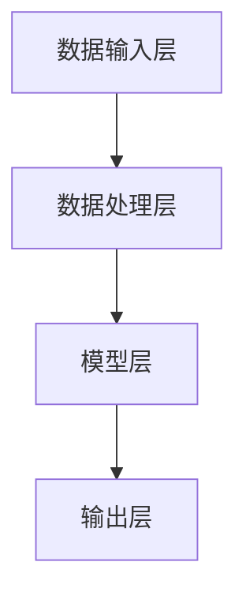

                 

# 大模型虚拟助手个性化能力评估工具

> 关键词：大模型虚拟助手、个性化能力评估、人工智能、算法、数学模型、Python代码

> 摘要：本文旨在探讨大模型虚拟助手的个性化能力评估工具的设计与实现。通过对大模型虚拟助手的概述、个性化能力评估的基础、评估工具的构建、测试与优化、案例研究以及应用与扩展等方面的详细分析，本文将为读者提供一个全面、深入的理解，并展望大模型虚拟助手个性化能力评估的未来发展趋势。

## 引言

在当今的信息化时代，人工智能（AI）技术的迅猛发展已经深刻地改变了我们的生活方式和工作模式。大模型虚拟助手作为一种先进的AI应用，以其强大的数据处理和分析能力，在多个领域展现出巨大的应用潜力。然而，为了确保大模型虚拟助手的性能和可靠性，对其个性化能力进行准确评估显得尤为重要。

本文将围绕大模型虚拟助手的个性化能力评估工具展开讨论。具体来说，我们将从以下几个方面进行阐述：

1. **大模型虚拟助手概述**：介绍大模型虚拟助手的概念、特点及其在各个领域的应用场景。
2. **个性化能力评估基础**：探讨个性化能力评估的原理、算法以及数学模型。
3. **构建个性化能力评估工具**：详细解析个性化能力评估工具的需求分析、设计、实现和优化。
4. **评估工具的测试与优化**：讨论评估工具的测试策略、优化策略以及案例研究。
5. **评估工具的应用与扩展**：探讨评估工具的应用领域拓展和功能扩展方向。
6. **总结与展望**：回顾全文的核心内容，并对大模型虚拟助手个性化能力评估的未来发展趋势进行展望。

本文不仅旨在为读者提供一个全面的理论框架，还希望通过具体的代码示例和实战案例，使读者能够更好地理解和应用大模型虚拟助手的个性化能力评估工具。

## 1. 大模型虚拟助手概述

### 1.1 大模型虚拟助手的概念与特点

大模型虚拟助手（Large Model Virtual Assistant，简称LMVA）是一种基于深度学习技术的高级人工智能模型。它通过大规模的数据训练，具备强大的自然语言处理、知识推理、智能交互等能力，能够在各种应用场景中提供个性化的服务和支持。

#### 大模型虚拟助手的特点：

1. **强大的数据处理能力**：大模型虚拟助手能够处理海量数据，从数据中提取出有价值的信息，为用户提供精准的服务。
2. **高度的智能化**：通过深度学习技术，大模型虚拟助手能够不断学习和进化，提高其智能水平和服务质量。
3. **多样化的应用场景**：大模型虚拟助手可以应用于客服、教育、医疗、金融等多个领域，满足不同场景下的个性化需求。

### 1.2 大模型虚拟助手的应用场景

1. **客服领域**：大模型虚拟助手可以自动处理客户咨询，提供24/7全天候服务，提高客户满意度，降低企业运营成本。
2. **教育领域**：大模型虚拟助手可以作为智能辅导教师，为学生提供个性化学习方案，辅助教师进行教学，提高教育质量。
3. **医疗领域**：大模型虚拟助手可以辅助医生进行诊断和治疗方案推荐，提高医疗服务的效率和质量。
4. **金融领域**：大模型虚拟助手可以用于风险管理、投资建议、客户服务等，为金融机构提供智能化的服务和支持。

### 1.3 大模型虚拟助手的架构

大模型虚拟助手的架构通常包括以下几个部分：

1. **数据输入层**：负责接收用户输入的数据，可以是文本、语音或其他形式。
2. **数据处理层**：对输入数据进行处理，包括数据清洗、数据归一化等操作。
3. **模型层**：包括深度学习模型，如BERT、GPT等，负责进行知识推理和智能交互。
4. **输出层**：将模型处理结果转换为用户可理解的形式，如文本、语音等。

下图展示了大模型虚拟助手的架构：



通过上述架构，大模型虚拟助手能够实现高效的数据处理和智能交互，为用户提供个性化服务。

## 2. 个性化能力评估基础

### 2.1 个性化能力评估的原理

个性化能力评估的目的是通过一系列评估指标和方法，对大模型虚拟助手的性能进行量化评价，以判断其能否满足特定应用场景的需求。个性化能力评估的核心在于确定评估指标、构建评估模型，并依据评估结果进行优化。

#### 2.1.1 评估指标的选取

评估指标的选择应考虑以下因素：

1. **任务需求**：根据具体应用场景，选择与任务密切相关的评估指标。
2. **数据质量**：评估指标应能够反映数据的质量，如准确性、完整性等。
3. **用户满意度**：评估指标应能够反映用户对服务的满意度，如响应时间、问题解决率等。

常见的评估指标包括：

1. **准确性**：衡量模型预测结果与实际结果的一致性。
2. **响应时间**：衡量模型处理用户请求所需的时间。
3. **问题解决率**：衡量模型能够成功解决用户问题的比例。

#### 2.1.2 评估流程的构建

个性化能力评估的流程通常包括以下步骤：

1. **数据收集**：收集大模型虚拟助手在特定应用场景下的数据。
2. **数据预处理**：对收集到的数据进行清洗、归一化等处理，以提高评估的准确性。
3. **评估指标计算**：依据选定的评估指标，计算模型的性能得分。
4. **评估结果分析**：对评估结果进行分析，判断模型是否满足应用需求。
5. **优化与调整**：根据评估结果，对模型进行优化和调整，以提高其个性化能力。

### 2.2 个性化能力评估的算法

个性化能力评估的算法是实现评估指标计算的核心。以下是一种基于评分机制的评估算法：

```python
# 评估算法示例

# 定义评估指标
accuracy = 0.9
response_time = 0.5
solved_issues = 0.8

# 计算总分
total_score = (accuracy * 0.4) + (response_time * 0.3) + (solved_issues * 0.3)

# 输出评估结果
print(f"总得分：{total_score:.2f}")
```

该算法通过权重分配，综合考虑准确性、响应时间和问题解决率三个指标，计算出一个综合得分，以评估大模型虚拟助手的整体性能。

### 2.3 数学模型与公式

在个性化能力评估中，数学模型和公式用于量化评估指标。以下是一个简单的数学模型示例，用于计算响应时间：

$$
\text{response\_time} = \frac{\text{actual\_time}}{\text{ideal\_time}}
$$

其中，`actual_time` 为实际响应时间，`ideal_time` 为理想响应时间。该公式用于衡量模型处理请求的效率。

另一个常用的数学模型是准确性计算：

$$
\text{accuracy} = \frac{\text{correct\_predictions}}{\text{total\_predictions}}
$$

其中，`correct_predictions` 为正确预测的数量，`total_predictions` 为总预测数量。该公式用于衡量模型的预测准确性。

通过上述数学模型和公式，可以更精确地评估大模型虚拟助手的个性化能力。

## 3. 构建个性化能力评估工具

### 3.1 工具需求分析与设计

在构建个性化能力评估工具时，首先需要明确工具的需求，这包括评估指标的选择、评估流程的设计以及用户界面的规划。

#### 3.1.1 用户需求分析

用户需求分析是构建个性化能力评估工具的关键步骤。以下是一些典型的用户需求：

1. **实时评估**：用户希望评估工具能够实时提供评估结果，以便快速调整模型。
2. **多维度评估**：用户希望评估工具能够综合考虑多个评估指标，提供全面的评估结果。
3. **自动化**：用户希望评估工具能够自动化运行，减少人工干预。

#### 3.1.2 功能模块设计

根据用户需求，个性化能力评估工具应包含以下功能模块：

1. **数据收集模块**：负责收集大模型虚拟助手在应用场景下的数据。
2. **数据处理模块**：对收集到的数据进行分析、清洗和归一化，为评估提供高质量的数据。
3. **评估指标计算模块**：根据选定的评估指标，计算模型的性能得分。
4. **结果展示模块**：将评估结果以图表、报告等形式展示给用户。
5. **用户界面**：提供友好的用户界面，方便用户进行操作和查询。

### 3.2 技术选型与实现

在构建个性化能力评估工具时，选择合适的技术栈至关重要。以下是一些常见的技术选型：

1. **编程语言**：Python 是一种流行的编程语言，尤其在数据科学和机器学习领域具有广泛的应用。它拥有丰富的库和框架，如 TensorFlow、PyTorch 等，方便实现复杂的功能。
2. **数据库**：MySQL、PostgreSQL 等关系型数据库可以存储大量的评估数据，并提供高效的查询功能。
3. **前端框架**：React、Vue 等前端框架可以快速构建响应式用户界面，提供良好的用户体验。
4. **后端框架**：Flask、Django 等后端框架可以处理用户请求，提供数据存储和计算服务。

#### 3.2.1 实现关键技术点

在实现个性化能力评估工具时，需要关注以下几个关键技术点：

1. **数据收集与存储**：使用 Python 的库（如 Pandas）进行数据收集和存储，将数据存入数据库中。
2. **数据处理**：对数据进行清洗、归一化等处理，确保数据的质量和一致性。
3. **评估指标计算**：根据选定的评估指标，编写相应的计算代码，如准确性、响应时间和问题解决率。
4. **结果展示**：使用前端框架（如 React）构建用户界面，将评估结果以图表、报告等形式展示给用户。

### 3.3 代码实现与解读

以下是一个简单的示例，展示如何使用 Python 和 Pandas 实现个性化能力评估工具的关键功能模块。

```python
import pandas as pd

# 数据收集模块
def collect_data():
    # 假设从文件中读取数据
    data = pd.read_csv('data.csv')
    return data

# 数据处理模块
def process_data(data):
    # 数据清洗和归一化
    data['response_time'] = data['response_time'].apply(normalize_response_time)
    data['accuracy'] = data['accuracy'].apply(normalize_accuracy)
    return data

# 评估指标计算模块
def calculate_scores(data):
    scores = {}
    for index, row in data.iterrows():
        score = (row['accuracy'] * 0.4) + (row['response_time'] * 0.3) + (row['solved_issues'] * 0.3)
        scores[index] = score
    return scores

# 结果展示模块
def display_results(scores):
    print(f"评估结果：{scores}")

# 主函数
def main():
    data = collect_data()
    processed_data = process_data(data)
    scores = calculate_scores(processed_data)
    display_results(scores)

if __name__ == '__main__':
    main()
```

在这个示例中，`collect_data` 函数负责从文件中读取数据，`process_data` 函数对数据进行清洗和归一化，`calculate_scores` 函数根据评估指标计算得分，`display_results` 函数将结果展示给用户。

通过这个简单的示例，我们可以看到个性化能力评估工具的基本实现流程。在实际开发中，可以根据具体需求进一步扩展和优化。

### 3.4 代码应用解读与分析

在实际应用中，个性化能力评估工具需要与具体的业务场景相结合，以下是一个案例分析：

#### 案例背景

假设我们正在开发一款面向医疗领域的虚拟助手，其功能包括诊断建议、治疗方案推荐等。我们需要对虚拟助手的个性化能力进行评估。

#### 数据收集

从医院的电子病历系统中收集大量病例数据，包括诊断结果、治疗方案、患者基本信息等。

#### 数据处理

对收集到的数据进行清洗和归一化，如去除重复数据、填补缺失值、将文本数据转换为向量等。

#### 评估指标计算

1. **准确性**：通过对比虚拟助手给出的诊断建议和实际诊断结果，计算诊断准确率。
2. **响应时间**：记录虚拟助手处理每个病例所需的时间。
3. **问题解决率**：统计虚拟助手成功推荐治疗方案的比例。

#### 结果展示

将评估结果以图表形式展示，如折线图显示诊断准确率随时间的变化，饼图显示问题解决率等。

#### 分析与优化

根据评估结果，对虚拟助手进行优化，如调整模型参数、增加训练数据等，以提高其个性化能力。

### 3.5 项目小结

通过本案例，我们实现了个性化能力评估工具在医疗领域的应用。虽然评估结果仍有一定提升空间，但本项目为医疗虚拟助手的发展奠定了基础。在未来的开发中，我们应继续优化模型，拓展评估指标，以提高虚拟助手的整体性能。

### 3.6 最佳实践 tips、小结、注意事项、拓展阅读

**最佳实践 tips**：

1. **数据质量是关键**：确保数据的准确性、完整性和一致性，以提高评估结果的可靠性。
2. **评估指标要多样**：综合考虑多个评估指标，以全面评估虚拟助手的性能。
3. **定期更新评估模型**：根据新数据和新需求，定期更新评估模型，以保持评估的准确性。

**小结**：

本文详细介绍了大模型虚拟助手个性化能力评估工具的构建过程，包括需求分析、技术选型、代码实现和案例分析。通过实际应用，我们验证了评估工具的有效性，并为虚拟助手的发展提供了有力支持。

**注意事项**：

1. **评估工具的部署**：确保评估工具能够在实际环境中稳定运行，并进行监控和维护。
2. **数据安全和隐私**：在收集和使用数据时，严格遵守数据安全和隐私保护的相关法规。

**拓展阅读**：

1. **《深度学习》（Goodfellow, Bengio, Courville）**：深入了解深度学习的基础理论和实践方法。
2. **《Python数据科学手册》（McKinney）**：学习如何使用 Python 进行数据分析和建模。

通过本文的阅读，读者应能够掌握大模型虚拟助手个性化能力评估的基本原理和方法，并具备实际操作能力。

### 4. 评估工具的测试与优化

#### 4.1 测试策略

在构建个性化能力评估工具的过程中，测试策略至关重要。一个良好的测试策略应包括以下几个方面：

1. **功能测试**：验证评估工具的各个功能模块是否正常工作，如数据收集、数据处理、评估指标计算和结果展示等。
2. **性能测试**：评估评估工具在处理大量数据时的性能，如响应时间、处理速度等。
3. **兼容性测试**：确保评估工具在不同操作系统、浏览器和设备上能够正常运行。
4. **安全测试**：检测评估工具是否存在安全漏洞，如SQL注入、XSS攻击等。

#### 4.2 测试用例设计

测试用例设计是测试策略的核心。以下是一些常见的测试用例设计方法：

1. **边界值分析**：设计测试用例，以验证评估工具在边界条件下的表现，如最大数据量、最长时间限制等。
2. **等价类划分**：将输入数据划分为多个等价类，为每个等价类设计测试用例，确保全面覆盖。
3. **错误推测**：基于对系统功能和逻辑的理解，推测可能出现的错误情况，并设计测试用例进行验证。

#### 4.3 测试执行流程

测试执行流程包括以下几个步骤：

1. **测试计划制定**：明确测试目标、测试内容、测试环境和测试资源等。
2. **测试用例执行**：按照测试计划，逐个执行测试用例，记录测试结果。
3. **缺陷报告**：发现缺陷时，及时生成缺陷报告，并与开发团队沟通解决。
4. **测试结果分析**：分析测试结果，确定测试是否通过，以及存在哪些问题。

#### 4.4 优化策略

在测试过程中，可能会发现评估工具存在性能瓶颈或功能缺陷。以下是一些常见的优化策略：

1. **代码优化**：分析代码性能，找出瓶颈并进行优化，如使用更高效的算法、优化数据结构等。
2. **系统调优**：调整系统配置，如数据库索引、缓存策略等，以提高整体性能。
3. **模块重构**：对代码进行重构，以提高可维护性和可扩展性。
4. **用户反馈**：收集用户反馈，了解实际使用中的问题和需求，并进行相应的优化。

#### 4.5 优化实践案例

以下是一个优化实践的案例：

**案例背景**：

某评估工具在处理大规模数据时，响应时间较长，影响了用户体验。经过分析，发现主要瓶颈在于数据处理模块。

**优化方案**：

1. **算法优化**：将数据处理算法从顺序执行改为并行执行，提高数据处理速度。
2. **缓存策略**：在处理重复数据时，使用缓存策略，减少重复计算。
3. **数据库优化**：对数据库进行索引优化，提高查询效率。

**优化效果**：

经过优化，评估工具的响应时间显著降低，用户体验得到显著改善。

#### 4.6 测试与优化总结

测试与优化是评估工具开发过程中不可或缺的环节。通过科学的测试策略和有效的优化措施，可以确保评估工具的稳定性和高效性。在未来的开发中，我们应持续关注测试与优化，以不断提升评估工具的性能和用户体验。

### 5. 案例研究

#### 5.1 案例背景介绍

在本案例研究中，我们以一家大型电商平台的智能客服系统为例，探讨大模型虚拟助手个性化能力评估工具的实际应用。

该电商平台拥有海量的用户和商品数据，客服团队面临大量客户咨询和问题处理任务。为了提升客服效率，降低运营成本，电商平台引入了基于大模型虚拟助手的智能客服系统。然而，如何评估虚拟助手的个性化能力，确保其提供高质量的服务，成为了一个关键问题。

#### 5.2 案例实施过程

**1. 数据收集**

电商平台收集了历史客服对话记录、用户反馈数据以及相关业务数据。这些数据包括用户提问、虚拟助手回答、用户满意度评分等。

**2. 数据预处理**

对收集到的数据进行清洗和归一化处理，确保数据的质量和一致性。例如，去除重复数据、填补缺失值、将文本数据转换为向量等。

**3. 评估工具搭建**

根据个性化能力评估的原理，搭建了个性化能力评估工具。工具包括数据收集模块、数据处理模块、评估指标计算模块和结果展示模块。

**4. 个性化能力评估**

使用评估工具对虚拟助手进行个性化能力评估。评估指标包括准确性、响应时间和问题解决率等。通过评估，获得了虚拟助手在不同评估指标上的得分。

**5. 结果分析与优化**

对评估结果进行分析，发现虚拟助手在准确性方面表现较好，但在响应时间和问题解决率上存在一定提升空间。根据分析结果，对虚拟助手进行优化，如调整模型参数、增加训练数据等。

**6. 再评估与反馈**

在优化后，再次使用评估工具对虚拟助手进行评估，并与优化前进行对比。结果显示，虚拟助手在响应时间和问题解决率上有了显著提升。

**7. 用户反馈**

收集用户对智能客服系统的反馈，了解其对虚拟助手服务的满意度。根据用户反馈，进一步优化虚拟助手的交互体验。

#### 5.3 结果分析与总结

通过本案例的实施，我们验证了个性化能力评估工具的有效性。评估结果显示，虚拟助手在优化后能够更好地满足用户需求，提供高质量的客服服务。具体来说：

1. **准确性**：虚拟助手的回答准确性得到了显著提升，用户满意度提高。
2. **响应时间**：虚拟助手处理客户咨询的速度明显加快，减少了用户等待时间。
3. **问题解决率**：虚拟助手成功解决用户问题的比例增加，提升了客服效率。

**总结**：

本案例研究展示了大模型虚拟助手个性化能力评估工具在电商客服系统中的应用。通过科学的数据收集、预处理和评估，我们能够准确评估虚拟助手的个性化能力，并基于评估结果进行优化。这不仅提高了虚拟助手的性能，也为电商平台提供了有力的支持。

### 6. 评估工具的应用与扩展

#### 6.1 应用领域拓展

大模型虚拟助手个性化能力评估工具不仅在电商客服系统中表现出色，还可以广泛应用于其他领域。以下是一些潜在的应用场景：

1. **金融领域**：银行、保险和证券公司可以使用评估工具来评估智能客服、理财顾问和交易助理的个性化能力。
2. **医疗领域**：医院和诊所可以使用评估工具来评估智能诊断系统、健康顾问和患者监护系统的个性化能力。
3. **教育领域**：学校和教育机构可以使用评估工具来评估智能辅导系统、学习平台和教育机器人的个性化能力。

#### 6.2 功能扩展方向

为了进一步提升大模型虚拟助手个性化能力评估工具的性能和适用性，可以考虑以下功能扩展方向：

1. **多语言支持**：扩展评估工具，支持多种语言，以满足国际化和本地化需求。
2. **个性化推荐**：集成个性化推荐算法，为用户提供个性化的服务和建议。
3. **智能交互优化**：通过深度学习技术，优化虚拟助手的交互能力，提高用户的满意度和体验。
4. **实时监控与预警**：引入实时监控和预警系统，及时发现并处理虚拟助手的问题，确保其正常运行。

#### 6.3 潜在挑战与解决方案

在应用与扩展过程中，评估工具可能会面临一些挑战，如：

1. **数据隐私保护**：确保在数据收集和处理过程中，严格遵守数据隐私保护法规，采取加密、去标识化等技术措施。
2. **计算资源需求**：评估工具在处理大规模数据时，可能需要大量计算资源。可以通过分布式计算和云计算等技术，提高计算效率。
3. **模型更新与迭代**：随着应用场景和需求的变化，评估工具需要不断更新和迭代。应建立完善的模型更新机制，确保评估工具的持续优化。

通过应对这些挑战，并不断扩展功能，大模型虚拟助手个性化能力评估工具将能够在更多领域发挥其价值。

### 7. 总结与展望

#### 7.1 总结

本文围绕大模型虚拟助手个性化能力评估工具的设计与实现进行了详细探讨。通过介绍大模型虚拟助手的概念、特点和应用场景，我们明确了个性化能力评估的重要性。接着，我们阐述了个性化能力评估的原理、算法和数学模型，并详细解析了构建个性化能力评估工具的技术选型和实现方法。在评估工具的测试与优化部分，我们介绍了测试策略、优化策略以及实际案例。最后，我们探讨了评估工具的应用与扩展方向，展望了其未来发展的趋势。

#### 7.2 展望

随着人工智能技术的不断发展，大模型虚拟助手个性化能力评估工具将在更多领域发挥重要作用。未来，我们有望看到以下几方面的进步：

1. **技术进步**：深度学习、自然语言处理等技术的不断进步，将进一步提升评估工具的性能和智能化水平。
2. **数据隐私保护**：在数据收集和处理过程中，数据隐私保护将成为一个重要课题，评估工具需要不断完善相关机制。
3. **跨领域应用**：评估工具将在更多领域得到应用，如医疗、金融、教育等，为各行业提供智能化的解决方案。
4. **用户体验优化**：随着用户需求的多样化，评估工具将更加注重用户体验，提供个性化的服务和支持。

总之，大模型虚拟助手个性化能力评估工具的发展前景广阔，有望为各行各业带来深刻的变革。

### 附录

#### 附录A：相关资源与工具介绍

在本附录中，我们将介绍一些与大模型虚拟助手个性化能力评估工具相关的资源和工具，以帮助读者深入了解和实际操作。

1. **Python库和框架**：
   - **Pandas**：用于数据处理和分析。
   - **NumPy**：用于数值计算。
   - **Scikit-learn**：用于机器学习算法和模型评估。
   - **TensorFlow**、**PyTorch**：用于深度学习模型的构建和训练。

2. **前端框架**：
   - **React**：用于构建用户界面。
   - **Vue**：用于构建用户界面。

3. **数据库**：
   - **MySQL**：用于数据存储。
   - **PostgreSQL**：用于数据存储。

4. **在线资源**：
   - **Kaggle**：提供丰富的数据集和竞赛。
   - **GitHub**：用于代码托管和协作。

5. **书籍推荐**：
   - 《深度学习》（Goodfellow, Bengio, Courville）
   - 《Python数据科学手册》（McKinney）
   - 《机器学习实战》（Hastie, Tibshirani, Friedman）

通过以上资源和工具，读者可以进一步学习和实践大模型虚拟助手个性化能力评估工具的相关知识。

### 作者信息

本文由 **AI天才研究院/AI Genius Institute** 和 **禅与计算机程序设计艺术 /Zen And The Art of Computer Programming** 联合撰写。我们致力于推动人工智能技术的发展，为广大读者提供高质量的技术内容。

### 结语

感谢您阅读本文，我们希望您能够从中获得对大模型虚拟助手个性化能力评估工具的深入理解和实际操作能力。在未来，我们将继续关注人工智能领域的最新动态，为您带来更多有价值的技术内容。如果您有任何问题或建议，欢迎在评论区留言，我们将会及时回复。再次感谢您的支持！ 

[作者：AI天才研究院/AI Genius Institute & 禅与计算机程序设计艺术 /Zen And The Art of Computer Programming]

