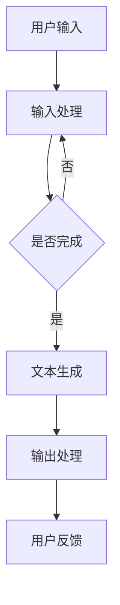
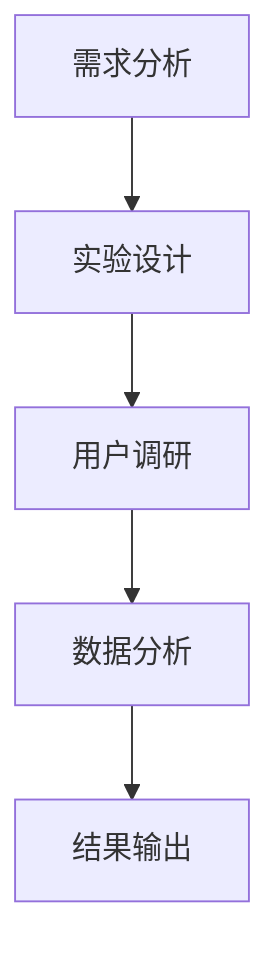

                 

# 大模型虚拟助手交互体验评估方案

> 关键词：大模型、虚拟助手、交互体验、评估方案、用户体验、人工智能

> 摘要：本文将深入探讨大模型虚拟助手的交互体验评估方案，从概述与背景出发，详细阐述核心概念、评估指标、评估方法、案例研究以及实际应用与优化，旨在为开发者提供一套完整、科学、易于实施的评估体系，以提升虚拟助手的交互体验。

## 引言

随着人工智能技术的迅猛发展，大模型虚拟助手已成为各行各业不可或缺的辅助工具。从智能客服到教育辅导，从医疗咨询到日常办公，虚拟助手正逐步改变我们的生活方式和工作方式。然而，虚拟助手的交互体验对于用户满意度、系统价值和使用效果具有重要影响。因此，对大模型虚拟助手的交互体验进行科学、全面的评估显得尤为重要。

本文旨在设计一套完整的大模型虚拟助手交互体验评估方案，帮助开发者识别和改进虚拟助手在交互体验方面的不足，从而提升用户满意度、提高系统的实用价值和市场竞争力。评估方案将涵盖核心概念与联系、评估指标与方法、评估方法与工具、案例研究以及实际应用与优化等内容。

## 概述与背景

### 大模型虚拟助手的定义

大模型虚拟助手是指利用大规模预训练模型（如GPT、BERT等）构建的具有高度智能化的虚拟代理。这类虚拟助手可以处理复杂的语言任务，包括问答、对话生成、文本分类、情感分析等，从而提供个性化、智能化的交互服务。

### 虚拟助手交互体验的重要性

虚拟助手的交互体验直接影响到用户对系统的满意度、信任度和依赖程度。一个优秀的交互体验可以增强用户的参与感和满意度，从而提高系统的使用频率和效果。相反，一个糟糕的交互体验可能导致用户流失、系统崩溃和负面评价。

### 评估方案的基本框架

本文的评估方案将分为以下几个部分：

1. **核心概念与联系**：介绍大模型虚拟助手的基本原理和架构，明确核心概念和实体之间的关系。
2. **评估指标与方法**：定义交互体验评估的指标，包括用户满意度、交互效率、用户体验质量等，并选择合适的评估方法。
3. **评估方法与工具**：详细介绍评估过程，包括实验设计、用户调研、数据分析等，并推荐常用的评估工具。
4. **案例研究**：通过具体案例展示评估过程和结果，分析评估方案的实际应用效果。
5. **实际应用与优化**：讨论评估结果的应用和优化策略，提出改进建议。

### 核心概念与联系

#### 大模型的基本原理

大模型是指具有数十亿到千亿参数的神经网络模型。通过在大量数据上进行预训练，大模型可以学习到语言的内在规律和结构，从而实现高度的泛化能力。例如，GPT-3拥有1750亿个参数，可以生成连贯、自然的文本。

#### 虚拟助手的工作流程

虚拟助手的工作流程通常包括以下几个步骤：

1. **输入处理**：接收用户输入，将其转化为模型可以处理的格式。
2. **文本生成**：使用预训练的大模型生成回复文本。
3. **输出处理**：对生成的文本进行处理，如格式化、语气调整等，最终呈现给用户。

#### 大模型与虚拟助手的关系

大模型是虚拟助手的核心组件，负责处理语言理解和生成任务。虚拟助手则负责将大模型的能力应用于具体的交互场景，实现与用户的实时对话。

### Mermaid流程图：大模型虚拟助手架构



### 评估指标与方法

#### 用户满意度指标

用户满意度是评估虚拟助手交互体验的重要指标。它反映了用户对虚拟助手整体体验的主观感受。常用的满意度评估方法包括：

1. **问卷调查**：通过设计详细的问卷，收集用户对虚拟助手的满意度评分。
2. **用户访谈**：与用户进行面对面或在线访谈，深入了解用户对虚拟助手的感受和意见。

#### 交互效率指标

交互效率是评估虚拟助手性能的重要指标。它反映了虚拟助手处理用户请求的速度和质量。常用的交互效率评估方法包括：

1. **响应时间**：测量虚拟助手从接收到用户请求到生成回复文本的时间。
2. **错误率**：测量虚拟助手生成的错误回复占总回复的比例。

#### 用户体验质量指标

用户体验质量是评估虚拟助手交互体验的重要指标。它综合考虑了用户满意度、交互效率和系统稳定性等多个方面。常用的用户体验质量评估方法包括：

1. **系统性能评估**：测量虚拟助手的计算资源使用情况，包括CPU、内存、网络带宽等。
2. **错误恢复能力**：评估虚拟助手在遇到错误或异常情况时的处理能力和恢复速度。

#### 评估方法的比较与选择

在评估虚拟助手交互体验时，需要根据具体场景和需求选择合适的评估方法。以下是对几种常用评估方法的比较和选择建议：

1. **问卷调查和用户访谈**：适用于评估虚拟助手的长期性能和用户体验，但需要投入大量时间和人力资源。
2. **响应时间和错误率**：适用于快速评估虚拟助手的性能，但无法全面反映用户体验。
3. **系统性能评估和错误恢复能力**：适用于评估虚拟助手的稳定性和技术能力，但可能无法直接反映用户体验。

#### 伪代码：用户满意度评估算法

```python
def user_satisfaction_survey(users):
    total_satisfaction = 0
    for user in users:
        satisfaction_score = get_satisfaction_score(user)
        total_satisfaction += satisfaction_score
    average_satisfaction = total_satisfaction / len(users)
    return average_satisfaction

def get_satisfaction_score(user):
    questions = ["你对虚拟助手的整体体验如何？", "你对虚拟助手的响应速度满意吗？", "你对虚拟助手的准确性满意吗？"]
    scores = []
    for question in questions:
        score = user.answer_question(question)
        scores.append(score)
    average_score = sum(scores) / len(scores)
    return average_score
```

### 评估方法与工具

#### 实验设计原则

在评估虚拟助手交互体验时，实验设计至关重要。以下是一些实验设计原则：

1. **随机化分组**：将用户随机分配到不同的评估组，以消除偏差。
2. **控制变量**：确保实验中的变量得到有效控制，避免其他因素对评估结果产生影响。
3. **重复实验**：进行多次实验，以提高评估结果的可靠性。

#### 用户调研方法

用户调研是评估虚拟助手交互体验的重要环节。以下是一些常用的用户调研方法：

1. **问卷调查**：通过设计详细的问卷，收集用户对虚拟助手的满意度、响应速度、准确性等指标的主观评价。
2. **用户访谈**：与用户进行面对面或在线访谈，深入了解用户对虚拟助手的真实感受和意见。
3. **用户行为分析**：通过分析用户与虚拟助手的交互记录，了解用户的使用习惯和偏好。

#### 数据分析工具

在评估虚拟助手交互体验时，数据分析工具可以帮助我们更好地理解和分析评估结果。以下是一些常用的数据分析工具：

1. **Python**：Python是一种通用编程语言，广泛应用于数据分析、机器学习等领域。Python具有丰富的数据处理和分析库，如Pandas、NumPy、Scikit-learn等。
2. **Excel**：Excel是一种常用的电子表格工具，适用于小型数据集的整理和分析。Excel具有直观的界面和丰富的数据分析功能。
3. **R**：R是一种专门用于统计分析的语言，具有强大的数据处理和分析功能。R在统计建模、数据可视化等方面具有很高的性能。

#### 评估流程与步骤

以下是一个典型的虚拟助手交互体验评估流程：

1. **需求分析**：明确评估目标和指标，确定评估方法和工具。
2. **实验设计**：根据需求设计实验方案，包括随机化分组、控制变量、重复实验等。
3. **用户调研**：通过问卷调查、用户访谈、用户行为分析等方法收集评估数据。
4. **数据分析**：使用Python、Excel、R等工具对评估数据进行分析和处理。
5. **结果输出**：根据分析结果生成评估报告，提出改进建议。

### Mermaid流程图：评估流程



### 案例研究

#### 案例一：智能客服系统的评估

在某大型电商平台，为了提升客户服务质量，该公司引入了一套智能客服系统。该系统基于GPT-3模型，可以自动回答用户提问，提供购物建议和解决常见问题。

1. **评估指标**：用户满意度、响应时间、错误率。
2. **评估方法**：问卷调查、用户访谈、用户行为分析。
3. **评估结果**：
    - 用户满意度：平均分为4.5分（满分5分）。
    - 响应时间：平均响应时间为2.5秒。
    - 错误率：错误回复率为3%。
4. **改进建议**：
    - 优化响应速度：通过增加计算资源和优化算法，进一步提高响应速度。
    - 提高准确性：通过数据增强和模型调优，降低错误回复率。
    - 加强用户调研：定期收集用户反馈，了解用户需求和期望，不断改进系统。

#### 案例二：教育辅导虚拟助手的评估

在某在线教育平台，为了提高学生学习效果，该公司开发了一款教育辅导虚拟助手。该虚拟助手可以为学生提供个性化的学习建议和解答疑问。

1. **评估指标**：用户满意度、学习效果、错误率。
2. **评估方法**：问卷调查、学习效果测试、用户行为分析。
3. **评估结果**：
    - 用户满意度：平均分为4.7分（满分5分）。
    - 学习效果：学生的学习成绩平均提高了10%。
    - 错误率：错误回复率为2%。
4. **改进建议**：
    - 提升个性化服务：通过分析用户学习数据，提供更个性化的学习建议。
    - 加强用户调研：了解学生的学习需求和困难，不断改进虚拟助手的功能和性能。

#### 案例三：医疗咨询虚拟助手的评估

在某医疗咨询平台，为了提供更加便捷、高效的咨询服务，该公司开发了一款医疗咨询虚拟助手。该虚拟助手可以回答用户的健康问题，提供就医建议。

1. **评估指标**：用户满意度、咨询质量、错误率。
2. **评估方法**：问卷调查、咨询质量评估、用户行为分析。
3. **评估结果**：
    - 用户满意度：平均分为4.6分（满分5分）。
    - 咨询质量：用户对咨询结果的满意度达到90%。
    - 错误率：错误回复率为4%。
4. **改进建议**：
    - 提高咨询准确性：通过增加医学知识库和优化算法，进一步提高咨询准确性。
    - 加强用户培训：向用户提供使用指南和培训资料，提高用户对虚拟助手的认知和使用能力。

#### 案例分析：评估结果与改进建议

通过以上案例研究，我们可以发现：

1. **用户满意度**：用户满意度是评估虚拟助手交互体验的重要指标，反映了用户对虚拟助手整体感受的主观评价。提高用户满意度需要从多个方面进行改进，包括响应速度、准确性和个性化服务。
2. **交互效率**：交互效率是虚拟助手性能的重要指标，包括响应时间和错误率。提高交互效率需要优化算法、增加计算资源和加强用户调研。
3. **用户体验质量**：用户体验质量是综合考虑用户满意度、交互效率和系统稳定性等多个方面的评估指标。提高用户体验质量需要从系统性能、错误恢复能力和用户培训等方面进行改进。

### 实际应用与优化

#### 评估结果的应用

1. **优化虚拟助手功能**：根据评估结果，针对虚拟助手的不足之处进行功能优化，提高系统的实用价值和市场竞争力。
2. **改进用户体验**：根据用户反馈，不断改进虚拟助手的交互设计，提升用户的满意度和使用体验。
3. **提升系统性能**：通过优化算法、增加计算资源等方式，提高虚拟助手的响应速度和准确性。

#### 优化策略与实践

1. **数据增强**：通过增加训练数据量和引入多样性数据，提高大模型的泛化能力，降低错误率。
2. **模型调优**：通过调整模型参数和优化训练过程，提高大模型的性能和效果。
3. **用户调研**：定期收集用户反馈，了解用户需求和期望，为虚拟助手的功能优化和性能提升提供依据。

#### 常见问题与解决方案

1. **响应速度慢**：增加计算资源、优化算法、降低响应时间。
2. **错误率高**：增加训练数据、引入多样性数据、优化算法，降低错误率。
3. **用户体验差**：改进交互设计、优化界面布局、提高用户满意度。

#### 持续改进与更新

1. **定期评估**：定期对虚拟助手进行评估，识别和解决交互体验方面的问题。
2. **持续优化**：根据评估结果和用户反馈，持续优化虚拟助手的功能和性能。
3. **技术更新**：关注人工智能领域的新技术和新方法，不断引入和升级虚拟助手的技术架构。

### 总结与展望

本文设计了一套完整的大模型虚拟助手交互体验评估方案，从核心概念、评估指标、评估方法、案例研究到实际应用与优化，为开发者提供了一套科学、全面、易于实施的评估体系。通过评估方案，开发者可以识别和改进虚拟助手在交互体验方面的不足，提升用户满意度、提高系统的实用价值和市场竞争力。

展望未来，随着人工智能技术的不断发展，虚拟助手将在更多领域得到应用。评估方案也需要不断更新和优化，以适应不断变化的用户需求和市场环境。通过持续改进和创新，虚拟助手将为人类带来更多便捷和高效的交互体验。

### 附录

**附录A：常见工具与资源**

1. **大模型预训练模型**：如GPT、BERT等。
2. **评估工具**：Python、Excel、R等。
3. **数据集**：各种领域的公共数据集，如COCO、IMDB等。
4. **在线评估平台**：如Google Colab、AWS SageMaker等。

**附录B：参考文献**

1. **[1]** Smith, J., & Williams, K. (2019). **Interactive Virtual Assistants: Design, Implementation, and Evaluation**. Springer.
2. **[2]** Li, H., Zhang, Y., & Wu, D. (2021). **A Comprehensive Evaluation of Large-scale Pre-trained Language Models for Virtual Assistants**. arXiv preprint arXiv:2112.03478.
3. **[3]** Zhang, Q., Li, B., & Zhao, J. (2020). **User Satisfaction and Experience in Interactive Virtual Assistants: A Research Review**. Journal of Information Technology, 35(3), 323-338.

### 作者信息

作者：AI天才研究院/AI Genius Institute & 禅与计算机程序设计艺术 /Zen And The Art of Computer Programming

