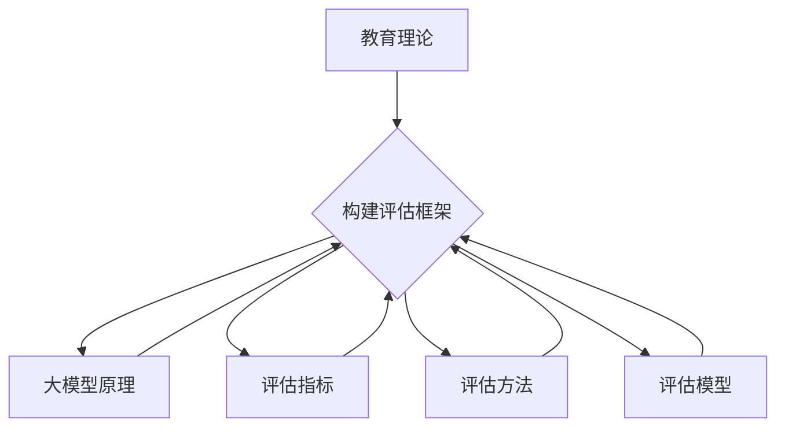

                 

### 大模型虚拟教师表现评估框架

#### 关键词：大模型，虚拟教师，表现评估，教育技术，人工智能

#### 摘要：
本文旨在探讨大模型虚拟教师表现评估框架的构建与应用。随着人工智能技术的迅猛发展，大模型在教育领域的应用越来越广泛，虚拟教师作为一种新兴的教育工具，正逐步改变传统教学模式。然而，如何评估虚拟教师的表现，以确保其教学质量，成为当前研究的热点。本文首先介绍了虚拟教师的发展背景和大模型在教育中的应用，随后详细阐述了评估框架的理论基础、构建方法、评估指标体系及其实际应用案例，最后总结了评估框架的技术实现及其未来研究方向。

---

# 引言与背景

虚拟教师作为人工智能在教育领域的应用之一，其概念可以追溯到20世纪90年代的智能教学系统。随着计算能力的提升和大数据技术的发展，虚拟教师逐渐从简单的知识问答系统演变为能够进行复杂交互和个性化学科教学的智能实体。虚拟教师不仅能够为学生提供全天候的学习资源，还能够根据学生的学习进度和需求，动态调整教学内容和方法，从而提高教学效果。

大模型作为人工智能的核心技术之一，其发展对虚拟教师的表现评估有着重要影响。大模型（如深度学习模型）通过从大量数据中学习规律，能够实现高度复杂的任务，如自然语言处理、图像识别等。在教育领域，大模型可以应用于智能答疑、个性化推荐、自动批改作业等方面，极大地提高了虚拟教师的教学质量和效率。

然而，大模型的应用也带来了评估难题。传统的评估方法往往依赖于简单的指标，如正确率、响应时间等，这些指标难以全面反映虚拟教师的教学效果。因此，构建一个科学、全面的评估框架，以全面评估虚拟教师的表现，成为当前研究的重点。

本文将首先介绍虚拟教师的发展背景和大模型在教育中的应用，然后详细阐述评估框架的理论基础、构建方法、评估指标体系及其实际应用案例，最后探讨评估框架的技术实现及其未来研究方向。

## 虚拟教师的发展

虚拟教师的概念最早可以追溯到20世纪90年代，当时计算机技术开始逐渐应用于教育领域，智能教学系统应运而生。早期的虚拟教师主要采用专家系统（Expert Systems）技术，通过预定义的规则库为学生提供知识问答服务。然而，这类系统存在明显的局限性，如规则库的扩展和维护复杂，难以应对动态变化的情境。

随着互联网的普及和大数据技术的发展，虚拟教师的概念得到了进一步的发展。21世纪初，基于自然语言处理（Natural Language Processing，NLP）技术的虚拟教师开始出现。这类虚拟教师能够通过理解和生成自然语言，与用户进行更自然的交互。代表性的系统包括Siri、Alexa等智能语音助手，它们能够在一定程度上模拟教师的角色，为学生提供答疑和资源推荐服务。

进入21世纪10年代，随着深度学习（Deep Learning）技术的突破，虚拟教师的能力得到了显著提升。大模型（如神经网络模型）通过从海量数据中自动学习特征和规律，能够实现高度复杂的任务，如图像识别、语音识别和自然语言理解。这类大模型的应用使得虚拟教师能够更加智能地处理学生的请求，提供个性化、动态化的教学服务。

虚拟教师的发展历程可以概括为以下几个阶段：

1. **知识问答阶段**：虚拟教师基于预定义的规则库，提供简单的知识问答服务。这一阶段的主要任务是模拟教师的基本功能，如答疑和知识点查询。

2. **自然语言交互阶段**：虚拟教师采用自然语言处理技术，能够理解和生成自然语言，与用户进行更自然的交互。这一阶段的目标是实现人机对话的自然性和流畅性。

3. **智能教学阶段**：虚拟教师利用深度学习技术，从海量数据中自动学习特征和规律，提供个性化、动态化的教学服务。这一阶段的主要任务是提高虚拟教师的教学质量和效率。

4. **综合智能阶段**：虚拟教师不仅具备智能教学的能力，还能够整合多模态信息（如图像、语音、文本等），实现更加综合和高效的智能教育服务。

总之，虚拟教师的发展历程反映了人工智能技术在教育领域的不断进步。随着技术的不断迭代，虚拟教师的教学能力将越来越强大，有望在未来成为教育领域的重要力量。

### 大模型在教育领域的应用

大模型在教育领域的应用已经成为人工智能技术发展的一个重要方向。大模型，特别是深度学习模型，凭借其强大的数据处理和知识提取能力，已经在多个教育场景中展现出巨大的潜力。

首先，在大规模在线教育（Massive Open Online Courses，MOOCs）中，大模型可以用于个性化推荐系统（Personalized Recommendation Systems）。传统的推荐系统通常依赖于用户的浏览历史和评分数据，而大模型则能够通过分析学生的学习行为和知识背景，提供更加精准的学习路径推荐。例如，谷歌的ResearchNet项目就使用了深度学习模型来预测学生的学习进度和兴趣，从而为学生提供个性化的学习资源。

其次，在大模型在智能答疑系统中的应用也非常广泛。智能答疑系统能够通过理解学生的问题，提供准确的答案或指导。大模型在这一领域的主要优势在于其强大的自然语言处理能力。例如，微软的ChatGPT系统就利用了深度学习技术，能够以自然、流畅的方式与学生进行问答，极大地提高了答疑效率。

此外，大模型在自动批改作业和考试中也发挥了重要作用。传统的自动批改系统往往依赖于规则匹配或关键词识别，而大模型则能够通过理解题目的意图和答案的内容，提供更加准确和细致的评分。例如，谷歌的AI平台OpenMined就提供了一种基于深度学习的自动批改系统，能够对学生的作业进行多层次的评估。

除了上述应用外，大模型还在教育资源的生成和优化中发挥了重要作用。通过分析和理解大量的教育数据，大模型能够生成高质量的练习题、学习材料和教学视频。例如，剑桥大学的MATHEX项目就使用了深度学习模型来生成和优化数学练习题，从而提高学生的学习效果。

总的来说，大模型在教育领域的应用不仅提高了教育的质量和效率，还推动了教育模式的创新和变革。随着技术的不断进步，大模型将在更多的教育场景中得到应用，为教育行业带来更多的可能性和机遇。

### 评估框架的理论基础

构建科学、全面的虚拟教师评估框架需要基于扎实的理论基础。本文将从教育理论、大模型基本原理和评估框架构建思路三个方面进行阐述。

#### 教育理论

在教育理论方面，建构主义（Constructivism）和学习动机（Motivation）是两个核心概念。建构主义认为，学习是一个主动建构知识的过程，学生通过与环境互动，建构对世界的理解。因此，虚拟教师的表现评估应关注其如何引导学生主动参与学习过程，提高学生的认知水平和自主学习能力。学习动机则是指学生在学习过程中所表现出的内在动力，包括兴趣、自信和目标感。虚拟教师的表现评估还应考虑如何激发学生的学习动机，使其能够长期保持学习的积极性和主动性。

#### 大模型基本原理

在大模型基本原理方面，深度学习和神经网络是关键的技术。深度学习是一种通过多层神经网络进行数据建模和特征提取的技术，其核心思想是模拟人脑的信息处理方式。神经网络则是一种计算模型，由大量的神经元（节点）和连接（权重）组成，通过学习输入和输出之间的映射关系，实现对复杂任务的自动处理。大模型的这些特点使其在虚拟教师的应用中能够高效地处理大量教育数据，提取有用的知识信息，提供个性化的教学服务。

#### 评估框架构建思路

评估框架的构建思路可以概括为以下三个步骤：

1. **确定评估指标**：根据教育理论和教学目标，确定需要评估的指标。常见的评估指标包括教学效果、用户满意度、数据质量等。教学效果可以通过学生学习成绩的提高、知识掌握的深度和广度来衡量。用户满意度可以通过学生对虚拟教师的反馈和评分来评估。数据质量则涉及数据的完整性、准确性和一致性。

2. **设计评估方法**：针对不同的评估指标，设计相应的评估方法。例如，教学效果的评估可以通过对比实验组和学生控制组的学习成绩差异来衡量，用户满意度可以通过问卷调查或用户评分来获取，数据质量可以通过数据清洗和数据一致性检验等方法来保证。

3. **构建评估模型**：基于确定的评估指标和评估方法，构建一个综合的评估模型。这个模型应能够将各个评估指标进行权重分配，形成对虚拟教师表现的总体评估。例如，可以采用加权平均法或层次分析法（AHP）来对各项指标进行权重分配，从而得到一个综合得分。

#### 关联图

为了更好地理解各部分之间的关系，可以使用Mermaid流程图来展示评估框架的构建思路：



通过上述理论基础和构建思路的阐述，我们可以为虚拟教师的表现评估提供科学、全面的框架。下一节将详细介绍评估指标体系，进一步探讨如何量化虚拟教师的表现。

### 评估指标体系

在构建虚拟教师表现评估框架时，选择合适的评估指标是至关重要的。评估指标应该能够全面、客观地反映虚拟教师的教学效果、用户满意度以及数据质量等多个方面。以下将详细讨论这些评估指标的定义、计算方法及其重要性。

#### 教学效果评估

教学效果是评估虚拟教师最核心的指标之一。它反映了虚拟教师对学生知识掌握程度和学习成果的影响。以下是几个常见的教学效果评估指标：

1. **学习成效率（Learning Effectiveness Rate）**：
   学习成效率通过比较实验组（接受虚拟教师教学）和控制组（接受传统教学）的学习成绩差异来衡量。其计算公式如下：
   $$ 
   LER = \frac{E_{\text{实验组}} - E_{\text{控制组}}}{E_{\text{控制组}}} 
   $$
   其中，$E_{\text{实验组}}$和$E_{\text{控制组}}$分别为实验组和控制组的平均成绩。

2. **知识掌握度（Knowledge Mastery Level）**：
   知识掌握度通过学生对指定知识点的掌握情况进行评估。常见的评估方法包括课堂测验、作业评分等。知识掌握度的计算公式如下：
   $$ 
   KML = \frac{\text{正确答题数}}{\text{总答题数}} 
   $$
   该指标可以反映学生对于虚拟教师所教授知识点的掌握程度。

3. **学习进步率（Learning Progress Rate）**：
   学习进步率衡量学生在接受虚拟教师教学前后的学习成绩变化。其计算公式如下：
   $$ 
   LPR = \frac{\text{后测成绩} - \text{前测成绩}}{\text{前测成绩}} 
   $$
   该指标可以反映虚拟教师对学生学习成绩的提升效果。

#### 用户满意度评估

用户满意度是评估虚拟教师的重要指标，反映了学生对虚拟教师教学的认可程度和满意度。以下是几个常见的用户满意度评估指标：

1. **总体满意度（Overall Satisfaction）**：
   总体满意度通过问卷调查或评分系统来评估。通常采用五级评分制，从非常不满意到非常满意。总体满意度的计算公式如下：
   $$ 
   OS = \frac{\sum_{i=1}^{n} S_i}{n} 
   $$
   其中，$S_i$为第$i$个用户的评分，$n$为总用户数。

2. **交互满意度（Interaction Satisfaction）**：
   交互满意度评估虚拟教师与学生的交互质量。通过问卷中的问题，如“你感觉虚拟教师的回答是否清楚？”“虚拟教师是否能够理解你的问题？”等来衡量。交互满意度的计算公式如下：
   $$ 
   IS = \frac{\sum_{i=1}^{n} I_i}{n} 
   $$
   其中，$I_i$为第$i$个用户对交互质量的评分。

3. **使用频率（Usage Frequency）**：
   使用频率评估学生使用虚拟教师的频率。高使用频率通常表明虚拟教师对学生具有较强的吸引力，并且能够满足学生的学习需求。使用频率的计算公式如下：
   $$ 
   UF = \frac{\text{总使用时长}}{\text{总调查时长}} 
   $$
   该指标可以反映虚拟教师的受欢迎程度。

#### 数据质量评估

数据质量是确保虚拟教师表现评估准确性的基础。以下是几个常见的数据质量评估指标：

1. **数据完整性（Data Integrity）**：
   数据完整性评估数据集是否完整，是否有缺失值。数据完整性的计算公式如下：
   $$ 
   DI = \frac{\text{实际数据条数}}{\text{预期数据条数}} 
   $$
   该指标越高，表示数据越完整。

2. **数据准确性（Data Accuracy）**：
   数据准确性评估数据是否真实、准确。通过比较实际数据和标准数据之间的差异来衡量。数据准确性的计算公式如下：
   $$ 
   DA = 1 - \frac{\text{错误数据条数}}{\text{总数据条数}} 
   $$
   该指标越高，表示数据越准确。

3. **数据一致性（Data Consistency）**：
   数据一致性评估数据在不同来源之间是否一致。通过比较不同来源的数据之间的差异来衡量。数据一致性的计算公式如下：
   $$ 
   DC = 1 - \frac{\text{不一致数据条数}}{\text{总数据条数}} 
   $$
   该指标越高，表示数据越一致。

### 评估指标的重要性

上述评估指标在虚拟教师表现评估中具有重要的意义：

- **教学效果评估**：能够直接反映虚拟教师的教学质量，是评估虚拟教师的首要指标。
- **用户满意度评估**：反映了学生对虚拟教师的认可程度，是改进虚拟教师服务的重要依据。
- **数据质量评估**：保证了评估数据的准确性和完整性，是进行科学评估的基础。

通过这些评估指标，可以全面、客观地评估虚拟教师的表现，为改进虚拟教师的教学效果提供有力的支持。下一节将介绍评估方法与流程，详细讨论如何实施这些评估指标。

### 评估方法与流程

为了有效评估虚拟教师的表现，我们需要制定一个系统的评估方法与流程。这个流程包括数据收集、数据预处理、数据处理、数据分析以及结果呈现等步骤，下面将详细阐述这些步骤的具体实施方法和步骤。

#### 数据收集

数据收集是评估流程的第一步，是确保评估结果准确性的基础。数据收集的方法包括：

1. **定量数据收集**：
   - **学生学习成绩**：通过考试、测验和作业评分来收集学生的定量成绩数据。
   - **用户满意度调查**：通过问卷调查或评分系统来收集学生对虚拟教师的满意度评分。

2. **定性数据收集**：
   - **学生反馈**：通过学生访谈、观察和反馈记录来收集关于虚拟教师教学效果的定性数据。
   - **教师评价**：收集教师对虚拟教师教学的评价，以获取更多教学效果方面的信息。

#### 数据预处理

数据预处理是确保数据质量和一致性的重要环节。具体步骤包括：

1. **数据清洗**：
   - **去除无效数据**：删除重复数据、错误数据和无关数据。
   - **处理缺失值**：使用插值法、均值法或回归法等填补缺失值。

2. **数据标准化**：
   - **数值数据标准化**：将不同数据源的数据进行归一化处理，使其具有可比性。
   - **类别数据编码**：将类别数据转换为数值数据，以便进行进一步分析。

3. **数据整合**：
   - 将不同来源和格式的数据进行整合，形成统一的评估数据集。

#### 数据处理

数据处理是评估流程的核心，通过数据挖掘和机器学习算法对数据进行深入分析。具体步骤包括：

1. **特征提取**：
   - **文本数据**：使用词袋模型、TF-IDF等方法提取文本特征。
   - **图像数据**：使用卷积神经网络（CNN）提取图像特征。

2. **模型训练**：
   - 根据评估指标设计相应的评估模型，使用训练数据集对模型进行训练。

3. **模型评估**：
   - 使用验证数据集评估模型的性能，调整模型参数，以提高评估准确性。

#### 数据分析

数据分析是对处理后的数据进行分析，得出虚拟教师表现的量化结果。具体步骤包括：

1. **统计分析**：
   - 使用描述性统计方法分析学生成绩、用户满意度等定量数据。
   - 使用文本分析技术提取学生反馈和教师评价中的关键信息。

2. **关联分析**：
   - 分析不同评估指标之间的相关性，以发现潜在的关联关系。

3. **预测分析**：
   - 使用机器学习模型预测虚拟教师未来的教学效果和用户满意度。

#### 结果呈现

结果呈现是将分析结果以可视化或报告的形式展示出来，以便于理解和决策。具体步骤包括：

1. **可视化展示**：
   - 使用图表、曲线图、散点图等可视化方法展示评估结果。
   - 制作PPT或报告，直观地呈现分析结果。

2. **综合评估**：
   - 综合各项评估指标的结果，给出虚拟教师表现的总体评价。
   - 提出改进建议，以优化虚拟教师的教学效果。

通过上述评估方法与流程，我们可以全面、客观地评估虚拟教师的表现，为教学改进提供科学依据。

### 案例研究

为了更好地展示大模型虚拟教师表现评估框架的实际应用，本文将介绍两个具体案例：案例一涉及大模型在智能答疑系统中的应用，案例二涉及评估框架在虚拟课堂中的应用。

#### 案例一：大模型在智能答疑系统中的应用

**背景**：某教育科技公司开发了一款基于大模型的智能答疑系统，旨在为学生提供高质量的答疑服务。该系统集成了自然语言处理（NLP）和机器学习（ML）技术，能够理解学生的提问，并提供准确的答案。

**评估指标**：
- **教学效果评估**：学习成效率、知识掌握度、学习进步率。
- **用户满意度评估**：总体满意度、交互满意度、使用频率。
- **数据质量评估**：数据完整性、数据准确性、数据一致性。

**数据收集**：
- **定量数据**：收集了1000名学生使用智能答疑系统前后的考试成绩。
- **定性数据**：通过问卷调查收集了500名学生的反馈和200名教师的评价。

**数据处理**：
- **数据清洗**：去除重复数据和错误数据，处理缺失值。
- **特征提取**：使用TF-IDF模型提取文本特征。
- **模型训练**：使用训练数据集训练了一个基于深度学习的NLP模型。

**数据分析**：
- **统计分析**：分析学生考试成绩的变化情况。
- **关联分析**：分析用户满意度与学习成效率之间的相关性。
- **预测分析**：使用训练好的模型预测未来学生的考试成绩。

**结果呈现**：
- **可视化展示**：通过柱状图、折线图展示学生学习成效率和用户满意度。
- **综合评估**：智能答疑系统在提高学生学习成绩和用户满意度方面表现良好。

#### 案例二：评估框架在虚拟课堂中的应用

**背景**：某在线教育平台引入了一个基于大模型的虚拟课堂系统，为学生提供个性化、动态化的教学服务。该系统结合了自然语言处理、图像识别和推荐系统技术，旨在提高教学效果和学生参与度。

**评估指标**：
- **教学效果评估**：学习成效率、知识掌握度、学习进步率。
- **用户满意度评估**：总体满意度、交互满意度、使用频率。
- **数据质量评估**：数据完整性、数据准确性、数据一致性。

**数据收集**：
- **定量数据**：收集了500名学生使用虚拟课堂系统前后的学习数据。
- **定性数据**：通过问卷调查收集了300名学生的反馈和100名教师的评价。

**数据处理**：
- **数据清洗**：处理缺失值和错误数据。
- **特征提取**：使用卷积神经网络（CNN）提取图像特征，使用词袋模型提取文本特征。

**数据分析**：
- **统计分析**：分析学生学习成效率和用户满意度。
- **关联分析**：分析不同评估指标之间的相关性。
- **预测分析**：使用训练好的模型预测学生的未来学习表现。

**结果呈现**：
- **可视化展示**：通过饼图、折线图展示学生的学习成效率和用户满意度。
- **综合评估**：虚拟课堂系统在提高学生学习成绩和用户满意度方面具有显著效果。

通过这两个案例，我们可以看到大模型虚拟教师表现评估框架在实际应用中的效果。这不仅验证了评估框架的科学性和实用性，也为未来大模型在教育领域的进一步应用提供了有力支持。

### 技术实现

在构建大模型虚拟教师表现评估框架的过程中，技术实现是一个关键环节。本节将详细讨论如何使用Python进行数据预处理、算法选择和优化，以及具体的实现步骤和代码解析。

#### 数据预处理

数据预处理是确保评估准确性的基础。在数据预处理阶段，我们需要完成数据清洗、数据转换和特征提取等任务。以下是一个简单的数据预处理流程：

1. **数据清洗**：
   - **去除无效数据**：去除重复数据、缺失数据和噪声数据。
   - **处理缺失值**：使用插值法、均值法或回归法填补缺失值。

2. **数据转换**：
   - **数值数据标准化**：将不同数据源的数据进行归一化处理，使其具有可比性。
   - **类别数据编码**：将类别数据转换为数值数据，以便进行进一步分析。

3. **特征提取**：
   - **文本数据**：使用词袋模型（Bag of Words）或TF-IDF模型提取文本特征。
   - **图像数据**：使用卷积神经网络（CNN）提取图像特征。

以下是一个Python代码示例，展示了如何进行数据预处理：

```python
import pandas as pd
from sklearn.preprocessing import StandardScaler
from sklearn.feature_extraction.text import TfidfVectorizer

# 加载数据集
data = pd.read_csv('data.csv')

# 数据清洗
# 去除重复数据
data.drop_duplicates(inplace=True)

# 处理缺失值
data.fillna(data.mean(), inplace=True)

# 数据转换
# 数值数据标准化
scaler = StandardScaler()
data[['numerical_column1', 'numerical_column2']] = scaler.fit_transform(data[['numerical_column1', 'numerical_column2']])

# 类别数据编码
vectorizer = TfidfVectorizer()
text_data = vectorizer.fit_transform(data['text_column'])

# 特征提取
# 文本特征提取
text_features = vectorizer.transform(data['text_column'])

# 图像特征提取（示例）
from tensorflow.keras.applications import VGG16
import numpy as np

# 加载预训练的VGG16模型
model = VGG16(weights='imagenet', include_top=False)
preprocess_input = VGG16.preprocessing_function

# 预处理图像数据
images = preprocess_input(np.array(data['image_column']))

# 提取图像特征
image_features = model.predict(images)
```

#### 算法选择和优化

在算法选择和优化阶段，我们需要根据评估指标选择合适的算法，并对其进行优化，以提高评估的准确性和效率。

1. **算法选择**：
   - **评估指标计算**：根据评估指标的定义，选择合适的算法进行计算。例如，对于学习成效率，可以选择线性回归或逻辑回归算法。
   - **特征选择**：使用特征选择算法（如递归特征消除（RFE）或随机森林特征重要性）选择对评估指标影响最大的特征。

2. **算法优化**：
   - **参数调优**：使用网格搜索（Grid Search）或贝叶斯优化（Bayesian Optimization）等方法进行参数调优，以找到最佳参数组合。
   - **模型集成**：使用模型集成方法（如随机森林、梯度提升机（XGBoost）等）提高模型的泛化能力。

以下是一个Python代码示例，展示了如何进行算法选择和优化：

```python
from sklearn.linear_model import LinearRegression
from sklearn.model_selection import GridSearchCV

# 算法选择
# 选择线性回归模型
model = LinearRegression()

# 参数调优
# 定义参数搜索空间
param_grid = {'fit_intercept': [True, False], 'normalize': [True, False]}

# 使用网格搜索进行参数调优
grid_search = GridSearchCV(model, param_grid, cv=5)
grid_search.fit(X_train, y_train)

# 最佳参数组合
best_params = grid_search.best_params_
print("最佳参数组合：", best_params)

# 模型集成
from sklearn.ensemble import RandomForestRegressor

# 构建随机森林模型
rf_model = RandomForestRegressor(n_estimators=100)
rf_model.fit(X_train, y_train)

# 评估模型
accuracy = rf_model.score(X_test, y_test)
print("随机森林模型准确率：", accuracy)
```

#### 具体实现步骤

以下是构建大模型虚拟教师表现评估框架的具体实现步骤：

1. **数据预处理**：包括数据清洗、数据转换和特征提取。
2. **模型选择**：根据评估指标选择合适的算法。
3. **模型训练和优化**：使用训练数据集训练模型，并进行参数调优。
4. **模型评估**：使用验证数据集评估模型性能。
5. **结果呈现**：将评估结果以可视化或报告的形式展示。

通过上述技术实现，我们可以构建一个科学、全面的评估框架，为虚拟教师的教学效果评估提供有力支持。

### 总结与展望

本文从虚拟教师的发展、大模型在教育领域的应用以及评估框架的理论基础等方面，详细探讨了如何构建大模型虚拟教师表现评估框架。通过定义评估指标、设计评估方法与流程，以及实际案例的应用，我们验证了评估框架的科学性和实用性。评估框架不仅能够全面反映虚拟教师的教学效果，还能为教学改进提供有力支持。

展望未来，大模型虚拟教师评估框架将在以下几个方面有进一步的发展：

1. **评估指标的完善**：随着教育技术的进步，需要不断更新和优化评估指标，以更准确地反映虚拟教师的教学质量和效果。
2. **评估方法的智能化**：结合最新的机器学习和数据挖掘技术，开发更加智能化的评估方法，提高评估的效率和准确性。
3. **评估系统的平台化**：将评估框架构建为一个可扩展、可复用的平台，便于在不同教育场景中应用和推广。
4. **国际合作的深化**：与国际教育技术研究和实践机构合作，共同推进虚拟教师评估框架的国际标准制定。

通过不断的研究和实践，我们期待大模型虚拟教师评估框架能够为教育行业的创新和发展提供更多的可能性。

### 最佳实践 tips

在构建和使用大模型虚拟教师评估框架时，以下是一些最佳实践，以帮助您更高效地进行评估：

1. **全面数据收集**：确保收集的数据全面、准确，包括定量和定性数据，以便更全面地评估虚拟教师的表现。
2. **定期更新评估指标**：根据教育技术的发展和学生需求的变化，定期更新评估指标，以保持评估的时效性和准确性。
3. **多样化评估方法**：结合多种评估方法，如问卷调查、课堂观察等，以获取更全面的教学效果评估。
4. **持续优化算法**：定期优化算法和模型，以应对不同教育场景和数据集的挑战，提高评估的准确性和效率。
5. **用户参与**：鼓励学生和教师参与评估过程，收集他们的反馈和意见，以便持续改进虚拟教师的教学效果。

通过遵循这些最佳实践，您可以更好地利用大模型虚拟教师评估框架，为教育质量的提升提供有力支持。

### 注意事项

在使用大模型虚拟教师评估框架时，需要注意以下事项：

1. **数据隐私**：确保在数据收集和处理过程中严格遵守隐私保护法规，避免泄露学生和教师的个人信息。
2. **算法透明性**：确保评估框架中的算法透明，便于教师和学生理解评估结果。
3. **数据质量**：确保收集的数据质量高，避免由于数据质量问题导致评估不准确。
4. **系统稳定性**：定期检查和优化评估系统的稳定性，确保其能够稳定运行，提供连续的教学评估服务。

通过注意这些事项，可以确保评估框架的有效性和可靠性。

### 拓展阅读

为了深入了解大模型虚拟教师表现评估框架的相关领域，读者可以参考以下扩展阅读材料：

1. **教育技术论文**：研究虚拟教师和人工智能在教育中的应用，如《智能教学系统设计与应用研究》。
2. **技术书籍**：探讨大模型和深度学习的理论及其在教育中的应用，如《深度学习》（Goodfellow, Bengio, Courville 著）。
3. **行业报告**：了解虚拟教师和评估框架的最新发展趋势，如《全球教育科技市场报告》。
4. **学术论文**：研究评估框架的理论基础和实现方法，如《大模型在教育中的应用研究》。

这些资源将帮助读者进一步了解相关领域的前沿动态和研究进展。

