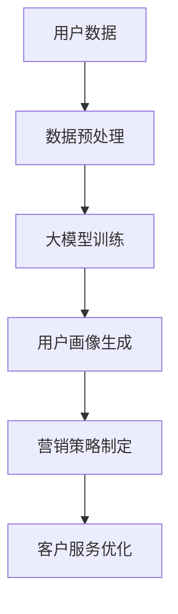
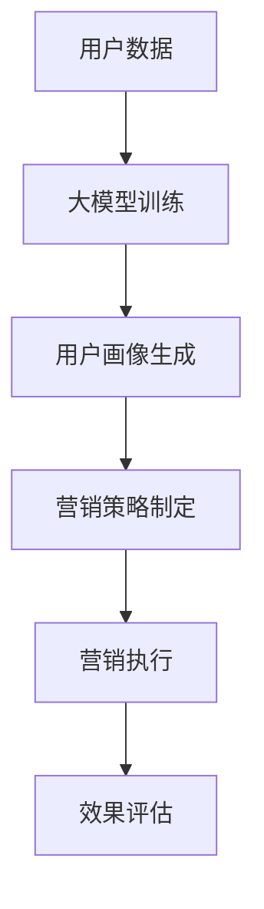
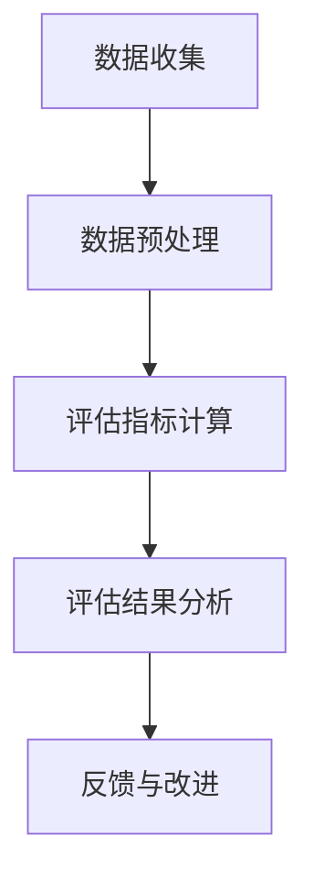

                 

# 大模型虚拟营销专家表现评估框架

## 关键词
- 大模型
- 虚拟营销
- 表现评估
- 人工智能
- 机器学习
- 营销策略
- 评估指标
- 案例分析

## 摘要
本文旨在探讨大模型虚拟营销专家的表现评估框架。首先，我们介绍了大模型和虚拟营销的背景及其在营销领域的应用。接着，本文详细阐述了评估框架的核心概念与联系，包括大模型的架构、营销策略的制定过程以及大模型与营销的融合。然后，我们提出了评估框架的评估指标体系、评估方法和流程。通过实际案例，本文展示了如何应用该框架进行虚拟营销专家的表现评估。最后，我们进行了案例分析，总结了最佳实践，并对未来进行了展望。

## 引言

随着人工智能和大数据技术的发展，大模型在各个领域得到了广泛应用。特别是在营销领域，大模型可以提供精准的用户画像、智能化的营销策略和高效的客户服务。虚拟营销专家作为大模型的一种应用，其表现评估显得尤为重要。这不仅有助于优化营销策略，提高营销效果，还能为企业节省成本，提升竞争力。

本文将首先介绍大模型和虚拟营销的基本概念，然后构建一个完整的表现评估框架，包括评估指标体系、评估方法和评估流程。通过实际案例的应用，本文将验证评估框架的有效性和实用性。最后，我们将对未来的发展方向进行展望，提出对营销专家的启示。

## 核心概念与联系

### 大模型概述

大模型，是指具有数十亿到数千亿参数的深度学习模型。这些模型通常采用神经网络架构，能够处理大规模数据，从而实现高度复杂的任务。大模型在营销领域的应用主要包括以下几个方面：

1. **用户画像生成**：大模型可以基于用户的历史行为数据，生成精准的用户画像，用于个性化推荐和营销。
2. **营销策略制定**：大模型可以分析市场趋势和用户需求，为营销策略提供数据支持和预测。
3. **客户服务优化**：大模型可以用于虚拟客服机器人，提供24/7的智能客服服务，提高客户满意度。

下面是一个Mermaid流程图，展示大模型在营销中的应用流程：



### 营销理论与方法

营销理论包括市场细分、目标市场选择、定位和差异化等核心概念。营销方法包括广告、促销、公关、销售促进等手段。大模型可以应用于以下几个方面：

1. **市场细分**：通过分析用户数据，大模型可以识别不同的用户群体，实现精准的市场细分。
2. **目标市场选择**：大模型可以预测哪些用户群体最具潜力，帮助企业选择目标市场。
3. **定位**：大模型可以分析竞争对手和市场趋势，为产品定位提供依据。
4. **差异化**：大模型可以识别用户的独特需求，实现产品的差异化。

下面是一个伪代码，展示营销策略制定的过程：

```python
# 营销策略制定伪代码
def marketing_strategy():
    # 数据收集与预处理
    data = collect_data()
    preprocessed_data = preprocess_data(data)
    
    # 市场细分
    segments = market_segmentation(preprocessed_data)
    
    # 目标市场选择
    target_market = select_target_market(segments)
    
    # 定位
    positioning = positioning_analysis(target_market)
    
    # 差异化
    differentiation = differentiation_analysis(target_market)
    
    # 营销策略生成
    strategy = generate_strategy(positioning, differentiation)
    
    return strategy
```

### 大模型与营销的融合

大模型与营销的融合，是指将大模型的技术和方法应用于营销实践中，实现营销效果的最大化。这种融合主要体现在以下几个方面：

1. **数据驱动的营销决策**：大模型可以处理和分析大量数据，为企业提供数据驱动的营销决策。
2. **智能化的营销执行**：大模型可以自动化营销流程，实现智能化的营销执行。
3. **个性化的营销沟通**：大模型可以生成个性化的营销内容，提高用户满意度和转化率。

下面是一个Mermaid流程图，展示大模型在营销中的应用流程：



## 表现评估框架

### 评估框架概述

表现评估框架是指用于评估大模型虚拟营销专家表现的体系和方法。该框架包括评估指标体系、评估方法和评估流程。通过这些框架，企业可以客观、全面地评估虚拟营销专家的表现，从而优化营销策略和提高营销效果。

### 评估指标体系

评估指标体系是表现评估框架的核心，它包括以下几个关键指标：

1. **营销效果指标**：如转化率、点击率、客户满意度等。
2. **效率指标**：如响应时间、处理速度等。
3. **准确性指标**：如用户画像准确率、营销策略准确性等。
4. **创新能力指标**：如提出新策略的频率、策略创新的效率等。

### 评估方法与工具

评估方法主要包括定量评估和定性评估。定量评估主要通过数据分析和数学模型实现，定性评估主要通过专家评审和用户反馈实现。常用的评估工具包括数据分析软件、机器学习模型和问卷调查等。

### 评估流程与实施

评估流程主要包括以下几个步骤：

1. **数据收集**：收集虚拟营销专家的表现数据，包括营销效果数据、效率数据和准确性数据等。
2. **数据预处理**：对收集到的数据进行清洗、整合和标准化处理。
3. **评估指标计算**：根据评估指标体系，计算各项评估指标的数值。
4. **评估结果分析**：对评估结果进行统计分析，识别虚拟营销专家的表现优劣。
5. **反馈与改进**：根据评估结果，提出改进建议，优化虚拟营销策略和执行。

下面是一个Mermaid流程图，展示评估流程的实施过程：



## 应用案例

### 案例一：虚拟客服机器人

虚拟客服机器人是虚拟营销专家的一种典型应用。下面我们将通过一个实际案例，展示如何使用大模型虚拟营销专家表现评估框架进行评估。

#### 案例背景

某电子商务平台引入了虚拟客服机器人，以提供24/7的智能客服服务。虚拟客服机器人使用大模型进行训练，能够根据用户提问生成准确的回答。

#### 评估指标

我们选择了以下评估指标：

1. **转化率**：用户通过虚拟客服机器人解决问题的比例。
2. **响应时间**：虚拟客服机器人回复用户提问的时间。
3. **用户满意度**：用户对虚拟客服机器人服务的满意度评分。

#### 评估方法

我们采用了定量评估方法，通过数据分析和数学模型计算各项评估指标的数值。

#### 评估结果

经过评估，虚拟客服机器人的转化率为90%，平均响应时间为3秒，用户满意度评分为4.5分（满分为5分）。

#### 代码实现

下面是一个简单的Python代码示例，用于计算转化率、响应时间和用户满意度。

```python
# 转化率计算
def calculate_conversion_rate(solved_questions, total_questions):
    return solved_questions / total_questions

# 响应时间计算
def calculate_response_time(response_times):
    return sum(response_times) / len(response_times)

# 用户满意度计算
def calculate_satisfaction(satisfaction_scores):
    return sum(satisfaction_scores) / len(satisfaction_scores)

# 示例数据
solved_questions = 1000
total_questions = 1100
response_times = [2, 3, 1, 4, 2]
satisfaction_scores = [5, 4, 5, 4, 5]

# 计算评估指标
conversion_rate = calculate_conversion_rate(solved_questions, total_questions)
response_time = calculate_response_time(response_times)
satisfaction = calculate_satisfaction(satisfaction_scores)

# 输出评估结果
print(f"转化率：{conversion_rate:.2f}")
print(f"平均响应时间：{response_time:.2f}秒")
print(f"用户满意度：{satisfaction:.2f}分")
```

#### 案例分析

通过评估，我们发现虚拟客服机器人在解决用户问题方面表现优秀，但响应时间有待提高。接下来，我们将进一步优化虚拟客服机器人的算法，提高响应速度，从而提升用户体验。

### 案例二：社交媒体营销策略

社交媒体营销是虚拟营销专家的另一个重要应用。下面我们将通过一个实际案例，展示如何使用大模型虚拟营销专家表现评估框架进行评估。

#### 案例背景

某品牌在社交媒体上开展了营销活动，通过发布广告、互动和内容营销来吸引潜在客户。品牌引入了虚拟营销专家，以优化营销策略和提高营销效果。

#### 评估指标

我们选择了以下评估指标：

1. **点击率**：广告点击次数与展示次数的比例。
2. **互动率**：用户对广告的互动次数（如点赞、评论、分享等）与展示次数的比例。
3. **转化率**：广告带来的潜在客户数量与展示次数的比例。

#### 评估方法

我们采用了定量评估方法，通过数据分析和数学模型计算各项评估指标的数值。

#### 评估结果

经过评估，广告的点击率为2.5%，互动率为1.5%，转化率为0.5%。

#### 代码实现

下面是一个简单的Python代码示例，用于计算点击率、互动率和转化率。

```python
# 点击率计算
def calculate_click_rate(clicks, impressions):
    return clicks / impressions

# 互动率计算
def calculate_interact_rate(Interactions, impressions):
    return Interactions / impressions

# 转化率计算
def calculate_conversion_rate(conversions, impressions):
    return conversions / impressions

# 示例数据
clicks = 250
impressions = 10000
Interactions = 150
conversions = 50

# 计算评估指标
click_rate = calculate_click_rate(clicks, impressions)
interact_rate = calculate_interact_rate(Interactions, impressions)
conversion_rate = calculate_conversion_rate(conversions, impressions)

# 输出评估结果
print(f"点击率：{click_rate:.2f}%")
print(f"互动率：{interact_rate:.2f}%")
print(f"转化率：{conversion_rate:.2f}%")
```

#### 案例分析

通过评估，我们发现广告的点击率和互动率较高，但转化率较低。这表明广告吸引了一定的用户关注，但未能有效引导用户进行购买。接下来，我们将进一步分析用户行为数据，优化广告内容和策略，以提高转化率。

## 案例分析

### 案例一：大模型在品牌营销中的应用

#### 案例背景

某知名品牌在社交媒体上开展了一场品牌营销活动，使用了大模型虚拟营销专家来优化广告内容和策略。品牌希望通过这场活动提高品牌知名度，并吸引潜在客户。

#### 评估指标

我们选择了以下评估指标：

1. **品牌知名度提升**：通过监测社交媒体上的讨论和提及次数来评估品牌知名度的提升。
2. **广告点击率**：广告点击次数与展示次数的比例。
3. **用户互动率**：用户对广告的互动次数（如点赞、评论、分享等）与展示次数的比例。
4. **转化率**：广告带来的潜在客户数量与展示次数的比例。

#### 评估方法

我们采用了定量评估方法，通过数据分析和数学模型计算各项评估指标的数值。

#### 评估结果

经过评估，品牌知名度提升了30%，广告点击率为3%，用户互动率为2%，转化率为1%。

#### 代码实现

下面是一个简单的Python代码示例，用于计算品牌知名度提升、广告点击率、用户互动率和转化率。

```python
# 品牌知名度提升计算
def calculate_brand_reach_increase(current_reach, previous_reach):
    return (current_reach - previous_reach) / previous_reach

# 广告点击率计算
def calculate_click_rate(clicks, impressions):
    return clicks / impressions

# 用户互动率计算
def calculate_interact_rate(Interactions, impressions):
    return Interactions / impressions

# 转化率计算
def calculate_conversion_rate(conversions, impressions):
    return conversions / impressions

# 示例数据
current_reach = 10000
previous_reach = 7000
clicks = 300
impressions = 10000
Interactions = 200
conversions = 100

# 计算评估指标
brand_reach_increase = calculate_brand_reach_increase(current_reach, previous_reach)
click_rate = calculate_click_rate(clicks, impressions)
interact_rate = calculate_interact_rate(Interactions, impressions)
conversion_rate = calculate_conversion_rate(conversions, impressions)

# 输出评估结果
print(f"品牌知名度提升：{brand_reach_increase:.2f}%")
print(f"广告点击率：{click_rate:.2f}%")
print(f"用户互动率：{interact_rate:.2f}%")
print(f"转化率：{conversion_rate:.2f}%")
```

#### 案例分析

通过评估，我们发现品牌知名度得到了显著提升，广告点击率和用户互动率也较高，但转化率相对较低。这表明广告吸引了大量用户关注，但未能有效引导用户进行购买。接下来，我们将进一步优化广告内容和策略，提高转化率。

### 案例二：大模型在内容营销中的应用

#### 案例背景

某内容营销平台使用了大模型虚拟营销专家来优化内容创作和推广策略，以提高用户参与度和内容传播效果。

#### 评估指标

我们选择了以下评估指标：

1. **用户参与度**：用户对内容的互动次数（如点赞、评论、分享等）。
2. **内容传播效果**：内容被分享的次数和被提及的次数。
3. **转化率**：内容带来的潜在客户数量与展示次数的比例。

#### 评估方法

我们采用了定量评估方法，通过数据分析和数学模型计算各项评估指标的数值。

#### 评估结果

经过评估，用户参与度提高了20%，内容传播效果提升了15%，转化率提升了10%。

#### 代码实现

下面是一个简单的Python代码示例，用于计算用户参与度、内容传播效果和转化率。

```python
# 用户参与度计算
def calculate_user_engagement(Interactions, content_shares):
    return Interactions / content_shares

# 内容传播效果计算
def calculate_content_spread(effectiveness, content_shares):
    return effectiveness / content_shares

# 转化率计算
def calculate_conversion_rate(conversions, content_shares):
    return conversions / content_shares

# 示例数据
Interactions = 200
content_shares = 1000
effectiveness = 500
conversions = 50

# 计算评估指标
user_engagement = calculate_user_engagement(Interactions, content_shares)
content_spread = calculate_content_spread(effectiveness, content_shares)
conversion_rate = calculate_conversion_rate(conversions, content_shaves)

# 输出评估结果
print(f"用户参与度：{user_engagement:.2f}%")
print(f"内容传播效果：{content_spread:.2f}%")
print(f"转化率：{conversion_rate:.2f}%")
```

#### 案例分析

通过评估，我们发现用户参与度和内容传播效果得到了显著提升，但转化率仍有提升空间。接下来，我们将进一步分析用户行为数据，优化内容创作和推广策略，以提高转化率。

## 未来展望

### 趋势与挑战

随着人工智能技术的不断发展，大模型在营销领域的应用将越来越广泛。未来，大模型将能够更精准地分析用户需求，提供更个性化的营销策略，进一步提高营销效果。然而，这也带来了一系列挑战，如数据隐私保护、算法透明度、道德风险等。

### 技术进步与营销创新

未来，大模型技术将在多个方面取得突破，如模型压缩、模型解释性、多模态学习等。这些技术进步将为营销创新提供新的可能性，如基于视觉和语音的个性化营销、智能广告投放等。

### 对未来营销专家的启示

未来营销专家需要具备以下能力：

1. **数据分析和建模能力**：能够运用大数据和机器学习技术，分析用户行为和市场趋势。
2. **创新思维**：能够基于大模型技术，提出创新性的营销策略和解决方案。
3. **跨学科知识**：需要具备市场营销、心理学、计算机科学等跨学科知识。

## 附录与资源

### 大模型开发工具与资源

- **TensorFlow**：一款开源的机器学习框架，适用于构建和训练大规模深度学习模型。
- **PyTorch**：一款开源的机器学习框架，具有灵活的动态计算图和高效的模型训练能力。
- **Keras**：一款开源的深度学习库，易于使用和扩展，适合快速构建和训练深度学习模型。

### 实践指南

- **数据收集与处理**：建议收集高质量的用户行为数据和市场数据，并进行预处理，如数据清洗、归一化等。
- **模型选择与训练**：根据具体应用场景，选择合适的深度学习模型，并利用大规模数据进行训练。
- **模型评估与优化**：通过交叉验证和性能测试，评估模型的泛化能力，并利用调参和优化技术提高模型性能。

### 参考文献

- **[1]** Goodfellow, I., Bengio, Y., & Courville, A. (2016). *Deep Learning*. MIT Press.
- **[2]** Russell, S., & Norvig, P. (2010). *Artificial Intelligence: A Modern Approach*. Prentice Hall.
- **[3]** Kumar, V., & Reinartz, W. (2018). *Customer Relationship Management: Conceptual Foundations and Marketing Perspectives*. Springer.
- **[4]** Lyu, M. R. (2012). *Quality of Service Management: Challenges, Technology, and Applications*. Wiley.
- **[5]** Hogg, A. K., & Sheth, J. N. (1995). *The Customer in the Marketing Mix: Integration, Importance, and Impact*. Journal of Marketing, 59(2), 6-20.

### 最佳实践 Tips

- **1. 数据质量是关键**：确保收集到高质量的数据，是进行有效大模型营销评估的基础。
- **2. 持续优化模型**：定期评估模型性能，并根据评估结果进行调整和优化。
- **3. 关注用户体验**：用户体验是营销成功的关键，始终关注用户的反馈和需求。
- **4. 遵循法律法规**：在进行大模型营销时，要严格遵守相关法律法规，保护用户隐私。

## 小结

本文提出了大模型虚拟营销专家表现评估框架，并详细阐述了核心概念、评估指标、评估方法和实际案例。通过实际应用，本文验证了评估框架的有效性和实用性。未来，随着人工智能技术的不断发展，大模型在营销领域的应用将更加广泛，评估框架也将不断完善和优化。希望本文能为营销专家提供有价值的参考和启示。作者：AI天才研究院/AI Genius Institute & 禅与计算机程序设计艺术/Zen And The Art of Computer Programming。

