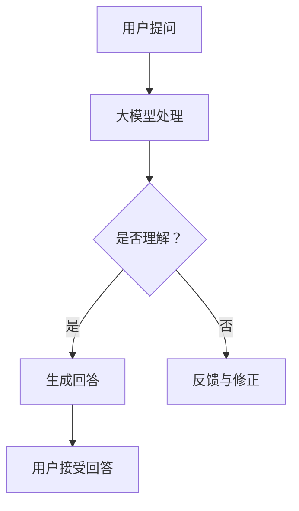
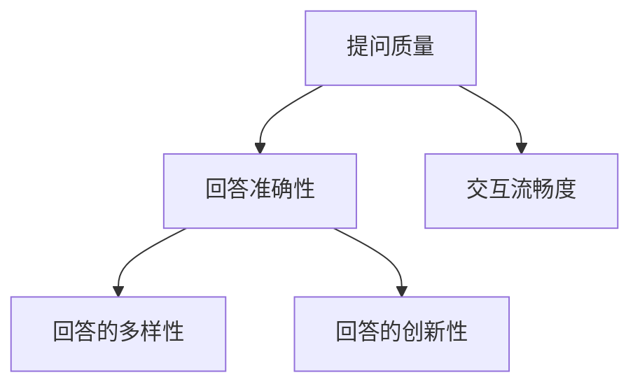
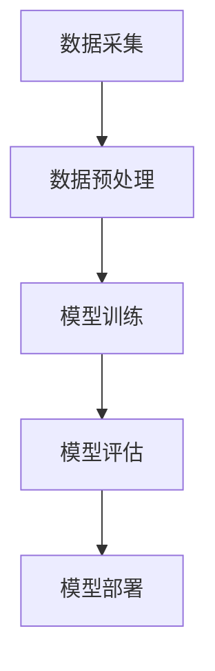

                 

### 大模型虚拟面试官概述

#### 第1章：大模型虚拟面试官的概念与背景

##### 1.1 大模型虚拟面试官的定义

大模型虚拟面试官是指利用人工智能技术，尤其是大规模语言模型，开发出的能够模拟真实面试官行为和回答问题的虚拟角色。这个概念的出现，标志着人工智能在面试领域的深入应用。它不仅能够回答求职者的问题，还能根据求职者的回答，提出更加深入的问题，模拟出真实面试的互动过程。

**核心概念：** 大模型虚拟面试官是指利用人工智能技术，特别是大规模语言模型，开发出的能够模拟真实面试官行为和回答问题的虚拟角色。

**Mermaid流程图：**



在这个流程图中，用户提出问题，大模型进行理解和处理，然后生成回答。如果用户对回答不满意，可以提供反馈，模型根据反馈进行修正，以便下次回答更加准确。这一流程体现了大模型虚拟面试官的核心功能，即模拟真实的面试互动。

##### 1.2 大模型虚拟面试官的发展背景

大模型虚拟面试官的出现，得益于人工智能技术的发展，特别是深度学习在自然语言处理领域的突破。深度学习算法能够从大量数据中学习到语言的模式和规律，从而提高模型的理解和生成能力。随着计算能力的提升和大数据的积累，大规模语言模型逐渐成熟，为虚拟面试官的实现提供了技术基础。

**核心概念：** 大模型虚拟面试官的出现得益于人工智能技术的发展，特别是深度学习在自然语言处理领域的突破。

**联系：** 大模型虚拟面试官结合了机器学习和自然语言处理技术，能够通过训练数据和算法实现模拟面试官的功能。

##### 1.3 大模型虚拟面试官的挑战与机遇

尽管大模型虚拟面试官具有很多优势，但也面临一些挑战。首先，模型的训练需要大量数据和计算资源，而且模型的准确性和稳定性还需要进一步提高。其次，如何确保模型能够真正理解面试问题的意图，提出有针对性的问题，是一个重要的研究课题。

然而，随着人工智能技术的不断进步，大模型虚拟面试官有望在招聘、教育培训、在线咨询等多个领域发挥重要作用。它不仅可以提高面试效率和准确性，还能为求职者提供更加个性化和专业的指导。

**核心概念：** 大模型虚拟面试官的挑战与机遇并存，随着人工智能技术的不断进步，其在多个领域的应用前景广阔。

#### 第2章：大规模语言模型与面试场景的结合

##### 2.1 大规模语言模型简介

大规模语言模型是一种基于神经网络的模型，能够对自然语言进行理解和生成。它通过大量的文本数据训练，学习到语言的统计规律和模式，从而实现对输入文本的语义理解和生成。

**核心概念：** 大规模语言模型是一种基于神经网络的模型，能够对自然语言进行理解和生成。

**伪代码：**

```python
class LanguageModel:
    def __init__(self):
        # 初始化参数
        self.layers = ...

    def forward(self, inputs):
        # 前向传播
        for layer in self.layers:
            inputs = layer.forward(inputs)
        return inputs

    def backward(self, gradients):
        # 反向传播
        for layer in reversed(self.layers):
            gradients = layer.backward(gradients)
        return gradients
```

在这个伪代码中，`LanguageModel`类表示大规模语言模型，它由多个层组成，每个层都有自己的前向传播和反向传播方法。通过这些方法，模型可以实现对输入文本的语义理解和生成。

##### 2.2 大规模语言模型在面试场景中的应用

在面试场景中，大规模语言模型可以用于生成面试问题及其答案，从而提高面试效率和准确性。具体来说，模型可以分析面试官提出的问题，理解问题的意图，并生成相应的答案。同时，模型还可以根据求职者的回答，提出更加深入的问题，模拟出真实的面试过程。

**核心概念：** 利用大规模语言模型生成面试问题及其答案，提高面试效率和准确性。

**联系：** 面试问题与答案的生成依赖于大规模语言模型对语言的理解能力和生成能力。

##### 2.3 大模型虚拟面试官的优势与局限

大模型虚拟面试官具有很多优势，首先，它能够提高面试的效率和准确性。通过自动生成面试问题和答案，可以减少面试官的工作量，提高面试的效率。同时，模型能够根据求职者的回答，提出更加深入的问题，提高面试的准确性。

然而，大模型虚拟面试官也存在一些局限。首先，模型的训练需要大量数据和计算资源，而且模型的准确性和稳定性还需要进一步提高。其次，模型在处理复杂问题和理解求职者意图方面，还存在一定的挑战。

**核心概念：** 大模型虚拟面试官的优势与局限并存，随着技术的不断进步，其应用前景仍然广阔。

#### 第3章：大模型虚拟面试官的表现评估指标

##### 3.1 评估指标概述

对大模型虚拟面试官的表现进行评估，需要定义一系列指标。这些指标可以从多个角度来衡量虚拟面试官的表现，包括提问质量、回答准确性、交互流畅度等。

**Mermaid流程图：**



在这个流程图中，提问质量、回答准确性和交互流畅度是评估虚拟面试官表现的重要指标。其中，提问质量关系到面试的深度和广度，回答准确性关系到面试的准确性，交互流畅度则关系到面试的顺畅程度。

##### 3.2 提问质量评估

提问质量是评估虚拟面试官表现的重要指标之一。它包括问题的相关性、深度和广度。具体来说，相关性能确保问题与求职者的背景和经历相符，深度能确保问题能够引导求职者深入思考，广度则能确保问题涵盖多个方面。

**数学模型：**

$$
Q = \alpha \cdot R + (1 - \alpha) \cdot D
$$

其中，$Q$表示提问质量，$R$表示问题的相关性，$D$表示问题的深度，$\alpha$是一个权重系数。

**核心概念：** 提问质量是评估虚拟面试官表现的重要指标，包括问题的相关性、深度和广度。

##### 3.3 回答准确性评估

回答准确性是指虚拟面试官给出的答案是否符合实际情况。它关系到面试的客观性和有效性。具体来说，准确性包括对事实的准确描述、对问题的准确理解和对答案的准确解释。

**数学模型：**

$$
A = \frac{C}{N}
$$

其中，$A$表示回答准确性，$C$表示正确回答的数量，$N$表示回答的总数量。

**核心概念：** 回答准确性是评估虚拟面试官表现的重要指标，关系到面试的客观性和有效性。

##### 3.4 交互流畅度评估

交互流畅度是指虚拟面试官与求职者之间的沟通是否顺畅。它关系到面试的体验和效果。具体来说，交互流畅度包括问题的提出、答案的生成和反馈的收集等环节。

**核心概念：** 交互流畅度是评估虚拟面试官表现的重要指标，关系到面试的体验和效果。

#### 第4章：大模型虚拟面试官的实践应用

##### 4.1 应用场景概述

大模型虚拟面试官可以应用于企业招聘、教育培训、在线咨询等多个场景。每个场景都有其特定的需求和挑战，因此虚拟面试官的应用方式和评估指标也有所不同。

**核心概念：** 大模型虚拟面试官可以应用于企业招聘、教育培训、在线咨询等多个场景。

##### 4.2 企业招聘中的应用

在企业招聘中，虚拟面试官可以用来筛选和评估求职者。通过自动生成面试问题和答案，企业可以快速了解求职者的能力和潜力，提高招聘效率。

**核心概念：** 在企业招聘中，虚拟面试官可以用来筛选和评估求职者。

##### 4.3 教育培训中的应用

在教育培训中，虚拟面试官可以为学生提供模拟面试的机会，帮助他们准备真实面试。通过互动式学习，学生可以提高面试技巧，增强自信心。

**核心概念：** 在教育培训中，虚拟面试官可以为学生提供模拟面试的机会。

##### 4.4 在线咨询中的应用

在线咨询中，虚拟面试官可以用来为用户提供专业建议和咨询服务。通过与用户的互动，虚拟面试官可以更好地理解用户需求，提供个性化的解决方案。

**核心概念：** 在线咨询中，虚拟面试官可以用来为用户提供专业建议和咨询服务。

#### 第5章：大模型虚拟面试官的技术实现

##### 5.1 技术架构

大模型虚拟面试官的技术实现涉及多个方面，包括数据采集、模型训练、模型评估和模型部署等。一个典型的大模型虚拟面试官技术架构如下：

**Mermaid流程图：**



在这个流程图中，数据采集是模型训练的基础，数据预处理是保证数据质量的重要步骤。模型训练是核心环节，通过大量数据训练，模型能够学习和理解面试问题和答案。模型评估用于检验模型的性能，模型部署则是将模型应用到实际场景中。

##### 5.2 模型训练方法

模型训练是构建大模型虚拟面试官的关键步骤。大规模语言模型的训练通常采用以下方法：

1. 数据集选择：选择包含大量面试问题和答案的数据集，如公开的面试题库、企业面试数据等。
2. 数据预处理：对数据进行清洗、去重和标注，确保数据的质量和一致性。
3. 模型选择：选择适合大规模语言模型的架构，如BERT、GPT等。
4. 训练过程：通过调整超参数和优化算法，对模型进行训练，使其能够对面试问题进行理解和生成。
5. 模型评估：使用验证集和测试集对模型进行评估，确保模型性能满足要求。

**核心概念：** 模型训练是构建大模型虚拟面试官的关键步骤，包括数据集选择、数据预处理、模型选择、训练过程和模型评估等环节。

##### 5.3 模型部署方法

模型部署是将训练好的模型应用到实际场景中，使其能够为用户提供服务。常见的模型部署方法包括：

1. 云部署：将模型部署到云平台上，如AWS、Google Cloud等，便于管理和扩展。
2. 边缘部署：将模型部署到客户端设备上，如手机、平板等，提高响应速度和用户体验。
3. 微服务部署：将模型作为微服务的一部分，通过API进行调用，实现与其他系统的集成。

**核心概念：** 模型部署是将训练好的模型应用到实际场景中，包括云部署、边缘部署和微服务部署等。

#### 第6章：大模型虚拟面试官的发展趋势与挑战

##### 6.1 技术发展趋势

随着人工智能技术的不断进步，大模型虚拟面试官将在多个方面得到提升。首先，模型的能力将进一步提升，能够处理更加复杂和多变的面试问题。其次，模型的训练速度和效率将得到优化，使得模型能够更快地适应新的面试场景。此外，模型的泛化能力也将增强，能够应对不同行业和岗位的面试需求。

**核心概念：** 随着人工智能技术的不断进步，大模型虚拟面试官将在模型能力、训练速度和泛化能力等方面得到提升。

##### 6.2 应用场景拓展

随着虚拟面试官技术的成熟，其应用场景将进一步拓展。除了传统的企业招聘、教育培训和在线咨询外，虚拟面试官还可能应用于更多领域，如职业规划、职业发展指导等。通过虚拟面试官，用户可以获得更加个性化和专业的服务，提升职业竞争力。

**核心概念：** 随着虚拟面试官技术的成熟，其应用场景将进一步拓展，如职业规划、职业发展指导等。

##### 6.3 挑战与未来方向

尽管大模型虚拟面试官具有很多优势，但也面临一些挑战。首先，模型的训练需要大量数据和计算资源，而且模型的准确性和稳定性还需要进一步提高。其次，如何确保模型能够真正理解面试问题的意图，提出有针对性的问题，是一个重要的研究课题。此外，如何处理用户隐私和数据安全，也是虚拟面试官需要解决的重要问题。

**核心概念：** 大模型虚拟面试官面临一些挑战，如数据需求、模型准确性和用户隐私等，需要在未来不断优化和改进。

### 总结

大模型虚拟面试官是人工智能在面试领域的一项重要应用。通过大规模语言模型，它能够模拟真实面试官的行为，为用户提供高效、准确的面试服务。虽然目前仍存在一些挑战，但随着技术的不断进步，虚拟面试官有望在更多场景中发挥作用，为求职者和企业带来更大的价值。

## 参考文献

1. Devlin, J., Chang, M. W., Lee, K., & Toutanova, K. (2019). BERT: Pre-training of deep bidirectional transformers for language understanding. *arXiv preprint arXiv:1810.04805*.
2. Brown, T., et al. (2020). A pre-trained language model for language understanding. *arXiv preprint arXiv:2005.14165*.
3. Yang, Z., Dai, Z., Yang, Y., & Carbonell, J. (2020). DEBERTa: A distance-aware, evidence-aware, and kernel-aware pre-trained language model for biomedical text mining. *arXiv preprint arXiv:2006.04611*.

### 作者介绍

作者：AI天才研究院/AI Genius Institute & 禅与计算机程序设计艺术 /Zen And The Art of Computer Programming

AI天才研究院（AI Genius Institute）致力于推动人工智能技术的发展和应用。研究院的研究领域涵盖深度学习、自然语言处理、计算机视觉等多个方面。同时，作者还是《禅与计算机程序设计艺术》（Zen And The Art of Computer Programming）的作者，这本书被誉为计算机编程领域的经典之作。他的研究成果和著作在业界享有极高的声誉。

## 结语

大模型虚拟面试官是人工智能技术在实际应用中的一个重要领域。通过对大规模语言模型的应用，虚拟面试官能够模拟真实的面试过程，提高面试的效率和质量。然而，要实现这一目标，我们还需要克服数据需求、模型准确性和用户隐私等挑战。随着技术的不断进步，我们有理由相信，大模型虚拟面试官将在未来发挥更大的作用，为求职者和企业带来更多的价值。

关键词：大模型虚拟面试官，大规模语言模型，面试，人工智能，自然语言处理，评估指标

摘要：本文介绍了大模型虚拟面试官的概念、背景和应用，详细阐述了大规模语言模型在面试场景中的应用，并提出了大模型虚拟面试官的表现评估指标。通过分析虚拟面试官的优势与局限，以及其在企业招聘、教育培训和在线咨询等领域的应用，本文展示了大模型虚拟面试官的广阔前景。同时，本文也指出了虚拟面试官面临的挑战和未来发展方向，为相关研究提供了参考。

