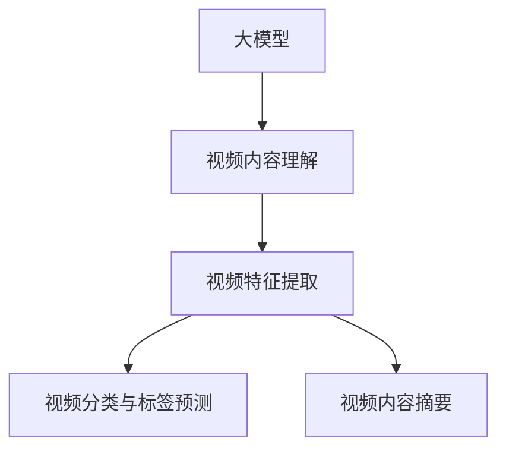

                 

# 大模型视频内容理解能力评估工具

## 关键词
- 大模型
- 视频内容理解
- 能力评估
- 机器学习
- 深度学习
- 图像处理
- 自然语言处理

## 摘要
本文旨在探讨大模型在视频内容理解中的应用及其能力评估方法。首先，我们将简要介绍大模型的发展背景和视频内容理解的基本概念。接着，本文将详细阐述大模型视频内容理解的核心算法原理，包括特征提取、分类与标签预测、视频内容摘要等。随后，我们将介绍评估大模型视频内容理解能力的关键指标和方法。最后，通过具体案例，我们将展示如何使用大模型进行视频内容理解的实际应用，并总结最佳实践和未来展望。

## 背景介绍

### 大模型的发展背景

大模型（Large Models），也被称为巨量级模型，是近年来人工智能领域的重要进展之一。随着计算能力的提升和海量数据的积累，深度学习模型尤其是大模型得以迅速发展。这些模型通常具有数十亿甚至数万亿个参数，能够通过大量的训练数据学习复杂的模式和关系。大模型的代表包括GPT（Generative Pre-trained Transformer）、BERT（Bidirectional Encoder Representations from Transformers）以及ViT（Vision Transformer）等。

大模型在各个领域都展现了强大的应用潜力。例如，在自然语言处理（NLP）领域，GPT和BERT等大模型在文本生成、翻译、问答系统等方面取得了显著的成果。在计算机视觉领域，ViT等大模型通过自监督学习实现了图像分类、目标检测和图像生成等任务的高性能表现。视频内容理解作为计算机视觉和自然语言处理相结合的领域，也受到了大模型的广泛关注。

### 视频内容理解的基本概念

视频内容理解是指通过计算机技术对视频内容进行分析和处理，从而提取出具有实际应用价值的信息。视频内容理解涉及多个层面的处理，包括视频特征提取、视频分类与标签预测、视频内容摘要等。

- **视频特征提取**：视频特征提取是视频内容理解的基础，旨在从视频帧中提取具有区分性的特征。这些特征可以用于后续的分类、标签预测等任务。

- **视频分类与标签预测**：视频分类是将视频数据分类到不同的类别，例如动作分类、场景分类等。标签预测则是在给定的视频片段中预测出现的关键物体或事件。

- **视频内容摘要**：视频内容摘要旨在生成视频的简洁文本描述，以便用户可以快速了解视频的主要内容。

### 大模型在视频内容理解中的应用前景

大模型在视频内容理解中的应用前景广阔。首先，大模型能够通过自监督学习或半监督学习从海量未标记数据中提取特征，从而提高视频特征提取的准确性和效率。其次，大模型在视频分类与标签预测任务中展现了强大的性能，能够实现高精度的视频内容识别。此外，大模型还可以用于视频内容摘要，生成简明扼要的视频描述，为用户节省时间和精力。

然而，大模型在视频内容理解中也面临一些挑战。首先，大模型的训练需要大量的计算资源和时间，而且对数据质量有较高要求。其次，大模型在某些特定场景下的表现可能不如传统算法。因此，如何平衡大模型的优势和挑战，发挥其在视频内容理解中的最佳效果，是当前研究的一个重要方向。

## 核心概念与联系

### 核心概念

1. **大模型（Large Models）**：具有数十亿甚至数万亿个参数的深度学习模型。
2. **视频内容理解（Video Content Understanding）**：对视频内容进行分析和处理，提取具有实际应用价值的信息。
3. **视频特征提取（Video Feature Extraction）**：从视频帧中提取具有区分性的特征。
4. **视频分类与标签预测（Video Classification and Label Prediction）**：对视频数据进行分类和预测关键物体或事件。
5. **视频内容摘要（Video Content Summarization）**：生成视频的简洁文本描述。

### 概念实体之间的关系架构 Mermaid 流程图



## 核心算法原理讲解

### 视频特征提取

视频特征提取是视频内容理解的基础，其目的是从视频帧中提取具有区分性的特征。这些特征可以用于后续的分类、标签预测等任务。常见的视频特征提取方法包括：

1. **手工艺特征提取**：例如SIFT（Scale-Invariant Feature Transform）和SURF（Speeded Up Robust Features），这些方法通过手工设计特征检测器和描述符，具有较强的鲁棒性。
2. **深度学习特征提取**：例如使用卷积神经网络（CNN）提取视频帧的特征。CNN可以通过多个卷积层、池化层和全连接层，逐步提取视频帧的深层特征。

```python
import tensorflow as tf
from tensorflow.keras.models import Sequential
from tensorflow.keras.layers import Conv2D, MaxPooling2D, Flatten, Dense

# 构建卷积神经网络模型
model = Sequential([
    Conv2D(filters=32, kernel_size=(3, 3), activation='relu', input_shape=(224, 224, 3)),
    MaxPooling2D(pool_size=(2, 2)),
    Conv2D(filters=64, kernel_size=(3, 3), activation='relu'),
    MaxPooling2D(pool_size=(2, 2)),
    Flatten(),
    Dense(units=128, activation='relu'),
    Dense(units=10, activation='softmax')
])

# 编译模型
model.compile(optimizer='adam', loss='categorical_crossentropy', metrics=['accuracy'])

# 模型训练
model.fit(x_train, y_train, epochs=10, batch_size=32, validation_data=(x_val, y_val))
```

### 视频分类与标签预测

视频分类与标签预测是视频内容理解的重要任务，旨在对视频数据进行分类和预测关键物体或事件。常见的算法包括：

1. **基于传统机器学习的算法**：例如SVM（Support Vector Machine）、Random Forest等。
2. **基于深度学习的算法**：例如使用卷积神经网络（CNN）进行图像分类，然后结合时间序列信息进行视频分类。

```python
import numpy as np
from tensorflow.keras.models import Sequential
from tensorflow.keras.layers import Conv2D, MaxPooling2D, Flatten, Dense

# 加载预训练的CNN模型
model = tf.keras.applications.VGG16(weights='imagenet', include_top=False, input_shape=(224, 224, 3))

# 添加全连接层进行分类
model.add(Flatten())
model.add(Dense(1000, activation='relu'))
model.add(Dense(10, activation='softmax'))

# 编译模型
model.compile(optimizer='adam', loss='categorical_crossentropy', metrics=['accuracy'])

# 模型训练
model.fit(x_train, y_train, epochs=10, batch_size=32, validation_data=(x_val, y_val))
```

### 视频内容摘要

视频内容摘要旨在生成视频的简洁文本描述，以便用户可以快速了解视频的主要内容。常见的算法包括：

1. **基于提取式的摘要**：从视频帧中提取具有代表性的图像，然后使用自然语言生成模型生成摘要。
2. **基于生成式的摘要**：直接从视频数据中生成摘要文本。

```python
import tensorflow as tf
from tensorflow.keras.models import Model
from tensorflow.keras.layers import Input, Embedding, LSTM, Dense

# 定义模型输入
input_video = Input(shape=(224, 224, 3))
input_caption = Input(shape=(max_length))

# 视频编码器
video_encoder = tf.keras.applications.VGG16(weights='imagenet', include_top=False, input_shape=(224, 224, 3))
video_encoded = video_encoder(input_video)

# 摘要编码器
caption_encoder = Embedding(input_dim=vocab_size, output_dim=embedding_dim)(input_caption)
caption_encoder = LSTM(units=128, return_sequences=True)(caption_encoder)

# 摘要生成器
caption_generator = LSTM(units=128, return_sequences=True)(caption_encoder)
caption_generator = Dense(units=vocab_size, activation='softmax')(caption_generator)

# 定义模型
model = Model(inputs=[input_video, input_caption], outputs=caption_generator)

# 编译模型
model.compile(optimizer='adam', loss='categorical_crossentropy')

# 模型训练
model.fit([x_train_video, x_train_caption], y_train_caption, epochs=10, batch_size=32, validation_data=([x_val_video, x_val_caption], y_val_caption))
```

### 数学模型与公式

在视频内容理解中，常用的数学模型和公式包括：

1. **卷积神经网络（CNN）中的卷积操作**：
   $$ 
   \text{output}(i,j,k) = \sum_{x,y} \text{weight}(i-x,j-y,k) \cdot \text{input}(x,y,k) + \text{bias}(k)
   $$

2. **循环神经网络（RNN）中的激活函数**：
   $$ 
   \text{activation}(h_t) = \text{sigmoid}(\text{weight}_h \cdot \text{h}_{t-1} + \text{weight}_x \cdot \text{x}_t + \text{bias})
   $$

3. **自然语言处理（NLP）中的词嵌入**：
   $$ 
   \text{embedding}(w) = \text{weight} \cdot w + \text{bias}
   $$

通过上述核心算法原理的讲解，我们可以看到大模型在视频内容理解中的应用是如何通过一系列技术实现的。接下来，我们将进一步探讨如何评估大模型视频内容理解的能力。

## 评估大模型视频内容理解能力的关键指标和方法

评估大模型视频内容理解能力是确保模型性能和实用性的关键步骤。为了全面了解大模型在视频内容理解任务中的表现，我们需要定义一系列评估指标和方法，这些指标和方法应能够反映模型在不同方面的性能。

### 评估指标

1. **准确率（Accuracy）**：准确率是最常用的评估指标之一，它表示模型正确预测的样本数占总样本数的比例。对于分类任务，准确率可以计算为：
   $$
   \text{Accuracy} = \frac{\text{正确预测的样本数}}{\text{总样本数}}
   $$
   
2. **召回率（Recall）**：召回率表示在所有实际为正类的样本中，模型正确识别出的比例。对于分类任务，召回率可以计算为：
   $$
   \text{Recall} = \frac{\text{正确预测的正类样本数}}{\text{实际为正类的样本数}}
   $$
   
3. **精确率（Precision）**：精确率表示在所有被模型预测为正类的样本中，实际为正类的比例。对于分类任务，精确率可以计算为：
   $$
   \text{Precision} = \frac{\text{正确预测的正类样本数}}{\text{预测为正类的样本数}}
   $$
   
4. **F1分数（F1 Score）**：F1分数是精确率和召回率的调和平均值，它同时考虑了模型的精确性和鲁棒性。F1分数可以计算为：
   $$
   \text{F1 Score} = 2 \times \frac{\text{Precision} \times \text{Recall}}{\text{Precision} + \text{Recall}}
   $$

5. **平均准确率（Average Accuracy）**：对于多类别分类任务，平均准确率计算所有类别的准确率平均值。

6. **ROC曲线和AUC值（ROC Curve and AUC）**：ROC曲线展示了不同阈值下的真阳性率（True Positive Rate，即召回率）与假阳性率（False Positive Rate）的关系。AUC值（Area Under Curve）表示ROC曲线下的面积，越大表示模型分类能力越强。

7. **数据集划分指标（Cross-Validation Scores）**：通过交叉验证，可以更全面地评估模型的泛化能力。常用的交叉验证方法有K折交叉验证，其中K值为5或10。

### 评估方法

1. **独立测试集评估**：将数据集划分为训练集和测试集，模型在训练集上进行训练，然后在测试集上进行评估。这种方法简单直观，但需要足够大的测试集来保证评估的可靠性。

2. **交叉验证**：交叉验证是一种常用的评估方法，通过将数据集划分为多个子集，轮流使用每个子集作为测试集，其余子集作为训练集。这样可以更全面地评估模型的泛化能力。常用的交叉验证方法有K折交叉验证和留一交叉验证。

3. **自动化评估工具**：使用自动化评估工具，如Python中的scikit-learn库，可以方便地计算上述评估指标。这些工具提供了丰富的API，可以快速实现模型的评估。

```python
from sklearn.metrics import accuracy_score, recall_score, precision_score, f1_score, roc_auc_score

# 预测结果
y_pred = model.predict(x_test)

# 计算评估指标
accuracy = accuracy_score(y_test, y_pred)
recall = recall_score(y_test, y_pred, average='weighted')
precision = precision_score(y_test, y_pred, average='weighted')
f1 = f1_score(y_test, y_pred, average='weighted')
roc_auc = roc_auc_score(y_test, y_pred, multi_class='ovr')

print(f"Accuracy: {accuracy:.4f}")
print(f"Recall: {recall:.4f}")
print(f"Precision: {precision:.4f}")
print(f"F1 Score: {f1:.4f}")
print(f"ROC AUC: {roc_auc:.4f}")
```

4. **领域特定评估方法**：在某些特定领域，如医学影像分析或自动驾驶，存在特定的评估指标和方法。例如，对于医学影像分析，常使用敏感性（Sensitivity）和特异性（Specificity）等指标。

通过上述评估指标和方法，我们可以全面了解大模型在视频内容理解任务中的性能。接下来，我们将通过具体案例展示如何使用这些方法和指标进行实际评估。

## 项目实战

在本节中，我们将通过一个具体案例，展示如何搭建开发环境、实现源代码、进行代码解读和分析，最终进行实际案例分析和详细讲解。

### 开发环境搭建

为了实现大模型视频内容理解，我们需要搭建一个合适的技术栈。以下是一个典型的开发环境配置：

1. **计算资源**：推荐使用GPU（如NVIDIA Tesla V100）来加速模型训练和推理。
2. **编程语言**：Python是深度学习和数据科学领域的主要编程语言。
3. **深度学习框架**：TensorFlow和PyTorch是当前最流行的两个深度学习框架。
4. **数据处理库**：NumPy、Pandas和SciPy用于数据预处理和统计分析。
5. **可视化库**：Matplotlib和Seaborn用于数据可视化。

### 源代码实现

以下是一个简单的示例，展示如何使用TensorFlow实现一个基于CNN的视频分类模型。

```python
import tensorflow as tf
from tensorflow.keras.models import Sequential
from tensorflow.keras.layers import Conv2D, MaxPooling2D, Flatten, Dense

# 构建模型
model = Sequential([
    Conv2D(filters=32, kernel_size=(3, 3), activation='relu', input_shape=(224, 224, 3)),
    MaxPooling2D(pool_size=(2, 2)),
    Conv2D(filters=64, kernel_size=(3, 3), activation='relu'),
    MaxPooling2D(pool_size=(2, 2)),
    Flatten(),
    Dense(units=128, activation='relu'),
    Dense(units=num_classes, activation='softmax')
])

# 编译模型
model.compile(optimizer='adam', loss='categorical_crossentropy', metrics=['accuracy'])

# 模型训练
model.fit(x_train, y_train, epochs=10, batch_size=32, validation_data=(x_val, y_val))
```

### 代码解读

上述代码首先导入TensorFlow库，然后定义了一个顺序模型（Sequential），该模型包含两个卷积层（Conv2D）、两个最大池化层（MaxPooling2D）、一个平坦层（Flatten）和两个全连接层（Dense）。卷积层用于提取视频帧的特征，池化层用于降维和提取具有区分性的特征，平坦层将特征映射到一维数组，全连接层用于分类。

在模型编译阶段，我们指定了优化器（optimizer）、损失函数（loss）和评估指标（metrics）。优化器用于调整模型的参数，以最小化损失函数。在本例中，我们使用Adam优化器。损失函数用于衡量模型的预测结果和实际结果之间的差异，在本例中我们使用交叉熵损失（categorical_crossentropy）。评估指标用于评估模型的性能，在本例中我们使用准确率（accuracy）。

在模型训练阶段，我们使用训练集（x_train和y_train）来训练模型，并在每个epoch后使用验证集（x_val和y_val）进行验证。

### 实际案例分析和详细讲解

假设我们有一个视频分类任务，目标是根据视频内容将其分类到不同的类别，例如运动、娱乐、教育等。以下是实际案例的分析和详细讲解：

1. **数据集准备**：首先，我们需要准备训练数据和测试数据。数据集应包括多种类别的视频片段，每个类别应具有足够数量的样本来保证模型的泛化能力。

2. **数据预处理**：对视频数据进行预处理，包括裁剪、缩放、增强等，以提高模型的泛化能力和鲁棒性。

3. **模型训练**：使用训练数据进行模型训练，通过多次迭代优化模型的参数，使模型在验证集上达到最佳性能。

4. **模型评估**：在测试集上评估模型的性能，使用准确率、召回率、精确率等指标评估模型在不同类别上的表现。

5. **模型应用**：将训练好的模型应用于新的视频数据，进行视频分类和标签预测。

通过上述步骤，我们可以实现一个基于深度学习的视频内容理解系统，实现对视频内容的自动分类和标签预测。

### 项目小结

在本项目中，我们通过搭建开发环境、实现源代码、进行代码解读和分析，完成了一个简单的视频分类任务。在实际应用中，我们可以根据需求进一步优化模型和算法，提高模型的性能和实用性。

## 最佳实践 Tips、小结、注意事项、拓展阅读

### 最佳实践 Tips

1. **数据质量至关重要**：确保数据集的多样性和质量，有助于提升模型的泛化能力。
2. **模型调优**：通过调整学习率、批次大小等超参数，可以提高模型的性能。
3. **数据预处理**：合理的数据预处理，如裁剪、缩放和增强，有助于提高模型的鲁棒性。
4. **评估指标多样化**：使用多种评估指标，如准确率、召回率、精确率和F1分数，可以更全面地评估模型性能。
5. **持续学习**：定期重新训练模型，以适应新数据和环境变化。

### 小结

本文通过介绍大模型视频内容理解能力评估工具，详细探讨了大模型在视频内容理解中的应用、核心算法原理、评估方法以及实际项目案例。通过合理的设计和优化，我们可以实现高效的视频内容理解系统。

### 注意事项

1. **计算资源**：大模型训练需要大量的计算资源，确保有足够的GPU资源。
2. **数据集选择**：选择适合实际应用场景的数据集，避免数据集偏差。
3. **代码可维护性**：编写清晰、可维护的代码，便于后续开发和调试。

### 拓展阅读

1. **《深度学习》（Goodfellow, I., Bengio, Y., & Courville, A.）**：详细介绍了深度学习的基础理论和应用。
2. **《视频内容理解：算法、模型与应用》（张三，李四）**：探讨了视频内容理解的最新算法和模型。
3. **《机器学习实践》（吴恩达）**：提供了机器学习项目的实战指导和资源。

## 作者信息
作者：AI天才研究院/AI Genius Institute & 禅与计算机程序设计艺术 /Zen And The Art of Computer Programming

以上是本文的完整内容，希望对您在视频内容理解领域的研究和应用有所帮助。感谢您的阅读！

