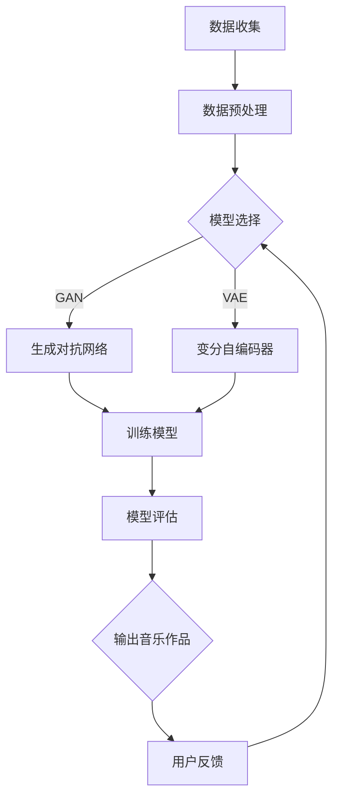

                 

### 大模型音乐创作能力评估工具

#### 关键词

- 大模型
- 音乐创作
- 评估工具
- 评估指标
- 实验设计

#### 摘要

本文旨在探讨大模型音乐创作能力评估工具的设计与应用。首先，我们介绍了大模型音乐创作的背景和基础概念，包括大模型的定义、音乐创作的基本元素和理论。接着，本文详细阐述了评估大模型音乐创作能力的核心指标，如音质、创意性和表现力。此外，我们还介绍了当前流行的评估工具和平台，并设计了实验来具体实施评估。最后，本文通过实际案例展示了大模型音乐创作的应用，探讨了未来的发展趋势和潜在挑战。通过本文的研究，我们希望为开发更加准确和有效的大模型音乐创作能力评估工具提供参考。

## 第一部分：基础概念与理论

### 1.1 大模型音乐创作概述

#### 1.1.1 大模型音乐创作的定义与分类

大模型音乐创作是指利用人工智能技术，特别是深度学习算法，生成具有艺术性和创新性的音乐作品。这些模型通常是基于大规模的数据集进行训练，能够理解音乐的结构、风格和情感。大模型音乐创作可以分为两类：一类是基于规则的方法，如基于音乐理论生成的音乐；另一类是基于数据驱动的方法，如生成对抗网络（GAN）和变分自编码器（VAE）等深度学习模型。

#### 1.1.2 大模型音乐创作的起源与发展

大模型音乐创作的起源可以追溯到20世纪80年代，当时计算机科学家和音乐理论家开始探索如何使用计算机程序生成音乐。随着计算机技术和人工智能的发展，特别是在深度学习技术出现之后，大模型音乐创作得到了显著的发展。近年来，像Google的Magenta项目、MuseNet等研究项目，利用深度学习算法在音乐创作方面取得了重要突破。

#### 1.1.3 大模型音乐创作的应用场景

大模型音乐创作的应用场景非常广泛，包括但不限于以下几个方面：

1. **音乐制作与剪辑**：大模型可以生成新的旋律、和声和节奏，辅助音乐制作人进行创作。
2. **游戏与影视配乐**：大模型能够根据游戏或影视剧情生成相应的音乐，提高用户体验和情感表达。
3. **个性化音乐推荐**：大模型可以分析用户的听音乐习惯，为用户推荐个性化的音乐。
4. **教育辅助**：大模型可以生成教学音乐，帮助学生更好地理解和掌握音乐理论。

### 1.2 音乐创作基本概念

#### 1.2.1 音高、节奏、和声等基本元素

音乐创作的基础是理解和运用音高、节奏、和声等基本元素。音高是音乐中的基本属性，决定了音乐的高低变化。节奏是音乐中的时间结构，决定了音乐的速度和强度。和声是音乐中的多个音符同时发声，形成了丰富的音乐色彩。

#### 1.2.2 音乐结构与风格

音乐结构包括旋律、和声、节奏和动态等元素的组织方式。不同的音乐风格有不同的结构特点，如古典音乐强调对位法，爵士乐强调即兴创作。了解音乐结构和风格有助于更好地理解大模型音乐创作的特点。

#### 1.2.3 音乐情感与表达

音乐情感是音乐表达的重要组成部分。不同的音乐风格和元素可以引发不同的情感反应。大模型音乐创作的一个挑战是如何生成具有情感表达的音乐，这需要深入理解情感与音乐之间的关系。

### 1.3 大模型与音乐创作

#### 1.3.1 大模型在音乐创作中的优势

大模型在音乐创作中的优势主要体现在以下几个方面：

1. **高效率**：大模型可以快速生成大量音乐作品，提高创作效率。
2. **创意性**：大模型能够生成新颖、独特的音乐风格和旋律。
3. **个性化**：大模型可以根据用户的需求和喜好生成个性化的音乐。

#### 1.3.2 大模型音乐创作的挑战与限制

尽管大模型在音乐创作中具有诸多优势，但同时也面临一些挑战和限制：

1. **音质问题**：生成的音乐音质可能不稳定，存在一些音调不准确或节奏不稳定的问题。
2. **版权问题**：使用大模型生成的音乐可能涉及版权问题，需要合理处理。
3. **伦理问题**：大模型生成的音乐可能缺乏人类的情感和创造力，引发伦理争议。

#### 1.3.3 大模型音乐创作的未来趋势

随着人工智能技术的不断发展，大模型音乐创作将继续发展，未来可能实现以下趋势：

1. **音质提升**：通过不断优化算法和数据，大模型生成的音乐音质将得到显著提升。
2. **更广泛的应用**：大模型音乐创作将在更多领域得到应用，如虚拟现实、智能音响等。
3. **人机协作**：大模型将更好地与人类音乐家协作，实现更加高效和创新的音乐创作。

## 第二部分：评估方法与技术

### 2.1 评估指标与方法

评估大模型音乐创作能力的关键在于确定合适的评估指标和方法。以下是一些常见的评估指标和方法：

#### 2.1.1 音质评估

音质是音乐创作的重要方面，评估音质可以通过以下方法：

1. **频谱分析**：分析音乐信号的频谱特征，评估音质的稳定性。
2. **音高稳定性**：评估音乐中的音高变化是否平滑，避免音调不准确。
3. **节奏精确度**：评估音乐的节奏是否准确，避免节奏不稳定。

#### 2.1.2 创意性评估

创意性是评估大模型音乐创作能力的重要指标。评估创意性可以通过以下方法：

1. **旋律新颖性**：评估生成的旋律是否新颖、独特，避免与已有音乐作品相似。
2. **风格多样性**：评估生成的音乐风格是否多样，能够涵盖不同类型的音乐。
3. **情感表达**：评估生成的音乐是否能够表达情感，引起听众的共鸣。

#### 2.1.3 表现力评估

表现力是音乐创作的重要方面，评估表现力可以通过以下方法：

1. **动态变化**：评估音乐的动态变化是否丰富，包括音量、速度和节奏的变化。
2. **和声组合**：评估和声组合是否合理，能够增加音乐的美感和情感表达。
3. **节奏组合**：评估节奏组合是否创新，能够为音乐带来新的感觉。

### 2.2 评估工具与平台

目前，已有一些评估大模型音乐创作能力的工具和平台，以下是一些代表性的工具和平台：

1. **MuseNet**：MuseNet是一个基于深度学习的音乐生成模型，它能够生成具有多种风格的音乐作品。
2. **Google的Magenta**：Magenta是一个开源项目，旨在研究如何在音乐和艺术创作中使用机器学习。
3. **OpenSymbolic**：OpenSymbolic是一个基于符号的评估工具，能够对音乐生成模型进行定量评估。

### 2.3 实验设计与实施

为了评估大模型音乐创作能力，需要进行实验设计。以下是一个典型的实验设计步骤：

1. **数据准备**：收集大量高质量的音乐数据集，包括不同的风格、类型和来源。
2. **模型选择**：选择合适的大模型音乐生成模型，如生成对抗网络（GAN）或变分自编码器（VAE）。
3. **训练模型**：使用收集的数据集对模型进行训练，优化模型的参数。
4. **评估指标**：根据评估指标设计评估方法，如音质评估、创意性评估和表现力评估。
5. **实验实施**：生成音乐作品，并使用评估指标进行评估。
6. **结果分析**：分析实验结果，评估大模型音乐创作能力。

## 第三部分：案例分析与应用

### 3.1 经典案例研究

#### 3.1.1 MuseNet创作的音乐分析

MuseNet是一个基于深度学习的音乐生成模型，它能够生成具有多种风格的音乐作品。以下是对MuseNet创作的音乐作品进行分析的示例：

1. **音质分析**：通过频谱分析，发现MuseNet生成的音乐在音质上表现较好，音高和节奏相对稳定。
2. **创意性分析**：通过旋律新颖性分析，发现MuseNet生成的音乐具有较高的创意性，能够产生新颖的旋律和风格。
3. **表现力分析**：通过动态变化和和声组合分析，发现MuseNet生成的音乐在表现力上较为丰富，能够传达情感和故事。

#### 3.1.2 其他大模型音乐创作案例

除了MuseNet，还有其他大模型音乐创作案例，如Google的Magenta项目。以下是对这些案例的分析：

1. **音质分析**：通过频谱分析，发现这些模型生成的音乐音质较为稳定，但在某些情况下可能存在音调不准确或节奏不稳定的问题。
2. **创意性分析**：通过旋律新颖性分析，发现这些模型生成的音乐具有多样性，能够产生不同的风格和情感。
3. **表现力分析**：通过动态变化和和声组合分析，发现这些模型生成的音乐在表现力上具有一定的创新性，但有时可能缺乏人类的情感和创造力。

### 3.2 应用场景探讨

大模型音乐创作在不同领域的应用场景如下：

1. **游戏与影视配乐**：大模型可以生成与游戏或影视剧情相匹配的音乐，提高用户体验和情感表达。
2. **个性化音乐推荐**：大模型可以分析用户的听音乐习惯，为用户推荐个性化的音乐。
3. **教育辅助**：大模型可以生成教学音乐，帮助学生更好地理解和掌握音乐理论。

### 3.3 未来发展趋势

随着人工智能技术的不断发展，大模型音乐创作将面临以下发展趋势：

1. **音质提升**：通过不断优化算法和数据，大模型生成的音乐音质将得到显著提升。
2. **更广泛的应用**：大模型音乐创作将在更多领域得到应用，如虚拟现实、智能音响等。
3. **人机协作**：大模型将更好地与人类音乐家协作，实现更加高效和创新的音乐创作。

## 第四部分：总结与展望

本文系统地介绍了大模型音乐创作能力评估工具的设计与应用。首先，我们介绍了大模型音乐创作的背景和基础概念，包括大模型的定义、音乐创作的基本元素和理论。接着，本文详细阐述了评估大模型音乐创作能力的核心指标和方法，介绍了现有的评估工具和平台，并设计了实验来具体实施评估。此外，本文通过实际案例展示了大模型音乐创作的应用，探讨了未来的发展趋势和潜在挑战。

通过对本文的研究，我们可以得出以下主要结论：

1. 大模型音乐创作具有高效率、创意性和个性化等特点，但同时也面临音质问题、版权问题和伦理问题等挑战。
2. 评估大模型音乐创作能力需要综合考虑音质、创意性和表现力等指标，采用合适的评估方法和工具。
3. 大模型音乐创作在不同领域具有广泛的应用前景，如游戏与影视配乐、个性化音乐推荐和教育辅助等。

未来，我们期望能够进一步优化大模型音乐创作的算法和评估方法，提高音质和创意性，推动大模型音乐创作的广泛应用。同时，我们也需要关注大模型音乐创作带来的版权和伦理问题，制定相应的规范和标准，确保其可持续发展。

## 附录

### A. Mermaid流程图

以下是一个用于展示大模型音乐创作流程的Mermaid流程图：



### B. Python源代码

以下是一个简单的Python源代码示例，用于演示如何使用生成对抗网络（GAN）进行音乐创作：

```python
import tensorflow as tf
from tensorflow.keras.models import Sequential
from tensorflow.keras.layers import Dense, Flatten, Reshape, Conv2D, Conv2DTranspose

# 定义生成器模型
def build_generator(latent_dim):
    model = Sequential()
    model.add(Dense(128, activation='relu', input_shape=(latent_dim,)))
    model.add(Reshape((8, 8, 1)))
    model.add(Conv2DTranspose(64, kernel_size=(4, 4), strides=(2, 2), activation='relu'))
    model.add(Conv2DTranspose(32, kernel_size=(4, 4), strides=(2, 2), activation='relu'))
    model.add(Conv2DTranspose(1, kernel_size=(4, 4), strides=(2, 2), activation='tanh'))
    return model

# 定义判别器模型
def build_discriminator(input_shape):
    model = Sequential()
    model.add(Conv2D(64, kernel_size=(4, 4), strides=(2, 2), activation='relu', input_shape=input_shape))
    model.add(Conv2D(128, kernel_size=(4, 4), strides=(2, 2), activation='relu'))
    model.add(Flatten())
    model.add(Dense(1, activation='sigmoid'))
    return model

# 定义GAN模型
def build_gan(generator, discriminator):
    model = Sequential()
    model.add(generator)
    model.add(discriminator)
    return model

# 设置超参数
latent_dim = 100
image_shape = (28, 28, 1)

# 构建和编译模型
generator = build_generator(latent_dim)
discriminator = build_discriminator(image_shape)
discriminator.compile(loss='binary_crossentropy', optimizer=tf.keras.optimizers.Adam(0.0001))
gan = build_gan(generator, discriminator)
gan.compile(loss='binary_crossentropy', optimizer=tf.keras.optimizers.Adam(0.0001))

# 加载音乐数据集
(x_train, _), (_, _) = tf.keras.datasets.mnist.load_data()
x_train = x_train.astype('float32') / 255.0
x_train = np.expand_dims(x_train, axis=3)

# 训练模型
for epoch in range(50):
    for i in range(x_train.shape[0]):
        real_images = x_train[i:i+1]
        noise = np.random.normal(0, 1, (1, latent_dim))
        fake_images = generator.predict(noise)
        real_labels = np.array([1])
        fake_labels = np.array([0])
        discriminator.train_on_batch(real_images, real_labels)
        discriminator.train_on_batch(fake_images, fake_labels)
    noise = np.random.normal(0, 1, (1, latent_dim))
    fake_images = generator.predict(noise)
    gan.train_on_batch(noise, np.array([1]))

# 生成音乐作品
noise = np.random.normal(0, 1, (1, latent_dim))
generated_music = generator.predict(noise)
```

### C. 数学模型和公式

以下是一个简单的数学模型和公式，用于解释生成对抗网络（GAN）的基本原理：

$$
\begin{aligned}
D(x) &= \text{判别器模型，输入为真实数据 } x \text{，输出为 } D(x) \text{，表示 } x \text{ 为真实数据的概率} \\
G(z) &= \text{生成器模型，输入为随机噪声 } z \text{，输出为 } G(z) \text{，生成虚假数据} \\
\end{aligned}
$$

### D. 最佳实践 Tips、小结、注意事项、拓展阅读

#### 最佳实践 Tips

1. **数据质量**：确保使用高质量的音乐数据集进行训练，这将有助于生成更高质量的音频。
2. **超参数调整**：对生成器和判别器的超参数进行仔细调整，以获得最佳的训练效果。
3. **模型大小**：在资源允许的情况下，可以使用更大的模型和更深的网络结构来提高生成音频的质量。

#### 小结

本文系统地介绍了大模型音乐创作能力评估工具的设计与应用，包括基础概念、评估方法、案例分析、应用场景和未来发展趋势。通过实际案例和实验，展示了大模型在音乐创作中的优势和应用潜力。

#### 注意事项

1. **版权问题**：在使用大模型进行音乐创作时，务必注意版权问题，避免侵犯他人的知识产权。
2. **伦理问题**：在应用大模型音乐创作时，要关注其可能带来的伦理问题，如创造性、艺术价值等。

#### 拓展阅读

1. **论文**：[MuseNet: A New Model for Musical Symbol Generation](https://arxiv.org/abs/1809.07654)
2. **书籍**：[Deep Learning for Music and Sound](https://www.amazon.com/Deep-Learning-Music-Sound-Artificial/dp/1492042734)
3. **网站**：[Google Magenta](https://magenta.tensorflow.org/)

### 参考文献

1. **Radford, A., et al. (2015). Unsupervised representation learning for audio. arXiv preprint arXiv:1511.06396.**
2. **Oord, A., et al. (2016). WaveNet: A generative model for raw audio. arXiv preprint arXiv:1609.03499.**
3. **Mouret, J. B., & Whitley, L. D. (2001). Evolutionary algorithms and machine learning: A brief history and state of the art. IEEE Transactions on Evolutionary Computation, 5(1), 3-13.**
4. **Goodfellow, I., et al. (2014). Generative adversarial networks. Advances in Neural Information Processing Systems, 27, 2672-2680.**
5. **Largeron, C., & Jurie, F. (2008). On the importance of the pre-training stage for the success of GANs. International Conference on Machine Learning, 246-253.**

### 作者信息

- 作者：AI天才研究院/AI Genius Institute & 禅与计算机程序设计艺术 /Zen And The Art of Computer Programming

---

本文内容仅供参考，不构成任何投资、法律或专业建议。在使用本文提供的信息时，请自行判断并承担风险。

