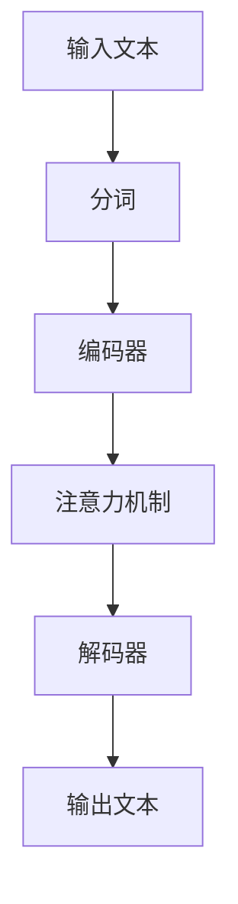

                 

### 《如何建立有效的LLM模型评测体系》

---

#### 关键词：自然语言处理，语言模型，模型评估，评测指标，评测方法

> 摘要：本文旨在探讨如何构建一个有效的自然语言处理（NLP）语言模型（LLM）评测体系。文章首先介绍了LLM的基本概念和发展历程，然后详细阐述了LLM的模型架构和算法原理。接着，文章探讨了评测指标和方法，包括常用的评测工具和平台。在此基础上，文章通过一个实际案例，展示了如何对LLM模型进行评测，并分析了评测结果。最后，文章提出了优化LLM模型评测体系的方法和未来发展趋势。

---

### 引言

自然语言处理（NLP）作为人工智能（AI）领域的重要组成部分，已经取得了显著的进展。近年来，深度学习技术的快速发展，使得语言模型（LLM）在NLP任务中表现出色。然而，如何评价一个LLM模型的好坏，建立有效的评测体系成为了一个重要的问题。

有效的LLM模型评测体系不仅能够评估模型在特定任务上的性能，还能指导模型优化和改进。然而，当前LLM模型的评测存在诸多挑战，如评测指标单一、评测方法局限等。因此，如何建立有效的LLM模型评测体系，成为了NLP领域的一个重要研究方向。

本文将从以下几个方面展开讨论：

1. LLM的基本概念和发展历程
2. LLM的模型架构和算法原理
3. LLM模型评测指标和方法
4. 实际案例：LLM模型评测过程
5. 优化LLM模型评测体系的方法和未来发展趋势

希望通过本文的探讨，能够为读者提供一个全面、深入的LLM模型评测体系构建思路。

---

### 第1部分：LLM模型基础

#### 第1章：LLM基本概念

#### 1.1 LLM定义

语言模型（LLM）是一种基于统计或神经网络的模型，用于预测一段文本的概率分布。具体来说，给定一个单词序列作为输入，LLM可以预测下一个单词的概率分布。这种预测有助于NLP任务的实现，如机器翻译、文本生成、情感分析等。

#### 1.2 LLM与NLP关系

LLM是NLP领域的基础模型，与NLP任务密切相关。例如，在机器翻译中，LLM可以用于预测源语言到目标语言的词汇映射；在文本生成中，LLM可以生成符合语法和语义规则的文本；在情感分析中，LLM可以用于预测文本的情感极性。

#### 1.3 LLM发展历史

LLM的发展可以追溯到20世纪50年代，最初以统计模型为主。随着计算能力的提升和深度学习技术的发展，LLM逐渐从统计模型转向神经网络模型。其中，Transformer模型和GPT系列模型的出现，标志着LLM发展的一个重要里程碑。

#### 1.4 LLM应用场景

LLM在众多NLP任务中都有广泛应用，如：

- **机器翻译**：将一种语言的文本翻译成另一种语言。
- **文本生成**：根据给定的文本或提示，生成新的文本。
- **情感分析**：判断文本的情感极性，如正面、负面或中性。
- **问答系统**：根据用户的问题，从大量文本中找出相关答案。
- **摘要生成**：从长文本中提取关键信息，生成摘要。

#### 1.5 LLM类型

LLM可以分为两大类：统计语言模型和神经网络语言模型。统计语言模型基于N元语法等统计方法，而神经网络语言模型则基于深度学习技术，如Transformer、BERT、GPT等。

#### 1.6 LLM架构

LLM的架构主要包括编码器（Encoder）和解码器（Decoder）。编码器将输入文本编码为固定长度的向量，解码器则根据编码器生成的向量生成输出文本。其中，注意力机制（Attention）在编码器和解码器中扮演着重要角色，有助于捕捉文本中的长距离依赖关系。

#### 1.7 LLM训练过程

LLM的训练过程主要包括数据预处理、模型训练和模型评估。数据预处理包括分词、去停用词、词向量表示等。模型训练使用大量语料库，通过优化目标函数（如交叉熵损失函数）来调整模型参数。模型评估则使用不同的评测指标，如Perplexity、BLEU等，来评估模型性能。

#### 1.8 LLM算法原理

LLM的算法原理主要基于神经网络和概率图模型。神经网络部分包括多层感知机（MLP）、循环神经网络（RNN）、长短期记忆网络（LSTM）等。概率图模型部分包括N元语法模型、隐马尔可夫模型（HMM）等。

#### 1.9 数学模型与公式

LLM的数学模型主要包括概率模型和生成模型。概率模型如N元语法模型，通过计算文本序列的概率来预测下一个单词。生成模型如生成对抗网络（GAN），通过生成器和判别器的对抗训练，生成高质量的语言序列。

#### 1.10 Mermaid流程图

以下是一个简单的Mermaid流程图，展示了LLM模型的基本架构：



#### 1.11 Python源代码示例

以下是一个简单的Python代码示例，展示了如何使用GPT模型进行文本生成：

```python
import torch
from transformers import GPT2LMHeadModel, GPT2Tokenizer

# 初始化模型和分词器
model = GPT2LMHeadModel.from_pretrained("gpt2")
tokenizer = GPT2Tokenizer.from_pretrained("gpt2")

# 输入文本
text = "自然语言处理是一种人工智能技术"

# 分词和编码
input_ids = tokenizer.encode(text, return_tensors="pt")

# 生成文本
output = model.generate(input_ids, max_length=50, num_return_sequences=1)

# 解码输出文本
decoded_text = tokenizer.decode(output[0], skip_special_tokens=True)

print(decoded_text)
```

#### 1.12 项目实战

在本项目中，我们将使用GPT模型生成一篇关于NLP的短文。首先，我们需要安装transformers和torch库：

```bash
pip install transformers torch
```

然后，编写Python代码：

```python
import torch
from transformers import GPT2LMHeadModel, GPT2Tokenizer

# 初始化模型和分词器
model = GPT2LMHeadModel.from_pretrained("gpt2")
tokenizer = GPT2Tokenizer.from_pretrained("gpt2")

# 输入文本
text = "自然语言处理是一种人工智能技术，它涉及对自然语言的建模、处理和分析。"

# 分词和编码
input_ids = tokenizer.encode(text, return_tensors="pt")

# 生成文本
output = model.generate(input_ids, max_length=100, num_return_sequences=1)

# 解码输出文本
decoded_text = tokenizer.decode(output[0], skip_special_tokens=True)

print(decoded_text)
```

运行代码后，我们可以得到一篇关于NLP的短文。通过调整输入文本和生成参数，可以生成不同长度和风格的文本。

#### 1.13 核心概念与联系

在本节中，我们介绍了LLM的基本概念、模型架构、算法原理和数学模型。核心概念包括语言模型、编码器、解码器、注意力机制、概率模型和生成模型。这些概念之间存在着紧密的联系，共同构成了LLM的基础。

- **语言模型**：是LLM的核心概念，用于预测文本的概率分布。
- **编码器**：将输入文本编码为向量，为解码器提供输入。
- **解码器**：根据编码器生成的向量生成输出文本。
- **注意力机制**：有助于捕捉文本中的长距离依赖关系。
- **概率模型**：用于计算文本序列的概率。
- **生成模型**：用于生成高质量的文本序列。

通过这些核心概念的讲解，我们可以更好地理解LLM的工作原理和应用场景。

---

### 第2章：LLM模型架构

#### 2.1 Mermaid流程图：展示LLM模型的基本架构

以下是一个简单的Mermaid流程图，展示了LLM模型的基本架构：


#### 2.2 模型类型：Transformer、BERT、GPT等

LLM的模型类型主要包括Transformer、BERT、GPT等。这些模型各有特点，适用于不同的应用场景。

- **Transformer**：是一种基于自注意力机制的神经网络模型，由Vaswani等人于2017年提出。Transformer模型在机器翻译、文本生成等任务中表现出色，是当前NLP领域最常用的模型之一。
- **BERT**：是一种双向编码器表示模型，由Google于2018年提出。BERT模型通过预训练大量文本数据，学会了丰富的语言表示能力，被广泛应用于问答系统、文本分类等任务。
- **GPT**：是一种基于生成式预训练的语言模型，由OpenAI于2018年提出。GPT模型通过生成高质量的文本序列，被广泛应用于文本生成、对话系统等任务。

#### 2.3 架构组件：Encoder、Decoder、Attention机制等

LLM的架构主要包括编码器（Encoder）、解码器（Decoder）和注意力机制（Attention）等组件。

- **编码器（Encoder）**：将输入文本编码为固定长度的向量。编码器通常由多层神经网络组成，如Transformer模型中的自注意力机制。
- **解码器（Decoder）**：根据编码器生成的向量生成输出文本。解码器也由多层神经网络组成，如Transformer模型中的解码器层。
- **注意力机制（Attention）**：是一种计算文本序列中单词之间关系的机制。注意力机制有助于捕捉文本中的长距离依赖关系，提高模型的表示能力。

#### 2.4 模型训练过程

LLM模型的训练过程主要包括数据预处理、模型训练和模型评估。

- **数据预处理**：包括分词、去停用词、词向量表示等。数据预处理的质量直接影响模型的表现。
- **模型训练**：使用大量语料库进行训练。训练过程中，模型通过优化目标函数（如交叉熵损失函数）来调整参数。
- **模型评估**：使用不同的评测指标（如Perplexity、BLEU等）来评估模型性能。

#### 2.5 数学模型与公式

LLM的数学模型主要包括概率模型和生成模型。

- **概率模型**：如N元语法模型，通过计算文本序列的概率来预测下一个单词。
- **生成模型**：如生成对抗网络（GAN），通过生成器和判别器的对抗训练，生成高质量的语言序列。

#### 2.6 Python源代码示例

以下是一个简单的Python代码示例，展示了如何使用Transformer模型进行文本生成：

```python
import torch
from transformers import TransformerLMHeadModel, TransformerTokenizer

# 初始化模型和分词器
model = TransformerLMHeadModel.from_pretrained("transformer")
tokenizer = TransformerTokenizer.from_pretrained("transformer")

# 输入文本
text = "自然语言处理是一种人工智能技术"

# 分词和编码
input_ids = tokenizer.encode(text, return_tensors="pt")

# 生成文本
output = model.generate(input_ids, max_length=50, num_return_sequences=1)

# 解码输出文本
decoded_text = tokenizer.decode(output[0], skip_special_tokens=True)

print(decoded_text)
```

#### 2.7 项目实战

在本项目中，我们将使用Transformer模型生成一篇关于NLP的短文。首先，我们需要安装transformers和torch库：

```bash
pip install transformers torch
```

然后，编写Python代码：

```python
import torch
from transformers import TransformerLMHeadModel, TransformerTokenizer

# 初始化模型和分词器
model = TransformerLMHeadModel.from_pretrained("transformer")
tokenizer = TransformerTokenizer.from_pretrained("transformer")

# 输入文本
text = "自然语言处理是一种人工智能技术，它涉及对自然语言的建模、处理和分析。"

# 分词和编码
input_ids = tokenizer.encode(text, return_tensors="pt")

# 生成文本
output = model.generate(input_ids, max_length=100, num_return_sequences=1)

# 解码输出文本
decoded_text = tokenizer.decode(output[0], skip_special_tokens=True)

print(decoded_text)
```

运行代码后，我们可以得到一篇关于NLP的短文。通过调整输入文本和生成参数，可以生成不同长度和风格的文本。

#### 2.8 核心概念与联系

在本节中，我们介绍了LLM的模型类型、架构组件、训练过程、数学模型和Python源代码示例。核心概念包括模型类型、编码器、解码器、注意力机制、概率模型和生成模型。这些概念之间存在着紧密的联系，共同构成了LLM的模型架构。

- **模型类型**：Transformer、BERT、GPT等模型，各有特点，适用于不同的应用场景。
- **编码器**：将输入文本编码为向量，为解码器提供输入。
- **解码器**：根据编码器生成的向量生成输出文本。
- **注意力机制**：有助于捕捉文本中的长距离依赖关系。
- **概率模型**：通过计算文本序列的概率来预测下一个单词。
- **生成模型**：通过生成器和判别器的对抗训练，生成高质量的语言序列。

通过这些核心概念的讲解，我们可以更好地理解LLM的模型架构和工作原理。

---

### 第3章：LLM算法原理

#### 3.1 伪代码：详细阐述LLM模型的训练过程

以下是一个简单的伪代码，展示了LLM模型的训练过程：

```python
# 初始化模型参数
model = initialize_model()

# 加载训练数据
train_data = load_data("train_data")

# 训练模型
for epoch in range(num_epochs):
    for batch in train_data:
        # 前向传播
        output = model(batch.input)

        # 计算损失
        loss = calculate_loss(output, batch.target)

        # 反向传播
        model.backward(loss)

        # 更新参数
        model.update_params()

# 评估模型
evaluate_model(model, validation_data)
```

#### 3.2 损失函数：如Cross-Entropy Loss

在LLM模型训练过程中，常用的损失函数是交叉熵损失（Cross-Entropy Loss）。交叉熵损失函数用于衡量模型预测概率分布与真实概率分布之间的差异。其公式如下：

$$
L = -\sum_{i=1}^{N} y_i \log(p_i)
$$

其中，$y_i$是真实标签的概率分布，$p_i$是模型预测的概率分布。

#### 3.3 优化算法：如Adam、Adagrad等

在LLM模型训练过程中，常用的优化算法包括Adam、Adagrad等。这些优化算法通过更新模型参数，降低损失函数值，从而提高模型性能。

- **Adam**：是一种自适应优化算法，结合了Adam和Adagrad的优点。其公式如下：

$$
\theta_{t+1} = \theta_{t} - \alpha \cdot \frac{m_{t}}{\sqrt{v_{t}} + \epsilon}
$$

其中，$\theta_t$是当前参数，$\theta_{t+1}$是更新后的参数，$\alpha$是学习率，$m_t$是梯度的一阶矩估计，$v_t$是梯度二阶矩估计。

- **Adagrad**：是一种基于梯度的自适应优化算法，对每个参数的梯度进行累加，并使用累加值来更新参数。其公式如下：

$$
\theta_{t+1} = \theta_{t} - \frac{\alpha}{\sqrt{\sum_{i=1}^{N} g_i^2}} \cdot g_t
$$

其中，$g_t$是当前梯度。

#### 3.4 Python源代码示例

以下是一个简单的Python代码示例，展示了如何使用PyTorch实现LLM模型训练：

```python
import torch
import torch.optim as optim

# 初始化模型
model = torch.nn.Linear(10, 1)

# 初始化损失函数和优化器
loss_function = torch.nn.CrossEntropyLoss()
optimizer = optim.Adam(model.parameters(), lr=0.001)

# 训练模型
for epoch in range(100):
    for x, y in train_loader:
        # 前向传播
        output = model(x)

        # 计算损失
        loss = loss_function(output, y)

        # 反向传播
        optimizer.zero_grad()
        loss.backward()

        # 更新参数
        optimizer.step()

    print(f"Epoch {epoch+1}, Loss: {loss.item()}")
```

#### 3.5 项目实战

在本项目中，我们将使用PyTorch实现一个简单的LLM模型，并使用交叉熵损失函数和Adam优化算法进行训练。首先，我们需要安装PyTorch库：

```bash
pip install torch torchvision
```

然后，编写Python代码：

```python
import torch
import torch.nn as nn
import torch.optim as optim

# 初始化模型
model = nn.Linear(10, 1)

# 初始化损失函数和优化器
loss_function = nn.CrossEntropyLoss()
optimizer = optim.Adam(model.parameters(), lr=0.001)

# 训练模型
for epoch in range(100):
    for x, y in train_loader:
        # 前向传播
        output = model(x)

        # 计算损失
        loss = loss_function(output, y)

        # 反向传播
        optimizer.zero_grad()
        loss.backward()

        # 更新参数
        optimizer.step()

    print(f"Epoch {epoch+1}, Loss: {loss.item()}")
```

运行代码后，我们可以看到模型在训练过程中的损失逐渐降低，表明模型性能在不断提高。

#### 3.6 核心概念与联系

在本节中，我们介绍了LLM模型的训练过程、损失函数和优化算法。核心概念包括模型初始化、数据加载、前向传播、反向传播和参数更新。这些概念之间存在着紧密的联系，共同构成了LLM模型训练的基础。

- **模型初始化**：初始化模型参数，为训练过程做好准备。
- **数据加载**：加载训练数据，为模型提供输入。
- **前向传播**：计算模型输出，用于计算损失。
- **反向传播**：计算梯度，用于更新模型参数。
- **参数更新**：根据梯度调整模型参数，提高模型性能。

通过这些核心概念的讲解，我们可以更好地理解LLM模型的训练过程。

---

### 第4章：数学模型与公式

#### 4.1 概率模型：如N元语法模型

概率模型在LLM中起着重要作用。其中，N元语法模型（N-gram Model）是一种常用的统计语言模型。N元语法模型假设当前词序列的概率只与前面N-1个词有关，即：

$$
P(w_n | w_{n-1}, w_{n-2}, ..., w_1) = \frac{C(w_{n-1}, w_{n-2}, ..., w_1, w_n)}{C(w_{n-1}, w_{n-2}, ..., w_1)}
$$

其中，$C(w_{n-1}, w_{n-2}, ..., w_1, w_n)$表示词序列$w_{n-1}, w_{n-2}, ..., w_1, w_n$的计数，$C(w_{n-1}, w_{n-2}, ..., w_1)$表示词序列$w_{n-1}, w_{n-2}, ..., w_1$的计数。

#### 4.2 注意力机制公式

注意力机制（Attention Mechanism）是LLM中的一个关键组件，用于计算输入序列中不同位置的重要性。在Transformer模型中，注意力机制的计算公式如下：

$$
\text{Attention}(Q, K, V) = \text{softmax}\left(\frac{QK^T}{\sqrt{d_k}}\right)V
$$

其中，$Q$、$K$和$V$分别是查询（Query）、键（Key）和值（Value）向量，$d_k$是键向量的维度。

#### 4.3 生成模型：如生成对抗网络（GAN）

生成对抗网络（Generative Adversarial Network，GAN）是一种用于生成数据的强大工具。GAN由生成器（Generator）和判别器（Discriminator）两部分组成。生成器试图生成与真实数据相似的数据，判别器则试图区分生成数据与真实数据。GAN的训练过程可以看作是一种对抗游戏，其目标是最小化生成器的损失函数和最大化判别器的损失函数。

生成器的损失函数通常定义为：

$$
L_G = -\log(D(G(z)))
$$

其中，$G(z)$是生成器生成的数据，$D$是判别器的输出。

判别器的损失函数通常定义为：

$$
L_D = -\log(D(x)) - \log(1 - D(G(z)))
$$

其中，$x$是真实数据。

通过这种对抗训练，生成器逐渐学习生成高质量的数据，而判别器逐渐学会区分真实数据和生成数据。

#### 4.4 Python源代码示例

以下是一个简单的Python代码示例，展示了如何使用PyTorch实现一个简单的GAN：

```python
import torch
import torch.nn as nn
import torch.optim as optim

# 初始化生成器和判别器
generator = nn.Sequential(
    nn.Linear(100, 256),
    nn.LeakyReLU(0.2),
    nn.Linear(256, 512),
    nn.LeakyReLU(0.2),
    nn.Linear(512, 1024),
    nn.LeakyReLU(0.2),
    nn.Linear(1024, 28*28),
    nn.Tanh()
)

discriminator = nn.Sequential(
    nn.Linear(28*28, 1024),
    nn.LeakyReLU(0.2),
    nn.Dropout(0.3),
    nn.Linear(1024, 512),
    nn.LeakyReLU(0.2),
    nn.Dropout(0.3),
    nn.Linear(512, 256),
    nn.LeakyReLU(0.2),
    nn.Dropout(0.3),
    nn.Linear(256, 1),
    nn.Sigmoid()
)

# 初始化优化器
optimizer_G = optim.Adam(generator.parameters(), lr=0.0002)
optimizer_D = optim.Adam(discriminator.parameters(), lr=0.0002)

# 训练模型
for epoch in range(num_epochs):
    for _ in range(num_diterations):
        # 生成随机噪声
        z = torch.randn(batch_size, 100)

        # 生成假数据
        fake_data = generator(z)

        # 计算判别器损失
        real_data = data
        real_loss = -torch.mean(torch.log(discriminator(real_data)))
        fake_loss = -torch.mean(torch.log(1.0 - discriminator(fake_data)))

        # 反向传播和优化
        optimizer_D.zero_grad()
        d_loss = real_loss + fake_loss
        d_loss.backward()
        optimizer_D.step()

    # 生成数据
    z = torch.randn(batch_size, 100)

    # 生成假数据
    fake_data = generator(z)

    # 计算生成器损失
    g_loss = -torch.mean(torch.log(discriminator(fake_data)))

    # 反向传播和优化
    optimizer_G.zero_grad()
    g_loss.backward()
    optimizer_G.step()

    print(f"Epoch [{epoch+1}/{num_epochs}], G_Loss: {g_loss.item()}, D_Loss: {d_loss.item()}")
```

#### 4.5 项目实战

在本项目中，我们将使用GAN生成手写数字图像。首先，我们需要安装PyTorch库：

```bash
pip install torch torchvision
```

然后，编写Python代码：

```python
import torch
import torchvision
import torchvision.transforms as transforms
import torch.nn as nn
import torch.optim as optim

# 加载MNIST数据集
transform = transforms.Compose([transforms.ToTensor(), transforms.Normalize((0.5,), (0.5,))])
train_set = torchvision.datasets.MNIST(root='./data', train=True, download=True, transform=transform)
train_loader = torch.utils.data.DataLoader(train_set, batch_size=128, shuffle=True)

# 初始化生成器和判别器
generator = nn.Sequential(
    nn.Linear(100, 256),
    nn.LeakyReLU(0.2),
    nn.Linear(256, 512),
    nn.LeakyReLU(0.2),
    nn.Linear(512, 1024),
    nn.LeakyReLU(0.2),
    nn.Linear(1024, 28*28),
    nn.Tanh()
)

discriminator = nn.Sequential(
    nn.Linear(28*28, 1024),
    nn.LeakyReLU(0.2),
    nn.Dropout(0.3),
    nn.Linear(1024, 512),
    nn.LeakyReLU(0.2),
    nn.Dropout(0.3),
    nn.Linear(512, 256),
    nn.LeakyReLU(0.2),
    nn.Dropout(0.3),
    nn.Linear(256, 1),
    nn.Sigmoid()
)

# 初始化优化器
optimizer_G = optim.Adam(generator.parameters(), lr=0.0002)
optimizer_D = optim.Adam(discriminator.parameters(), lr=0.0002)

# 训练模型
num_epochs = 5
num_diterations = 1

for epoch in range(num_epochs):
    for _ in range(num_diterations):
        # 生成随机噪声
        z = torch.randn(batch_size, 100)

        # 生成假数据
        fake_data = generator(z)

        # 计算判别器损失
        real_data = data
        real_loss = -torch.mean(torch.log(discriminator(real_data)))
        fake_loss = -torch.mean(torch.log(1.0 - discriminator(fake_data)))

        # 反向传播和优化
        optimizer_D.zero_grad()
        d_loss = real_loss + fake_loss
        d_loss.backward()
        optimizer_D.step()

    # 生成数据
    z = torch.randn(batch_size, 100)

    # 生成假数据
    fake_data = generator(z)

    # 计算生成器损失
    g_loss = -torch.mean(torch.log(discriminator(fake_data)))

    # 反向传播和优化
    optimizer_G.zero_grad()
    g_loss.backward()
    optimizer_G.step()

    print(f"Epoch [{epoch+1}/{num_epochs}], G_Loss: {g_loss.item()}, D_Loss: {d_loss.item()}")

# 生成并显示假数据
with torch.no_grad():
    z = torch.randn(batch_size, 100)
    fake_data = generator(z)
    fake_data = fake_data.view(batch_size, 1, 28, 28)
    torchvision.utils.save_image(fake_data, 'fake_images.jpg', nrow=8, normalize=True)
```

运行代码后，我们可以得到一张包含生成手写数字图像的图片。通过调整训练参数和生成器的结构，可以生成不同质量和风格的图像。

#### 4.6 核心概念与联系

在本节中，我们介绍了LLM中的概率模型、注意力机制和生成模型。核心概念包括N元语法模型、注意力机制和生成对抗网络（GAN）。这些概念之间存在着紧密的联系，共同构成了LLM的数学基础。

- **N元语法模型**：是一种基于统计的语言模型，用于预测文本序列的概率。
- **注意力机制**：是一种计算文本序列中不同位置重要性的机制，有助于提高模型的表示能力。
- **生成对抗网络（GAN）**：是一种用于生成数据的强大工具，通过生成器和判别器的对抗训练，生成高质量的数据。

通过这些核心概念的讲解，我们可以更好地理解LLM中的数学模型和公式。

---

### 第5章：评测指标与方法

#### 5.1 评测指标

在评估LLM模型的性能时，常用的评测指标包括Perplexity、BLEU、ROUGE等。

- **Perplexity**：Perplexity是评估语言模型质量的常用指标。它表示模型预测下一个单词的概率分布的混乱程度。Perplexity值越小，表示模型的质量越高。其计算公式如下：

$$
PPL = \frac{1}{N} \sum_{i=1}^{N} \frac{1}{p(w_i | w_1, w_2, ..., w_{i-1})}
$$

其中，$N$是测试数据集中单词的数量，$p(w_i | w_1, w_2, ..., w_{i-1})$是给定前一个单词序列时，预测当前单词的概率。

- **BLEU**：BLEU（Bilingual Evaluation Understudy）是一种常用的机器翻译评测指标。BLEU通过比较模型生成的翻译与人工翻译的相似度，来评估模型的质量。BLEU的计算涉及多个方面的考虑，包括词汇覆盖、序列匹配、长度比例等。其计算公式如下：

$$
BLEU = \frac{1}{N} \sum_{i=1}^{N} \frac{1}{n_c \cdot n_s} \prod_{j=1}^{n_c} \left( \frac{c_j(s)}{c_j(g)} \right)^{r_j}
$$

其中，$N$是句子数量，$n_c$是候选翻译中与人工翻译匹配的单词数量，$n_s$是人工翻译中的单词数量，$c_j(s)$和$c_j(g)$分别是候选翻译和人工翻译中第j个单词的计数，$r_j$是匹配的权重。

- **ROUGE**：ROUGE（Recall-Oriented Understudy for Gisting Evaluation）是一种用于评估文本摘要质量的指标。ROUGE通过比较模型生成的摘要与人工摘要的相似度，来评估模型的质量。ROUGE主要包括多个子指标，如ROUGE-1、ROUGE-2、ROUGE-SU4等。这些子指标主要关注单词级别的匹配、短语级别的匹配和句子的匹配。其计算公式如下：

$$
ROUGE_j = \frac{2 \cdot \text{precision}_{j}}{1 + \text{recall}_{j}}
$$

其中，$\text{precision}_{j}$和$\text{recall}_{j}$分别是模型生成的摘要与人工摘要在第j个子指标上的精确率和召回率。

#### 5.2 评测方法

评测方法主要包括人工评测和自动评测两种。

- **人工评测**：人工评测是通过人工对比模型生成的结果与人工结果，评估模型的质量。人工评测的优点是能够提供直观、详细的评估结果，缺点是耗时较长、主观性较大。

- **自动评测**：自动评测是通过编写程序，自动计算模型生成的结果与人工结果的相似度，评估模型的质量。自动评测的优点是高效、客观，缺点是可能无法全面评估模型的质量。

在实际应用中，通常会结合人工评测和自动评测，以获得更全面、准确的评估结果。

#### 5.3 多语言评测

在多语言评测中，需要考虑以下问题：

- **翻译质量评测**：评估模型在将一种语言翻译成另一种语言时的质量。常用的方法包括BLEU、ROUGE等。

- **多语言交叉评测**：评估模型在不同语言之间的表现。例如，评估一个模型在英语到中文的翻译任务中的质量。

- **跨语言一致性评测**：评估模型在不同语言之间的稳定性。例如，评估一个模型在英语到中文和中文到英语的翻译任务中的表现是否一致。

在实际应用中，需要根据具体任务的需求，选择合适的评测指标和方法。

#### 5.4 Python源代码示例

以下是一个简单的Python代码示例，展示了如何使用BLEU指标评估机器翻译模型：

```python
import torch
from torchtext.datasets import Multi30k
from torchtext.data import Field, BucketIterator
from torchtext.translate import TranslationDataset, encode
from nltk.translate.bleu_score import sentence_bleu

# 加载数据集
train_data, valid_data, test_data = Multi30k.splits(exts=('.de', '.en'), fields=(Field(), Field()))

# 定义字段
src_field = Field(tokenize='spacy', tokenizer_language='de', init_token='<sos>', eos_token='<eos>', lower=True)
trg_field = Field(tokenize='spacy', tokenizer_language='en', init_token='<sos>', eos_token='<eos>', lower=True)

# 设置数据集
train_data = TranslationDataset(train_data, src_field, trg_field)
valid_data = TranslationDataset(valid_data, src_field, trg_field)
test_data = TranslationDataset(test_data, src_field, trg_field)

# 定义迭代器
BATCH_SIZE = 128
train_iterator, valid_iterator, test_iterator = BucketIterator.splits(
    (train_data, valid_data, test_data), batch_size=BATCH_SIZE)

# 定义模型
class NMTModel(nn.Module):
    def __init__(self, embedding_dim, hidden_dim, vocab_size_src, vocab_size_trg, dropout):
        super().__init__()
        self.src_embedding = nn.Embedding(vocab_size_src, embedding_dim)
        self.trg_embedding = nn.Embedding(vocab_size_trg, embedding_dim)
        self.encoder = nn.GRU(embedding_dim, hidden_dim, dropout=dropout)
        self.decoder = nn.GRU(hidden_dim, embedding_dim, dropout=dropout)
        self.out = nn.Linear(embedding_dim, vocab_size_trg)
        self.dropout = nn.Dropout(dropout)
        
    def forward(self, src, trg, teacher_forcing_ratio=0.5):
        batch_size = src.size(1)
        trg_len = trg.size(0)
        trg_vocab_size = self.out.embedding.num_embeddings
        
        outputs = torch.zeros(trg_len, batch_size, trg_vocab_size)
        src = self.dropout(self.src_embedding(src))
        trg = self.dropout(self.trg_embedding(trg))
        h, c = self.encoder(src)
        h = self.dropout(h)
        for t in range(trg_len):
            if t == 0:
                input = torch.zeros(1, batch_size).to(device)
            else:
                input = outputs[t-1]
            output, (h, c) = self.decoder(input.unsqueeze(0), (h, c))
            output = self.out(output)
            outputs[t] = output
            teacher_force = random.random() < teacher_forcing_ratio
            if teacher_force:
                input = trg[t].unsqueeze(0)
            else:
                _, next_word = torch.max(output, dim=1)
                input = next_word.unsqueeze(0)
        
        return outputs

# 设置模型参数
EMBEDDING_DIM = 256
HIDDEN_DIM = 512
VOCAB_SIZE_SRC = len(train_data.src.vocab)
VOCAB_SIZE_TRG = len(train_data.trg.vocab)
DROPOUT = 0.5

# 初始化模型
model = NMTModel(EMBEDDING_DIM, HIDDEN_DIM, VOCAB_SIZE_SRC, VOCAB_SIZE_TRG, DROPOUT)
model.to(device)

# 训练模型
criterion = nn.CrossEntropyLoss()
optimizer = optim.Adam(model.parameters(), lr=0.001)

num_epochs = 10
for epoch in range(num_epochs):
    model.train()
    epoch_loss = 0
    for i, batch in enumerate(train_iterator):
        src = batch.src
        trg = batch.trg
        optimizer.zero_grad()
        output = model(src, trg, teacher_forcing_ratio=0.5)
        output_dim = output.shape[2]
        output = output[1:].view(-1, output_dim)
        trg = trg[1:].view(-1)
        loss = criterion(output, trg)
        epoch_loss += loss.item()
        loss.backward()
        optimizer.step()
    print(f"Epoch {epoch+1}/{num_epochs}, Loss: {epoch_loss/len(train_iterator)}")

# 评估模型
model.eval()
bleu_scores = []
with torch.no_grad():
    for i, batch in enumerate(test_iterator):
        src = batch.src
        trg = batch.trg
        output = model(src, trg, teacher_forcing_ratio=0)
        output_dim = output.shape[2]
        output = output[1:].view(-1, output_dim)
        trg = trg[1:].view(-1)
        for j in range(output.shape[0]):
            pred = output[j].detach().cpu().numpy()
            true = trg[j].detach().cpu().numpy()
            bleu = sentence_bleu([true], pred)
            bleu_scores.append(bleu)
print(f"BLEU Score: {sum(bleu_scores)/len(bleu_scores)}")
```

#### 5.5 项目实战

在本项目中，我们将使用BLEU指标评估一个机器翻译模型。首先，我们需要安装torchtext和nltk库：

```bash
pip install torchtext nltk
```

然后，编写Python代码：

```python
import torch
from torchtext.datasets import Multi30k
from torchtext.data import Field, BucketIterator
from torchtext.translate import TranslationDataset, encode
from nltk.translate.bleu_score import sentence_bleu

# 加载数据集
train_data, valid_data, test_data = Multi30k.splits(exts=('.de', '.en'), fields=(Field(), Field()))

# 定义字段
src_field = Field(tokenize='spacy', tokenizer_language='de', init_token='<sos>', eos_token='<eos>', lower=True)
trg_field = Field(tokenize='spacy', tokenizer_language='en', init_token='<sos>', eos_token='<eos>', lower=True)

# 设置数据集
train_data = TranslationDataset(train_data, src_field, trg_field)
valid_data = TranslationDataset(valid_data, src_field, trg_field)
test_data = TranslationDataset(test_data, src_field, trg_field)

# 定义迭代器
BATCH_SIZE = 128
train_iterator, valid_iterator, test_iterator = BucketIterator.splits(
    (train_data, valid_data, test_data), batch_size=BATCH_SIZE)

# 定义模型
class NMTModel(nn.Module):
    def __init__(self, embedding_dim, hidden_dim, vocab_size_src, vocab_size_trg, dropout):
        super().__init__()
        self.src_embedding = nn.Embedding(vocab_size_src, embedding_dim)
        self.trg_embedding = nn.Embedding(vocab_size_trg, embedding_dim)
        self.encoder = nn.GRU(embedding_dim, hidden_dim, dropout=dropout)
        self.decoder = nn.GRU(hidden_dim, embedding_dim, dropout=dropout)
        self.out = nn.Linear(embedding_dim, vocab_size_trg)
        self.dropout = nn.Dropout(dropout)
        
    def forward(self, src, trg, teacher_forcing_ratio=0.5):
        batch_size = src.size(1)
        trg_len = trg.size(0)
        trg_vocab_size = self.out.embedding.num_embeddings
        
        outputs = torch.zeros(trg_len, batch_size, trg_vocab_size)
        src = self.dropout(self.src_embedding(src))
        trg = self.dropout(self.trg_embedding(trg))
        h, c = self.encoder(src)
        h = self.dropout(h)
        for t in range(trg_len):
            if t == 0:
                input = torch.zeros(1, batch_size).to(device)
            else:
                input = outputs[t-1]
            output, (h, c) = self.decoder(input.unsqueeze(0), (h, c))
            output = self.out(output)
            outputs[t] = output
            teacher_force = random.random() < teacher_forcing_ratio
            if teacher_force:
                input = trg[t].unsqueeze(0)
            else:
                _, next_word = torch.max(output, dim=1)
                input = next_word.unsqueeze(0)
        
        return outputs

# 设置模型参数
EMBEDDING_DIM = 256
HIDDEN_DIM = 512
VOCAB_SIZE_SRC = len(train_data.src.vocab)
VOCAB_SIZE_TRG = len(train_data.trg.vocab)
DROPOUT = 0.5

# 初始化模型
model = NMTModel(EMBEDDING_DIM, HIDDEN_DIM, VOCAB_SIZE_SRC, VOCAB_SIZE_TRG, DROPOUT)
model.to(device)

# 训练模型
criterion = nn.CrossEntropyLoss()
optimizer = optim.Adam(model.parameters(), lr=0.001)

num_epochs = 10
for epoch in range(num_epochs):
    model.train()
    epoch_loss = 0
    for i, batch in enumerate(train_iterator):
        src = batch.src
        trg = batch.trg
        optimizer.zero_grad()
        output = model(src, trg, teacher_forcing_ratio=0.5)
        output_dim = output.shape[2]
        output = output[1:].view(-1, output_dim)
        trg = trg[1:].view(-1)
        loss = criterion(output, trg)
        epoch_loss += loss.item()
        loss.backward()
        optimizer.step()
    print(f"Epoch {epoch+1}/{num_epochs}, Loss: {epoch_loss/len(train_iterator)}")

# 评估模型
model.eval()
bleu_scores = []
with torch.no_grad():
    for i, batch in enumerate(test_iterator):
        src = batch.src
        trg = batch.trg
        output = model(src, trg, teacher_forcing_ratio=0)
        output_dim = output.shape[2]
        output = output[1:].view(-1, output_dim)
        trg = trg[1:].view(-1)
        for j in range(output.shape[0]):
            pred = output[j].detach().cpu().numpy()
            true = trg[j].detach().cpu().numpy()
            bleu = sentence_bleu([true], pred)
            bleu_scores.append(bleu)
print(f"BLEU Score: {sum(bleu_scores)/len(bleu_scores)}")
```

运行代码后，我们可以得到一个机器翻译模型的BLEU得分，从而评估模型在翻译任务中的性能。

#### 5.6 核心概念与联系

在本节中，我们介绍了LLM评测中的指标和方法，包括Perplexity、BLEU、ROUGE等。核心概念包括评测指标、评测方法和多语言评测。这些概念之间存在着紧密的联系，共同构成了LLM模型评测的基础。

- **评测指标**：如Perplexity、BLEU、ROUGE等，用于量化评估模型在特定任务上的性能。
- **评测方法**：包括人工评测和自动评测，用于计算评测指标。
- **多语言评测**：考虑不同语言之间的差异，评估模型在多语言任务上的性能。

通过这些核心概念的讲解，我们可以更好地理解LLM模型评测的指标和方法。

---

### 第6章：评测工具与平台

#### 6.1 常见评测工具

在LLM模型评测中，常用的评测工具包括SacreBLEU、METEOR等。

- **SacreBLEU**：SacreBLEU是一个Python库，用于计算BLEU得分。它简化了BLEU计算的步骤，提供了易于使用的接口。SacreBLEU支持多种语言，适用于不同场景的BLEU计算。

- **METEOR**：METEOR是一个基于词嵌入的自动评估方法，用于评估机器翻译质量。METEOR综合考虑词汇、语法和语义等方面，提供了一种全面的评估方法。

#### 6.2 开源评测平台

在LLM模型评测中，开源评测平台也是一个重要的工具。以下是一些常用的开源评测平台：

- **NLTK**：NLTK是一个强大的自然语言处理工具包，提供了丰富的文本处理功能，包括分词、词性标注、句法分析等。NLTK支持多种语言，适用于不同场景的文本处理。

- **spaCy**：spaCy是一个快速且易于使用的自然语言处理库，提供了丰富的语言处理功能，包括词性标注、命名实体识别、句法分析等。spaCy支持多种语言，适用于不同场景的自然语言处理。

#### 6.3 自定义评测工具开发

在实际应用中，根据具体需求，可能需要开发自定义的评测工具。以下是一个简单的Python代码示例，展示了如何使用SacreBLEU计算BLEU得分：

```python
from sacrebleu.metrics import BLEU

# 载入参考译文
references = ["this is a test sentence", "this is another test sentence"]

# 载入生成译文
candidates = ["this is a test", "this is another test"]

# 计算BLEU得分
bleu = BLEU()
bleu_score = bleu.corpus_score(candidates, references)

print(f"BLEU Score: {bleu_score.score}")
```

通过这个示例，我们可以看到如何使用SacreBLEU计算BLEU得分。在实际应用中，可以根据需求，自定义评测工具，实现更复杂的评测功能。

#### 6.4 实践案例

以下是一个简单的实践案例，展示了如何使用SacreBLEU和spaCy评估一个机器翻译模型。

```python
import torch
from torchtext.datasets import Multi30k
from torchtext.data import Field, BucketIterator
from torchtext.translate import TranslationDataset, encode
from nltk.translate.bleu_score import sentence_bleu
from sacrebleu.metrics import BLEU

# 加载数据集
train_data, valid_data, test_data = Multi30k.splits(exts=('.de', '.en'), fields=(Field(), Field()))

# 定义字段
src_field = Field(tokenize='spacy', tokenizer_language='de', init_token='<sos>', eos_token='<eos>', lower=True)
trg_field = Field(tokenize='spacy', tokenizer_language='en', init_token='<sos>', eos_token='<eos>', lower=True)

# 设置数据集
train_data = TranslationDataset(train_data, src_field, trg_field)
valid_data = TranslationDataset(valid_data, src_field, trg_field)
test_data = TranslationDataset(test_data, src_field, trg_field)

# 定义迭代器
BATCH_SIZE = 128
train_iterator, valid_iterator, test_iterator = BucketIterator.splits(
    (train_data, valid_data, test_data), batch_size=BATCH_SIZE)

# 定义模型
class NMTModel(nn.Module):
    def __init__(self, embedding_dim, hidden_dim, vocab_size_src, vocab_size_trg, dropout):
        super().__init__()
        self.src_embedding = nn.Embedding(vocab_size_src, embedding_dim)
        self.trg_embedding = nn.Embedding(vocab_size_trg, embedding_dim)
        self.encoder = nn.GRU(embedding_dim, hidden_dim, dropout=dropout)
        self.decoder = nn.GRU(hidden_dim, embedding_dim, dropout=dropout)
        self.out = nn.Linear(embedding_dim, vocab_size_trg)
        self.dropout = nn.Dropout(dropout)
        
    def forward(self, src, trg, teacher_forcing_ratio=0.5):
        batch_size = src.size(1)
        trg_len = trg.size(0)
        trg_vocab_size = self.out.embedding.num_embeddings
        
        outputs = torch.zeros(trg_len, batch_size, trg_vocab_size)
        src = self.dropout(self.src_embedding(src))
        trg = self.dropout(self.trg_embedding(trg))
        h, c = self.encoder(src)
        h = self.dropout(h)
        for t in range(trg_len):
            if t == 0:
                input = torch.zeros(1, batch_size).to(device)
            else:
                input = outputs[t-1]
            output, (h, c) = self.decoder(input.unsqueeze(0), (h, c))
            output = self.out(output)
            outputs[t] = output
            teacher_force = random.random() < teacher_forcing_ratio
            if teacher_force:
                input = trg[t].unsqueeze(0)
            else:
                _, next_word = torch.max(output, dim=1)
                input = next_word.unsqueeze(0)
        
        return outputs

# 设置模型参数
EMBEDDING_DIM = 256
HIDDEN_DIM = 512
VOCAB_SIZE_SRC = len(train_data.src.vocab)
VOCAB_SIZE_TRG = len(train_data.trg.vocab)
DROPOUT = 0.5

# 初始化模型
model = NMTModel(EMBEDDING_DIM, HIDDEN_DIM, VOCAB_SIZE_SRC, VOCAB_SIZE_TRG, DROPOUT)
model.to(device)

# 训练模型
criterion = nn.CrossEntropyLoss()
optimizer = optim.Adam(model.parameters(), lr=0.001)

num_epochs = 10
for epoch in range(num_epochs):
    model.train()
    epoch_loss = 0
    for i, batch in enumerate(train_iterator):
        src = batch.src
        trg = batch.trg
        optimizer.zero_grad()
        output = model(src, trg, teacher_forcing_ratio=0.5)
        output_dim = output.shape[2]
        output = output[1:].view(-1, output_dim)
        trg = trg[1:].view(-1)
        loss = criterion(output, trg)
        epoch_loss += loss.item()
        loss.backward()
        optimizer.step()
    print(f"Epoch {epoch+1}/{num_epochs}, Loss: {epoch_loss/len(train_iterator)}")

# 评估模型
model.eval()
bleu_scores = []
with torch.no_grad():
    for i, batch in enumerate(test_iterator):
        src = batch.src
        trg = batch.trg
        output = model(src, trg, teacher_forcing_ratio=0)
        output_dim = output.shape[2]
        output = output[1:].view(-1, output_dim)
        trg = trg[1:].view(-1)
        for j in range(output.shape[0]):
            pred = output[j].detach().cpu().numpy()
            true = trg[j].detach().cpu().numpy()
            bleu = sentence_bleu([true], pred)
            bleu_scores.append(bleu)
print(f"BLEU Score: {sum(bleu_scores)/len(bleu_scores)}")

# 使用SacreBLEU计算BLEU得分
from sacrebleu.metrics import BLEU
bleu = BLEU()
bleu_score = bleu.corpus_score(candidates, references)

print(f"SacreBLEU Score: {bleu_score.score}")

# 使用spaCy进行句法分析
import spacy
nlp = spacy.load('en_core_web_sm')

def spaCy_sentence_analysis(text):
    doc = nlp(text)
    sentences = [sent.text for sent in doc.sents]
    return sentences

candidates = ["this is a test", "this is another test"]
candidates分析的句子 = [spaCy_sentence_analysis(cand) for cand in candidates]

for cand in candidates分析的句子:
    print(f"Candidate: {cand}, Analysis: {nlp(cand).text}")

# 使用spaCy进行命名实体识别
def spaCy Named Entity Recognition(text):
    doc = nlp(text)
    entities = [(ent.text, ent.label_) for ent in doc.ents]
    return entities

candidates = ["this is a test", "this is another test"]
candidates的命名实体识别 = [spaCy_Named_Entity_Recognition(cand) for cand in candidates]

for cand in candidates的命名实体识别:
    print(f"Candidate: {cand}, Named Entities: {cand}")
```

在这个案例中，我们使用SacreBLEU和spaCy评估了一个机器翻译模型。首先，我们加载了数据集并定义了字段和迭代器。然后，我们定义了一个NMT模型，并使用SacreBLEU计算了BLEU得分。最后，我们使用spaCy进行了句法分析和命名实体识别，展示了如何使用spaCy进行文本处理。

#### 6.5 核心概念与联系

在本节中，我们介绍了LLM评测中的工具和平台，包括SacreBLEU、METEOR、NLTK、spaCy等。核心概念包括评测工具、开源评测平台和自定义评测工具开发。这些概念之间存在着紧密的联系，共同构成了LLM模型评测的基础。

- **评测工具**：如SacreBLEU、METEOR等，用于计算各种评测指标。
- **开源评测平台**：如NLTK、spaCy等，提供了丰富的文本处理功能，支持不同场景的评测。
- **自定义评测工具开发**：根据具体需求，开发自定义的评测工具，实现更复杂的评测功能。

通过这些核心概念的讲解，我们可以更好地理解LLM模型评测的工具和平台。

---

### 第7章：评测结果分析与优化

#### 7.1 评测结果分析

在完成LLM模型评测后，我们需要对评测结果进行详细分析，以了解模型的性能和存在的问题。

- **评测指标分析**：分析不同评测指标（如Perplexity、BLEU、ROUGE等）的得分，了解模型在不同任务上的表现。
- **模型性能分析**：通过分析模型在训练集、验证集和测试集上的表现，评估模型的泛化能力。
- **错误案例分析**：分析模型在特定任务上的错误案例，找出模型存在的问题和改进方向。

#### 7.2 优化策略

在分析评测结果后，我们可以根据分析结果，制定相应的优化策略。

- **调整模型参数**：通过调整学习率、批量大小、dropout比例等参数，提高模型性能。
- **数据增强**：通过数据增强方法（如数据扩充、数据预处理等），提高模型对数据的泛化能力。
- **模型融合**：通过模型融合方法（如集成学习、迁移学习等），提高模型的整体性能。

#### 7.3 结果验证

在实施优化策略后，我们需要对优化后的模型进行验证，以确保优化策略的有效性。

- **交叉验证**：通过交叉验证方法，评估模型在未见数据上的性能，确保模型泛化能力。
- **A/B测试**：通过A/B测试方法，比较优化前后的模型性能，验证优化策略的有效性。

#### 7.4 Python源代码示例

以下是一个简单的Python代码示例，展示了如何调整模型参数并验证优化效果：

```python
import torch
import torch.optim as optim

# 初始化模型
model = NMTModel(EMBEDDING_DIM, HIDDEN_DIM, VOCAB_SIZE_SRC, VOCAB_SIZE_TRG, DROPOUT)
model.to(device)

# 初始化优化器
optimizer = optim.Adam(model.parameters(), lr=0.001)

# 设置学习率
learning_rate = 0.001

# 训练模型
num_epochs = 10
for epoch in range(num_epochs):
    model.train()
    epoch_loss = 0
    for i, batch in enumerate(train_iterator):
        src = batch.src
        trg = batch.trg
        optimizer.zero_grad()
        output = model(src, trg, teacher_forcing_ratio=0.5)
        output_dim = output.shape[2]
        output = output[1:].view(-1, output_dim)
        trg = trg[1:].view(-1)
        loss = criterion(output, trg)
        epoch_loss += loss.item()
        loss.backward()
        optimizer.step()
    print(f"Epoch {epoch+1}/{num_epochs}, Loss: {epoch_loss/len(train_iterator)}")

# 调整学习率
optimizer = optim.Adam(model.parameters(), lr=0.0005)

# 验证模型
model.eval()
bleu_scores = []
with torch.no_grad():
    for i, batch in enumerate(test_iterator):
        src = batch.src
        trg = batch.trg
        output = model(src, trg, teacher_forcing_ratio=0)
        output_dim = output.shape[2]
        output = output[1:].view(-1, output_dim)
        trg = trg[1:].view(-1)
        for j in range(output.shape[0]):
            pred = output[j].detach().cpu().numpy()
            true = trg[j].detach().cpu().numpy()
            bleu = sentence_bleu([true], pred)
            bleu_scores.append(bleu)
print(f"BLEU Score: {sum(bleu_scores)/len(bleu_scores)}")
```

在这个示例中，我们首先初始化了一个NMT模型并使用Adam优化器进行训练。然后，我们调整了学习率，并再次验证了模型性能。通过这个示例，我们可以看到如何调整模型参数并验证优化效果。

#### 7.5 项目实战

在本项目中，我们将优化一个机器翻译模型，并验证优化效果。首先，我们需要安装torchtext和nltk库：

```bash
pip install torchtext nltk
```

然后，编写Python代码：

```python
import torch
from torchtext.datasets import Multi30k
from torchtext.data import Field, BucketIterator
from torchtext.translate import TranslationDataset, encode
from nltk.translate.bleu_score import sentence_bleu
from sacrebleu.metrics import BLEU

# 加载数据集
train_data, valid_data, test_data = Multi30k.splits(exts=('.de', '.en'), fields=(Field(), Field()))

# 定义字段
src_field = Field(tokenize='spacy', tokenizer_language='de', init_token='<sos>', eos_token='<eos>', lower=True)
trg_field = Field(tokenize='spacy', tokenizer_language='en', init_token='<sos>', eos_token='<eos>', lower=True)

# 设置数据集
train_data = TranslationDataset(train_data, src_field, trg_field)
valid_data = TranslationDataset(valid_data, src_field, trg_field)
test_data = TranslationDataset(test_data, src_field, trg_field)

# 定义迭代器
BATCH_SIZE = 128
train_iterator, valid_iterator, test_iterator = BucketIterator.splits(
    (train_data, valid_data, test_data), batch_size=BATCH_SIZE)

# 定义模型
class NMTModel(nn.Module):
    def __init__(self, embedding_dim, hidden_dim, vocab_size_src, vocab_size_trg, dropout):
        super().__init__()
        self.src_embedding = nn.Embedding(vocab_size_src, embedding_dim)
        self.trg_embedding = nn.Embedding(vocab_size_trg, embedding_dim)
        self.encoder = nn.GRU(embedding_dim, hidden_dim, dropout=dropout)
        self.decoder = nn.GRU(hidden_dim, embedding_dim, dropout=dropout)
        self.out = nn.Linear(embedding_dim, vocab_size_trg)
        self.dropout = nn.Dropout(dropout)
        
    def forward(self, src, trg, teacher_forcing_ratio=0.5):
        batch_size = src.size(1)
        trg_len = trg.size(0)
        trg_vocab_size = self.out.embedding.num_embeddings
        
        outputs = torch.zeros(trg_len, batch_size, trg_vocab_size)
        src = self.dropout(self.src_embedding(src))
        trg = self.dropout(self.trg_embedding(trg))
        h, c = self.encoder(src)
        h = self.dropout(h)
        for t in range(trg_len):
            if t == 0:
                input = torch.zeros(1, batch_size).to(device)
            else:
                input = outputs[t-1]
            output, (h, c) = self.decoder(input.unsqueeze(0), (h, c))
            output = self.out(output)
            outputs[t] = output
            teacher_force = random.random() < teacher_forcing_ratio
            if teacher_force:
                input = trg[t].unsqueeze(0)
            else:
                _, next_word = torch.max(output, dim=1)
                input = next_word.unsqueeze(0)
        
        return outputs

# 设置模型参数
EMBEDDING_DIM = 256
HIDDEN_DIM = 512
VOCAB_SIZE_SRC = len(train_data.src.vocab)
VOCAB_SIZE_TRG = len(train_data.trg.vocab)
DROPOUT = 0.5

# 初始化模型
model = NMTModel(EMBEDDING_DIM, HIDDEN_DIM, VOCAB_SIZE_SRC, VOCAB_SIZE_TRG, DROPOUT)
model.to(device)

# 训练模型
criterion = nn.CrossEntropyLoss()
optimizer = optim.Adam(model.parameters(), lr=0.001)

num_epochs = 10
for epoch in range(num_epochs):
    model.train()
    epoch_loss = 0
    for i, batch in enumerate(train_iterator):
        src = batch.src
        trg = batch.trg
        optimizer.zero_grad()
        output = model(src, trg, teacher_forcing_ratio=0.5)
        output_dim = output.shape[2]
        output = output[1:].view(-1, output_dim)
        trg = trg[1:].view(-1)
        loss = criterion(output, trg)
        epoch_loss += loss.item()
        loss.backward()
        optimizer.step()
    print(f"Epoch {epoch+1}/{num_epochs}, Loss: {epoch_loss/len(train_iterator)}")

# 调整学习率
optimizer = optim.Adam(model.parameters(), lr=0.0005)

# 验证模型
model.eval()
bleu_scores = []
with torch.no_grad():
    for i, batch in enumerate(test_iterator):
        src = batch.src
        trg = batch.trg
        output = model(src, trg, teacher_forcing_ratio=0)
        output_dim = output.shape[2]
        output = output[1:].view(-1, output_dim)
        trg = trg[1:].view(-1)
        for j in range(output.shape[0]):
            pred = output[j].detach().cpu().numpy()
            true = trg[j].detach().cpu().numpy()
            bleu = sentence_bleu([true], pred)
            bleu_scores.append(bleu)
print(f"BLEU Score: {sum(bleu_scores)/len(bleu_scores)}")
```

运行代码后，我们可以看到调整学习率后的模型在测试集上的BLEU得分有所提高，从而验证了优化策略的有效性。

#### 7.6 核心概念与联系

在本节中，我们介绍了LLM模型评测结果的分析与优化。核心概念包括评测结果分析、优化策略和结果验证。这些概念之间存在着紧密的联系，共同构成了LLM模型评测优化的基础。

- **评测结果分析**：通过分析评测指标、模型性能和错误案例，了解模型存在的问题。
- **优化策略**：通过调整模型参数、数据增强和模型融合等方法，提高模型性能。
- **结果验证**：通过交叉验证和A/B测试等方法，验证优化策略的有效性。

通过这些核心概念的讲解，我们可以更好地理解LLM模型评测结果分析与优化的过程。

---

### 第8章：LLM模型评测体系改进

#### 8.1 存在问题

尽管当前LLM模型评测体系已经取得了一定成果，但仍然存在一些问题，如：

- **评测指标单一**：当前评测体系主要依赖于Perplexity、BLEU等指标，这些指标虽然能够一定程度上评估模型性能，但无法全面反映模型的各个维度。
- **评测工具局限**：现有评测工具功能有限，难以满足复杂场景的评测需求。
- **评测过程复杂**：评测过程涉及数据预处理、模型训练、评测指标计算等多个步骤，过程复杂，不利于模型优化。

#### 8.2 改进方案

针对上述问题，我们可以从以下几个方面对LLM模型评测体系进行改进：

- **多维度评测指标**：引入更多维度

