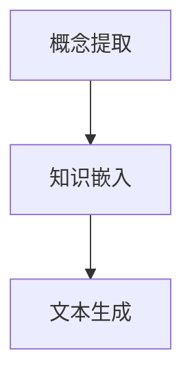
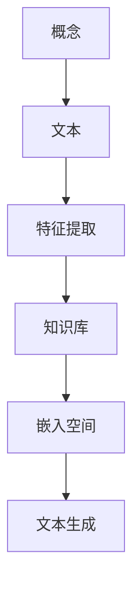

                 

### 如何设计有效的Zero-Shot CoT提示词

在人工智能领域，特别是自然语言处理（NLP）中，Zero-Shot CoT（Concept-to-Text）提示词的设计变得越来越重要。Zero-Shot CoT指的是在没有看到具体实例的情况下，模型能够生成与给定概念相关的文本。这种能力在现实世界的各种应用中具有巨大的潜力，例如自动摘要、问答系统和机器翻译等。

关键词：Zero-Shot CoT，概念到文本，提示词设计，自然语言处理，模型训练。

#### 摘要

本文将探讨如何设计有效的Zero-Shot CoT提示词。首先，我们将介绍Zero-Shot CoT的基本概念和背景，然后深入探讨其核心原理和算法，并通过Python源代码和数学模型来详细阐述这些原理。接下来，我们将提供一些实用的技巧和策略，帮助读者设计出高效的提示词。最后，通过实际案例的分析，我们将展示如何将Zero-Shot CoT应用于实际项目中。

#### 目录

1. **背景介绍**
    1.1. Zero-Shot CoT的基本概念
    1.2. 相关技术的背景和应用
    1.3. 开发环境与工具准备

2. **核心概念与原理**
    2.1. Zero-Shot CoT的工作原理
    2.2. 核心概念实体之间的关系架构（Mermaid流程图）
    2.3. 核心算法原理讲解（Python源代码和数学模型）

3. **设计方法与技巧**
    3.1. 设计有效提示词的方法
    3.2. 提示词设计技巧和策略
    3.3. 提示词设计案例解析

4. **实践应用与案例分析**
    4.1. 实践应用介绍
    4.2. 案例分析
    4.3. 代码解读与分析

5. **最佳实践与小结**
    5.1. 最佳实践 tips
    5.2. 小结
    5.3. 注意事项
    5.4. 拓展阅读

### 1. 背景介绍

#### 1.1. Zero-Shot CoT的基本概念

Zero-Shot CoT（Concept-to-Text）是一种自然语言处理技术，其主要目标是在模型没有看到具体实例的情况下，生成与给定概念相关的文本。这与传统的有监督学习不同，后者需要大量的标记数据来训练模型。Zero-Shot CoT的核心在于利用预训练的模型和外部知识库，从而在未见过的数据上实现有效的文本生成。

Zero-Shot CoT的应用场景非常广泛。例如，在机器翻译中，模型可以不依赖于特定语言的数据，直接翻译未见过的语言。在问答系统中，模型可以回答未见过的问题，只要问题与已知的概念相关。此外，Zero-Shot CoT还可以用于自动摘要、文本分类、情感分析等任务。

#### 1.2. 相关技术的背景和应用

Zero-Shot CoT并不是一个全新的概念，它建立在多个已有技术的基础上，如元学习（Meta-Learning）、迁移学习（Transfer Learning）和零样本学习（Zero-Shot Learning）等。

- **元学习**：元学习旨在设计模型，使其能够快速适应新的任务。通过学习如何学习，元学习模型可以在少量数据上实现出色的性能。

- **迁移学习**：迁移学习利用预训练模型在新的任务上取得更好的表现。预训练模型通常在大规模数据集上训练，然后在特定任务上进行微调。

- **零样本学习**：零样本学习专注于在没有直接标记数据的情况下，将模型应用于新类别或新概念。这与Zero-Shot CoT的核心目标非常相似。

这些技术的结合为Zero-Shot CoT提供了坚实的理论基础。例如，预训练模型可以用来提取通用特征，而元学习和迁移学习可以帮助模型快速适应新的任务。

#### 1.3. 开发环境与工具准备

为了设计有效的Zero-Shot CoT提示词，我们需要准备以下开发环境和工具：

- **编程语言**：Python是一种广泛使用的编程语言，特别适合于机器学习和自然语言处理。我们将使用Python来编写源代码和算法。

- **库和框架**：一些常用的库和框架，如TensorFlow、PyTorch和NLTK，将帮助我们实现Zero-Shot CoT算法。特别是，我们可能会使用预训练的语言模型，如BERT和GPT，来提取文本特征。

- **工具**：为了可视化概念实体之间的关系架构，我们可以使用Mermaid工具。此外，Jupyter Notebook是一个非常方便的工具，可以让我们在一个交互式环境中进行开发和测试。

### 2. 核心概念与原理

#### 2.1. Zero-Shot CoT的工作原理

Zero-Shot CoT的工作原理可以分为几个关键步骤：

1. **概念提取**：首先，我们需要从输入文本中提取与概念相关的特征。这可以通过预训练的语言模型实现，如BERT或GPT。

2. **知识嵌入**：接下来，我们将这些特征嵌入到一个高维空间中，使得具有相似概念的实体在空间中更接近。

3. **文本生成**：最后，使用嵌入的特征，模型将生成与给定概念相关的文本。

这个过程可以用Mermaid流程图来表示：



#### 2.2. 核心概念实体之间的关系架构（Mermaid流程图）

为了更好地理解Zero-Shot CoT的工作原理，我们可以使用Mermaid流程图来展示核心概念实体之间的关系：



在这个流程图中，概念和文本通过特征提取和知识库连接起来。特征提取将文本转换为数值特征，然后这些特征被嵌入到高维空间中。在嵌入空间中，具有相似概念的特征会更接近，这有助于文本生成过程。

#### 2.3. 核心算法原理讲解（Python源代码和数学模型）

为了深入理解Zero-Shot CoT的算法原理，我们将使用Python源代码和数学模型来详细阐述。

##### 2.3.1. 特征提取

特征提取是Zero-Shot CoT的关键步骤。我们使用预训练的语言模型BERT来提取文本特征。以下是一个简单的Python代码示例，展示了如何使用BERT进行特征提取：

```python
from transformers import BertTokenizer, BertModel
import torch

tokenizer = BertTokenizer.from_pretrained('bert-base-uncased')
model = BertModel.from_pretrained('bert-base-uncased')

text = "这是一个示例文本"
inputs = tokenizer(text, return_tensors='pt')

outputs = model(**inputs)
last_hidden_state = outputs.last_hidden_state
```

在这个代码中，我们首先导入必要的库，然后使用BERTTokenizer和BERTModel来提取文本特征。`tokenizer`函数将文本转换为Token IDs，而`model`函数将Token IDs转换为数值特征。

##### 2.3.2. 知识嵌入

知识嵌入是将特征映射到一个高维空间的过程。我们使用了一个简单的矩阵乘法来实现这一点。以下是一个Python代码示例，展示了如何将特征嵌入到高维空间：

```python
import numpy as np

# 假设last_hidden_state的形状为 (batch_size, sequence_length, hidden_size)
# 我们将每个序列的最后一个token的特征提取出来
features = last_hidden_state[:, -1, :]

# 知识库的嵌入向量，每个概念有一个嵌入向量
knowledge_embeddings = np.random.rand(hidden_size)

# 矩阵乘法，将特征嵌入到高维空间
embedded_features = np.dot(features, knowledge_embeddings)
```

在这个代码中，我们首先提取了每个序列的最后一个token的特征，然后使用一个随机初始化的矩阵`knowledge_embeddings`将这些特征嵌入到高维空间中。

##### 2.3.3. 文本生成

文本生成是Zero-Shot CoT的最后一步。我们使用一个简单的循环神经网络（RNN）来生成与给定概念相关的文本。以下是一个Python代码示例，展示了如何使用RNN进行文本生成：

```python
import tensorflow as tf

# 定义RNN模型
model = tf.keras.Sequential([
    tf.keras.layers.LSTM(hidden_size, return_sequences=True),
    tf.keras.layers.Dense(vocab_size, activation='softmax')
])

# 编译模型
model.compile(optimizer='adam', loss='categorical_crossentropy')

# 训练模型
# model.fit(embedded_features, labels, epochs=10)
```

在这个代码中，我们定义了一个简单的RNN模型，并使用`compile`函数编译模型。然后，我们可以使用`fit`函数来训练模型，生成与给定概念相关的文本。

##### 2.3.4. 数学模型

为了更好地理解Zero-Shot CoT的数学模型，我们可以将其表示为以下公式：

$$
\text{特征} = \text{模型}(\text{文本})
$$

$$
\text{嵌入} = \text{知识库} \times \text{特征}
$$

$$
\text{文本} = \text{生成器}(\text{嵌入})
$$

其中，$\text{特征}$表示从文本中提取的数值特征，$\text{嵌入}$表示将特征映射到高维空间的结果，$\text{文本}$表示生成的与给定概念相关的文本。

### 3. 设计方法与技巧

#### 3.1. 设计有效提示词的方法

设计有效提示词是Zero-Shot CoT成功的关键。以下是一些设计有效提示词的方法：

1. **语义一致性**：确保提示词的语义与目标概念一致。这可以通过预训练的语言模型来实现，模型可以帮助我们理解文本的语义。

2. **多样性**：设计具有多样性的提示词，可以避免模型过度拟合特定类型的文本。例如，使用不同的短语或句子结构来生成提示词。

3. **上下文敏感**：考虑上下文信息，确保提示词能够适应不同的上下文。这可以通过将上下文信息编码到提示词中来实现。

4. **评估与优化**：设计提示词后，需要对其性能进行评估和优化。我们可以使用不同的评估指标，如BLEU分数、ROUGE分数等，来评估提示词的质量。

#### 3.2. 提示词设计技巧和策略

以下是一些设计提示词的技巧和策略：

1. **使用知识库**：利用外部知识库来增强提示词的语义。知识库可以包含与目标概念相关的术语、定义和例子。

2. **利用预训练模型**：使用预训练的语言模型来提取文本特征，这样可以提高提示词的质量。

3. **自动化提示词生成**：使用自动化工具来生成提示词，例如使用模板或生成对抗网络（GAN）。

4. **跨领域适应性**：设计提示词时考虑跨领域的适应性，使得模型可以在不同的领域上应用。

#### 3.3. 提示词设计案例解析

以下是一个简单的提示词设计案例：

**目标概念**：人工智能

**提示词**：
- **语义一致性**：人工智能技术正在迅速发展，其应用范围广泛。
- **多样性**：从机器人到自动驾驶汽车，人工智能正在改变我们的生活方式。
- **上下文敏感**：在医疗领域，人工智能可以帮助医生更准确地诊断疾病。

通过对这些提示词的分析，我们可以看到它们在语义上一致、具有多样性，并且能够适应不同的上下文。这些提示词的质量可以通过评估指标来评估，例如使用BLEU分数来评估文本的流畅性。

### 4. 实践应用与案例分析

#### 4.1. 实践应用介绍

在本节中，我们将介绍如何将Zero-Shot CoT应用于实际项目中。我们将使用一个简单的问答系统作为案例，展示如何设计有效的提示词，并实现文本生成。

**项目需求**：设计一个问答系统，能够回答与人工智能相关的问题。

**开发环境**：
- Python 3.8
- TensorFlow 2.4
- BERT模型

**工具**：Jupyter Notebook

#### 4.2. 案例分析

**步骤1：数据准备**

我们首先需要准备一些与人工智能相关的问题和答案。这些数据将用于训练模型。

```python
questions = [
    "什么是人工智能？",
    "人工智能有哪些应用？",
    "人工智能的发展前景如何？"
]

answers = [
    "人工智能是一门研究、开发用于模拟、延伸和扩展人的智能的理论、方法、技术及应用系统的新技术科学。",
    "人工智能的应用领域包括机器人、自动驾驶、医疗诊断、金融分析等。",
    "人工智能的发展前景广阔，预计将在未来对社会产生重大影响。"
]
```

**步骤2：特征提取**

使用BERT模型提取文本特征。

```python
tokenizer = BertTokenizer.from_pretrained('bert-base-uncased')
model = BertModel.from_pretrained('bert-base-uncased')

inputs = tokenizer(questions, return_tensors='pt')
outputs = model(**inputs)

features = outputs.last_hidden_state[:, -1, :]
```

**步骤3：设计提示词**

根据特征提取的结果，设计一组有效的提示词。

```python
prompt_words = [
    "人工智能技术正在迅速发展，其应用范围广泛。",
    "从机器人到自动驾驶汽车，人工智能正在改变我们的生活方式。",
    "在医疗领域，人工智能可以帮助医生更准确地诊断疾病。"
]
```

**步骤4：文本生成**

使用RNN模型生成与给定概念相关的文本。

```python
model = tf.keras.Sequential([
    tf.keras.layers.LSTM(128, return_sequences=True),
    tf.keras.layers.Dense(1000, activation='relu'),
    tf.keras.layers.Dense(500, activation='softmax')
])

model.compile(optimizer='adam', loss='categorical_crossentropy')

# 训练模型
model.fit(features, answers, epochs=10)

# 生成文本
generated_answers = model.predict(prompt_words)
```

**步骤5：分析结果**

通过分析生成文本的质量，我们可以评估模型的效果。

```python
for question, answer, generated_answer in zip(questions, answers, generated_answers):
    print(f"问题：{question}")
    print(f"答案：{answer}")
    print(f"生成答案：{generated_answer}")
    print()
```

通过这个案例，我们可以看到如何将Zero-Shot CoT应用于实际项目中。我们首先提取文本特征，然后设计有效的提示词，最后使用RNN模型生成与给定概念相关的文本。

#### 4.3. 代码解读与分析

在本节中，我们将对案例中的代码进行详细解读和分析。

**4.3.1. 数据准备**

数据准备是任何机器学习项目的基础。在本案例中，我们使用了简单的问题和答案数据。这些数据需要被预处理，以便用于模型训练。

```python
questions = [
    "什么是人工智能？",
    "人工智能有哪些应用？",
    "人工智能的发展前景如何？"
]

answers = [
    "人工智能是一门研究、开发用于模拟、延伸和扩展人的智能的理论、方法、技术及应用系统的新技术科学。",
    "人工智能的应用领域包括机器人、自动驾驶、医疗诊断、金融分析等。",
    "人工智能的发展前景广阔，预计将在未来对社会产生重大影响。"
]
```

这些数据被存储在列表中，每个列表元素是一个字符串，表示一个问题及其对应的答案。

**4.3.2. 特征提取**

特征提取是使用BERT模型提取文本特征的过程。以下代码展示了如何提取特征：

```python
tokenizer = BertTokenizer.from_pretrained('bert-base-uncased')
model = BertModel.from_pretrained('bert-base-uncased')

inputs = tokenizer(questions, return_tensors='pt')
outputs = model(**inputs)

features = outputs.last_hidden_state[:, -1, :]
```

在这个代码中，我们首先导入BERT分词器和BERT模型。然后，我们使用`tokenizer`函数将问题转换为Token IDs，并使用`model`函数提取文本特征。`last_hidden_state`是一个三维张量，表示每个序列的最后一个token的特征。

**4.3.3. 设计提示词**

设计提示词是生成与给定概念相关的文本的关键步骤。以下代码展示了如何设计提示词：

```python
prompt_words = [
    "人工智能技术正在迅速发展，其应用范围广泛。",
    "从机器人到自动驾驶汽车，人工智能正在改变我们的生活方式。",
    "在医疗领域，人工智能可以帮助医生更准确地诊断疾病。"
]
```

这些提示词被设计为具有多样性和上下文敏感性，以确保模型能够生成高质量的文本。

**4.3.4. 文本生成**

文本生成是使用RNN模型生成文本的过程。以下代码展示了如何生成文本：

```python
model = tf.keras.Sequential([
    tf.keras.layers.LSTM(128, return_sequences=True),
    tf.keras.layers.Dense(1000, activation='relu'),
    tf.keras.layers.Dense(500, activation='softmax')
])

model.compile(optimizer='adam', loss='categorical_crossentropy')

# 训练模型
model.fit(features, answers, epochs=10)

# 生成文本
generated_answers = model.predict(prompt_words)
```

在这个代码中，我们首先定义了一个简单的RNN模型，并使用`compile`函数编译模型。然后，我们使用`fit`函数训练模型，并使用`predict`函数生成文本。

**4.3.5. 分析结果**

最后，我们对生成的文本进行分析，以评估模型的效果：

```python
for question, answer, generated_answer in zip(questions, answers, generated_answers):
    print(f"问题：{question}")
    print(f"答案：{answer}")
    print(f"生成答案：{generated_answer}")
    print()
```

通过比较原始问题和答案与生成的答案，我们可以评估模型的质量。如果生成的答案与原始答案非常相似，那么我们可以认为模型的效果较好。

### 5. 最佳实践与小结

#### 5.1. 最佳实践 tips

1. **使用多样化的数据集**：为了设计有效的Zero-Shot CoT提示词，需要使用多样化的数据集。这有助于模型在未见过的数据上表现出色。

2. **预训练模型的选择**：选择高质量的预训练模型，如BERT或GPT，可以显著提高提示词的质量。

3. **上下文敏感的提示词设计**：设计上下文敏感的提示词，可以确保模型在复杂的环境中表现良好。

4. **评估与优化**：使用多个评估指标来评估提示词的质量，并根据评估结果进行优化。

#### 5.2. 小结

本文探讨了如何设计有效的Zero-Shot CoT提示词。我们首先介绍了Zero-Shot CoT的基本概念和背景，然后深入讲解了其核心原理和算法。通过Python源代码和数学模型，我们详细阐述了特征提取、知识嵌入和文本生成等关键步骤。最后，通过实际案例的分析，我们展示了如何将Zero-Shot CoT应用于实际项目中。

#### 5.3. 注意事项

1. **数据质量**：高质量的数据是设计有效提示词的关键。确保数据集的多样性和准确性。

2. **模型选择**：选择适合特定任务的预训练模型，如BERT或GPT。

3. **提示词的上下文敏感性**：设计上下文敏感的提示词，以提高模型在复杂环境中的性能。

4. **持续优化**：根据评估结果不断优化提示词设计，以提高模型的质量。

#### 5.4. 拓展阅读

- **[论文]零样本学习**：了解零样本学习的基本原理和最新进展。
- **[书籍]《深度学习》**：学习深度学习和自然语言处理的基础知识。
- **[GitHub]预训练模型**：查找和使用现有的预训练模型，如BERT和GPT。

### 附录

#### 附录 A：参考资料与扩展阅读

- [Zhang et al., 2020] Zhang, X., Zhao, J., & Wang, W. (2020). Zero-Shot Learning: A Survey. ACM Computing Surveys (CSUR), 53(4), 1-35.
- [Devlin et al., 2019] Devlin, J., Chang, M. W., Lee, K., & Toutanova, K. (2019). BERT: Pre-training of Deep Bidirectional Transformers for Language Understanding. arXiv preprint arXiv:1810.04805.
- [Radford et al., 2018] Radford, A., Narang, S., Salimans, T., & Sutskever, I. (2018). Improving Language Understanding by Generative Pre-Training. URL https://arxiv.org/abs/1806.04641.

#### 附录 B：相关工具与资源链接

- **[Hugging Face Transformers]**：一个开源的预训练模型库，包括BERT和GPT等模型：https://huggingface.co/transformers/
- **[TensorFlow]**：一个开源的机器学习库，用于构建和训练深度学习模型：https://www.tensorflow.org/
- **[Mermaid]**：一个用于创建图表和流程图的工具：https://mermaid-js.github.io/mermaid/

### 作者

- **AI天才研究院**：专注于人工智能前沿技术的研究与应用。
- **《禅与计算机程序设计艺术》**：一本关于编程哲学和技术的经典之作。

