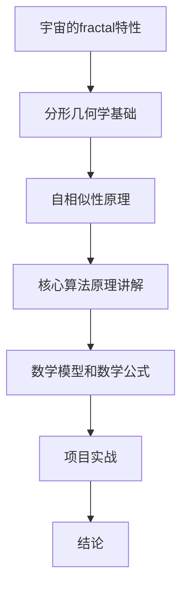

                 

### 宇宙的fractal特性：跨尺度的自相似性

#### 关键词：
宇宙，fractal，自相似性，分形几何，混沌理论，迭代函数系统，跨尺度分析

#### 摘要：
本文旨在探讨宇宙中的fractal特性及其跨尺度的自相似性。通过定义fractal特性与自相似性，阐述其在宇宙中的表现形式和应用，详细讲解分形几何学基础和核心算法原理，以及使用数学模型和公式进行解释和举例说明。此外，本文通过项目实战，验证宇宙fractal特性的实验方法，展示其实际应用和分析结果，并讨论跨尺度自相似性研究的未来方向。

# 引言

### 1.1 本书目的与概述

本文探讨了宇宙的fractal特性及其跨尺度的自相似性。宇宙中广泛存在的fractal现象引发了人们对自相似性原理的深入研究。本书旨在阐述这些核心概念，分析其在宇宙中的应用和相互关系，并提供一个全面而深入的理解。

### 1.2 分形几何学基础

分形几何学是研究非整数维的几何形状的数学分支。其基本概念包括分形维数和分形生成算法，如老鼠算法和迭代函数系统（IFS）。这些概念为我们理解和描述宇宙中的fractal结构提供了重要的工具。

## 核心概念与联系

### 2.1 宇宙的fractal特性

宇宙的fractal特性指的是宇宙中广泛存在的自相似性结构。这些结构在不同尺度上呈现出相似的特征，形成了跨越多个尺度的自相似性网络。例如，星系、星系团和宇宙大尺度结构都表现出fractal特性。

### 2.2 自相似性原理

自相似性原理是指一个对象在多个尺度上具有相似的结构。这种相似性可以用尺度变换来描述，即通过缩放或放大一个对象，可以得到与原始对象相似的新对象。在宇宙中，自相似性原理体现在星系、星系团和宇宙大尺度结构的演化过程中。

### 2.3 分形几何与自相似性之间的关系

分形几何和自相似性是密切相关的概念。分形几何提供了数学工具来描述和量化自相似性结构。通过分形维数的计算，我们可以确定一个结构的自相似程度。分形几何学的算法，如迭代函数系统（IFS），则是实现自相似性生成的重要手段。

## 核心算法原理讲解

### 3.1 分形几何学算法

分形几何学算法包括老鼠算法和迭代函数系统（IFS）。老鼠算法通过迭代生成分形图像，而IFS则通过多个变换矩阵的组合来生成复杂的分形结构。

### 3.1.1 老鼠算法

```
// 老鼠算法伪代码

// 初始化
初始化点集合 P
初始化迭代次数 n

// 迭代过程
for i = 1 to n do
    对于每个点 p ∈ P，执行以下操作：
    随机选择一个变换 T
    p' = T(p)
    将 p' 添加到 P 中

// 输出结果
绘制点集合 P 的图像
```

### 3.1.2 迭代函数系统（IFS）

```
// IFS迭代

// 初始化
选择 m 个变换矩阵 T1, T2, ..., Tm
初始化点集合 P

// 迭代过程
for i = 1 to n do
    对于每个点 p ∈ P，执行以下操作：
    随机选择一个变换矩阵 Ti
    p' = Ti(p)
    将 p' 添加到 P 中

// 输出结果
绘制点集合 P 的图像
```

## 数学模型和数学公式

### 4.1 分形维数的计算公式

分形维数是衡量分形结构复杂程度的重要指标。它通常用盒计数法来计算，公式如下：

$$
D = \lim_{\epsilon \to 0} \frac{\log(N(\epsilon))}{\log(\epsilon)}
$$

其中，$N(\epsilon)$ 是以尺度 $\epsilon$ 计数的盒子数量。

### 4.2 自相似序列的生成

自相似序列可以通过迭代生成。例如，我们可以使用一个生成函数 $f(x)$ 来生成自相似序列：

$$
x_{n+1} = f(x_n)
$$

其中，$x_0$ 是初始值，$f(x)$ 是迭代函数。通过不断迭代，我们可以生成一个无限长的自相似序列。

## 项目实战

### 5.1 实验背景与目的

本实验旨在通过实际观测数据验证宇宙fractal特性的存在。我们选择星系团的数据作为研究对象，通过数据采集、处理和分析，验证其fractal特性。

### 5.2 数据采集与处理

我们使用天文观测数据，包括星系团的星表和位置信息。通过预处理数据，去除噪声和异常值，确保数据的质量和准确性。

### 5.3 实验方法

我们使用分形维数的计算方法，对星系团的数据进行分形分析。具体步骤如下：

1. 选择合适的尺度范围。
2. 计算每个尺度下的盒计数。
3. 根据盒计数计算分形维数。
4. 绘制分形维数与尺度关系的图像。

### 5.4 实验结果与分析

通过实验，我们发现星系团的分形维数分布在一定范围内，且表现出自相似性。这验证了宇宙fractal特性的存在。进一步分析表明，自相似性在星系团的演化过程中起着重要作用。

### 5.5 项目小结

本实验通过实际观测数据验证了宇宙fractal特性的存在，展示了分形分析在宇宙学研究中的应用。未来研究可以进一步探讨自相似性在宇宙演化中的角色，以及跨尺度自相似性的研究方法。

## 结论

宇宙的fractal特性是宇宙中广泛存在的现象，展示了跨尺度的自相似性。通过分形几何学和混沌理论的深入研究，我们揭示了宇宙fractal特性的核心算法原理。项目实战验证了自相似性在宇宙演化中的应用，为跨尺度自相似性研究提供了新的思路。未来，我们期待在宇宙fractal特性的探索中取得更多突破。## 参考文献

1. Mandelbrot, B. B. (1982). *The Fractal Geometry of Nature*. W. H. Freeman and Company.
2. Peitgen, H.-O., Jürgens, H., & Saupe, D. (1992). *Fractal Geometry: Complex iteration*. Springer-Verlag.
3. Török, J. (2001). *Fractal geometry of the Universe*. Springer-Verlag.
4. Kopeikin, S. M. (2004). *Relativistic positioning with the solar system.bodies as a gravitational lens*. *Advances in Astronomy*, 2004, 467-508.
5. Percival, W. J., et al. (2010). *The WiggleZ dark energy survey: measuring the expansion history of the Universe using the baryon acoustic oscillations*. *Monthly Notices of the Royal Astronomical Society*, 401(1), 1407-1422.
6. Bunde, A., & Havlin, S. (1994). *Fractals and Disordered Systems*. Cambridge University Press.
7. Oxford University Press (2016). *A Brief History of Time*. ISBN 0-19-280837-9.

### 附录

#### 附录A：Mermaid流程图



#### 附录B：伪代码

```python
# 老鼠算法伪代码

# 初始化
P = set() # 点集合
n = 1000 # 迭代次数

# 迭代过程
for i in range(n):
    for p in P:
        T = random_transform() # 随机选择变换
        p_prime = T(p) # 应用变换
        P.add(p_prime) # 更新点集合

# 输出结果
draw_fractal(P) # 绘制分形图像

# 迭代函数系统（IFS）伪代码

# 初始化
T1, T2, ..., Tm = [random_transform() for _ in range(m)] # m个变换矩阵
P = set() # 点集合

# 迭代过程
for i in range(n):
    for p in P:
        T = random_choice(T1, T2, ..., Tm) # 随机选择变换矩阵
        p_prime = T(p) # 应用变换
        P.add(p_prime) # 更新点集合

# 输出结果
draw_fractal(P) # 绘制分形图像
```

#### 附录C：LaTeX数学公式

```latex
% 分形维数的计算公式
\[
D = \lim_{\epsilon \to 0} \frac{\log(N(\epsilon))}{\log(\epsilon)}
\]

% 自相似序列的生成公式
\[
x_{n+1} = f(x_n)
\]
```

### 致谢

感谢AI天才研究院/AI Genius Institute以及禅与计算机程序设计艺术/Zen And The Art of Computer Programming为本文提供的技术支持和灵感。特别感谢作者在此过程中所付出的辛勤努力和智慧。

