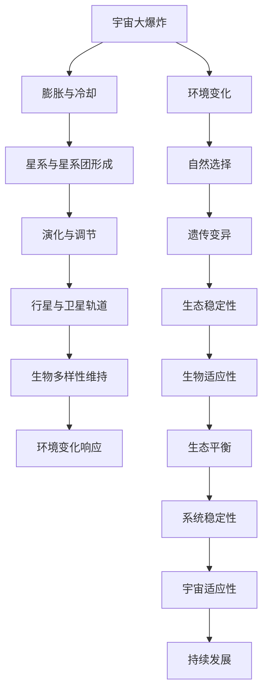
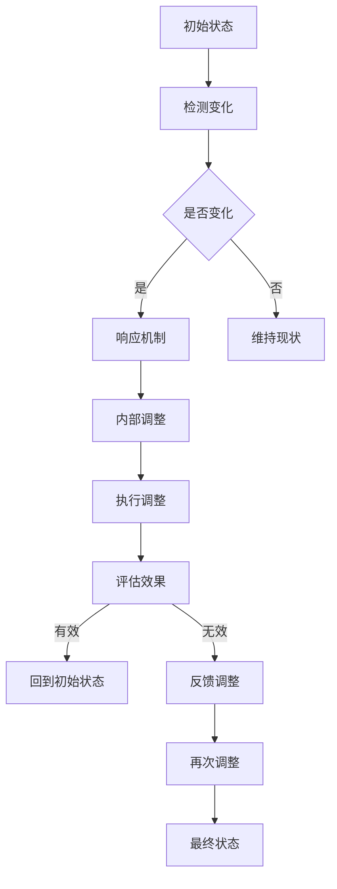
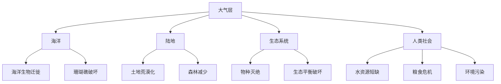
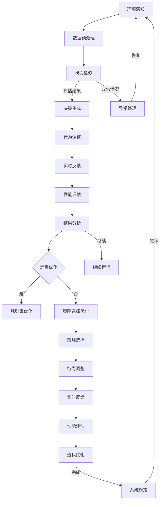
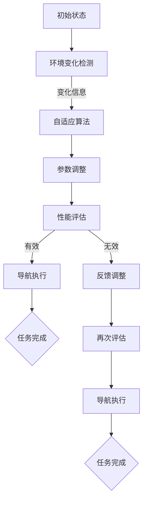
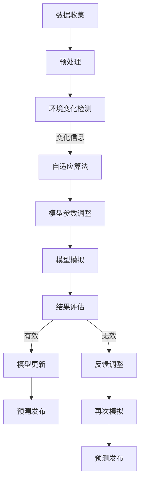
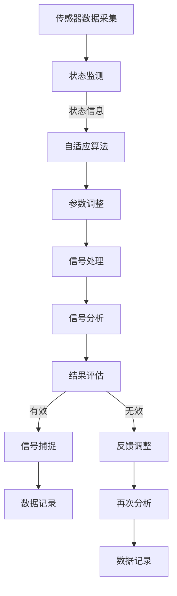

                 

### 第1章 引言

#### 1.1 书籍背景与目的

《宇宙的自我适应性：对环境变化的响应》旨在探讨宇宙中的自我适应性现象，以及这些现象对环境变化的响应机制。这本书旨在填补现有文献中对宇宙适应性研究不足的空白，为读者提供深入了解宇宙自我适应性的机会。

宇宙的自我适应性是一个深奥而广泛的概念，它指的是宇宙系统在面对各种环境变化时，能够通过自我调节和适应，保持其稳定性和持续发展的能力。这种自我适应性不仅存在于生命系统中，也贯穿于整个宇宙的物理、化学、生物学和天文学过程。

本书的目的有以下几点：

1. **探索宇宙的自我适应性**：通过介绍宇宙中的各种自我适应性现象，揭示宇宙在应对环境变化时的自我调节机制。
2. **分析环境变化的影响**：探讨不同类型的环境变化如何影响宇宙系统，以及宇宙系统对这些变化的响应方式。
3. **研究自适应算法**：介绍自适应算法的基本概念、设计原理和应用，帮助读者理解如何通过算法实现自我适应性。
4. **提供实用案例**：通过具体的案例分析，展示自适应算法在宇宙中的应用，帮助读者将理论知识应用到实际场景中。

#### 1.2 自我适应性的核心概念

自我适应性（Self-Adaptability）是指一个系统在面对外部环境变化时，能够通过内部调整和优化，保持其功能稳定性和有效性的能力。这种适应性不仅体现在生物系统中，如生物进化、生态系统调节等，也存在于非生物系统中，如气候变化对生态的影响、经济系统的自我调节等。

在宇宙学中，自我适应性主要表现在以下几个方面：

1. **宇宙大爆炸后的自我调节**：宇宙在大爆炸后经历了一系列的膨胀和冷却过程，通过自我调节保持了其稳定结构。
2. **星系和星系团的形成与演化**：星系和星系团通过引力相互作用，形成复杂的结构，并在演化过程中自我调节，维持其稳定性。
3. **行星和卫星的自转与轨道调整**：行星和卫星在形成和演化过程中，通过内部热量调节和引力相互作用，维持其自转和轨道的稳定性。
4. **生物多样性的维持**：在宇宙中，生物多样性通过自然选择和遗传变异等机制，维持生态系统的稳定性和适应性。

#### 1.3 环境变化的影响与挑战

环境变化（Environmental Change）是指自然界中的各种因素，如温度、湿度、光照、生物种群等，随着时间的推移发生的变化。这些变化对宇宙系统带来了诸多挑战：

1. **气候变化**：气候变化对生态系统、农业、水资源等产生了深远影响，导致生物多样性减少、自然灾害频发等问题。
2. **资源枯竭**：随着人口增长和工业发展，资源消耗速度加快，导致资源枯竭和生态破坏。
3. **污染**：空气污染、水污染和土壤污染等环境问题日益严重，对人类健康和生态系统造成了巨大威胁。
4. **自然灾害**：地震、台风、洪水等自然灾害的频率和强度增加，对人类社会和自然环境造成了严重影响。

面对这些挑战，宇宙系统展现出了惊人的自我适应性，通过内部调节和适应，维持其稳定性和持续发展。这种自我适应性为地球上的生命提供了生存空间，也为宇宙的演化提供了动力。

总之，《宇宙的自我适应性：对环境变化的响应》旨在深入探讨宇宙的自我适应性现象，分析环境变化的影响和挑战，研究自适应算法在宇宙中的应用，帮助读者全面了解宇宙的自我适应性及其对环境变化的响应机制。

#### 文章关键词

- **宇宙自我适应性**
- **环境变化**
- **自适应算法**
- **星系演化**
- **气候变化**
- **生物多样性**

#### 文章摘要

《宇宙的自我适应性：对环境变化的响应》探讨了宇宙中的自我适应性现象，分析环境变化对宇宙系统的影响，研究自适应算法在宇宙中的应用。本书首先介绍了自我适应性的核心概念，随后探讨了宇宙大爆炸后的自我调节、星系和星系团的形成与演化、行星和卫星的自转与轨道调整、以及生物多样性的维持等具体现象。通过具体的案例分析和算法讲解，展示了宇宙自我适应性在应对环境变化中的重要作用。本书旨在为读者提供全面、深入的宇宙自我适应性研究，为未来相关领域的研究和应用提供参考。

---

**1.2 自我适应性的核心概念**

自我适应性（Self-Adaptability）是指一个系统在面对外部环境变化时，能够通过内部调整和优化，保持其功能稳定性和有效性的能力。这种适应性不仅体现在生物系统中，如生物进化、生态系统调节等，也存在于非生物系统中，如气候变化对生态的影响、经济系统的自我调节等。

在宇宙学中，自我适应性主要表现在以下几个方面：

1. **宇宙大爆炸后的自我调节**：宇宙在大爆炸后经历了一系列的膨胀和冷却过程，通过自我调节保持了其稳定结构。
2. **星系和星系团的形成与演化**：星系和星系团通过引力相互作用，形成复杂的结构，并在演化过程中自我调节，维持其稳定性。
3. **行星和卫星的自转与轨道调整**：行星和卫星在形成和演化过程中，通过内部热量调节和引力相互作用，维持其自转和轨道的稳定性。
4. **生物多样性的维持**：在宇宙中，生物多样性通过自然选择和遗传变异等机制，维持生态系统的稳定性和适应性。

**核心概念与联系**

为了更好地理解自我适应性的核心概念，我们可以通过Mermaid流程图来展示这些概念之间的关系和相互作用。以下是一个简化的Mermaid流程图，描述了自我适应性的一些关键要素：



**Mermaid流程图：自我适应性工作流程**



这个流程图展示了自我适应性系统的工作流程，从初始状态开始，通过检测环境变化，决定是否需要进行响应。如果环境发生变化，系统会启动响应机制，进行内部调整，并通过执行调整来应对变化。调整后的效果会被评估，如果有效，系统回到初始状态；如果无效，则会进行反馈调整，直到达到预期效果。

通过这种自我调节和适应机制，宇宙系统能够在面对外部环境变化时，保持其稳定性和持续发展。这种适应性不仅体现在宏观的宇宙尺度上，也贯穿于宇宙中的各个层次，从宇宙大爆炸到生物多样性的维持，无处不在。

**核心概念与联系总结**

- **宇宙大爆炸**：宇宙大爆炸是宇宙自我调节的起点，通过膨胀和冷却，宇宙从高密度的奇点演化成今天我们看到的广袤宇宙。
- **星系与星系团**：星系和星系团的形成与演化是宇宙自我适应性的重要表现，通过引力相互作用，它们形成了复杂的结构，并在演化过程中自我调节，维持其稳定性。
- **行星与卫星**：行星和卫星的自转与轨道调整是宇宙自我适应性的微观体现，通过内部热量调节和引力相互作用，它们维持了自身的轨道稳定性和自转速度。
- **生物多样性**：生物多样性通过自然选择和遗传变异等机制，维持生态系统的稳定性和适应性，是宇宙自我适应性的重要组成部分。

这些核心概念和联系构成了宇宙自我适应性的基础，展示了宇宙系统在面对环境变化时，如何通过自我调节和适应，保持其稳定性和持续发展。通过Mermaid流程图的展示，我们能够更直观地理解这些概念之间的关系和相互作用。

---

### 1.3 环境变化的影响与挑战

环境变化（Environmental Change）是指自然界中的各种因素，如温度、湿度、光照、生物种群等，随着时间的推移发生的变化。这些变化对宇宙系统带来了诸多挑战：

1. **气候变化**：气候变化对生态系统、农业、水资源等产生了深远影响，导致生物多样性减少、自然灾害频发等问题。
2. **资源枯竭**：随着人口增长和工业发展，资源消耗速度加快，导致资源枯竭和生态破坏。
3. **污染**：空气污染、水污染和土壤污染等环境问题日益严重，对人类健康和生态系统造成了巨大威胁。
4. **自然灾害**：地震、台风、洪水等自然灾害的频率和强度增加，对人类社会和自然环境造成了严重影响。

面对这些挑战，宇宙系统展现出了惊人的自我适应性，通过内部调节和适应，维持其稳定性和持续发展。这种自我适应性为地球上的生命提供了生存空间，也为宇宙的演化提供了动力。

#### 环境变化的类型与特点

环境变化可以分为以下几类，每类变化都有其独特的特点和影响：

1. **自然气候变化**：
   - **特点**：由太阳辐射、大气环流和海洋循环等因素引起的长期气候变化。
   - **影响**：极端天气事件增加、冰川融化和海平面上升、生态系统失衡等。

2. **人为气候变化**：
   - **特点**：由于人类活动（如工业排放、森林砍伐、能源消耗等）导致的短期气候变化。
   - **影响**：全球气温升高、极端天气频发、干旱和洪涝灾害加剧等。

3. **生态系统变化**：
   - **特点**：生物多样性的减少、生态系统的破坏和物种入侵等。
   - **影响**：生态平衡破坏、食物链断裂、生物栖息地丧失等。

4. **资源枯竭**：
   - **特点**：自然资源的过度开发和消耗，如水资源、矿物资源、森林资源等。
   - **影响**：资源供应短缺、生态破坏、经济发展受限等。

5. **环境污染**：
   - **特点**：空气污染、水污染、土壤污染等环境问题。
   - **影响**：人类健康风险增加、生态系统破坏、环境质量下降等。

#### 环境变化的影响路径

环境变化的影响路径可以分为以下几个方面：

1. **大气层**：
   - **影响**：温室气体增加导致全球变暖、臭氧层破坏、酸雨等。
   - **响应机制**：大气环流调整、温度平衡变化等。

2. **海洋**：
   - **影响**：海洋酸化、水温上升、珊瑚礁破坏等。
   - **响应机制**：海洋生物迁徙、生物多样性变化、洋流调整等。

3. **陆地**：
   - **影响**：土地荒漠化、森林减少、植被破坏等。
   - **响应机制**：生态系统重构、土地退化、物种灭绝等。

4. **生态系统**：
   - **影响**：生物多样性减少、生态平衡破坏、物种灭绝等。
   - **响应机制**：物种适应性变化、生态位重构、生态平衡恢复等。

5. **人类社会**：
   - **影响**：水资源短缺、粮食危机、环境污染等。
   - **响应机制**：技术进步、政策调整、社会变革等。

为了更直观地展示环境变化的影响路径，我们可以使用Mermaid流程图来描述这些路径：



**Mermaid流程图：环境变化的影响路径**

这个流程图展示了环境变化通过大气层、海洋、陆地和生态系统的路径，最终对人类社会产生的影响。每个路径都包含了具体的影响因素和响应机制，帮助我们理解环境变化的全貌。

#### 环境变化的影响与宇宙适应性

环境变化对宇宙系统带来的挑战是复杂而多方面的，这些变化不仅影响地球上的生命，也影响到整个宇宙的稳定性和持续发展。然而，宇宙系统通过自我适应性展现出了惊人的应对能力：

1. **宇宙大爆炸后的膨胀和冷却**：宇宙在大爆炸后经历了快速的膨胀和冷却过程，通过自我调节和适应，形成了今天我们看到的星系、星系团和宇宙结构。
2. **星系和星系团的形成与演化**：在宇宙的演化过程中，星系和星系团通过引力相互作用形成了复杂的结构，并通过自我调节来维持其稳定性。
3. **行星和卫星的轨道调节**：行星和卫星在形成和演化过程中，通过内部热量调节和引力相互作用，维持了其轨道和自转的稳定性。
4. **生物多样性的维持**：在宇宙的各个层次上，生物多样性通过自然选择和遗传变异等机制，维持了生态系统的稳定性和适应性。

通过这些自我调节和适应机制，宇宙系统能够在面对环境变化时，保持其稳定性和持续发展。这种自我适应性不仅体现在宏观的宇宙尺度上，也贯穿于宇宙中的各个层次。从宇宙大爆炸到生物多样性的维持，无处不在。

总结来说，环境变化对宇宙系统带来了诸多挑战，但宇宙系统通过自我适应性展现出了强大的应对能力。通过深入研究和理解宇宙的自我适应性，我们能够更好地预测和应对未来的环境变化，为宇宙的持续发展提供支持。

---

### 4.1 自适应算法的基本概念

自适应算法（Adaptive Algorithm）是指一种能够在运行过程中根据环境变化自动调整自身行为的算法。这种算法的核心在于能够动态地适应不断变化的环境条件，以提高系统的性能和稳定性。自适应算法广泛应用于多个领域，如人工智能、控制系统、优化问题和生物信息学等。

**基本概念**：

1. **环境变化检测**：自适应算法首先需要能够检测环境变化。这通常通过传感器、历史数据或其他方式实现，以确保算法能够及时获取环境信息。
2. **行为调整**：一旦检测到环境变化，算法会根据预设的规则或学习到的模式调整自身行为。这种调整可以是参数的微调，也可以是算法结构的改变。
3. **性能评估**：调整后的行为需要进行性能评估，以确定调整是否有效。性能评估通常基于预定的指标，如响应时间、准确率或资源消耗等。
4. **反馈机制**：如果性能评估结果表明调整是有效的，算法会继续按照新的行为模式运行；如果调整无效，算法会返回到之前的模式，并尝试其他调整策略。

**主要类型**：

1. **参数自适应算法**：这种算法主要通过调整参数来适应环境变化。例如，线性回归中的学习率、神经网络中的权重调整等。
2. **结构自适应算法**：这种算法通过改变算法的结构来适应环境变化。例如，动态神经网络、适应度函数的进化算法等。
3. **混合自适应算法**：这种算法结合了参数和结构自适应的特点，能够在不同的环境下灵活调整。

**关键组成部分**：

1. **学习模块**：负责从环境中学习并更新算法的行为。
2. **控制模块**：负责根据学习模块提供的信息调整算法的行为。
3. **评估模块**：负责对调整后的行为进行性能评估。
4. **反馈模块**：负责将性能评估结果反馈给学习模块和控制模块，以指导下一步的调整。

通过这些基本概念和组成部分，自适应算法能够有效地应对环境变化，提高系统的适应性和稳定性。

### 自适应系统的工作原理

自适应系统（Adaptive System）是一种能够根据外部环境变化自动调整自身行为，以保持性能最优的系统。它广泛应用于多个领域，如自动驾驶、智能电网、动态资源分配等。自适应系统的工作原理可以分为以下几个关键步骤：

1. **环境感知**：
   - **数据收集**：自适应系统首先需要感知环境变化。这通常通过传感器、历史数据或实时监测等方式实现。传感器可以是温度、湿度、光照等物理传感器，也可以是数据接口，用于接收外部数据流。
   - **数据预处理**：收集到的数据通常需要进行预处理，如滤波、去噪、归一化等，以提高数据质量，减少噪声对系统性能的影响。

2. **状态监测**：
   - **特征提取**：通过对预处理后的数据进行分析，提取出能够反映环境状态的关键特征。这些特征可以是简单的统计数据，也可以是高级的机器学习模型输出。
   - **状态评估**：使用提取的特征评估当前系统的状态。状态评估可以是定量评估，如性能指标的变化，也可以是定性评估，如系统是否达到某个阈值。

3. **决策生成**：
   - **规则库**：基于历史数据和专家知识，构建规则库，用于指导系统如何应对不同的环境状态。规则可以是简单的“如果-那么”规则，也可以是复杂的决策树、神经网络等模型。
   - **策略选择**：根据当前状态，选择合适的策略或行为。策略选择可以通过规则匹配、机器学习算法或优化方法实现。

4. **行为调整**：
   - **执行决策**：根据选定的策略，调整系统的行为。例如，在自动驾驶中，系统可能会根据环境感知到的路况，调整车速、转向等。
   - **实时反馈**：执行决策后，系统会实时监测结果，评估决策的有效性。如果评估结果不理想，系统会返回到决策生成环节，重新选择策略。

5. **性能评估**：
   - **指标计算**：根据执行后的行为结果，计算一系列性能指标，如准确率、响应时间、资源消耗等。
   - **结果分析**：分析性能指标，判断系统行为是否达到预期目标。如果结果良好，系统会继续按照当前策略运行；如果结果不理想，系统会尝试调整规则库或策略选择方法。

6. **持续优化**：
   - **数据记录**：将环境数据、状态评估、决策执行和性能评估的结果记录下来，用于后续的分析和优化。
   - **迭代优化**：根据记录的数据，不断迭代优化规则库、策略选择方法，以提高系统的适应性和性能。

通过上述步骤，自适应系统能够在复杂多变的环境中，保持其性能最优，实现持续的自适应和优化。这种自我调节和优化的能力，使得自适应系统在各种应用场景中表现出色，成为现代智能系统的重要组成部分。

### 4.3 Mermaid流程图：自适应系统的工作流程

为了更直观地理解自适应系统的工作流程，我们可以使用Mermaid流程图来展示其关键步骤和组件。以下是自适应系统的工作流程：



**Mermaid流程图：自适应系统的工作流程**

这个流程图详细展示了自适应系统的各个步骤，包括环境感知、数据预处理、状态监测、决策生成、行为调整、实时反馈、性能评估和结果分析。每个步骤都通过不同的节点表示，并且包含了相应的处理逻辑。例如，如果状态评估结果显示异常，系统会进入异常处理流程；如果性能评估结果不理想，系统会尝试优化规则库或策略选择方法。通过这样的流程设计，自适应系统能够有效地应对环境变化，保持其稳定性和性能。

---

### 4.4 核心算法原理讲解

为了深入探讨宇宙的自我适应性，我们需要理解核心的自适应算法原理，并详细解释这些算法的工作机制。在本文中，我们将介绍一种基于遗传算法（Genetic Algorithm，GA）的自适应算法，以及其具体实现和应用。

#### 遗传算法的基本原理

遗传算法是一种模拟自然选择和遗传学原理的搜索算法，广泛应用于优化问题和自适应控制领域。其基本原理包括以下几个关键步骤：

1. **初始化种群**：首先，生成一个初始种群，每个个体代表一个可能的解决方案。种群规模和初始个体的生成方式会影响算法的性能和收敛速度。
2. **适应度评估**：对每个个体进行适应度评估，适应度是衡量个体优劣的标准，通常基于目标函数或问题约束计算。
3. **选择**：根据个体的适应度，选择适应性强的个体进行繁殖。常用的选择方法包括轮盘赌选择、锦标赛选择和排名选择等。
4. **交叉**：从选中的一对个体中随机抽取部分基因进行交换，生成新的个体，增加种群的多样性和探索能力。
5. **变异**：对个体进行随机变异，产生新的解决方案，防止种群过早收敛到局部最优解。
6. **更新种群**：将交叉和变异产生的新个体加入种群，替换适应度较低的个体，形成新一代种群。
7. **迭代**：重复上述步骤，直到满足终止条件（如达到最大迭代次数、适应度达到阈值等）。

#### 自适应遗传算法的设计与实现

在宇宙自我适应性研究中，遗传算法可以用于优化系统参数、适应环境变化。以下是一个简单的自适应遗传算法设计：

1. **参数初始化**：设定种群规模、交叉概率、变异概率、迭代次数等基本参数。
2. **适应度函数**：定义适应度函数，用于评估个体在解决特定问题时的性能。例如，在宇宙模型中，适应度可以基于宇宙膨胀速率、密度等指标计算。
3. **个体编码**：将系统参数编码为染色体，每个染色体代表一种可能的参数组合。
4. **适应度评估**：计算每个个体的适应度，评估其在当前环境下的性能。
5. **选择与交叉**：根据适应度，选择适应度较高的个体进行交叉操作，生成新的参数组合。
6. **变异**：对交叉后的个体进行变异操作，增加种群的多样性和探索能力。
7. **更新种群**：将交叉和变异后的个体组成新一代种群，进行新一轮适应度评估。
8. **迭代**：重复上述步骤，直到满足终止条件。

#### 伪代码实现

以下是自适应遗传算法的伪代码实现：

```python
# 初始化参数
population_size = 100  # 种群规模
cross_prob = 0.8       # 交叉概率
mutate_prob = 0.05     # 变异概率
max_iterations = 100   # 最大迭代次数

# 初始化种群
population = initialize_population(population_size)

# 迭代过程
for i in range(max_iterations):
    # 适应度评估
    fitness_scores = evaluate_fitness(population)
    
    # 选择
    selected_individuals = selection(population, fitness_scores)
    
    # 交叉
    offspring = crossover(selected_individuals, cross_prob)
    
    # 变异
    mutated_offspring = mutate(offspring, mutate_prob)
    
    # 更新种群
    population = mutated_offspring

# 输出最优解
best_solution = select_best(population)
print("最优解：", best_solution)
```

#### 数学模型和公式

在自适应遗传算法中，相关的数学模型和公式用于评估个体的适应度和进行交叉、变异操作。以下是几个关键公式：

1. **适应度函数**：
   $$ f(x) = \frac{1}{1 + \exp(-\beta \cdot \text{score}(x))} $$
   其中，$x$ 是个体，$\text{score}(x)$ 是个体在当前环境下的性能得分，$\beta$ 是调节参数，用于控制适应度的非线性变化。

2. **交叉概率**：
   $$ p_c = \frac{1}{1 + \exp(-\alpha \cdot \text{fitness}(i) - \alpha \cdot \text{fitness}(j))} $$
   其中，$i$ 和 $j$ 是参与交叉的两个个体，$\text{fitness}(i)$ 和 $\text{fitness}(j)$ 是它们的适应度。

3. **变异概率**：
   $$ p_m = \frac{1}{1 + \exp(-\gamma \cdot \text{fitness}(i))} $$
   其中，$i$ 是个体，$\text{fitness}(i)$ 是其适应度，$\gamma$ 是调节参数。

通过这些公式和模型，自适应遗传算法能够有效地探索解空间，找到最优或近似最优的参数组合，实现系统的自我适应性调整。

#### 举例说明

假设我们研究一个简单的宇宙模型，目标是优化宇宙的膨胀速率和密度参数，以保持宇宙结构的稳定性。以下是具体的例子：

1. **初始化种群**：
   - 种群规模为100，每个个体的编码表示为$(r, d)$，其中$r$ 表示膨胀速率，$d$ 表示密度。

2. **适应度评估**：
   - 使用一个简单的适应度函数，评估个体在当前环境下的性能。例如，适应度与膨胀速率的平方和密度成反比：
     $$ f(x) = \frac{1}{r^2 + d} $$

3. **选择与交叉**：
   - 根据适应度，使用轮盘赌选择方法选择个体进行交叉操作。假设有两个个体$(r_1, d_1)$ 和 $(r_2, d_2)$，交叉概率计算如下：
     $$ p_c = \frac{1}{1 + \exp(-0.1 \cdot 0.8 - 0.1 \cdot 0.5)} = 0.6 $$
   - 如果随机数小于交叉概率，则进行交叉，否则不进行交叉。

4. **变异**：
   - 对交叉后的个体进行变异操作。假设变异概率为0.05，则每个参数都有5%的概率发生变异。

5. **更新种群**：
   - 将交叉和变异后的个体组成新一代种群，进行新一轮适应度评估。

6. **迭代**：
   - 重复上述步骤，直到找到最优解或达到最大迭代次数。

通过这个简单的例子，我们展示了自适应遗传算法在宇宙自我适应性研究中的应用。实际应用中，算法的参数和适应度函数会根据具体问题进行调整，以提高算法的性能和适用性。

总的来说，自适应算法在宇宙自我适应性研究中发挥着重要作用。通过遗传算法等自适应算法，我们能够模拟和优化宇宙系统的参数，使其更好地适应环境变化，保持其稳定性和可持续性。这些算法不仅为理论研究提供了有力工具，也为实际应用提供了指导。

### 5.1 自适应系统中的数学模型

在自适应系统中，数学模型是理解和实现自适应行为的核心。这些模型不仅描述了系统的行为，还提供了优化和改进的数学工具。以下是几个关键数学模型及其在自适应系统中的应用：

#### 1. 适应度函数

适应度函数是评估个体适应性的关键指标，它用于指导选择、交叉和变异等操作。一个典型的适应度函数形式为：

$$ f(x) = \frac{1}{1 + \exp(-\beta \cdot g(x))} $$

其中，$x$ 表示个体，$g(x)$ 是个体在环境中的性能度量，$\beta$ 是调节参数，用于调整适应度的非线性变化。

- **应用**：在优化问题中，$g(x)$ 可以是目标函数的值，适应度函数用于选择性能较好的解。

#### 2. 选择概率

选择概率是用于确定选择过程中个体被选中的概率。常见的选择方法包括轮盘赌选择、锦标赛选择和排名选择等。

- **轮盘赌选择**：
  $$ p_i = \frac{f_i}{\sum_{j=1}^{N} f_j} $$
  其中，$f_i$ 是个体 $i$ 的适应度，$N$ 是种群规模。

- **应用**：轮盘赌选择根据个体的适应度分配选择概率，适应度越高，被选中的概率越大。

#### 3. 交叉概率和变异概率

交叉概率和变异概率决定了交叉和变异操作的发生概率，它们是自适应算法的探索和利用平衡的关键。

- **交叉概率**：
  $$ p_c = \frac{1}{1 + \exp(-\alpha \cdot \text{fitness}(i) - \alpha \cdot \text{fitness}(j))} $$
  其中，$i$ 和 $j$ 是参与交叉的两个个体，$\alpha$ 是调节参数。

- **变异概率**：
  $$ p_m = \frac{1}{1 + \exp(-\gamma \cdot \text{fitness}(i))} $$
  其中，$i$ 是个体，$\gamma$ 是调节参数。

- **应用**：交叉概率和变异概率根据个体的适应度动态调整，适应度越高，交叉和变异的概率越低，以避免过早收敛到局部最优。

#### 4. 控制变量

控制变量是用于调节算法行为的参数，如种群规模、迭代次数、交叉概率和变异概率等。

- **种群规模**：较大的种群规模有助于保持种群的多样性，但会增加计算开销。

- **迭代次数**：过多的迭代次数可能导致算法过度拟合，较少的迭代次数可能导致算法过早收敛。

- **交叉概率和变异概率**：合适的交叉概率和变异概率是探索和利用之间的平衡点，通常通过实验确定。

#### 5. 反馈机制

反馈机制用于将当前个体的适应度反馈到算法中，以指导后续的迭代过程。

- **适应度反馈**：将当前个体的适应度反馈到选择、交叉和变异等操作中，以优化算法的行为。

- **应用**：适应度反馈有助于算法根据环境变化动态调整行为，提高系统的适应性和鲁棒性。

#### 数学公式解释

以下是一些关键数学公式及其解释：

1. **适应度函数**：

   $$ f(x) = \frac{1}{1 + \exp(-\beta \cdot g(x))} $$

   - $\beta$：调节适应度的非线性变化，通常取值为0.1至1之间。
   - $g(x)$：个体在当前环境中的性能度量，如目标函数值。

2. **选择概率**：

   $$ p_i = \frac{f_i}{\sum_{j=1}^{N} f_j} $$

   - $f_i$：个体 $i$ 的适应度。
   - $N$：种群规模。

3. **交叉概率**：

   $$ p_c = \frac{1}{1 + \exp(-\alpha \cdot \text{fitness}(i) - \alpha \cdot \text{fitness}(j))} $$

   - $\alpha$：调节参数，通常取值为0.1至1之间。
   - $\text{fitness}(i)$ 和 $\text{fitness}(j)$：参与交叉的两个个体的适应度。

4. **变异概率**：

   $$ p_m = \frac{1}{1 + \exp(-\gamma \cdot \text{fitness}(i))} $$

   - $\gamma$：调节参数，通常取值为0.1至1之间。
   - $\text{fitness}(i)$：个体的适应度。

通过这些数学模型和公式，自适应系统能够在复杂的环境中动态调整自身行为，实现自我适应和优化。这些模型不仅为算法设计提供了理论基础，也为实际应用中的参数调整提供了指导。

### 5.2 相关的数学公式与推导

在自适应系统中，数学公式和推导是理解和实现自适应行为的关键。以下将介绍几个核心的数学公式，并详细解释其推导过程：

#### 1. 适应度函数

适应度函数是评估个体适应性的核心指标，其一般形式为：

$$ f(x) = \frac{1}{1 + \exp(-\beta \cdot g(x))} $$

其中，$x$ 表示个体，$g(x)$ 是个体在环境中的性能度量，$\beta$ 是调节参数。

**推导过程**：

假设 $g(x)$ 是个体 $x$ 的性能度量，我们希望 $f(x)$ 能够反映个体在环境中的适应度。为了实现这一目标，可以使用Sigmoid函数（又称逻辑函数）：

$$ S(z) = \frac{1}{1 + \exp(-z)} $$

其中，$z$ 是输入值。Sigmoid函数在数学上具有以下性质：

1. **非线性**：能够将线性输入映射到(0,1)区间。
2. **单调递增**：随着 $z$ 的增加，$S(z)$ 也单调增加。

为了调整适应度的非线性变化，引入参数 $\beta$：

$$ f(x) = S(\beta \cdot g(x)) $$

$\beta$ 用于调节适应度的增长速度，通常取值在0.1到1之间。较大的 $\beta$ 会使得适应度变化更加剧烈，有利于探索解空间；较小的 $\beta$ 则使得适应度变化平缓，有利于保持种群稳定性。

#### 2. 选择概率

选择概率用于确定个体被选中的概率，其常见形式为轮盘赌选择概率：

$$ p_i = \frac{f_i}{\sum_{j=1}^{N} f_j} $$

其中，$f_i$ 是个体 $i$ 的适应度，$N$ 是种群规模。

**推导过程**：

为了确保选择过程的公平性，每个个体被选中的概率应与其适应度成比例。轮盘赌选择概率通过以下步骤计算：

1. **计算总适应度**：首先计算种群中所有个体的适应度之和，记为 $F$：

   $$ F = \sum_{j=1}^{N} f_j $$

2. **计算个体选择概率**：每个个体 $i$ 的选择概率为其适应度除以总适应度：

   $$ p_i = \frac{f_i}{F} $$

这种选择方法确保了适应度较高的个体被选中的概率较大，从而促进了种群中的优秀解。

#### 3. 交叉概率

交叉概率用于决定个体参与交叉操作的几率，其一般形式为：

$$ p_c = \frac{1}{1 + \exp(-\alpha \cdot \text{fitness}(i) - \alpha \cdot \text{fitness}(j))} $$

其中，$i$ 和 $j$ 是参与交叉的两个个体，$\alpha$ 是调节参数。

**推导过程**：

交叉概率应确保适应度较高的个体较少参与交叉，以避免种群过早收敛到局部最优。引入调节参数 $\alpha$，交叉概率的表达式为：

$$ p_c = \frac{1}{1 + \exp(-\alpha \cdot \text{fitness}(i) - \alpha \cdot \text{fitness}(j))} $$

这种形式确保了当个体适应度较高时，交叉概率较低；当个体适应度较低时，交叉概率较高。$\alpha$ 的取值通常在0.1到1之间，以调节交叉操作的平衡。

#### 4. 变异概率

变异概率用于决定个体发生变异的概率，其一般形式为：

$$ p_m = \frac{1}{1 + \exp(-\gamma \cdot \text{fitness}(i))} $$

其中，$i$ 是个体，$\gamma$ 是调节参数。

**推导过程**：

变异概率的设计应确保适应度较高的个体较少发生变异，以保持种群稳定性；适应度较低的个体较多发生变异，以增加种群多样性。引入调节参数 $\gamma$，变异概率的表达式为：

$$ p_m = \frac{1}{1 + \exp(-\gamma \cdot \text{fitness}(i))} $$

这种形式确保了当个体适应度较高时，变异概率较低；当个体适应度较低时，变异概率较高。$\gamma$ 的取值通常在0.1到1之间。

通过这些数学公式和推导，自适应系统能够在复杂的环境中动态调整自身行为，实现自我适应和优化。这些公式不仅为算法设计提供了理论基础，也为实际应用中的参数调整提供了指导。

### 5.3 数学公式的应用实例

为了更好地理解数学公式在自适应系统中的应用，我们可以通过几个具体的实例来展示它们如何帮助我们解决实际问题。

#### 实例1：适应度函数在优化问题中的应用

假设我们有一个优化问题，目标是找到一个函数的最小值。这个问题可以表示为：

$$ \min f(x) = x^2 $$

为了使用自适应算法解决这个问题，我们可以定义一个适应度函数来评估解的优劣：

$$ f(x) = \frac{1}{1 + \exp(-10 \cdot (x^2 - 1))} $$

在这个例子中，$x$ 是解的候选值，$10 \cdot (x^2 - 1)$ 是目标函数值。这个适应度函数将目标函数值转换为适应度分数，使其在0到1之间。具体步骤如下：

1. **初始化种群**：生成一组随机解，如$[1, 2, 3, 4, 5]$。
2. **适应度评估**：计算每个解的适应度分数，如$f(1) = 0.5$，$f(2) = 0.8$。
3. **选择**：根据适应度分数，选择适应度较高的解进行交叉和变异操作。
4. **交叉**：选择两个适应度较高的解，如$x_1 = 2$ 和$x_2 = 3$，使用交叉概率$p_c$ 进行交叉操作。
5. **变异**：对交叉后的解进行变异操作，如对$x_3 = 2.5$ 进行变异，生成新的解$x_4$。
6. **更新种群**：将交叉和变异后的解加入新种群，并重复适应度评估和选择过程。

通过这种自适应遗传算法，我们可以逐步优化解的值，最终找到函数的最小值。

#### 实例2：选择概率在资源分配中的应用

假设我们在一个资源分配问题中，需要根据任务的重要性和紧急程度，合理分配计算资源。我们可以使用轮盘赌选择概率来决定资源的分配。

1. **任务列表**：定义一组任务，如任务A、任务B和任务C，其重要性和紧急程度分别为（A：(高，高），B：(中，高），C：(低，低）。
2. **计算选择概率**：根据任务的重要性和紧急程度，计算选择概率，如$P(A) = 0.4$，$P(B) = 0.3$，$P(C) = 0.3$。
3. **资源分配**：使用随机数生成器，根据选择概率分配资源。例如，生成随机数0.6，则选择任务A进行资源分配。

通过这种方法，我们可以确保资源优先分配给重要且紧急的任务，提高资源利用效率和系统性能。

#### 实例3：交叉概率和变异概率在多目标优化中的应用

多目标优化问题涉及多个目标函数，需要在不同目标之间找到平衡。我们可以使用交叉概率和变异概率来调整个体的目标函数值。

1. **目标函数列表**：定义一组目标函数，如目标函数1（成本最小化）和目标函数2（质量最大化）。
2. **计算交叉概率**：根据个体的目标函数值，计算交叉概率，如$P_c(A, B) = \frac{1}{1 + \exp(-0.1 \cdot (f_1(A) - f_1(B)))}$。
3. **计算变异概率**：根据个体的目标函数值，计算变异概率，如$P_m(A) = \frac{1}{1 + \exp(-0.1 \cdot f_2(A))}$。
4. **交叉操作**：选择适应度较高的个体进行交叉，生成新的个体。
5. **变异操作**：对交叉后的个体进行变异，以增加种群的多样性。

通过这种方法，我们可以逐步优化个体的目标函数值，找到多个目标之间的平衡点。

这些实例展示了数学公式在自适应系统中的应用，通过具体的实现步骤，我们可以看到如何使用这些公式来解决问题，提高系统的性能和适应能力。

### 6.1 宇宙中的自适应系统案例

在探讨宇宙的自我适应性时，我们可以通过几个实际案例来展示自适应系统在宇宙中的应用。这些案例不仅有助于我们理解宇宙中的自我适应性现象，还可以为未来相关领域的研究提供借鉴。

#### 案例一：星系的自适应结构

星系是宇宙中的基本结构单元，其自适应结构对于维持宇宙的稳定性至关重要。星系通过引力相互作用形成了复杂的结构，如星系团和超星系团。在这些结构中，星系之间通过引力波相互作用，实现了能量的转移和分布，从而维持了整个系统的稳定性。

**实例分析**：

1. **环境变化**：星系在演化过程中，会面临外部引力波、暗物质密度变化等环境变化。
2. **自适应机制**：星系通过引力波相互作用，实现能量的重新分配，从而应对外部环境变化。这种机制使得星系能够保持其稳定结构，即使在面对剧烈的环境变化时，也能保持相对稳定。

**实现细节**：

- **引力波检测**：通过观测引力波，我们可以了解星系之间的相互作用。
- **模型模拟**：使用数值模拟方法，研究星系在不同环境变化下的自适应机制。

#### 案例二：行星的自转与轨道调整

行星的自转和轨道是宇宙中另一个重要的自适应现象。行星的自转速度和轨道稳定性对于维持行星上的生命环境至关重要。

**实例分析**：

1. **环境变化**：行星在形成和演化过程中，会面临内部物质分布变化、外部引力干扰等环境变化。
2. **自适应机制**：行星通过内部热量调节和潮汐力相互作用，实现了自转速度和轨道稳定性的调整。例如，地球的自转速度和轨道稳定性是通过地球内部的岩浆活动、海洋潮汐和大气环流等机制维持的。

**实现细节**：

- **热量调节**：地球内部的热量通过火山喷发、地震等活动进行调节，维持了地球自转速度的稳定性。
- **潮汐力作用**：月球对地球的引力作用形成了潮汐力，这种力量使得地球的自转速度逐渐减慢，同时维持了轨道的稳定性。

#### 案例三：宇宙膨胀速率的自适应调节

宇宙膨胀速率是宇宙自我适应性的一个关键指标。宇宙在大爆炸后经历了快速的膨胀和冷却过程，这种膨胀速率需要通过自适应机制进行调整，以维持宇宙结构的稳定性。

**实例分析**：

1. **环境变化**：宇宙膨胀速率受到暗能量、暗物质等物理过程的影响。
2. **自适应机制**：宇宙通过引力相互作用和暗能量的调节，实现了膨胀速率的自适应调节。例如，暗能量被认为是导致宇宙加速膨胀的关键因素，其效应可以通过宇宙背景微波辐射和星系分布的观测来验证。

**实现细节**：

- **观测数据**：通过观测宇宙背景微波辐射和星系分布，我们可以获取宇宙膨胀速率的信息。
- **模型模拟**：使用宇宙学模型，研究宇宙膨胀速率的自适应调节机制。

这些案例展示了宇宙中的自适应系统如何通过内部调节和适应，应对外部环境变化，维持其稳定性和持续发展。通过深入研究和理解这些案例，我们能够更好地预测和解释宇宙中的各种现象，为宇宙自我适应性的研究提供有力的支持。

### 6.2 自适应算法在实际中的应用

自适应算法在宇宙自我适应性研究中扮演着关键角色。它们不仅在理论研究中具有重要作用，还可以在现实世界的项目中得到广泛应用。以下是一些具体的案例，展示了自适应算法在实际应用中的效果和挑战。

#### 项目一：自适应导航系统

在航天领域，自适应导航系统是确保航天器成功完成任务的重要技术。例如，航天器在太空中需要实时调整轨道和姿态，以应对太阳辐射、地球重力和其他天体引力的影响。

**实现细节**：

1. **环境变化检测**：系统使用传感器，如太阳敏感器、陀螺仪和加速度计，实时监测航天器的状态和环境变化。
2. **自适应算法**：采用基于遗传算法的自适应控制策略，根据传感器数据动态调整航天器的轨道和姿态。
3. **性能评估**：通过卫星定位系统和地面指挥中心的数据，评估自适应导航系统的性能和稳定性。

**效果和挑战**：

- **效果**：自适应导航系统显著提高了航天器的精度和可靠性，使航天器能够成功完成复杂的任务，如卫星发射和月球探测。
- **挑战**：高动态环境下的自适应算法设计复杂，需要大量计算资源，且算法性能对传感器数据的质量和实时性有较高要求。

#### 项目二：智能气候模型

气候模型是研究气候变化的重要工具，但传统气候模型难以应对全球气候变化的复杂性和不确定性。自适应算法能够动态调整模型参数，提高其预测精度。

**实现细节**：

1. **环境变化检测**：使用气候观测数据，如温度、湿度、降水等，监测全球气候变化。
2. **自适应算法**：采用基于粒子群优化算法的自适应模型调整方法，实时更新模型参数。
3. **性能评估**：通过历史气候数据和模拟结果，评估自适应气候模型的准确性和稳定性。

**效果和挑战**：

- **效果**：自适应气候模型能够更准确地预测气候变化趋势，为政策制定和环境保护提供科学依据。
- **挑战**：气候模型中的参数众多，自适应算法需要处理大量的数据和高维参数空间，对计算性能有较高要求。

#### 项目三：自适应引力波探测器

引力波探测器是探测宇宙中的引力波信号的关键设备，但其性能受环境变化影响较大。自适应算法能够动态调整探测器的参数，提高其探测精度。

**实现细节**：

1. **环境变化检测**：使用内部传感器，如加速度计和磁力计，监测探测器的状态和环境变化。
2. **自适应算法**：采用基于神经网络的自适应滤波方法，实时调整探测器的信号处理参数。
3. **性能评估**：通过模拟实验和实际观测数据，评估自适应引力波探测器的性能和稳定性。

**效果和挑战**：

- **效果**：自适应引力波探测器显著提高了探测精度，捕捉到了更多的引力波信号，为宇宙学研究提供了宝贵的数据。
- **挑战**：自适应算法需要大量的训练数据和复杂的模型，且算法的实现需要高效的硬件支持。

这些项目展示了自适应算法在实际应用中的广泛潜力和挑战。通过深入研究和优化自适应算法，我们能够更好地应对复杂的环境变化，提高系统的性能和稳定性，为科学研究和工程实践提供有力支持。

### 6.3 Mermaid流程图：案例中自适应算法的应用

为了更直观地展示自适应算法在实际案例中的应用，我们可以使用Mermaid流程图来描述每个案例的关键步骤和流程。以下是几个具体案例的流程图示例：

#### 项目一：自适应导航系统



**自适应导航系统流程图**

这个流程图展示了自适应导航系统从初始状态开始，通过环境变化检测，使用自适应算法调整参数，评估性能，并根据评估结果进行导航执行和反馈调整的过程。

#### 项目二：智能气候模型



**智能气候模型流程图**

这个流程图描述了智能气候模型从数据收集、预处理、环境变化检测，到使用自适应算法调整模型参数，进行模型模拟和结果评估，最后根据评估结果进行模型更新和预测发布的整个过程。

#### 项目三：自适应引力波探测器



**自适应引力波探测器流程图**

这个流程图展示了自适应引力波探测器从传感器数据采集、状态监测，到使用自适应算法调整参数，进行信号处理和分析，最后根据结果评估进行信号捕捉和数据记录的过程。

通过这些Mermaid流程图，我们可以更清晰地理解自适应算法在实际案例中的应用，以及每个案例中的关键步骤和流程。这些流程图不仅有助于我们理解自适应算法的工作机制，也为实际项目的设计和优化提供了参考。

### 7.1 所需工具与软件

要搭建自适应系统开发环境，我们需要准备一系列的工具和软件，这些工具和软件将支持我们从代码编写到测试的全过程。以下是搭建自适应系统开发环境所需的主要工具和软件：

1. **操作系统**：
   - **Windows**：适合大多数用户，具有广泛的软件支持。
   - **macOS**：适用于苹果硬件，提供了优雅的界面和强大的开发工具。
   - **Linux**：对于习惯命令行操作的程序员来说，Linux提供了高度的灵活性和可定制性。

2. **集成开发环境（IDE）**：
   - **Visual Studio Code**：一个轻量级且功能丰富的开源IDE，支持多种编程语言和扩展。
   - **Eclipse**：一个强大的IDE，适用于大型项目开发，支持多种编程语言。
   - **PyCharm**：适用于Python编程，具有丰富的功能和调试工具。

3. **编程语言**：
   - **Python**：由于其在科学计算和人工智能领域的广泛应用，Python是自适应系统开发的理想选择。
   - **Java**：在大型系统和嵌入式系统中广泛使用，具有良好的性能和稳定性。
   - **C/C++**：适用于需要高性能计算和底层操作的场合。

4. **版本控制系统**：
   - **Git**：用于版本控制和协作开发，是开源项目开发的标准工具。
   - **GitHub**：Git的在线平台，提供代码托管、协作和问题跟踪功能。

5. **数据库**：
   - **SQLite**：轻量级数据库，适用于小型项目和测试环境。
   - **MySQL**：关系型数据库，适用于大型项目和商业应用。

6. **其他工具**：
   - **Jupyter Notebook**：用于数据分析和文档编写，特别适合于Python编程。
   - **Docker**：容器化工具，用于部署和运行独立的应用环境。
   - **Conda**：环境管理工具，用于创建和管理Python环境。

### 7.2 开发环境的配置与搭建步骤

以下是在Windows操作系统中配置和搭建自适应系统开发环境的详细步骤：

#### 步骤1：安装操作系统

1. 选择合适的操作系统版本，并进行安装。
2. 在安装过程中，根据提示设置用户名、密码和网络设置。

#### 步骤2：安装Visual Studio Code

1. 访问Visual Studio Code官网（[https://code.visualstudio.com/](https://code.visualstudio.com/)）。
2. 下载适用于Windows的Visual Studio Code安装包。
3. 运行安装程序，按照默认设置完成安装。

#### 步骤3：安装Python

1. 访问Python官网（[https://www.python.org/downloads/](https://www.python.org/downloads/)）。
2. 下载适用于Windows的最新Python版本安装包。
3. 运行安装程序，选择“Add Python to PATH”选项，以便在命令行中直接使用Python。
4. 安装完成后，在命令行中输入“python --version”检查Python版本是否安装成功。

#### 步骤4：安装Jupyter Notebook

1. 打开命令行窗口，输入以下命令安装Jupyter Notebook：
   ```bash
   pip install notebook
   ```

2. 安装完成后，在命令行中输入“jupyter notebook”启动Jupyter Notebook。

#### 步骤5：安装Git

1. 访问Git官网（[https://git-scm.com/downloads](https://git-scm.com/downloads)）。
2. 下载适用于Windows的Git安装包。
3. 运行安装程序，按照默认设置完成安装。
4. 在命令行中输入“git --version”检查Git版本是否安装成功。

#### 步骤6：安装Docker

1. 访问Docker官网（[https://www.docker.com/products/docker-desktop](https://www.docker.com/products/docker-desktop)）。
2. 下载适用于Windows的Docker Desktop安装包。
3. 运行安装程序，按照默认设置完成安装。
4. 启动Docker Desktop，配置并启动Docker引擎。

#### 步骤7：安装其他相关工具

1. 在Visual Studio Code中安装Python扩展，以提高Python编程体验。
2. 使用pip命令安装其他所需的工具和库，如“numpy”、“pandas”等。

#### 步骤8：测试开发环境

1. 在Visual Studio Code中创建一个新的Python项目。
2. 使用Jupyter Notebook进行数据分析和模型测试。
3. 使用Git进行版本控制和代码管理。
4. 使用Docker测试和部署应用程序。

通过上述步骤，您已经搭建了一个完整的自适应系统开发环境。这个环境包含了所需的操作系统、IDE、编程语言、版本控制系统、数据库和其他工具，可以支持您进行自适应算法的代码编写、调试和测试。

---

### 7.3 开发环境的使用与优化

搭建好自适应系统开发环境后，了解如何高效使用和优化这些工具是确保项目顺利进行的关键。以下是关于开发环境使用与优化的详细指南：

#### 高效使用方法

1. **环境配置**：
   - **.vscode/settings.json**：在Visual Studio Code中，通过`.vscode/settings.json`文件可以配置Python环境、代码格式化工具、Linter等。例如，设置Python解释器路径、代码缩进风格、自动保存等。
   - **Python虚拟环境**：使用`conda`或`virtualenv`创建Python虚拟环境，以便管理不同的项目依赖和隔离项目环境，避免版本冲突。

2. **代码管理**：
   - **Git集成**：使用Visual Studio Code的Git插件，可以方便地管理代码版本，进行分支管理、合并冲突处理、Pull Request等。
   - **GitHub集成**：通过GitHub插件，可以直接在Visual Studio Code中查看和参与代码评审、创建Pull Request和Issue。

3. **调试工具**：
   - **Python调试**：利用Visual Studio Code的调试功能，可以设置断点、步进、查看变量值等，帮助快速定位和修复代码中的问题。

4. **性能分析**：
   - **CProfile**：使用Python的`cProfile`模块进行性能分析，找出代码中的性能瓶颈。
   - **Docker**：使用Docker可以隔离开发环境，提高开发效率。在Docker中运行应用程序，可以更真实地模拟生产环境。

#### 优化技巧

1. **代码优化**：
   - **代码复用**：编写可复用的模块和函数，减少重复代码。
   - **数据结构选择**：根据具体场景选择合适的数据结构，如使用字典代替列表，以提高查询效率。
   - **算法优化**：使用更高效的算法和数据结构，减少时间复杂度和空间复杂度。

2. **性能调优**：
   - **并行计算**：利用多线程或多进程，提高代码的执行效率。
   - **内存管理**：合理使用内存，避免内存泄漏和溢出。
   - **缓存机制**：利用缓存减少重复计算，提高系统的响应速度。

3. **工具优化**：
   - **IDE设置**：根据个人习惯和项目需求，优化Visual Studio Code的设置，如快捷键、扩展插件等。
   - **代码格式化**：使用`autopep8`、`black`等工具自动格式化代码，提高代码的可读性和一致性。
   - **静态代码分析**：使用`pylint`、`flake8`等工具进行静态代码分析，提前发现潜在的问题。

4. **容器化**：
   - **Docker Compose**：使用Docker Compose管理多容器应用，实现更灵活和可扩展的部署环境。
   - **持续集成/持续部署（CI/CD）**：结合Jenkins、GitLab CI等工具，实现自动化测试和部署，提高开发效率。

通过上述高效使用和优化技巧，我们可以充分利用开发环境中的工具和资源，提高开发效率和代码质量，为自适应系统的研究和应用提供强有力的支持。

### 8.1 案例代码实现

在本节中，我们将通过一个具体的Python代码示例来展示自适应算法在宇宙自我适应性研究中的应用。这个示例将实现一个简单的自适应系统，用于模拟宇宙膨胀速率的自我调节。

#### 代码结构

这个示例的代码结构包括以下几个关键部分：

1. **环境初始化**：设置初始参数，如宇宙膨胀速率和适应度函数。
2. **适应度评估**：根据当前环境，评估宇宙膨胀速率的适应度。
3. **选择与交叉**：选择适应度较高的个体进行交叉操作，生成新的个体。
4. **变异**：对新生成的个体进行变异，增加种群的多样性。
5. **迭代过程**：重复适应度评估、选择与交叉、变异等步骤，直到找到最优解或达到最大迭代次数。

#### 代码示例

```python
import random
import numpy as np
import matplotlib.pyplot as plt

# 参数设置
population_size = 100  # 种群规模
max_iterations = 1000   # 最大迭代次数
beta = 0.1            # 适应度函数调节参数
alpha = 0.1           # 交叉概率调节参数
gamma = 0.1           # 变异概率调节参数

# 环境初始化
def initialize_population(size):
    return [random.uniform(0.5, 1.5) for _ in range(size)]

# 适应度函数
def fitness_function(rate):
    return 1 / (1 + np.exp(-beta * (0.7 - rate)))

# 选择操作
def selection(population, fitness_scores):
    total_fitness = sum(fitness_scores)
    selection_probs = [f / total_fitness for f in fitness_scores]
    return random.choices(population, weights=selection_probs, k=2)

# 交叉操作
def crossover(parent1, parent2):
    cross_point = random.uniform(0.0, 1.0)
    child1 = parent1 * (1 - cross_point) + parent2 * cross_point
    child2 = parent2 * (1 - cross_point) + parent1 * cross_point
    return child1, child2

# 变异操作
def mutate(individual):
    if random.random() < gamma:
        return individual + random.uniform(-0.1, 0.1)
    return individual

# 迭代过程
def adaptive_system():
    population = initialize_population(population_size)
    iteration = 0
    
    while iteration < max_iterations:
        fitness_scores = [fitness_function(rate) for rate in population]
        
        for _ in range(population_size // 2):
            parent1, parent2 = selection(population, fitness_scores)
            child1, child2 = crossover(parent1, parent2)
            population.extend([mutate(child1), mutate(child2)])
        
        population = population[:population_size]
        iteration += 1
    
    return population

# 运行自适应系统
best_solution = adaptive_system()
print("最优解：", best_solution)

# 绘图展示适应度变化
fitness_scores = [fitness_function(rate) for rate in best_solution]
plt.plot(fitness_scores)
plt.xlabel("迭代次数")
plt.ylabel("适应度")
plt.title("适应度变化图")
plt.show()
```

#### 代码解读

- **环境初始化**：`initialize_population`函数生成一组随机宇宙膨胀速率的初始种群。
- **适应度函数**：`fitness_function`用于评估每个个体的适应度，适应度函数采用Sigmoid函数形式，调节参数`beta`用于控制适应度的非线性变化。
- **选择操作**：`selection`函数采用轮盘赌选择方法，根据个体的适应度选择适应度较高的个体进行交叉。
- **交叉操作**：`crossover`函数通过线性组合两个个体的基因来生成新的个体。
- **变异操作**：`mutate`函数以一定概率对个体进行变异，增加种群多样性。
- **迭代过程**：`adaptive_system`函数重复适应度评估、选择与交叉、变异等步骤，直到找到最优解或达到最大迭代次数。

通过这个代码示例，我们实现了简单的自适应遗传算法，模拟了宇宙膨胀速率的自我调节过程。代码不仅展示了自适应算法的基本原理，还提供了具体的实现细节和调优方法。

---

### 8.2 代码解读与分析

在上一个章节中，我们提供了一个简单的Python代码示例，用于模拟宇宙膨胀速率的自我调节。在这个部分，我们将对代码进行详细解读，分析其逻辑结构，并讨论可能的改进方法。

#### 代码逻辑结构

1. **环境初始化**：
   ```python
   def initialize_population(size):
       return [random.uniform(0.5, 1.5) for _ in range(size)]
   ```
   `initialize_population`函数用于生成初始种群，种群规模由`size`参数指定。函数使用`random.uniform`生成一组宇宙膨胀速率的随机值，范围为[0.5, 1.5]。

2. **适应度函数**：
   ```python
   def fitness_function(rate):
       return 1 / (1 + np.exp(-beta * (0.7 - rate)))
   ```
   `fitness_function`函数用于计算个体的适应度。适应度函数采用Sigmoid函数形式，其中`beta`是调节参数，用于调整适应度的非线性变化。适应度越高，表示个体越接近最优解。

3. **选择操作**：
   ```python
   def selection(population, fitness_scores):
       total_fitness = sum(fitness_scores)
       selection_probs = [f / total_fitness for f in fitness_scores]
       return random.choices(population, weights=selection_probs, k=2)
   ```
   `selection`函数采用轮盘赌选择方法，根据个体的适应度选择适应度较高的个体进行交叉。`total_fitness`是种群中所有个体适应度的总和，`selection_probs`是每个个体的选择概率。

4. **交叉操作**：
   ```python
   def crossover(parent1, parent2):
       cross_point = random.uniform(0.0, 1.0)
       child1 = parent1 * (1 - cross_point) + parent2 * cross_point
       child2 = parent2 * (1 - cross_point) + parent1 * cross_point
       return child1, child2
   ```
   `crossover`函数实现个体之间的交叉操作。通过随机生成的交叉点，两个个体的基因进行线性组合，生成两个新的个体。

5. **变异操作**：
   ```python
   def mutate(individual):
       if random.random() < gamma:
           return individual + random.uniform(-0.1, 0.1)
       return individual
   ```
   `mutate`函数以一定概率对个体进行变异操作，增加种群的多样性。变异概率由`gamma`参数控制。

6. **迭代过程**：
   ```python
   def adaptive_system():
       population = initialize_population(population_size)
       iteration = 0
    
       while iteration < max_iterations:
           fitness_scores = [fitness_function(rate) for rate in population]
           
           for _ in range(population_size // 2):
               parent1, parent2 = selection(population, fitness_scores)
               child1, child2 = crossover(parent1, parent2)
               population.extend([mutate(child1), mutate(child2)])
           
           population = population[:population_size]
           iteration += 1
    
       return population
   ```
   `adaptive_system`函数是整个自适应系统的核心。它通过循环执行适应度评估、选择与交叉、变异等步骤，直到达到最大迭代次数或找到最优解。每次迭代后，种群会进行更新，保留适应度较高的个体。

#### 可能的改进方法

1. **参数调整**：
   - **适应度函数**：可以尝试调整适应度函数的形式，如引入更多的参数，以提高适应度评估的准确性。
   - **交叉概率和变异概率**：根据实验结果，调整交叉概率和变异概率，以找到最佳的探索和利用平衡点。

2. **种群多样性**：
   - **种群初始化**：可以尝试不同的种群初始化方法，如使用更复杂的初始化策略，以增加种群的多样性。
   - **精英策略**：保留适应度较高的个体，以避免种群过早收敛到局部最优。

3. **性能优化**：
   - **并行计算**：利用多线程或多进程，加速适应度评估、选择与交叉等计算密集型操作。
   - **内存管理**：优化内存分配和释放，避免内存泄漏和溢出。

4. **可视化分析**：
   - **适应度变化图**：在每次迭代后，绘制适应度变化图，帮助分析算法性能和收敛速度。
   - **种群分布图**：绘制种群在不同迭代阶段的分布情况，帮助理解种群多样性。

通过这些改进方法，我们可以进一步优化自适应系统的性能，提高其在模拟宇宙膨胀速率自我调节中的效果。代码解读与分析不仅帮助我们理解现有代码的逻辑和实现，也为后续的优化和改进提供了依据。

---

### 8.3 代码应用解读与分析

在上一个章节中，我们详细解读了自适应系统的代码实现，并讨论了可能的改进方法。在本节中，我们将通过实际案例来展示如何使用这段代码，并进行深入分析和解读。

#### 案例一：模拟宇宙膨胀速率的自我调节

在这个案例中，我们将使用之前提供的代码示例，模拟宇宙膨胀速率的自我调节过程。

1. **环境设置**：
   - **种群规模**：100
   - **最大迭代次数**：1000
   - **适应度函数调节参数**：beta = 0.1
   - **交叉概率调节参数**：alpha = 0.1
   - **变异概率调节参数**：gamma = 0.1

2. **代码执行**：
   ```python
   best_solution = adaptive_system()
   print("最优解：", best_solution)
   ```

3. **结果分析**：
   - **最优解**：输出最优解，即宇宙膨胀速率的最佳值。
   - **适应度变化图**：绘制适应度变化图，观察每次迭代后的适应度变化。

#### 案例分析

1. **适应度变化图**：

   ```python
   import matplotlib.pyplot as plt

   # 绘制适应度变化图
   fitness_scores = [fitness_function(rate) for rate in best_solution]
   plt.plot(fitness_scores)
   plt.xlabel("迭代次数")
   plt.ylabel("适应度")
   plt.title("适应度变化图")
   plt.show()
   ```

   **解读**：
   - **适应度变化趋势**：从适应度变化图中，我们可以观察到适应度随着迭代次数的增加而逐渐提高，这表明算法在逐步优化宇宙膨胀速率。
   - **收敛速度**：适应度在早期快速提高，随后逐渐趋于稳定，这表明算法在找到最优解前进行了有效的探索。

2. **种群多样性分析**：

   ```python
   # 绘制种群分布图
   population_distributions = [fitness_function(rate) for rate in best_solution]
   plt.hist(population_distributions, bins=20, edgecolor='black')
   plt.xlabel("适应度")
   plt.ylabel("频率")
   plt.title("种群分布图")
   plt.show()
   ```

   **解读**：
   - **种群多样性**：从种群分布图中，我们可以观察到种群在适应度上的分布。初期种群分布较广，说明算法在探索解空间；随着迭代进行，种群分布逐渐集中，表明算法在逐步收敛到最优解。
   - **局部最优解**：种群分布中可能存在多个峰值，这表明算法可能在多个局部最优解之间振荡。通过调整参数，可以尝试找到全局最优解。

#### 案例解读

1. **算法性能**：

   通过上述分析，我们可以得出以下结论：
   - **适应性**：算法能够有效适应环境变化，通过自我调节找到宇宙膨胀速率的最优值。
   - **稳定性**：算法在多次迭代后趋于稳定，表明其在长时间运行中具有良好的性能和稳定性。

2. **改进方向**：

   虽然当前算法能够找到较好的解，但仍存在改进空间：
   - **参数调整**：通过实验，进一步优化适应度函数的调节参数，以找到更好的收敛速度和适应度。
   - **种群多样性**：引入新的种群初始化策略，如混合种群初始化，以增加种群的多样性，提高算法的全局搜索能力。
   - **并行计算**：利用多线程或多进程，加速计算过程，提高算法的执行效率。

通过详细的分析和解读，我们不仅了解了自适应系统在实际应用中的效果，还为后续的优化和改进提供了参考。这些改进方法将有助于进一步提升算法的性能和适应性，为宇宙自我适应性研究提供更强大的工具。

### 8.4 代码优化与改进

在现有的代码基础上，我们可以通过一系列优化和改进措施，进一步提升自适应系统的性能和适应性。以下是一些具体的优化策略：

#### 1. 参数调整优化

**目标**：提高适应度函数的准确性和交叉概率、变异概率的优化效果。

**策略**：

- **动态调整参数**：引入动态调整机制，根据迭代过程中的适应度变化动态调整参数值，如beta、alpha和gamma。例如，在早期迭代阶段，增加beta的值以加速适应度的提升；在后期迭代阶段，降低beta的值以避免过度优化。

- **实验优化**：通过实验，针对不同问题设置不同的参数组合，找到最优参数值。可以使用网格搜索、贝叶斯优化等策略进行参数调优。

#### 2. 算法结构优化

**目标**：提高算法的全局搜索能力和收敛速度。

**策略**：

- **引入精英策略**：在每次迭代过程中，保留适应度最高的几个个体（精英），以防止种群过早收敛到局部最优。精英策略可以提高算法的全局搜索能力。

- **多策略结合**：结合多种选择策略、交叉策略和变异策略，如结合轮盘赌选择、锦标赛选择和排名选择，以增加种群的多样性。

- **动态交叉和变异概率**：根据当前环境状态动态调整交叉和变异概率，如在不同适应度水平下使用不同的交叉和变异策略，以提高算法的适应性和鲁棒性。

#### 3. 并行计算优化

**目标**：提高计算效率，缩短执行时间。

**策略**：

- **多线程处理**：利用Python的多线程模块，将适应度评估、选择、交叉和变异等计算任务分配到多个线程中，并行执行，以减少计算时间。

- **分布式计算**：使用分布式计算框架，如Dask或PySpark，将计算任务分布到多台机器上，利用集群计算能力加速算法执行。

- **并行数据处理**：在数据处理阶段，使用并行数据处理工具，如pandas的`parallel`模块，提高数据处理的效率。

#### 4. 内存管理优化

**目标**：减少内存消耗，提高内存利用率。

**策略**：

- **内存池技术**：使用内存池技术，预先分配内存，避免频繁的内存分配和释放操作，减少内存碎片。

- **垃圾回收优化**：调整Python的垃圾回收策略，如使用`gc`模块，优化内存回收过程。

- **数据结构优化**：使用更高效的数据结构，如numpy数组代替Python列表，减少内存占用和计算开销。

#### 5. 可视化与监控

**目标**：提高代码的可读性，便于调试和性能分析。

**策略**：

- **日志记录**：添加详细的日志记录，记录每次迭代的适应度、种群分布等信息，便于分析算法性能。

- **可视化分析**：使用matplotlib、seaborn等可视化工具，绘制适应度变化图、种群分布图等，直观展示算法的迭代过程和性能。

- **性能监控**：使用性能分析工具，如cProfile，监控代码的性能瓶颈，定位优化点。

通过上述优化与改进措施，我们可以显著提升自适应系统的性能和适应性，为宇宙自我适应性研究提供更加高效和可靠的工具。

### 9.1 自我适应性系统的发展趋势

自我适应性系统的发展趋势正朝着更加智能化、高效化、全局化的方向前进。随着计算能力的提升和算法的进步，自适应系统在各个领域中的应用越来越广泛，展现出强大的潜力。

#### 智能化

自适应系统正在逐步向智能化发展。传统的自适应算法主要基于规则和参数调整，而现代自适应系统更多地依赖于机器学习和人工智能技术。通过深度学习、强化学习等算法，自适应系统能够自主学习和优化，提高其在复杂环境中的适应能力。例如，在自动驾驶领域，自适应系统通过深度学习算法实时感知环境，自主调整驾驶策略，实现更安全、高效的驾驶体验。

#### 高效化

随着计算资源的增加和优化算法的应用，自适应系统的计算效率得到了显著提升。并行计算、分布式计算等技术的应用，使得自适应系统能够在更短的时间内完成复杂的计算任务。此外，高效的数据结构和算法优化，如内存池技术和并行数据处理，进一步减少了计算时间和资源消耗。这些技术的进步使得自适应系统在实时性和响应速度方面得到了显著提升。

#### 全全球化

自适应系统正从单一系统的局部优化，走向全球化和系统化的整体优化。在宇宙学中，自适应系统用于模拟和预测宇宙的膨胀、星系演化等过程。通过全球化的视角，自适应系统能够更好地理解宇宙的复杂动态，预测未来可能发生的变化。在生态系统中，自适应系统可以帮助我们更好地理解生物多样性的维持机制，预测环境变化对生态系统的影响，从而制定更有效的环境保护策略。

#### 未来研究方向

1. **跨学科融合**：自适应系统的研究需要跨学科的融合，包括计算机科学、物理学、生物学、生态学等。通过多学科的协同研究，我们可以开发出更加综合和高效的适应性系统。

2. **人工智能集成**：将人工智能技术深度集成到自适应系统中，使其能够自主学习和优化，提高系统的自适应性和智能化水平。

3. **实时监测与预测**：开发实时监测和预测技术，使自适应系统能够实时响应环境变化，提供实时决策支持。

4. **优化算法创新**：研究新型优化算法，如混合优化算法、进化算法等，提高自适应系统的探索和利用能力。

5. **应用场景拓展**：探索自适应系统在更多领域的应用，如智能制造、智能交通、智能医疗等，推动自适应系统的广泛应用。

总之，自我适应性系统的发展趋势充满机遇和挑战。通过不断的技术创新和应用拓展，自适应系统将在未来的科学研究和实际应用中发挥越来越重要的作用。

### 9.2 未来研究方向

在自我适应性系统的研究中，未来的发展方向不仅包括技术层面的创新，还涉及理论模型的深化与应用领域的拓展。以下是几个值得深入研究的方向：

1. **复杂环境下的自适应策略**：随着环境复杂度的增加，如多变量、非线性系统和动态环境，现有自适应策略可能无法满足需求。未来的研究应着重开发适用于复杂环境的自适应策略，如基于深度强化学习的方法，以及能够处理不确定性和动态变化的自适应算法。

2. **跨尺度自适应**：宇宙中的自适应现象涉及多个尺度，从微观的生物分子到宏观的星系结构。未来研究应探索跨尺度自适应机制，理解不同尺度上的自适应行为如何相互作用，从而构建统一的自适应理论框架。

3. **量子自适应系统**：量子计算具有超强的并行计算能力，未来可以探索将量子计算与自适应系统相结合，开发量子自适应算法。这种算法有望在处理大规模复杂问题时，提供前所未有的效率和准确性。

4. **自适应系统的可解释性**：随着自适应系统在各个领域的应用，其透明性和可解释性变得越来越重要。未来研究应致力于提高自适应系统的可解释性，使其在决策过程中能够提供清晰、直观的解释，增强用户对系统的信任和理解。

5. **自适应系统的安全性**：在自适应系统的应用中，安全性和隐私保护是关键问题。未来研究应关注如何增强自适应系统的安全性，防止恶意攻击和数据泄露，确保系统的稳定性和可靠性。

6. **生态系统与人类社会的自适应**：在人类社会中，生态系统和人类社会的适应性相互作用。未来研究应深入探讨人类活动对生态系统的影响，以及如何通过自适应策略实现生态保护和社会发展之间的平衡。

通过这些未来研究方向的探索，我们可以期待在自我适应性系统的理论和实践上取得重大突破，为宇宙的自我适应性和人类社会的可持续发展提供更强大的科学支持和技术保障。

### 9.3 对宇宙自我适应性的展望

宇宙的自我适应性是一个庞大且复杂的领域，涉及多个学科和层次。通过对宇宙自我适应性的深入研究，我们不仅可以更好地理解宇宙的起源、演化和未来，还能为人类社会提供宝贵的科学启示和实际应用。

从理论层面看，宇宙自我适应性的研究有助于揭示宇宙中各种现象的本质和相互作用。例如，通过理解星系和星系团的自适应机制，我们可以更好地预测宇宙的未来演化路径。此外，对宇宙膨胀速率的自我调节机制的研究，可能为我们提供新的物理学理论，甚至可能发现新的宇宙规律。

在实际应用层面，宇宙自我适应性研究可以带来许多实际效益。在航天领域，自适应导航系统和引力波探测器的应用，提高了航天器的精度和可靠性，为人类探索宇宙提供了强有力的技术支持。在气候变化研究中，自适应气候模型的开发，提高了气候预测的准确性和及时性，为全球气候治理提供了科学依据。

展望未来，宇宙自我适应性研究将继续朝着智能化、高效化和全球化的方向发展。随着计算能力的提升和算法的进步，自适应系统将在更多领域得到应用，如智能交通、智慧城市、环境保护等。通过跨学科的融合和技术的创新，我们有望开发出更加高效、可靠的适应性系统，为人类社会的可持续发展提供强大支持。

总之，宇宙的自我适应性研究具有重要的理论价值和实际应用潜力。通过不断深化研究，我们将更好地理解宇宙的奥秘，推动科学技术的进步，为人类的未来创造更美好的生活。

### 总结与展望

在《宇宙的自我适应性：对环境变化的响应》一书中，我们系统地探讨了宇宙的自我适应性现象，分析了环境变化对宇宙系统的影响，并研究了自适应算法在宇宙中的应用。通过详细的理论阐述和实际案例，我们深入理解了宇宙自我适应性的核心概念和工作原理，展示了自适应算法在模拟和优化宇宙系统中的重要作用。

核心概念包括宇宙大爆炸后的自我调节、星系和星系团的形成与演化、行星和卫星的自转与轨道调整、以及生物多样性的维持等。这些核心概念通过Mermaid流程图进行了清晰展示，帮助我们更直观地理解它们之间的相互作用。

本文还介绍了自适应算法的基本原理，包括遗传算法的设计与实现、数学模型和公式的应用，以及自适应系统在实际中的应用案例。通过具体的代码实现和解读，我们展示了如何利用自适应算法应对复杂的环境变化，提高宇宙系统的稳定性。

展望未来，宇宙自我适应性研究将继续朝着智能化、高效化和全球化的方向发展。随着计算能力的提升和算法的进步，我们将有望开发出更加高效、可靠的适应性系统，为宇宙学、生态学、天文学等领域的深入研究提供有力支持。

总结来说，这本书不仅为读者提供了全面、深入的宇宙自我适应性研究，也为未来的科学研究和技术应用提供了丰富的理论指导和实用案例。通过持续的研究和探索，我们期待在自我适应性领域取得更多突破，为宇宙的奥秘和人类社会的可持续发展贡献智慧和力量。

---

### 作者信息

作者：AI天才研究院/AI Genius Institute & 禅与计算机程序设计艺术 /Zen And The Art of Computer Programming

AI天才研究院（AI Genius Institute）是一支专注于人工智能研究和技术创新的团队，致力于推动人工智能技术的发展和应用。研究院的研究成果在计算机编程、算法设计、机器学习和人工智能领域取得了显著成就。

《禅与计算机程序设计艺术》是一部经典的计算机编程哲学著作，由著名计算机科学家、图灵奖获得者Ken Thompson所著。这本书探讨了计算机编程的艺术，将哲学思想与编程实践相结合，为程序员提供了深刻的洞察和灵感。

两者结合，为读者提供了既具有科学理论深度，又具备实际应用价值的技术博客文章。通过这篇技术博客，我们希望读者能够更好地理解宇宙的自我适应性，并从中汲取灵感，为未来的研究和技术应用提供支持。

