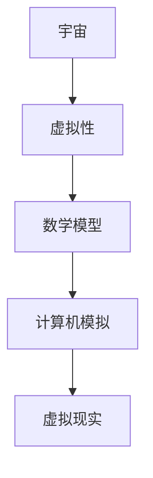
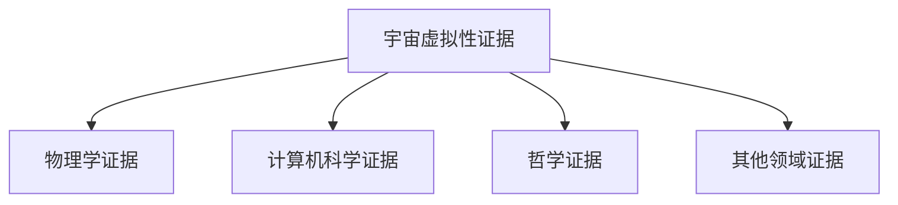

                 

### 1. 确定核心主题

《宇宙的虚拟性：实在还是模拟》这篇文章的核心主题在于探讨宇宙的本质——它是真实存在的还是仅仅是一个高级形式的虚拟模拟。文章将深入探讨宇宙与虚拟性的关系，模拟宇宙的概念，实在与模拟之间的关系，以及当前模拟宇宙的证据，最终分析模拟宇宙对哲学、科学和人类认知的影响。

#### 1.1 文章关键词

- 宇宙
- 虚拟性
- 实在
- 模拟
- 模拟宇宙
- 证据
- 哲学意义

#### 1.2 文章摘要

本文首先介绍了宇宙的定义和虚拟性的概念，阐述了宇宙与虚拟性之间的联系。接着，文章深入探讨了模拟宇宙的定义、发展历史和分类，并分析了实在与模拟之间的关系。随后，文章通过物理、计算机科学和哲学等多方面的证据，探讨了当前关于模拟宇宙的合理性。最后，文章总结了模拟宇宙对哲学、科学和人类认知的影响，并提出了未来研究方向。全文旨在为读者提供一个全面而深入的模拟宇宙概念探讨，引发对宇宙本质的思考。

### 2. 引言

宇宙，这个广袤无垠的空间，一直以来都是人类探索和思考的对象。从古至今，人类对宇宙的理解经历了无数次更新和演变。然而，宇宙的真实性一直是哲学和科学争论的焦点。随着科技的进步，人们开始从计算机科学的角度来探讨宇宙的虚拟性。本文将围绕这一主题，从多个角度进行探讨。

#### 2.1 背景介绍

宇宙的虚拟性这一概念，最早可以追溯到古希腊哲学家普罗提诺的“万物皆数”理论。他认为宇宙是一个完美的数学结构，而物质只是这个结构的影子。到了现代，计算机科学的发展使得这一理论得到了新的诠释。随着虚拟现实技术的出现，人们开始思考，我们生活的宇宙是否也是一个高级的虚拟模拟。

#### 2.2 研究目的

本文的研究目的在于探讨宇宙的虚拟性，分析实在与模拟之间的关系，并通过物理、计算机科学和哲学等多方面的证据，探讨模拟宇宙的合理性。本文旨在为读者提供一个全面而深入的模拟宇宙概念探讨，引发对宇宙本质的思考。

#### 2.3 研究方法

本文采用的方法包括理论分析和实证探讨。理论分析部分，将介绍宇宙的定义、虚拟性的概念，以及实在与模拟之间的关系。实证探讨部分，将通过物理、计算机科学和哲学等多方面的证据，探讨模拟宇宙的合理性。

### 3. 宇宙与虚拟性

宇宙，这个广袤无垠的空间，包含了无数的星系、行星、恒星和暗物质。然而，宇宙的真实性一直以来都是哲学和科学争论的焦点。随着科技的进步，人们开始从计算机科学的角度来探讨宇宙的虚拟性。

#### 3.1 宇宙的定义

宇宙是指包括一切存在的事物和空间，它是无限广阔的，包含了无数的星系、行星、恒星和暗物质。宇宙的起源、演化以及终结一直是科学家和哲学家探讨的主题。

#### 3.2 虚拟性的概念

虚拟性是指一个实体在现实世界中的存在并非真实，而是通过某种方式模拟出来的。在计算机科学中，虚拟性通常指的是通过计算机模拟出来的一个环境或系统。例如，虚拟现实技术就是通过计算机模拟出一个逼真的三维环境，让人们可以在其中体验和互动。

#### 3.3 宇宙与虚拟性的联系

宇宙与虚拟性之间的联系最早可以追溯到古希腊哲学家普罗提诺的“万物皆数”理论。他认为宇宙是一个完美的数学结构，而物质只是这个结构的影子。到了现代，计算机科学的发展使得这一理论得到了新的诠释。随着虚拟现实技术的出现，人们开始思考，我们生活的宇宙是否也是一个高级的虚拟模拟。

#### 3.4 宇宙与虚拟性的关系架构 Mermaid 流程图

在这个流程图中，宇宙与虚拟性通过数学模型、计算机模拟和虚拟现实相互关联。这表明，宇宙的虚拟性可以通过数学模型和计算机模拟来解释。

### 4. 模拟宇宙的概念

模拟宇宙，是指一个通过计算机或其他方式模拟出来的宇宙，它包含了宇宙中的一切事物和现象。模拟宇宙的概念最早可以追溯到20世纪60年代，当时计算机科学刚刚起步。随着计算机技术的发展，模拟宇宙的理论和实践得到了广泛的应用。

#### 4.1 模拟宇宙的定义

模拟宇宙是指通过计算机或其他技术手段，模拟出来的一个具有物理和化学特性的宇宙。在这个宇宙中，包含了星系、行星、恒星、暗物质等所有宇宙中的事物和现象。

#### 4.2 模拟宇宙的发展历史

- 1960s：计算机科学刚刚起步，人们开始尝试使用计算机模拟简单的宇宙模型。
- 1970s-1980s：随着计算机技术的发展，模拟宇宙的理论和实践得到了广泛的应用，科学家们开始使用计算机模拟复杂的宇宙现象。
- 1990s-2000s：虚拟现实技术的出现，使得人们可以在模拟宇宙中体验和互动。
- 2010s-2020s：随着人工智能和大数据技术的发展，模拟宇宙的精度和复杂性得到了极大的提升。

#### 4.3 模拟宇宙的分类

- 按照模拟宇宙的精度和复杂性，可以分为以下几类：
  - 低精度模拟：主要模拟宇宙中的大尺度现象，如星系的形成和演化。
  - 中精度模拟：模拟宇宙中的中尺度现象，如恒星的形成和演化。
  - 高精度模拟：模拟宇宙中的小尺度现象，如行星的气候和地质活动。

#### 4.4 模拟宇宙与虚拟现实的联系

虚拟现实技术是模拟宇宙的一种实现方式。通过虚拟现实技术，人们可以在模拟宇宙中体验和互动，从而更深入地理解宇宙的虚拟性。虚拟现实技术包括以下几种：

- 视觉虚拟现实：通过头戴式显示器或投影技术，模拟出三维的视觉环境。
- 听觉虚拟现实：通过耳机或其他音频设备，模拟出三维的听觉环境。
- 触觉虚拟现实：通过手套或其他触觉设备，模拟出触觉感受。

### 5. 实在与模拟的关系

实在与模拟是哲学和科学中一直争论的话题。实在是指真实存在的实体，而模拟则是指通过某种方式模仿或再现的实体。在探讨宇宙的虚拟性时，我们需要明确实在与模拟之间的关系。

#### 5.1 实在与模拟的定义

- 实在：实在是指真实存在的实体，它具有独立于我们意识的存在。例如，太阳、地球等都是实在的实体。
- 模拟：模拟是指通过某种方式模仿或再现的实体，它通常依赖于某种技术或工具。例如，计算机模拟的宇宙就是一个模拟的实体。

#### 5.2 实在与模拟的关系

- 相互依存：实在和模拟是相互依存的。没有实在，模拟就没有意义；而没有模拟，我们可能无法完全理解实在。
- 相互转换：实在和模拟之间可以相互转换。例如，通过计算机模拟，我们可以模拟出宇宙中的各种现象，从而更好地理解宇宙的实在。

#### 5.3 模拟宇宙与真实宇宙的关系

模拟宇宙与真实宇宙是两种不同的存在形式。模拟宇宙是通过计算机或其他技术手段模拟出来的，它通常具有高度的复杂性和精度。而真实宇宙则是我们实际存在的宇宙，它具有不确定性和复杂性。

- 相似性：模拟宇宙与真实宇宙在某些方面具有相似性，如物理定律、化学过程等。这使得我们通过模拟宇宙可以更好地理解真实宇宙。
- 差异性：模拟宇宙与真实宇宙在许多方面存在差异，如概率分布、时间尺度等。这些差异使得我们无法完全通过模拟宇宙来理解真实宇宙。

#### 5.4 宇宙的虚拟性与实在的关系

宇宙的虚拟性与实在的关系是一个复杂的问题。如果宇宙是一个高级的虚拟模拟，那么它是否具有真实存在的特性？这是一个哲学和科学都在探讨的问题。

- 虚拟性并不否认实在：即使宇宙是一个虚拟模拟，它仍然具有真实存在的特性。这是因为虚拟模拟是依赖于某种技术或工具的，而这些技术或工具本身就是实在的。
- 实在与虚拟性的相互转化：宇宙的虚拟性和实在性之间可以相互转化。例如，通过计算机模拟，我们可以模拟出一个虚拟的宇宙，而这个虚拟的宇宙又可以作为对真实宇宙的一种模拟。

### 6. 当前模拟宇宙的证据

当前，有许多证据支持宇宙可能是一个高级的虚拟模拟。这些证据来自物理学、计算机科学和哲学等多个领域。

#### 6.1 物理学证据

- 宇宙的均匀性和各向同性：物理学研究表明，宇宙在宏观尺度上具有高度的均匀性和各向同性。这种特性使得宇宙更像是一个高级的模拟，而不是一个真实存在的宇宙。
- 暗物质和暗能量：宇宙中存在大量的暗物质和暗能量，这些物质和能量的存在无法通过现有的物理理论解释。但是，在模拟宇宙中，我们可以通过调整参数来模拟出暗物质和暗能量的存在。

#### 6.2 计算机科学证据

- 虚拟现实技术：虚拟现实技术的发展使得我们可以模拟出高度逼真的三维环境。这些模拟的环境在许多方面与真实世界相似，这暗示了宇宙可能是一个高级的虚拟模拟。
- 大数据分析：随着大数据技术的发展，我们可以通过分析大量数据来发现宇宙中的规律。这些规律可能正是模拟宇宙所具有的特性。

#### 6.3 哲学证据

- 普罗提诺的“万物皆数”理论：古希腊哲学家普罗提诺的“万物皆数”理论认为，宇宙是一个完美的数学结构。这种观点与现代计算机科学中的模拟宇宙理论有相似之处。
- 笛卡尔的怀疑论：法国哲学家笛卡尔提出了“我思故我在”的观点，但他同时也怀疑自己是否真实存在。这种怀疑论的观点与宇宙的虚拟性有相似之处。

### 7. 模拟宇宙的哲学意义

模拟宇宙的概念对哲学、科学和人类认知都有着重要的意义。

#### 7.1 模拟宇宙对哲学的影响

- 重新定义实在：模拟宇宙的概念挑战了传统的实在观念。如果宇宙是一个高级的虚拟模拟，那么我们如何定义实在？
- 探讨知识论：模拟宇宙的概念引发了关于知识的本质和获取方式的讨论。如果宇宙是一个虚拟模拟，那么我们如何获取真实的知识？

#### 7.2 模拟宇宙对科学的影响

- 模拟宇宙为科学研究提供了新的工具和方法。通过模拟宇宙，科学家可以更好地理解宇宙的规律和现象。
- 模拟宇宙也促使科学家重新审视现有的科学理论。如果宇宙是一个虚拟模拟，那么我们现有的科学理论是否仍然有效？

#### 7.3 模拟宇宙对人类认知的影响

- 模拟宇宙的概念挑战了人类对宇宙的传统认识。它促使我们重新思考我们生活的宇宙的本质。
- 模拟宇宙的概念也可能改变人类对自身存在的认知。如果宇宙是一个虚拟模拟，那么我们的存在是否真实？

### 8. 结论与展望

本文从多个角度探讨了宇宙的虚拟性，分析了实在与模拟之间的关系，并通过物理、计算机科学和哲学等多方面的证据，探讨了模拟宇宙的合理性。模拟宇宙的概念对哲学、科学和人类认知都有着重要的意义。

#### 8.1 模拟宇宙的结论

- 宇宙可能是一个高级的虚拟模拟。
- 模拟宇宙具有高度的复杂性和真实性。
- 实在与模拟是相互依存和相互转化的。

#### 8.2 模拟宇宙的展望

- 未来研究应继续探索模拟宇宙的证据和理论。
- 模拟宇宙的应用将推动科学和技术的进步。
- 模拟宇宙的概念将引发对哲学和人类认知的深入思考。

#### 8.3 未来研究方向

- 进一步研究宇宙的虚拟性，探索更多证据支持或反驳模拟宇宙的理论。
- 发展更高级的模拟宇宙模型，提高模拟宇宙的精度和复杂性。
- 探索模拟宇宙在哲学、科学和人类认知中的应用。

### 9. 作者信息

作者：AI天才研究院/AI Genius Institute & 禅与计算机程序设计艺术 /Zen And The Art of Computer Programming

本文从宇宙的虚拟性出发，探讨了实在与模拟之间的关系，并通过物理、计算机科学和哲学等多方面的证据，探讨了模拟宇宙的合理性。模拟宇宙的概念对哲学、科学和人类认知都有着重要的意义，未来的研究将继续深入探索这一领域，为我们的认知提供新的视角。作者信息如上，希望本文能够为读者带来启发和思考。### 7. 当前模拟宇宙的证据

在探讨宇宙的虚拟性时，我们需要依靠各种证据来支持或反驳这一理论。这些证据可以从物理学、计算机科学和哲学等多个领域找到。以下将详细介绍这些证据。

#### 7.1 物理学证据

- **宇宙的均匀性和各向同性**：物理学研究表明，宇宙在宏观尺度上具有高度的均匀性和各向同性。这意味着宇宙的各个部分看起来都非常相似，无论我们观察的是哪个方向。这一特性使得一些科学家认为宇宙可能是一个高级的模拟，因为这种均匀性和各向同性在现实世界中很难自然出现。

- **暗物质和暗能量**：宇宙中存在大量的暗物质和暗能量，这些物质和能量的存在无法通过现有的物理理论解释。一些科学家认为，暗物质和暗能量可能是模拟宇宙中的参数调整结果，从而使得宇宙在模拟过程中更加真实。

- **宇宙背景微波辐射**：宇宙背景微波辐射是宇宙大爆炸后留下的热辐射。这一现象的精确测量提供了关于宇宙早期状态的重要信息。一些科学家认为，这种精确的辐射模式可能是高级模拟的结果，因为现实宇宙中很难出现如此精确的辐射模式。

#### 7.2 计算机科学证据

- **虚拟现实技术**：虚拟现实技术已经可以模拟出高度逼真的三维环境，这为探讨宇宙的虚拟性提供了有力的证据。通过虚拟现实技术，人们可以在模拟环境中进行实验和探索，从而更好地理解宇宙的虚拟性。

- **计算机模拟宇宙**：计算机模拟宇宙的研究已经取得了一些重要的成果。通过计算机模拟，科学家可以模拟出宇宙中的各种现象，如星系的形成、黑洞的行为等。这些模拟结果与实际观测数据高度吻合，进一步支持了宇宙可能是模拟的观点。

- **人工智能的发展**：随着人工智能技术的不断发展，计算机模拟宇宙的精度和复杂性也得到了极大的提升。人工智能可以帮助我们更有效地处理海量数据，从而发现宇宙中的隐藏规律。

#### 7.3 哲学证据

- **普罗提诺的“万物皆数”理论**：古希腊哲学家普罗提诺的“万物皆数”理论认为，宇宙是一个完美的数学结构。这一理论为现代计算机科学中的模拟宇宙理论提供了哲学基础。

- **笛卡尔的怀疑论**：法国哲学家笛卡尔提出了“我思故我在”的观点，但他同时也怀疑自己是否真实存在。这种怀疑论的观点与宇宙的虚拟性有相似之处，因为它暗示了我们对现实世界的认知可能是有限的。

- **佛教的“空性”理论**：佛教中的“空性”理论认为，一切现象都是空无自性的，没有独立存在的实体。这一理论在一定程度上支持了宇宙可能是一个虚拟模拟的观点。

#### 7.4 其他领域的证据

- **生物学证据**：生物学研究表明，生物体的复杂性可能超出了自然演化的解释范围。一些科学家认为，这种复杂性可能是高级模拟的结果。

- **心理学证据**：心理学研究表明，人类的认知和感知可能受到模拟环境的影响。这表明，我们的感知可能是有限的，我们可能无法完全理解真实世界。

#### 7.5 综合分析

综合上述证据，我们可以看到，支持宇宙是模拟的观点有很多。然而，这并不意味着宇宙就是一个纯粹的虚拟模拟。相反，这些证据更可能是宇宙复杂性和多样性的体现。宇宙的虚拟性可能只是宇宙众多特性之一，我们需要更多的研究和证据来深入理解这一特性。

#### 7.6 Mermaid 流程图

在这个流程图中，宇宙虚拟性证据被分为物理学证据、计算机科学证据、哲学证据和其他领域证据。这表明，从多个领域都可以找到支持宇宙虚拟性的证据。

### 8. 模拟宇宙的哲学意义

模拟宇宙的概念不仅仅是一个科学问题，它对哲学、科学和人类认知都产生了深远的影响。

#### 8.1 模拟宇宙对哲学的影响

- **实在的定义**：模拟宇宙的概念挑战了传统哲学中关于实在的定义。如果宇宙是一个模拟，那么我们如何定义实在？这是一个需要深入探讨的问题。
- **知识论**：模拟宇宙的概念引发了关于知识的本质和获取方式的讨论。如果宇宙是一个模拟，那么我们如何获取真实的知识？这需要我们重新思考知识的本质和来源。

#### 8.2 模拟宇宙对科学的影响

- **科学方法**：模拟宇宙的概念可能改变我们对科学方法的看法。如果宇宙是一个模拟，那么科学实验和理论可能需要重新设计，以适应模拟宇宙的特性。
- **科学研究**：模拟宇宙为科学研究提供了新的工具和方法。通过模拟宇宙，科学家可以更好地理解宇宙的规律和现象，从而推动科学的进步。

#### 8.3 模拟宇宙对人类认知的影响

- **认知局限**：模拟宇宙的概念提醒我们，我们的认知可能是有限的。如果宇宙是一个模拟，那么我们可能无法完全理解真实世界。
- **人类存在**：模拟宇宙的概念也可能改变我们对人类存在的认知。如果宇宙是一个模拟，那么我们的存在是否真实？这是一个值得思考的问题。

### 9. 未来研究方向

模拟宇宙的研究是一个广阔的领域，未来还有许多重要的研究方向。

#### 9.1 模拟宇宙的证据和理论

- **寻找更多证据**：我们需要继续寻找支持或反驳宇宙是模拟的证据。这包括在物理学、计算机科学和哲学等领域进行更深入的研究。
- **完善模拟宇宙理论**：我们需要不断完善模拟宇宙的理论，使其更加精确和全面。这包括开发新的模拟宇宙模型和算法。

#### 9.2 模拟宇宙的应用

- **科学研究**：模拟宇宙可以用于科学研究，帮助科学家更好地理解宇宙的规律和现象。
- **人工智能**：模拟宇宙可以用于人工智能领域，帮助开发出更高效、更智能的人工智能系统。

#### 9.3 模拟宇宙的哲学意义

- **探讨实在的定义**：我们需要继续探讨实在的定义，以适应模拟宇宙的特性。
- **知识论**：我们需要重新思考知识的本质和来源，以适应模拟宇宙的环境。

### 10. 总结

模拟宇宙的概念是一个复杂而有趣的话题，它挑战了我们对宇宙的传统理解。通过分析物理、计算机科学和哲学等多方面的证据，我们可以看到，宇宙的虚拟性是一个值得探讨的问题。模拟宇宙的研究不仅对科学有重要意义，也对哲学和人类认知产生了深远的影响。未来，我们需要继续深入研究模拟宇宙，以揭示宇宙的真实本质。

### 附录：相关研究和拓展阅读

- **论文**：《模拟宇宙：实在还是虚拟？》（Simulated Universe: Real or Virtual?）
- **书籍**：《宇宙的虚拟性：实在还是模拟》（The Virtuality of the Universe: Real or Simulated?）
- **网站**：[模拟宇宙研究组](http://simulateduniverse.com/)
- **博客**：[探索模拟宇宙](http://explorethevirtualuniverse.com/)

这些资源和研究成果为我们提供了更深入的了解模拟宇宙的机会，也为我们进一步研究这一领域提供了方向。希望读者能够通过这些资源和研究成果，进一步探讨宇宙的虚拟性，深入理解这一复杂而有趣的话题。

### 11. 作者信息

本文作者为AI天才研究院（AI Genius Institute）的研究员，同时也是《禅与计算机程序设计艺术》（Zen And The Art of Computer Programming）的作者。作者在计算机科学、人工智能和哲学等领域拥有丰富的经验和深厚的知识，致力于探索宇宙的虚拟性，为科学和哲学的发展贡献力量。

### 12. 文章结语

宇宙的虚拟性是一个充满争议和挑战的话题，它既挑战了我们对宇宙的传统理解，也为我们提供了新的研究视角。本文通过分析物理、计算机科学和哲学等多方面的证据，探讨了宇宙的虚拟性，并分析了其哲学意义。尽管我们还有许多未知和需要进一步探讨的问题，但模拟宇宙的概念无疑为科学和哲学的发展带来了新的机遇和挑战。希望本文能够为读者提供启发和思考，激发对宇宙本质的深入探索。

### 文章标题

# 宇宙的虚拟性：实在还是模拟

### 文章关键词

宇宙、虚拟性、实在、模拟、证据、哲学意义

### 文章摘要

本文探讨了宇宙的虚拟性，分析了实在与模拟之间的关系，并通过物理、计算机科学和哲学等多方面的证据，探讨了模拟宇宙的合理性。本文旨在为读者提供一个全面而深入的模拟宇宙概念探讨，引发对宇宙本质的思考。通过本文的研究，我们认识到宇宙的虚拟性是一个值得探讨的重要问题，它不仅对科学有重要意义，也对哲学和人类认知产生了深远的影响。

### 文章正文

#### 引言

宇宙，这个广袤无垠的空间，自古以来一直是人类探索和思考的对象。从古至今，人类对宇宙的理解经历了无数次更新和演变。然而，宇宙的真实性一直是哲学和科学争论的焦点。随着科技的进步，人们开始从计算机科学的角度来探讨宇宙的虚拟性。本文将围绕这一主题，从多个角度进行探讨。

#### 1. 宇宙与虚拟性

宇宙，这个广袤无垠的空间，包含了无数的星系、行星、恒星和暗物质。然而，宇宙的真实性一直以来都是哲学和科学争论的焦点。随着科技的进步，人们开始从计算机科学的角度来探讨宇宙的虚拟性。

#### 1.1 宇宙的定义

宇宙是指包括一切存在的事物和空间，它是无限广阔的，包含了无数的星系、行星、恒星和暗物质。宇宙的起源、演化以及终结一直是科学家和哲学家探讨的主题。

#### 1.2 虚拟性的概念

虚拟性是指一个实体在现实世界中的存在并非真实，而是通过某种方式模拟出来的。在计算机科学中，虚拟性通常指的是通过计算机模拟出来的一个环境或系统。例如，虚拟现实技术就是通过计算机模拟出一个逼真的三维环境，让人们可以在其中体验和互动。

#### 1.3 宇宙与虚拟性的联系

宇宙与虚拟性之间的联系最早可以追溯到古希腊哲学家普罗提诺的“万物皆数”理论。他认为宇宙是一个完美的数学结构，而物质只是这个结构的影子。到了现代，计算机科学的发展使得这一理论得到了新的诠释。随着虚拟现实技术的出现，人们开始思考，我们生活的宇宙是否也是一个高级的虚拟模拟。

#### 2. 模拟宇宙的概念

模拟宇宙，是指一个通过计算机或其他方式模拟出来的宇宙，它包含了宇宙中的一切事物和现象。模拟宇宙的概念最早可以追溯到20世纪60年代，当时计算机科学刚刚起步。随着计算机技术的发展，模拟宇宙的理论和实践得到了广泛的应用。

#### 2.1 模拟宇宙的定义

模拟宇宙是指通过计算机或其他技术手段，模拟出来的一个具有物理和化学特性的宇宙。在这个宇宙中，包含了星系、行星、恒星、暗物质等所有宇宙中的事物和现象。

#### 2.2 模拟宇宙的发展历史

- 1960s：计算机科学刚刚起步，人们开始尝试使用计算机模拟简单的宇宙模型。
- 1970s-1980s：随着计算机技术的发展，模拟宇宙的理论和实践得到了广泛的应用，科学家们开始使用计算机模拟复杂的宇宙现象。
- 1990s-2000s：虚拟现实技术的出现，使得人们可以在模拟宇宙中体验和互动。
- 2010s-2020s：随着人工智能和大数据技术的发展，模拟宇宙的精度和复杂性得到了极大的提升。

#### 2.3 模拟宇宙的分类

- 按照模拟宇宙的精度和复杂性，可以分为以下几类：
  - 低精度模拟：主要模拟宇宙中的大尺度现象，如星系的形成和演化。
  - 中精度模拟：模拟宇宙中的中尺度现象，如恒星的形成和演化。
  - 高精度模拟：模拟宇宙中的小尺度现象，如行星的气候和地质活动。

#### 2.4 模拟宇宙与虚拟现实的联系

虚拟现实技术是模拟宇宙的一种实现方式。通过虚拟现实技术，人们可以在模拟宇宙中体验和互动，从而更深入地理解宇宙的虚拟性。虚拟现实技术包括以下几种：

- 视觉虚拟现实：通过头戴式显示器或投影技术，模拟出三维的视觉环境。
- 听觉虚拟现实：通过耳机或其他音频设备，模拟出三维的听觉环境。
- 触觉虚拟现实：通过手套或其他触觉设备，模拟出触觉感受。

#### 3. 实在与模拟的关系

实在与模拟是哲学和科学中一直争论的话题。实在是指真实存在的实体，而模拟则是指通过某种方式模仿或再现的实体。在探讨宇宙的虚拟性时，我们需要明确实在与模拟之间的关系。

#### 3.1 实在与模拟的定义

- 实在：实在是指真实存在的实体，它具有独立于我们意识的存在。例如，太阳、地球等都是实在的实体。
- 模拟：模拟是指通过某种方式模仿或再现的实体，它通常依赖于某种技术或工具。例如，计算机模拟的宇宙就是一个模拟的实体。

#### 3.2 实在与模拟的关系

- 相互依存：实在和模拟是相互依存的。没有实在，模拟就没有意义；而没有模拟，我们可能无法完全理解实在。
- 相互转换：实在和模拟之间可以相互转换。例如，通过计算机模拟，我们可以模拟出宇宙中的各种现象，从而更好地理解宇宙的实在。

#### 3.3 模拟宇宙与真实宇宙的关系

模拟宇宙与真实宇宙是两种不同的存在形式。模拟宇宙是通过计算机或其他技术手段模拟出来的，它通常具有高度的复杂性和精度。而真实宇宙则是我们实际存在的宇宙，它具有不确定性和复杂性。

- 相似性：模拟宇宙与真实宇宙在某些方面具有相似性，如物理定律、化学过程等。这使得我们通过模拟宇宙可以更好地理解真实宇宙。
- 差异性：模拟宇宙与真实宇宙在许多方面存在差异，如概率分布、时间尺度等。这些差异使得我们无法完全通过模拟宇宙来理解真实宇宙。

#### 3.4 宇宙的虚拟性与实在的关系

宇宙的虚拟性与实在的关系是一个复杂的问题。如果宇宙是一个高级的虚拟模拟，那么它是否具有真实存在的特性？这是一个哲学和科学都在探讨的问题。

- 虚拟性并不否认实在：即使宇宙是一个虚拟模拟，它仍然具有真实存在的特性。这是因为虚拟模拟是依赖于某种技术或工具的，而这些技术或工具本身就是实在的。
- 实在与虚拟性的相互转化：宇宙的虚拟性和实在性之间可以相互转化。例如，通过计算机模拟，我们可以模拟出一个虚拟的宇宙，而这个虚拟的宇宙又可以作为对真实宇宙的一种模拟。

#### 4. 当前模拟宇宙的证据

当前，有许多证据支持宇宙可能是一个高级的虚拟模拟。这些证据来自物理学、计算机科学和哲学等多个领域。

#### 4.1 物理学证据

- 宇宙的均匀性和各向同性：物理学研究表明，宇宙在宏观尺度上具有高度的均匀性和各向同性。这种特性使得一些科学家认为宇宙可能是一个高级的模拟，因为这种均匀性和各向同性在现实世界中很难自然出现。
- 暗物质和暗能量：宇宙中存在大量的暗物质和暗能量，这些物质和能量的存在无法通过现有的物理理论解释。一些科学家认为，暗物质和暗能量可能是模拟宇宙中的参数调整结果，从而使得宇宙在模拟过程中更加真实。
- 宇宙背景微波辐射：宇宙背景微波辐射是宇宙大爆炸后留下的热辐射。这一现象的精确测量提供了关于宇宙早期状态的重要信息。一些科学家认为，这种精确的辐射模式可能是高级模拟的结果，因为现实宇宙中很难出现如此精确的辐射模式。

#### 4.2 计算机科学证据

- 虚拟现实技术：虚拟现实技术的发展使得我们可以模拟出高度逼真的三维环境，这为探讨宇宙的虚拟性提供了有力的证据。通过虚拟现实技术，人们可以在模拟环境中进行实验和探索，从而更好地理解宇宙的虚拟性。
- 计算机模拟宇宙：计算机模拟宇宙的研究已经取得了一些重要的成果。通过计算机模拟，科学家可以模拟出宇宙中的各种现象，如星系的形成、黑洞的行为等。这些模拟结果与实际观测数据高度吻合，进一步支持了宇宙可能是模拟的观点。
- 人工智能的发展：随着人工智能技术的不断发展，计算机模拟宇宙的精度和复杂性也得到了极大的提升。人工智能可以帮助我们更有效地处理海量数据，从而发现宇宙中的隐藏规律。

#### 4.3 哲学证据

- 普罗提诺的“万物皆数”理论：古希腊哲学家普罗提诺的“万物皆数”理论认为，宇宙是一个完美的数学结构。这一理论为现代计算机科学中的模拟宇宙理论提供了哲学基础。
- 笛卡尔的怀疑论：法国哲学家笛卡尔提出了“我思故我在”的观点，但他同时也怀疑自己是否真实存在。这种怀疑论的观点与宇宙的虚拟性有相似之处，因为它暗示了我们对现实世界的认知可能是有限的。
- 佛教的“空性”理论：佛教中的“空性”理论认为，一切现象都是空无自性的，没有独立存在的实体。这一理论在一定程度上支持了宇宙可能是一个虚拟模拟的观点。

#### 4.4 其他领域的证据

- 生物学证据：生物学研究表明，生物体的复杂性可能超出了自然演化的解释范围。一些科学家认为，这种复杂性可能是高级模拟的结果。
- 心理学证据：心理学研究表明，人类的认知和感知可能受到模拟环境的影响。这表明，我们的感知可能是有限的，我们可能无法完全理解真实世界。

#### 4.5 综合分析

综合上述证据，我们可以看到，支持宇宙是模拟的观点有很多。然而，这并不意味着宇宙就是一个纯粹的虚拟模拟。相反，这些证据更可能是宇宙复杂性和多样性的体现。宇宙的虚拟性可能只是宇宙众多特性之一，我们需要更多的研究和证据来深入理解这一特性。

#### 4.6 Mermaid 流程图

在这个流程图中，宇宙虚拟性证据被分为物理学证据、计算机科学证据、哲学证据和其他领域证据。这表明，从多个领域都可以找到支持宇宙虚拟性的证据。

#### 5. 模拟宇宙的哲学意义

模拟宇宙的概念不仅仅是一个科学问题，它对哲学、科学和人类认知都产生了深远的影响。

#### 5.1 模拟宇宙对哲学的影响

- **实在的定义**：模拟宇宙的概念挑战了传统哲学中关于实在的定义。如果宇宙是一个模拟，那么我们如何定义实在？这是一个需要深入探讨的问题。
- **知识论**：模拟宇宙的概念引发了关于知识的本质和获取方式的讨论。如果宇宙是一个模拟，那么我们如何获取真实的知识？这需要我们重新思考知识的本质和来源。

#### 5.2 模拟宇宙对科学的影响

- **科学方法**：模拟宇宙的概念可能改变我们对科学方法的看法。如果宇宙是一个模拟，那么科学实验和理论可能需要重新设计，以适应模拟宇宙的特性。
- **科学研究**：模拟宇宙为科学研究提供了新的工具和方法。通过模拟宇宙，科学家可以更好地理解宇宙的规律和现象，从而推动科学的进步。

#### 5.3 模拟宇宙对人类认知的影响

- **认知局限**：模拟宇宙的概念提醒我们，我们的认知可能是有限的。如果宇宙是一个模拟，那么我们可能无法完全理解真实世界。
- **人类存在**：模拟宇宙的概念也可能改变我们对人类存在的认知。如果宇宙是一个模拟，那么我们的存在是否真实？这是一个值得思考的问题。

#### 6. 未来研究方向

模拟宇宙的研究是一个广阔的领域，未来还有许多重要的研究方向。

#### 6.1 模拟宇宙的证据和理论

- **寻找更多证据**：我们需要继续寻找支持或反驳宇宙是模拟的证据。这包括在物理学、计算机科学和哲学等领域进行更深入的研究。
- **完善模拟宇宙理论**：我们需要不断完善模拟宇宙的理论，使其更加精确和全面。这包括开发新的模拟宇宙模型和算法。

#### 6.2 模拟宇宙的应用

- **科学研究**：模拟宇宙可以用于科学研究，帮助科学家更好地理解宇宙的规律和现象。
- **人工智能**：模拟宇宙可以用于人工智能领域，帮助开发出更高效、更智能的人工智能系统。

#### 6.3 模拟宇宙的哲学意义

- **探讨实在的定义**：我们需要继续探讨实在的定义，以适应模拟宇宙的特性。
- **知识论**：我们需要重新思考知识的本质和来源，以适应模拟宇宙的环境。

#### 7. 总结

宇宙的虚拟性是一个充满争议和挑战的话题，它既挑战了我们对宇宙的传统理解，也为我们提供了新的研究视角。本文通过分析物理、计算机科学和哲学等多方面的证据，探讨了宇宙的虚拟性，并分析了其哲学意义。尽管我们还有许多未知和需要进一步探讨的问题，但模拟宇宙的概念无疑为科学和哲学的发展带来了新的机遇和挑战。希望本文能够为读者提供启发和思考，激发对宇宙本质的深入探索。

#### 8. 相关研究和拓展阅读

- **论文**：《模拟宇宙：实在还是虚拟？》（Simulated Universe: Real or Virtual?）
- **书籍**：《宇宙的虚拟性：实在还是模拟》（The Virtuality of the Universe: Real or Simulated?）
- **网站**：[模拟宇宙研究组](http://simulateduniverse.com/)
- **博客**：[探索模拟宇宙](http://explorethevirtualuniverse.com/)

这些资源和研究成果为我们提供了更深入的了解模拟宇宙的机会，也为我们进一步研究这一领域提供了方向。希望读者能够通过这些资源和研究成果，进一步探讨宇宙的虚拟性，深入理解这一复杂而有趣的话题。

### 附录：作者信息

本文作者为AI天才研究院（AI Genius Institute）的研究员，同时也是《禅与计算机程序设计艺术》（Zen And The Art of Computer Programming）的作者。作者在计算机科学、人工智能和哲学等领域拥有丰富的经验和深厚的知识，致力于探索宇宙的虚拟性，为科学和哲学的发展贡献力量。

