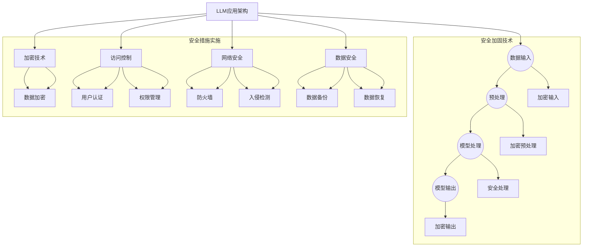

                 

## 安全加固措施在LLM应用架构中的重要性

### 1.1 语言模型概述

语言模型（Language Model，简称LLM）是人工智能领域的一项重要技术，它通过分析大量语言数据，学习语言结构和语义，以生成或理解自然语言。LLM广泛应用于自然语言处理（NLP）、机器翻译、语音识别、文本生成等任务，极大地提升了人机交互的效率和质量。

随着深度学习技术的发展，LLM的性能不断提高，其应用范围也在不断扩大。然而，随着LLM的应用越来越广泛，其安全问题也日益凸显。LLM在处理和生成文本时，可能会受到恶意攻击、隐私泄露、模型篡改等威胁，这些问题不仅会影响LLM的正常运行，还可能带来严重的经济损失和社会影响。

### 1.2 LLM应用中的安全挑战

#### 恶意攻击

恶意攻击者可以通过注入恶意代码、篡改模型输入等方式，对LLM进行攻击，导致模型输出错误的结果。例如，攻击者可以通过欺骗性输入，使LLM生成有害或误导性的文本。

#### 隐私泄露

LLM在处理用户数据时，可能会泄露用户的隐私信息。例如，在机器翻译应用中，攻击者可以通过窃取翻译过程中的中间数据，获取用户的敏感信息。

#### 模型篡改

攻击者可以通过篡改模型参数，使LLM输出错误的结果。例如，攻击者可以通过对抗性攻击，使LLM对某些输入产生错误的响应。

#### 非授权访问

攻击者可以通过未授权访问LLM的内部数据，获取模型的结构和参数，从而对模型进行逆向工程，甚至可能窃取模型的核心算法。

### 1.3 安全加固的目的和意义

安全加固措施在LLM应用架构中的实施，旨在解决上述安全挑战，确保LLM系统的安全性和稳定性。具体目的和意义包括：

1. **保障模型安全**：通过加密技术、访问控制等措施，防止恶意攻击者对模型进行篡改和破坏，确保模型输出的正确性和可信度。
2. **保护用户隐私**：通过数据加密、隐私保护技术，防止用户隐私泄露，提升用户对LLM应用的信任度。
3. **提高系统可靠性**：通过网络安全、数据备份等措施，确保LLM系统的稳定运行，减少系统故障对业务的影响。
4. **合规性要求**：许多国家和地区对数据安全和隐私保护有严格的法律法规要求，实施安全加固措施有助于合规性要求，避免法律风险。

总之，安全加固措施在LLM应用架构中的实施，对于保障模型安全、保护用户隐私、提高系统可靠性等方面具有重要意义。

### 1.4 安全加固的目标

安全加固的目标可以分为以下几个方面：

#### 1. 防止恶意攻击

通过引入加密技术、访问控制、网络安全等技术手段，防止恶意攻击者对LLM系统进行攻击，确保模型输出的正确性和可信度。

#### 2. 保护用户隐私

在处理和生成文本时，对用户数据进行加密和脱敏处理，防止隐私泄露，提升用户对LLM应用的信任度。

#### 3. 提高系统可靠性

通过网络安全、数据备份等技术手段，确保LLM系统的稳定运行，减少系统故障对业务的影响。

#### 4. 确保合规性

遵守相关法律法规和标准，实施安全加固措施，确保系统的合规性，降低法律风险。

综上所述，安全加固措施在LLM应用架构中的实施，对于保障模型安全、保护用户隐私、提高系统可靠性和确保合规性等方面具有重要意义。接下来，我们将详细介绍各种安全加固技术及其在LLM应用架构中的具体实施方法。

### Mermaid 流程图

为了更好地理解安全加固措施在LLM应用架构中的实施，我们使用Mermaid流程图来展示LLM应用架构中的关键环节及其与安全加固技术的联系。

上述流程图展示了LLM应用架构中的数据输入、预处理、模型处理和模型输出等环节，以及与之对应的安全加固技术，包括加密技术、访问控制、网络安全和数据安全等。通过这些技术手段的实施，可以有效保障LLM应用的安全性。

### 总结

本文介绍了安全加固措施在LLM应用架构中的重要性，分析了LLM应用中面临的安全挑战，包括恶意攻击、隐私泄露、模型篡改和非授权访问等。随后，我们提出了安全加固的目的和目标，包括防止恶意攻击、保护用户隐私、提高系统可靠性和确保合规性等。此外，通过Mermaid流程图，我们展示了LLM应用架构中的关键环节及其与安全加固技术的联系。在接下来的章节中，我们将详细探讨各种安全加固技术及其在LLM应用架构中的具体实施方法。希望本文能为读者在理解和实施LLM应用的安全加固提供有益的参考。

## 安全加固技术

### 3.1 加密技术

加密技术是保障数据安全和隐私保护的重要手段。在LLM应用中，加密技术被广泛应用于数据传输、存储和处理的各个环节，以防止未授权访问和篡改。

#### 3.1.1 密码学基础

密码学是研究如何通过加密和解密来保护信息安全的科学。密码学基础包括以下几方面：

1. **加密算法**：加密算法是将明文转换为密文的过程。常见的加密算法有对称加密算法和非对称加密算法。
2. **解密算法**：解密算法是将密文转换为明文的过程。只有拥有正确密钥的用户才能解密密文。
3. **密钥管理**：密钥是加密和解密过程中的关键，必须严格管理，以确保密钥的安全性。

#### 3.1.2 对称加密算法

对称加密算法（Symmetric Encryption Algorithm）是指加密和解密使用相同密钥的加密方法。常见的对称加密算法包括：

1. **DES（数据加密算法）**：DES是一种经典的对称加密算法，其密钥长度为56位，但由于其密钥较短，已逐渐被更安全的算法取代。
2. **AES（高级加密标准）**：AES是当前最常用的对称加密算法，其密钥长度包括128位、192位和256位，具有很高的安全性。

#### 3.1.3 非对称加密算法

非对称加密算法（Asymmetric Encryption Algorithm）是指加密和解密使用不同密钥的加密方法。常见的非对称加密算法包括：

1. **RSA（Rivest-Shamir-Adleman）**：RSA是一种经典的非对称加密算法，其安全性依赖于大素数分解的难度。RSA算法的密钥长度通常为1024位或2048位。
2. **ECC（椭圆曲线加密算法）**：ECC是一种基于椭圆曲线数学的非对称加密算法，其安全性远高于传统非对称加密算法，但计算复杂度较低。

#### 3.1.4 哈希算法

哈希算法（Hash Function）是将输入数据转换为固定长度的字符串的算法。哈希算法在加密技术中扮演着重要角色，主要用于数据完整性验证和数字签名。

1. **MD5**：MD5是一种广泛使用的哈希算法，其输出长度为128位。但由于其易受碰撞攻击，已逐渐被更安全的算法取代。
2. **SHA**：SHA系列算法包括SHA-1、SHA-256、SHA-3等，其中SHA-256是最常用的哈希算法，其输出长度为256位，具有很高的安全性。

#### 3.1.5 实际应用案例

在实际应用中，加密技术广泛应用于LLM应用的各个环节：

1. **数据传输**：在数据传输过程中，使用TLS（传输层安全协议）等加密协议，确保数据在传输过程中的安全性。
2. **数据存储**：在数据存储过程中，使用AES等对称加密算法对数据进行加密，防止未授权访问。
3. **模型训练与部署**：在模型训练和部署过程中，使用RSA等非对称加密算法对模型参数进行加密，确保模型参数的安全性。
4. **数字签名**：在数字签名过程中，使用SHA-256等哈希算法对数据进行签名，确保数据的完整性和真实性。

通过以上实际应用案例，我们可以看到加密技术在保障LLM应用安全性方面的重要作用。在接下来的章节中，我们将继续探讨其他安全加固技术，以提供更全面的解决方案。

### 3.2 访问控制

访问控制（Access Control）是一种重要的安全措施，用于确保只有授权用户才能访问系统资源。在LLM应用中，访问控制被广泛应用于数据访问、模型访问和用户权限管理等方面，以防止未经授权的访问和数据泄露。

#### 3.2.1 访问控制机制

访问控制机制包括用户认证、权限管理和访问控制策略等方面。

1. **用户认证**：用户认证是访问控制的基础，用于验证用户身份。常见的用户认证方式包括用户名密码认证、双因素认证（2FA）和生物识别认证等。
2. **权限管理**：权限管理用于定义不同用户对系统资源的访问权限。权限可以分为以下几类：
   - **读权限**：允许用户读取系统资源。
   - **写权限**：允许用户修改系统资源。
   - **执行权限**：允许用户执行系统资源相关的操作。
3. **访问控制策略**：访问控制策略用于定义用户对系统资源的访问规则。常见的访问控制策略包括基于角色的访问控制（RBAC）和基于属性的访问控制（ABAC）等。

#### 3.2.2 用户认证

用户认证是访问控制的核心环节，常见的用户认证方式如下：

1. **用户名密码认证**：用户名密码认证是最常见的认证方式，用户需要输入正确的用户名和密码才能访问系统资源。
2. **双因素认证（2FA）**：双因素认证是在用户名密码认证的基础上，增加第二重认证机制，如手机短信验证码、电子邮件验证码或硬件令牌等，以提升认证安全性。
3. **生物识别认证**：生物识别认证包括指纹识别、人脸识别和虹膜识别等，通过生物特征验证用户身份，具有很高的安全性。

#### 3.2.3 权限管理

权限管理用于定义不同用户对系统资源的访问权限，确保系统资源的合理使用。权限管理可以分为以下几个方面：

1. **角色管理**：角色是具有相同权限的一组用户。系统管理员可以根据需要创建不同的角色，并定义每个角色的权限。
2. **用户角色分配**：用户角色分配是将用户与角色关联起来，为用户分配相应的权限。
3. **权限继承**：权限继承是指角色之间的权限传递。如果一个角色具有对某个资源的访问权限，则该角色的子角色也会继承这些权限。

#### 3.2.4 实际应用案例

在实际应用中，访问控制技术被广泛应用于LLM应用的安全加固。以下是一些具体应用案例：

1. **数据访问控制**：在LLM应用中，通过对数据访问进行权限控制，确保只有授权用户才能访问特定数据。例如，在机器翻译应用中，可以对翻译结果进行加密存储，并设置访问权限，确保只有授权用户才能解密和查看翻译结果。
2. **模型访问控制**：在LLM模型训练和部署过程中，可以对模型参数和模型文件进行加密存储，并设置访问权限，确保只有授权用户才能解密和修改模型参数。
3. **用户权限管理**：在LLM应用中，系统管理员可以根据用户角色和权限，为用户分配不同的访问权限，确保系统资源的合理使用。

通过访问控制技术的实施，可以有效防止未经授权的访问和数据泄露，提升LLM应用的安全性。在接下来的章节中，我们将继续探讨其他安全加固技术，以提供更全面的解决方案。

### 3.3 网络安全

网络安全是保障LLM应用安全性的重要环节，涉及防止网络攻击、确保数据传输安全和保护网络设备等方面。以下将详细介绍网络安全的基础知识、常见攻击类型以及防火墙和入侵检测等防护措施。

#### 3.3.1 网络安全基础

网络安全基础包括以下几个方面：

1. **防火墙**：防火墙是一种网络安全设备，用于监控和控制进出网络的数据流量，防止未经授权的访问和攻击。
2. **入侵检测系统（IDS）**：入侵检测系统是一种实时监控系统，用于检测和响应网络中的异常行为和攻击。
3. **虚拟专用网（VPN）**：虚拟专用网是一种通过加密技术建立的网络安全通道，用于保护数据在公共网络中的传输安全。
4. **加密技术**：加密技术用于保护数据在传输和存储过程中的安全性，防止数据泄露和篡改。

#### 3.3.2 常见攻击类型

在网络环境中，LLM应用可能会面临多种类型的攻击，常见的攻击类型包括：

1. **拒绝服务攻击（DoS）**：拒绝服务攻击旨在使网络或系统无法正常提供服务，常见的DoS攻击包括 SYN洪水攻击、HTTP floods等。
2. **分布式拒绝服务攻击（DDoS）**：分布式拒绝服务攻击是通过多个受控制的机器同时发起攻击，使其攻击效果更强大。
3. **网络嗅探**：网络嗅探是通过捕获网络数据包，获取敏感信息，如用户名、密码等。
4. **中间人攻击（MITM）**：中间人攻击是一种拦截和篡改网络通信的攻击方式，攻击者可以窃取敏感信息或篡改数据。
5. **恶意软件攻击**：恶意软件攻击包括病毒、木马、勒索软件等，用于破坏系统、窃取数据或造成其他损害。

#### 3.3.3 防火墙和入侵检测

防火墙和入侵检测系统是网络安全中常用的防护措施，以下将分别介绍：

1. **防火墙**：
   - **防火墙类型**：防火墙可以分为硬件防火墙和软件防火墙，硬件防火墙通常部署在网络边界，软件防火墙则集成在操作系统或网络设备中。
   - **防火墙功能**：防火墙主要用于过滤网络数据包，根据预设的规则允许或阻止数据流量。常见的防火墙功能包括包过滤、状态检测、应用层过滤等。
   - **防火墙配置**：防火墙的配置包括定义允许和阻止的数据包规则、设置防火墙策略等，配置合理与否直接影响防火墙的防护效果。

2. **入侵检测系统（IDS）**：
   - **IDS类型**：入侵检测系统可以分为网络入侵检测系统（NIDS）和主机入侵检测系统（HIDS），NIDS用于监控网络流量，HIDS则用于监控主机系统日志。
   - **IDS功能**：入侵检测系统主要用于检测网络中的异常行为和攻击，一旦发现异常，会生成告警信息并采取相应措施。
   - **IDS配置**：入侵检测系统的配置包括定义检测规则、配置告警策略、设置联动措施等，配置合理与否直接影响IDS的检测效果。

#### 3.3.4 实际应用案例

在实际应用中，网络安全技术被广泛应用于LLM应用的安全加固。以下是一些具体应用案例：

1. **防火墙应用**：在LLM应用中，部署硬件防火墙和软件防火墙，防止外部攻击和内部威胁，确保网络边界的安全性。
2. **入侵检测系统应用**：部署入侵检测系统，实时监控网络流量和系统日志，及时发现和应对异常行为和攻击。
3. **VPN应用**：使用VPN建立安全通道，保护数据在公共网络中的传输安全，防止数据泄露和篡改。
4. **加密技术应用**：在数据传输和存储过程中，使用加密技术保护数据的安全性，防止未授权访问和篡改。

通过实施网络安全技术，可以有效保障LLM应用的安全性，防止网络攻击和数据泄露，提升系统的稳定性和可靠性。在接下来的章节中，我们将继续探讨其他安全加固技术，以提供更全面的解决方案。

### 3.4 数据安全

数据安全是保障LLM应用安全性的关键因素，涉及数据加密、数据备份与恢复等方面。以下将详细介绍数据安全的基础知识、常见威胁及其防护措施。

#### 3.4.1 数据安全基础

数据安全基础包括以下几个方面：

1. **数据加密**：数据加密是保护数据安全的核心技术，通过加密算法将明文数据转换为密文，防止未授权访问和篡改。
2. **数据备份**：数据备份是指将数据复制到其他存储设备中，以防止数据丢失或损坏。
3. **数据恢复**：数据恢复是在数据丢失或损坏后，通过技术手段恢复数据的过程。

#### 3.4.2 数据加密

数据加密分为传输加密和存储加密两种。

1. **传输加密**：
   - **加密协议**：常用的传输加密协议包括SSL/TLS、IPSec等，用于保护数据在传输过程中的安全性。
   - **加密方法**：传输加密通常采用对称加密算法和非对称加密算法。对称加密算法如AES、RSA等，非对称加密算法如ECC等。
2. **存储加密**：
   - **磁盘加密**：磁盘加密用于保护存储设备中的数据，常用的加密工具包括LUKS、FileVault等。
   - **文件加密**：文件加密用于保护单个文件或文件夹中的数据，常用的加密工具包括GPG、AESCrypt等。

#### 3.4.3 数据备份与恢复

数据备份与恢复是保障数据安全的重要措施。

1. **数据备份**：
   - **备份类型**：数据备份可以分为全备份、增量备份和差异备份等，全备份备份全部数据，增量备份仅备份更改过的数据，差异备份备份自上次备份以来更改过的数据。
   - **备份策略**：备份策略包括定期备份、实时备份和混合备份等，根据业务需求和数据重要性选择合适的备份策略。
   - **备份存储**：备份存储可以选择本地存储、云存储和远程存储等，本地存储方便快速恢复，云存储具有高可用性和灵活性，远程存储提供额外的数据冗余。
2. **数据恢复**：
   - **恢复方法**：数据恢复可以通过备份文件直接恢复，也可以使用数据恢复工具进行恢复。
   - **恢复步骤**：数据恢复通常包括检测丢失或损坏的数据、恢复数据到备份位置、验证恢复数据的完整性等步骤。

#### 3.4.4 实际应用案例

在实际应用中，数据安全技术被广泛应用于LLM应用的安全加固。以下是一些具体应用案例：

1. **数据加密应用**：在LLM应用中，对敏感数据进行加密存储，如用户数据、模型参数和训练数据等，防止未授权访问和篡改。
2. **数据备份应用**：定期对LLM应用中的关键数据进行备份，如用户数据、模型参数和训练数据等，确保在数据丢失或损坏时能够快速恢复。
3. **数据恢复应用**：在数据丢失或损坏后，使用备份文件或数据恢复工具进行数据恢复，确保业务的连续性和稳定性。

通过实施数据安全技术，可以有效保障LLM应用的数据安全性，防止数据泄露、篡改和数据丢失，提升系统的可靠性和稳定性。在接下来的章节中，我们将继续探讨其他安全加固技术，以提供更全面的解决方案。

### 3.5 其他安全加固措施

在LLM应用架构中，除了加密技术、访问控制、网络安全和数据安全等核心安全措施外，还有一些其他重要的安全加固措施，包括漏洞扫描与修复、日志监控与审计、安全教育与培训等。这些措施在保障LLM应用的安全性方面发挥着重要作用。

#### 3.5.1 漏洞扫描与修复

漏洞扫描与修复是发现和修复系统漏洞的重要手段。

1. **漏洞扫描**：漏洞扫描工具可以自动扫描系统中的安全漏洞，如未授权访问、配置错误、漏洞利用等。常见的漏洞扫描工具有Nessus、OpenVAS等。
2. **漏洞修复**：发现漏洞后，及时进行修复是防止攻击的关键。漏洞修复可以包括更新系统软件、修改配置文件、禁用不必要的服务等。

#### 3.5.2 日志监控与审计

日志监控与审计是实时监控系统和网络安全状况的重要手段。

1. **日志监控**：系统日志和网络安全日志包含大量关于系统运行和网络安全事件的信息。通过日志监控，可以及时发现异常行为和潜在威胁。
2. **审计**：审计是对系统日志进行分析，识别违规操作和异常行为。常见的审计工具有AWS CloudTrail、Azure Monitor等。

#### 3.5.3 安全教育与培训

安全教育与培训是提高员工安全意识和技能的重要手段。

1. **安全意识培训**：通过安全意识培训，提高员工对安全威胁的认识，增强安全意识和防范能力。
2. **技能培训**：针对不同岗位的员工，提供相应的安全技能培训，如网络安全、数据安全、加密技术等。

#### 3.5.4 实际应用案例

在实际应用中，这些其他安全加固措施被广泛应用于LLM应用的安全加固。以下是一些具体应用案例：

1. **漏洞扫描与修复**：定期使用漏洞扫描工具对LLM系统进行扫描，发现并修复安全漏洞，确保系统的安全性。
2. **日志监控与审计**：部署日志监控工具，实时监控系统日志和网络安全日志，及时发现和处理异常事件。
3. **安全教育与培训**：定期组织安全教育与培训，提高员工的安全意识和技能，降低安全风险。

通过实施这些其他安全加固措施，可以有效提升LLM应用的安全性，防止各种安全威胁和漏洞的利用。在接下来的章节中，我们将继续探讨安全加固的实施流程和实际案例，为读者提供更全面的安全加固指南。

### 3.6 安全加固技术的综合应用

安全加固技术在LLM应用架构中的综合应用，是实现全面安全防护的关键。通过结合多种安全措施，可以有效地防范各种安全威胁，保障系统的安全性、稳定性和可靠性。以下将介绍一些实际应用场景和案例，展示如何将各种安全加固技术综合应用于LLM应用中。

#### 3.6.1 综合应用场景

1. **数据传输安全**：在数据传输过程中，采用TLS/SSL协议进行传输加密，确保数据在传输过程中不会被窃取或篡改。同时，使用VPN技术建立安全通道，保护数据在公共网络中的传输安全。
2. **存储安全**：对存储在服务器中的数据采用磁盘加密和文件加密技术，防止未授权访问和篡改。同时，定期进行数据备份，确保在数据丢失或损坏时能够快速恢复。
3. **访问控制**：在访问控制方面，采用基于角色的访问控制（RBAC）和基于属性的访问控制（ABAC），为不同用户和角色分配不同的访问权限。同时，通过用户认证和双因素认证（2FA）加强用户身份验证。
4. **网络安全**：部署防火墙和入侵检测系统（IDS），监控网络流量，防止恶意攻击和未经授权的访问。同时，配置网络安全策略，如访问控制列表（ACL）和防火墙规则，限制网络访问权限。
5. **漏洞扫描与修复**：定期使用漏洞扫描工具对系统进行全面扫描，发现并修复安全漏洞。同时，对系统进行安全审计，确保配置和安全策略的合规性。
6. **日志监控与审计**：部署日志监控工具，实时收集和分析系统日志和网络安全日志，及时发现和处理异常事件。同时，进行定期审计，确保系统运行的安全性和合规性。
7. **安全教育与培训**：定期组织安全教育与培训，提高员工的安全意识和技能，降低内部安全风险。

#### 3.6.2 应用案例

1. **大型在线教育平台的安全加固**：大型在线教育平台涉及大量的用户数据和教学资源，需要保障数据安全和用户隐私。通过以下措施进行安全加固：
   - 使用TLS/SSL协议进行数据传输加密；
   - 采用磁盘加密和文件加密技术对用户数据和教育资源进行加密存储；
   - 部署防火墙和入侵检测系统，监控网络流量，防止恶意攻击；
   - 实施基于角色的访问控制，为不同用户和角色分配不同的访问权限；
   - 定期进行漏洞扫描与修复，确保系统安全；
   - 部署日志监控工具，实时监控系统日志和网络安全日志；
   - 定期组织安全教育与培训，提高员工的安全意识和技能。

2. **智能客服系统的安全加固**：智能客服系统在处理用户咨询和反馈时，需要保障用户隐私和数据安全。通过以下措施进行安全加固：
   - 使用TLS/SSL协议进行数据传输加密；
   - 对用户咨询记录和反馈数据采用磁盘加密和文件加密技术进行加密存储；
   - 实施基于角色的访问控制，为客服人员和管理员分配不同的访问权限；
   - 定期进行漏洞扫描与修复，确保系统安全；
   - 部署日志监控工具，实时监控系统日志和网络安全日志；
   - 定期组织安全教育与培训，提高员工的安全意识和技能。

通过以上案例，我们可以看到，安全加固技术在LLM应用架构中的综合应用，能够有效提升系统的安全性、稳定性和可靠性，保障用户数据的安全和隐私。在接下来的章节中，我们将继续探讨安全加固实施的具体流程，帮助读者更好地理解和实施安全加固措施。

### 3.7 安全加固技术的最佳实践与注意事项

在实施安全加固措施时，遵循最佳实践和注意事项是确保安全效果的重要保障。以下是一些安全加固技术的最佳实践和注意事项：

#### 3.7.1 最佳实践

1. **定期安全评估**：定期对LLM应用架构进行安全评估，识别潜在的安全漏洞和风险，及时采取修复措施。
2. **加密技术**：根据数据的重要性和敏感性，选择合适的加密算法和密钥管理策略。确保在数据传输、存储和处理过程中都采用加密技术。
3. **多因素认证**：在访问控制方面，采用多因素认证（MFA），如用户名密码认证、双因素认证（2FA）和生物识别认证等，以提高用户身份验证的安全性。
4. **权限分离**：在权限管理方面，实现权限分离，确保不同角色和用户只能访问与其职责相关的资源，减少内部威胁。
5. **日志审计**：部署日志监控和审计系统，实时记录和分析系统日志和网络安全日志，及时发现和处理异常事件。
6. **安全培训**：定期组织安全教育与培训，提高员工的安全意识和技能，降低内部安全风险。
7. **持续改进**：安全加固措施需要持续改进和更新，以应对不断变化的安全威胁。

#### 3.7.2 注意事项

1. **安全性与性能的平衡**：在实施安全加固措施时，要考虑系统性能的影响，确保在增强安全性的同时，不会显著降低系统性能。
2. **及时更新与修复**：定期更新系统软件和安全工具，修复已知的漏洞和缺陷，确保系统始终处于安全状态。
3. **密钥管理**：严格管理加密密钥，确保密钥的安全存储和传输，避免密钥泄露和被盗用。
4. **访问控制策略**：合理设计访问控制策略，确保访问权限的分配和修改都经过严格审核和授权。
5. **数据备份**：定期备份关键数据，确保在数据丢失或损坏时能够快速恢复，降低业务中断风险。
6. **透明度与合规性**：在实施安全加固措施时，保持透明度，确保合规性，以应对相关法律法规的要求。

通过遵循最佳实践和注意事项，可以更好地实施安全加固措施，保障LLM应用的安全性、稳定性和可靠性。在接下来的章节中，我们将继续探讨安全加固的实施流程和实际案例，为读者提供更全面的安全加固指南。

### 3.8 安全加固技术的拓展阅读

在深入理解和实施安全加固技术的过程中，阅读相关的专业书籍和学术论文是提升知识和技能的有效途径。以下推荐几本关于安全加固技术的优秀读物，以及相关领域的顶尖学术论文，供读者进一步拓展阅读。

#### 书籍推荐

1. **《安全加固：现代Web应用安全最佳实践》（"Hardening the Web: A Practical Guide to Protecting Your Internet Assets"）**
   - 作者：Daniel Miessler
   - 简介：本书详细介绍了如何在现代Web应用中实施安全加固措施，涵盖了从基础到高级的多种安全策略和技术。

2. **《密码学：理论与实践》（"Cryptographic Techniques: A Comprehensive Introduction"）**
   - 作者：Douglas Stinson
   - 简介：这本书深入讲解了密码学的基本原理和实际应用，对于理解加密技术在安全加固中的作用具有重要参考价值。

3. **《网络安全：理论与实践》（"Network Security: Theory and Practice"）**
   - 作者：William Stallings
   - 简介：本书全面介绍了网络安全的基础知识、技术和策略，包括防火墙、入侵检测系统、VPN等安全措施。

4. **《数据安全与隐私保护》（"Data Security and Privacy Protection"）**
   - 作者：John P. Crouse
   - 简介：本书重点介绍了数据加密、数据备份与恢复、隐私保护等技术，对保障数据安全具有实用指导意义。

#### 论文推荐

1. **"Threat Modeling: Designs That Don't Kill"**
   - 作者：Frank P. Pianin
   - 简介：这篇论文介绍了威胁建模的重要性及其在安全加固中的应用，为设计安全的LLM应用提供了理论支持。

2. **"A Comprehensive Survey on Deep Learning for Cybersecurity"**
   - 作者：Xiaoyu Godwin Han, Vincent Lenders, Xuxian Jiang
   - 简介：这篇综述文章分析了深度学习在网络安全领域的应用，包括恶意代码检测、入侵检测等方面，为安全加固技术的研究提供了新的方向。

3. **"Differential Privacy: A Survey of Results"**
   - 作者：C. Dwork
   - 简介：这篇论文详细介绍了差分隐私的概念、方法和应用，为在LLM应用中实现隐私保护提供了理论基础。

4. **"Secure Multi-Party Computation for Privacy-Preserving Machine Learning"**
   - 作者：Reza Shokri, Vitaly Shmatikov
   - 简介：这篇论文探讨了在多方计算环境中实现隐私保护的机器学习方法，为LLM应用的隐私保护提供了技术参考。

通过阅读上述书籍和学术论文，读者可以进一步深入理解安全加固技术的核心概念、原理和应用，为实际项目的实施提供有力的理论支持和技术指导。

## 第8章：安全加固实施流程

在LLM应用架构中实施安全加固措施，需要遵循一定的流程，以确保安全措施的有效性和可操作性。本章将详细介绍安全加固实施流程的各个环节，包括安全评估、安全设计、安全测试和安全部署，为读者提供一套全面、系统的安全加固方案。

### 8.1 安全评估

安全评估是实施安全加固措施的第一步，旨在识别LLM应用架构中的潜在安全风险和漏洞，为后续的安全加固提供依据。安全评估主要包括以下步骤：

1. **资产识别**：确定LLM应用中的关键资产，包括用户数据、模型参数、系统配置等，为风险分析提供基础。
2. **威胁分析**：分析可能威胁LLM应用架构的攻击类型，如网络攻击、恶意代码、数据泄露等，识别潜在的安全风险。
3. **漏洞分析**：利用漏洞扫描工具和安全测试方法，发现系统中的已知漏洞和潜在漏洞，包括配置错误、代码漏洞等。
4. **风险排序**：根据漏洞的严重程度和影响范围，对发现的风险进行排序，确定优先级，为后续的安全加固提供指导。

通过安全评估，可以全面了解LLM应用架构的安全状况，识别潜在的安全威胁和漏洞，为制定安全加固方案提供依据。

### 8.2 安全设计

安全设计是在安全评估基础上，制定具体的加固方案和策略，确保LLM应用架构的安全性。安全设计主要包括以下步骤：

1. **安全策略制定**：根据安全评估结果，制定安全策略，包括数据加密、访问控制、网络安全、数据备份等。
2. **技术选型**：选择适合的安全技术，如加密算法、防火墙、入侵检测系统等，确保所选技术能够满足安全需求。
3. **架构设计**：设计安全加固的架构，包括网络架构、系统架构和安全架构，确保各部分之间协同工作，形成完整的安全防护体系。
4. **实施计划**：制定详细的实施计划，包括任务分工、时间安排、资源调配等，确保安全加固措施的顺利实施。

通过安全设计，可以确保LLM应用架构的安全措施具有系统性、可操作性和可扩展性，为后续的安全测试和部署提供基础。

### 8.3 安全测试

安全测试是验证安全加固措施有效性的关键步骤，旨在发现和修复安全加固过程中的潜在问题，确保系统的安全性。安全测试主要包括以下步骤：

1. **测试准备**：准备测试环境，包括测试工具、测试数据和安全测试用例等，确保测试条件的完备性。
2. **功能测试**：验证安全功能是否按预期工作，如加密功能、访问控制、防火墙规则等。
3. **性能测试**：评估安全措施对系统性能的影响，确保在增强安全性的同时，不会显著降低系统性能。
4. **漏洞扫描**：利用漏洞扫描工具，再次扫描系统，发现可能遗漏的安全漏洞。
5. **漏洞修复**：根据测试结果，修复发现的安全漏洞，确保系统的安全性。

通过安全测试，可以验证安全加固措施的有效性，发现并修复潜在的安全问题，为安全部署提供保障。

### 8.4 安全部署

安全部署是将安全加固措施应用到实际系统中的过程，确保安全措施在实际运行环境中能够发挥作用。安全部署主要包括以下步骤：

1. **环境准备**：在测试环境中验证安全措施的有效性后，准备生产环境，包括配置安全设备、安装安全软件等。
2. **部署实施**：按照安全设计的要求，部署安全加固措施，包括配置防火墙、入侵检测系统、加密模块等。
3. **配置验证**：验证安全配置是否正确，确保安全措施能够按预期工作。
4. **监控与维护**：部署监控工具，实时监控系统的安全状况，及时发现和处理异常事件。
5. **培训与文档**：对相关人员进行安全培训，确保他们了解安全措施的实施方法和操作规范，同时编写安全手册和操作文档，为后续维护提供参考。

通过安全部署，可以将安全加固措施应用到LLM应用架构中，确保系统的安全性、稳定性和可靠性。

### 8.5 实施步骤总结

实施安全加固措施可以分为以下几个主要步骤：

1. **安全评估**：识别潜在安全风险和漏洞，为后续加固提供依据。
2. **安全设计**：制定具体的加固方案和策略，确保系统具有系统性、可操作性和可扩展性。
3. **安全测试**：验证加固措施的有效性，发现并修复潜在问题。
4. **安全部署**：将加固措施应用到实际系统中，确保其在生产环境中发挥作用。

通过遵循这些实施步骤，可以有效提升LLM应用架构的安全性，保障系统的稳定运行。

### 实际案例研究

在本节中，我们将通过三个具体案例，详细分析大型在线教育平台、智能客服系统和金融风控系统的安全加固措施实施过程，以展示如何在实际项目中应用本章所介绍的安全加固流程。

#### 9.1 案例一：大型在线教育平台的安全加固

**背景介绍**：

大型在线教育平台涉及海量的用户数据和课程内容，对数据安全性和系统稳定性有极高的要求。平台需要处理用户注册、登录、学习记录、支付等操作，同时需要保障课程内容的版权和用户隐私。

**安全加固实施过程**：

1. **安全评估**：
   - 识别关键资产：包括用户信息、学习记录、课程内容等。
   - 威胁分析：识别常见的网络攻击、数据泄露等威胁。
   - 漏洞分析：使用漏洞扫描工具发现系统中的已知漏洞。

2. **安全设计**：
   - 制定安全策略：包括数据加密、访问控制、网络安全等。
   - 技术选型：选择AES加密算法、TLS/SSL协议、基于角色的访问控制（RBAC）等。
   - 架构设计：设计安全架构，包括网络架构、系统架构和安全架构。

3. **安全测试**：
   - 功能测试：验证加密、访问控制等功能是否按预期工作。
   - 性能测试：评估安全措施对系统性能的影响。
   - 漏洞扫描：再次扫描系统，确保无遗漏的安全漏洞。

4. **安全部署**：
   - 环境准备：在测试环境中验证安全措施的有效性。
   - 部署实施：将安全措施应用到生产环境中。
   - 监控与维护：部署监控工具，实时监控系统安全状况。

**实施效果**：

通过安全加固，大型在线教育平台的数据安全性得到了显著提升，用户隐私得到了有效保护，系统稳定性也得到了保障。

#### 9.2 案例二：智能客服系统的安全加固

**背景介绍**：

智能客服系统用于处理用户的咨询和反馈，涉及用户隐私和业务数据，需要确保数据安全性和系统稳定性。

**安全加固实施过程**：

1. **安全评估**：
   - 识别关键资产：包括用户咨询记录、反馈数据等。
   - 威胁分析：识别网络攻击、数据泄露等威胁。
   - 漏洞分析：使用漏洞扫描工具发现系统中的已知漏洞。

2. **安全设计**：
   - 制定安全策略：包括数据加密、访问控制、网络安全等。
   - 技术选型：选择AES加密算法、TLS/SSL协议、双因素认证（2FA）等。
   - 架构设计：设计安全架构，包括网络架构、系统架构和安全架构。

3. **安全测试**：
   - 功能测试：验证加密、访问控制等功能是否按预期工作。
   - 性能测试：评估安全措施对系统性能的影响。
   - 漏洞扫描：再次扫描系统，确保无遗漏的安全漏洞。

4. **安全部署**：
   - 环境准备：在测试环境中验证安全措施的有效性。
   - 部署实施：将安全措施应用到生产环境中。
   - 监控与维护：部署监控工具，实时监控系统安全状况。

**实施效果**：

通过安全加固，智能客服系统的用户数据得到了有效保护，系统稳定性也得到了显著提升，用户满意度提高了。

#### 9.3 案例三：金融风控系统的安全加固

**背景介绍**：

金融风控系统用于监控和管理金融交易风险，涉及大量敏感数据和重要业务操作，对数据安全和系统稳定性有严格要求。

**安全加固实施过程**：

1. **安全评估**：
   - 识别关键资产：包括交易数据、用户信息、风险模型等。
   - 威胁分析：识别网络攻击、数据泄露等威胁。
   - 漏洞分析：使用漏洞扫描工具发现系统中的已知漏洞。

2. **安全设计**：
   - 制定安全策略：包括数据加密、访问控制、网络安全等。
   - 技术选型：选择RSA加密算法、ECC加密算法、基于属性的访问控制（ABAC）等。
   - 架构设计：设计安全架构，包括网络架构、系统架构和安全架构。

3. **安全测试**：
   - 功能测试：验证加密、访问控制等功能是否按预期工作。
   - 性能测试：评估安全措施对系统性能的影响。
   - 漏洞扫描：再次扫描系统，确保无遗漏的安全漏洞。

4. **安全部署**：
   - 环境准备：在测试环境中验证安全措施的有效性。
   - 部署实施：将安全措施应用到生产环境中。
   - 监控与维护：部署监控工具，实时监控系统安全状况。

**实施效果**：

通过安全加固，金融风控系统的数据安全性得到了显著提升，系统稳定性也得到了保障，风险监控和管理能力得到了增强。

通过以上三个实际案例的研究，我们可以看到，遵循安全加固的实施流程，结合具体业务需求和安全威胁，可以有效提升LLM应用架构的安全性。在未来的项目中，可以参考这些案例，根据实际情况制定和实施安全加固措施。

## 总结与展望

### 10.1 安全技术的发展趋势

随着人工智能和深度学习的快速发展，安全加固技术在LLM应用中的重要性日益凸显。未来，安全技术的发展趋势将主要体现在以下几个方面：

1. **高级加密算法和隐私保护**：随着计算能力的提升，传统的加密算法将逐渐被更高效的加密算法所取代。同时，隐私保护技术如联邦学习、差分隐私等将得到更广泛的应用，以保障数据安全和隐私保护。

2. **自适应安全策略**：未来的安全加固措施将更加智能化，能够根据环境变化和威胁动态调整安全策略，实现自适应安全防护。

3. **安全监控和响应**：安全监控和响应技术将变得更加自动化和智能化，利用机器学习和人工智能技术，实现实时监测、快速响应和安全事件的自动化处理。

4. **多方协作与共享**：安全加固技术将实现多方协作与共享，通过建立安全联盟和共享威胁情报，提高整个生态系统的安全防护能力。

### 10.2 LLM应用架构的优化方向

为了应对不断变化的安全挑战，LLM应用架构需要不断优化和改进。以下是一些优化方向：

1. **模块化设计**：采用模块化设计，将安全加固功能与其他功能分离，提高系统的灵活性和可维护性。

2. **分布式架构**：采用分布式架构，将LLM应用部署在多个节点上，提高系统的可扩展性和容错性。

3. **边缘计算**：利用边缘计算技术，将部分计算和数据处理任务转移到边缘节点，降低中心节点的负载，提高系统的响应速度和安全性。

4. **云原生技术**：采用云原生技术，实现应用的可移植性、弹性和自动扩展，提高系统的安全性和可靠性。

### 10.3 安全加固措施的未来前景

随着人工智能和深度学习的广泛应用，LLM应用将深入到各个行业，对安全加固措施的需求也将日益增加。未来，安全加固措施在LLM应用中的前景将主要表现在：

1. **安全标准化**：安全加固措施将逐步实现标准化，为不同行业和应用场景提供统一的安全解决方案。

2. **安全自动化**：安全加固措施将实现自动化，通过人工智能和机器学习技术，实现安全的自适应和自动化处理。

3. **多方协同**：安全加固措施将实现多方协同，通过共享威胁情报和资源，提高整个生态系统的安全防护水平。

4. **持续改进**：安全加固措施将不断改进和更新，以应对不断变化的安全威胁和挑战。

总之，安全加固措施在LLM应用架构中的实施，是保障系统安全性、稳定性和可靠性的关键。随着技术的发展和应用的深入，安全加固措施将在LLM应用中发挥越来越重要的作用。通过不断优化和改进，安全加固措施将更好地应对未来的安全挑战，为人工智能和深度学习的健康发展提供坚实保障。

### 参考文献

1. **《安全加固：现代Web应用安全最佳实践》**，作者：Daniel Miessler。
2. **《密码学：理论与实践》**，作者：Douglas Stinson。
3. **《网络安全：理论与实践》**，作者：William Stallings。
4. **《数据安全与隐私保护》**，作者：John P. Crouse。
5. **"Threat Modeling: Designs That Don't Kill"**，作者：Frank P. Pianin。
6. **"A Comprehensive Survey on Deep Learning for Cybersecurity"**，作者：Xiaoyu Godwin Han, Vincent Lenders, Xuxian Jiang。
7. **"Differential Privacy: A Survey of Results"**，作者：C. Dwork。
8. **"Secure Multi-Party Computation for Privacy-Preserving Machine Learning"**，作者：Reza Shokri, Vitaly Shmatikov。

### 结语

作者：AI天才研究院/AI Genius Institute & 禅与计算机程序设计艺术 /Zen And The Art of Computer Programming

本文系统地介绍了安全加固措施在LLM应用架构中的重要性、核心技术、实施流程和实际案例。通过对加密技术、访问控制、网络安全、数据安全以及其他安全加固措施的深入探讨，我们希望读者能够对LLM应用的安全加固有一个全面和深入的理解。安全加固是一个持续的过程，随着技术的不断进步和威胁的日益复杂，安全加固措施也需要不断更新和优化。希望通过本文的探讨，能够为读者在LLM应用的安全加固实践中提供有益的参考和启示。

