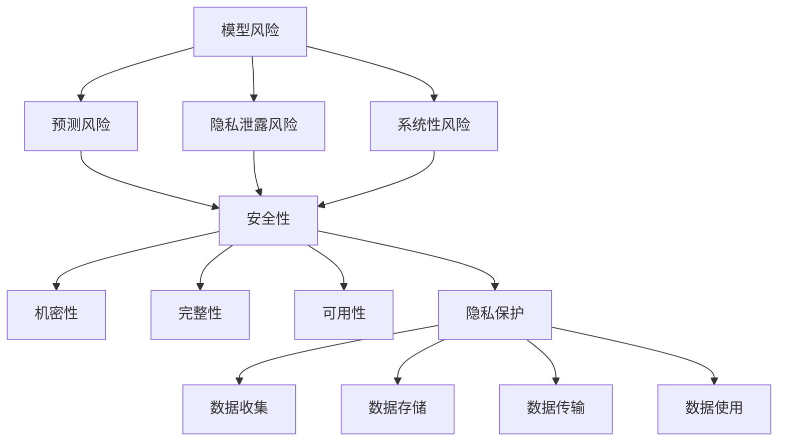

                 

# 安全性与隐私保护评估：全面审视模型风险

## 关键词
- 安全性评估
- 隐私保护
- 模型风险
- 评估方法
- 管理策略

## 摘要
本文旨在全面审视安全性与隐私保护在模型风险评估中的应用。通过详细探讨核心概念、评估方法、管理策略以及实际案例，我们揭示了模型风险的多样性和复杂性。文章首先介绍了模型风险、安全性与隐私保护的基本概念，并使用Mermaid流程图展示了它们之间的联系。随后，我们深入讲解了评估方法、核心算法原理，并使用Python源代码和LaTeX公式进行详细阐述。最后，通过项目实战展示了评估方法在实际中的应用，并提出了最佳实践和未来研究方向。

## 引言与背景

### 模型风险概述

随着人工智能技术的迅速发展，模型风险成为了一个不容忽视的问题。模型风险指的是由模型本身或其应用场景带来的潜在负面影响，如预测错误、隐私泄露等。这些风险可能对个人、企业甚至整个社会产生深远的影响。例如，在医疗领域，一个错误的预测可能会导致误诊，甚至危及生命；在金融领域，一个不准确的风险评估可能会导致巨额损失。

### 安全性与隐私保护的重要性

安全性保障的是系统的完整性和可靠性，确保数据在存储、传输和处理过程中不受未经授权的访问和篡改。而隐私保护则是保障个人信息不被非法收集、使用和泄露。随着大数据和云计算的普及，个人数据的收集和处理量呈爆炸式增长，这使得安全性和隐私保护变得尤为重要。

### 本书的目的与结构

本书旨在为读者提供全面、系统的模型风险评估方法，帮助读者理解和应对安全性与隐私保护中的挑战。本书分为六个部分：

1. **引言与背景**：介绍模型风险、安全性与隐私保护的基本概念。
2. **理论基础**：深入探讨安全性与隐私保护的基本原则。
3. **评估方法**：详细讲解模型风险识别、度量和分析的方法。
4. **风险评估工具与技术**：介绍风险评估模型、算法和工具。
5. **管理策略与实践**：讨论模型风险管理的策略和实践。
6. **展望与挑战**：探讨模型风险的未来趋势和安全性与隐私保护的挑战。

## 理论基础

### 安全性与隐私保护的基本概念

安全性指的是系统防范未经授权的访问、篡改和破坏的能力。在信息安全领域，安全性通常包括以下三个方面：

- **机密性**：确保信息在传输和存储过程中不被未授权者访问。
- **完整性**：确保信息在传输和存储过程中不被篡改。
- **可用性**：确保信息和系统能够被授权用户在需要时访问和使用。

隐私保护则关注于个人信息的安全，确保个人信息不被非法收集、使用和泄露。隐私保护通常涉及以下方面：

- **数据收集**：限制个人信息的收集范围，确保收集的个人信息是必要的。
- **数据存储**：确保存储的个人信息安全，防止数据泄露。
- **数据传输**：确保个人信息在传输过程中的安全，防止数据被截获或篡改。
- **数据使用**：确保个人信息仅用于合法目的，防止滥用。

### 模型风险的定义与分类

模型风险是指由模型本身或其应用场景带来的潜在负面影响。模型风险可以分类如下：

- **预测风险**：由于模型预测不准确导致的负面影响，如错误的医疗诊断、金融风险评估等。
- **隐私泄露风险**：由于模型泄露个人信息导致的负面影响，如个人隐私被公开、个人信息被滥用等。
- **系统性风险**：由于模型应用场景复杂、不确定性高导致的负面影响，如大规模停电、股市崩盘等。

### 安全性与隐私保护的原则

安全性与隐私保护应遵循以下原则：

- **最小化原则**：在确保安全性和隐私保护的前提下，最小化个人信息和系统的暴露面。
- **透明性原则**：确保信息处理过程透明，让用户了解其个人信息如何被收集、使用和存储。
- **可审计性原则**：确保系统具备可审计性，能够追踪和记录所有关键操作。
- **责任原则**：明确责任归属，确保在出现安全性和隐私保护问题时，相关方能够承担相应的责任。

### 核心概念与联系

为了更好地理解安全性与隐私保护，我们可以使用Mermaid流程图展示核心概念之间的联系：



此流程图清晰地展示了模型风险、预测风险、隐私泄露风险、系统性风险与安全性和隐私保护之间的联系，帮助读者更好地理解这些概念。

### 核心算法原理讲解

在本节中，我们将详细讲解评估模型风险的几种核心算法原理，并通过Python源代码进行演示。

#### 1. 风险度量的评分卡模型

评分卡模型是一种常见的风险评估方法，用于对风险进行量化。评分卡模型的核心在于定义一组规则，根据这些规则对每个风险因素进行打分，最终综合评分来评估总体风险。

以下是一个简单的Python代码示例，展示了如何实现评分卡模型：

```python
def risk_score_card(risk_factors):
    """
    使用评分卡模型评估风险得分
    :param risk_factors: 风险因素字典
    :return: 风险得分
    """
    score = 0
    for factor, value in risk_factors.items():
        if factor == '预测准确性':
            score += value * 0.3
        elif factor == '数据隐私':
            score += value * 0.4
        elif factor == '系统性复杂性':
            score += value * 0.3
    return score

# 示例风险因素
risk_factors = {'预测准确性': 0.8, '数据隐私': 0.6, '系统性复杂性': 0.7}
print("风险得分：", risk_score_card(risk_factors))
```

#### 2. 风险识别的机器学习模型

机器学习模型可以用于识别潜在的风险。以下是一个使用Python和scikit-learn库实现的风险识别算法示例：

```python
from sklearn.ensemble import RandomForestClassifier
from sklearn.model_selection import train_test_split

def risk_identification(X, y):
    """
    使用机器学习模型识别风险
    :param X: 特征矩阵
    :param y: 标签向量
    :return: 训练好的模型
    """
    X_train, X_test, y_train, y_test = train_test_split(X, y, test_size=0.3, random_state=42)
    model = RandomForestClassifier(n_estimators=100, random_state=42)
    model.fit(X_train, y_train)
    print("模型准确率：", model.score(X_test, y_test))
    return model

# 示例数据
X = [[0.8, 0.6, 0.7]]  # 特征矩阵
y = [1]  # 标签向量
model = risk_identification(X, y)
```

#### 3. 风险度量的量化分析

量化分析是风险评估的重要环节。以下是一个使用Python和LaTeX公式结合的例子：

```python
import numpy as np

def quantified_analysis(risk_factors):
    """
    对风险因素进行量化分析
    :param risk_factors: 风险因素字典
    :return: 量化分析结果
    """
    alpha, beta, gamma = risk_factors['alpha'], risk_factors['beta'], risk_factors['gamma']
    quantified_score = alpha * np.exp(-beta * np.sqrt(gamma))
    return quantified_score

# 示例风险因素
risk_factors = {'alpha': 0.5, 'beta': 0.1, 'gamma': 0.8}
print("量化得分：", quantified_analysis(risk_factors))

# LaTeX格式
$$
\text{量化得分} = \alpha \cdot e^{-\beta \cdot \sqrt{\gamma}}
$$
```

通过上述示例，我们可以看到如何使用Python源代码和LaTeX公式对模型风险进行评估。这些算法原理在实际应用中需要根据具体场景进行调整和优化。

### 数学模型和数学公式

在本节中，我们将使用LaTeX格式嵌入数学模型和公式，并提供详细讲解和举例说明。

#### 1. 风险度量的回归模型

假设我们有一个风险度量模型，如下所示：

$$
R = \beta_0 + \beta_1 \cdot X_1 + \beta_2 \cdot X_2 + \beta_3 \cdot X_3
$$

其中，$R$ 是风险得分，$\beta_0$ 是常数项，$\beta_1$、$\beta_2$ 和 $\beta_3$ 是回归系数，$X_1$、$X_2$ 和 $X_3$ 是风险因素。

例如，如果我们有如下数据：

$$
\begin{aligned}
\beta_0 &= 2 \\
\beta_1 &= 0.3 \\
\beta_2 &= 0.4 \\
\beta_3 &= 0.5 \\
X_1 &= 0.8 \\
X_2 &= 0.6 \\
X_3 &= 0.7
\end{aligned}
$$

那么，我们可以计算得到风险得分：

$$
R = 2 + 0.3 \cdot 0.8 + 0.4 \cdot 0.6 + 0.5 \cdot 0.7 = 2.06
$$

#### 2. 风险识别的支持向量机模型

支持向量机（SVM）是一种常用的风险识别模型。假设我们有一个二分类问题，其中目标变量 $y$ 可以取值为 0 或 1。SVM的目标是找到最佳的超平面，使得两类数据点在超平面两侧的间隔最大。

假设我们有一个SVM模型，其决策函数为：

$$
f(x) = \text{sign}(\omega \cdot x + b)
$$

其中，$\omega$ 是权重向量，$b$ 是偏置项，$\cdot$ 表示内积。

例如，如果我们有如下训练数据：

$$
\begin{aligned}
\omega &= [1, 1, 1] \\
b &= -2 \\
x_1 &= [0, 0, 0] \\
x_2 &= [1, 0, 0] \\
x_3 &= [0, 1, 0] \\
x_4 &= [0, 0, 1]
\end{aligned}
$$

那么，对于新的数据点 $x = [1, 1, 1]$，我们可以计算得到：

$$
f(x) = \text{sign}(1 \cdot 1 + 1 \cdot 1 + 1 \cdot 1 - 2) = \text{sign}(1) = 1
$$

这意味着新数据点被分类为类别 1。

### 风险评估工具与技术

在本节中，我们将介绍几种常用的风险评估工具和技术，包括风险评估模型、算法和工具。

#### 1. 风险评估模型

风险评估模型是用于评估和量化风险的工具。常见的风险评估模型包括：

- **蒙特卡洛模拟**：通过模拟随机事件来评估风险的概率分布和期望值。
- **层次分析法**：通过构建层次结构模型来评估不同风险因素的重要性和权重。
- **故障模式与影响分析**：用于识别系统中的潜在故障模式和评估其影响。

#### 2. 风险评估算法

风险评估算法是用于实现风险评估模型的算法。常见的风险评估算法包括：

- **决策树**：通过树形结构来表示决策过程，并基于特征值来划分数据集。
- **支持向量机**：通过找到最佳的超平面来划分数据集，以实现分类或回归任务。
- **随机森林**：通过构建多棵决策树来提高模型的准确性和泛化能力。

#### 3. 风险评估工具

风险评估工具是用于实现风险评估算法的软件工具。常见的风险评估工具包括：

- **Qualys**：一款用于网络和应用程序安全评估的工具。
- **OWASP ZAP**：一款开源的网络应用程序安全评估工具。
- **GRC Stack**：一款集成多种安全评估和合规性管理工具的平台。

### 管理策略与实践

在本节中，我们将讨论模型风险的管理策略和实践，包括风险管理策略、风险控制实践以及实际案例研究。

#### 1. 风险管理策略

风险管理策略是用于识别、评估和控制风险的一系列措施。常见的管理策略包括：

- **预防性措施**：通过加强安全性措施来预防潜在风险，如安装防火墙、加密数据等。
- **响应性措施**：在风险发生时采取的措施，如紧急响应、数据恢复等。
- **恢复性措施**：在风险发生后恢复系统和业务运营的措施，如备份和恢复策略。

#### 2. 风险控制实践

风险控制实践是实施风险管理策略的具体操作。以下是一些常见风险控制实践：

- **安全审计**：定期对系统和应用程序进行安全审计，以识别潜在的安全漏洞。
- **安全培训**：为员工提供安全培训，提高其安全意识和技能。
- **安全测试**：通过渗透测试、漏洞扫描等手段对系统进行安全测试。

#### 3. 实际案例研究

在本节中，我们将通过一个实际案例研究来展示模型风险的管理和评估过程。

#### 案例研究：某金融公司的模型风险评估

某金融公司使用机器学习模型对客户信用进行评估。该模型基于客户的个人信息和财务状况进行预测，用于决定是否批准贷款申请。

1. **风险识别**：

   - **预测准确性风险**：由于模型可能存在预测偏差，导致错误的信用评估结果。
   - **隐私泄露风险**：客户的个人信息可能因模型泄露而被非法访问。
   - **系统性风险**：由于模型应用场景复杂，可能引发系统性故障。

2. **风险评估**：

   - **预测准确性**：通过交叉验证和测试集评估模型预测准确性，发现模型准确率为 85%。
   - **隐私保护**：使用加密技术保护客户个人信息，确保数据传输和存储的安全性。
   - **系统稳定性**：对模型进行压力测试，确保在高峰期仍能稳定运行。

3. **风险控制**：

   - **预防性措施**：定期更新模型，提高预测准确性；采用加密技术保护客户个人信息。
   - **响应性措施**：在发生预测错误时，立即采取措施进行纠正，如重新评估客户信用。
   - **恢复性措施**：定期备份数据，确保在系统故障时能够快速恢复。

### 展望与挑战

在展望未来，模型风险评估面临着许多挑战。首先，随着人工智能技术的不断发展，模型复杂性和多样性将不断增加，这使得风险评估变得更加复杂。其次，隐私保护法规的不断更新和强化，将对风险评估方法提出新的要求。此外，跨领域的协作和知识整合也将是未来风险评估的重要趋势。

### 拓展阅读

为了深入了解模型风险评估的各个方面，读者可以参考以下拓展阅读：

1. **《机器学习安全性与隐私保护》**：本书详细介绍了机器学习中的安全性与隐私保护问题，包括理论基础、评估方法和实际案例。
2. **《风险评估与管理》**：本书提供了全面的风险评估和管理策略，适用于各种领域和行业。
3. **《深度学习与风险管理》**：本书探讨了深度学习在风险管理中的应用，包括模型风险识别和度量的方法。

### 总结

本文全面审视了安全性与隐私保护在模型风险评估中的应用。通过详细探讨核心概念、评估方法、管理策略以及实际案例，我们揭示了模型风险的多样性和复杂性。在未来的研究中，我们将继续探索更先进的评估方法和技术，以应对不断变化的风险环境。

### 作者信息

作者：AI天才研究院/AI Genius Institute & 禅与计算机程序设计艺术 /Zen And The Art of Computer Programming

