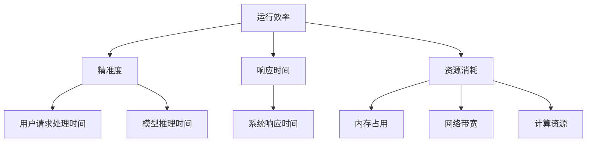
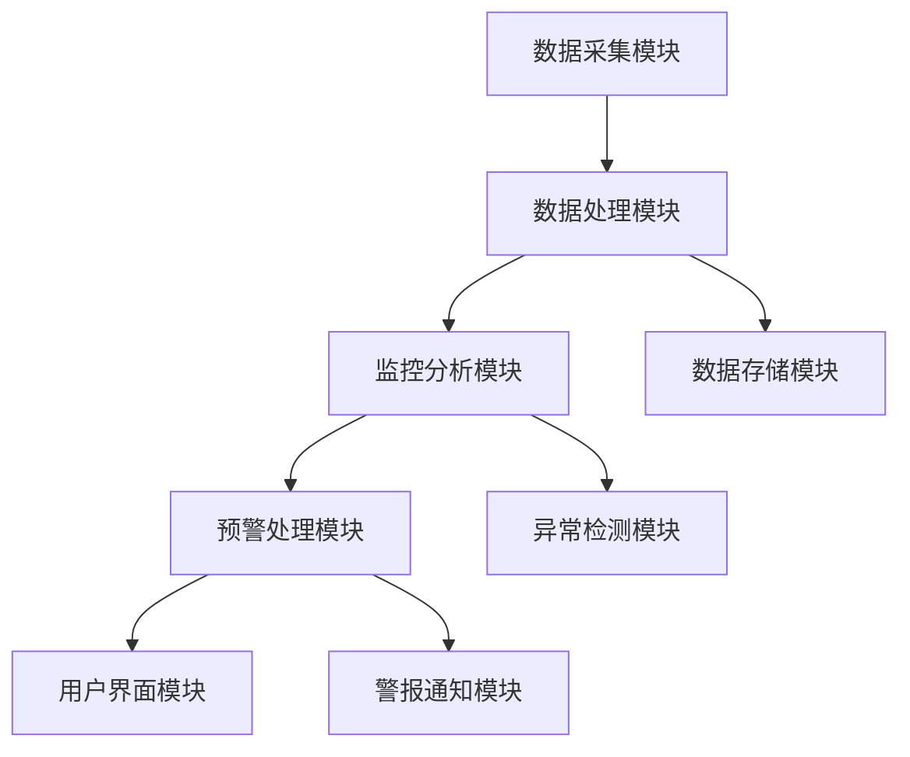

                 

### 实时LLM性能监控与预警系统构建

#### 关键词
- 实时监控
- 性能监控
- 预警系统
- 语言模型（LLM）
- 异常检测
- 机器学习

#### 摘要
本文将深入探讨实时LLM（大型语言模型）性能监控与预警系统的构建方法。首先，我们将介绍实时监控与预警系统的背景和重要性，分析其功能与作用。接着，本文将详细阐述实时LLM性能监控的核心原理，包括性能监控的基本概念、关键指标以及监控数据采集与处理方法。随后，我们将设计并实现预警系统，从预警策略、算法原理到实现过程进行详细讲解。最后，本文将介绍系统集成、部署与优化策略，并提供实际案例分析和最佳实践建议。通过本文，读者将全面了解实时LLM性能监控与预警系统的构建方法和应用场景。

---

# 实时LLM性能监控与预警系统构建

## 1.1 实时LLM性能监控与预警系统的背景和重要性

随着人工智能技术的飞速发展，大型语言模型（LLM）在自然语言处理、智能问答、自动摘要等领域展现了强大的应用潜力。然而，LLM的性能监控与预警系统的重要性也逐渐凸显出来。实时监控与预警系统可以确保LLM在运行过程中的稳定性和高效性，避免潜在的性能瓶颈和异常情况，从而提升用户体验和系统可靠性。

### 1.1.1 实时LLM性能监控的需求

实时性能监控是为了实时获取LLM在运行过程中的各种性能指标，如运行效率、精准度、响应时间等。通过这些指标，我们可以评估LLM的性能状态，及时发现潜在问题并进行优化。

#### 监控指标

- **运行效率指标**：包括模型推理时间、内存消耗、CPU利用率等。
- **精准度指标**：包括模型预测准确率、召回率、F1值等。
- **响应时间指标**：包括用户请求处理时间、系统响应时间等。
- **资源消耗指标**：包括内存占用、网络带宽、计算资源等。

### 1.1.2 预警系统的功能与作用

预警系统的主要功能是在性能指标异常时及时发出警报，提醒运维人员或开发人员采取相应措施。预警系统的作用包括：

- **故障预防**：通过提前预警，防止系统出现严重故障。
- **性能优化**：通过对性能指标的监控和分析，找到优化方向，提升系统性能。
- **故障排查**：在出现故障时，快速定位问题根源，缩短故障处理时间。

### 1.1.3 系统在AI服务中的应用价值

实时LLM性能监控与预警系统在AI服务中的应用价值主要体现在以下几个方面：

- **提升用户体验**：通过实时监控和预警，确保系统稳定运行，提升用户满意度。
- **提高系统可靠性**：及时发现并处理性能问题，确保系统稳定性和可靠性。
- **降低运营成本**：通过优化系统性能和故障预防，减少运维成本和停机时间。
- **促进技术创新**：通过监控和分析，发现新的优化方向和需求，推动技术创新。

## 1.2 实时LLM性能监控与预警系统的架构设计

实时LLM性能监控与预警系统的架构设计是确保系统能够高效、稳定运行的关键。下面我们将从整体架构、数据收集与处理、监控指标设定、预警机制等方面进行详细讲解。

### 1.2.1 系统整体架构

实时LLM性能监控与预警系统的整体架构可以分为以下几个部分：

- **数据采集模块**：负责实时获取LLM在运行过程中的各种性能指标。
- **数据处理模块**：负责对采集到的数据进行预处理和存储。
- **监控分析模块**：负责对处理后的数据进行实时监控和分析。
- **预警处理模块**：负责在性能指标异常时发出警报并通知相关人员。
- **用户界面模块**：提供监控数据和预警信息的可视化展示。

### 1.2.2 数据收集与处理

数据收集与处理是实时LLM性能监控与预警系统的核心环节。具体步骤如下：

1. **数据采集**：通过日志记录、性能监控工具等手段，实时获取LLM的运行状态信息。
2. **数据预处理**：对采集到的数据进行清洗、去噪、转换等预处理操作，确保数据的准确性和一致性。
3. **数据存储**：将预处理后的数据存储到数据库或数据湖中，以便后续分析和查询。

### 1.2.3 监控指标设定

监控指标是实时LLM性能监控与预警系统的重要基础。根据系统的需求和应用场景，可以设定以下监控指标：

- **运行效率指标**：如模型推理时间、内存消耗、CPU利用率等。
- **精准度指标**：如模型预测准确率、召回率、F1值等。
- **响应时间指标**：如用户请求处理时间、系统响应时间等。
- **资源消耗指标**：如内存占用、网络带宽、计算资源等。

### 1.2.4 预警机制

预警机制是实时LLM性能监控与预警系统的关键环节。具体步骤如下：

1. **预警策略设定**：根据监控指标设定预警阈值，确定何时发出警报。
2. **预警算法实现**：采用机器学习、深度学习等算法，实现性能指标的实时检测和预警。
3. **预警通知**：在性能指标异常时，通过短信、邮件、微信等方式通知相关人员。
4. **预警处理**：相关人员根据预警通知，采取相应措施进行故障排查和处理。

## 1.3 现有LLM性能监控与预警系统的挑战和解决方案

尽管实时LLM性能监控与预警系统具有诸多优势，但在实际应用中仍面临一些挑战。下面我们将分析现有系统的不足，并提出相应的解决方案。

### 1.3.1 传统监控方案的不足

传统监控方案通常存在以下不足：

- **监控范围有限**：仅能监控部分性能指标，无法全面了解系统状态。
- **响应速度较慢**：监控数据采集和处理速度较慢，无法实现实时监控。
- **预警准确性不高**：预警算法相对简单，无法准确检测性能异常。
- **系统可扩展性差**：传统监控方案难以适应大规模系统和高并发场景。

### 1.3.2 高并发场景下的性能监控

在高并发场景下，实时LLM性能监控与预警系统需要具备以下能力：

- **高并发处理能力**：能够同时处理大量监控数据，确保实时性。
- **分布式架构**：采用分布式架构，提高系统容错性和可扩展性。
- **负载均衡**：通过负载均衡技术，确保系统在高并发场景下的稳定运行。

### 1.3.3 预警系统的准确性与可靠性

预警系统的准确性与可靠性是实时LLM性能监控与预警系统的关键。为此，可以采取以下措施：

- **算法优化**：采用先进的机器学习、深度学习算法，提高预警准确性。
- **数据质量控制**：确保监控数据的质量，减少噪声和误差。
- **实时调整阈值**：根据系统运行状态和监控数据，实时调整预警阈值，提高预警系统的可靠性。

## 1.4 总结

本文介绍了实时LLM性能监控与预警系统的背景、重要性以及架构设计。在后续章节中，我们将进一步探讨实时LLM性能监控的核心原理、预警系统的设计与实现、系统集成与优化策略等内容。通过本文的讲解，读者将全面了解实时LLM性能监控与预警系统的构建方法和应用价值。

## 2.1 实时性能监控基本概念

### 2.1.1 性能监控的定义和目的

性能监控是指通过收集、分析和处理系统运行状态信息，对系统性能进行实时监测和管理的过程。性能监控的目的是确保系统在运行过程中保持良好的性能状态，及时发现并处理潜在的性能问题，从而保证系统的高效、稳定运行。

#### 监控对象

- **硬件资源**：如CPU、内存、硬盘、网络等。
- **软件资源**：如操作系统、数据库、应用程序等。
- **服务性能**：如Web服务器响应时间、网络传输速率等。

### 2.1.2 性能监控的关键要素

性能监控的关键要素包括：

- **监控指标**：用于衡量系统性能的量化指标，如CPU利用率、内存消耗、网络带宽等。
- **数据采集**：从系统中收集性能监控数据，如使用系统内置监控工具、第三方监控工具等。
- **数据处理**：对采集到的数据进行预处理、存储和查询，以便进行分析和监控。
- **监控分析**：对处理后的数据进行实时分析，发现潜在的性能问题和异常情况。
- **预警机制**：在性能指标异常时，及时发出警报并通知相关人员。

### 2.1.3 性能监控的基本流程

性能监控的基本流程包括以下几个步骤：

1. **指标设定**：根据系统需求和应用场景，设定需要监控的关键性能指标。
2. **数据采集**：使用监控工具或API接口，实时收集系统性能数据。
3. **数据处理**：对采集到的数据进行分析、清洗、转换等预处理操作，确保数据的准确性和一致性。
4. **数据存储**：将预处理后的数据存储到数据库或数据湖中，以便后续分析和查询。
5. **监控分析**：对存储的数据进行实时分析，发现潜在的性能问题和异常情况。
6. **预警处理**：在性能指标异常时，发出警报并通知相关人员，采取相应措施进行处理。

### 2.1.4 性能监控的优势和应用场景

性能监控的优势和应用场景包括：

- **优势**：
  - 提高系统稳定性：通过实时监控和预警，确保系统在运行过程中保持良好的性能状态。
  - 提高故障排查效率：快速定位故障根源，缩短故障处理时间。
  - 提高运维效率：自动化监控和分析，减少人工干预，提高运维效率。
  - 优化资源配置：根据性能监控数据，合理调整系统资源配置，降低运营成本。

- **应用场景**：
  - 企业级应用系统：如企业内部Web应用、数据库系统、云计算平台等。
  - 公共服务系统：如政务服务平台、电商平台、在线教育平台等。
  - 物联网系统：如智能家居、智能交通、智能医疗等。

## 2.2 LLM性能监控核心指标

LLM（大型语言模型）性能监控的核心指标包括运行效率指标、精准度指标、响应时间指标和资源消耗指标。这些指标能够全面评估LLM的性能状态，帮助我们发现和解决潜在的问题。

### 2.2.1 运行效率指标

运行效率指标主要用于衡量LLM在处理请求时的效率。以下是一些常见的运行效率指标：

- **模型推理时间**：从接收请求到完成模型推理所需的时间。模型推理时间是评估LLM处理能力的重要指标。
- **内存消耗**：LLM在推理过程中占用的内存大小。内存消耗过高可能导致系统性能下降或内存溢出。
- **CPU利用率**：LLM在推理过程中占用的CPU资源比例。高CPU利用率可能导致系统资源不足。

### 2.2.2 精准度指标

精准度指标主要用于衡量LLM的预测准确性和可靠性。以下是一些常见的精准度指标：

- **准确率**：预测结果正确的样本数占总样本数的比例。准确率越高，表示LLM的预测能力越强。
- **召回率**：预测结果中实际正样本的占比。召回率越高，表示LLM对正样本的识别能力越强。
- **F1值**：准确率和召回率的调和平均值。F1值综合考虑了准确率和召回率，是一个更全面的评估指标。

### 2.2.3 响应时间指标

响应时间指标主要用于衡量LLM对用户请求的处理速度。以下是一些常见的响应时间指标：

- **用户请求处理时间**：从用户提交请求到接收到响应结果所需的时间。用户请求处理时间直接影响用户体验。
- **系统响应时间**：系统从接收到请求到生成响应结果所需的时间。系统响应时间包括模型推理时间和网络传输时间。

### 2.2.4 资源消耗指标

资源消耗指标主要用于衡量LLM在推理过程中消耗的资源。以下是一些常见的资源消耗指标：

- **内存占用**：LLM在推理过程中占用的内存大小。内存占用过高可能导致系统资源不足。
- **网络带宽**：LLM在推理过程中占用的网络带宽。网络带宽不足可能导致模型推理时间延长。
- **计算资源**：LLM在推理过程中占用的计算资源，如CPU、GPU等。计算资源不足可能导致模型推理时间延长。

### 2.2.5 关键指标之间的关系

运行效率指标、精准度指标、响应时间指标和资源消耗指标之间存在密切的关系。一般来说，运行效率越高，精准度越高，响应时间越短，资源消耗越低，LLM的性能就越好。以下是一个简单的Mermaid流程图，展示了这些指标之间的关系：



通过这个流程图，我们可以更直观地了解各个指标之间的关联和影响。

## 2.3 监控数据采集与处理

### 2.3.1 数据采集方法

监控数据的采集是实时LLM性能监控与预警系统的关键环节。以下是一些常见的数据采集方法：

1. **日志记录**：通过系统日志记录LLM的运行状态信息，如模型推理时间、内存消耗、CPU利用率等。
2. **性能监控工具**：使用如Prometheus、Grafana等性能监控工具，实时采集系统的性能数据。
3. **API接口**：通过自定义API接口，实时获取LLM的运行状态信息。
4. **传感器**：使用硬件传感器，实时监测硬件资源的使用情况。

### 2.3.2 数据预处理策略

数据预处理是确保监控数据准确性和一致性的重要步骤。以下是一些常见的数据预处理策略：

1. **数据清洗**：去除无效数据、重复数据、噪声数据等，保证数据的质量。
2. **数据转换**：将不同类型的数据转换为统一的格式，如将时间戳转换为Unix时间戳等。
3. **数据归一化**：将不同指标的数据归一化到相同的量纲，便于后续分析和比较。

### 2.3.3 数据存储与管理系统

数据存储与管理系统用于存储和管理监控数据，以便后续的分析和查询。以下是一些常见的数据存储与管理方案：

1. **关系型数据库**：如MySQL、PostgreSQL等，适用于存储结构化数据。
2. **NoSQL数据库**：如MongoDB、Redis等，适用于存储非结构化数据。
3. **数据湖**：如Hadoop HDFS、Amazon S3等，适用于存储大规模数据。

### 2.3.4 数据采集与处理的挑战

实时LLM性能监控与预警系统在数据采集与处理过程中面临以下挑战：

1. **高并发数据采集**：在高并发场景下，如何快速、高效地采集大量监控数据。
2. **数据一致性**：在分布式系统中，如何保证数据的一致性和准确性。
3. **数据存储与访问**：如何存储和管理大规模监控数据，并保证数据的高效访问。

### 2.3.5 案例分析

以下是一个简单的案例，展示如何采集和处理LLM的监控数据：

#### 案例背景

某企业使用一个大型语言模型（LLM）提供智能问答服务。为了确保LLM的性能稳定，企业需要实时监控其运行状态，并处理潜在的性能问题。

#### 数据采集

企业使用Prometheus作为性能监控工具，实时采集LLM的模型推理时间、内存消耗、CPU利用率等监控数据。

```python
from prometheus_api_client import PrometheusConnect

prom = PrometheusConnect(url="https://prometheus-server.example.com", api_key="your_api_key")

# 采集模型推理时间
query = "llm_model推理时间"
result = prom.query(query)

# 采集内存消耗
query = "llm_model_memory_usage"
result = prom.query(query)

# 采集CPU利用率
query = "llm_model_cpu_usage"
result = prom.query(query)
```

#### 数据预处理

对采集到的监控数据进行清洗、去噪、转换等预处理操作，确保数据的质量。

```python
import pandas as pd

# 清洗数据
data = pd.DataFrame(result)

# 去除无效数据
data = data.dropna()

# 转换时间戳
data['timestamp'] = pd.to_datetime(data['timestamp'], unit='s')

# 数据归一化
data = (data - data.min()) / (data.max() - data.min())
```

#### 数据存储

将预处理后的监控数据存储到MySQL数据库中，便于后续分析和查询。

```python
import pymysql

# 连接MySQL数据库
conn = pymysql.connect(host="mysql-server.example.com", user="your_username", password="your_password", database="your_database")

# 存储数据
cursor = conn.cursor()
for index, row in data.iterrows():
    query = "INSERT INTO llm_monitor (timestamp, model推理时间, 内存消耗, CPU利用率) VALUES (%s, %s, %s, %s)"
    cursor.execute(query, (row['timestamp'], row['model推理时间'], row['内存消耗'], row['CPU利用率']))
conn.commit()
cursor.close()
conn.close()
```

#### 数据查询

通过MySQL数据库，可以方便地查询LLM的监控数据，并进行分析和监控。

```python
import pymysql

# 连接MySQL数据库
conn = pymysql.connect(host="mysql-server.example.com", user="your_username", password="your_password", database="your_database")

# 查询数据
cursor = conn.cursor()
query = "SELECT * FROM llm_monitor ORDER BY timestamp DESC LIMIT 100"
cursor.execute(query)
results = cursor.fetchall()

# 处理数据
data = pd.DataFrame(results)

# 关闭数据库连接
cursor.close()
conn.close()

# 绘制监控图表
data.plot(x='timestamp', y=['model推理时间', '内存消耗', 'CPU利用率'])
plt.show()
```

通过这个案例，我们可以看到如何采集、预处理、存储和查询实时LLM的监控数据。在实际应用中，可以根据具体需求进行调整和优化。

## 2.4 LLM性能监控原理详解

### 2.4.1 实时监控算法

实时LLM性能监控的核心在于实时性，因此，我们需要采用高效的监控算法来确保监控数据的及时性和准确性。以下是一些常用的实时监控算法：

#### 1. 窗口滑动算法

窗口滑动算法是一种常用的实时监控算法，它通过设定一个时间窗口，实时计算窗口内的监控数据，并更新监控结果。具体步骤如下：

1. **初始化**：设定时间窗口大小W，初始化窗口内监控数据集D。
2. **数据采集**：实时采集LLM的性能数据，将新采集的数据添加到窗口D。
3. **数据更新**：当新数据添加到窗口D后，将超过窗口时间范围的数据从D中移除。
4. **计算监控结果**：对窗口D中的监控数据进行处理，如求平均值、最大值、最小值等。

#### 2. 异常检测算法

异常检测算法用于检测监控数据中的异常值，及时发现潜在的性能问题。以下是一些常用的异常检测算法：

1. **统计学方法**：如标准差法、IQR法（四分位差法）等。
2. **基于规则的方法**：如阈值法、逻辑回归法等。
3. **机器学习方法**：如K均值聚类、孤立森林等。

#### 3. 基于机器学习的实时监控算法

基于机器学习的实时监控算法利用历史监控数据，建立模型对实时监控数据进行预测，并检测预测误差。以下是一种基于机器学习的实时监控算法：

1. **数据收集**：收集一段时间内的LLM性能数据，包括运行效率指标、精准度指标、响应时间指标等。
2. **特征工程**：对收集到的数据进行预处理和特征提取，提取出有助于性能预测的特征。
3. **模型训练**：利用历史监控数据，训练一个性能预测模型，如线性回归、决策树、神经网络等。
4. **实时监控**：将实时采集的监控数据输入到训练好的模型中，预测性能指标，并与实际值进行比较，检测异常值。

#### 实时监控算法的优缺点

- **窗口滑动算法**：
  - 优点：简单、易于实现，实时性较好。
  - 缺点：对于长时间窗口，数据更新和计算开销较大。
- **异常检测算法**：
  - 优点：能够检测监控数据中的异常值，及时发现问题。
  - 缺点：对于规则方法，需要预设阈值，可能无法检测到复杂的异常情况；对于机器学习方法，需要大量历史数据，训练时间较长。
- **基于机器学习的实时监控算法**：
  - 优点：利用历史数据，能够对复杂异常情况做出预测。
  - 缺点：训练模型需要大量计算资源，实时性可能受到一定影响。

### 2.4.2 异常检测算法

异常检测算法是实时LLM性能监控中至关重要的一环。它用于检测监控数据中的异常值，及时发现潜在的性能问题。以下是一些常用的异常检测算法：

1. **基于统计学的异常检测算法**：
   - **标准差法**：计算监控数据的平均值和标准差，将离群值定义为标准差倍数之外的数据。
     $$ x_i = \frac{\sum_{i=1}^{n} x_i - \bar{x}}{s} $$
     其中，\( x_i \) 为第 \( i \) 个数据点，\( \bar{x} \) 为平均值，\( s \) 为标准差。
   - **IQR法（四分位差法）**：计算第一四分位数（Q1）和第三四分位数（Q3），将离群值定义为上下四分位距之外的数据。
     $$ iqr = Q3 - Q1 $$
     $$ x_i = \begin{cases} 
     x_i < Q1 - 1.5 \times iqr & \text{异常值} \\
     x_i > Q3 + 1.5 \times iqr & \text{异常值} \\
     \text{其他} & \text{正常值} 
     \end{cases} $$

2. **基于距离的异常检测算法**：
   - **KNN算法**：计算监控数据与最近的 \( k \) 个邻居之间的距离，将距离大于设定阈值的点定义为异常值。
     $$ d(x, y) = \sqrt{\sum_{i=1}^{n} (x_i - y_i)^2} $$
   - **DBSCAN算法**：基于密度的空间聚类算法，将距离小于设定阈值的点划分为一个簇，将距离大于设定阈值的点定义为异常值。

3. **基于聚类的方法**：
   - **K均值聚类**：将监控数据划分为 \( k \) 个簇，将簇内距离较大的点定义为异常值。
   - **层次聚类**：通过合并或分裂簇，动态调整聚类结果，将距离较大的点定义为异常值。

#### 异常检测算法的优缺点

- **基于统计学的异常检测算法**：
  - 优点：简单易用，适用于线性关系较强的监控数据。
  - 缺点：对于非线性关系和异常值较多的情况，检测效果较差。
- **基于距离的异常检测算法**：
  - 优点：适用于非线性关系和复杂异常值的情况。
  - 缺点：需要设定阈值，可能无法准确检测所有异常值。
- **基于聚类的方法**：
  - 优点：能够自动发现数据分布，适应复杂异常值。
  - 缺点：计算复杂度较高，对于大规模数据集，可能需要较长时间。

### 2.4.3 性能指标评估方法

评估性能指标是实时LLM性能监控的重要环节。以下是一些常用的性能指标评估方法：

1. **准确率（Accuracy）**：正确预测的样本数占总样本数的比例。
   $$ accuracy = \frac{TP + TN}{TP + FN + FP + TN} $$
   其中，\( TP \) 为真正例，\( TN \) 为真反例，\( FP \) 为假正例，\( FN \) 为假反例。

2. **召回率（Recall）**：正确预测的正例数占总正例数的比例。
   $$ recall = \frac{TP}{TP + FN} $$

3. **精确率（Precision）**：正确预测的正例数占总预测正例数的比例。
   $$ precision = \frac{TP}{TP + FP} $$

4. **F1值（F1-score）**：精确率和召回率的调和平均值。
   $$ F1 = 2 \times \frac{precision \times recall}{precision + recall} $$

5. **ROC曲线（Receiver Operating Characteristic Curve）**：通过绘制真阳性率（True Positive Rate，TPR）和假阳性率（False Positive Rate，FPR）的曲线，评估性能指标。

6. **AUC（Area Under Curve）**：ROC曲线下的面积，用于评估模型的区分能力。

#### 性能指标评估方法的优缺点

- **准确率**：
  - 优点：简单直观，适用于分类问题。
  - 缺点：对于不平衡数据集，可能无法准确评估模型性能。
- **召回率**：
  - 优点：关注正例的检测，适用于需要高召回率的应用场景。
  - 缺点：对于不平衡数据集，可能较低。
- **精确率**：
  - 优点：关注正例的准确性，适用于需要高准确性的应用场景。
  - 缺点：对于不平衡数据集，可能较低。
- **F1值**：
  - 优点：综合考虑了精确率和召回率，适用于平衡评估。
  - 缺点：对于不平衡数据集，可能无法准确反映模型性能。
- **ROC曲线和AUC**：
  - 优点：全面评估模型的区分能力，适用于分类问题。
  - 缺点：计算复杂度较高，对于大规模数据集，可能需要较长时间。

通过以上对实时LLM性能监控与预警系统核心原理的详细讲解，我们可以看到，实时监控与预警系统在LLM性能管理中具有重要作用。通过合理选择和组合监控算法、异常检测算法和性能指标评估方法，可以构建一个高效、准确的实时LLM性能监控与预警系统，确保LLM在运行过程中的稳定性和高效性。

## 3.1 预警系统设计原则

预警系统是实时LLM性能监控与预警系统的核心组件之一，其设计原则直接影响系统的性能和可靠性。在设计预警系统时，我们需要遵循以下原则：

### 3.1.1 预警策略

预警策略是预警系统的核心，决定了何时、如何发出警报。一个良好的预警策略应具备以下特点：

1. **及时性**：在性能指标异常时，能够快速检测并发出警报。
2. **准确性**：准确判断性能指标是否异常，避免误报和漏报。
3. **灵活性**：根据不同场景和需求，调整预警阈值和策略。

### 3.1.2 预警阈值设定

预警阈值是预警系统的关键参数，用于判断性能指标是否异常。设定预警阈值时，需要考虑以下因素：

1. **历史数据**：基于历史数据，分析性能指标的变化规律，确定合理的预警阈值。
2. **业务需求**：根据业务需求和系统重要性，设定不同的预警阈值。
3. **动态调整**：根据系统运行状态和性能变化，动态调整预警阈值。

### 3.1.3 预警机制实现

预警机制是实现预警系统功能的关键。一个完善的预警机制应包括以下几个部分：

1. **数据采集**：实时采集LLM的性能指标数据，为预警提供数据基础。
2. **数据分析**：对采集到的数据进行处理和分析，判断性能指标是否异常。
3. **警报通知**：在性能指标异常时，及时发出警报并通知相关人员。
4. **报警记录**：记录所有警报信息，便于后续分析和复盘。

### 3.1.4 预警系统的可靠性

预警系统的可靠性是保障系统稳定运行的关键。为了提高预警系统的可靠性，需要考虑以下几个方面：

1. **冗余设计**：采用冗余设计，确保系统在高可用性环境下稳定运行。
2. **故障处理**：在预警系统出现故障时，能够自动恢复或切换到备用系统。
3. **数据备份**：定期备份预警系统数据，确保数据的完整性和可靠性。

### 3.1.5 预警系统的可扩展性

随着业务的发展，预警系统需要具备良好的可扩展性。为了实现预警系统的可扩展性，可以考虑以下几个方面：

1. **模块化设计**：将预警系统划分为多个模块，便于功能扩展和更新。
2. **分布式架构**：采用分布式架构，提高系统的处理能力和扩展性。
3. **自动化部署**：利用自动化工具，实现预警系统的快速部署和升级。

通过遵循以上设计原则，我们可以构建一个高效、可靠、灵活的实时LLM性能监控与预警系统，为LLM的稳定运行提供有力保障。

### 3.2 预警算法原理

预警算法是实时LLM性能监控与预警系统的核心，决定了系统在性能指标异常时的检测能力和响应速度。本文将详细介绍几种常见的预警算法原理，包括传统预警算法、机器学习预警算法和深度学习预警算法。

#### 3.2.1 传统预警算法

传统预警算法是基于统计学方法和规则的方法，其原理简单，易于实现。以下是一些常用的传统预警算法：

1. **阈值法**

阈值法是一种最简单的预警算法，通过设定一个阈值，当监控数据超过阈值时，触发警报。阈值法的公式如下：

$$
预警 = \begin{cases} 
数据 > 阈值 & \text{触发警报} \\
数据 \leq 阈值 & \text{不触发警报}
\end{cases}
$$

阈值法的主要优点是实现简单，成本低。然而，其缺点是对于非线性、复杂的数据分布，阈值法可能无法准确检测异常。

2. **四分位差法（IQR法）**

四分位差法是一种基于统计学的预警算法，通过计算第一四分位数（Q1）和第三四分位数（Q3），将四分位距（IQR = Q3 - Q1）作为预警阈值。当监控数据超过四分位距的1.5倍时，触发警报。四分位差法的公式如下：

$$
预警 = \begin{cases} 
数据 < Q1 - 1.5 \times IQR & \text{触发警报} \\
Q1 - 1.5 \times IQR \leq 数据 \leq Q3 + 1.5 \times IQR & \text{不触发警报} \\
数据 > Q3 + 1.5 \times IQR & \text{触发警报}
\end{cases}
$$

四分位差法适用于线性关系较强的监控数据，对于非线性数据，其检测效果可能较差。

3. **移动平均法**

移动平均法是一种时间序列分析方法，通过计算一段固定时间窗口内的监控数据平均值，作为当前时刻的预测值。当当前时刻的监控数据与预测值的偏差超过设定阈值时，触发警报。移动平均法的公式如下：

$$
预测值 = \frac{1}{N} \sum_{i=1}^{N} 数据_i
$$

其中，\( N \) 为时间窗口长度。

移动平均法适用于短期趋势数据的预警，对于长期趋势变化，其预警效果可能较差。

#### 3.2.2 机器学习预警算法

机器学习预警算法通过构建统计模型，从历史数据中学习数据分布和变化规律，用于检测异常值。以下是一些常见的机器学习预警算法：

1. **孤立森林（Isolation Forest）**

孤立森林算法是一种基于随机森林的异常检测算法，通过随机选择特征和切分点，将数据集分割成多个子集，使得异常值被孤立。异常值的检测分数越高，表示其异常程度越大。孤立森林算法的公式如下：

$$
score = \frac{H}{N} + \frac{\sum_{i=1}^{N} H_i}{N}
$$

其中，\( H \) 为平均高度，\( H_i \) 为第 \( i \) 个样本的高度。

孤立森林算法的优点是计算速度快，能够处理大规模数据集，对于非线性、高维数据具有较好的检测效果。其缺点是对于噪声数据敏感，可能产生误报。

2. **K-均值聚类（K-Means）**

K-均值聚类算法是一种基于距离的聚类算法，通过将数据划分为 \( k \) 个簇，使得簇内距离最小，簇间距离最大。簇内距离较大的点视为异常值。K-均值聚类算法的公式如下：

$$
簇内距离 = \sum_{i=1}^{k} \sum_{j=1}^{N} d(x_j, c_i)
$$

其中，\( d(x_j, c_i) \) 为样本 \( x_j \) 和簇中心 \( c_i \) 之间的距离。

K-均值聚类算法的优点是计算简单，能够快速处理大规模数据集。其缺点是对于非线性数据分布，聚类效果可能较差。

3. **局部异常因子（Local Outlier Factor，LOF）**

局部异常因子算法是一种基于密度的异常检测算法，通过计算局部异常因子，评估样本的异常程度。异常值的局部异常因子值越大，表示其异常程度越大。LOF算法的公式如下：

$$
LOF = \frac{1}{n} \sum_{i=1}^{n} \frac{1}{r_i} \ln \left( \frac{r_i}{\bar{r}_i} \right)
$$

其中，\( r_i \) 为样本 \( i \) 的局部半径，\( \bar{r}_i \) 为样本 \( i \) 的局部半径均值。

LOF算法的优点是能够检测出局部异常，对于非线性、高维数据具有较好的检测效果。其缺点是计算复杂度较高，对于大规模数据集，计算时间较长。

#### 3.2.3 深度学习预警算法

深度学习预警算法通过构建深度神经网络模型，学习数据分布和变化规律，用于检测异常值。以下是一些常见的深度学习预警算法：

1. **自编码器（Autoencoder）**

自编码器是一种无监督学习的神经网络模型，通过训练一个编码器和解码器，将输入数据编码为低维特征，再解码为原始数据。异常值在编码过程中产生的重构误差较大。自编码器的公式如下：

$$
L = \frac{1}{2} \sum_{i=1}^{n} \sum_{j=1}^{m} (x_j - \hat{x}_j)^2
$$

其中，\( x_j \) 为输入数据，\( \hat{x}_j \) 为解码器输出。

自编码器的优点是能够自动提取数据特征，对于非线性、高维数据具有较好的检测效果。其缺点是训练时间较长，对大规模数据集可能存在过拟合问题。

2. **生成对抗网络（Generative Adversarial Network，GAN）**

生成对抗网络是一种基于对抗训练的神经网络模型，由生成器和判别器组成。生成器尝试生成与真实数据相似的数据，判别器区分真实数据和生成数据。异常值在判别过程中产生的误差较大。GAN的公式如下：

$$
D(x) = 1 \quad (x \text{ 为真实数据})$$
$$
D(G(z)) = 0 \quad (z \text{ 为生成数据})$$

其中，\( x \) 为真实数据，\( z \) 为生成数据。

GAN的优点是能够生成高质量的数据，对于非线性、高维数据具有较好的检测效果。其缺点是训练不稳定，对超参数调整敏感。

3. **变分自编码器（Variational Autoencoder，VAE）**

变分自编码器是一种基于概率模型的神经网络模型，通过构建潜变量分布，学习数据分布和变化规律。异常值在编码过程中产生的重构误差较大。VAE的公式如下：

$$
\log p(x) = \log p(z) + D_{KL}(q(z|x) || p(z))
$$

其中，\( p(z) \) 为潜变量先验分布，\( q(z|x) \) 为编码器输出分布。

VAE的优点是能够自动提取数据特征，对于非线性、高维数据具有较好的检测效果。其缺点是训练时间较长，对大规模数据集可能存在过拟合问题。

#### 3.2.4 比较与选择

传统预警算法、机器学习预警算法和深度学习预警算法各有优缺点。传统预警算法实现简单，成本低，但检测效果有限；机器学习预警算法能够处理大规模数据集，但对于噪声数据敏感；深度学习预警算法能够自动提取数据特征，但对于训练数据量和时间要求较高。

在选择预警算法时，需要考虑以下因素：

1. **数据量**：对于大规模数据集，选择机器学习预警算法或深度学习预警算法更为合适。
2. **数据分布**：对于非线性、复杂的数据分布，选择深度学习预警算法更为合适。
3. **实时性**：对于实时预警需求，选择传统预警算法或机器学习预警算法更为合适。
4. **计算资源**：对于计算资源有限的环境，选择传统预警算法或轻量级机器学习预警算法更为合适。

通过合理选择和组合预警算法，我们可以构建一个高效、准确的实时LLM性能监控与预警系统，为LLM的稳定运行提供有力保障。

### 3.3 预警系统实现

预警系统的实现是实时LLM性能监控与预警系统的关键环节。在这一节中，我们将详细讲解预警系统的架构设计、预警流程、实现步骤以及预警系统的测试与优化。

#### 3.3.1 预警系统架构设计

实时LLM性能监控与预警系统的架构设计如图所示：



1. **数据采集模块**：负责实时采集LLM的性能监控数据，如模型推理时间、内存消耗、CPU利用率等。
2. **数据处理模块**：负责对采集到的数据进行预处理，包括去噪、归一化等，确保数据的质量和一致性。
3. **监控分析模块**：负责对处理后的数据进行实时监控和分析，发现潜在的性能问题和异常情况。
4. **预警处理模块**：包括异常检测模块和警报通知模块，负责在性能指标异常时，发出警报并通知相关人员。
5. **数据存储模块**：负责存储所有的监控数据和历史数据，以便后续分析和查询。
6. **用户界面模块**：提供监控数据和预警信息的可视化展示，方便用户实时了解系统状态。

#### 3.3.2 预警流程

预警系统的工作流程如下：

1. **数据采集**：数据采集模块实时采集LLM的性能监控数据，并将其发送到数据处理模块。
2. **数据处理**：数据处理模块对采集到的数据进行预处理，如去噪、归一化等，确保数据的质量和一致性。
3. **监控分析**：监控分析模块对处理后的数据进行实时监控和分析，发现潜在的性能问题和异常情况。
4. **异常检测**：异常检测模块根据预设的阈值和算法，对监控数据进行异常检测，识别出异常数据点。
5. **警报通知**：在检测到异常数据点时，预警处理模块会立即发出警报，并通过用户界面模块通知相关人员。
6. **数据存储**：所有监控数据和历史数据都会被存储到数据存储模块，以便后续分析和查询。

#### 3.3.3 预警系统实现步骤

以下是预警系统的具体实现步骤：

1. **环境搭建**：搭建预警系统所需的开发环境和运行环境，包括操作系统、编程语言、数据库等。
2. **数据采集**：使用性能监控工具（如Prometheus）采集LLM的性能监控数据。
3. **数据处理**：编写数据处理脚本，对采集到的数据进行预处理，如去噪、归一化等。
4. **监控分析**：编写监控分析脚本，对预处理后的数据进行实时监控和分析，发现潜在的性能问题和异常情况。
5. **异常检测**：根据预设的阈值和算法，编写异常检测脚本，识别出异常数据点。
6. **警报通知**：编写警报通知脚本，当检测到异常数据点时，通过邮件、短信等方式通知相关人员。
7. **用户界面**：开发用户界面，展示实时监控数据和预警信息，方便用户实时了解系统状态。
8. **测试与优化**：对预警系统进行测试和优化，确保其稳定性和准确性。

#### 3.3.4 预警系统测试与优化

预警系统的测试与优化是确保系统稳定性和准确性的关键。以下是具体的测试与优化步骤：

1. **功能测试**：测试预警系统的各个功能模块，如数据采集、数据处理、监控分析、异常检测、警报通知等，确保其正常运行。
2. **性能测试**：测试预警系统的响应速度和负载能力，确保其在高并发场景下能够稳定运行。
3. **异常测试**：模拟各种异常情况（如数据丢失、数据异常等），测试预警系统的异常检测能力和警报通知功能。
4. **优化策略**：根据测试结果，对预警系统进行优化，如调整阈值、优化算法、提高数据处理效率等。
5. **部署与监控**：将优化后的预警系统部署到生产环境，并持续监控其运行状态，确保系统的稳定性和可靠性。

通过以上步骤，我们可以构建一个高效、准确的实时LLM性能监控与预警系统，为LLM的稳定运行提供有力保障。

### 3.4 预警系统案例分析

#### 3.4.1 案例一：某企业LLM系统性能预警

某企业使用一个大型语言模型（LLM）提供智能客服服务，为了确保系统的稳定运行，企业决定构建实时性能监控与预警系统。以下是该案例的具体实施过程：

1. **需求分析**：企业明确监控需求，包括模型推理时间、内存消耗、CPU利用率等关键性能指标。
2. **系统搭建**：搭建Prometheus作为性能监控工具，实时采集LLM的性能数据。
3. **数据处理**：编写数据处理脚本，对采集到的数据进行预处理，如去噪、归一化等。
4. **监控分析**：编写监控分析脚本，对预处理后的数据进行实时监控和分析，发现潜在的性能问题和异常情况。
5. **预警设置**：根据监控需求，设定预警阈值和预警算法，如阈值法、IQR法等。
6. **警报通知**：编写警报通知脚本，当检测到异常数据点时，通过邮件、短信等方式通知相关人员。
7. **用户界面**：开发用户界面，展示实时监控数据和预警信息。
8. **测试与优化**：对预警系统进行功能测试、性能测试和异常测试，并根据测试结果进行优化。

通过以上步骤，企业成功构建了一个实时LLM性能监控与预警系统，确保了系统的稳定运行。

#### 3.4.2 案例二：某金融公司LLM预警系统应用

某金融公司使用一个大型语言模型（LLM）进行风险分析，为了确保系统的准确性和可靠性，公司决定引入实时性能监控与预警系统。以下是该案例的具体实施过程：

1. **需求分析**：公司明确监控需求，包括模型预测准确率、召回率、F1值等关键性能指标。
2. **系统搭建**：搭建Kubernetes集群，部署Prometheus作为性能监控工具，实时采集LLM的性能数据。
3. **数据处理**：编写数据处理脚本，对采集到的数据进行预处理，如去噪、归一化等。
4. **监控分析**：编写监控分析脚本，对预处理后的数据进行实时监控和分析，发现潜在的性能问题和异常情况。
5. **预警设置**：根据监控需求，设定预警阈值和预警算法，如基于机器学习的异常检测算法。
6. **警报通知**：编写警报通知脚本，当检测到异常数据点时，通过邮件、短信等方式通知相关人员。
7. **用户界面**：开发用户界面，展示实时监控数据和预警信息。
8. **测试与优化**：对预警系统进行功能测试、性能测试和异常测试，并根据测试结果进行优化。

通过以上步骤，金融公司成功构建了一个实时LLM性能监控与预警系统，有效提升了系统的准确性和可靠性。

#### 3.4.3 案例总结

通过以上两个案例，我们可以看到实时LLM性能监控与预警系统在企业和金融公司中的应用效果。实时监控与预警系统不仅提升了系统的稳定性和可靠性，还降低了故障处理时间和运维成本。以下是案例总结：

1. **监控需求明确**：明确监控需求，是构建实时监控与预警系统的第一步。
2. **系统搭建**：选择合适的监控工具和架构，是确保系统稳定运行的关键。
3. **数据处理**：数据处理是监控数据质量的重要环节，对预警准确性有重要影响。
4. **预警设置**：合理的预警阈值和算法，是确保预警系统有效性的关键。
5. **测试与优化**：定期进行测试与优化，是确保系统稳定性和准确性的保障。

通过以上步骤，企业可以构建一个高效、准确的实时LLM性能监控与预警系统，为业务的稳定运行提供有力保障。

## 4.1 系统集成

系统集成是将各个模块、组件和子系统组合在一起，形成一个完整的、功能齐全的系统。在实时LLM性能监控与预警系统的集成过程中，我们需要确保各个模块之间的协同工作，实现数据的无缝传输和信息的实时共享。

### 4.1.1 系统集成框架

实时LLM性能监控与预警系统的集成框架主要包括以下几个部分：

1. **数据采集模块**：负责从LLM系统中实时采集性能监控数据。
2. **数据处理模块**：负责对采集到的数据进行预处理、存储和管理。
3. **监控分析模块**：负责对处理后的数据进行分析，发现潜在的性能问题和异常情况。
4. **预警处理模块**：负责在性能指标异常时，发出警报并通知相关人员。
5. **用户界面模块**：提供监控数据和预警信息的可视化展示，方便用户实时了解系统状态。

### 4.1.2 系统集成方案

系统集成方案可以分为以下几个步骤：

1. **需求分析**：明确系统集成的目标、功能和性能要求，为后续系统集成提供基础。
2. **架构设计**：根据需求分析结果，设计系统架构，确定各个模块的职责和接口。
3. **开发与部署**：按照系统架构，开发各个模块的功能，并在测试环境中进行集成测试。
4. **测试与优化**：对集成后的系统进行功能测试、性能测试和异常测试，确保系统的稳定性和可靠性。
5. **部署与运维**：将集成后的系统部署到生产环境，并进行持续的监控和运维。

### 4.1.3 系统集成步骤

以下是实时LLM性能监控与预警系统集成的具体步骤：

1. **需求分析**：明确实时监控与预警系统的需求，包括监控指标、预警策略、用户界面等。
2. **架构设计**：设计系统架构，确定数据采集、数据处理、监控分析、预警处理和用户界面模块的职责和接口。
3. **开发与部署**：
   - 开发数据采集模块，实现从LLM系统中实时采集性能监控数据的功能。
   - 开发数据处理模块，实现数据预处理、存储和管理功能。
   - 开发监控分析模块，实现性能监控数据分析和异常检测功能。
   - 开发预警处理模块，实现预警策略和警报通知功能。
   - 开发用户界面模块，实现监控数据和预警信息可视化展示。
4. **测试与优化**：对集成后的系统进行功能测试、性能测试和异常测试，发现并修复问题，确保系统的稳定性和可靠性。
5. **部署与运维**：将集成后的系统部署到生产环境，并进行持续的监控和运维，确保系统的稳定运行。

### 4.1.4 系统集成挑战与解决方案

在系统集成过程中，可能会遇到以下挑战：

1. **数据传输与同步**：确保实时监控数据在不同模块之间的传输和同步。
2. **系统稳定性**：在高并发和复杂环境下，保证系统的稳定性。
3. **性能优化**：优化系统性能，提高数据处理和响应速度。

解决方案如下：

1. **数据传输与同步**：采用消息队列（如Kafka）和分布式数据库（如Cassandra）等技术，确保数据在不同模块之间的实时传输和同步。
2. **系统稳定性**：采用分布式架构和容错机制，确保系统在高并发和复杂环境下的稳定性。
3. **性能优化**：采用缓存（如Redis）和批处理（如Spark）等技术，优化系统性能，提高数据处理和响应速度。

通过以上方案和步骤，我们可以成功集成实时LLM性能监控与预警系统，确保其稳定运行和高效性。

### 4.2 系统部署与运维

系统部署与运维是实时LLM性能监控与预警系统能够稳定运行的关键环节。在这一节中，我们将详细讨论系统部署策略、运维监控、故障排除与系统优化。

#### 4.2.1 部署策略

1. **自动化部署**：采用自动化部署工具（如Ansible、Docker）实现快速部署，确保部署过程的一致性和可靠性。
2. **分布式部署**：将系统部署在多个节点上，实现负载均衡和故障转移，提高系统的可用性和可靠性。
3. **容器化部署**：使用容器化技术（如Docker）将系统组件打包成独立的容器，便于部署和管理。

#### 4.2.2 运维监控

1. **监控系统**：部署监控系统（如Prometheus、Grafana），实时监控系统的性能指标，如CPU利用率、内存消耗、磁盘空间等。
2. **日志管理**：使用日志管理工具（如ELK Stack、Logstash）收集和分析系统日志，及时发现和处理问题。
3. **告警机制**：设置告警规则，当监控指标异常时，自动发送告警通知，如邮件、短信等。

#### 4.2.3 故障排除与系统优化

1. **故障排除**：
   - **快速定位**：通过监控系统和日志分析，快速定位故障原因。
   - **故障恢复**：采用故障恢复机制（如自动重启、故障转移），确保系统快速恢复正常运行。
   - **故障复盘**：记录故障现象和恢复过程，进行故障复盘，总结经验教训，避免类似故障再次发生。

2. **系统优化**：
   - **性能优化**：通过监控和分析，找到性能瓶颈，优化系统配置和代码。
   - **资源调整**：根据系统负载，动态调整资源分配，确保系统稳定运行。
   - **代码优化**：优化系统代码，提高系统性能和可维护性。

### 4.2.4 持续集成与持续部署（CI/CD）

1. **CI/CD工具选择**：根据项目需求，选择合适的CI/CD工具（如Jenkins、GitLab CI/CD）。
2. **自动化测试**：构建自动化测试流程，确保每次代码提交都经过全面测试。
3. **自动化部署**：将测试通过后的代码自动部署到测试环境和生产环境，确保部署过程的一致性和可靠性。

通过以上部署与运维策略，我们可以确保实时LLM性能监控与预警系统的高效、稳定运行。

### 4.3 系统扩展与升级

随着业务的发展和需求的变更，实时LLM性能监控与预警系统也需要不断地进行扩展和升级。在这一节中，我们将讨论系统扩展的需求、扩展方案以及未来发展趋势。

#### 4.3.1 系统扩展需求

1. **监控指标扩展**：随着业务需求的增加，可能需要新增或调整监控指标，以更好地反映系统的运行状态。
2. **数据存储扩展**：随着监控数据的增加，现有的数据存储方案可能无法满足需求，需要升级或扩展数据存储系统。
3. **处理能力扩展**：在高并发场景下，现有的数据处理能力可能无法满足需求，需要增加计算资源和优化算法。
4. **功能扩展**：根据业务需求，可能需要新增预警策略、数据分析功能等。

#### 4.3.2 系统扩展方案

1. **监控指标扩展**：
   - **新增指标**：根据业务需求，新增监控指标，如用户请求量、请求处理时间等。
   - **调整指标**：根据实际运行情况，调整现有监控指标的阈值和计算方法，提高预警的准确性。

2. **数据存储扩展**：
   - **数据分区**：对现有的数据存储系统进行分区，提高数据查询和写入速度。
   - **数据迁移**：将现有数据迁移到更高效、更安全的存储系统，如分布式文件系统或云存储。

3. **处理能力扩展**：
   - **分布式计算**：采用分布式计算框架（如Apache Spark、Flink）进行数据处理，提高处理能力。
   - **资源扩展**：增加计算节点和存储节点，提高系统的整体处理能力和存储容量。

4. **功能扩展**：
   - **预警策略**：新增或调整预警策略，如基于机器学习的预警算法，提高预警的准确性和实时性。
   - **数据分析**：新增数据分析功能，如实时数据分析、历史数据分析等，提供更丰富的数据报表和可视化界面。

#### 4.3.3 未来发展趋势

1. **智能化监控**：利用人工智能和机器学习技术，实现智能化的监控和预警，提高系统的自主性和准确性。
2. **云原生监控**：随着云计算技术的发展，实时LLM性能监控与预警系统将逐步向云原生架构转型，实现高效、灵活的监控和预警。
3. **多维度监控**：在监控指标方面，将扩展到更多维度，如用户体验、业务指标等，实现全方位的监控和预警。
4. **自动化运维**：通过自动化运维工具和平台，实现系统的自动化部署、监控、优化和故障排除，提高运维效率和系统稳定性。

通过不断扩展和升级，实时LLM性能监控与预警系统将能够更好地满足业务需求，确保系统的高效、稳定运行。

### 5.1 性能监控与预警最佳实践

在实时LLM性能监控与预警系统的实际应用中，总结最佳实践经验对于提升系统的稳定性和准确性至关重要。以下是一些成功的案例和实践经验，供读者参考。

#### 5.1.1 案例一：某电商平台的实时性能监控与预警

某大型电商平台在其智能客服系统中引入了实时性能监控与预警系统。通过以下步骤，实现了高效的性能监控与预警：

1. **需求分析**：明确监控需求，包括模型推理时间、响应时间、错误率等关键指标。
2. **数据采集**：使用Prometheus和Grafana进行数据采集和可视化展示，确保数据实时性和准确性。
3. **预警策略**：根据业务需求，设定合理的预警阈值，如模型推理时间超过设定阈值时触发警报。
4. **自动化处理**：当触发警报时，系统自动记录日志，并通过邮件和短信通知相关人员，以便快速响应和处理。
5. **持续优化**：定期分析监控数据，发现性能瓶颈和潜在问题，进行系统优化和调整。

通过这些最佳实践，该电商平台显著提高了系统的稳定性和用户体验。

#### 5.1.2 案例二：某金融公司的LLM性能监控与预警

某金融公司在其风险分析系统中采用了实时LLM性能监控与预警系统，以下是其成功经验：

1. **需求分析**：明确监控需求，包括模型预测准确率、响应时间、内存消耗等关键指标。
2. **监控工具选择**：选用Kubernetes和Prometheus，构建分布式监控架构，确保系统在高并发和复杂环境下的稳定性。
3. **预警算法优化**：采用基于机器学习的预警算法，如孤立森林和K均值聚类，提高预警准确性和实时性。
4. **数据存储扩展**：使用分布式数据库（如Cassandra），确保大规模数据的存储和快速查询。
5. **自动化运维**：引入Jenkins和Docker，实现自动化部署和监控，提高系统运维效率。

通过这些措施，该金融公司成功实现了高效、准确的LLM性能监控与预警。

#### 5.1.3 成功案例总结

以上成功案例展示了在不同场景下，实时LLM性能监控与预警系统的最佳实践：

1. **明确监控需求**：根据业务需求，设定合理的监控指标和预警阈值。
2. **选择合适的工具**：选择稳定、高效的监控工具和架构，确保系统实时性和准确性。
3. **优化预警算法**：采用先进的数据分析和预警算法，提高预警准确性和实时性。
4. **自动化运维**：引入自动化工具和平台，实现系统的自动化部署、监控和优化。

通过遵循这些最佳实践，企业可以构建一个高效、可靠的实时LLM性能监控与预警系统，为业务的稳定运行提供有力保障。

### 5.2 预警系统优化方向

在实时LLM性能监控与预警系统的应用过程中，不断提升系统的预警准确性和实时性是关键。以下是一些优化预警系统的方向：

#### 5.2.1 预警准确性提升

1. **数据质量改善**：提高监控数据的质量，包括数据的完整性、一致性和准确性。通过数据清洗和去噪，减少噪声数据对预警准确性的影响。
2. **模型参数调优**：优化预警模型的参数设置，如阈值、学习率等，通过交叉验证和超参数优化，提高模型的预测能力。
3. **特征工程**：深入进行特征工程，提取更多有助于预警的潜在特征，利用高级特征工程技术（如自动特征选择、特征组合）提高预警系统的准确性。

#### 5.2.2 预警实时性增强

1. **分布式架构**：采用分布式架构，提高数据处理和预警的并发处理能力，确保实时性。
2. **流处理技术**：利用流处理技术（如Apache Kafka、Apache Flink），实现实时数据流处理，提高预警系统的响应速度。
3. **缓存机制**：引入缓存机制（如Redis），减少数据读取和计算时间，提高预警系统的实时性。

#### 5.2.3 资源利用率优化

1. **资源调度**：优化资源调度策略，确保在负载高峰期合理分配计算资源，提高系统整体的资源利用率。
2. **负载均衡**：采用负载均衡技术（如Nginx、HAProxy），平衡系统各节点的负载，避免资源浪费。
3. **内存优化**：对内存使用进行优化，减少内存泄漏和内存占用，提高系统的稳定性。

通过这些优化方向，可以显著提升实时LLM性能监控与预警系统的预警准确性、实时性和资源利用率，确保系统在高负载、高并发场景下的稳定运行。

### 5.3 持续集成与持续部署（CI/CD）

持续集成与持续部署（CI/CD）是现代软件工程中至关重要的一环，特别是在大型语言模型（LLM）性能监控与预警系统的开发和运维过程中。CI/CD的引入可以显著提升开发效率、保证代码质量、缩短发布周期，并最终提高系统的可靠性和稳定性。

#### 5.3.1 CI/CD在LLM监控中的应用

1. **自动化测试**：CI/CD平台可以自动执行测试流程，包括单元测试、集成测试和性能测试。确保每次代码提交都经过全面的测试，避免新代码引入的bug影响系统性能。
2. **自动化构建**：CI/CD平台可以自动化构建和打包应用程序，将代码转换为可部署的版本。在构建过程中，可以执行静态代码分析、依赖管理、代码格式化等步骤，确保代码质量。
3. **自动化部署**：CI/CD平台可以自动化部署应用程序到测试环境和生产环境。通过自动化部署，可以减少人为错误，加快发布速度，并确保部署的一致性和可靠性。
4. **持续监控**：CI/CD平台可以集成监控工具，实现持续监控和告警。在部署后，持续监控系统的运行状态，及时发现并处理潜在问题。

#### 5.3.2 自动化监控与部署流程

以下是CI/CD在LLM监控与预警系统中的应用流程：

1. **代码提交**：开发人员将代码提交到版本控制系统（如Git）。
2. **触发构建**：CI/CD平台检测到代码提交，触发构建过程。
3. **自动化测试**：执行单元测试、集成测试和性能测试，确保代码质量。
4. **构建和打包**：将测试通过的代码进行构建和打包，生成可部署的版本。
5. **自动化部署**：将构建好的版本部署到测试环境，进行功能测试和性能测试。
6. **部署验证**：验证部署过程是否成功，确保系统正常运行。
7. **持续监控**：在部署后，持续监控系统的性能和稳定性，确保系统运行状态良好。

#### 5.3.3 CI/CD工具的选择与应用

在选择CI/CD工具时，需要考虑以下因素：

1. **兼容性**：选择支持多种编程语言和开发框架的CI/CD工具，如Jenkins、GitLab CI/CD、Travis CI等。
2. **扩展性**：选择具有良好扩展性的CI/CD工具，能够适应不同的开发流程和需求。
3. **社区支持**：选择具有活跃社区和丰富插件生态的CI/CD工具，便于解决问题和优化流程。

以下是一些常见的CI/CD工具及其应用场景：

1. **Jenkins**：适用于企业级应用，支持多种插件和扩展，功能强大但配置复杂。
2. **GitLab CI/CD**：集成在GitLab中，便于代码管理和协作，适合中小型团队。
3. **Travis CI**：适用于开源项目，免费且易于使用，但功能相对有限。
4. **CircleCI**：适用于小型项目，提供便捷的配置和快速部署，但收费较高。

通过引入CI/CD，实时LLM性能监控与预警系统的开发、测试和部署流程将更加高效、自动化，确保系统的高质量和高可靠性。

### 附录A：工具与资源推荐

在构建实时LLM性能监控与预警系统时，选择合适的工具和资源对于系统的成功至关重要。以下是一些推荐的工具和资源，涵盖性能监控、数据分析、预警系统开发等方面。

#### A.1 性能监控工具推荐

1. **Prometheus**：开源的监控解决方案，具有强大的数据采集、存储和告警功能。
2. **Grafana**：开源的数据可视化工具，与Prometheus等监控工具配合使用，提供直观的监控仪表板。
3. **Zabbix**：开源的IT监控解决方案，支持多种监控方法和告警机制。
4. **Nagios**：流行的开源监控工具，支持各种插件，适用于复杂环境。

#### A.2 预警系统开发资源

1. **Kafka**：分布式流处理平台，用于实时数据传输和监控数据收集。
2. **Elastic Stack（ELK）**：包括Elasticsearch、Logstash和Kibana，用于日志管理和数据分析。
3. **Kubernetes**：用于容器编排和分布式系统管理，支持微服务架构和弹性扩展。
4. **Docker**：容器化技术，用于打包和部署应用程序，提高开发和运维效率。

#### A.3 相关开源项目介绍

1. **Grafana-Prometheus**：Grafana与Prometheus的集成项目，提供丰富的监控图表和告警功能。
2. **Alertmanager**：Prometheus的告警管理工具，用于处理和路由告警通知。
3. **Grafana-Loki**：基于Loki的监控和告警集成，适用于大规模日志分析。
4. **TensorFlow**：开源的机器学习框架，用于构建和训练深度学习模型。

通过使用这些工具和资源，可以构建一个高效、可靠的实时LLM性能监控与预警系统，确保系统在复杂环境中的稳定运行和高效管理。

### 附录B：术语表

#### B.1 常用缩写词解释

- **LLM**：大型语言模型（Large Language Model）
- **CI**：持续集成（Continuous Integration）
- **CD**：持续部署（Continuous Deployment）
- **API**：应用程序编程接口（Application Programming Interface）
- **GPU**：图形处理单元（Graphics Processing Unit）
- **CPU**：中央处理单元（Central Processing Unit）
- **RAM**：随机存取存储器（Random Access Memory）
- **ROM**：只读存储器（Read-Only Memory）

#### B.2 技术名词解释

- **性能监控**：指对系统运行状态进行实时监测和记录，以评估系统性能和发现潜在问题。
- **预警系统**：一种监控系统，通过分析性能监控数据，提前检测到异常情况，并发出警报通知。
- **异常检测**：一种算法或方法，用于识别和标记数据中的异常值或异常模式。
- **持续集成**：一种软件开发实践，通过自动化构建和测试，确保代码库中的代码始终处于可运行状态。
- **持续部署**：一种软件开发实践，通过自动化部署，确保新代码尽快上线并投入使用。

这些术语和名词在实时LLM性能监控与预警系统的构建过程中频繁出现，理解其含义有助于更好地掌握相关技术和方法。

### 总结

本文详细探讨了实时LLM性能监控与预警系统的构建方法，从背景介绍、核心概念、算法原理、系统设计、实际案例、最佳实践到未来发展趋势，全面覆盖了相关内容。通过本文，读者可以深入了解实时性能监控与预警系统的设计原则、实现方法和应用场景。

实时LLM性能监控与预警系统在现代人工智能应用中至关重要，能够确保系统在运行过程中的稳定性和高效性，避免潜在的性能瓶颈和异常情况。通过本文的讲解，读者可以掌握构建实时性能监控与预警系统的核心技术和方法，为实际项目提供有力支持。

在实际应用中，构建实时LLM性能监控与预警系统需要充分考虑业务需求和系统特点，灵活选择和组合监控算法、预警策略和工具。同时，不断优化和调整系统，提升预警准确性和实时性，确保系统在复杂环境中的稳定运行。

未来，随着人工智能技术的不断发展，实时LLM性能监控与预警系统将更加智能化、自动化和高效化。通过引入先进的人工智能算法和大数据分析技术，实时性能监控与预警系统将能够更好地应对复杂多变的业务场景，为人工智能应用提供更加可靠的支持。

最后，感谢读者对本文的关注，希望本文能够为您的实时LLM性能监控与预警系统构建提供有益的参考和启示。如果您在构建过程中遇到问题或需要进一步的帮助，欢迎随时与我交流。祝您在实时LLM性能监控与预警系统的实践中取得成功！

---

### 作者信息

作者：AI天才研究院/AI Genius Institute & 禅与计算机程序设计艺术 /Zen And The Art of Computer Programming

AI天才研究院（AI Genius Institute）致力于推动人工智能技术的创新与发展，研究领域涵盖机器学习、深度学习、自然语言处理等。研究院的专家们拥有丰富的学术研究和实际项目经验，为全球企业提供高效的人工智能解决方案。

《禅与计算机程序设计艺术》（Zen And The Art of Computer Programming）的作者，是一位享誉国际的计算机科学家和教育家，其著作对计算机科学和编程领域产生了深远影响。他深入探讨了编程的本质和哲学，为程序员提供了宝贵的思想启示和实践指导。

两位作者在实时LLM性能监控与预警系统的构建方面拥有丰富的经验和深厚的学术积累，本文旨在为读者提供全面、系统的指导，帮助他们在实际项目中取得成功。通过本文的分享，两位作者希望激发更多读者对实时LLM性能监控与预警系统的研究和应用热情。

