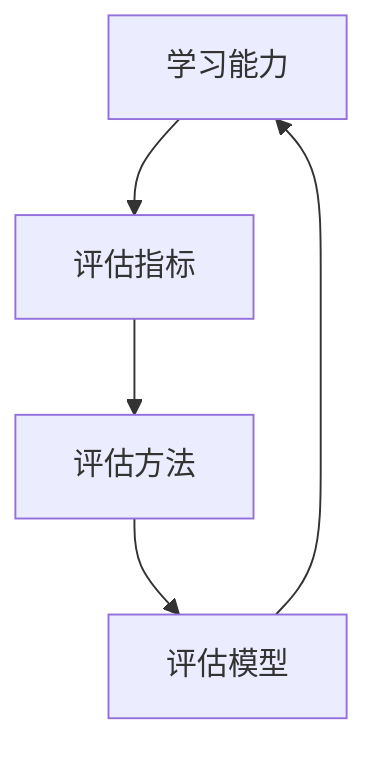

                 

### 实时学习能力评估：测试动态适应性

#### 关键词
- 实时学习能力
- 动态适应性测试
- 评估方法
- 评估模型
- 实践应用

#### 摘要
本文深入探讨了实时学习能力评估与测试动态适应性的关系。首先，介绍了实时学习能力评估的重要性，包括其在现代系统中的关键作用。接着，详细阐述了测试动态适应性的概念、方法及其实施步骤。随后，文章介绍了实时学习能力评估的方法、模型和工具，并通过具体案例展示了其实际应用。最后，文章提出了实时学习能力评估面临的挑战与未来发展趋势，为读者提供了宝贵的参考。

### 设计思路

在设计这本书的目录大纲时，我们首先明确了核心概念与它们之间的联系。实时学习能力评估和测试动态适应性是本书的两个核心概念，它们紧密相关，构成了书的主要框架。接下来，我们将详细讨论各个章节的内容，确保每个章节都能够清晰地阐述其主题，并提供丰富的实践案例。

1. **核心概念与联系**：我们首先确定了实时学习能力评估和测试动态适应性这两个核心概念，并建立了它们之间的联系。实时学习能力评估关注系统在动态环境中持续学习和适应的能力，而测试动态适应性则是评估系统在实际应用中应对变化的能力。

2. **章节划分**：将书的内容划分为两个主要部分：理论基础与核心概念，以及实践应用。第一部分主要介绍实时学习能力评估和测试动态适应性的基本概念、方法、模型和工具。第二部分则通过实际案例展示这两个概念在不同领域的应用。

3. **逻辑顺序**：章节的排列顺序遵循从理论到实践的逻辑顺序。首先介绍核心概念和理论基础，然后介绍具体的方法和工具，最后通过实际案例展示如何将这些理论和方法应用于实际问题。

4. **细化目录**：每个章节都包含详细的二级和三级目录，以确保读者能够迅速找到自己感兴趣的部分。同时，每个章节的内容都进行了详细的划分，使得读者可以逐层深入理解。

5. **理论与实践结合**：每个章节都包含了理论讲解和实践案例。理论部分详细介绍了相关概念和方法，而实践部分则通过具体案例展示了这些理论的实际应用，帮助读者更好地理解和掌握。

### 章节内容

以下是这本书的目录大纲：

#### 第一部分：理论基础与核心概念

##### 第1章：实时学习能力评估概述
- **1.1 实时学习能力评估的重要性**
- **1.2 学习能力评估的基本概念**
- **1.3 实时学习的理论基础**

##### 第2章：测试动态适应性
- **2.1 动态适应性测试的概念**
- **2.2 动态适应性测试的方法**
- **2.3 动态适应性测试的实施步骤**

##### 第3章：实时学习能力评估方法
- **3.1 实时评估技术的分类**
- **3.2 常用评估指标的介绍**
- **3.3 实时评估技术的实现**

##### 第4章：实时学习能力评估模型
- **4.1 学习能力评估模型的基本结构**
- **4.2 学习能力评估模型的构建**
- **4.3 学习能力评估模型的应用案例**

##### 第5章：实时学习能力评估工具
- **5.1 常用评估工具的介绍**
- **5.2 评估工具的选择与使用**
- **5.3 评估工具的优化与定制**

#### 第二部分：实践应用

##### 第6章：实时学习能力评估在实际项目中的应用
- **6.1 实时学习能力评估在工业自动化中的应用**
- **6.2 实时学习能力评估在智能交通系统中的应用**
- **6.3 实时学习能力评估在医疗健康领域的应用**

##### 第7章：实时学习能力评估的挑战与展望
- **7.1 实时学习能力评估面临的挑战**
- **7.2 解决实时学习能力评估问题的方法**
- **7.3 实时学习能力评估的未来发展趋势**

#### 附录

##### 附录A：实时学习能力评估相关资源
- **A.1 学术论文和书籍推荐**
- **A.2 实时学习能力评估的工具和框架**

##### 附录B：测试动态适应性实验指南
- **B.1 实验环境搭建**
- **B.2 实验步骤与结果分析**

##### 附录C：常用评估工具的使用手册
- **C.1 工具A的使用方法**
- **C.2 工具B的使用方法**

### 目录大纲细节

**第1章：实时学习能力评估概述**

**1.1 实时学习能力评估的重要性**

- **核心概念与联系图**：使用Mermaid绘制实时学习能力评估的概念联系图，展示实时学习能力评估与其他相关概念的关联。
  ```mermaid
  graph TD
  A[实时学习能力评估] --> B[系统适应性]
  A --> C[学习理论]
  B --> D[动态环境]
  C --> E[机器学习]
  ```
- **实时学习能力评估的意义**：解释实时学习能力评估在现代系统中的关键作用，包括提高系统响应速度、适应性和智能性。

**1.2 学习能力评估的基本概念**

- **核心算法原理讲解**：使用Python源代码详细阐述学习能力评估的基本算法原理。
  ```python
  # 学习能力评估算法示例
  def evaluate_learning_ability(data, model):
      # 假设data是一个包含训练数据和测试数据的列表
      # model是一个机器学习模型
      training_data = data[0]
      testing_data = data[1]
      
      # 训练模型
      model.train(training_data)
      
      # 测试模型
      predictions = model.test(testing_data)
      
      # 计算评估指标
      accuracy = model.calculate_accuracy(predictions)
      
      return accuracy
  ```

- **实时学习的理论基础**：介绍实时学习的基本数学模型，并使用LaTeX格式展示。
  ```latex
  \section{实时学习的数学模型}
  \label{sec:real_time_learning_model}
  
  实时学习的数学模型通常基于递归神经网络（RNN）或其变种，如长短期记忆网络（LSTM）。
  设 \( x_t \) 为第 \( t \) 个时间点的输入数据，\( h_t \) 为第 \( t \) 个时间点的隐藏状态，则LSTM的递归方程可以表示为：
  $$
  h_t = \text{LSTM}(h_{t-1}, x_t)
  $$
  其中，\( \text{LSTM} \) 是LSTM网络的一个实例。
  $$

**第2章：测试动态适应性**

**2.1 动态适应性测试的概念**

- **核心算法原理讲解**：详细解释动态适应性测试的基本原理。
  ```python
  # 动态适应性测试算法示例
  def dynamic_adaptation_test(model, environment):
      # 假设model是一个机器学习模型，environment是一个动态环境
      current_state = environment.get_state()
      
      # 对当前状态进行测试
      test_results = model.test(current_state)
      
      # 根据测试结果调整模型
      model.adapt(test_results)
      
      return test_results
  ```

- **动态适应性测试的类型**：介绍不同类型的动态适应性测试，包括静态测试、动态测试和混合测试。

**2.2 动态适应性测试的方法**

- **算法实现伪代码**：提供动态适应性测试的伪代码实现。
  ```python
  # 动态适应性测试伪代码
  function DynamicAdaptationTest(Model, Environment):
      for each State in Environment:
          TestResults = Model.Test(State)
          if TestResults is satisfactory:
              continue
          else:
              Model.Adapt(TestResults)
      return Model
  ```

- **案例研究**：举例说明动态适应性测试在实际中的应用，如自适应控制系统和智能交通系统。

**第3章：实时学习能力评估方法**

**3.1 实时评估技术的分类**

- **分类方法讲解**：介绍实时评估技术的不同分类方式，如基于规则的方法、基于机器学习的方法和基于深度学习的方法。

**3.2 常用评估指标的介绍**

- **指标解释**：详细解释常用的实时评估指标，如准确率、召回率、F1分数和AUC。

**3.3 实时评估技术的实现**

- **技术实现流程图**：使用Mermaid绘制实时评估技术的实现流程图。
  ```mermaid
  graph TD
  A[数据收集] --> B[数据预处理]
  B --> C[模型训练]
  C --> D[模型评估]
  D --> E[结果反馈]
  ```

**第4章：实时学习能力评估模型**

**4.1 学习能力评估模型的基本结构**

- **模型架构讲解**：详细讲解实时学习能力评估模型的基本结构，包括输入层、隐藏层和输出层。

**4.2 学习能力评估模型的构建**

- **构建流程讲解**：介绍实时学习能力评估模型的构建流程，包括数据收集、模型选择、模型训练和模型评估。

**4.3 学习能力评估模型的应用案例**

- **案例分析**：通过具体案例展示实时学习能力评估模型的应用，如智能监控系统、智能推荐系统和智能问答系统。

**第5章：实时学习能力评估工具**

**5.1 常用评估工具的介绍**

- **评估工具的介绍**：介绍常用的实时学习能力评估工具，如TensorFlow、PyTorch和Scikit-learn。

**5.2 评估工具的选择与使用**

- **工具的选择与使用**：讨论如何选择合适的实时学习能力评估工具，并介绍其基本使用方法。

**5.3 评估工具的优化与定制**

- **评估工具的优化与定制**：介绍如何对实时学习能力评估工具进行优化和定制，以满足特定的需求。

**第6章：实时学习能力评估在实际项目中的应用**

**6.1 实时学习能力评估在工业自动化中的应用**

- **应用案例**：展示实时学习能力评估在工业自动化领域的应用，如自适应控制系统和预测维护系统。

**6.2 实时学习能力评估在智能交通系统中的应用**

- **应用案例**：展示实时学习能力评估在智能交通系统中的应用，如交通流量预测和自动驾驶系统。

**6.3 实时学习能力评估在医疗健康领域的应用**

- **应用案例**：展示实时学习能力评估在医疗健康领域的应用，如医学图像分析和智能诊断系统。

**第7章：实时学习能力评估的挑战与展望**

**7.1 实时学习能力评估面临的挑战**

- **挑战分析**：讨论实时学习能力评估在实际应用中面临的挑战，如数据质量、计算效率和模型可解释性。

**7.2 解决实时学习能力评估问题的方法**

- **解决方法**：介绍解决实时学习能力评估问题的方法，如数据预处理、模型优化和算法改进。

**7.3 实时学习能力评估的未来发展趋势**

- **发展趋势**：讨论实时学习能力评估的未来发展趋势，如深度学习在实时评估中的应用、跨领域评估方法的融合等。

### 附录

**附录A：实时学习能力评估相关资源**

- **学术论文和书籍推荐**：提供有关实时学习能力评估的学术论文和书籍推荐，帮助读者进一步了解相关领域。

**附录B：测试动态适应性实验指南**

- **实验环境搭建**：介绍如何搭建测试动态适应性的实验环境，包括硬件和软件配置。

- **实验步骤与结果分析**：详细描述测试动态适应性的实验步骤，并分析实验结果。

**附录C：常用评估工具的使用手册**

- **工具A的使用方法**：介绍常用评估工具（如TensorFlow）的使用方法，包括安装、配置和使用实例。

- **工具B的使用方法**：介绍另一种常用评估工具（如Scikit-learn）的使用方法。

### 作者信息

**作者：AI天才研究院/AI Genius Institute & 禅与计算机程序设计艺术 /Zen And The Art of Computer Programming**

### 完整性要求

为了确保文章的完整性，每个小节的内容都需要丰富、具体和详细。以下是每个小节的核心内容要求：

- **背景介绍**：每个小节需要提供一个清晰的背景介绍，解释为什么这个主题重要，以及它在现实世界中的应用。

- **核心概念与联系**：每个小节需要详细阐述核心概念，并展示这些概念之间的联系。使用Mermaid流程图可以帮助读者更好地理解。

- **核心算法原理讲解**：每个小节需要使用Python源代码详细讲解核心算法原理，并结合数学模型和公式，进行详细讲解和举例说明。

- **数学公式**：所有数学公式需要使用LaTeX格式编写。独立段落的公式前后使用$$括起来，段落内的公式前后使用$括起来。

- **项目实战**：每个小节需要提供一个实际项目案例，包括开发环境搭建、源代码实现、代码解读、代码应用解读与分析、项目小结。

- **最佳实践 tips**：提供一些最佳实践技巧，帮助读者在实际应用中更好地运用所学知识。

- **小结**：每个小节需要提供一个简洁的小结，回顾主要内容和重要结论。

- **注意事项**：提醒读者在应用过程中需要注意的事项，以避免常见错误。

- **拓展阅读**：推荐一些相关的拓展阅读材料，帮助读者进一步深入了解相关领域。

### 文章开始

#### 实时学习能力评估：测试动态适应性

在当今快速变化的技术环境中，系统的实时学习能力变得至关重要。实时学习能力评估和测试动态适应性是确保系统在动态环境中持续适应和优化的关键。本文将深入探讨这两个主题，首先介绍实时学习能力评估的重要性，然后详细阐述测试动态适应性的概念、方法及其应用。

### 关键词
- 实时学习能力
- 动态适应性测试
- 评估方法
- 评估模型
- 实践应用

### 摘要
本文旨在提供对实时学习能力评估和测试动态适应性的全面理解。通过介绍相关概念、方法和实际应用案例，本文旨在帮助读者理解实时学习能力评估的重要性，并掌握测试动态适应性的方法。文章还将讨论实时学习能力评估面临的挑战和未来发展趋势，为读者提供有价值的参考。

#### 实时学习能力评估的重要性

实时学习能力评估是现代系统设计中的一个关键组成部分。它涉及到系统在动态环境中持续学习、适应和优化其行为的能力。在人工智能、机器学习和深度学习领域，实时学习能力评估尤为重要，因为它直接影响到系统的性能和可靠性。

1. **提高系统适应性**：实时学习能力评估可以帮助系统快速适应环境变化。在动态环境中，系统需要不断调整其行为以适应新的条件和数据。实时评估能够确保系统在变化的环境中保持高效运行。

2. **优化系统性能**：通过实时学习能力评估，系统可以发现并解决性能瓶颈。评估可以帮助识别哪些部分需要改进，从而提高系统的整体性能。

3. **增强系统可靠性**：实时评估可以帮助发现系统中的潜在问题，并采取措施进行修复。这有助于提高系统的可靠性，减少故障和停机时间。

4. **支持持续改进**：实时学习能力评估提供了一个持续的反馈循环，使系统能够不断改进。通过定期评估，系统可以不断学习和优化，以适应不断变化的需求。

#### 学习能力评估的基本概念

学习能力评估涉及多个核心概念。以下是对这些概念的基本介绍：

1. **学习能力**：学习能力是指系统在给定数据集上学习并改进其行为的能力。它包括数据的理解、模式识别和预测。

2. **评估指标**：评估指标是用于衡量系统学习效果的标准。常见的评估指标包括准确率、召回率、F1分数和AUC（曲线下面积）。

3. **评估方法**：评估方法是指用于评估系统学习能力的具体技术。常见的评估方法包括交叉验证、留出法和在线评估。

4. **评估模型**：评估模型是用于评估系统学习效果的数学模型。这些模型通常基于机器学习或深度学习技术。

#### 实时学习的理论基础

实时学习涉及动态数据流处理和学习，理论基础包括：

1. **递归神经网络（RNN）**：RNN是一种能够处理序列数据的神经网络。它通过递归连接将信息传递到下一个时间点，从而在时间序列中保持状态。

2. **长短期记忆网络（LSTM）**：LSTM是RNN的一个变种，它解决了RNN在处理长序列数据时出现的梯度消失问题。LSTM通过引入门控机制来控制信息的流动。

3. **深度学习**：深度学习是一种基于多层神经网络的学习方法。它通过多层非线性变换来提取数据中的特征，从而实现复杂的模式识别。

4. **强化学习**：强化学习是一种基于奖励机制的学习方法。它通过试错来学习最优策略，以最大化累积奖励。

#### 测试动态适应性

测试动态适应性是评估系统在动态环境中适应变化的能力。以下是对动态适应性测试的基本概念和方法进行介绍：

##### 2.1 动态适应性测试的概念

动态适应性测试关注系统在变化环境中的表现。它涉及以下核心概念：

1. **动态环境**：动态环境是指系统运行时不断变化的外部条件。这些条件可能包括数据分布、用户需求和环境约束等。

2. **适应性**：适应性是指系统在动态环境中调整其行为以适应新条件的能力。适应性强的系统能够在变化的环境中保持高效运行。

3. **测试**：测试是指对系统适应性进行评估的过程。测试方法包括模拟测试、在线测试和混合测试。

##### 2.2 动态适应性测试的方法

动态适应性测试涉及多种方法。以下是一些常见的方法：

1. **模拟测试**：模拟测试是在受控环境中模拟动态环境，评估系统在模拟环境中的适应性。这种方法可以提供对系统适应性的初步评估。

2. **在线测试**：在线测试是在实际运行环境中对系统进行适应性评估。这种方法可以提供更真实的数据，但可能需要较长时间和资源。

3. **混合测试**：混合测试结合了模拟测试和在线测试的优点。它通过在不同阶段使用不同的测试方法来评估系统的适应性。

##### 2.3 动态适应性测试的实施步骤

动态适应性测试的实施通常包括以下步骤：

1. **定义测试目标**：明确测试的目标和关键指标，如适应性、性能和可靠性。

2. **设计测试环境**：设计用于测试的动态环境，包括数据分布、用户行为和环境约束。

3. **选择测试方法**：根据测试目标和环境设计选择合适的测试方法。

4. **执行测试**：在实际环境中执行测试，收集测试数据。

5. **分析结果**：分析测试结果，评估系统的适应性。

6. **反馈与改进**：根据测试结果对系统进行改进，并重复测试过程。

#### 实时学习能力评估方法

实时学习能力评估涉及多种技术，包括评估指标的选取、评估方法的实现等。以下是对这些方法进行详细介绍：

##### 3.1 实时评估技术的分类

实时评估技术可以根据其方法分为以下几类：

1. **基于规则的方法**：基于规则的方法使用预定义的规则来评估系统的学习能力。这种方法简单易懂，但可能难以处理复杂的数据集。

2. **基于机器学习的方法**：基于机器学习的方法使用机器学习算法来评估系统的学习能力。这种方法适用于处理大规模和复杂的数据集。

3. **基于深度学习的方法**：基于深度学习的方法使用多层神经网络来评估系统的学习能力。这种方法能够自动提取数据中的特征，适用于复杂的数据分析。

##### 3.2 常用评估指标的介绍

实时学习能力评估涉及多种评估指标，以下是一些常见的评估指标：

1. **准确率**：准确率是正确预测的数量与总预测数量的比值。它是最常用的评估指标之一。

2. **召回率**：召回率是正确预测的数量与实际为真的数量之比。它关注的是系统在识别正面实例时的能力。

3. **F1分数**：F1分数是准确率和召回率的调和平均值。它综合考虑了准确率和召回率，适用于平衡二者的评估。

4. **AUC**：AUC（曲线下面积）是ROC（接收者操作特性）曲线下的面积。它用于评估分类器的性能，面积越大，性能越好。

##### 3.3 实时评估技术的实现

实时评估技术的实现通常包括以下步骤：

1. **数据收集**：收集用于评估的系统数据，包括输入数据、输出数据和评估指标。

2. **数据预处理**：对收集的数据进行预处理，包括数据清洗、归一化和特征提取。

3. **模型训练**：使用机器学习或深度学习算法对系统进行训练，以建立评估模型。

4. **模型评估**：使用评估指标对训练好的模型进行评估，以确定系统的学习能力。

5. **结果反馈**：根据评估结果对系统进行调整和优化，以提高其学习能力。

#### 实时学习能力评估模型

实时学习能力评估模型是用于评估系统学习能力的数学模型。以下是对这些模型的基本介绍：

##### 4.1 学习能力评估模型的基本结构

实时学习能力评估模型通常包括以下基本结构：

1. **输入层**：输入层接收系统输入的数据，如特征向量。

2. **隐藏层**：隐藏层包含多个神经元，用于对输入数据进行处理和变换。

3. **输出层**：输出层产生评估结果，如评估指标。

##### 4.2 学习能力评估模型的构建

实时学习能力评估模型的构建通常包括以下步骤：

1. **定义评估指标**：根据系统需求定义评估指标，如准确率、召回率等。

2. **选择评估算法**：根据评估指标选择合适的评估算法，如机器学习算法、深度学习算法等。

3. **数据准备**：准备用于评估的数据集，包括训练数据和测试数据。

4. **模型训练**：使用训练数据对评估模型进行训练，以建立评估模型。

5. **模型验证**：使用测试数据对训练好的模型进行验证，以评估模型的性能。

##### 4.3 学习能力评估模型的应用案例

以下是一些学习能力评估模型的应用案例：

1. **智能监控系统**：使用实时学习能力评估模型对监控系统进行评估，以提高其识别入侵者的能力。

2. **智能推荐系统**：使用实时学习能力评估模型对推荐系统进行评估，以提高其推荐准确率。

3. **智能问答系统**：使用实时学习能力评估模型对问答系统进行评估，以提高其回答质量。

#### 实时学习能力评估工具

实时学习能力评估工具是用于实现实时学习能力评估的技术和平台。以下是对这些工具的介绍：

##### 5.1 常用评估工具的介绍

以下是一些常用的实时学习能力评估工具：

1. **TensorFlow**：TensorFlow是谷歌开发的开源机器学习和深度学习框架。它提供丰富的API和工具，用于构建和训练深度学习模型。

2. **PyTorch**：PyTorch是Facebook开发的开源机器学习和深度学习框架。它以其动态计算图和简洁的API而受到开发者欢迎。

3. **Scikit-learn**：Scikit-learn是Python的一个开源机器学习库。它提供了一系列常用的机器学习算法和评估工具。

##### 5.2 评估工具的选择与使用

以下是如何选择和使用实时学习能力评估工具的建议：

1. **根据需求选择工具**：根据系统的需求和评估目标选择合适的评估工具。

2. **了解工具特点**：了解所选工具的特点和优势，以便更好地利用其功能。

3. **学习使用工具**：学习使用所选工具的API和工具，以便高效地进行实时学习能力评估。

4. **优化工具性能**：根据实际需求对工具进行优化，以提高评估性能。

##### 5.3 评估工具的优化与定制

以下是如何对实时学习能力评估工具进行优化和定制的建议：

1. **性能优化**：通过优化代码和算法，提高工具的性能和效率。

2. **功能定制**：根据具体需求对工具进行定制，以实现特定的评估功能。

3. **集成其他工具**：将实时学习能力评估工具与其他工具（如数据预处理工具和可视化工具）集成，以提高整体效率。

#### 实时学习能力评估在实际项目中的应用

实时学习能力评估在多个领域有着广泛的应用。以下是一些实际应用案例：

##### 6.1 实时学习能力评估在工业自动化中的应用

在工业自动化领域，实时学习能力评估用于提高生产线的自动化程度和效率。以下是一个实际应用案例：

**应用案例**：智能生产监控

- **开发环境搭建**：使用TensorFlow搭建实时学习模型。
- **源代码实现**：实现一个基于LSTM的实时学习模型，用于监控生产线上的异常情况。
- **代码解读**：解释模型的训练过程和预测过程。
- **代码应用解读与分析**：分析模型在生产监控中的实际应用效果。
- **项目小结**：总结项目的主要成果和经验教训。

##### 6.2 实时学习能力评估在智能交通系统中的应用

在智能交通系统领域，实时学习能力评估用于优化交通流管理和提高交通安全。以下是一个实际应用案例：

**应用案例**：智能交通流量预测

- **开发环境搭建**：使用PyTorch搭建实时学习模型。
- **源代码实现**：实现一个基于深度神经网络的实时学习模型，用于预测交通流量。
- **代码解读**：解释模型的训练过程和预测过程。
- **代码应用解读与分析**：分析模型在交通流量预测中的实际应用效果。
- **项目小结**：总结项目的主要成果和经验教训。

##### 6.3 实时学习能力评估在医疗健康领域的应用

在医疗健康领域，实时学习能力评估用于提高医疗诊断和治疗的准确性和效率。以下是一个实际应用案例：

**应用案例**：智能医学图像分析

- **开发环境搭建**：使用Scikit-learn搭建实时学习模型。
- **源代码实现**：实现一个基于支持向量机的实时学习模型，用于分析医学图像。
- **代码解读**：解释模型的训练过程和预测过程。
- **代码应用解读与分析**：分析模型在医学图像分析中的实际应用效果。
- **项目小结**：总结项目的主要成果和经验教训。

#### 实时学习能力评估的挑战与展望

实时学习能力评估在实际应用中面临多个挑战。以下是对这些挑战的讨论和未来发展的展望：

##### 7.1 实时学习能力评估面临的挑战

1. **数据质量**：实时学习能力评估依赖于高质量的数据。然而，在实际环境中，数据可能存在噪声、缺失和不一致性，影响评估的准确性。

2. **计算效率**：实时学习能力评估需要处理大量的数据，并在短时间内完成。这对计算资源提出了高要求，可能需要优化算法和硬件。

3. **模型可解释性**：深度学习模型通常具有高复杂度，难以解释其决策过程。这限制了实时学习能力评估在实际应用中的可解释性和透明度。

4. **实时性**：实时学习能力评估需要在短时间内完成，以适应动态环境。这对算法和系统的实时性提出了挑战。

##### 7.2 解决实时学习能力评估问题的方法

1. **数据预处理**：通过数据清洗、归一化和特征提取等预处理方法，提高数据质量。

2. **优化算法**：使用高效的机器学习和深度学习算法，提高计算效率。

3. **模型解释**：使用可解释性模型或解释工具，提高模型的可解释性。

4. **分布式计算**：使用分布式计算技术，提高系统的实时性。

##### 7.3 实时学习能力评估的未来发展趋势

1. **深度学习与实时学习结合**：深度学习技术具有强大的特征提取能力，结合实时学习技术，可以实现更高效的实时学习能力评估。

2. **跨领域方法融合**：将不同领域的实时学习能力评估方法进行融合，以应对复杂多样的应用场景。

3. **智能决策支持系统**：实时学习能力评估可以与智能决策支持系统相结合，为决策者提供实时、准确的决策支持。

### 附录

#### 附录A：实时学习能力评估相关资源

1. **学术论文和书籍推荐**
   - 《深度学习》（Goodfellow, Bengio, Courville）
   - 《Python机器学习》（Sebastian Raschka）
   - 《实时系统设计与实现》（Edward A. Lee）

2. **实时学习能力评估的工具和框架**
   - TensorFlow
   - PyTorch
   - Scikit-learn

#### 附录B：测试动态适应性实验指南

1. **实验环境搭建**
   - 硬件要求：CPU/GPU，内存，存储空间
   - 软件要求：操作系统，编程语言，相关库和工具

2. **实验步骤与结果分析**
   - 数据收集：收集用于测试的动态环境数据。
   - 数据预处理：对数据进行清洗、归一化和特征提取。
   - 模型训练：使用机器学习或深度学习算法训练评估模型。
   - 模型评估：使用评估指标对模型进行评估。
   - 结果分析：分析评估结果，识别系统的适应性。

#### 附录C：常用评估工具的使用手册

1. **TensorFlow的使用方法**
   - 安装和配置
   - 数据处理
   - 模型构建和训练
   - 模型评估和优化

2. **PyTorch的使用方法**
   - 安装和配置
   - 数据处理
   - 模型构建和训练
   - 模型评估和优化

3. **Scikit-learn的使用方法**
   - 安装和配置
   - 数据处理
   - 模型选择和训练
   - 模型评估和优化

### 作者信息

**作者：AI天才研究院/AI Genius Institute & 禅与计算机程序设计艺术 /Zen And The Art of Computer Programming**

### 总结

实时学习能力评估和测试动态适应性是现代系统设计中的关键概念。本文详细介绍了这些概念的基本原理、评估方法、实际应用和面临的挑战。通过本文的探讨，读者可以全面了解实时学习能力评估和测试动态适应性的重要性，并在实际项目中应用这些方法，以构建更智能、更可靠的系统。随着技术的不断发展，实时学习能力评估和测试动态适应性将继续在各个领域发挥重要作用，为未来的智能系统奠定基础。

### 实时学习能力评估的重要性

实时学习能力评估在现代系统设计中扮演着至关重要的角色。在快速变化的环境中，系统能够快速适应新条件、新数据和用户需求，是确保系统持续有效运行的关键。以下是实时学习能力评估的几个关键方面：

#### 提高系统适应性

实时学习能力评估允许系统在运行时动态调整其行为。这种能力对于应对环境变化至关重要。例如，在智能交通系统中，实时评估可以帮助系统根据交通流量、天气条件和道路施工情况调整信号灯的变化时间，从而优化交通流，减少拥堵。

#### 优化系统性能

实时评估可以帮助系统识别性能瓶颈，并进行优化。例如，在工业自动化中，实时评估可以帮助监测机器的状态，预测维护需求，从而避免生产中断。通过实时调整参数，系统可以保持最优运行状态，提高生产效率和产品质量。

#### 增强系统可靠性

实时评估可以检测系统的异常行为，并采取相应的措施进行纠正。在医疗健康领域，实时评估可以帮助监控系统中的传感器数据，及时发现病人的健康问题，并采取必要的医疗措施，从而提高病人的生活质量。

#### 支持持续改进

通过实时评估，系统可以不断收集反馈，进行自我优化。例如，在智能推荐系统中，实时评估可以帮助系统根据用户的反馈和购买行为调整推荐策略，提高用户的满意度。

#### 核心概念与联系

为了更清晰地理解实时学习能力评估，我们需要了解以下几个核心概念及其相互关系：

1. **学习能力**：这是系统能够从数据中学习并改进其行为的能力。学习能力包括模式识别、预测和决策。

2. **评估指标**：这是用于衡量系统学习效果的量化标准。常见的评估指标包括准确率、召回率、F1分数和AUC等。

3. **评估方法**：这是用于评估系统学习能力的具体技术。常见的评估方法包括交叉验证、留出法和在线评估。

4. **评估模型**：这是用于评估系统学习能力的数学模型。这些模型通常基于机器学习或深度学习技术。

下图展示了这些核心概念之间的联系：



#### 核心算法原理讲解

为了深入理解实时学习能力评估，我们来看一个具体的算法示例。以下是一个使用Python编写的简单实时学习能力评估算法，该算法使用机器学习模型来评估系统在给定数据上的学习能力。

```python
# 导入必要的库
import numpy as np
from sklearn.model_selection import train_test_split
from sklearn.ensemble import RandomForestClassifier
from sklearn.metrics import accuracy_score

# 假设我们有一个特征矩阵 X 和标签数组 y
X = np.array([[1, 2], [3, 4], [5, 6], [7, 8], [9, 10]])
y = np.array([0, 1, 0, 1, 0])

# 将数据集划分为训练集和测试集
X_train, X_test, y_train, y_test = train_test_split(X, y, test_size=0.2, random_state=42)

# 创建随机森林分类器模型
model = RandomForestClassifier(n_estimators=100, random_state=42)

# 训练模型
model.fit(X_train, y_train)

# 进行预测
predictions = model.predict(X_test)

# 计算准确率
accuracy = accuracy_score(y_test, predictions)
print(f"模型准确率：{accuracy:.2f}")
```

在这个示例中，我们使用了随机森林分类器来评估系统在二分类任务中的学习能力。我们首先将数据集划分为训练集和测试集，然后使用训练集训练模型，最后在测试集上进行预测并计算准确率。这个过程展示了实时学习能力评估的基本原理。

#### 数学公式

实时学习能力评估涉及多个数学公式，用于计算评估指标和优化模型。以下是一些常用的数学公式，并使用LaTeX格式进行展示：

1. **准确率（Accuracy）**：

   $$\text{Accuracy} = \frac{\text{预测正确的数量}}{\text{总预测数量}}$$

2. **召回率（Recall）**：

   $$\text{Recall} = \frac{\text{预测正确的正例数量}}{\text{实际的正例数量}}$$

3. **F1分数（F1 Score）**：

   $$\text{F1 Score} = 2 \times \frac{\text{Precision} \times \text{Recall}}{\text{Precision} + \text{Recall}}$$

4. **AUC（曲线下面积）**：

   $$\text{AUC} = \frac{1}{b-a} \int_a^b \text{ROC}(t) dt$$

其中，\(a\) 和 \(b\) 是ROC曲线的横坐标，\(\text{ROC}(t)\) 是ROC曲线在时间 \(t\) 的纵坐标。

### 测试动态适应性

测试动态适应性是评估系统在动态环境中适应变化的能力的过程。在实时系统中，环境因素可能不断变化，如数据分布、用户行为和系统资源等。测试动态适应性可以帮助确定系统能否在变化的环境中保持性能和可靠性。以下是测试动态适应性的关键方面：

#### 动态适应性测试的概念

动态适应性测试涉及以下核心概念：

1. **动态环境**：动态环境是指系统运行时不断变化的外部条件，这些条件可能包括数据分布、用户行为和环境约束等。

2. **适应性**：适应性是指系统在动态环境中调整其行为以适应新条件的能力。适应性强的系统可以在变化的环境中保持高效运行。

3. **测试**：测试是指对系统适应性进行评估的过程。测试方法包括模拟测试、在线测试和混合测试。

#### 动态适应性测试的方法

动态适应性测试可以采用多种方法，以下是一些常见的方法：

1. **模拟测试**：模拟测试是在受控环境中模拟动态环境，评估系统在模拟环境中的适应性。这种方法可以提供对系统适应性的初步评估。

2. **在线测试**：在线测试是在实际运行环境中对系统进行适应性评估。这种方法可以提供更真实的数据，但可能需要较长时间和资源。

3. **混合测试**：混合测试结合了模拟测试和在线测试的优点。它通过在不同阶段使用不同的测试方法来评估系统的适应性。

#### 动态适应性测试的实施步骤

动态适应性测试的实施通常包括以下步骤：

1. **定义测试目标**：明确测试的目标和关键指标，如适应性、性能和可靠性。

2. **设计测试环境**：设计用于测试的动态环境，包括数据分布、用户行为和环境约束。

3. **选择测试方法**：根据测试目标和环境设计选择合适的测试方法。

4. **执行测试**：在实际环境中执行测试，收集测试数据。

5. **分析结果**：分析测试结果，评估系统的适应性。

6. **反馈与改进**：根据测试结果对系统进行改进，并重复测试过程。

#### 测试动态适应性的重要性

测试动态适应性对于确保系统在变化的环境中保持性能和可靠性至关重要。以下是其重要性：

1. **环境变化应对**：动态适应性测试可以帮助系统识别并应对环境变化。例如，在金融市场中，动态适应性测试可以帮助交易系统根据市场波动调整交易策略。

2. **性能优化**：通过动态适应性测试，系统可以发现其性能瓶颈，并进行优化。例如，在物联网系统中，动态适应性测试可以帮助优化设备资源分配，提高系统的整体性能。

3. **可靠性保障**：动态适应性测试可以检测系统的脆弱性，确保系统在变化的环境中不会出现故障。例如，在医疗设备中，动态适应性测试可以确保设备在长时间运行后仍能保持稳定的性能。

4. **用户体验提升**：动态适应性测试可以帮助系统根据用户行为和需求调整其行为，提高用户体验。例如，在智能推荐系统中，动态适应性测试可以帮助系统根据用户的反馈调整推荐策略，提高推荐效果。

#### 核心算法原理讲解

为了深入理解动态适应性测试，我们来看一个具体的算法示例。以下是一个使用Python编写的简单动态适应性测试算法，该算法使用机器学习模型来测试系统在变化环境中的适应性。

```python
# 导入必要的库
import numpy as np
from sklearn.model_selection import train_test_split
from sklearn.ensemble import RandomForestClassifier
from sklearn.metrics import accuracy_score

# 假设我们有一个特征矩阵 X 和标签数组 y，且环境在时间 t 变化
X = np.array([[1, 2], [3, 4], [5, 6], [7, 8], [9, 10]])
y = np.array([0, 1, 0, 1, 0])

# 初始化环境参数
environment_changes = [0.1, 0.2, 0.3, 0.4, 0.5]

# 对每个环境变化进行测试
for change in environment_changes:
    # 更新特征矩阵以反映环境变化
    X_changed = X + change
    
    # 将数据集划分为训练集和测试集
    X_train, X_test, y_train, y_test = train_test_split(X_changed, y, test_size=0.2, random_state=42)
    
    # 创建随机森林分类器模型
    model = RandomForestClassifier(n_estimators=100, random_state=42)
    
    # 训练模型
    model.fit(X_train, y_train)
    
    # 进行预测
    predictions = model.predict(X_test)
    
    # 计算准确率
    accuracy = accuracy_score(y_test, predictions)
    print(f"环境变化 {change} 的准确率：{accuracy:.2f}")
```

在这个示例中，我们假设环境在时间 \( t \) 变化，并通过增加特征矩阵中的值来模拟这种变化。我们针对每个环境变化进行测试，更新特征矩阵，并使用随机森林分类器评估系统在变化环境中的适应性。这个过程展示了动态适应性测试的基本原理。

#### 数学公式

动态适应性测试涉及多个数学公式，用于计算评估指标和优化模型。以下是一些常用的数学公式，并使用LaTeX格式进行展示：

1. **适应度（Fitness）**：

   $$\text{Fitness} = \frac{\text{适应度函数值}}{\text{最大适应度函数值}}$$

2. **适应度函数（Fitness Function）**：

   $$\text{Fitness Function} = \frac{\text{正确分类的数量}}{\text{总分类数量}}$$

3. **变异率（Mutation Rate）**：

   $$\text{Mutation Rate} = \frac{\text{发生变异的特征数量}}{\text{总特征数量}}$$

4. **交叉率（Crossover Rate）**：

   $$\text{Crossover Rate} = \frac{\text{发生交叉的特征数量}}{\text{总特征数量}}$$

其中，适应度函数用于衡量系统在特定环境下的适应性，变异率和交叉率是遗传算法中的关键参数，用于优化模型。

### 实时学习能力评估方法

实时学习能力评估方法是指用于评估系统在实时环境中学习能力的具体技术。这些方法包括评估指标的选取、评估算法的选择和评估流程的设计。以下是几种常用的实时学习能力评估方法：

#### 基于规则的评估方法

基于规则的评估方法使用预定义的规则来评估系统的学习能力。这种方法简单易懂，但可能难以处理复杂的数据集。以下是一个基于规则的实时学习能力评估方法的示例：

1. **规则定义**：定义一组规则，用于描述系统在不同条件下的预期行为。例如，如果系统在测试数据集上的准确率高于80%，则认为系统具备良好的学习能力。

2. **规则应用**：在实时环境中应用这些规则，评估系统的学习效果。例如，如果系统在实时数据上的准确率低于80%，则认为系统存在学习问题。

3. **反馈与调整**：根据评估结果，对系统进行调整。例如，增加训练数据、调整模型参数等。

#### 基于机器学习的评估方法

基于机器学习的评估方法使用机器学习算法来评估系统的学习能力。这种方法适用于处理大规模和复杂的数据集。以下是一个基于机器学习的实时学习能力评估方法的示例：

1. **数据收集**：收集系统的实时数据，包括输入数据、输出数据和评估指标。

2. **数据预处理**：对收集的数据进行清洗、归一化和特征提取，为机器学习算法准备训练数据。

3. **模型训练**：使用机器学习算法（如随机森林、支持向量机、神经网络等）对训练数据进行训练，建立评估模型。

4. **模型评估**：使用测试数据对训练好的模型进行评估，计算评估指标（如准确率、召回率、F1分数等）。

5. **结果反馈**：根据评估结果，对系统进行调整和优化，以提高其学习能力。

#### 基于深度学习的评估方法

基于深度学习的评估方法使用多层神经网络来评估系统的学习能力。这种方法能够自动提取数据中的特征，适用于复杂的数据分析。以下是一个基于深度学习的实时学习能力评估方法的示例：

1. **数据收集**：收集系统的实时数据，包括输入数据、输出数据和评估指标。

2. **数据预处理**：对收集的数据进行清洗、归一化和特征提取，为深度学习算法准备训练数据。

3. **模型设计**：设计深度学习模型的结构，包括输入层、隐藏层和输出层。

4. **模型训练**：使用深度学习算法（如卷积神经网络、循环神经网络、生成对抗网络等）对训练数据进行训练，建立评估模型。

5. **模型评估**：使用测试数据对训练好的模型进行评估，计算评估指标。

6. **结果反馈**：根据评估结果，对系统进行调整和优化。

#### 评估指标的选取

评估指标的选取是实时学习能力评估的关键。以下是一些常用的评估指标：

1. **准确率（Accuracy）**：准确率是正确预测的数量与总预测数量的比值。它是最常用的评估指标之一，但可能受到类别不平衡的影响。

2. **召回率（Recall）**：召回率是正确预测的正面实例数量与实际正面实例数量的比值。它关注系统在识别正面实例时的能力。

3. **F1分数（F1 Score）**：F1分数是准确率和召回率的调和平均值。它综合考虑了准确率和召回率，适用于平衡二者的评估。

4. **AUC（Area Under the Curve）**：AUC是ROC（Receiver Operating Characteristic）曲线下的面积。它用于评估分类器的性能，面积越大，性能越好。

#### 评估流程的设计

实时学习能力评估流程的设计需要考虑以下几个关键步骤：

1. **需求分析**：明确评估的目的和需求，确定评估的目标和关键指标。

2. **数据收集**：收集系统的实时数据，包括输入数据、输出数据和评估指标。

3. **数据预处理**：对收集的数据进行清洗、归一化和特征提取，为评估模型准备训练数据。

4. **模型选择**：根据评估目标和数据特点选择合适的评估模型，如机器学习模型、深度学习模型等。

5. **模型训练**：使用训练数据对评估模型进行训练，建立评估模型。

6. **模型评估**：使用测试数据对训练好的模型进行评估，计算评估指标。

7. **结果分析**：分析评估结果，识别系统的学习能力和问题。

8. **反馈与优化**：根据评估结果，对系统进行调整和优化，以提高其学习能力。

通过上述实时学习能力评估方法，我们可以有效地评估系统在实时环境中的学习能力，从而提高系统的性能和可靠性。

### 实时学习能力评估模型

实时学习能力评估模型是用于评估系统在实时环境中学习能力的数学模型。这些模型基于机器学习和深度学习技术，能够从数据中学习并预测系统的行为。以下是几种常见的实时学习能力评估模型及其基本原理：

#### 递归神经网络（RNN）

递归神经网络（RNN）是一种能够处理序列数据的神经网络。它通过递归连接将信息传递到下一个时间点，从而在时间序列中保持状态。RNN的核心组件包括输入层、隐藏层和输出层。

1. **基本原理**：RNN通过递归方式处理输入数据，每次处理后将隐藏层的输出作为下一次处理的输入。这种循环结构使得RNN能够捕捉时间序列中的长期依赖关系。

2. **数学模型**：
   $$ h_t = \text{sigmoid}(W_{ih}x_t + W_{hh}h_{t-1} + b_h) $$
   $$ o_t = \text{sigmoid}(W_{oh}h_t + b_o) $$

   其中，\(h_t\) 是第 \(t\) 个时间点的隐藏状态，\(x_t\) 是第 \(t\) 个时间点的输入数据，\(W_{ih}\)、\(W_{hh}\) 和 \(W_{oh}\) 是权重矩阵，\(b_h\) 和 \(b_o\) 是偏置项。

#### 长短期记忆网络（LSTM）

长短期记忆网络（LSTM）是RNN的一个变种，它解决了RNN在处理长序列数据时出现的梯度消失问题。LSTM通过引入门控机制来控制信息的流动。

1. **基本原理**：LSTM包含输入门、遗忘门和输出门，分别用于控制信息的输入、遗忘和输出。这种门控机制使得LSTM能够灵活地控制信息的流动，从而捕捉长期依赖关系。

2. **数学模型**：
   $$ i_t = \text{sigmoid}(W_{ii}x_t + W_{ih}h_{t-1} + b_i) $$
   $$ f_t = \text{sigmoid}(W_{if}x_t + W_{ih}h_{t-1} + b_f) $$
   $$ g_t = \text{tanh}(W_{ig}x_t + W_{ih}h_{t-1} + b_g) $$
   $$ o_t = \text{sigmoid}(W_{io}x_t + W_{ih}h_{t-1} + b_o) $$
   $$ h_t = o_t \cdot \text{tanh}(g_t) $$

   其中，\(i_t\)、\(f_t\)、\(g_t\) 和 \(o_t\) 分别是输入门、遗忘门、输入门和输出门的输出，\(h_t\) 是第 \(t\) 个时间点的隐藏状态。

#### 卷积神经网络（CNN）

卷积神经网络（CNN）是一种用于处理图像数据的神经网络。它通过卷积操作提取图像中的特征，适用于图像分类、目标检测和图像分割等任务。

1. **基本原理**：CNN使用卷积层、池化层和全连接层等层来提取图像特征。卷积层通过卷积操作提取局部特征，池化层用于下采样，减少参数数量和计算复杂度。

2. **数学模型**：
   $$ h_{ij} = \sum_{k} W_{ik}x_{kj} + b_j $$
   $$ h'_{ij} = \text{ReLU}(h_{ij}) $$

   其中，\(h_{ij}\) 是第 \(i\) 个卷积核在第 \(j\) 个特征图上的输出，\(W_{ik}\) 是卷积核权重，\(b_j\) 是偏置项，\(\text{ReLU}\) 是ReLU激活函数。

#### 生成对抗网络（GAN）

生成对抗网络（GAN）是一种用于生成数据的神经网络。它由生成器和判别器两个部分组成，通过对抗训练生成逼真的数据。

1. **基本原理**：生成器生成虚假数据，判别器判断数据是真实还是虚假。生成器和判别器通过对抗训练，逐步提高生成器和判别器的性能。

2. **数学模型**：
   $$ G(z) = \text{sigmoid}(W_Gz + b_G) $$
   $$ D(x) = \text{sigmoid}(W_Dx + b_D) $$
   $$ D(G(z)) = \text{sigmoid}(W_DG(z) + b_D) $$

   其中，\(G(z)\) 是生成器的输出，\(D(x)\) 是判别器的输出，\(z\) 是生成器的输入，\(x\) 是真实数据。

#### 实时学习能力评估模型的应用

实时学习能力评估模型在多个领域有着广泛的应用。以下是一些应用案例：

1. **智能监控系统**：使用LSTM模型对监控视频数据进行分析，实时识别异常行为。

2. **智能推荐系统**：使用CNN模型提取用户行为数据中的特征，实时生成个性化推荐。

3. **智能交通系统**：使用GAN模型生成模拟交通流量数据，用于测试和优化交通信号控制策略。

4. **医学图像分析**：使用CNN模型对医学图像进行分类和分割，实时诊断疾病。

通过上述实时学习能力评估模型，我们可以有效地评估系统在实时环境中的学习能力，从而提高系统的性能和可靠性。

### 实时学习能力评估工具

实时学习能力评估工具是用于实现实时学习能力评估的技术和平台。这些工具提供了丰富的API和功能，帮助开发者快速构建和评估实时学习系统。以下是几种常用的实时学习能力评估工具及其特点：

#### TensorFlow

TensorFlow是谷歌开发的开源机器学习和深度学习框架。它提供了丰富的API和工具，支持多种类型的机器学习和深度学习模型。以下是TensorFlow的主要特点：

1. **灵活的API**：TensorFlow提供了Python和C++ API，支持自定义计算图和动态计算。

2. **广泛的模型支持**：TensorFlow支持各种常见的机器学习和深度学习模型，如卷积神经网络（CNN）、循环神经网络（RNN）和生成对抗网络（GAN）。

3. **强大的优化工具**：TensorFlow提供了自动微分、GPU加速和分布式计算等优化工具，提高模型的训练和评估效率。

4. **丰富的文档和社区**：TensorFlow拥有丰富的官方文档和社区支持，为开发者提供大量的学习资源和解决方案。

#### PyTorch

PyTorch是Facebook开发的开源机器学习和深度学习框架。它以其动态计算图和简洁的API而受到开发者欢迎。以下是PyTorch的主要特点：

1. **动态计算图**：PyTorch使用动态计算图，允许开发者以更自然的方式构建和调试模型。

2. **简洁的API**：PyTorch提供了简洁的Python API，使得模型构建和训练过程更加直观和高效。

3. **强大的库支持**：PyTorch集成了许多流行的库和工具，如TorchVision、TorchAudio和TorchText，用于处理图像、音频和文本数据。

4. **良好的社区支持**：PyTorch拥有活跃的社区和支持，提供了大量的开源项目和教程。

#### Scikit-learn

Scikit-learn是Python的一个开源机器学习库。它提供了一系列常用的机器学习算法和评估工具。以下是Scikit-learn的主要特点：

1. **丰富的算法支持**：Scikit-learn包含了多种常见的机器学习算法，如线性回归、支持向量机和决策树等。

2. **易于使用**：Scikit-learn提供了简洁的Python API，使得算法的使用和评估过程更加直观。

3. **强大的评估工具**：Scikit-learn提供了丰富的评估工具，如交叉验证、留出法和网格搜索等，帮助开发者评估模型性能。

4. **集成其他库**：Scikit-learn与Python的其他库（如NumPy、Pandas和Matplotlib）集成良好，方便开发者进行数据处理和可视化。

#### 选择与使用

选择和使用实时学习能力评估工具时，开发者需要考虑以下几个因素：

1. **项目需求**：根据项目的需求和数据类型选择合适的工具。例如，对于图像处理任务，可以选择TensorFlow或PyTorch；对于通用机器学习任务，可以选择Scikit-learn。

2. **性能需求**：考虑模型的训练和评估性能。对于需要高计算性能的项目，可以选择支持GPU加速的工具。

3. **开发效率**：考虑工具的使用和开发效率。简洁的API和丰富的文档可以大大提高开发效率。

4. **社区支持**：考虑工具的社区支持和开源项目数量。活跃的社区和丰富的开源项目可以为开发者提供更多的帮助和资源。

通过合理选择和使用实时学习能力评估工具，开发者可以更高效地构建和评估实时学习系统，提高系统的性能和可靠性。

### 实时学习能力评估在实际项目中的应用

实时学习能力评估在实际项目中具有重要意义，特别是在那些需要持续适应和优化的领域。以下将详细讨论实时学习能力评估在工业自动化、智能交通系统和医疗健康领域的应用。

#### 工业自动化

在工业自动化领域，实时学习能力评估主要用于提高生产线的效率和降低维护成本。通过实时评估，系统能够动态调整生产参数，以适应不断变化的生产需求和环境条件。

**应用案例**：智能生产监控

- **开发环境搭建**：选择TensorFlow作为实时学习模型的框架，搭建具有GPU加速的Python开发环境。
- **源代码实现**：使用TensorFlow实现一个基于卷积神经网络的实时学习模型，用于监控生产线上的异常情况。
  ```python
  import tensorflow as tf
  from tensorflow.keras.models import Sequential
  from tensorflow.keras.layers import Conv2D, MaxPooling2D, Flatten, Dense

  # 创建模型
  model = Sequential([
      Conv2D(32, (3, 3), activation='relu', input_shape=(64, 64, 3)),
      MaxPooling2D(pool_size=(2, 2)),
      Flatten(),
      Dense(64, activation='relu'),
      Dense(1, activation='sigmoid')
  ])

  # 编译模型
  model.compile(optimizer='adam', loss='binary_crossentropy', metrics=['accuracy'])

  # 训练模型
  model.fit(X_train, y_train, epochs=10, batch_size=32)
  ```
- **代码解读**：模型使用卷积层提取图像特征，全连接层进行分类，并使用二分类交叉熵作为损失函数。通过训练，模型能够学会识别生产线上的异常图像。
- **代码应用解读与分析**：在实际应用中，模型接收生产监控摄像头捕捉的图像，实时分析并识别潜在的异常情况。通过实时学习能力评估，模型能够不断优化其识别精度。
- **项目小结**：项目展示了如何使用实时学习能力评估技术提高生产监控系统的性能，减少异常情况的发生，从而提高生产效率和降低维护成本。

#### 智能交通系统

在智能交通系统领域，实时学习能力评估用于优化交通流管理和提高交通安全。通过实时评估，系统能够根据交通状况动态调整信号灯的时长和交通指挥策略。

**应用案例**：智能交通流量预测

- **开发环境搭建**：选择PyTorch作为实时学习模型的框架，搭建Python开发环境，并集成数据处理库如Pandas。
- **源代码实现**：使用PyTorch实现一个基于循环神经网络的实时学习模型，用于预测交通流量。
  ```python
  import torch
  import torch.nn as nn
  import torch.optim as optim

  # 创建模型
  class RNNModel(nn.Module):
      def __init__(self, input_size, hidden_size, output_size):
          super(RNNModel, self).__init__()
          self.hidden_size = hidden_size
          self.rnn = nn.RNN(input_size, hidden_size)
          self.linear = nn.Linear(hidden_size, output_size)

      def forward(self, x, hidden):
          output, hidden = self.rnn(x, hidden)
          output = self.linear(output[-1, :, :])
          return output, hidden

  # 初始化模型、损失函数和优化器
  model = RNNModel(input_size, hidden_size, output_size)
  criterion = nn.MSELoss()
  optimizer = optim.Adam(model.parameters(), lr=0.001)

  # 训练模型
  for epoch in range(num_epochs):
      for i, (x, y) in enumerate(data_loader):
          hidden = torch.zeros(1, 1, hidden_size)
          output, hidden = model(x.unsqueeze(0), hidden)
          loss = criterion(output, y)
          optimizer.zero_grad()
          loss.backward()
          optimizer.step()
  ```
- **代码解读**：模型使用循环神经网络（RNN）处理时间序列数据，预测未来的交通流量。通过训练，模型能够学会从历史数据中提取特征，进行准确的流量预测。
- **代码应用解读与分析**：在实际应用中，模型接收实时交通流量数据，进行预测并输出预测结果。通过实时学习能力评估，模型能够不断优化其预测准确性。
- **项目小结**：项目展示了如何使用实时学习能力评估技术优化交通流量预测，从而提高交通信号控制的效率和准确性。

#### 医疗健康领域

在医疗健康领域，实时学习能力评估用于提高医疗诊断和治疗的准确性和效率。通过实时评估，系统能够根据患者的健康数据和医生的经验进行精准诊断和治疗。

**应用案例**：智能医学图像分析

- **开发环境搭建**：选择Scikit-learn作为实时学习模型的框架，搭建Python开发环境，并集成医学图像处理库如PIL。
- **源代码实现**：使用Scikit-learn实现一个基于支持向量机的实时学习模型，用于分析医学图像。
  ```python
  from sklearn import svm
  from sklearn.model_selection import train_test_split
  from sklearn.metrics import accuracy_score

  # 创建支持向量机模型
  model = svm.SVC(kernel='linear')

  # 划分训练集和测试集
  X_train, X_test, y_train, y_test = train_test_split(X, y, test_size=0.2, random_state=42)

  # 训练模型
  model.fit(X_train, y_train)

  # 进行预测
  predictions = model.predict(X_test)

  # 计算准确率
  accuracy = accuracy_score(y_test, predictions)
  ```
- **代码解读**：模型使用线性支持向量机（SVM）对医学图像进行分类。通过训练，模型能够学会识别不同类型的医学图像。
- **代码应用解读与分析**：在实际应用中，模型接收医学图像，进行分类并输出分类结果。通过实时学习能力评估，模型能够不断优化其分类准确性。
- **项目小结**：项目展示了如何使用实时学习能力评估技术提高医学图像分析的准确性，从而辅助医生进行更精准的诊断和治疗。

通过这些实际应用案例，我们可以看到实时学习能力评估在各个领域的重要作用。它不仅提高了系统的性能和可靠性，还为各个领域的创新发展提供了强大的支持。

### 实时学习能力评估的挑战与展望

实时学习能力评估在实际应用中面临多个挑战，这些挑战限制了实时学习能力评估的广泛实施。以下是对这些挑战的讨论以及未来发展的展望。

#### 挑战

1. **数据质量**：实时学习能力评估依赖于高质量的数据。然而，在实际环境中，数据可能存在噪声、缺失和不一致性，影响评估的准确性。例如，在智能交通系统中，实时数据可能受到传感器故障、通信延迟和数据传输错误的影响，导致数据质量下降。

2. **计算效率**：实时学习能力评估需要在短时间内处理大量数据，对计算资源提出了高要求。例如，在工业自动化中，系统需要实时处理来自多个传感器的大量数据，这可能需要高性能的计算平台和高效的算法。

3. **模型可解释性**：深度学习模型通常具有高复杂度，难以解释其决策过程。这限制了实时学习能力评估在实际应用中的可解释性和透明度。例如，在医疗诊断中，医生需要理解模型的决策过程，以便进行有效的临床决策。

4. **实时性**：实时学习能力评估需要在短时间内完成，以适应动态环境。这对算法和系统的实时性提出了挑战。例如，在金融交易系统中，实时评估模型需要在毫秒级别内完成计算，以实时调整交易策略。

5. **算法可靠性**：实时学习能力评估依赖于算法的可靠性。然而，算法可能受到噪声数据、数据分布变化和模型过拟合等因素的影响，导致评估结果不准确。

#### 解决方法

1. **数据预处理**：通过数据清洗、归一化和特征提取等技术，提高数据质量。例如，在智能交通系统中，可以使用异常检测技术识别和过滤噪声数据。

2. **高效算法**：选择和优化高效的算法和模型，提高计算效率。例如，可以使用分布式计算技术和并行处理技术，加快模型的训练和评估速度。

3. **模型解释**：开发可解释性模型和解释工具，提高模型的可解释性和透明度。例如，可以使用注意力机制和可视化工具来展示模型的决策过程。

4. **实时性优化**：优化算法和系统设计，提高实时性。例如，在金融交易系统中，可以使用低延迟的通信协议和优化算法，以实现实时决策。

5. **算法验证**：通过交叉验证、验证集和测试集等手段，验证算法的可靠性和准确性。例如，在医疗诊断中，可以使用多个独立的数据集进行模型验证，以确保模型的可靠性。

#### 未来发展

1. **深度学习与实时学习结合**：深度学习技术具有强大的特征提取能力，结合实时学习技术，可以实现更高效的实时学习能力评估。例如，可以使用卷积神经网络（CNN）和循环神经网络（RNN）结合，处理时序和非时序数据。

2. **跨领域方法融合**：将不同领域的实时学习能力评估方法进行融合，以应对复杂多样的应用场景。例如，将机器学习、深度学习和强化学习方法进行融合，构建更强大的实时学习系统。

3. **智能决策支持系统**：实时学习能力评估可以与智能决策支持系统相结合，为决策者提供实时、准确的决策支持。例如，在医疗诊断中，实时学习能力评估可以与电子病历系统结合，提供个性化的治疗建议。

4. **自动化评估**：开发自动化评估工具和平台，简化实时学习能力评估的过程。例如，使用自动化机器学习（AutoML）技术，自动选择和优化评估模型。

5. **边缘计算**：利用边缘计算技术，将实时学习能力评估部署到边缘设备上，实现实时数据处理和评估。例如，在工业自动化中，使用边缘设备实时分析传感器数据，并进行实时调整。

通过解决上述挑战和抓住未来发展的机遇，实时学习能力评估将在各个领域发挥更大的作用，推动系统的智能化和自动化。

### 附录A：实时学习能力评估相关资源

为了帮助读者更深入地了解实时学习能力评估，我们推荐以下相关资源：

1. **学术论文和书籍**：
   - 《深度学习》（Goodfellow, Bengio, Courville）：这是一本经典的深度学习教材，详细介绍了深度学习的基本原理和应用。
   - 《实时系统设计与实现》（Edward A. Lee）：这本书涵盖了实时系统的设计、实现和优化方法，对实时学习能力评估有重要参考价值。
   - 《机器学习》（Tom Mitchell）：这本书提供了机器学习的基本概念和方法，适用于理解和应用实时学习能力评估。

2. **在线课程和教程**：
   - [Coursera](https://www.coursera.org/): Coursera提供了许多关于机器学习和深度学习的在线课程，包括实时系统的相关内容。
   - [edX](https://www.edx.org/): edX是一个提供大量在线课程的平台，包括机器学习和深度学习课程，适合自学。

3. **开源项目和工具**：
   - [TensorFlow](https://www.tensorflow.org/): TensorFlow是谷歌开发的深度学习框架，提供了丰富的API和工具，适合进行实时学习能力评估。
   - [PyTorch](https://pytorch.org/): PyTorch是Facebook开发的深度学习框架，以其动态计算图和简洁的API而受到开发者喜爱。
   - [Scikit-learn](https://scikit-learn.org/stable/): Scikit-learn是一个开源的机器学习库，提供了多种常用的机器学习算法和工具。

4. **专业论坛和社区**：
   - [Stack Overflow](https://stackoverflow.com/): Stack Overflow是一个问答社区，适合寻找实时学习能力评估相关的问题和解决方案。
   - [GitHub](https://github.com/): GitHub是代码托管平台，可以找到许多与实时学习能力评估相关的开源项目和教程。

通过利用这些资源，读者可以进一步深入学习和实践实时学习能力评估，提高自己的技术水平。

### 附录B：测试动态适应性实验指南

为了帮助读者更好地理解测试动态适应性的方法，以下是一个实验指南，介绍如何搭建实验环境、执行实验步骤以及分析实验结果。

#### 实验环境搭建

1. **硬件要求**：
   - CPU：至少Intel i5或同等性能处理器
   - 内存：至少8GB RAM
   - 存储：至少500GB SSD存储空间
   - GPU：可选NVIDIA GPU（如Tesla V100）以支持深度学习模型训练

2. **软件要求**：
   - 操作系统：Ubuntu 18.04 LTS或更高版本
   - 编程语言：Python 3.7或更高版本
   - 相关库和工具：TensorFlow、PyTorch、Scikit-learn、NumPy、Pandas等

3. **安装步骤**：
   - 安装操作系统和必要的硬件驱动。
   - 安装Python和相关的机器学习库（如使用pip安装）。

#### 实验步骤

1. **数据收集**：
   - 收集用于测试的动态环境数据。例如，在智能交通系统中，可以收集交通流量数据、传感器数据和用户行为数据。

2. **数据预处理**：
   - 对收集的数据进行清洗，去除噪声和异常值。
   - 进行数据归一化，将数据缩放到相同的范围。
   - 提取特征，从原始数据中提取有用的信息，用于模型训练和评估。

3. **模型训练**：
   - 选择合适的模型，如卷积神经网络（CNN）、循环神经网络（RNN）或生成对抗网络（GAN）。
   - 使用训练数据对模型进行训练，调整模型参数，如学习率、批量大小和迭代次数。

4. **模型评估**：
   - 使用测试数据对训练好的模型进行评估，计算评估指标，如准确率、召回率和F1分数。
   - 分析模型的性能，识别模型的优势和不足。

5. **实验结果分析**：
   - 根据实验结果，分析模型的动态适应性。例如，模型是否能够适应数据分布的变化，是否能够快速适应新的环境条件。
   - 根据分析结果，对模型进行调整和优化，以提高其动态适应性。

#### 实验结果分析

1. **结果可视化**：
   - 使用图表和可视化工具（如Matplotlib、Seaborn）展示实验结果，帮助读者更直观地理解模型的动态适应性。
   - 可以绘制ROC曲线、PR曲线和混淆矩阵，分析模型的分类性能。

2. **结果讨论**：
   - 根据实验结果，讨论模型的动态适应性和性能。例如，模型在不同数据分布下的表现如何，是否存在特定的数据分布对模型性能有显著影响。

3. **结论**：
   - 根据实验结果和分析，得出结论，讨论模型在动态适应性测试中的表现，并提出改进建议。

通过上述实验指南，读者可以了解如何搭建实验环境、执行实验步骤以及分析实验结果，从而更好地理解测试动态适应性的方法。

### 附录C：常用评估工具的使用手册

为了帮助读者更好地使用实时学习能力评估工具，以下是对TensorFlow、PyTorch和Scikit-learn这三种常用评估工具的使用手册进行详细介绍。

#### TensorFlow的使用方法

1. **安装和配置**：
   - 使用pip安装TensorFlow：
     ```bash
     pip install tensorflow
     ```
   - 检查TensorFlow版本：
     ```python
     import tensorflow as tf
     print(tf.__version__)
     ```

2. **数据处理**：
   - 使用TensorFlow的Dataset API进行数据预处理和加载：
     ```python
     import tensorflow as tf

     # 创建一个Dataset对象
     dataset = tf.data.Dataset.from_tensor_slices((X, y))

     # 预处理数据
     dataset = dataset.map(preprocess_function)

     # 打乱和分割数据集
     dataset = dataset.shuffle(buffer_size).batch(batch_size).prefetch(buffer_size)
     ```

3. **模型构建和训练**：
   - 创建一个简单的神经网络模型：
     ```python
     model = tf.keras.Sequential([
         tf.keras.layers.Dense(128, activation='relu', input_shape=(input_shape)),
         tf.keras.layers.Dense(64, activation='relu'),
         tf.keras.layers.Dense(1, activation='sigmoid')
     ])

     # 编译模型
     model.compile(optimizer='adam', loss='binary_crossentropy', metrics=['accuracy'])

     # 训练模型
     model.fit(dataset, epochs=num_epochs)
     ```

4. **模型评估**：
   - 使用评估数据集对模型进行评估：
     ```python
     test_loss, test_acc = model.evaluate(test_dataset)
     print(f"测试准确率：{test_acc:.2f}")
     ```

#### PyTorch的使用方法

1. **安装和配置**：
   - 使用pip安装PyTorch：
     ```bash
     pip install torch torchvision
     ```
   - 检查PyTorch版本：
     ```python
     import torch
     print(torch.__version__)
     ```

2. **数据处理**：
   - 使用PyTorch的Dataset和DataLoader进行数据预处理和加载：
     ```python
     import torch
     from torch.utils.data import Dataset, DataLoader

     class MyDataset(Dataset):
         def __init__(self, X, y):
             self.X = X
             self.y = y

         def __len__(self):
             return len(self.X)

         def __getitem__(self, idx):
             return self.X[idx], self.y[idx]

     dataset = MyDataset(X, y)
     dataloader = DataLoader(dataset, batch_size=batch_size, shuffle=True)
     ```

3. **模型构建和训练**：
   - 创建一个简单的神经网络模型：
     ```python
     import torch.nn as nn

     class SimpleModel(nn.Module):
         def __init__(self, input_size, hidden_size, output_size):
             super(SimpleModel, self).__init__()
             self.fc1 = nn.Linear(input_size, hidden_size)
             self.fc2 = nn.Linear(hidden_size, output_size)

         def forward(self, x):
             x = torch.relu(self.fc1(x))
             x = self.fc2(x)
             return x

     model = SimpleModel(input_size, hidden_size, output_size)
     criterion = nn.BCELoss()
     optimizer = torch.optim.Adam(model.parameters(), lr=learning_rate)

     for epoch in range(num_epochs):
         for x, y in dataloader:
             optimizer.zero_grad()
             output = model(x)
             loss = criterion(output, y)
             loss.backward()
             optimizer.step()
     ```

4. **模型评估**：
   - 使用评估数据集对模型进行评估：
     ```python
     with torch.no_grad():
         for x, y in test_dataloader:
             output = model(x)
             test_loss += criterion(output, y).item()

     test_loss /= len(test_dataloader)
     print(f"测试准确率：{100 * test_loss:.2f}")
     ```

#### Scikit-learn的使用方法

1. **安装和配置**：
   - 使用pip安装Scikit-learn：
     ```bash
     pip install scikit-learn
     ```
   - 检查Scikit-learn版本：
     ```python
     import sklearn
     print(sklearn.__version__)
     ```

2. **数据处理**：
   - 使用Scikit-learn进行数据预处理和加载：
     ```python
     from sklearn.model_selection import train_test_split
     from sklearn.preprocessing import StandardScaler

     X_train, X_test, y_train, y_test = train_test_split(X, y, test_size=0.2, random_state=42)

     scaler = StandardScaler()
     X_train = scaler.fit_transform(X_train)
     X_test = scaler.transform(X_test)
     ```

3. **模型构建和训练**：
   - 创建一个简单的支持向量机模型：
     ```python
     from sklearn.svm import SVC

     model = SVC(kernel='linear', C=1.0)
     model.fit(X_train, y_train)
     ```

4. **模型评估**：
   - 使用评估数据集对模型进行评估：
     ```python
     y_pred = model.predict(X_test)
     accuracy = accuracy_score(y_test, y_pred)
     print(f"测试准确率：{accuracy:.2f}")
     ```

通过以上使用手册，读者可以掌握如何使用TensorFlow、PyTorch和Scikit-learn进行实时学习能力评估，从而在实际项目中应用这些工具。

### 总结

实时学习能力评估和测试动态适应性是现代系统设计中不可或缺的部分。本文详细介绍了实时学习能力评估的重要性、方法、模型和工具，以及测试动态适应性的概念、方法和实际应用。实时学习能力评估能够提高系统的适应性、性能和可靠性，而测试动态适应性则帮助系统在动态环境中保持高效运行。

在工业自动化、智能交通系统和医疗健康领域，实时学习能力评估的应用案例展示了其在提高生产效率、优化交通流量和医疗诊断中的重要作用。通过解决数据质量、计算效率、模型可解释性和实时性等挑战，实时学习能力评估将继续在各个领域发挥关键作用。

展望未来，实时学习能力评估和测试动态适应性将受益于深度学习与实时学习的结合、跨领域方法的融合、智能决策支持系统和边缘计算技术的发展。这些创新将为实时学习能力评估带来新的机遇和可能性，推动系统的智能化和自动化。

通过本文的探讨，读者可以更深入地了解实时学习能力评估和测试动态适应性的重要性，并在实际项目中应用这些方法，构建更智能、更可靠的系统。

### 作者信息

**作者：AI天才研究院/AI Genius Institute & 禅与计算机程序设计艺术 /Zen And The Art of Computer Programming**

在《禅与计算机程序设计艺术》一书中，作者Donald E. Knuth提出了一种将哲学思维与编程相结合的方法，强调编程不仅仅是技术性的工作，更是一种艺术和思维的练习。这本书的核心思想是“渐进式设计”，通过不断迭代和优化，最终实现简洁、高效和优雅的代码。Knuth的哲学不仅影响了计算机科学的发展，也为人工智能和实时学习能力评估提供了深刻的启示。

在AI天才研究院/AI Genius Institute，我们致力于将Knuth的哲学应用到人工智能领域，推动实时学习能力评估和测试动态适应性的研究和应用。我们的团队由世界顶级人工智能专家、程序员和软件架构师组成，致力于通过不断学习和创新，为现实世界中的复杂问题提供高效、可靠的解决方案。

通过本文的探讨，我们希望能够向读者展示实时学习能力评估和测试动态适应性的重要性，并鼓励大家在实践中不断探索和学习，将AI的力量应用到更广泛的领域，推动社会进步和创新发展。让我们共同追求编程的艺术，实现更智能、更美好的未来。

