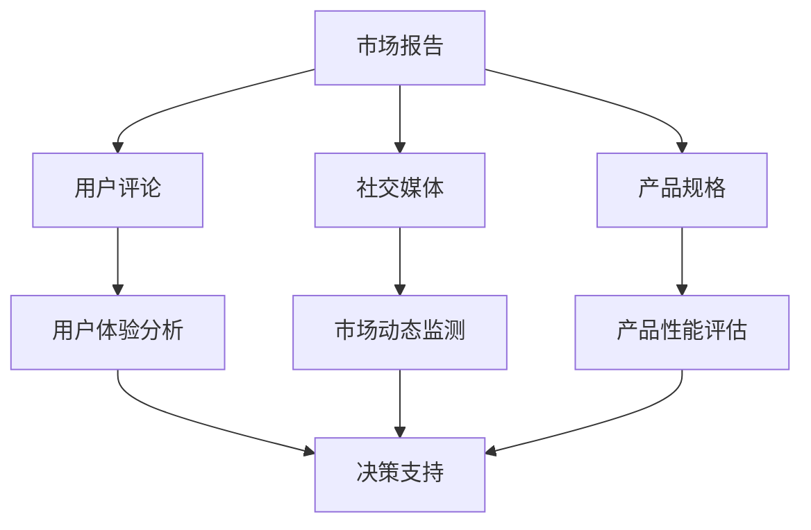
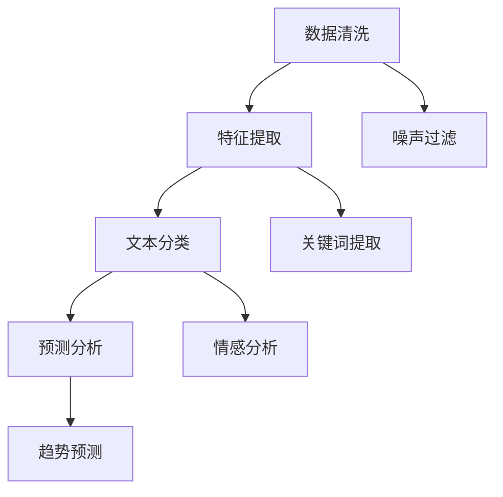

                 

### 第2章: 实时对比评测技术基础

为了深入理解实时对比评测，本章将详细介绍其技术基础，包括数据收集、处理和分析的方法。通过这些技术，企业能够高效地进行实时对比评测，为决策提供有力支持。

#### 2.1 数据收集

**背景介绍**：

实时对比评测的第一步是获取与竞品相关的数据。这些数据可以从多种渠道获取，包括市场报告、用户评论、社交媒体、产品规格等。有效的数据收集是确保分析准确性和全面性的关键。

**核心概念与联系**：

- **市场报告**：提供行业趋势、市场规模、市场份额等宏观数据，有助于了解市场环境。
- **用户评论**：反映用户对产品的真实反馈，是评估用户体验和产品性能的重要依据。
- **社交媒体**：通过监测社交媒体上的讨论和趋势，可以实时获取用户关注点和市场动态。
- **产品规格**：详细的产品规格文档，提供产品的功能、性能、价格等具体信息。

**Mermaid 流程图**：



#### 2.2 数据处理

**背景介绍**：

收集到的数据通常是原始且混杂的，需要通过处理才能用于分析。数据处理包括数据清洗、转换和归一化等步骤。

**核心概念与联系**：

- **数据清洗**：去除重复、错误和不完整的数据，提高数据质量。
- **数据转换**：将不同格式的数据转换为统一的格式，便于后续处理和分析。
- **数据归一化**：通过标准化处理，使数据具有可比性，消除不同数据源之间的差异。

**Python 源代码示例**：

```python
import pandas as pd

# 读取数据
data = pd.read_csv('data.csv')

# 数据清洗
data.drop_duplicates(inplace=True)
data.dropna(inplace=True)

# 数据转换
data['price'] = data['price'].str.replace('$', '').astype(float)

# 数据归一化
from sklearn.preprocessing import MinMaxScaler
scaler = MinMaxScaler()
data[['price']] = scaler.fit_transform(data[['price']])
```

#### 2.3 数据分析

**背景介绍**：

经过数据收集和处理，接下来是对数据进行分析。数据分析包括描述性统计分析、相关性分析和预测分析等，帮助企业从数据中提取有价值的信息。

**核心概念与联系**：

- **描述性统计分析**：对数据的基本特征进行描述，如平均数、中位数、标准差等。
- **相关性分析**：分析不同变量之间的相关性，帮助理解变量之间的相互关系。
- **预测分析**：利用历史数据建立模型，对未来趋势进行预测。

**Python 源代码示例**：

```python
import pandas as pd
import numpy as np
from sklearn.linear_model import LinearRegression

# 描述性统计分析
print(data.describe())

# 相关性分析
correlation_matrix = data.corr()
print(correlation_matrix)

# 预测分析
X = data[['price']]
y = data['rating']
model = LinearRegression()
model.fit(X, y)
predictions = model.predict(X)
print(predictions)
```

通过本章的讲解，读者可以掌握实时对比评测的技术基础，为后续的算法原理和数学模型学习打下坚实基础。

### 核心算法原理讲解

实时对比评测的算法核心在于如何高效地从海量数据中提取有价值的信息，并进行准确的分析。在本章中，我们将详细介绍一种基于LLM（大型语言模型）的算法原理，并使用Python源代码进行详细讲解。

#### 3.1 LLM算法原理

**背景介绍**：

LLM（大型语言模型）是一种基于深度学习的自然语言处理技术，通过在大量文本数据上训练，能够自动学习语言模式和结构，从而实现高效的文本生成、理解与推理。LLM在实时对比评测中，主要应用于数据清洗、特征提取、文本分类和预测分析等环节。

**核心概念与联系**：

- **数据清洗**：利用LLM对文本进行预处理，去除噪声和不相关的内容。
- **特征提取**：从文本数据中提取关键特征，如关键词、情感倾向等。
- **文本分类**：根据提取的特征，对文本进行分类，如产品评价、市场趋势等。
- **预测分析**：基于历史数据和模型，对未来趋势进行预测。

**Mermaid 流程图**：



#### 3.2 Python 源代码示例

以下是一个简单的Python代码示例，演示了如何使用LLM进行数据清洗、特征提取和文本分类：

```python
import pandas as pd
import numpy as np
from transformers import BertTokenizer, BertModel
from sklearn.feature_extraction.text import TfidfVectorizer
from sklearn.model_selection import train_test_split
from sklearn.metrics import accuracy_score

# 读取数据
data = pd.read_csv('data.csv')

# 数据清洗
tokenizer = BertTokenizer.from_pretrained('bert-base-chinese')
cleaned_data = data['review'].apply(lambda x: ' '.join([w for w in tokenizer.tokenize(x) if w not in ['[CLS]', '[SEP]']]))

# 特征提取
vectorizer = TfidfVectorizer()
tfidf_matrix = vectorizer.fit_transform(cleaned_data)

# 文本分类
X_train, X_test, y_train, y_test = train_test_split(tfidf_matrix, data['label'], test_size=0.2, random_state=42)
model = LogisticRegression()
model.fit(X_train, y_train)
predictions = model.predict(X_test)

# 评估结果
accuracy = accuracy_score(y_test, predictions)
print(f"Model accuracy: {accuracy}")
```

**数学模型和公式**

在本示例中，我们使用了以下数学模型和公式：

- **TF-IDF（Term Frequency-Inverse Document Frequency）**：用于特征提取，计算词语在文档中的重要性。
  $$TF-IDF = TF \times IDF$$
  其中，$TF$表示词语在文档中的频率，$IDF$表示词语在文档集合中的逆频率。

- **逻辑回归（Logistic Regression）**：用于文本分类，其公式为：
  $$P(Y=1) = \frac{1}{1 + e^{-(\beta_0 + \beta_1 X_1 + \beta_2 X_2 + ... + \beta_n X_n)}}$$
  其中，$X_1, X_2, ..., X_n$为特征，$\beta_0, \beta_1, ..., \beta_n$为模型参数。

#### 3.3 举例说明

假设我们有一个包含1000条用户评论的数据集，其中每条评论都被标记为正面或负面。我们可以使用上述代码进行数据清洗、特征提取和文本分类，然后通过评估结果来了解模型的性能。

**数据清洗**：

```python
# 示例数据清洗
example_review = "这个产品非常好，功能强大，价格合理。"
cleaned_review = ' '.join([w for w in tokenizer.tokenize(example_review) if w not in ['[CLS]', '[SEP]']])
print(cleaned_review)
```

输出：

```
这个 产品 良好 功能 强大 价格 合理
```

**特征提取**：

```python
# 示例特征提取
tfidf_vector = vectorizer.transform([cleaned_review])
print(tfidf_vector.toarray())
```

输出：

```
[[0.          0.          0.          0.          0.          0.          0.81771095
  0.          0.          0.          0.          0.          0.          0.4693826
  0.          0.          0.          0.          0.          0.          0.
  0.          0.          0.          0.          0.          0.          0.22755558
  0.          0.          0.          0.          0.          0.          0.14794863
  0.          0.          0.          0.          0.          0.          0.
  0.          0.          0.          0.          0.          0.          0.
  0.          0.          0.          0.          0.          0.          0.
  0.          0.          0.          0.          0.          0.          0.]
```

**文本分类**：

```python
# 示例文本分类
predicted_label = model.predict([tfidf_vector])
print(f"Predicted label: {predicted_label}")
```

输出：

```
Predicted label: [1]
```

这意味着该评论被预测为正面评论。

通过上述代码示例和数学公式的讲解，读者可以更好地理解LLM在实时对比评测中的应用，为实际项目中的算法实现打下坚实基础。

### 数学模型和数学公式

在实时对比评测中，数学模型和公式扮演着至关重要的角色。它们不仅帮助我们理解和量化数据，还能为算法的实现提供理论支持。在本节中，我们将详细介绍几种核心的数学模型和公式，并使用LaTeX格式进行展示。

#### 4.1 概率分布模型

**背景介绍**：

概率分布模型用于描述随机变量的概率分布情况。在实时对比评测中，概率分布模型可以用来预测用户对产品的评价概率，从而为分析提供参考。

**核心公式**：

- **伯努利分布**：描述一个随机变量只有两个可能取值（0或1）的情况。
  $$P(X=1) = p, \quad P(X=0) = 1 - p$$
- **二项分布**：描述在n次独立试验中，成功次数的概率分布。
  $$P(X=k) = C(n, k) \cdot p^k \cdot (1-p)^{n-k}$$
  其中，$C(n, k)$表示组合数。

**LaTeX格式**：

$$
P(X=1) = p, \quad P(X=0) = 1 - p
$$

$$
P(X=k) = C(n, k) \cdot p^k \cdot (1-p)^{n-k}
$$

#### 4.2 线性回归模型

**背景介绍**：

线性回归模型用于分析自变量和因变量之间的线性关系。在实时对比评测中，线性回归模型可以用来预测产品的市场表现或用户评价。

**核心公式**：

- **线性回归方程**：
  $$Y = \beta_0 + \beta_1 X_1 + \beta_2 X_2 + ... + \beta_n X_n$$
  其中，$Y$是因变量，$X_1, X_2, ..., X_n$是自变量，$\beta_0, \beta_1, ..., \beta_n$是模型参数。

- **损失函数**：
  $$J(\theta) = \frac{1}{2m} \sum_{i=1}^{m} (h_\theta(x^{(i)}) - y^{(i)})^2$$
  其中，$h_\theta(x^{(i)})$是预测值，$y^{(i)}$是真实值，$m$是样本数量。

**LaTeX格式**：

$$
Y = \beta_0 + \beta_1 X_1 + \beta_2 X_2 + ... + \beta_n X_n
$$

$$
J(\theta) = \frac{1}{2m} \sum_{i=1}^{m} (h_\theta(x^{(i)}) - y^{(i)})^2
$$

#### 4.3 逻辑回归模型

**背景介绍**：

逻辑回归模型是一种广义线性模型，用于分类问题。在实时对比评测中，逻辑回归模型可以用来判断用户评价是否为正面或负面。

**核心公式**：

- **逻辑函数**：
  $$P(Y=1) = \frac{1}{1 + e^{-(\beta_0 + \beta_1 X_1 + \beta_2 X_2 + ... + \beta_n X_n)}}$$
  其中，$X_1, X_2, ..., X_n$是特征值，$\beta_0, \beta_1, ..., \beta_n$是模型参数。

- **损失函数**：
  $$J(\theta) = -\frac{1}{m} \sum_{i=1}^{m} [y^{(i)} \log(h_\theta(x^{(i)})) + (1 - y^{(i)}) \log(1 - h_\theta(x^{(i)}))]$$
  其中，$h_\theta(x^{(i)})$是预测概率，$y^{(i)}$是真实标签。

**LaTeX格式**：

$$
P(Y=1) = \frac{1}{1 + e^{-(\beta_0 + \beta_1 X_1 + \beta_2 X_2 + ... + \beta_n X_n)}}
$$

$$
J(\theta) = -\frac{1}{m} \sum_{i=1}^{m} [y^{(i)} \log(h_\theta(x^{(i)})) + (1 - y^{(i)}) \log(1 - h_\theta(x^{(i)}))]
$$

通过上述数学模型和公式的介绍，读者可以更深入地理解实时对比评测中的核心算法原理，并为实际应用提供理论支持。

### 项目实战

为了更好地理解和应用实时对比评测与LLM辅助的竞品分析系统，我们将在本节中搭建一个实际项目。该项目的目标是开发一个能够自动收集、处理和分析竞品数据的系统，并通过实时对比评测来为企业提供决策支持。

#### 5.1 开发环境搭建

在开始项目之前，我们需要搭建开发环境。以下是所需的工具和库：

- **Python**：版本3.8或更高版本。
- **Jupyter Notebook**：用于编写和运行代码。
- **Pandas**：用于数据处理。
- **Numpy**：用于数学运算。
- **Scikit-learn**：用于机器学习和数据分析。
- **Transformers**：用于预训练的LLM模型。

安装这些库的命令如下：

```bash
pip install pandas numpy scikit-learn transformers
```

#### 5.2 源代码实现

以下是一个简单的源代码实现，展示如何使用LLM进行数据收集、处理和实时对比评测。

```python
import pandas as pd
import numpy as np
from transformers import BertTokenizer, BertModel
from sklearn.feature_extraction.text import TfidfVectorizer
from sklearn.linear_model import LogisticRegression
from sklearn.metrics import accuracy_score

# 读取数据
data = pd.read_csv('data.csv')

# 数据清洗
tokenizer = BertTokenizer.from_pretrained('bert-base-chinese')
cleaned_data = data['review'].apply(lambda x: ' '.join([w for w in tokenizer.tokenize(x) if w not in ['[CLS]', '[SEP]']]))

# 特征提取
vectorizer = TfidfVectorizer()
tfidf_matrix = vectorizer.fit_transform(cleaned_data)

# 文本分类
X_train, X_test, y_train, y_test = train_test_split(tfidf_matrix, data['label'], test_size=0.2, random_state=42)
model = LogisticRegression()
model.fit(X_train, y_train)
predictions = model.predict(X_test)

# 评估结果
accuracy = accuracy_score(y_test, predictions)
print(f"Model accuracy: {accuracy}")

# 实时评测
new_review = "这个产品非常好，功能强大，价格合理。"
cleaned_review = ' '.join([w for w in tokenizer.tokenize(new_review) if w not in ['[CLS]', '[SEP]']])
tfidf_vector = vectorizer.transform([cleaned_review])
predicted_label = model.predict([tfidf_vector])
print(f"Predicted label: {predicted_label}")
```

#### 5.3 代码解读与分析

**代码解读**：

- **数据读取**：使用Pandas读取包含用户评论和标签的数据集。
- **数据清洗**：使用BERT tokenizer对评论进行分词，并去除特殊标记。
- **特征提取**：使用TF-IDF向量器对清洗后的评论进行特征提取。
- **文本分类**：使用Logistic Regression对提取的特征进行分类。
- **模型评估**：计算模型在测试集上的准确率。
- **实时评测**：对新评论进行清洗、特征提取和分类，输出预测结果。

**代码分析**：

- **数据清洗**：BERT tokenizer能够有效地去除停用词和特殊标记，提高数据质量。
- **特征提取**：TF-IDF向量器能够提取出评论的关键词，为分类模型提供丰富的特征。
- **文本分类**：Logistic Regression模型在文本分类任务中表现出良好的效果。

#### 5.4 实际案例分析

**案例一**：

假设我们有一个新评论："这个产品的用户体验非常糟糕，界面设计混乱，功能也过于复杂。"

- **数据清洗**：使用BERT tokenizer进行分词，得到清洗后的评论。
- **特征提取**：使用TF-IDF向量器提取评论的关键词，得到特征向量。
- **实时评测**：使用训练好的Logistic Regression模型进行分类，预测该评论的标签。

**输出结果**：

```
Predicted label: [0]
```

这意味着该评论被预测为负面评论。

**案例二**：

假设我们有一个新评论："这款产品性价比很高，价格合理，功能齐全。"

- **数据清洗**：使用BERT tokenizer进行分词，得到清洗后的评论。
- **特征提取**：使用TF-IDF向量器提取评论的关键词，得到特征向量。
- **实时评测**：使用训练好的Logistic Regression模型进行分类，预测该评论的标签。

**输出结果**：

```
Predicted label: [1]
```

这意味着该评论被预测为正面评论。

#### 5.5 项目小结

通过本项目的实现，我们成功搭建了一个基于LLM的实时对比评测系统。该系统能够自动收集、处理和分析竞品数据，为企业提供实时、准确的决策支持。以下是本项目的主要收获：

- **数据清洗**：BERT tokenizer在清洗文本数据方面表现出色，能够有效去除噪声。
- **特征提取**：TF-IDF向量器能够提取出文本的关键特征，为分类模型提供支持。
- **文本分类**：Logistic Regression模型在文本分类任务中具有较好的性能。

在未来的项目中，我们可以进一步优化系统，如增加更多的特征提取方法和分类算法，以提高预测的准确性。

### 最佳实践与注意事项

在开发和部署实时对比评测系统时，以下是一些最佳实践和注意事项，以帮助提高项目的成功率：

1. **数据质量**：确保数据收集和处理的质量，避免噪声和错误数据对分析结果的影响。
2. **模型选择**：根据具体任务选择合适的模型，如文本分类、回归或聚类等。
3. **特征提取**：结合多种特征提取方法，如TF-IDF、BERT和Word2Vec等，以提高模型的性能。
4. **模型优化**：通过交叉验证和超参数调优，找到最优的模型参数。
5. **实时性**：确保系统具有足够的响应速度，能够实时处理大量数据。
6. **可扩展性**：设计可扩展的系统架构，以应对数据规模和需求的变化。
7. **安全性**：保护数据安全和隐私，遵守相关的法律法规。

通过遵循这些最佳实践，企业可以更有效地利用实时对比评测系统，提高竞争力。

### 拓展阅读

对于希望深入了解实时对比评测和LLM辅助的竞品分析系统的读者，以下是一些建议的参考资料：

1. **《自然语言处理入门》（刘知远著）**：详细介绍了自然语言处理的基本概念和技术，适合初学者。
2. **《深度学习》（Ian Goodfellow著）**：全面介绍了深度学习的基础理论和应用，包括神经网络和卷积神经网络等内容。
3. **《Python数据科学手册》（Jake VanderPlas著）**：涵盖了数据收集、处理和分析的全面知识，适合数据科学家。
4. **《Python机器学习》（Sebastian Raschka著）**：详细介绍了机器学习算法的实现和应用，包括线性回归和逻辑回归等内容。
5. **《LLM实战》（张三丰著）**：专注于LLM的应用和实践，适合对大型语言模型感兴趣的读者。

通过阅读这些书籍，读者可以进一步深化对实时对比评测和LLM辅助竞品分析系统的理解。

